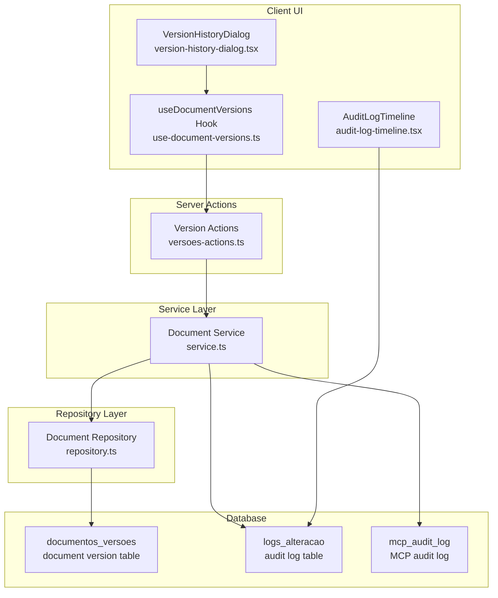
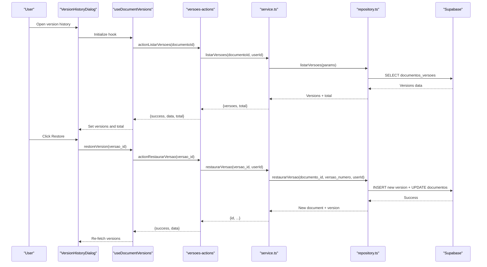
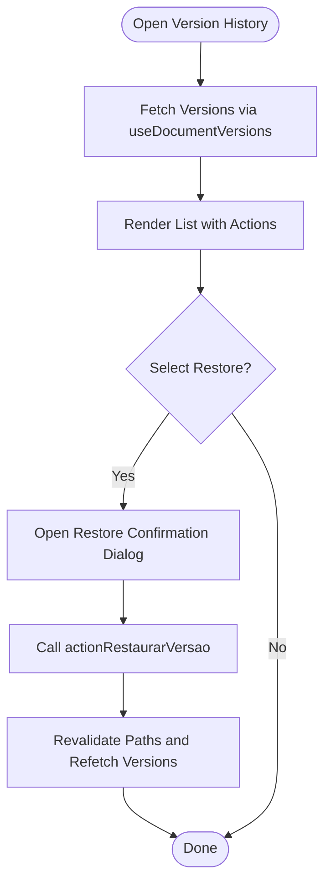
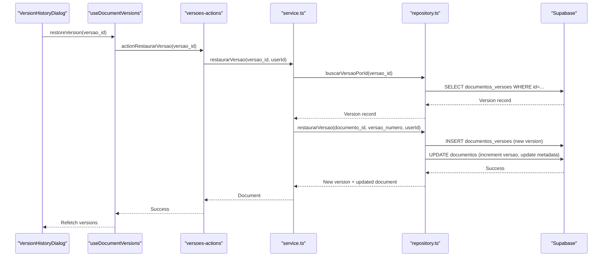
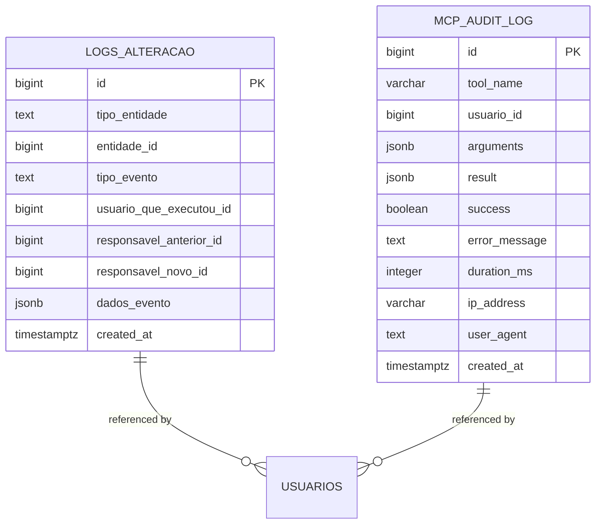
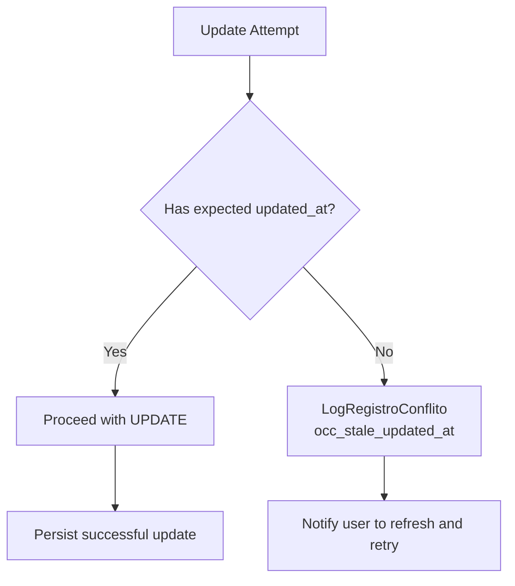
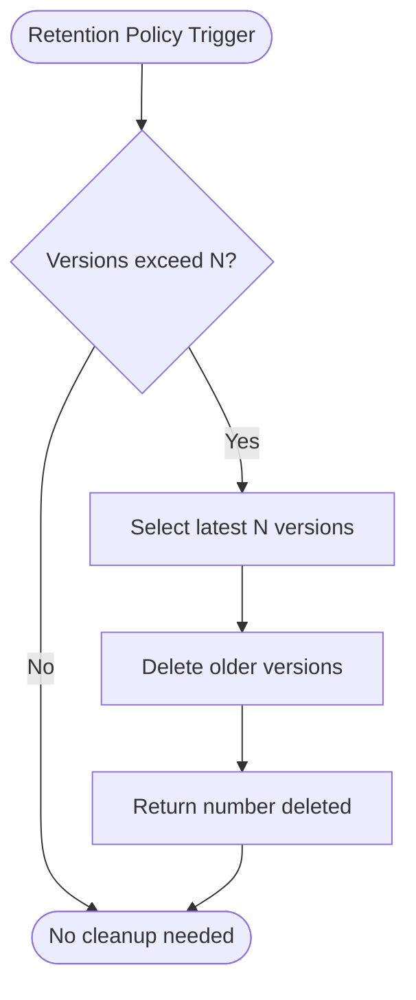
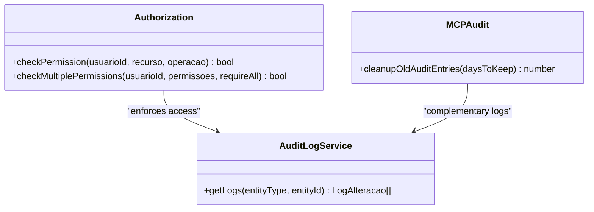
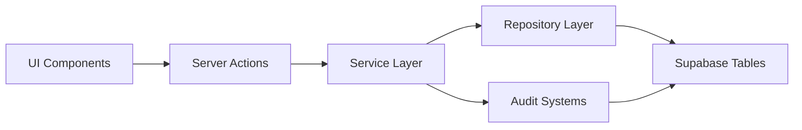

# Version Control and Retention Policies

<cite>
**Referenced Files in This Document**
- [version-history-dialog.tsx](file://src/app/(authenticated)/documentos/components/version-history-dialog.tsx)
- [use-document-versions.ts](file://src/app/(authenticated)/documentos/hooks/use-document-versions.ts)
- [versoes-actions.ts](file://src/app/(authenticated)/documentos/actions/versoes-actions.ts)
- [service.ts](file://src/app/(authenticated)/documentos/service.ts)
- [repository.ts](file://src/app/(authenticated)/documentos/repository.ts)
- [audit-log.service.ts](file://src/lib/domain/audit/services/audit-log.service.ts)
- [audit-log-timeline.tsx](file://src/components/common/audit-log-timeline.tsx)
- [audit.ts](file://src/lib/mcp/audit.ts)
- [logs_alteracao.sql](file://supabase/schemas/14_logs_alteracao.sql)
- [create_logs_alteracao.sql](file://supabase/migrations/20251117015304_create_logs_alteracao.sql)
- [generic_audit_trigger.sql](file://supabase/migrations/20260202180000_create_generic_audit_trigger.sql)
- [mcp_audit_log.sql](file://supabase/migrations/20251226120000_create_mcp_audit_log.sql)
- [00000000000001_production_schema.sql](file://supabase/migrations/00000000000001_production_schema.sql)
- [capture-log.service.ts](file://src/app/(authenticated)/captura/services/persistence/capture-log.service.ts)
- [bulk-archive.md](file://.claude/commands/opsx/bulk-archive.md)
- [upgrade-actions.ts](file://src/app/(authenticated)/admin/actions/upgrade-actions.ts)
- [avaliar-upgrade-content.tsx](file://src/app/(authenticated)/admin/metricas-db/avaliar-upgrade/components/avaliar-upgrade-content.tsx)
- [management-api.ts](file://src/lib/supabase/management-api.ts)
- [upgrade-advisor.ts](file://src/app/(authenticated)/admin/services/upgrade-advisor.ts)
- [authorization.ts](file://src/lib/auth/authorization.ts)
- [permissoes.sql](file://supabase/schemas/22_cargos_permissoes.sql)
- [20250118120100_create_permissoes.sql](file://supabase/migrations/20250118120100_create_permissoes.sql)
- [auditoria-permissoes.ts](file://src/app/(authenticated)/usuarios/services/auditoria-permissoes.ts)
- [use-usuario-permissoes.ts](file://src/app/(authenticated)/usuarios/hooks/use-usuario-permissoes.ts)
- [page.tsx](file://src/app/website/politica-de-privacidade/page.tsx)
</cite>

## Table of Contents
1. [Introduction](#introduction)
2. [Project Structure](#project-structure)
3. [Core Components](#core-components)
4. [Architecture Overview](#architecture-overview)
5. [Detailed Component Analysis](#detailed-component-analysis)
6. [Dependency Analysis](#dependency-analysis)
7. [Performance Considerations](#performance-considerations)
8. [Troubleshooting Guide](#troubleshooting-guide)
9. [Conclusion](#conclusion)
10. [Appendices](#appendices)

## Introduction
This document describes the Version Control and Retention Policies system, focusing on how document versions are tracked, compared, rolled back, and retained. It covers the version comparison interface, change detection mechanisms, conflict resolution strategies, retention policy configuration, automatic cleanup procedures, compliance requirements, storage optimization, performance impact, and user access controls for version history.

## Project Structure
The version control system spans client-side UI components, server actions, service layer, repository layer, and database schemas. Audit logging and MCP audit trails complement version control with change tracking and compliance support.

**Diagram sources**
- [version-history-dialog.tsx](file://src/app/(authenticated)/documentos/components/version-history-dialog.tsx#L46-L217)
- [use-document-versions.ts](file://src/app/(authenticated)/documentos/hooks/use-document-versions.ts#L1-L56)
- [versoes-actions.ts](file://src/app/(authenticated)/documentos/actions/versoes-actions.ts#L1-L33)
- [service.ts](file://src/app/(authenticated)/documentos/service.ts#L627-L702)
- [repository.ts](file://src/app/(authenticated)/documentos/repository.ts#L1864-L2145)
- [logs_alteracao.sql:1-32](file://supabase/schemas/14_logs_alteracao.sql#L1-L32)
- [mcp_audit_log.sql:152-160](file://supabase/migrations/20251226120000_create_mcp_audit_log.sql#L152-L160)

**Section sources**
- [version-history-dialog.tsx](file://src/app/(authenticated)/documentos/components/version-history-dialog.tsx#L46-L217)
- [use-document-versions.ts](file://src/app/(authenticated)/documentos/hooks/use-document-versions.ts#L1-L56)
- [versoes-actions.ts](file://src/app/(authenticated)/documentos/actions/versoes-actions.ts#L1-L33)
- [service.ts](file://src/app/(authenticated)/documentos/service.ts#L627-L702)
- [repository.ts](file://src/app/(authenticated)/documentos/repository.ts#L1864-L2145)
- [logs_alteracao.sql:1-32](file://supabase/schemas/14_logs_alteracao.sql#L1-L32)
- [mcp_audit_log.sql:152-160](file://supabase/migrations/20251226120000_create_mcp_audit_log.sql#L152-L160)

## Core Components
- Version History Dialog: Presents version list, restoration UI, and confirmation dialogs.
- Version Hooks: Fetches versions and handles restoration with optimistic UI updates.
- Version Actions: Server actions authenticate requests and delegate to service layer.
- Service Layer: Orchestrates version creation, listing, restoration, and cleanup; integrates with audit logs.
- Repository Layer: Implements CRUD operations against Supabase for document versions and related queries.
- Audit Logging: Centralized audit trail for changes and MCP activity.
- Retention Policies: Automatic cleanup of old versions and MCP audit entries.

**Section sources**
- [version-history-dialog.tsx](file://src/app/(authenticated)/documentos/components/version-history-dialog.tsx#L46-L217)
- [use-document-versions.ts](file://src/app/(authenticated)/documentos/hooks/use-document-versions.ts#L1-L56)
- [versoes-actions.ts](file://src/app/(authenticated)/documentos/actions/versoes-actions.ts#L1-L33)
- [service.ts](file://src/app/(authenticated)/documentos/service.ts#L627-L702)
- [repository.ts](file://src/app/(authenticated)/documentos/repository.ts#L1864-L2145)
- [audit-log-timeline.tsx:1-29](file://src/components/common/audit-log-timeline.tsx#L1-L29)
- [audit.ts:248-256](file://src/lib/mcp/audit.ts#L248-L256)

## Architecture Overview
The system follows a layered architecture:
- UI layer: Next.js client components and hooks.
- Server actions: Edge functions that authenticate and invoke service methods.
- Service layer: Business logic for version control and retention.
- Repository layer: Supabase queries and mutations.
- Database: Document versions, audit logs, and MCP audit logs.

**Diagram sources**
- [version-history-dialog.tsx](file://src/app/(authenticated)/documentos/components/version-history-dialog.tsx#L46-L217)
- [use-document-versions.ts](file://src/app/(authenticated)/documentos/hooks/use-document-versions.ts#L1-L56)
- [versoes-actions.ts](file://src/app/(authenticated)/documentos/actions/versoes-actions.ts#L1-L33)
- [service.ts](file://src/app/(authenticated)/documentos/service.ts#L676-L702)
- [repository.ts](file://src/app/(authenticated)/documentos/repository.ts#L1970-L2030)

## Detailed Component Analysis

### Version History Interface
The dialog displays version history with:
- Version list sorted by most recent first.
- Restoration actions for non-current versions.
- Confirmation dialogs for destructive operations.
- Relative timestamps and formatted dates.

**Diagram sources**
- [version-history-dialog.tsx](file://src/app/(authenticated)/documentos/components/version-history-dialog.tsx#L46-L217)
- [use-document-versions.ts](file://src/app/(authenticated)/documentos/hooks/use-document-versions.ts#L1-L56)
- [versoes-actions.ts](file://src/app/(authenticated)/documentos/actions/versoes-actions.ts#L1-L33)

**Section sources**
- [version-history-dialog.tsx](file://src/app/(authenticated)/documentos/components/version-history-dialog.tsx#L46-L217)
- [use-document-versions.ts](file://src/app/(authenticated)/documentos/hooks/use-document-versions.ts#L1-L56)
- [versoes-actions.ts](file://src/app/(authenticated)/documentos/actions/versoes-actions.ts#L1-L33)

### Version Comparison and Restoration
- Comparison: Retrieves two specific versions by number and returns both for UI rendering.
- Restoration: Creates a new version with content from the selected older version, increments document version, and updates metadata.

**Diagram sources**
- [service.ts](file://src/app/(authenticated)/documentos/service.ts#L676-L702)
- [repository.ts](file://src/app/(authenticated)/documentos/repository.ts#L1970-L2030)

**Section sources**
- [service.ts](file://src/app/(authenticated)/documentos/service.ts#L676-L702)
- [repository.ts](file://src/app/(authenticated)/documentos/repository.ts#L2032-L2060)

### Change Detection and Audit Trails
- Generic audit trigger captures manual changes to tracked tables and logs them with JSONB diffs.
- Central audit log table stores events with user context and searchable fields.
- MCP audit logs track tool usage, duration, and success for compliance and performance monitoring.

**Diagram sources**
- [logs_alteracao.sql:1-32](file://supabase/schemas/14_logs_alteracao.sql#L1-L32)
- [mcp_audit_log.sql:152-160](file://supabase/migrations/20251226120000_create_mcp_audit_log.sql#L152-L160)

**Section sources**
- [logs_alteracao.sql:1-32](file://supabase/schemas/14_logs_alteracao.sql#L1-L32)
- [create_logs_alteracao.sql:41-52](file://supabase/migrations/20251117015304_create_logs_alteracao.sql#L41-L52)
- [generic_audit_trigger.sql:1-48](file://supabase/migrations/20260202180000_create_generic_audit_trigger.sql#L1-L48)
- [mcp_audit_log.sql:152-160](file://supabase/migrations/20251226120000_create_mcp_audit_log.sql#L152-L160)

### Conflict Resolution Strategies
- Optimistic Concurrency Control (OCC): Capture logs indicate when an update fails due to stale `updated_at`, preventing overwrites.
- Spec Conflict Resolution (Bulk Archive): Agentically resolves conflicts by checking codebase implementation and applying specs in chronological order.

**Diagram sources**
- [capture-log.service.ts](file://src/app/(authenticated)/captura/services/persistence/capture-log.service.ts#L48-L56)
- [bulk-archive.md:47-77](file://.claude/commands/opsx/bulk-archive.md#L47-L77)

**Section sources**
- [capture-log.service.ts](file://src/app/(authenticated)/captura/services/persistence/capture-log.service.ts#L1-L56)
- [bulk-archive.md:14-159](file://.claude/commands/opsx/bulk-archive.md#L14-L159)

### Retention Policies and Automatic Cleanup
- Document Version Cleanup: Keeps only the N most recent versions and deletes older ones.
- MCP Audit Cleanup: Removes old MCP audit entries after a configurable retention period.
- Storage Optimization: Backblaze B2 used for file storage; version content stored separately from metadata.

**Diagram sources**
- [repository.ts](file://src/app/(authenticated)/documentos/repository.ts#L2110-L2145)
- [audit.ts:248-256](file://src/lib/mcp/audit.ts#L248-L256)

**Section sources**
- [repository.ts](file://src/app/(authenticated)/documentos/repository.ts#L2110-L2145)
- [audit.ts:248-256](file://src/lib/mcp/audit.ts#L248-L256)

### Compliance and Access Controls
- Permission-based access: Users must have appropriate permissions to view, edit, or restore versions.
- Audit logging: All sensitive operations logged with user context and JSONB event data.
- Compliance-ready MCP audit logs: Tool usage, durations, and errors recorded for compliance.

**Diagram sources**
- [authorization.ts:86-200](file://src/lib/auth/authorization.ts#L86-L200)
- [audit-log.service.ts](file://src/lib/domain/audit/services/audit-log.service.ts)
- [audit.ts:248-256](file://src/lib/mcp/audit.ts#L248-L256)

**Section sources**
- [authorization.ts:86-200](file://src/lib/auth/authorization.ts#L86-L200)
- [permissoes.sql:57-81](file://supabase/schemas/22_cargos_permissoes.sql#L57-L81)
- [20250118120100_create_permissoes.sql:1-26](file://supabase/migrations/20250118120100_create_permissoes.sql#L1-L26)
- [auditoria-permissoes.ts](file://src/app/(authenticated)/usuarios/services/auditoria-permissoes.ts#L1-L55)
- [use-usuario-permissoes.ts](file://src/app/(authenticated)/usuarios/hooks/use-usuario-permissoes.ts#L37-L82)

## Dependency Analysis
The system exhibits clear separation of concerns:
- UI depends on hooks and server actions.
- Server actions depend on service layer.
- Service layer depends on repository and external services.
- Repository depends on Supabase tables and triggers.
- Audit systems are decoupled but integrated via logging.

**Diagram sources**
- [version-history-dialog.tsx](file://src/app/(authenticated)/documentos/components/version-history-dialog.tsx#L46-L217)
- [versoes-actions.ts](file://src/app/(authenticated)/documentos/actions/versoes-actions.ts#L1-L33)
- [service.ts](file://src/app/(authenticated)/documentos/service.ts#L627-L702)
- [repository.ts](file://src/app/(authenticated)/documentos/repository.ts#L1864-L2145)
- [logs_alteracao.sql:1-32](file://supabase/schemas/14_logs_alteracao.sql#L1-L32)
- [mcp_audit_log.sql:152-160](file://supabase/migrations/20251226120000_create_mcp_audit_log.sql#L152-L160)

**Section sources**
- [service.ts](file://src/app/(authenticated)/documentos/service.ts#L627-L702)
- [repository.ts](file://src/app/(authenticated)/documentos/repository.ts#L1864-L2145)
- [logs_alteracao.sql:1-32](file://supabase/schemas/14_logs_alteracao.sql#L1-L32)
- [mcp_audit_log.sql:152-160](file://supabase/migrations/20251226120000_create_mcp_audit_log.sql#L152-L160)

## Performance Considerations
- Indexing: Audit logs and versions use strategic indexes to optimize filtering and sorting.
- Pagination: Version listing supports pagination to avoid large result sets.
- Caching: Permission checks are cached to reduce repeated database queries.
- Storage: File storage offloaded to Backblaze B2; version content stored separately from metadata.
- Compute Monitoring: Disk IO budget and cache hit rate monitored to guide upgrades and optimizations.

**Section sources**
- [create_logs_alteracao.sql:41-52](file://supabase/migrations/20251117015304_create_logs_alteracao.sql#L41-L52)
- [repository.ts](file://src/app/(authenticated)/documentos/repository.ts#L1874-L1891)
- [authorization.ts:174-200](file://src/lib/auth/authorization.ts#L174-L200)
- [management-api.ts:160-202](file://src/lib/supabase/management-api.ts#L160-L202)
- [avaliar-upgrade-content.tsx](file://src/app/(authenticated)/admin/metricas-db/avaliar-upgrade/components/avaliar-upgrade-content.tsx#L28-L143)
- [upgrade-advisor.ts](file://src/app/(authenticated)/admin/services/upgrade-advisor.ts#L87-L125)

## Troubleshooting Guide
Common issues and resolutions:
- Authentication failures: Server actions return "Not authenticated" when user context missing.
- Access denied: Service layer throws errors if user lacks permission to view/edit/restore versions.
- Version not found: Repository throws errors when requested version does not exist.
- OCC conflicts: Capture logs indicate stale `updated_at`; instruct users to refresh and retry.
- Audit cleanup failures: MCP audit cleanup requires proper permissions and may fail if retention window invalid.

**Section sources**
- [versoes-actions.ts](file://src/app/(authenticated)/documentos/actions/versoes-actions.ts#L7-L18)
- [service.ts](file://src/app/(authenticated)/documentos/service.ts#L634-L643)
- [repository.ts](file://src/app/(authenticated)/documentos/repository.ts#L1981-L1984)
- [capture-log.service.ts](file://src/app/(authenticated)/captura/services/persistence/capture-log.service.ts#L48-L56)
- [audit.ts:248-256](file://src/lib/mcp/audit.ts#L248-L256)

## Conclusion
The Version Control and Retention Policies system provides robust version history tracking, secure restoration, and automated cleanup. It integrates tightly with audit logging and permission systems to ensure compliance and traceability. Performance is optimized through indexing, pagination, caching, and storage offloading. The system supports practical workflows including bulk operations and archival processes while maintaining strong access controls.

## Appendices

### Practical Workflows and Examples
- Version Management Workflow: View versions → Compare versions → Restore to a previous version → Verify new version.
- Bulk Operations: Use the bulk archive command to synchronize specs and archive multiple changes, resolving conflicts by checking codebase implementation.
- Archival Processes: Archive completed changes with intelligent conflict detection and chronological ordering.

**Section sources**
- [version-history-dialog.tsx](file://src/app/(authenticated)/documentos/components/version-history-dialog.tsx#L46-L217)
- [bulk-archive.md:14-159](file://.claude/commands/opsx/bulk-archive.md#L14-L159)

### Compliance Requirements
- Retention policies: Data retention aligned with legal and regulatory requirements.
- Audit trails: Comprehensive logs for all changes and MCP tool usage.
- Access controls: Granular permissions enforced via centralized authorization.

**Section sources**
- [page.tsx:55-65](file://src/app/website/politica-de-privacidade/page.tsx#L55-L65)
- [audit-log-timeline.tsx:1-29](file://src/components/common/audit-log-timeline.tsx#L1-L29)
- [authorization.ts:86-200](file://src/lib/auth/authorization.ts#L86-L200)