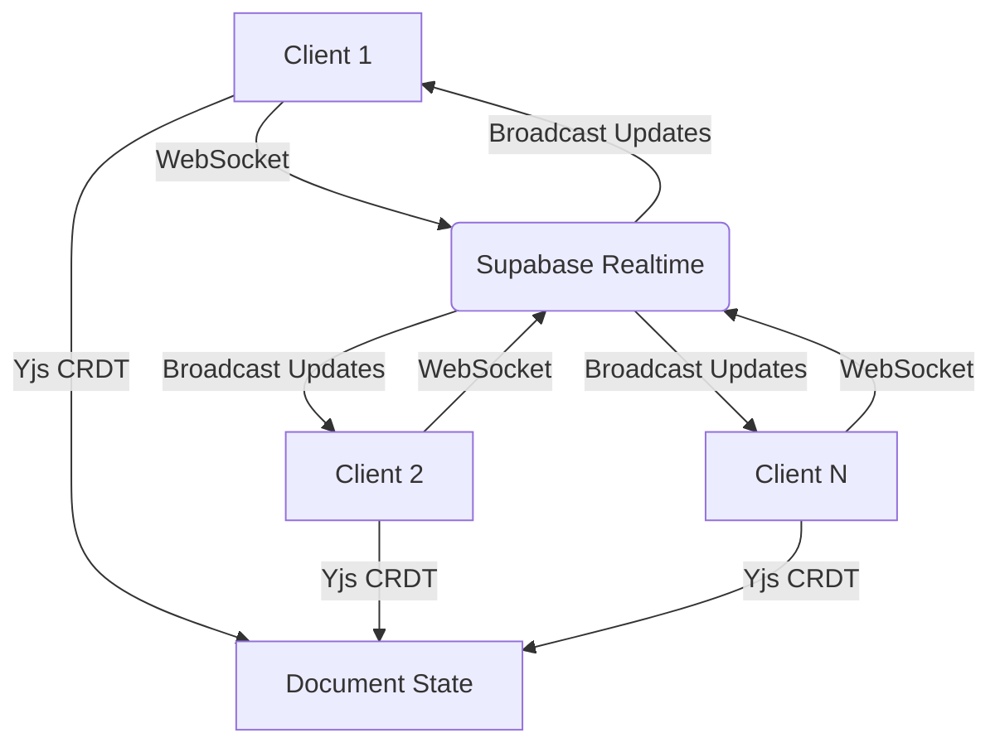
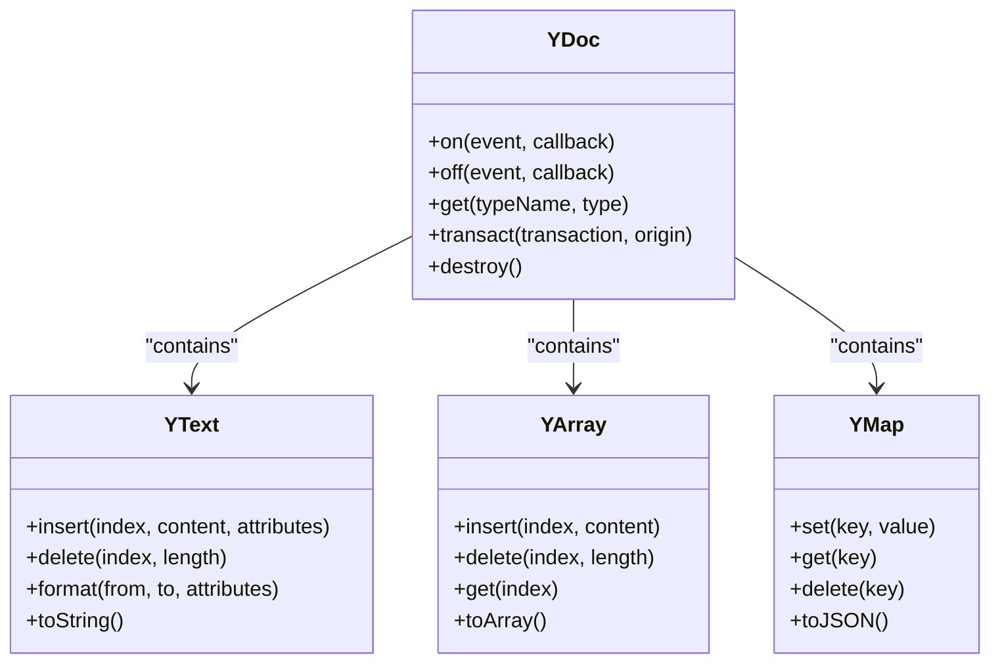
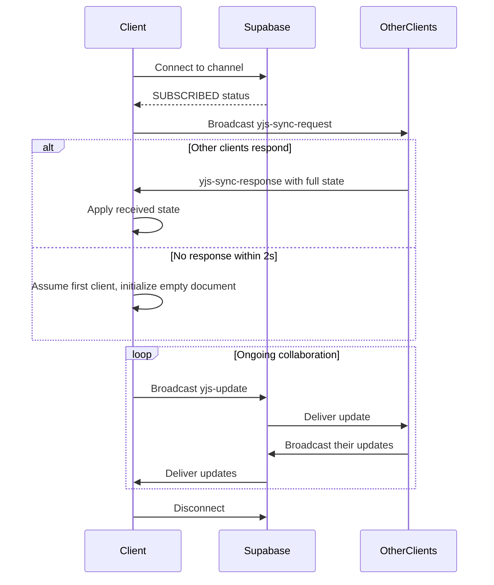
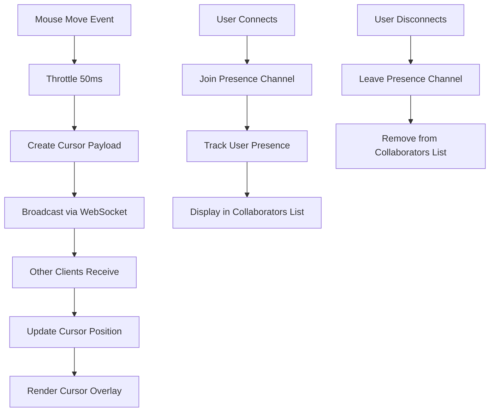
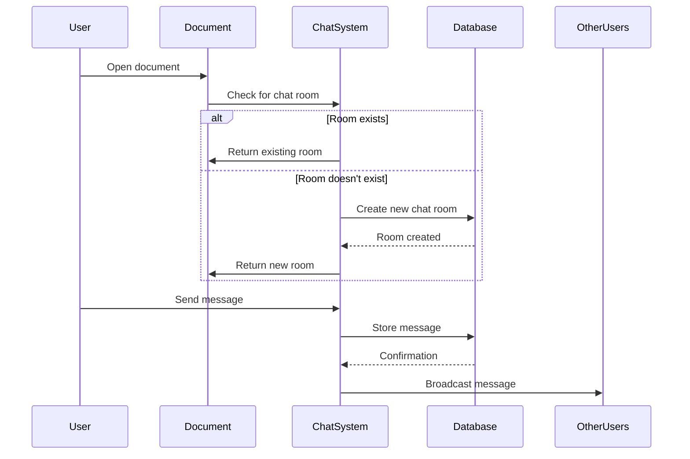
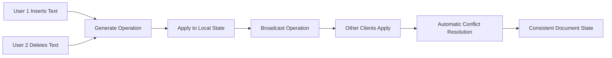
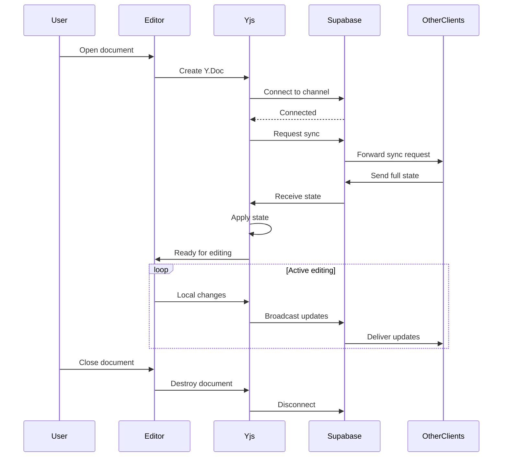
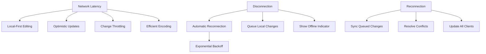

# Collaboration Features

<cite>
**Referenced Files in This Document**   
- [supabase-provider.ts](file://lib/yjs/supabase-provider.ts)
- [supabase-yjs-provider.ts](file://lib/yjs/supabase-yjs-provider.ts)
- [use-realtime-collaboration.ts](file://hooks/use-realtime-collaboration.ts)
- [use-yjs-collaboration.ts](file://hooks/use-yjs-collaboration.ts)
- [document-editor.tsx](file://components/documentos/document-editor.tsx)
- [collaborative-plate-editor.tsx](file://components/plate/collaborative-plate-editor.tsx)
- [document-chat.tsx](file://components/documentos/document-chat.tsx)
- [realtime-chat.tsx](file://components/realtime-chat.tsx)
- [chat-persistence.service.ts](file://backend/documentos/services/persistence/chat-persistence.service.ts)
- [route.ts](file://app/api/chat/salas/route.ts)
- [remote-cursors-overlay.tsx](file://components/documentos/remote-cursors-overlay.tsx)
- [realtime-cursors.tsx](file://components/realtime-cursors.tsx)
- [use-realtime-cursors.ts](file://hooks/use-realtime-cursors.ts)
</cite>

## Table of Contents
1. [Introduction](#introduction)
2. [Real-Time Collaboration System](#real-time-collaboration-system)
3. [CRDT Data Model and Yjs Implementation](#crdt-data-model-and-yjs-implementation)
4. [WebSocket Connection Management](#websocket-connection-management)
5. [Shared Cursors and Presence Indicators](#shared-cursors-and-presence-indicators)
6. [Chat Integration](#chat-integration)
7. [Conflict Resolution and Operational Transformation](#conflict-resolution-and-operational-transformation)
8. [Session Establishment and Maintenance](#session-establishment-and-maintenance)
9. [Network Latency and Disconnection Handling](#network-latency-and-disconnection-handling)
10. [Conclusion](#conclusion)

## Introduction
Sinesys implements a comprehensive real-time collaboration system that enables multiple users to simultaneously edit documents, view each other's presence, and communicate through integrated chat. The system is built on Yjs, a CRDT (Conflict-Free Replicated Data Type) framework, combined with Supabase Realtime for WebSocket-based communication. This documentation details the implementation of collaborative editing, shared cursors, presence indicators, and contextual chat integration within documents.

**Section sources**
- [supabase-yjs-provider.ts](file://lib/yjs/supabase-yjs-provider.ts#L1-L358)
- [use-realtime-collaboration.ts](file://hooks/use-realtime-collaboration.ts#L1-L169)

## Real-Time Collaboration System
The real-time collaboration system in Sinesys is built on Yjs, a JavaScript library that implements CRDTs for conflict-free data synchronization. The system uses Supabase Realtime as the transport layer, leveraging WebSockets to enable bidirectional communication between clients. When multiple users open the same document, they join a shared collaboration session where all changes are automatically synchronized.

The collaboration system is implemented through a custom Supabase provider that extends Yjs functionality. Each document has a unique channel name (e.g., `yjs:documento:{id}`) that clients subscribe to for receiving updates. The system supports both incremental updates and full state synchronization, ensuring that new participants can quickly catch up with the current document state.

**Diagram sources**
- [supabase-provider.ts](file://lib/yjs/supabase-provider.ts#L1-L250)
- [supabase-yjs-provider.ts](file://lib/yjs/supabase-yjs-provider.ts#L1-L358)

**Section sources**
- [supabase-provider.ts](file://lib/yjs/supabase-provider.ts#L1-L250)
- [supabase-yjs-provider.ts](file://lib/yjs/supabase-yjs-provider.ts#L1-L358)

## CRDT Data Model and Yjs Implementation
Sinesys uses Yjs as its CRDT implementation for document synchronization. Yjs provides automatic conflict resolution through its operational transformation algorithms, ensuring that concurrent edits from multiple users are merged correctly without conflicts. The CRDT data model represents the document as a shared, distributed data structure that can be modified independently by each client.

The implementation uses Y.Doc as the root document type, which contains shared types like Y.Text, Y.Array, and Y.Map to represent different parts of the document. When a user makes an edit, Yjs generates an update message containing the changes, which is then broadcast to other clients through Supabase Realtime. Each client applies these updates to their local document instance, maintaining consistency across all participants.

The system also implements local persistence using IndexedDB through Y-IndexedDB, allowing users to continue working offline. When connectivity is restored, local changes are automatically synchronized with the server and other clients.

**Diagram sources**
- [supabase-yjs-provider.ts](file://lib/yjs/supabase-yjs-provider.ts#L8-L22)
- [use-yjs-collaboration.ts](file://hooks/use-yjs-collaboration.ts#L10-L15)

**Section sources**
- [supabase-yjs-provider.ts](file://lib/yjs/supabase-yjs-provider.ts#L8-L22)
- [use-yjs-collaboration.ts](file://hooks/use-yjs-collaboration.ts#L10-L15)

## WebSocket Connection Management
WebSocket connection management in Sinesys is handled through Supabase Realtime channels. The system establishes a persistent WebSocket connection when a user opens a document and maintains this connection for the duration of the editing session. The connection is managed by the SupabaseProvider class, which handles connection lifecycle events including connection, disconnection, and error handling.

The implementation includes several mechanisms to ensure reliable connectivity:
- Automatic reconnection attempts when the connection is lost
- Heartbeat monitoring to detect connection issues
- Local change queuing during network outages
- Full state synchronization when a client reconnects

When a client connects to a document channel, it first requests the current document state from other connected clients. If no response is received within 2 seconds, it assumes it is the first client and proceeds with an empty document. This timeout mechanism prevents indefinite waiting when no other clients are present.

**Diagram sources**
- [supabase-provider.ts](file://lib/yjs/supabase-provider.ts#L50-L118)
- [supabase-yjs-provider.ts](file://lib/yjs/supabase-yjs-provider.ts#L134-L191)

**Section sources**
- [supabase-provider.ts](file://lib/yjs/supabase-provider.ts#L50-L118)
- [supabase-yjs-provider.ts](file://lib/yjs/supabase-yjs-provider.ts#L134-L191)

## Shared Cursors and Presence Indicators
Sinesys implements shared cursors and presence indicators to show which team members are viewing or editing a document. The system uses Supabase Realtime presence tracking to monitor user activity and broadcast cursor positions. Each user is assigned a unique color from a predefined palette, ensuring visual distinction between collaborators.

The implementation consists of two main components:
1. **Presence tracking**: Uses Supabase Realtime presence functionality to track which users are connected to a document
2. **Cursor synchronization**: Broadcasts cursor positions through WebSocket messages

When a user moves their mouse within the document editor, the position is throttled and broadcast to other clients. The receiving clients render these cursors as floating indicators with the user's name and avatar. The system also displays presence indicators in the document toolbar, showing avatars of all currently connected users.

**Diagram sources**
- [use-realtime-cursors.ts](file://hooks/use-realtime-cursors.ts#L44-L176)
- [realtime-cursors.tsx](file://components/realtime-cursors.tsx#L1-L29)
- [remote-cursors-overlay.tsx](file://components/documentos/remote-cursors-overlay.tsx#L1-L47)

**Section sources**
- [use-realtime-cursors.ts](file://hooks/use-realtime-cursors.ts#L44-L176)
- [realtime-cursors.tsx](file://components/realtime-cursors.tsx#L1-L29)

## Chat Integration
Sinesys includes contextual chat integration that enables discussions within documents. Each document has an associated chat room that is automatically created when the first user opens the document. The chat system is implemented using Supabase Realtime Broadcast, allowing instant message delivery between participants.

The chat integration provides several key features:
- Contextual discussions tied to specific documents
- File sharing capabilities within the chat
- Typing indicators to show when others are composing messages
- Message persistence through the backend API

When a user opens a document, the system checks for an existing chat room. If none exists, it creates a new one with a name based on the document title. Messages are stored in the database and synchronized across all clients. The chat interface is accessible via a sidebar toggle in the document editor, allowing users to switch between editing and discussion modes.

**Diagram sources**
- [document-chat.tsx](file://components/documentos/document-chat.tsx#L1-L190)
- [realtime-chat.tsx](file://components/realtime-chat.tsx#L1-L336)
- [chat-persistence.service.ts](file://backend/documentos/services/persistence/chat-persistence.service.ts#L125-L187)

**Section sources**
- [document-chat.tsx](file://components/documentos/document-chat.tsx#L1-L190)
- [realtime-chat.tsx](file://components/realtime-chat.tsx#L1-L336)

## Conflict Resolution and Operational Transformation
Sinesys employs Yjs's operational transformation algorithms for conflict resolution in collaborative editing. The system automatically resolves concurrent edits through Yjs's built-in CRDT implementation, which ensures that all clients eventually converge to the same document state regardless of the order in which operations are applied.

The operational transformation process works as follows:
1. Each edit is transformed into an operation that describes the change
2. Operations are broadcast to all connected clients
3. Each client applies operations to their local document state
4. Yjs automatically resolves conflicts based on operation timestamps and positions

For text editing, the system handles common scenarios such as:
- Concurrent insertions at the same position (resolved by client ID ordering)
- Overlapping deletions and insertions (resolved by position tracking)
- Simultaneous formatting changes (merged attributes)

The implementation also includes awareness synchronization, which shares user presence and selection information. This allows the system to display what portion of the document each user is currently editing, enhancing collaboration awareness.

**Diagram sources**
- [supabase-yjs-provider.ts](file://lib/yjs/supabase-yjs-provider.ts#L224-L249)
- [supabase-provider.ts](file://lib/yjs/supabase-provider.ts#L124-L131)

**Section sources**
- [supabase-yjs-provider.ts](file://lib/yjs/supabase-yjs-provider.ts#L224-L249)
- [supabase-provider.ts](file://lib/yjs/supabase-provider.ts#L124-L131)

## Session Establishment and Maintenance
Collaboration sessions in Sinesys are established when a user opens a document and maintained throughout the editing session. The session lifecycle includes several phases: initialization, synchronization, active collaboration, and cleanup.

When a user opens a document, the system initializes a Yjs document and connects to the corresponding Supabase Realtime channel. The connection process involves:
1. Creating a Y.Doc instance for the document
2. Establishing a WebSocket connection to the document channel
3. Requesting the current document state from other clients
4. Synchronizing local state with received updates

The session is maintained by keeping the WebSocket connection alive and periodically checking its status. The system implements automatic reconnection logic that attempts to restore the connection if it is lost. During network outages, local changes are queued and synchronized when connectivity is restored.

**Diagram sources**
- [use-yjs-collaboration.ts](file://hooks/use-yjs-collaboration.ts#L66-L200)
- [document-editor.tsx](file://components/documentos/document-editor.tsx#L84-L93)

**Section sources**
- [use-yjs-collaboration.ts](file://hooks/use-yjs-collaboration.ts#L66-L200)
- [document-editor.tsx](file://components/documentos/document-editor.tsx#L84-L93)

## Network Latency and Disconnection Handling
Sinesys implements several strategies to handle network latency and disconnections in the collaboration system. The system is designed to provide a responsive editing experience even under poor network conditions and to gracefully handle connection interruptions.

For network latency, the system employs:
- Local-first editing: All changes are applied locally immediately
- Optimistic updates: UI reflects changes before server confirmation
- Throttling: Reduces network traffic by batching rapid changes
- Efficient encoding: Minimizes payload size for updates

When disconnections occur, the system implements the following recovery mechanisms:
- Automatic reconnection attempts with exponential backoff
- Local change queuing during offline periods
- State resynchronization upon reconnection
- Conflict resolution for changes made during disconnection

The implementation includes a reconnect function that can be manually triggered if automatic reconnection fails. The system also provides visual indicators to inform users about their connection status, showing whether collaboration is active or if there are connectivity issues.

**Diagram sources**
- [supabase-provider.ts](file://lib/yjs/supabase-provider.ts#L225-L228)
- [use-yjs-collaboration.ts](file://hooks/use-yjs-collaboration.ts#L184-L189)

**Section sources**
- [supabase-provider.ts](file://lib/yjs/supabase-provider.ts#L225-L228)
- [use-yjs-collaboration.ts](file://hooks/use-yjs-collaboration.ts#L184-L189)

## Conclusion
Sinesys provides a robust real-time collaboration system built on Yjs and Supabase Realtime. The implementation combines CRDT data modeling with WebSocket-based communication to enable seamless multi-user editing of documents. Key features include operational transformation for conflict resolution, shared cursors and presence indicators, and contextual chat integration. The system handles network challenges through local-first editing, automatic reconnection, and efficient synchronization mechanisms, ensuring a reliable collaboration experience even under suboptimal network conditions.