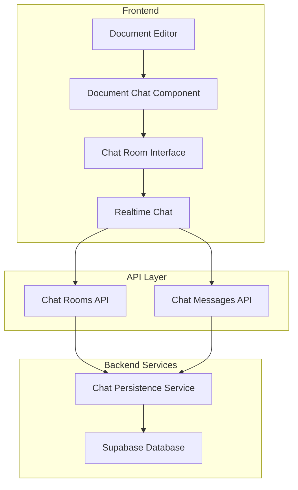
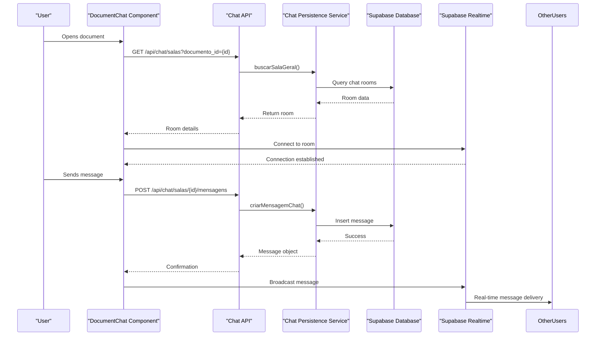
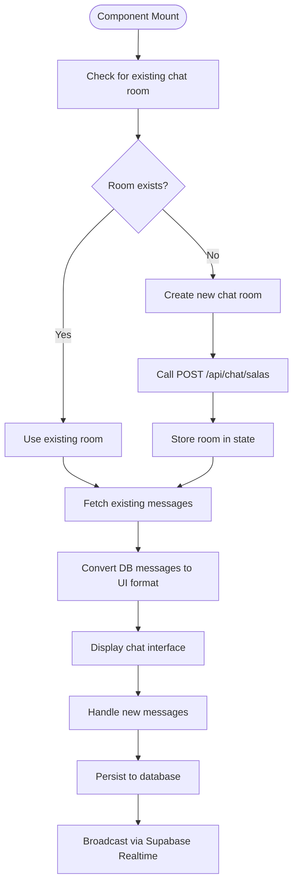
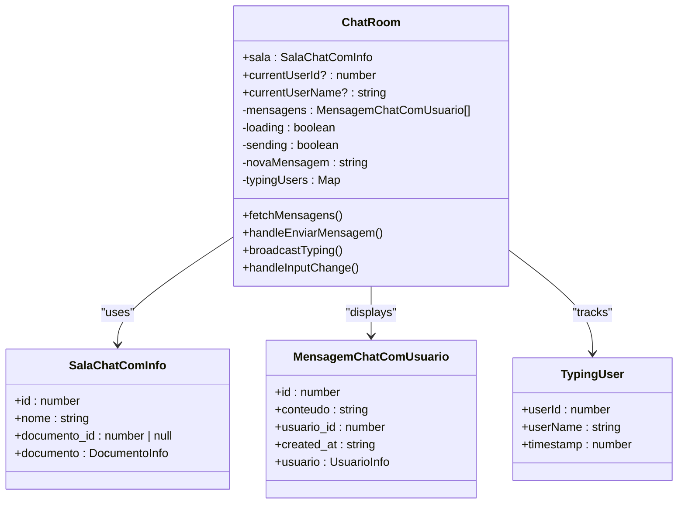
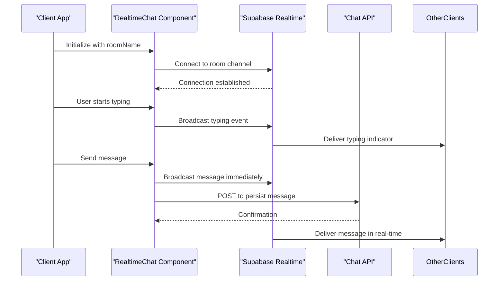
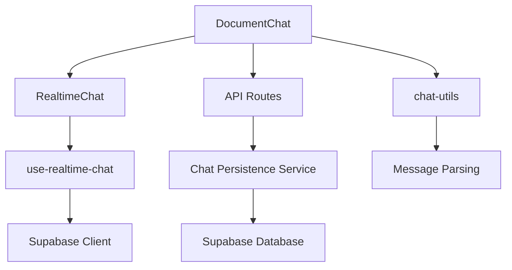

# Document Chat

<cite>
**Referenced Files in This Document**   
- [document-chat.tsx](file://components/documentos/document-chat.tsx)
- [chat-room.tsx](file://components/chat/chat-room.tsx)
- [realtime-chat.tsx](file://components/realtime-chat.tsx)
- [route.ts](file://app/api/chat/salas/route.ts)
- [route.ts](file://app/api/chat/salas/[id]/route.ts)
- [route.ts](file://app/api/chat/salas/[id]/mensagens/route.ts)
- [chat-persistence.service.ts](file://backend/documentos/services/persistence/chat-persistence.service.ts)
- [types.ts](file://backend/types/documentos/types.ts)
- [use-realtime-chat.tsx](file://hooks/use-realtime-chat.tsx)
- [chat-utils.ts](file://lib/utils/chat-utils.ts)
</cite>

## Table of Contents
1. [Introduction](#introduction)
2. [Project Structure](#project-structure)
3. [Core Components](#core-components)
4. [Architecture Overview](#architecture-overview)
5. [Detailed Component Analysis](#detailed-component-analysis)
6. [Dependency Analysis](#dependency-analysis)
7. [Performance Considerations](#performance-considerations)
8. [Troubleshooting Guide](#troubleshooting-guide)
9. [Conclusion](#conclusion)

## Introduction
The Document Chat feature in Sinesys enables contextual discussions within documents by integrating a real-time chat interface directly with the document editor. This system allows users to initiate conversations about specific content, with messages persisted in the database and synchronized across clients. The implementation leverages Supabase Realtime Broadcast for instant updates and includes features like file attachments, audio messages, and typing indicators. This document details the architecture, implementation, and integration of the chat system, addressing key aspects such as message persistence, real-time updates, user notifications, and solutions to common issues like synchronization delays and notification overload.

## Project Structure
The document chat functionality is organized across multiple directories in the Sinesys application. The frontend components are located in the `components/` directory, with dedicated subdirectories for chat and document-related UI elements. API routes for chat operations are structured under `app/api/chat/salas/`, following a RESTful pattern with endpoints for managing chat rooms and messages. The backend services for chat persistence are implemented in `backend/documentos/services/persistence/`, while shared types are defined in `backend/types/documentos/types.ts`. This structure supports a clear separation of concerns between frontend presentation, API interfaces, and backend data management.

**Diagram sources**
- [document-chat.tsx](file://components/documentos/document-chat.tsx)
- [chat-room.tsx](file://components/chat/chat-room.tsx)
- [realtime-chat.tsx](file://components/realtime-chat.tsx)
- [route.ts](file://app/api/chat/salas/route.ts)
- [route.ts](file://app/api/chat/salas/[id]/mensagens/route.ts)
- [chat-persistence.service.ts](file://backend/documentos/services/persistence/chat-persistence.service.ts)

**Section sources**
- [document-chat.tsx](file://components/documentos/document-chat.tsx)
- [chat-room.tsx](file://components/chat/chat-room.tsx)
- [realtime-chat.tsx](file://components/realtime-chat.tsx)
- [route.ts](file://app/api/chat/salas/route.ts)
- [route.ts](file://app/api/chat/salas/[id]/mensagens/route.ts)

## Core Components
The document chat system consists of several key components that work together to provide a seamless user experience. The `DocumentChat` component serves as the main integration point between the document editor and the chat interface, handling room creation and message synchronization. The `ChatRoom` component provides the user interface for viewing and sending messages, including real-time typing indicators. The `RealtimeChat` component implements the core real-time functionality using Supabase Broadcast, managing message transmission and reception. These components are supported by API routes that handle chat operations and a persistence service that stores messages in the database.

**Section sources**
- [document-chat.tsx](file://components/documentos/document-chat.tsx)
- [chat-room.tsx](file://components/chat/chat-room.tsx)
- [realtime-chat.tsx](file://components/realtime-chat.tsx)

## Architecture Overview
The document chat architecture follows a client-server model with real-time capabilities. When a user opens a document, the `DocumentChat` component checks for an existing chat room associated with that document. If no room exists, it creates one via the API. The chat interface connects to this room using Supabase Realtime Broadcast, enabling instant message delivery to all participants. Messages are stored in the database through API endpoints, with the persistence service handling database operations. The architecture includes authentication and authorization checks to ensure users can only access chats for documents they have permission to view.

**Diagram sources**
- [document-chat.tsx](file://components/documentos/document-chat.tsx)
- [route.ts](file://app/api/chat/salas/route.ts)
- [route.ts](file://app/api/chat/salas/[id]/mensagens/route.ts)
- [chat-persistence.service.ts](file://backend/documentos/services/persistence/chat-persistence.service.ts)

## Detailed Component Analysis

### Document Chat Integration
The `DocumentChat` component integrates the chat functionality with the document editor, enabling contextual discussions about specific document content. It uses the Supabase Realtime Broadcast system to provide real-time message updates. When initialized, the component checks for an existing chat room associated with the document and creates one if necessary. Messages are synchronized between the database and the real-time interface, with the component handling the conversion between database message format and the Supabase UI format.

**Diagram sources**
- [document-chat.tsx](file://components/documentos/document-chat.tsx)

**Section sources**
- [document-chat.tsx](file://components/documentos/document-chat.tsx)

### Chat Room Interface
The `ChatRoom` component provides the user interface for the chat functionality, displaying messages and handling user input. It implements real-time features such as typing indicators, showing when other users are composing messages. The component subscribes to Supabase Realtime channels to receive new messages and typing events, updating the UI accordingly. It includes a message input field with support for text messages and file attachments, as well as a message list that displays conversation history.

**Diagram sources**
- [chat-room.tsx](file://components/chat/chat-room.tsx)

**Section sources**
- [chat-room.tsx](file://components/chat/chat-room.tsx)

### Realtime Chat Service
The `RealtimeChat` component implements the core real-time messaging functionality using Supabase Broadcast. It manages the connection to a specific chat room, handles message sending and receiving, and provides typing indicators. The component uses WebSockets to maintain a persistent connection with the server, enabling instant message delivery. It supports message persistence by calling API endpoints to store messages in the database while simultaneously broadcasting them to other clients in real-time.

**Diagram sources**
- [realtime-chat.tsx](file://components/realtime-chat.tsx)

**Section sources**
- [realtime-chat.tsx](file://components/realtime-chat.tsx)

## Dependency Analysis
The document chat system has several key dependencies that enable its functionality. The frontend components depend on Supabase for real-time communication and authentication. The API routes depend on the chat persistence service for database operations, which in turn depends on Supabase's database client. The system also depends on utility functions for message parsing and formatting. These dependencies are managed through modular imports, with clear interfaces between components.

**Diagram sources**
- [document-chat.tsx](file://components/documentos/document-chat.tsx)
- [realtime-chat.tsx](file://components/realtime-chat.tsx)
- [use-realtime-chat.tsx](file://hooks/use-realtime-chat.tsx)
- [chat-persistence.service.ts](file://backend/documentos/services/persistence/chat-persistence.service.ts)
- [chat-utils.ts](file://lib/utils/chat-utils.ts)

**Section sources**
- [document-chat.tsx](file://components/documentos/document-chat.tsx)
- [realtime-chat.tsx](file://components/realtime-chat.tsx)
- [use-realtime-chat.tsx](file://hooks/use-realtime-chat.tsx)
- [chat-persistence.service.ts](file://backend/documentos/services/persistence/chat-persistence.service.ts)

## Performance Considerations
The document chat system is designed with performance in mind, implementing several optimizations to ensure responsiveness. Message loading uses pagination with a limit of 50 messages, preventing excessive data transfer. The real-time functionality minimizes server load by using Supabase Broadcast instead of frequent polling. The system implements debouncing for typing indicators, reducing the number of events transmitted. Message synchronization is optimized by storing messages in the database while using real-time broadcast for immediate delivery, ensuring consistency without compromising speed.

## Troubleshooting Guide
Common issues in the document chat system include message synchronization delays, notification overload, and maintaining context in long-running discussions. Synchronization delays are addressed by the dual-write pattern, where messages are both broadcast in real-time and persisted to the database. Notification overload is mitigated through the use of typing indicators with timeouts, preventing excessive notifications. Context maintenance in long discussions is supported by message threading and the ability to search chat history. The system also includes error handling for failed message deliveries, with automatic retry mechanisms.

**Section sources**
- [document-chat.tsx](file://components/documentos/document-chat.tsx)
- [realtime-chat.tsx](file://components/realtime-chat.tsx)
- [chat-persistence.service.ts](file://backend/documentos/services/persistence/chat-persistence.service.ts)

## Conclusion
The document chat integration in Sinesys provides a robust solution for contextual discussions within documents. By combining real-time messaging with persistent storage, the system enables seamless collaboration while ensuring message durability. The architecture effectively balances immediate feedback through real-time updates with data consistency through database persistence. The integration with the document editor allows users to discuss specific content, enhancing collaboration and productivity. The implementation addresses common challenges in real-time systems, providing a reliable and performant chat experience.