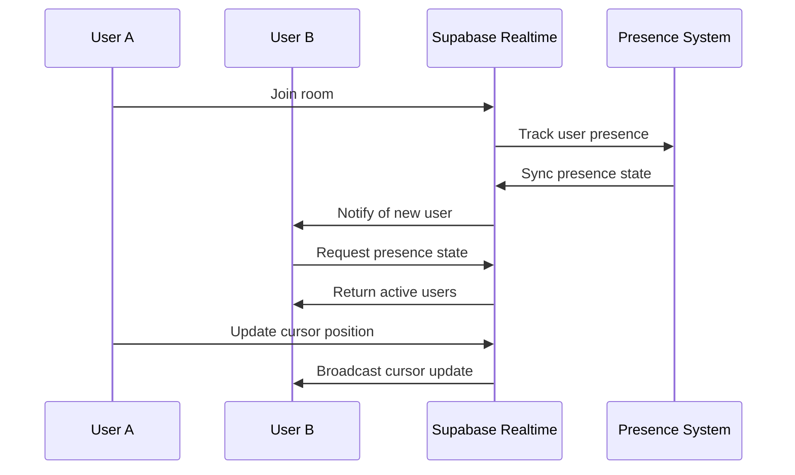
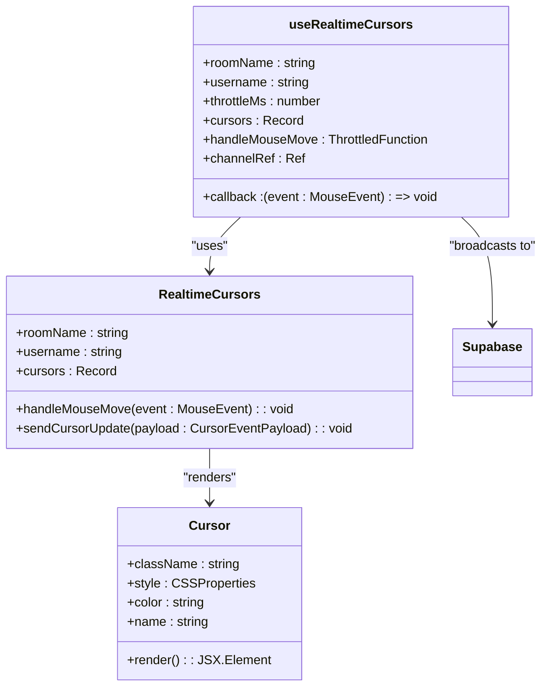
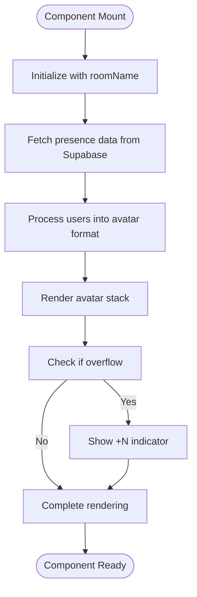
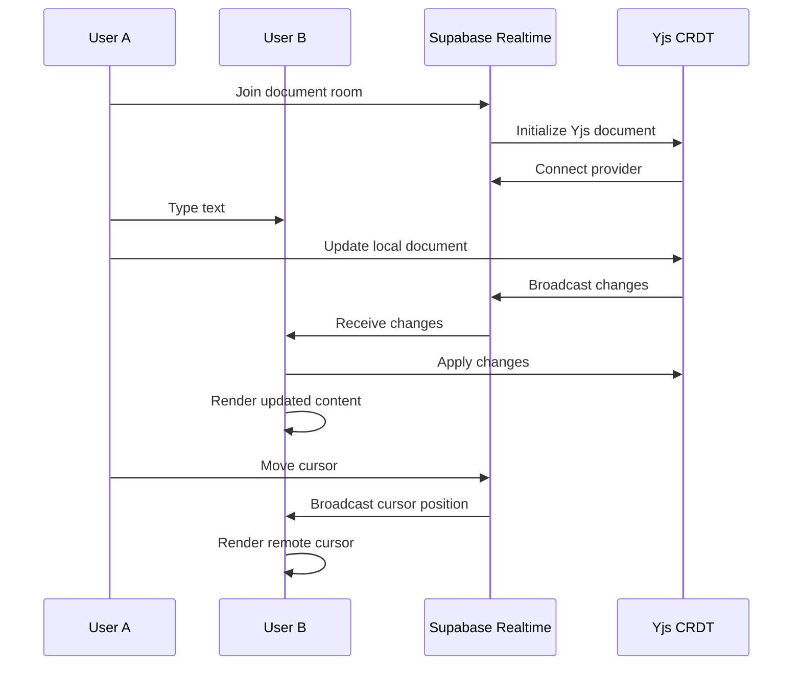
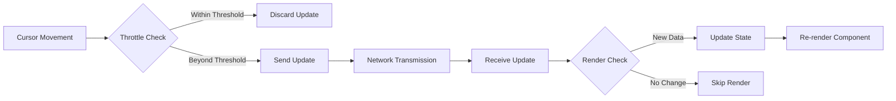
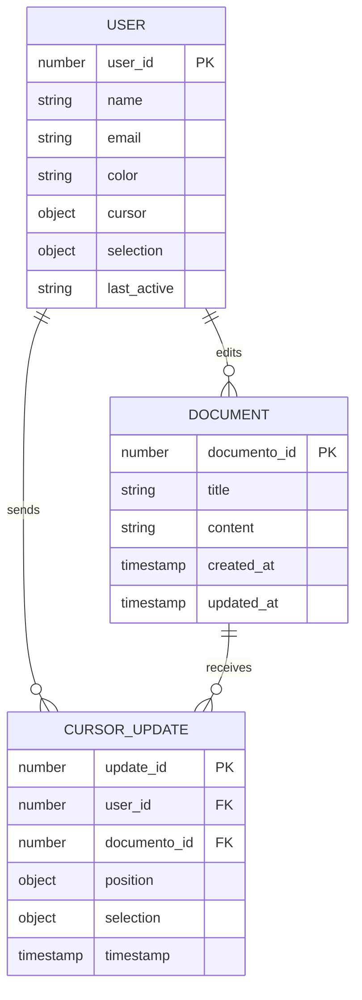

# Presence Indicators

<cite>
**Referenced Files in This Document**   
- [use-realtime-presence-room.ts](file://hooks/use-realtime-presence-room.ts)
- [realtime-avatar-stack.tsx](file://components/realtime-avatar-stack.tsx)
- [use-realtime-cursors.ts](file://hooks/use-realtime-cursors.ts)
- [realtime-cursors.tsx](file://components/realtime-cursors.tsx)
- [cursor.tsx](file://components/cursor.tsx)
- [use-realtime-collaboration.ts](file://hooks/use-realtime-collaboration.ts)
- [collaborators-avatars.tsx](file://components/documentos/collaborators-avatars.tsx)
- [remote-cursors-overlay.tsx](file://components/documentos/remote-cursors-overlay.tsx)
- [collaborative-plate-editor.tsx](file://components/plate/collaborative-plate-editor.tsx)
- [use-yjs-collaboration.ts](file://hooks/use-yjs-collaboration.ts)
</cite>

## Table of Contents
1. [Introduction](#introduction)
2. [Presence Tracking System](#presence-tracking-system)
3. [Remote Cursors Implementation](#remote-cursors-implementation)
4. [Avatar Stack Component](#avatar-stack-component)
5. [Real-time Synchronization](#real-time-synchronization)
6. [Performance Considerations](#performance-considerations)
7. [Common Issues and Solutions](#common-issues-and-solutions)
8. [Conclusion](#conclusion)

## Introduction
The presence indicators system in Sinesys provides real-time collaboration features that allow team members to see which users are viewing or editing a document. This system includes shared cursors, presence tracking, and avatar stacks that display active collaborators. The implementation leverages Supabase Realtime for presence tracking and Yjs for CRDT-based document synchronization, enabling seamless collaborative editing experiences.

**Section sources**
- [use-realtime-presence-room.ts](file://hooks/use-realtime-presence-room.ts#L1-L56)
- [use-realtime-collaboration.ts](file://hooks/use-realtime-collaboration.ts#L1-L244)

## Presence Tracking System
The presence tracking system in Sinesys is built on Supabase Realtime's presence functionality, which allows tracking user connections and disconnections in real-time. The system maintains user status updates and handles disconnections gracefully to ensure accurate presence information.

The `useRealtimePresenceRoom` hook manages the presence tracking for users in a specific room. It uses Supabase's presence features to track user connections and disconnections. When a user joins a room, their presence is tracked with their name and avatar image. The hook synchronizes the presence state across all connected clients, ensuring that all users see the same list of active collaborators.

**Diagram sources**
- [use-realtime-presence-room.ts](file://hooks/use-realtime-presence-room.ts#L1-L56)
- [use-realtime-collaboration.ts](file://hooks/use-realtime-collaboration.ts#L1-L244)

**Section sources**
- [use-realtime-presence-room.ts](file://hooks/use-realtime-presence-room.ts#L1-L56)
- [use-realtime-collaboration.ts](file://hooks/use-realtime-collaboration.ts#L1-L244)

## Remote Cursors Implementation
The remote cursors system renders real-time cursor positions and selection ranges for all connected users. This implementation provides visual feedback on where team members are actively working within a document.

The `useRealtimeCursors` hook manages the broadcasting and receiving of cursor position updates. It uses Supabase Realtime's broadcast functionality to send cursor movements to other users in the same room. The hook implements throttling to optimize performance by limiting the frequency of cursor updates.

**Diagram sources**
- [realtime-cursors.tsx](file://components/realtime-cursors.tsx#L1-L30)
- [use-realtime-cursors.ts](file://hooks/use-realtime-cursors.ts#L1-L177)
- [cursor.tsx](file://components/cursor.tsx#L1-L28)

**Section sources**
- [realtime-cursors.tsx](file://components/realtime-cursors.tsx#L1-L30)
- [use-realtime-cursors.ts](file://hooks/use-realtime-cursors.ts#L1-L177)
- [cursor.tsx](file://components/cursor.tsx#L1-L28)

## Avatar Stack Component
The avatar stack component displays active collaborators and their current status. It provides a compact visual representation of who is currently viewing or editing a document.

The `RealtimeAvatarStack` component uses the `useRealtimePresenceRoom` hook to retrieve the list of active users and renders them as a stack of avatars. The component handles overflow by showing a "+N" indicator when there are more users than can be displayed.

**Diagram sources**
- [realtime-avatar-stack.tsx](file://components/realtime-avatar-stack.tsx#L1-L18)
- [avatar-stack.tsx](file://components/avatar-stack.tsx#L1-L84)

**Section sources**
- [realtime-avatar-stack.tsx](file://components/realtime-avatar-stack.tsx#L1-L18)
- [avatar-stack.tsx](file://components/avatar-stack.tsx#L1-L84)
- [collaborators-avatars.tsx](file://components/documentos/collaborators-avatars.tsx#L1-L70)

## Real-time Synchronization
The real-time synchronization system in Sinesys combines Supabase Realtime for presence tracking with Yjs for CRDT-based document synchronization. This hybrid approach ensures both presence information and document content are synchronized across clients.

The `useRealtimeCollaboration` hook manages the collaboration state, including presence tracking, cursor position updates, and content synchronization. It uses Supabase Realtime's presence functionality to track user connections and disconnections, while also broadcasting cursor and selection updates.

**Diagram sources**
- [use-realtime-collaboration.ts](file://hooks/use-realtime-collaboration.ts#L1-L244)
- [use-yjs-collaboration.ts](file://hooks/use-yjs-collaboration.ts#L1-L201)
- [collaborative-plate-editor.tsx](file://components/plate/collaborative-plate-editor.tsx#L1-L220)

**Section sources**
- [use-realtime-collaboration.ts](file://hooks/use-realtime-collaboration.ts#L1-L244)
- [use-yjs-collaboration.ts](file://hooks/use-yjs-collaboration.ts#L1-L201)
- [collaborative-plate-editor.tsx](file://components/plate/collaborative-plate-editor.tsx#L1-L220)

## Performance Considerations
The presence indicators system in Sinesys implements several performance optimizations to handle the rendering of multiple cursors and presence updates efficiently.

The system uses throttling to limit the frequency of cursor position updates, reducing the number of messages sent over the network. The `useThrottleCallback` function in the `useRealtimeCursors` hook ensures that cursor updates are only sent at a maximum rate defined by the `THROTTLE_MS` constant.

For rendering multiple cursors, the system uses React's `useMemo` hook to optimize the rendering of the avatar stack. The `RealtimeAvatarStack` component memoizes the avatar data to prevent unnecessary re-renders when the presence state changes.

**Diagram sources**
- [use-realtime-cursors.ts](file://hooks/use-realtime-cursors.ts#L1-L177)
- [realtime-avatar-stack.tsx](file://components/realtime-avatar-stack.tsx#L1-L18)

**Section sources**
- [use-realtime-cursors.ts](file://hooks/use-realtime-cursors.ts#L1-L177)
- [realtime-avatar-stack.tsx](file://components/realtime-avatar-stack.tsx#L1-L18)

## Common Issues and Solutions
The presence indicators system addresses several common issues related to real-time collaboration, including stale presence data, cursor position inaccuracies, and performance impacts.

### Stale Presence Data
Stale presence data can occur when users disconnect unexpectedly without properly leaving the presence room. The system handles this by using Supabase Realtime's automatic presence cleanup, which removes disconnected users from the presence state after a timeout period.

### Cursor Position Inaccuracies
Cursor position inaccuracies can occur due to network latency or throttling. The system addresses this by using smooth transitions in the cursor component, which animates the cursor movement between positions to create a more fluid visual experience.

### Performance Impacts
Rendering multiple cursors can impact performance, especially with many collaborators. The system mitigates this by:
- Throttling cursor updates to reduce network traffic
- Using React's optimization techniques like `useMemo` and `useCallback`
- Implementing efficient rendering with CSS transforms for cursor positioning

**Diagram sources**
- [use-realtime-collaboration.ts](file://hooks/use-realtime-collaboration.ts#L1-L244)
- [use-realtime-cursors.ts](file://hooks/use-realtime-cursors.ts#L1-L177)

**Section sources**
- [use-realtime-collaboration.ts](file://hooks/use-realtime-collaboration.ts#L1-L244)
- [use-realtime-cursors.ts](file://hooks/use-realtime-cursors.ts#L1-L177)
- [remote-cursors-overlay.tsx](file://components/documentos/remote-cursors-overlay.tsx#L1-L48)

## Conclusion
The presence indicators system in Sinesys provides a robust real-time collaboration experience through its implementation of shared cursors, presence tracking, and avatar stacks. By leveraging Supabase Realtime for presence management and Yjs for CRDT-based document synchronization, the system ensures that team members can see who is viewing or editing a document in real-time. The implementation addresses common challenges such as stale presence data, cursor position inaccuracies, and performance impacts through thoughtful optimizations and error handling.