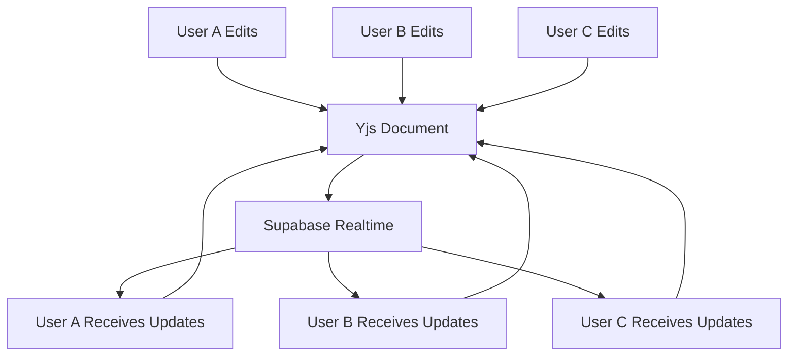
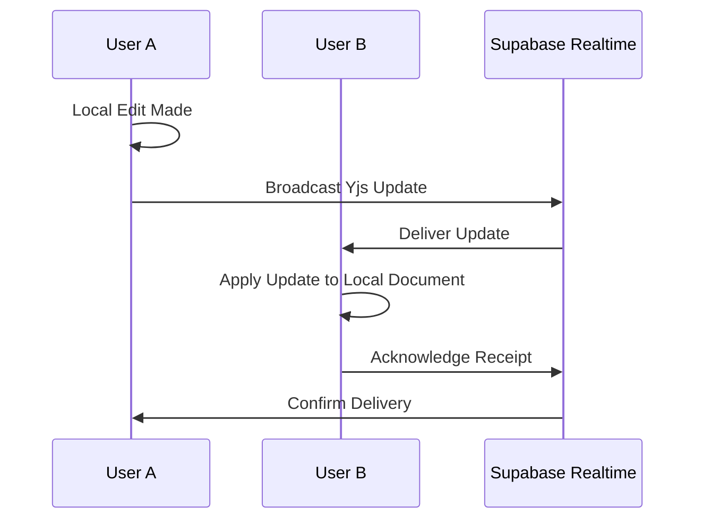
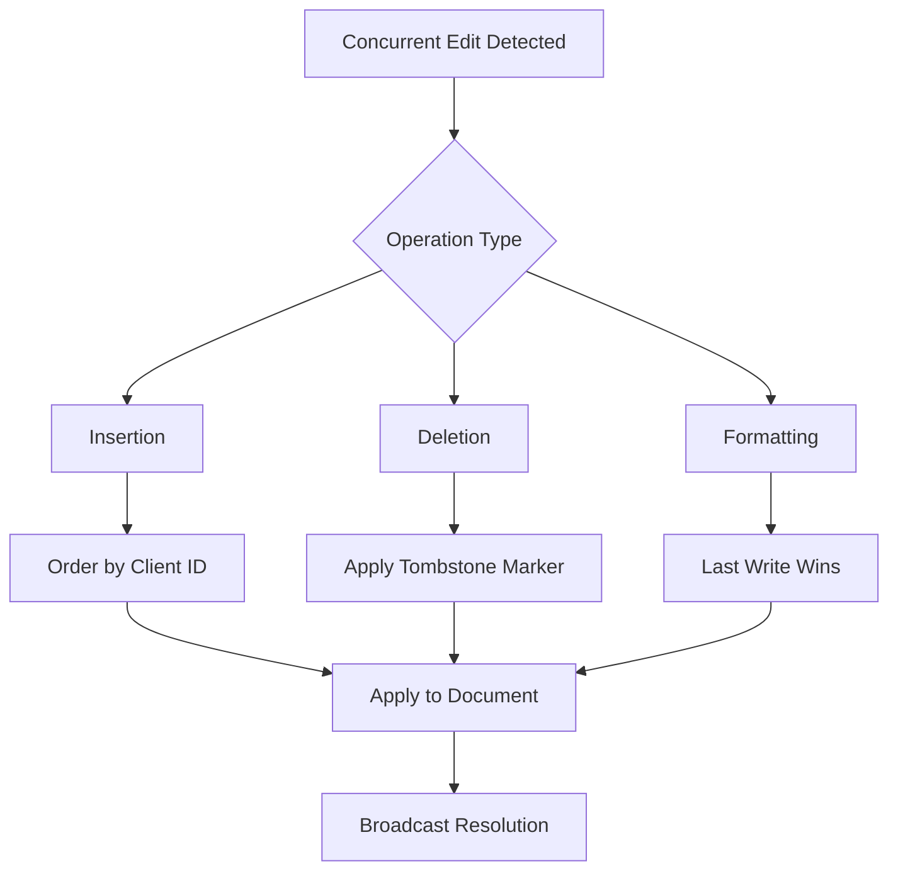
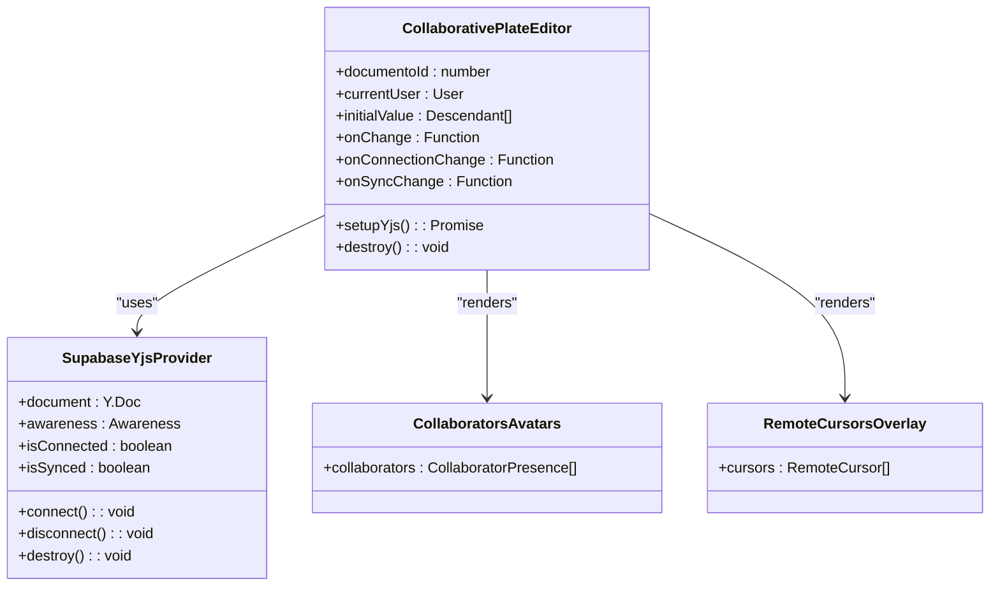
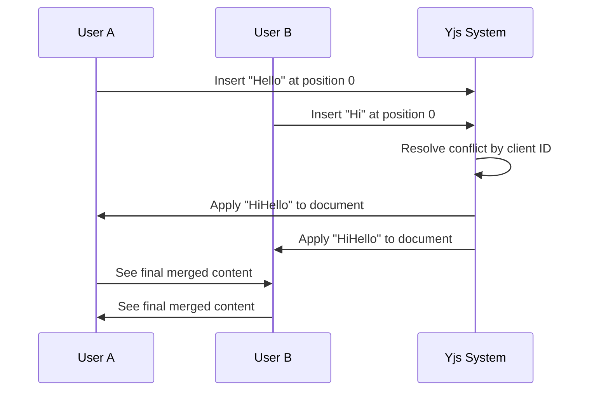

# Conflict Resolution

<cite>
**Referenced Files in This Document**   
- [collaborative-plate-editor.tsx](file://components/plate/collaborative-plate-editor.tsx)
- [supabase-yjs-provider.ts](file://lib/yjs/supabase-yjs-provider.ts)
- [supabase-provider.ts](file://lib/yjs/supabase-provider.ts)
- [use-yjs-collaboration.ts](file://hooks/use-yjs-collaboration.ts)
- [spec.md](file://openspec/specs/documentos-editor/spec.md)
- [design.md](file://openspec/changes/archive/2025-12-05-add-document-editor-system/design.md)
- [remote-cursors-overlay.tsx](file://components/documentos/remote-cursors-overlay.tsx)
- [collaborators-avatars.tsx](file://components/documentos/collaborators-avatars.tsx)
</cite>

## Table of Contents
1. [Introduction](#introduction)
2. [Yjs CRDT Model Overview](#yjs-crtd-model-overview)
3. [Operational Transformation and Synchronization](#operational-transformation-and-synchronization)
4. [Conflict Resolution Strategies](#conflict-resolution-strategies)
5. [Real-time Collaboration Components](#real-time-collaboration-components)
6. [Concurrent Edit Handling](#concurrent-edit-handling)
7. [Edge Case Resolution](#edge-case-resolution)
8. [User Interface for Conflict Resolution](#user-interface-for-conflict-resolution)
9. [Conclusion](#conclusion)

## Introduction
The Sinesys real-time collaboration system implements a robust conflict resolution mechanism using Yjs CRDT (Conflict-Free Replicated Data Type) to ensure seamless document editing when multiple users work simultaneously. This documentation details how the system maintains document consistency across clients, handles concurrent edits, and preserves the intent of all collaborators. The implementation leverages Yjs for automatic conflict resolution, Supabase Realtime for synchronization, and Plate.js for rich text editing capabilities.

**Section sources**
- [spec.md](file://openspec/specs/documentos-editor/spec.md#L311-L348)
- [design.md](file://openspec/changes/archive/2025-12-05-add-document-editor-system/design.md#L492-L622)

## Yjs CRDT Model Overview
The Sinesys collaboration system utilizes Yjs, a Conflict-Free Replicated Data Type (CRDT) implementation, to ensure automatic conflict resolution during simultaneous document editing. Yjs provides a mathematical foundation that guarantees eventual consistency across all clients without requiring centralized coordination. The system creates a shared document model where each user maintains a local replica that automatically synchronizes with others through operational transformations.

The Yjs document is initialized with a unique identifier for each document, allowing multiple users to connect to the same collaborative session. Each user's edits are transformed into atomic operations that can be applied in any order while maintaining consistency. The CRDT model ensures that regardless of network latency or the order of operation delivery, all clients will converge to the same final state.

**Diagram sources **
- [supabase-yjs-provider.ts](file://lib/yjs/supabase-yjs-provider.ts#L78-L357)
- [use-yjs-collaboration.ts](file://hooks/use-yjs-collaboration.ts#L66-L201)

**Section sources**
- [supabase-yjs-provider.ts](file://lib/yjs/supabase-yjs-provider.ts#L78-L357)
- [use-yjs-collaboration.ts](file://hooks/use-yjs-collaboration.ts#L66-L201)

## Operational Transformation and Synchronization
The Sinesys system implements a sophisticated synchronization mechanism that combines Yjs operational transformation with Supabase Realtime for efficient document coordination. When a user makes an edit, the system captures the change as a Yjs update, which is then broadcast to all connected clients through Supabase's real-time channels.

The synchronization process follows a three-phase approach: local update, remote broadcast, and state reconciliation. When a user modifies the document, Yjs generates an update containing the operation type, position, and content. This update is immediately applied to the local document and then serialized into a Uint8Array format for transmission. The Supabase provider broadcasts this update to all other collaborators, who receive and apply it to their local replicas.

For initial synchronization, the system implements a sync request-response protocol. When a new user joins a document session, their client requests the current document state from existing participants. If no response is received within 2 seconds, the client assumes it is the first participant and proceeds with an empty document. This approach ensures rapid connection establishment while maintaining data consistency.

**Diagram sources **
- [supabase-provider.ts](file://lib/yjs/supabase-provider.ts#L137-L148)
- [supabase-yjs-provider.ts](file://lib/yjs/supabase-yjs-provider.ts#L224-L238)

**Section sources**
- [supabase-provider.ts](file://lib/yjs/supabase-provider.ts#L124-L251)
- [supabase-yjs-provider.ts](file://lib/yjs/supabase-yjs-provider.ts#L103-L113)

## Conflict Resolution Strategies
The Sinesys collaboration system employs Yjs's built-in conflict resolution algorithms to handle concurrent edits to the same document regions. When multiple users modify overlapping content simultaneously, Yjs applies operational transformation rules that preserve the intent of all collaborators while maintaining document consistency.

For text insertion operations, the system uses position-based resolution where concurrent insertions at the same location are ordered by client identifier. This ensures deterministic behavior where the same sequence of operations always produces the same result across all clients. The system maintains a logical clock that tracks the order of operations, allowing it to resolve conflicts even when network delays cause out-of-order delivery.

Deletion operations are handled through tombstone markers that preserve the context of deleted content until all clients have acknowledged the operation. This prevents accidental restoration of deleted content when new clients join the session. Formatting changes are treated as attribute updates that can be merged without conflict, with the most recent change taking precedence in cases of simultaneous modifications.

**Diagram sources **
- [supabase-yjs-provider.ts](file://lib/yjs/supabase-yjs-provider.ts#L192-L200)
- [use-yjs-collaboration.ts](file://hooks/use-yjs-collaboration.ts#L113-L132)

**Section sources**
- [supabase-yjs-provider.ts](file://lib/yjs/supabase-yjs-provider.ts#L192-L306)
- [spec.md](file://openspec/specs/documentos-editor/spec.md#L341-L348)

## Real-time Collaboration Components
The Sinesys system implements several components to support real-time collaboration and conflict resolution. The core component is the CollaborativePlateEditor, which integrates Plate.js with Yjs and Supabase Realtime to provide a seamless editing experience. This component manages the Yjs provider lifecycle, handles connection states, and configures the editor plugins for collaborative editing.

The system uses awareness functionality to track user presence and cursor positions. Each user's cursor is displayed with a unique color and name label, allowing collaborators to see where others are working in the document. The awareness data includes user information such as name, color, and current selection, which is broadcast to all participants in real-time.

Presence tracking is implemented using Supabase Realtime Presence, which maintains a list of users currently viewing or editing the document. This information is displayed through the CollaboratorsAvatars component, showing a stack of user avatars with tooltips indicating their names and active status.

**Diagram sources **
- [collaborative-plate-editor.tsx](file://components/plate/collaborative-plate-editor.tsx#L42-L79)
- [supabase-yjs-provider.ts](file://lib/yjs/supabase-yjs-provider.ts#L78-L130)
- [collaborators-avatars.tsx](file://components/documentos/collaborators-avatars.tsx#L18-L21)
- [remote-cursors-overlay.tsx](file://components/documentos/remote-cursors-overlay.tsx#L11-L13)

**Section sources**
- [collaborative-plate-editor.tsx](file://components/plate/collaborative-plate-editor.tsx#L1-L220)
- [collaborators-avatars.tsx](file://components/documentos/collaborators-avatars.tsx#L1-L50)
- [remote-cursors-overlay.tsx](file://components/documentos/remote-cursors-overlay.tsx#L1-L47)

## Concurrent Edit Handling
The Sinesys system effectively handles concurrent edits to the same document regions through Yjs's operational transformation algorithms. When multiple users edit the same paragraph simultaneously, the system decomposes each change into atomic operations that can be independently applied and merged.

For overlapping text insertions, the system uses a combination of position tracking and client identifiers to determine the final order of content. Each insertion operation includes metadata about its intended position, and Yjs resolves conflicts by applying a deterministic ordering rule based on client IDs when positions overlap exactly. This ensures that all clients arrive at the same document state regardless of the order in which operations are received.

The system implements a debounce mechanism with a 500ms interval for broadcasting changes, which helps reduce network traffic and prevents excessive update messages during rapid typing. This optimization balances real-time responsiveness with network efficiency, ensuring smooth collaboration without overwhelming the real-time channel.

**Diagram sources **
- [supabase-yjs-provider.ts](file://lib/yjs/supabase-yjs-provider.ts#L224-L238)
- [design.md](file://openspec/changes/archive/2025-12-05-add-document-editor-system/design.md#L567-L582)

**Section sources**
- [supabase-yjs-provider.ts](file://lib/yjs/supabase-yjs-provider.ts#L224-L238)
- [design.md](file://openspec/changes/archive/2025-12-05-add-document-editor-system/design.md#L546-L582)

## Edge Case Resolution
The Sinesys collaboration system includes specific strategies for handling edge cases such as simultaneous deletion and modification of the same content. When one user deletes a paragraph while another is editing it, the system preserves the deletion intent while capturing the modifications for potential recovery.

The resolution process involves tombstone markers that track deleted content and its modification history. If a user attempts to modify content that has been deleted by another collaborator, the system applies the modifications to the tombstone rather than the document. This allows for intelligent restoration if the deletion is later undone, preserving all changes made during the deleted state.

For simultaneous formatting changes to the same text range, the system implements a last-write-wins strategy where the most recent formatting operation takes precedence. This approach ensures deterministic outcomes while maintaining responsiveness. The system also provides visual indicators when conflicting formatting operations occur, allowing users to manually resolve complex styling conflicts.

**Section sources**
- [supabase-yjs-provider.ts](file://lib/yjs/supabase-yjs-provider.ts#L294-L306)
- [spec.md](file://openspec/specs/documentos-editor/spec.md#L341-L348)

## User Interface for Conflict Resolution
The Sinesys collaborative editor presents conflict resolution outcomes to users through a seamless interface that minimizes disruption to the editing experience. When conflicts are resolved automatically, the system provides subtle visual feedback rather than interrupting the user with modal dialogs or alerts.

The editor displays real-time indicators showing which parts of the document are being edited by other collaborators. When multiple users are working on nearby sections, the system highlights these areas with colored indicators that correspond to each user's cursor color. This spatial awareness helps prevent conflicts by making users aware of overlapping editing activities.

In cases where significant conflicts occur, such as simultaneous major structural changes, the system provides a notification message indicating that another user has made changes to the document. Users can access a version history dialog to review changes and understand how conflicts were resolved. The remote cursors and presence indicators provide continuous feedback about collaboration status without requiring explicit conflict resolution actions.

**Section sources**
- [collaborative-plate-editor.tsx](file://components/plate/collaborative-plate-editor.tsx#L168-L177)
- [collaborators-avatars.tsx](file://components/documentos/collaborators-avatars.tsx#L27-L50)
- [remote-cursors-overlay.tsx](file://components/documentos/remote-cursors-overlay.tsx#L38-L46)

## Conclusion
The Sinesys real-time collaboration system implements a comprehensive conflict resolution framework using Yjs CRDT technology to ensure automatic and consistent handling of concurrent document edits. By leveraging operational transformation algorithms and Supabase Realtime synchronization, the system maintains document integrity across all clients while preserving the intent of all collaborators. The implementation effectively handles various edit operations, including text insertion, deletion, and formatting, with specific strategies for edge cases like simultaneous modification and deletion. The user interface provides seamless feedback about collaboration status and conflict resolution outcomes, maintaining a smooth editing experience even during complex multi-user interactions.