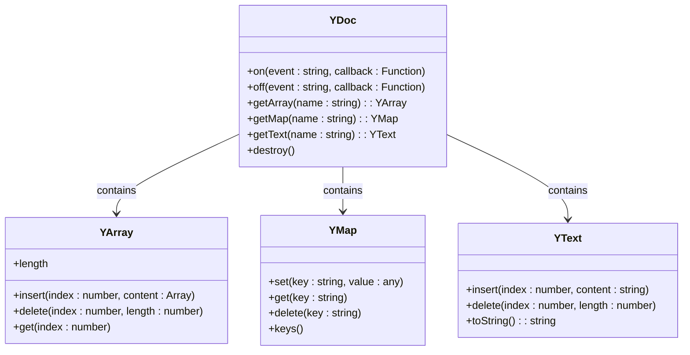
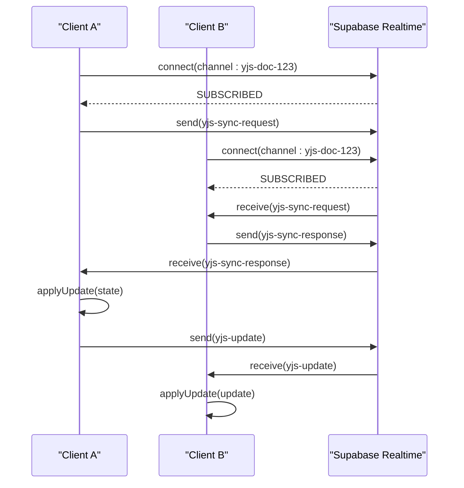
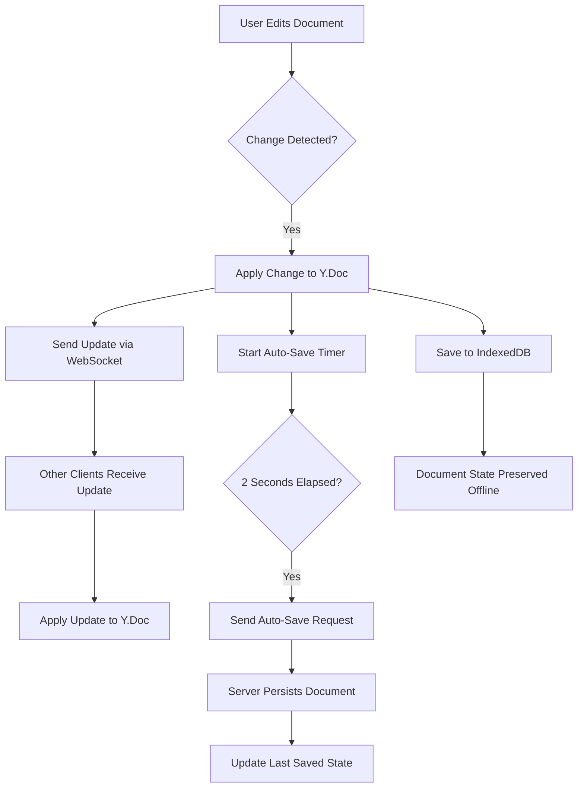
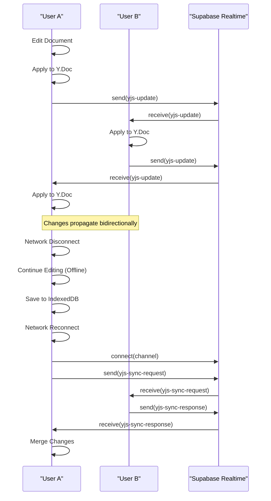
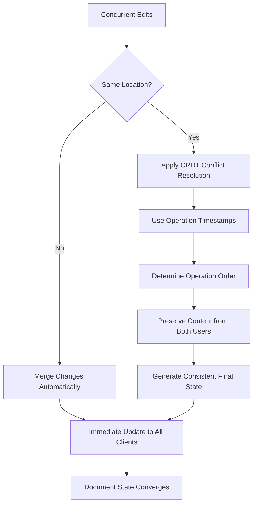
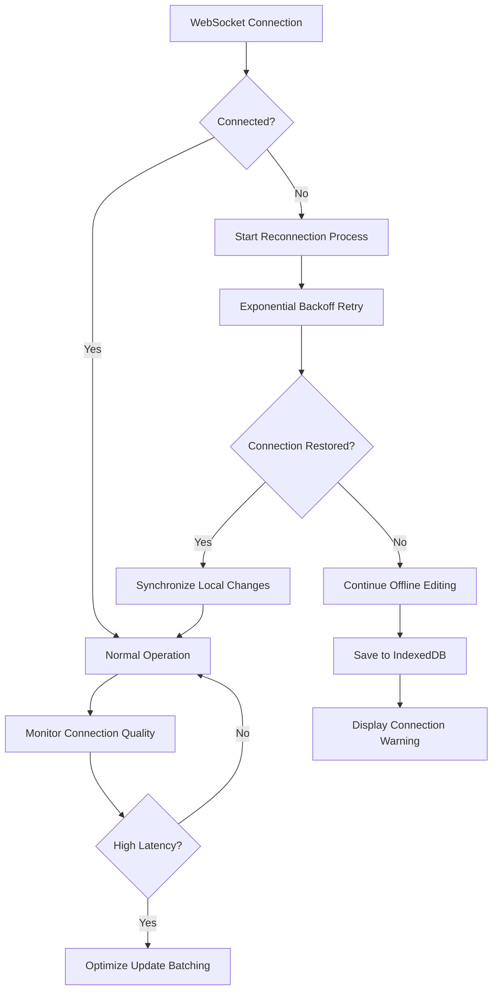
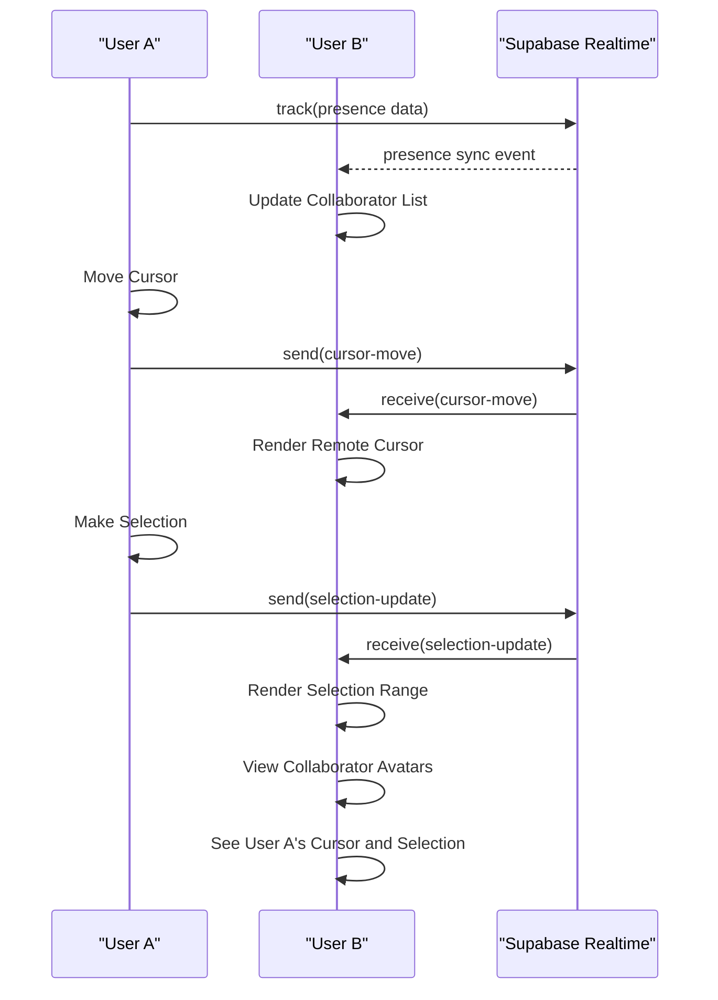

# Real-time Collaboration

<cite>
**Referenced Files in This Document**   
- [collaborative-plate-editor.tsx](file://components/plate/collaborative-plate-editor.tsx)
- [supabase-provider.ts](file://lib/yjs/supabase-provider.ts)
- [supabase-yjs-provider.ts](file://lib/yjs/supabase-yjs-provider.ts)
- [use-yjs-collaboration.ts](file://hooks/use-yjs-collaboration.ts)
- [yjs-kit.tsx](file://components/plate/yjs-kit.tsx)
- [document-editor.tsx](file://components/documentos/document-editor.tsx)
- [use-realtime-collaboration.ts](file://hooks/use-realtime-collaboration.ts)
- [use-realtime-cursors.ts](file://hooks/use-realtime-cursors.ts)
- [plate-editor.tsx](file://components/plate/plate-editor.tsx)
- [editor-kit.tsx](file://components/plate/editor-kit.tsx)
- [client.ts](file://app/_lib/supabase/client.ts)
</cite>

## Table of Contents
1. [Introduction](#introduction)
2. [CRDT Data Model and Yjs Implementation](#crdt-data-model-and-yjs-implementation)
3. [Supabase Yjs Provider](#supabase-yjs-provider)
4. [Collaborative Plate Editor Integration](#collaborative-plate-editor-integration)
5. [Document State Management](#document-state-management)
6. [Change Propagation and Synchronization](#change-propagation-and-synchronization)
7. [Conflict Resolution Strategies](#conflict-resolution-strategies)
8. [Network Resilience and Error Handling](#network-resilience-and-error-handling)
9. [Real-time Presence and Cursors](#real-time-presence-and-cursors)
10. [Implementation Examples](#implementation-examples)
11. [Conclusion](#conclusion)

## Introduction
The Sinesys real-time collaboration system enables multiple users to simultaneously edit documents with immediate updates across all clients. This system is built on the Yjs CRDT (Conflict-Free Replicated Data Type) framework, which ensures data consistency across distributed clients without requiring a central authority to resolve conflicts. The implementation uses Supabase Realtime as the WebSocket transport layer, leveraging its broadcast and presence features to synchronize document changes and track user presence. The collaborative editing experience is integrated into the Plate.js rich text editor, providing a seamless interface for real-time collaboration with features like remote cursors, presence indicators, and conflict-free editing.

**Section sources**
- [collaborative-plate-editor.tsx](file://components/plate/collaborative-plate-editor.tsx#L1-L220)
- [document-editor.tsx](file://components/documentos/document-editor.tsx#L1-L479)

## CRDT Data Model and Yjs Implementation
The core of the real-time collaboration system is built on Yjs, a JavaScript implementation of CRDTs that enables conflict-free replicated data types. Yjs uses a shared data model that automatically resolves conflicts through its operational transformation algorithms, ensuring that all clients eventually converge to the same state regardless of the order of operations.

The system implements a document-based CRDT model where each document is represented as a Y.Doc instance. This document contains shared types like Y.Text, Y.Array, and Y.Map that can be manipulated concurrently by multiple users. When a user makes an edit, Yjs creates an update message that describes the change in a way that can be applied to any version of the document, regardless of the current state.

The CRDT data model ensures that operations are commutative, associative, and idempotent, which means that the order of operations doesn't affect the final result. This property allows the system to handle network latency and connection drops gracefully, as operations can be applied in any order when connectivity is restored.



**Diagram sources**
- [supabase-yjs-provider.ts](file://lib/yjs/supabase-yjs-provider.ts#L78-L357)
- [supabase-provider.ts](file://lib/yjs/supabase-provider.ts#L10-L251)

**Section sources**
- [supabase-yjs-provider.ts](file://lib/yjs/supabase-yjs-provider.ts#L78-L357)
- [supabase-provider.ts](file://lib/yjs/supabase-provider.ts#L10-L251)

## Supabase Yjs Provider
The Supabase Yjs Provider serves as the bridge between the Yjs CRDT framework and Supabase Realtime WebSockets. This custom provider implements the UnifiedProvider interface expected by @platejs/yjs, enabling seamless integration with the Plate.js editor. The provider establishes a WebSocket connection to a Supabase Realtime channel specific to each document, using the document ID to create a unique channel name.

The provider implements a sophisticated synchronization protocol that handles both incremental updates and full state synchronization. When a client connects, it broadcasts a sync request to other connected clients. If other clients are present, they respond with the complete document state, allowing the new client to quickly synchronize. If no response is received within 2 seconds, the client assumes it is the first connection and proceeds with an empty document.

The provider uses Supabase's broadcast functionality to send and receive Yjs update messages. Each update is packaged with a timestamp and sent as a broadcast event, ensuring that all connected clients receive the changes. The provider also implements awareness functionality, allowing clients to share presence information and cursor positions.



**Diagram sources**
- [supabase-yjs-provider.ts](file://lib/yjs/supabase-yjs-provider.ts#L134-L219)
- [supabase-provider.ts](file://lib/yjs/supabase-provider.ts#L81-L118)

**Section sources**
- [supabase-yjs-provider.ts](file://lib/yjs/supabase-yjs-provider.ts#L78-L357)
- [supabase-provider.ts](file://lib/yjs/supabase-provider.ts#L10-L251)

## Collaborative Plate Editor Integration
The Collaborative Plate Editor component integrates the Yjs collaboration system with the Plate.js rich text editor. This integration provides a seamless real-time editing experience with features like remote cursors, presence indicators, and immediate change propagation. The editor uses a custom configuration that combines standard Plate.js plugins with Yjs-specific functionality.

The integration follows a component-based architecture where the CollaborativePlateEditor component manages the Yjs provider lifecycle and configures the Plate.js editor with Yjs plugins. When the component mounts, it creates a SupabaseYjsProvider instance with the document ID and current user information. The provider is then passed to the YjsPlugin configuration, enabling real-time synchronization.

The editor implements a robust connection management system that handles connection status changes and synchronization events. It displays visual indicators for connection status and provides a loading state while establishing the WebSocket connection. The component also manages cleanup on unmount, ensuring that resources are properly released and the provider is destroyed.

```mermaid
classDiagram
class CollaborativePlateEditor {
+documentoId : number
+currentUser : {id : number, name : string}
+initialValue : Descendant[]
+onChange : (value : Descendant[]) => void
+onConnectionChange : (isConnected : boolean) => void
+onSyncChange : (isSynced : boolean) => void
-providerRef : RefObject
-isReady : boolean
-editorPlugins : Plugin[]
}
class SupabaseYjsProvider {
+type : string
+document : Y.Doc
+awareness : Awareness
+isConnected : boolean
+isSynced : boolean
+connect()
+disconnect()
+destroy()
}
class YjsPlugin {
+configure(options : YjsPluginOptions)
}
class PlateEditor {
+editor : PlateEditor
+onChange : (value : Descendant[]) => void
}
CollaborativePlateEditor --> SupabaseYjsProvider : creates
CollaborativePlateEditor --> YjsPlugin : configures
YjsPlugin --> SupabaseYjsProvider : uses
CollaborativePlateEditor --> PlateEditor : renders
```

**Diagram sources**
- [collaborative-plate-editor.tsx](file://components/plate/collaborative-plate-editor.tsx#L72-L186)
- [supabase-yjs-provider.ts](file://lib/yjs/supabase-yjs-provider.ts#L78-L357)

**Section sources**
- [collaborative-plate-editor.tsx](file://components/plate/collaborative-plate-editor.tsx#L72-L186)
- [yjs-kit.tsx](file://components/plate/yjs-kit.tsx#L1-L46)

## Document State Management
The system implements a comprehensive document state management strategy that combines client-side CRDTs with server-side persistence. Each document is represented as a Y.Doc instance on the client, which maintains the complete document state in memory. This state is automatically synchronized across all connected clients through the Yjs CRDT algorithms.

The system uses IndexedDB persistence to ensure that document state is preserved even when the user is offline. When the `enableLocalPersistence` option is enabled, the system creates an IndexeddbPersistence instance that automatically saves the document state to the browser's IndexedDB. This allows users to continue editing documents offline, with changes being synchronized to other clients when connectivity is restored.

Document state is also persisted to the server through periodic auto-save operations. The system implements a 2-second debounce on content changes, triggering an auto-save request when the user stops typing. This balances the need for frequent saves with the desire to minimize server requests. Manual save operations are also available, allowing users to explicitly save their changes.



**Diagram sources**
- [use-yjs-collaboration.ts](file://hooks/use-yjs-collaboration.ts#L86-L162)
- [document-editor.tsx](file://components/documentos/document-editor.tsx#L147-L201)

**Section sources**
- [use-yjs-collaboration.ts](file://hooks/use-yjs-collaboration.ts#L66-L201)
- [document-editor.tsx](file://components/documentos/document-editor.tsx#L147-L201)

## Change Propagation and Synchronization
The change propagation system in Sinesys uses a sophisticated synchronization protocol to ensure that document changes are reliably propagated to all connected clients. When a user makes an edit, the change is first applied to the local Y.Doc instance. The Yjs framework then generates an update message that describes the change in a format that can be applied to any version of the document.

This update message is sent to other clients through the Supabase Realtime WebSocket connection. The system uses broadcast events to distribute updates, ensuring that all connected clients receive the change notification. Each update includes a timestamp, allowing clients to order operations chronologically when resolving conflicts.

The synchronization protocol includes mechanisms for handling connection interruptions and ensuring eventual consistency. When a client reconnects after a network disruption, it requests the current document state from other connected clients. If no other clients are present, it assumes its local state is current. This approach ensures that users can continue working offline, with changes being merged when connectivity is restored.



**Diagram sources**
- [supabase-provider.ts](file://lib/yjs/supabase-provider.ts#L124-L131)
- [supabase-yjs-provider.ts](file://lib/yjs/supabase-yjs-provider.ts#L224-L238)

**Section sources**
- [supabase-provider.ts](file://lib/yjs/supabase-provider.ts#L124-L187)
- [supabase-yjs-provider.ts](file://lib/yjs/supabase-yjs-provider.ts#L224-L289)

## Conflict Resolution Strategies
The Sinesys collaboration system employs Yjs's built-in conflict resolution strategies, which are based on CRDT principles. Unlike traditional operational transformation systems that require a central server to resolve conflicts, Yjs uses mathematical properties of CRDTs to ensure that concurrent edits automatically converge to a consistent state.

The system implements a last-write-wins strategy for certain operations, combined with more sophisticated conflict resolution for text editing. When multiple users edit different parts of a document simultaneously, their changes are merged without conflict. When users edit the same text region concurrently, Yjs uses a combination of operation ordering and content preservation to resolve conflicts in a predictable manner.

For structural changes like adding or removing blocks, the system uses unique identifiers and operation timestamps to determine the correct order of operations. This ensures that even if operations arrive out of order due to network latency, the final document state will be consistent across all clients.

The awareness system also contributes to conflict prevention by showing users where others are editing. Remote cursors and selection indicators help users avoid editing the same content simultaneously, reducing the likelihood of conflicts.



**Diagram sources**
- [supabase-yjs-provider.ts](file://lib/yjs/supabase-yjs-provider.ts#L243-L249)
- [supabase-provider.ts](file://lib/yjs/supabase-provider.ts#L192-L199)

**Section sources**
- [supabase-yjs-provider.ts](file://lib/yjs/supabase-yjs-provider.ts#L243-L306)
- [supabase-provider.ts](file://lib/yjs/supabase-provider.ts#L192-L219)

## Network Resilience and Error Handling
The real-time collaboration system implements robust network resilience and error handling mechanisms to ensure a reliable user experience even under challenging network conditions. The system is designed to handle connection drops, network latency, and server errors gracefully, minimizing disruption to the user.

When a network connection is lost, the system automatically attempts to reconnect to the Supabase Realtime channel. During the disconnection period, users can continue editing the document, with changes being stored locally in IndexedDB. When the connection is restored, the system synchronizes the local changes with the server and other clients.

The system implements comprehensive error handling with appropriate user feedback. Connection status is displayed through visual indicators in the editor toolbar, showing whether the collaboration system is connected, connecting, or disconnected. Error events are logged to the console and can trigger user notifications when critical failures occur.



**Diagram sources**
- [supabase-provider.ts](file://lib/yjs/supabase-provider.ts#L225-L240)
- [supabase-yjs-provider.ts](file://lib/yjs/supabase-yjs-provider.ts#L197-L210)

**Section sources**
- [supabase-provider.ts](file://lib/yjs/supabase-provider.ts#L225-L249)
- [supabase-yjs-provider.ts](file://lib/yjs/supabase-yjs-provider.ts#L197-L219)

## Real-time Presence and Cursors
The system implements real-time presence tracking and cursor sharing to enhance the collaborative editing experience. Using Supabase's presence functionality, the system tracks which users are currently viewing or editing a document. This information is displayed through collaborator avatars in the editor toolbar, providing immediate visual feedback about who is working on the document.

Remote cursors are implemented using Supabase's broadcast functionality. When a user moves their cursor or changes their selection, this information is sent to other clients through broadcast events. The receiving clients render the remote cursors and selection ranges, allowing users to see where others are working in the document.

The presence system also tracks user activity, updating the last active timestamp whenever a user interacts with the document. This helps identify inactive users and can be used to automatically disconnect idle sessions after a configurable timeout period.



**Diagram sources**
- [use-realtime-collaboration.ts](file://hooks/use-realtime-collaboration.ts#L89-L171)
- [use-realtime-cursors.ts](file://hooks/use-realtime-cursors.ts#L108-L157)

**Section sources**
- [use-realtime-collaboration.ts](file://hooks/use-realtime-collaboration.ts#L53-L242)
- [use-realtime-cursors.ts](file://hooks/use-realtime-cursors.ts#L1-L177)

## Implementation Examples
The real-time collaboration system is implemented in the CollaborativePlateEditor component, which integrates Yjs with the Plate.js editor. The component accepts a document ID and current user information as props, creating a SupabaseYjsProvider instance with these parameters. The provider is configured with the user's name and a unique color for their cursor.

When multiple users open the same document, they are connected through the Supabase Realtime channel named after the document ID. Each user's edits are immediately propagated to others through Yjs update messages. The system handles the initial synchronization process automatically, ensuring that new users receive the current document state.

The editor provides visual feedback about the collaboration status, including a connection indicator and collaborator avatars. Users can see remote cursors and selections in real-time, enhancing awareness of concurrent editing activities. The system also implements auto-save functionality, periodically persisting changes to the server while maintaining real-time synchronization.

**Section sources**
- [collaborative-plate-editor.tsx](file://components/plate/collaborative-plate-editor.tsx#L72-L186)
- [document-editor.tsx](file://components/documentos/document-editor.tsx#L84-L93)

## Conclusion
The Sinesys real-time collaboration system provides a robust and seamless editing experience through the integration of Yjs CRDTs with Supabase Realtime WebSockets. By leveraging conflict-free replicated data types, the system ensures data consistency across all clients without requiring a central authority to resolve conflicts. The implementation handles network disruptions gracefully, allowing users to continue working offline with changes being synchronized when connectivity is restored.

The system's architecture combines client-side state management with server-side persistence, providing both immediate responsiveness and data durability. Features like remote cursors, presence tracking, and visual collaboration indicators enhance the user experience, making it easy for teams to work together on documents in real-time. The modular design allows for easy extension and customization, making it a solid foundation for collaborative applications.