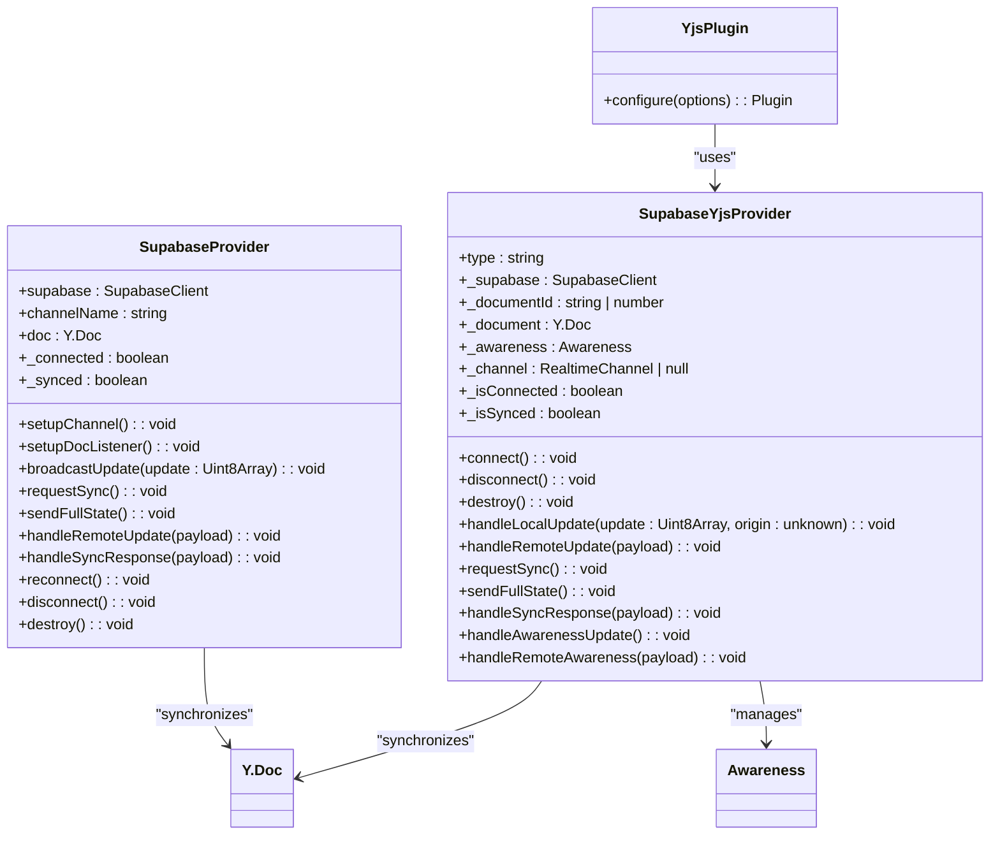
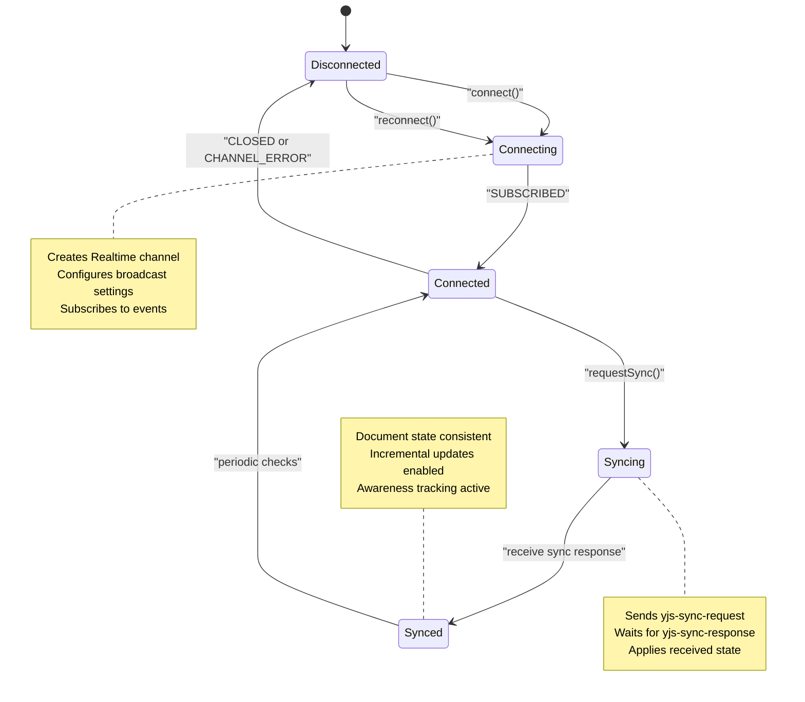
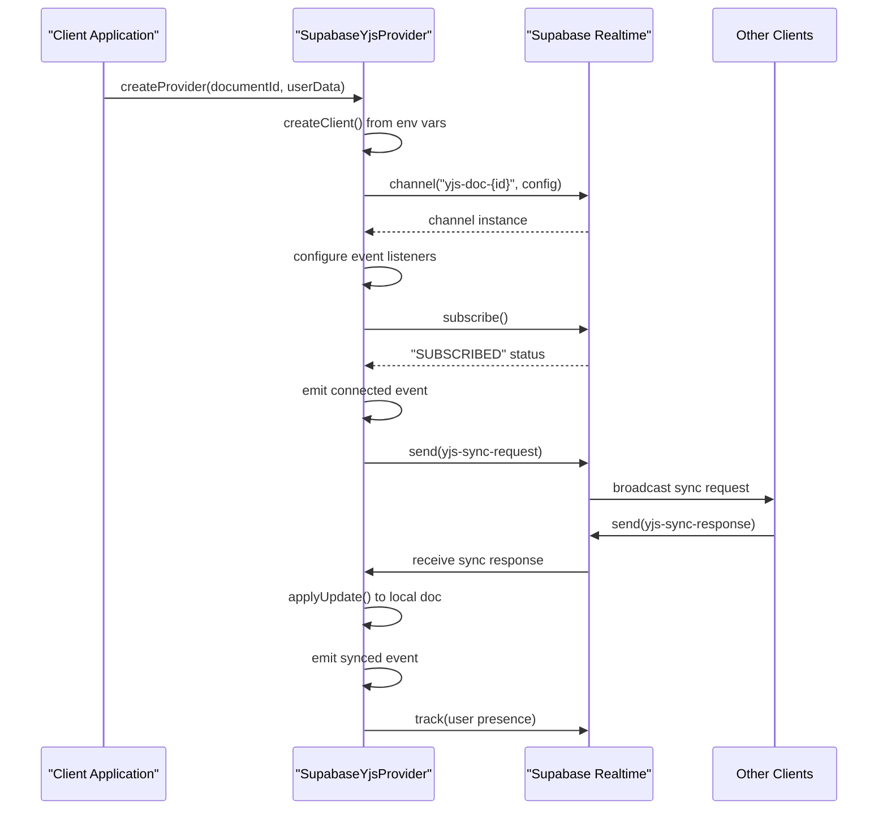
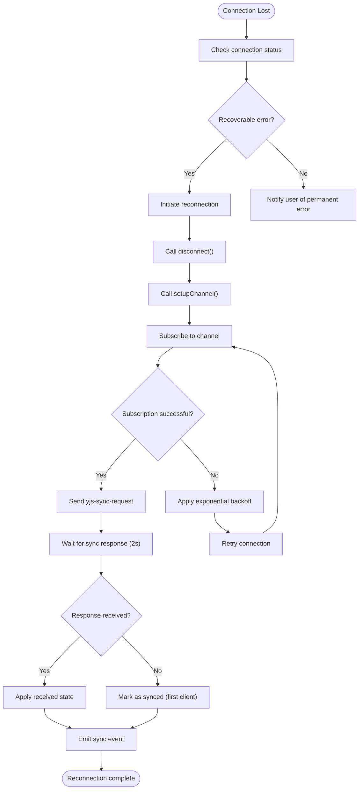
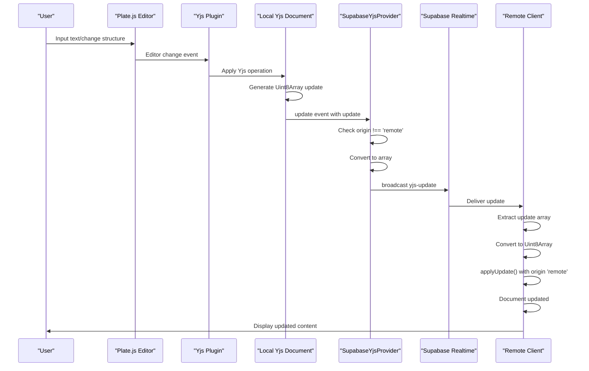
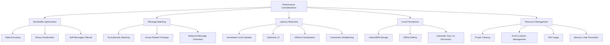
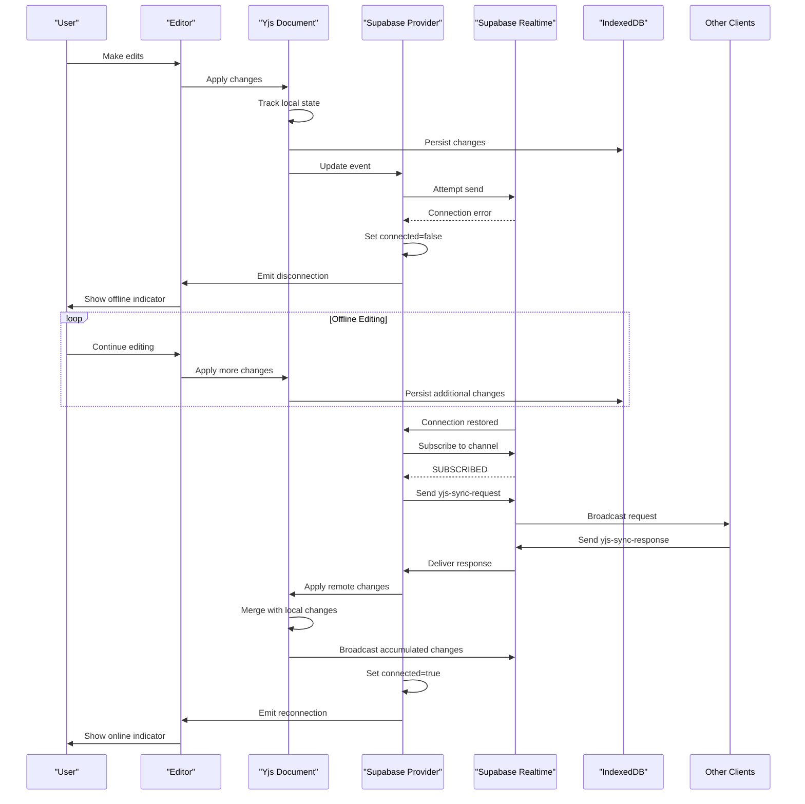
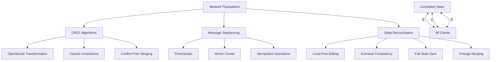

# Synchronization Mechanism

<cite>
**Referenced Files in This Document**   
- [supabase-provider.ts](file://lib/yjs/supabase-provider.ts)
- [supabase-yjs-provider.ts](file://lib/yjs/supabase-yjs-provider.ts)
- [collaborative-plate-editor.tsx](file://components/plate/collaborative-plate-editor.tsx)
- [use-yjs-collaboration.ts](file://hooks/use-yjs-collaboration.ts)
- [yjs-kit.tsx](file://components/plate/yjs-kit.tsx)
- [client.ts](file://app/_lib/supabase/client.ts)
</cite>

## Table of Contents
1. [Introduction](#introduction)
2. [Supabase Yjs Provider Implementation](#supabase-yjs-provider-implementation)
3. [Connection Lifecycle Management](#connection-lifecycle-management)
4. [Authentication and Channel Setup](#authentication-and-channel-setup)
5. [Reconnection Strategies](#reconnection-strategies)
6. [Collaborative Plate Editor Integration](#collaborative-plate-editor-integration)
7. [Data Flow from Input to Synchronization](#data-flow-from-input-to-synchronization)
8. [Change Detection and Network Transmission](#change-detection-and-network-transmission)
9. [Performance Considerations](#performance-considerations)
10. [Connection Interruption Handling](#connection-interruption-handling)
11. [Data Consistency During Network Fluctuations](#data-consistency-during-network-fluctuations)

## Introduction
The Sinesys real-time collaboration system implements a robust synchronization mechanism using Yjs as the Conflict-Free Replicated Data Type (CRDT) framework and Supabase Realtime as the transport layer. This architecture enables seamless real-time document collaboration across multiple clients, ensuring that all users see consistent content regardless of network conditions. The system is designed to handle the complexities of real-time editing, including concurrent modifications, network interruptions, and data consistency across distributed clients.

The synchronization mechanism is built around two primary components: the Supabase Yjs Provider, which manages the WebSocket connection and message routing, and the collaborative plate editor, which integrates with the Yjs CRDT system to propagate changes across clients. This document provides a comprehensive analysis of how these components work together to deliver a reliable and performant real-time collaboration experience.

**Section sources**
- [supabase-provider.ts](file://lib/yjs/supabase-provider.ts#L1-L251)
- [supabase-yjs-provider.ts](file://lib/yjs/supabase-yjs-provider.ts#L1-L358)

## Supabase Yjs Provider Implementation
The Supabase Yjs Provider is implemented as a custom provider that extends Yjs functionality to work with Supabase Realtime. The implementation consists of two main classes: `SupabaseProvider` and `SupabaseYjsProvider`, each serving different integration patterns within the application.

The `SupabaseProvider` class extends the Observable pattern from lib0 and implements a direct integration with Yjs documents. It establishes a Supabase Realtime channel using the broadcast configuration with `self: false` to prevent clients from receiving their own messages. The provider listens for three primary broadcast events: `yjs-update` for incremental changes, `yjs-sync-request` for synchronization requests, and `yjs-sync-response` for complete state transfers.

The `SupabaseYjsProvider` class implements the `UnifiedProvider` interface expected by @platejs/yjs, making it compatible with the Plate.js editor framework. This provider includes additional awareness functionality that tracks user presence and cursor positions. The awareness system uses Supabase's presence feature to maintain real-time information about connected users, including their names, colors, and current activity status.

Both providers follow a similar pattern of message handling: local document changes trigger broadcast messages to other clients, while incoming messages are applied to the local document state. The providers use Yjs's built-in encoding and decoding functions to serialize document updates as Uint8Array buffers, which are then converted to regular arrays for JSON-safe transmission over the WebSocket connection.



**Diagram sources **
- [supabase-provider.ts](file://lib/yjs/supabase-provider.ts#L44-L250)
- [supabase-yjs-provider.ts](file://lib/yjs/supabase-yjs-provider.ts#L78-L357)

**Section sources**
- [supabase-provider.ts](file://lib/yjs/supabase-provider.ts#L44-L250)
- [supabase-yjs-provider.ts](file://lib/yjs/supabase-yjs-provider.ts#L78-L357)

## Connection Lifecycle Management
The connection lifecycle in the Sinesys synchronization system follows a well-defined sequence of states and transitions, ensuring reliable communication between clients and the Supabase Realtime server. The lifecycle begins with the creation of a Supabase client instance, which is obtained through the `createClient()` function from the application's Supabase library.

When a client initializes the synchronization mechanism, it creates an instance of either `SupabaseProvider` or `SupabaseYjsProvider` with the necessary configuration options, including the Supabase client, document ID, and user data. The provider then establishes a connection to a specific Realtime channel using a naming convention that incorporates the document identifier (e.g., `yjs-doc-{documentId}` or `yjs:documento:{id}`).

The connection process involves several key steps:
1. Channel creation with broadcast and presence configuration
2. Subscription to the channel with status callbacks
3. Initial synchronization request to other connected clients
4. Establishment of document update listeners
5. Configuration of awareness tracking for user presence

The provider maintains two primary state flags: `connected` and `synced`. The `connected` flag indicates whether the WebSocket connection to the Supabase Realtime server is active, while the `synced` flag indicates whether the local document state is synchronized with the global state across all clients. These states are managed through event listeners that respond to channel subscription status changes and synchronization events.

When the connection is successfully established (SUBSCRIBED status), the provider emits a connection event and requests synchronization from other clients. If the connection fails or is closed, the provider cleans up resources and notifies the application through the appropriate callback functions. The system also handles graceful disconnection through the `disconnect()` method, which properly removes the channel from the Supabase client and resets internal state.



**Diagram sources **
- [supabase-provider.ts](file://lib/yjs/supabase-provider.ts#L81-L118)
- [supabase-yjs-provider.ts](file://lib/yjs/supabase-yjs-provider.ts#L134-L191)

**Section sources**
- [supabase-provider.ts](file://lib/yjs/supabase-provider.ts#L81-L118)
- [supabase-yjs-provider.ts](file://lib/yjs/supabase-yjs-provider.ts#L134-L191)

## Authentication and Channel Setup
The authentication mechanism for the Sinesys real-time collaboration system is built on Supabase's authentication infrastructure, which provides secure access to the Realtime WebSocket connections. The system uses publishable or anonymous keys rather than service role keys for client-side operations, following security best practices to prevent unauthorized access to the database.

Authentication is handled through the `createClient()` function in the Supabase client library, which reads environment variables for the Supabase URL and publishable key. The function includes validation to ensure these configuration values are present and issues warnings if service role keys are detected in the client code, as this would represent a security vulnerability.

Channel setup follows a consistent pattern across the synchronization providers. Each document is assigned a unique channel name based on its identifier, following the format `yjs-doc-{documentId}` for the `SupabaseYjsProvider` or `yjs:documento:{id}` for the `SupabaseProvider`. This naming convention ensures that each document has its own isolated communication channel, preventing cross-document interference.

The channel configuration includes two key settings: broadcast and presence. The broadcast configuration sets `self: false`, which prevents clients from receiving their own broadcast messages and avoids infinite loops of message propagation. The presence configuration includes a key based on the user ID or a random value, enabling the tracking of user presence within the document collaboration space.

When establishing the channel, the providers subscribe to multiple event types:
- Broadcast events for `yjs-update`, `yjs-sync-request`, `yjs-sync-response`, and `yjs-awareness`
- Presence events for user tracking and awareness

The subscription process includes status callbacks that notify the application of connection state changes, allowing for appropriate UI updates and error handling. Upon successful subscription, the provider automatically requests synchronization from other connected clients to ensure the local document state is up-to-date.



**Diagram sources **
- [client.ts](file://app/_lib/supabase/client.ts#L1-L25)
- [supabase-yjs-provider.ts](file://lib/yjs/supabase-yjs-provider.ts#L140-L151)

**Section sources**
- [client.ts](file://app/_lib/supabase/client.ts#L1-L25)
- [supabase-yjs-provider.ts](file://lib/yjs/supabase-yjs-provider.ts#L140-L151)

## Reconnection Strategies
The Sinesys synchronization system implements robust reconnection strategies to handle network interruptions and maintain data consistency across clients. The reconnection mechanism is designed to automatically recover from connection losses without requiring user intervention, ensuring a seamless collaboration experience even in unstable network conditions.

The primary reconnection method is exposed through the `reconnect()` function in both provider implementations. This method follows a clean disconnect-reconnect pattern: it first calls `disconnect()` to properly clean up the existing channel and reset internal state, then calls `setupChannel()` (or `connect()` in the case of `SupabaseYjsProvider`) to establish a new connection. This approach ensures that resources are properly released and prevents potential memory leaks or stale connections.

The system employs a timeout-based synchronization strategy to handle cases where a client is the first to connect to a document. When a client connects, it broadcasts a `yjs-sync-request` message to other potential clients. If no response is received within 2 seconds, the client assumes it is the only connected client and marks itself as synchronized. This prevents indefinite waiting and allows editing to commence immediately when working alone.

The providers also implement automatic reconnection through Supabase Realtime's built-in retry mechanisms. When a connection is lost due to network issues, Supabase automatically attempts to reconnect using exponential backoff. The application layer complements this with its own state management, tracking connection status and notifying the UI of connectivity changes.

Error handling is integrated throughout the reconnection process. The providers emit connection error events and invoke the `onSyncError` callback when synchronization failures occur. These errors are logged to the console and can be reported to monitoring systems for diagnostic purposes. The system distinguishes between temporary network issues, which trigger automatic reconnection attempts, and permanent errors, which may require user intervention.



**Diagram sources **
- [supabase-provider.ts](file://lib/yjs/supabase-provider.ts#L225-L240)
- [supabase-yjs-provider.ts](file://lib/yjs/supabase-yjs-provider.ts#L197-L210)

**Section sources**
- [supabase-provider.ts](file://lib/yjs/supabase-provider.ts#L225-L240)
- [supabase-yjs-provider.ts](file://lib/yjs/supabase-yjs-provider.ts#L197-L210)

## Collaborative Plate Editor Integration
The collaborative plate editor in Sinesys integrates the Yjs CRDT system with the Plate.js rich text editor framework to provide real-time collaborative editing capabilities. The integration is implemented through the `CollaborativePlateEditor` component, which serves as a wrapper around the standard Plate.js editor with added synchronization functionality.

The editor component accepts several key props: the document ID for synchronization, current user information, initial document value, and callback functions for change notifications and connection status updates. When initialized, the component creates a Supabase client instance and sets up the Yjs synchronization provider with the provided document ID and user data.

The integration process follows these steps:
1. Creation of a `SupabaseYjsProvider` instance with the document ID and user information
2. Configuration of the Yjs plugin with the provider and cursor options
3. Combination of the standard editor plugins with the Yjs plugin
4. Connection of the provider to the Realtime channel
5. Rendering of the Plate.js editor with the configured plugins

The component uses React's `useEffect` hook to manage the lifecycle of the synchronization provider, ensuring proper setup and cleanup. When the component unmounts, it calls the provider's `destroy()` method to disconnect from the Realtime channel and release resources, preventing memory leaks and unnecessary network activity.

User cursors are visualized through the awareness system, with each user assigned a unique color from a predefined palette based on their user ID. The cursor colors are determined by the `getUserColor()` function, which uses modulo arithmetic to cycle through the available colors. This ensures visual distinction between multiple collaborators while maintaining consistency across sessions.

The editor also includes a fallback loading state that displays while the synchronization system is initializing. This provides visual feedback to users during the connection process, improving the user experience during the typically brief setup period.

```mermaid
classDiagram
class CollaborativePlateEditor {
+documentoId : number
+currentUser : {id : number, name : string}
+initialValue : Descendant[]
+onChange : (value : Descendant[]) => void
+onConnectionChange : (isConnected : boolean) => void
+onSyncChange : (isSynced : boolean) => void
+providerRef : Ref<SupabaseYjsProvider>
+isReady : boolean
+editorPlugins : Plugin[]
}
class SupabaseYjsProvider {
+document : Y.Doc
+awareness : Awareness
+connect() : void
+disconnect() : void
}
class YjsPlugin {
+configure(options) : Plugin
}
class PlateEditor {
+plugins : Plugin[]
+value : Value
+onChange : (value : Value) => void
}
CollaborativePlateEditor --> SupabaseYjsProvider : "creates"
CollaborativePlateEditor --> YjsPlugin : "configures"
CollaborativePlateEditor --> PlateEditor : "renders"
YjsPlugin --> SupabaseYjsProvider : "uses"
PlateEditor --> EditorKit : "uses"
```

**Diagram sources **
- [collaborative-plate-editor.tsx](file://components/plate/collaborative-plate-editor.tsx#L72-L187)
- [supabase-yjs-provider.ts](file://lib/yjs/supabase-yjs-provider.ts#L78-L357)

**Section sources**
- [collaborative-plate-editor.tsx](file://components/plate/collaborative-plate-editor.tsx#L72-L187)

## Data Flow from Input to Synchronization
The data flow in the Sinesys real-time collaboration system follows a well-defined path from user input to remote synchronization, ensuring that all changes are properly propagated across clients while maintaining data consistency. The flow begins when a user makes an edit in the Plate.js editor, triggering a series of events that ultimately result in the change being broadcast to all connected clients.

When a user inputs text or modifies the document structure, the Plate.js editor generates a change event that is captured by the Yjs plugin. The plugin translates these editor-specific changes into Yjs operations, which are then applied to the local Yjs document. This application process generates a binary update in the form of a Uint8Array, which represents the incremental changes to the document state.

The local Yjs document emits an 'update' event with this binary update, which is captured by the Supabase Yjs provider. The provider checks the origin of the update to ensure it doesn't originate from a remote synchronization (preventing infinite loops), then converts the Uint8Array to a regular array for JSON serialization. This serialized update is then broadcast to the Supabase Realtime channel using the 'yjs-update' event.

On receiving clients, the process reverses: the binary update is extracted from the broadcast message, converted back to a Uint8Array, and applied to the local Yjs document using Yjs's `applyUpdate()` function. This function automatically resolves any conflicts using Yjs's CRDT algorithms, ensuring that all clients converge to the same state regardless of the order in which updates are received.

The system also handles initial synchronization through a three-step process: when a new client connects, it requests the full document state from existing clients, receives this state as a 'yjs-sync-response' message, and applies it to initialize its local document. This ensures that new clients start with the most current version of the document.



**Diagram sources **
- [supabase-yjs-provider.ts](file://lib/yjs/supabase-yjs-provider.ts#L224-L238)
- [supabase-yjs-provider.ts](file://lib/yjs/supabase-yjs-provider.ts#L243-L249)

**Section sources**
- [supabase-yjs-provider.ts](file://lib/yjs/supabase-yjs-provider.ts#L224-L249)

## Change Detection and Network Transmission
The change detection and network transmission mechanism in Sinesys is optimized for efficiency and reliability, minimizing bandwidth usage while ensuring timely propagation of document changes. The system leverages Yjs's efficient delta encoding to represent only the changes between document states, rather than transmitting the entire document content with each update.

Change detection is handled natively by Yjs, which automatically tracks modifications to the shared document state. When any part of the document is modified, Yjs generates a compact binary representation of the changes as a Uint8Array. This delta encoding is highly efficient, typically resulting in very small payloads even for substantial document modifications.

The network transmission process is optimized through several mechanisms:
1. **Message batching**: Multiple small changes that occur in quick succession are automatically batched by Yjs into a single update message, reducing the number of WebSocket messages and associated overhead.
2. **Binary serialization**: The use of Uint8Array for update representation minimizes payload size compared to text-based formats like JSON.
3. **Incremental updates**: Only the changes are transmitted, not the complete document state, significantly reducing bandwidth requirements.
4. **Origin filtering**: The system prevents clients from processing their own broadcast messages by checking the update origin, eliminating unnecessary processing.

The transmission pipeline includes several validation and error handling steps. Before sending an update, the provider checks whether the WebSocket connection is active and the channel is subscribed. If these conditions are not met, the update is silently dropped, as it will be captured in subsequent synchronization cycles.

For initial synchronization, the system uses a different transmission strategy. When a new client connects, it requests the complete document state from existing clients using a `yjs-sync-request` message. The responding client encodes the entire document state using Yjs's `encodeStateAsUpdate()` function and transmits it as a `yjs-sync-response` message. This complete state transfer ensures that new clients start with an accurate representation of the document.

The system also includes safeguards against message corruption or loss. Each message includes a timestamp, allowing clients to detect and handle out-of-order delivery. The CRDT nature of Yjs ensures that updates can be applied in any order, making the system resilient to network latency and packet reordering.

```mermaid
flowchart LR
A[User Input] --> B[Yjs Change Detection]
B --> C{Origin === 'remote'?}
C --> |Yes| D[Ignore Update]
C --> |No| E[Generate Uint8Array Delta]
E --> F{Connected?}
F --> |No| G[Drop Update]
F --> |Yes| H[Convert to Array]
H --> I[Add Timestamp]
I --> J[Send via Broadcast]
J --> K[Supabase Realtime]
K --> L[Other Clients]
L --> M[Convert to Uint8Array]
M --> N[applyUpdate() with origin 'remote']
N --> O[Document Updated]
P[New Client Connects] --> Q[Send yjs-sync-request]
Q --> R[Existing Client]
R --> S[encodeStateAsUpdate()]
S --> T[Send yjs-sync-response]
T --> U[New Client]
U --> V[applyUpdate() with origin 'remote']
V --> W[Document Initialized]
```

**Diagram sources **
- [supabase-yjs-provider.ts](file://lib/yjs/supabase-yjs-provider.ts#L224-L238)
- [supabase-yjs-provider.ts](file://lib/yjs/supabase-yjs-provider.ts#L276-L288)

**Section sources**
- [supabase-yjs-provider.ts](file://lib/yjs/supabase-yjs-provider.ts#L224-L288)

## Performance Considerations
The Sinesys real-time collaboration system incorporates several performance optimizations to ensure responsive editing and efficient network usage, even with large documents and multiple concurrent users. These optimizations address bandwidth consumption, message processing overhead, and latency reduction through careful design and implementation choices.

Bandwidth optimization is achieved primarily through Yjs's efficient delta encoding, which transmits only the changes between document states rather than the complete content. This approach results in extremely small message sizes, typically just a few hundred bytes even for substantial edits. The system further reduces bandwidth usage by avoiding the transmission of a client's own changes back to itself through the `self: false` broadcast configuration.

Message batching is handled automatically by Yjs, which groups multiple small changes that occur within a short time window into a single update message. This reduces the number of WebSocket messages and associated protocol overhead, improving both network efficiency and processing performance. The batching occurs at the Yjs level, ensuring that related changes are transmitted together regardless of their source.

Latency reduction is addressed through several mechanisms:
1. **Immediate local updates**: Changes are applied to the local document immediately, providing instant visual feedback to the user without waiting for network confirmation.
2. **Optimistic UI updates**: The editor reflects changes as soon as they are made locally, creating the perception of zero-latency editing.
3. **Efficient binary serialization**: The use of Uint8Array for update representation minimizes serialization overhead compared to text-based formats.
4. **Connection multiplexing**: Multiple document updates can share the same WebSocket connection, reducing connection establishment overhead.

The system also implements local persistence using IndexedDB through the `IndexeddbPersistence` class from y-indexeddb. This ensures that document changes are saved locally even when offline, allowing users to continue editing without network connectivity. When the connection is restored, local changes are automatically synchronized with the server and other clients.

Resource management is carefully handled to prevent memory leaks and excessive CPU usage. The providers properly clean up event listeners and WebSocket connections when no longer needed, and the use of React refs ensures that provider instances are maintained across component re-renders without unnecessary recreation.



**Diagram sources **
- [use-yjs-collaboration.ts](file://hooks/use-yjs-collaboration.ts#L98-L110)
- [supabase-yjs-provider.ts](file://lib/yjs/supabase-yjs-provider.ts#L224-L238)

**Section sources**
- [use-yjs-collaboration.ts](file://hooks/use-yjs-collaboration.ts#L98-L110)
- [supabase-yjs-provider.ts](file://lib/yjs/supabase-yjs-provider.ts#L224-L238)

## Connection Interruption Handling
The Sinesys synchronization system implements comprehensive connection interruption handling to maintain data integrity and provide a seamless user experience during network disruptions. The system is designed to gracefully handle various types of connection issues, from temporary network glitches to prolonged outages, ensuring that user data is preserved and collaboration can resume when connectivity is restored.

When a connection interruption occurs, the Supabase Realtime client automatically detects the disconnection and transitions to a disconnected state. The synchronization provider responds by setting its `connected` flag to false and emitting a disconnection event to notify the application. This triggers UI updates to inform users of the connectivity status, typically through visual indicators in the editor interface.

During the disconnected state, the system continues to function in an offline mode:
1. User edits are still captured and applied to the local Yjs document
2. Changes are stored in memory and persisted to IndexedDB for durability
3. The local document state continues to track all modifications
4. Users can continue editing without interruption

The system leverages IndexedDB persistence to ensure that changes made while offline are not lost. The `IndexeddbPersistence` instance automatically saves the document state to the browser's local storage, providing a durable backup that survives page refreshes and application restarts.

When the network connection is restored, Supabase automatically attempts to re-establish the WebSocket connection using exponential backoff. Upon successful reconnection, the synchronization provider initiates a full synchronization process:
1. It requests the current document state from other connected clients
2. It receives and applies any changes that occurred while it was disconnected
3. It broadcasts its own accumulated changes to the other clients
4. All clients converge to a consistent state through Yjs's CRDT algorithms

The reconnection process includes conflict resolution handled automatically by Yjs. If multiple clients made changes to the same parts of the document while disconnected, Yjs's operational transformation algorithms ensure that all changes are merged consistently according to well-defined rules, preserving the intent of all users' edits.



**Diagram sources **
- [use-yjs-collaboration.ts](file://hooks/use-yjs-collaboration.ts#L113-L131)
- [supabase-provider.ts](file://lib/yjs/supabase-provider.ts#L111-L117)

**Section sources**
- [use-yjs-collaboration.ts](file://hooks/use-yjs-collaboration.ts#L113-L131)
- [supabase-provider.ts](file://lib/yjs/supabase-provider.ts#L111-L117)

## Data Consistency During Network Fluctuations
The Sinesys real-time collaboration system ensures data consistency during network fluctuations through a combination of CRDT algorithms, message sequencing, and state reconciliation mechanisms. The system is designed to handle the challenges of distributed systems where network latency, packet loss, and out-of-order delivery are common occurrences.

At the core of the consistency model is Yjs's CRDT implementation, which guarantees that all clients will eventually converge to the same state regardless of the order in which updates are received. Yjs uses a sophisticated operational transformation algorithm that can merge concurrent edits in a way that preserves the intent of all users. This means that even if multiple users edit the same document simultaneously while experiencing network delays, the final result will be consistent across all clients.

The system handles out-of-order message delivery through several mechanisms:
1. **Timestamps**: Each message includes a timestamp, allowing clients to detect and properly sequence updates that arrive out of order.
2. **State-based synchronization**: In addition to incremental updates, the system supports full state synchronization, which can resolve any inconsistencies that might arise from prolonged network issues.
3. **Vector clocks**: Yjs internally uses vector clocks to track the causal relationships between operations, ensuring that updates are applied in a causally consistent order.

During periods of network fluctuation, the system maintains consistency through:
- **Local-first editing**: All changes are applied locally immediately, providing a responsive user experience
- **Eventual consistency**: The system guarantees that all clients will eventually reach the same state once the network stabilizes
- **Conflict-free merging**: Yjs's algorithms ensure that concurrent edits are merged without conflicts
- **Idempotent operations**: Update application is idempotent, meaning that receiving the same update multiple times does not change the result

The system also implements a reconciliation process that occurs when clients reconnect after a disconnection. This process involves:
1. Requesting the current document state from connected clients
2. Receiving and applying any changes that occurred during the disconnection
3. Broadcasting local changes that were made while offline
4. Allowing Yjs to merge the changes from multiple sources into a consistent state

This approach ensures that no data is lost during network interruptions and that all users' contributions are preserved, regardless of the network conditions they experienced.



**Diagram sources **
- [supabase-provider.ts](file://lib/yjs/supabase-provider.ts#L192-L219)
- [supabase-yjs-provider.ts](file://lib/yjs/supabase-yjs-provider.ts#L294-L305)

**Section sources**
- [supabase-provider.ts](file://lib/yjs/supabase-provider.ts#L192-L219)
- [supabase-yjs-provider.ts](file://lib/yjs/supabase-yjs-provider.ts#L294-L305)