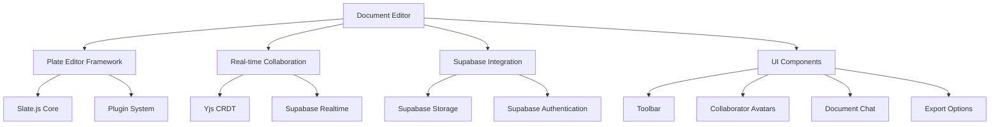
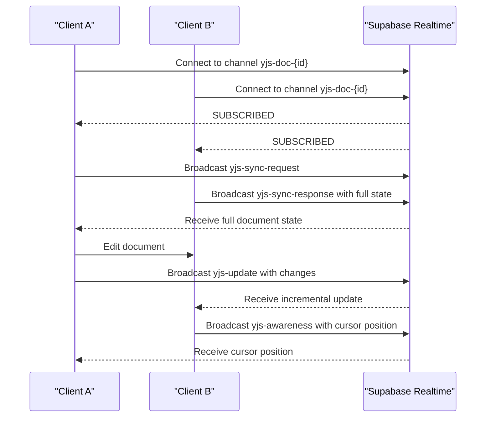
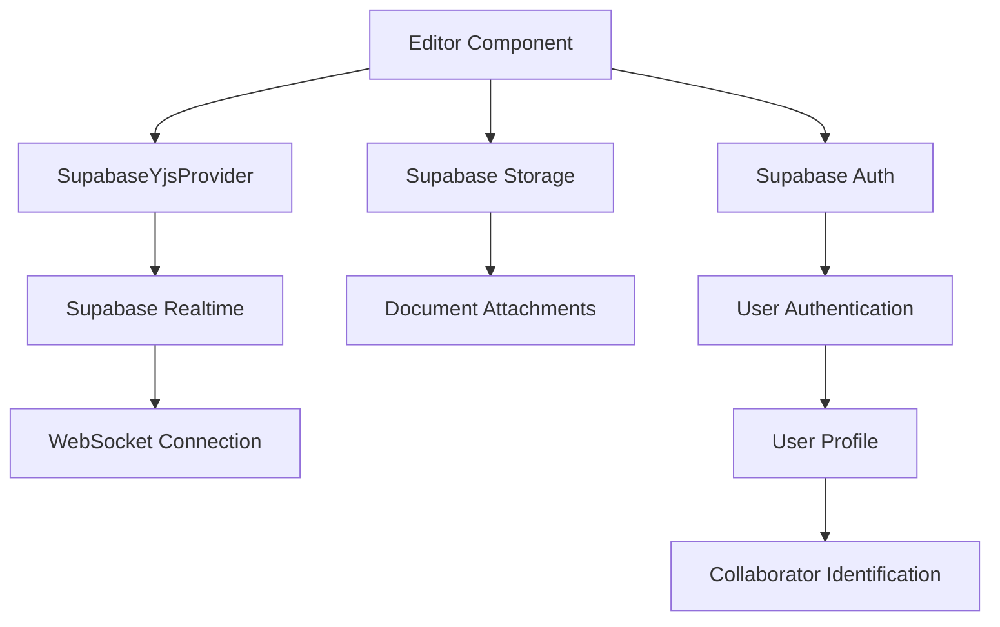
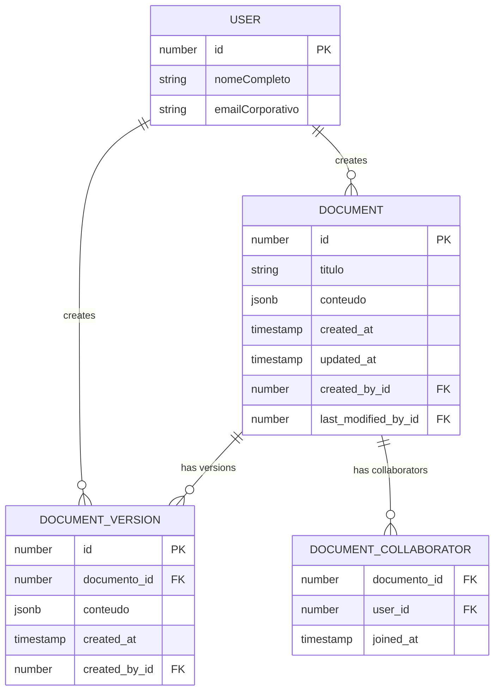

# Core Editor

<cite>
**Referenced Files in This Document**   
- [plate-editor.tsx](file://components/plate/plate-editor.tsx)
- [collaborative-plate-editor.tsx](file://components/plate/collaborative-plate-editor.tsx)
- [supabase-yjs-provider.ts](file://lib/yjs/supabase-yjs-provider.ts)
- [supabase-provider.ts](file://lib/yjs/supabase-provider.ts)
- [editor-kit.tsx](file://components/plate/editor-kit.tsx)
- [plate-types.ts](file://components/plate/plate-types.ts)
- [document-editor.tsx](file://components/documentos/document-editor.tsx)
- [use-realtime-collaboration.ts](file://hooks/use-realtime-collaboration.ts)
- [client.ts](file://lib/supabase/client.ts)
</cite>

## Table of Contents
1. [Introduction](#introduction)
2. [Editor Architecture](#editor-architecture)
3. [Plate Editor Framework](#plate-editor-framework)
4. [Real-time Collaboration with Yjs](#real-time-collaboration-with-yjs)
5. [Supabase Integration](#supabase-integration)
6. [Data Model and Serialization](#data-model-and-serialization)
7. [Performance Considerations](#performance-considerations)
8. [Browser Compatibility](#browser-compatibility)
9. [Conclusion](#conclusion)

## Introduction
The Sinesys core document editor is a sophisticated rich-text editing system built on Slate.js through the Plate framework. This document provides a comprehensive analysis of the editor's architecture, focusing on its implementation as a React component with composable plugins, real-time collaboration capabilities using Yjs and CRDTs, integration with Supabase for persistent storage, and the complete rendering pipeline from Next.js server-side rendering to client-side interactivity. The editor supports advanced features including AI-powered editing, collaborative annotations, version history, and document sharing, making it a central component of the Sinesys platform.

## Editor Architecture
The document editor in Sinesys follows a modular, component-based architecture that separates concerns between the core editing functionality, collaboration features, and UI presentation. The architecture is built around the Plate framework, which provides a plugin system for extending Slate.js functionality. The editor components are organized in a hierarchical structure with clear separation between the collaborative and non-collaborative variants, allowing for flexible usage patterns across different parts of the application.

**Diagram sources**
- [document-editor.tsx](file://components/documentos/document-editor.tsx)
- [plate-editor.tsx](file://components/plate/plate-editor.tsx)
- [collaborative-plate-editor.tsx](file://components/plate/collaborative-plate-editor.tsx)

**Section sources**
- [document-editor.tsx](file://components/documentos/document-editor.tsx)
- [plate-editor.tsx](file://components/plate/plate-editor.tsx)

## Plate Editor Framework
The Plate editor framework serves as the foundation for the rich-text editing capabilities in Sinesys. Built on top of Slate.js, Plate provides a comprehensive set of plugins and utilities that extend the core functionality of Slate to support advanced editing features. The framework is implemented as a React component with a composable plugin architecture that allows for modular feature addition and configuration.

The editor is configured through the `EditorKit` which aggregates multiple plugin kits, each responsible for a specific set of features. This composable approach enables the editor to support a wide range of functionality while maintaining a clean separation of concerns. The plugin system includes support for basic nodes (headings, paragraphs, blockquotes), marks (bold, italic, underline), and advanced blocks (code blocks, tables, media embeds).

```mermaid
graph TD
A[EditorKit] --> B[AIKit]
A --> C[CopilotKit]
A --> D[BasicBlocksKit]
A --> E[CodeBlockKit]
A --> F[TableKit]
A --> G[ToggleKit]
A --> H[TocKit]
A --> I[MediaKit]
A --> J[CalloutKit]
A --> K[ColumnKit]
A --> L[MathKit]
A --> M[DateKit]
A --> N[LinkKit]
A --> O[MentionKit]
A --> P[BasicMarksKit]
A --> Q[FontKit]
A --> R[ListKit]
A --> S[AlignKit]
A --> T[LineHeightKit]
A --> U[DiscussionKit]
A --> V[CommentKit]
A --> W[SuggestionKit]
A --> X[SlashKit]
A --> Y[AutoformatKit]
A --> Z[CursorOverlayKit]
A --> AA[BlockMenuKit]
A --> AB[DndKit]
A --> AC[EmojiKit]
A --> AD[ExitBreakKit]
A --> AE[DocxKit]
A --> AF[MarkdownKit]
A --> AG[BlockPlaceholderKit]
A --> AH[FixedToolbarKit]
A --> AI[FloatingToolbarKit]
```

**Diagram sources**
- [editor-kit.tsx](file://components/plate/editor-kit.tsx)
- [plate-editor.tsx](file://components/plate/plate-editor.tsx)

**Section sources**
- [editor-kit.tsx](file://components/plate/editor-kit.tsx)
- [plate-editor.tsx](file://components/plate/plate-editor.tsx)

## Real-time Collaboration with Yjs
The Sinesys editor implements real-time collaboration using Yjs, a CRDT (Conflict-Free Replicated Data Type) library that enables seamless multi-user editing without merge conflicts. The collaboration system is built around the `SupabaseYjsProvider` which integrates Yjs with Supabase Realtime for efficient WebSocket-based synchronization.

The collaborative editor component (`CollaborativePlateEditor`) manages the Yjs provider lifecycle, connecting to a Supabase Realtime channel when mounted and disconnecting when unmounted. The provider handles three types of communication: document updates, awareness information, and sync requests. Document updates are incremental changes broadcast to all connected clients, while awareness information includes user presence and cursor positions. The sync mechanism ensures that new clients receive the complete document state when joining a session.

**Diagram sources**
- [collaborative-plate-editor.tsx](file://components/plate/collaborative-plate-editor.tsx)
- [supabase-yjs-provider.ts](file://lib/yjs/supabase-yjs-provider.ts)

**Section sources**
- [collaborative-plate-editor.tsx](file://components/plate/collaborative-plate-editor.tsx)
- [supabase-yjs-provider.ts](file://lib/yjs/supabase-yjs-provider.ts)

## Supabase Integration
The editor integrates with Supabase for both persistent storage and real-time collaboration. The integration is implemented through a custom `SupabaseYjsProvider` that uses Supabase Realtime as the transport layer for Yjs operations. This provider establishes WebSocket connections to Supabase channels, enabling efficient synchronization of document changes between clients.

Authentication is handled through Supabase's built-in authentication system, with user information retrieved from the Supabase auth service and used to identify collaborators in the editor. The editor also uses Supabase storage for document attachments and media files, providing a complete solution for document management within the Sinesys platform.

The integration follows a clean separation of concerns, with the `createClient` function from `lib/supabase/client.ts` providing a consistent interface for accessing the Supabase client throughout the application. This abstraction allows for easy configuration and potential replacement of the backend service if needed.

**Diagram sources**
- [supabase-yjs-provider.ts](file://lib/yjs/supabase-yjs-provider.ts)
- [client.ts](file://lib/supabase/client.ts)
- [document-editor.tsx](file://components/documentos/document-editor.tsx)

**Section sources**
- [supabase-yjs-provider.ts](file://lib/yjs/supabase-yjs-provider.ts)
- [client.ts](file://lib/supabase/client.ts)

## Data Model and Serialization
The editor's data model is based on Slate.js's document structure, which represents content as a tree of nodes with rich text at the leaves. The document content is serialized to JSON format for storage in the database, with a well-defined schema that supports all editor features including formatting, embedded media, and collaborative annotations.

The data model is defined in `plate-types.ts`, which extends the base Slate types with Sinesys-specific interfaces for various element types. Each node type has a specific structure with properties for type identification, children, and additional attributes. For example, a paragraph element includes text alignment and line height properties, while a code block element contains an array of code line elements.

The serialization process converts the in-memory Slate document to a JSON-serializable format that can be stored in the database and transmitted over the network. When loading a document, the JSON data is deserialized back into a Slate document structure, preserving all formatting and structural information.

**Diagram sources**
- [plate-types.ts](file://components/plate/plate-types.ts)
- [document-editor.tsx](file://components/documentos/document-editor.tsx)

**Section sources**
- [plate-types.ts](file://components/plate/plate-types.ts)
- [document-editor.tsx](file://components/documentos/document-editor.tsx)

## Performance Considerations
The editor implementation includes several performance optimizations to ensure smooth operation, particularly with large documents. The auto-save functionality uses a debounce mechanism with a 2-second delay to prevent excessive network requests while still providing frequent saving. This balance between responsiveness and efficiency helps maintain a good user experience without overwhelming the server.

For large documents, the editor could benefit from additional optimizations such as virtualized rendering of content, which would only render visible portions of the document rather than the entire content tree. The current implementation loads the complete document content on initialization, which could lead to performance issues with very large documents.

The collaboration system is designed to minimize network traffic by using incremental updates rather than transmitting the complete document state with each change. The Yjs CRDT implementation ensures that only the changes are transmitted, reducing bandwidth usage and improving responsiveness in collaborative editing scenarios.

**Section sources**
- [document-editor.tsx](file://components/documentos/document-editor.tsx)
- [collaborative-plate-editor.tsx](file://components/plate/collaborative-plate-editor.tsx)

## Browser Compatibility
The editor is implemented as a client-side React component using modern web standards. It relies on the `contenteditable` attribute for text input, which is supported across all modern browsers but can exhibit inconsistent behavior in edge cases. The implementation uses Slate.js's cross-browser compatibility layer to normalize these differences and provide a consistent editing experience.

The editor leverages several modern JavaScript features including ES6+ syntax, async/await, and Web APIs such as WebSockets for real-time collaboration. These features are well-supported in current browser versions, but may require polyfills for older browsers if compatibility with legacy systems is required.

The responsive design ensures the editor works well on different screen sizes, with a flexible layout that adapts to the available space. The mobile experience could be further optimized with touch-specific interactions and a simplified toolbar for smaller screens.

**Section sources**
- [plate-editor.tsx](file://components/plate/plate-editor.tsx)
- [document-editor.tsx](file://components/documentos/document-editor.tsx)

## Conclusion
The Sinesys core document editor represents a sophisticated implementation of a modern rich-text editing system, combining the flexibility of Slate.js with the collaborative capabilities of Yjs and the robust infrastructure of Supabase. The modular architecture with composable plugins allows for extensive customization and feature extension, while the real-time collaboration system provides a seamless multi-user editing experience.

The integration with Supabase for both storage and real-time synchronization creates a cohesive backend solution that handles authentication, data persistence, and live updates efficiently. The well-defined data model and serialization process ensure data integrity and consistency across different components of the system.

Future enhancements could include improved performance optimizations for large documents, enhanced mobile support, and additional AI-powered editing features. The current implementation provides a solid foundation for a collaborative document editing platform with room for continued innovation and improvement.