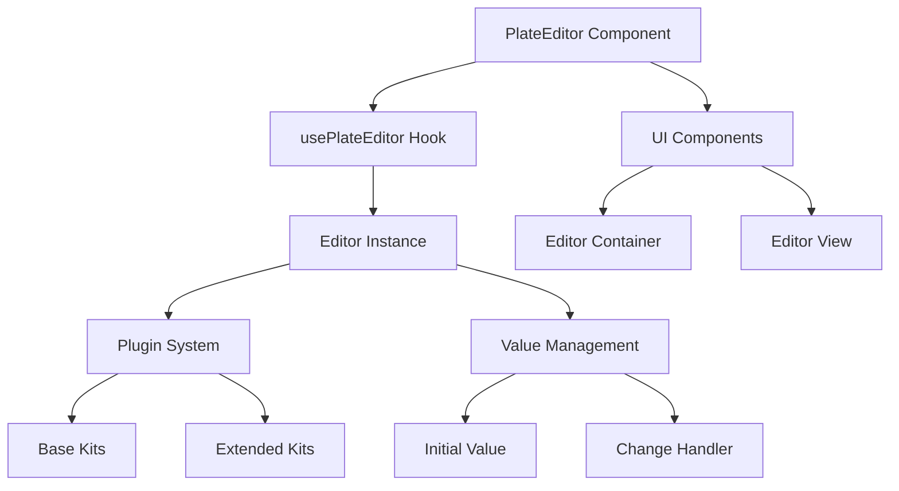
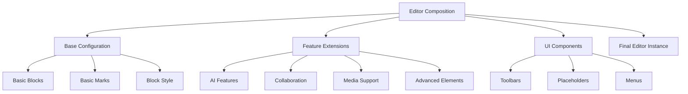
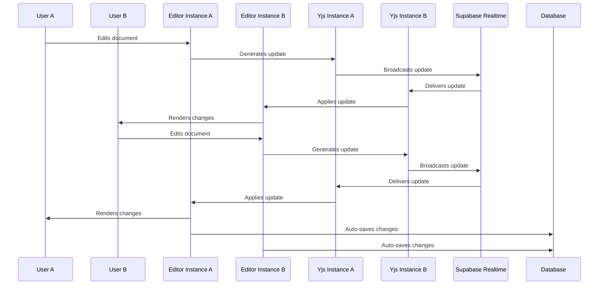
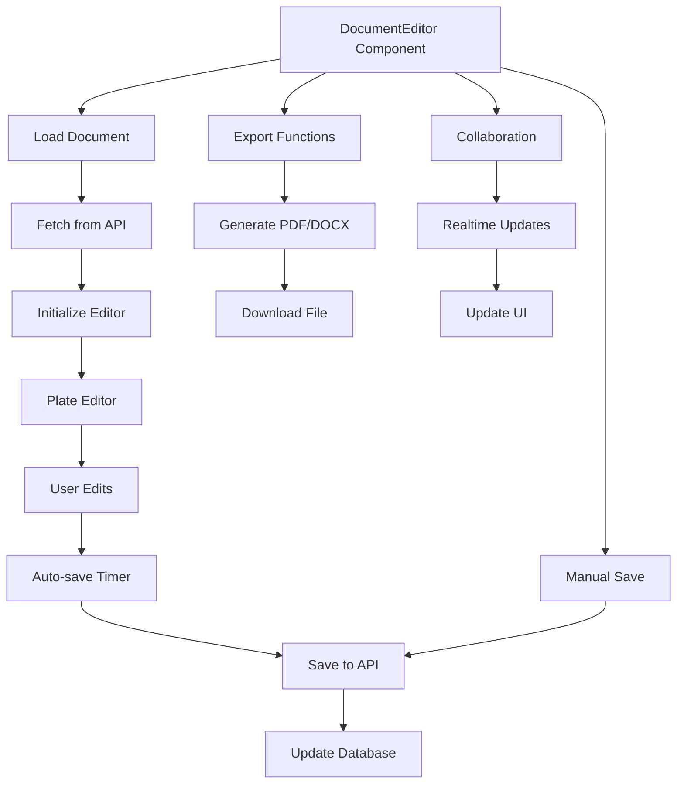
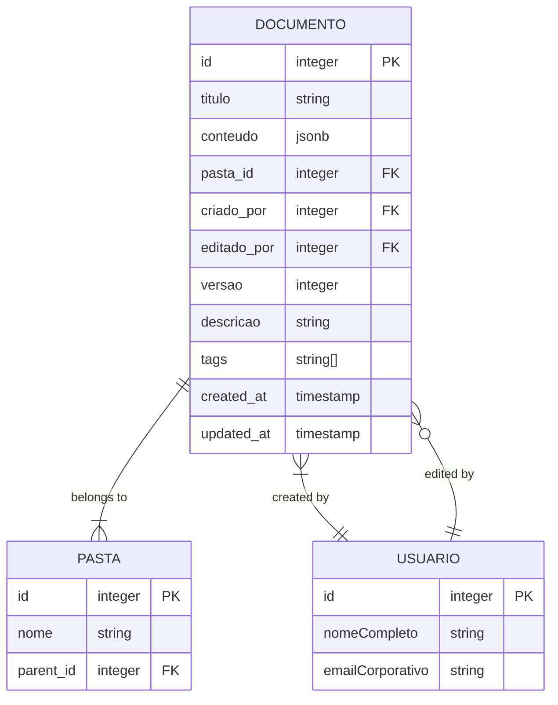
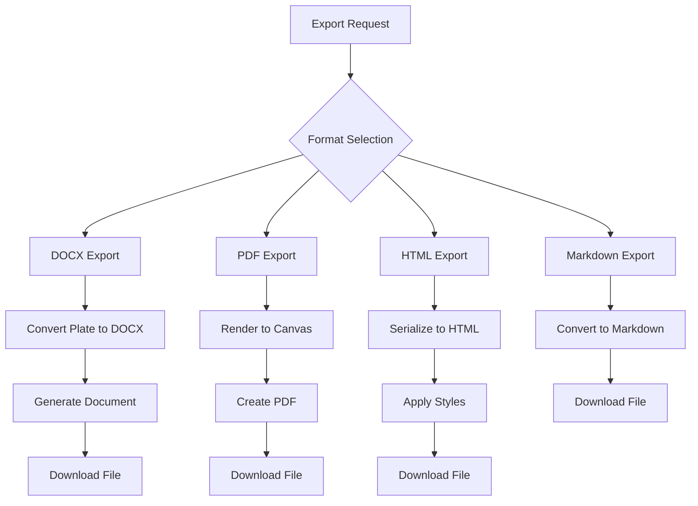

# Editor Architecture

<cite>
**Referenced Files in This Document**   
- [plate-editor.tsx](file://components/plate/plate-editor.tsx)
- [editor-kit.tsx](file://components/plate/editor-kit.tsx)
- [collaborative-plate-editor.tsx](file://components/plate/collaborative-plate-editor.tsx)
- [plate-types.ts](file://components/plate/plate-types.ts)
- [document-editor.tsx](file://components/documentos/document-editor.tsx)
- [supabase-yjs-provider.ts](file://lib/yjs/supabase-yjs-provider.ts)
- [basic-blocks-base-kit.tsx](file://components/plate/basic-blocks-base-kit.tsx)
- [basic-marks-base-kit.tsx](file://components/plate/basic-marks-base-kit.tsx)
- [fixed-toolbar-kit.tsx](file://components/plate/fixed-toolbar-kit.tsx)
- [floating-toolbar-kit.tsx](file://components/plate/floating-toolbar-kit.tsx)
- [list-kit.tsx](file://components/plate/list-kit.tsx)
- [editor-base-kit.tsx](file://components/plate/editor-base-kit.tsx)
- [yjs-kit.tsx](file://components/plate/yjs-kit.tsx)
- [docx-kit.tsx](file://components/plate/docx-kit.tsx)
- [types.ts](file://backend/types/documentos/types.ts)
- [export-docx.ts](file://app/_lib/documentos/export-docx.ts)
- [editor.tsx](file://components/ui/editor.tsx)
</cite>

## Table of Contents
1. [Introduction](#introduction)
2. [Core Architecture](#core-architecture)
3. [Modular Plugin System](#modular-plugin-system)
4. [Editor Composition and Configuration](#editor-composition-and-configuration)
5. [Collaborative Editing Implementation](#collaborative-editing-implementation)
6. [Document Management Integration](#document-management-integration)
7. [Data Model and Content Structure](#data-model-and-content-structure)
8. [Export and Interoperability](#export-and-interoperability)
9. [Conclusion](#conclusion)

## Introduction

The Sinesys editor architecture is built on the Plate.js framework, a powerful React-based rich text editor system built on top of Slate.js. This architecture provides a comprehensive solution for document creation and collaboration within the Sinesys platform. The editor implementation features a modular plugin architecture that enables composable functionality through editor kits, allowing for flexible configuration of rich text capabilities.

The editor system is designed to support both standalone and collaborative editing scenarios, with real-time synchronization capabilities powered by Yjs and Supabase Realtime. This architecture choice enables multiple users to simultaneously edit documents with conflict-free synchronization, making it ideal for team collaboration. The implementation leverages a layered approach to editor functionality, with base kits providing fundamental features and extended kits adding advanced capabilities.

This documentation provides a comprehensive analysis of the editor architecture, detailing the implementation of the Plate editor framework, its modular plugin system, and integration with the application's document management system. The analysis covers architectural decisions, component relationships, data flow, and the overall design philosophy behind the editor implementation.

**Section sources**
- [plate-editor.tsx](file://components/plate/plate-editor.tsx#L1-L600)
- [collaborative-plate-editor.tsx](file://components/plate/collaborative-plate-editor.tsx#L1-L220)

## Core Architecture

The Sinesys editor architecture is built around the Plate.js framework, which extends Slate.js with additional abstractions and utilities for building rich text editors. The core architecture follows a React component-based design pattern, with the editor implemented as a reusable React component that can be integrated into various parts of the application.

The primary entry point for the editor is the `PlateEditor` component, which serves as a wrapper around the Plate.js editor instance. This component initializes the editor with a predefined set of plugins (referred to as "kits") and handles basic editor functionality such as change events and value management. The `PlateEditor` component uses the `usePlateEditor` hook from Plate.js to create and manage the editor instance, passing in the configured plugins and initial value.

**Diagram sources **
- [plate-editor.tsx](file://components/plate/plate-editor.tsx#L17-L41)
- [editor.tsx](file://components/ui/editor.tsx#L38-L137)

The editor architecture distinguishes between two main editor variants: the basic `PlateEditor` for standalone editing and the `CollaborativePlateEditor` for real-time collaborative editing. The collaborative version extends the basic editor by integrating Yjs for conflict-free replicated data types (CRDT) synchronization, enabling multiple users to edit the same document simultaneously without conflicts.

The architecture follows a unidirectional data flow pattern, where the editor state is managed internally by the Plate.js system, and changes are propagated upward through callback functions. This design pattern ensures predictable state management and makes it easier to integrate the editor with external state management systems or document storage backends.

**Section sources**
- [plate-editor.tsx](file://components/plate/plate-editor.tsx#L17-L41)
- [collaborative-plate-editor.tsx](file://components/plate/collaborative-plate-editor.tsx#L72-L187)

## Modular Plugin System

The Sinesys editor implements a sophisticated modular plugin system based on the concept of "editor kits." These kits are collections of Plate.js plugins that provide specific functionality, allowing for composable and reusable editor configurations. The plugin architecture follows a layered approach, with base kits providing fundamental functionality and extended kits adding specialized features.

The core of the plugin system is the `EditorKit` array, which combines multiple kits to create a comprehensive editor configuration. This array is exported from the `editor-kit.tsx` file and includes kits for various editor capabilities such as basic blocks, marks, collaboration features, and UI components. The kits are organized into logical groups based on their functionality:

```mermaid
graph TD
A[EditorKit] --> B[AI and Copilot]
A --> C[Elements]
A --> D[Marks]
A --> E[Block Style]
A --> F[Collaboration]
A --> G[Editing]
A --> H[Parsers]
A --> I[UI]
C --> C1[Basic Blocks]
C --> C2[Code Block]
C --> C3[Table]
C --> C4[Toggle]
C --> C5[TOC]
C --> C6[Media]
C --> C7[Callout]
C --> C8[Column]
C --> C9[Math]
C --> C10[Date]
C --> C11[Link]
C --> C12[Mention]
D --> D1[Basic Marks]
D --> D2[Font]
E --> E1[List]
E --> E2[Align]
E --> E3[Line Height]
F --> F1[Discussion]
F --> F2[Comment]
F --> F3[Suggestion]
G --> G1[Slash Command]
G --> G2[Autoformat]
G --> G3[Cursor Overlay]
G --> G4[Block Menu]
G --> G5[DnD]
G --> G6[Emoji]
G --> G7[Exit Break]
H --> H1[Docx]
H --> H2[Markdown]
I --> I1[Block Placeholder]
I --> I2[Fixed Toolbar]
I --> I3[Floating Toolbar]
```

**Diagram sources **
- [editor-kit.tsx](file://components/plate/editor-kit.tsx#L41-L91)
- [basic-blocks-base-kit.tsx](file://components/plate/basic-blocks-base-kit.tsx#L25-L35)
- [basic-marks-base-kit.tsx](file://components/plate/basic-marks-base-kit.tsx#L17-L27)

The plugin system follows a hierarchical structure with base kits and extended kits. Base kits (e.g., `BaseBasicBlocksKit`, `BaseBasicMarksKit`) provide the fundamental building blocks for editor functionality, while extended kits build upon these bases with additional features and configurations. This approach enables code reuse and consistent implementation across different editor configurations.

Each kit is implemented as an array of Plate.js plugins that can be spread into the main `EditorKit` array. This design pattern allows for flexible composition of editor functionality, where specific features can be included or excluded based on the requirements of a particular use case. For example, the `BasicNodesKit` combines basic blocks and marks into a minimal editor configuration suitable for simple text input scenarios.

The plugin system also includes specialized kits for collaboration features such as comments, suggestions, and discussion threads. These kits integrate with the Yjs synchronization system to enable real-time collaborative editing, allowing multiple users to work on the same document simultaneously with visual indicators of each user's presence and edits.

**Section sources**
- [editor-kit.tsx](file://components/plate/editor-kit.tsx#L41-L91)
- [basic-blocks-base-kit.tsx](file://components/plate/basic-blocks-base-kit.tsx#L1-L36)
- [basic-marks-base-kit.tsx](file://components/plate/basic-marks-base-kit.tsx#L1-L28)
- [list-kit.tsx](file://components/plate/list-kit.tsx#L1-L27)

## Editor Composition and Configuration

The Sinesys editor architecture employs a composable design pattern that allows for flexible configuration of editor functionality through the combination of modular kits. This approach enables the creation of different editor variants tailored to specific use cases while maintaining a consistent codebase and user experience.

The primary mechanism for editor composition is the `EditorKit` array, which serves as a registry of all available editor plugins. This array is constructed by spreading multiple kit arrays into a single configuration object that is passed to the Plate.js editor instance. The composition process follows a logical grouping of functionality, with related kits combined in a specific order to ensure proper plugin interaction and dependency resolution.

**Diagram sources **
- [editor-kit.tsx](file://components/plate/editor-kit.tsx#L41-L91)
- [editor-base-kit.tsx](file://components/plate/editor-base-kit.tsx#L22-L43)
- [fixed-toolbar-kit.tsx](file://components/plate/fixed-toolbar-kit.tsx#L8-L19)
- [floating-toolbar-kit.tsx](file://components/plate/floating-toolbar-kit.tsx#L8-L19)

The editor configuration process begins with the definition of base kits that provide fundamental functionality. These include `BaseBasicBlocksKit` for heading, paragraph, and blockquote elements, and `BaseBasicMarksKit` for text formatting such as bold, italic, and underline. These base kits are then extended with additional functionality through specialized kits that add features like lists, alignment, line height controls, and more.

A key aspect of the editor composition is the inclusion of UI components as plugins. The architecture treats toolbars, menus, and other UI elements as first-class plugins that can be easily added or removed from the editor configuration. For example, the `FixedToolbarKit` and `FloatingToolbarKit` provide persistent and context-sensitive toolbars respectively, enhancing the user experience with convenient access to editing commands.

The configuration also includes parser plugins such as `DocxKit` and `MarkdownKit`, which enable import and export of content in various formats. These plugins extend the editor's interoperability, allowing users to work with documents created in other applications or export their work for use elsewhere.

The composable nature of the editor configuration enables the creation of specialized editor variants for different use cases. For instance, a minimal editor for comment fields might include only basic blocks and marks, while a full-featured document editor would include all available kits for maximum functionality.

**Section sources**
- [editor-kit.tsx](file://components/plate/editor-kit.tsx#L41-L91)
- [editor-base-kit.tsx](file://components/plate/editor-base-kit.tsx#L22-L43)
- [fixed-toolbar-kit.tsx](file://components/plate/fixed-toolbar-kit.tsx#L8-L19)
- [floating-toolbar-kit.tsx](file://components/plate/floating-toolbar-kit.tsx#L8-L19)
- [docx-kit.tsx](file://components/plate/docx-kit.tsx#L1-L6)

## Collaborative Editing Implementation

The Sinesys editor architecture includes robust support for collaborative editing through integration with Yjs, a CRDT-based synchronization framework. This implementation enables real-time collaboration with multiple users editing the same document simultaneously while maintaining data consistency and resolving conflicts automatically.

The collaborative editing functionality is implemented in the `CollaborativePlateEditor` component, which extends the basic `PlateEditor` with Yjs synchronization capabilities. This component integrates the Yjs plugin from Plate.js and configures it with a custom provider that uses Supabase Realtime as the transport layer for synchronization messages.

**Diagram sources **
- [collaborative-plate-editor.tsx](file://components/plate/collaborative-plate-editor.tsx#L72-L187)
- [supabase-yjs-provider.ts](file://lib/yjs/supabase-yjs-provider.ts#L78-L358)

The synchronization system is built around the `SupabaseYjsProvider` class, which implements the `UnifiedProvider` interface expected by Plate.js's Yjs plugin. This custom provider connects to Supabase Realtime channels to broadcast and receive Yjs update messages between clients. The provider handles the complete lifecycle of synchronization, including connection management, message broadcasting, and state reconciliation.

A key feature of the collaborative implementation is the visual indication of other users' presence and activity. The system uses Yjs's awareness functionality to share cursor positions and selection states between collaborators. Each user is assigned a unique color from a predefined palette based on their user ID, ensuring consistent color assignment across sessions.

The architecture includes several mechanisms to ensure reliable synchronization:
- Connection status monitoring with visual indicators
- Automatic reconnection and state recovery
- Conflict-free data synchronization using CRDT principles
- Awareness sharing for presence and cursor tracking
- Error handling and fallback mechanisms

The collaborative editor also includes event callbacks for connection and synchronization status changes, allowing the application to provide feedback to users about the collaboration state. These callbacks are exposed as props in the `CollaborativePlateEditor` component, enabling the parent component to respond to changes in the collaboration status.

**Section sources**
- [collaborative-plate-editor.tsx](file://components/plate/collaborative-plate-editor.tsx#L72-L187)
- [supabase-yjs-provider.ts](file://lib/yjs/supabase-yjs-provider.ts#L78-L358)
- [yjs-kit.tsx](file://components/plate/yjs-kit.tsx#L1-L46)

## Document Management Integration

The Sinesys editor is tightly integrated with the application's document management system, providing seamless interaction between the editor interface and backend document storage. This integration enables features such as document loading, auto-saving, version control, and collaboration management.

The primary integration point is the `DocumentEditor` component, which serves as a container for the Plate editor and handles all interactions with the document management API. This component manages the document lifecycle, including loading document data from the server, handling user edits, and saving changes back to the database.

**Diagram sources **
- [document-editor.tsx](file://components/documentos/document-editor.tsx#L59-L478)
- [plate-editor.tsx](file://components/plate/plate-editor.tsx#L17-L41)

The document loading process begins when the `DocumentEditor` component receives a document ID as a prop. It then fetches the document data from the API endpoint `/api/documentos/{id}`, which returns the document metadata and content in Plate.js format. The component initializes the editor with this content and sets up auto-saving functionality to periodically persist changes to the server.

Auto-saving is implemented with a debounce mechanism that triggers a save operation 2 seconds after the user stops typing. This approach balances the need for frequent saving with the desire to minimize server requests. The auto-save functionality calls the `/api/documentos/{id}/auto-save` endpoint, which updates the document in the database without incrementing the version number.

Manual saving is also available through a dedicated save button, which calls the `/api/documentos/{id}` endpoint with a PATCH request to update the document. This operation saves all changes and provides user feedback through toast notifications.

The integration also includes export functionality that allows users to download documents in various formats. The `exportToDocx` and `exportToPdf` functions convert the Plate.js content to DOCX and PDF formats respectively, enabling interoperability with other document processing systems.

Collaboration features are integrated through the `useRealtimeCollaboration` hook, which manages the connection to the real-time collaboration system and provides information about other users currently editing the document. This information is displayed in the editor toolbar, showing avatars of active collaborators.

**Section sources**
- [document-editor.tsx](file://components/documentos/document-editor.tsx#L59-L478)
- [types.ts](file://backend/types/documentos/types.ts#L18-L54)

## Data Model and Content Structure

The Sinesys editor architecture uses a structured data model for representing document content, based on the Slate.js/Plate.js node system. This model defines a hierarchical structure of elements and text nodes that can be serialized to JSON for storage and transmission.

The core data structure is defined in the `MyValue` type in `plate-types.ts`, which represents the complete document content as an array of block elements. Each block element can contain text nodes with formatting marks or nested block elements, creating a tree-like structure that supports complex document layouts.

**Diagram sources **
- [types.ts](file://backend/types/documentos/types.ts#L18-L32)
- [plate-types.ts](file://components/plate/plate-types.ts#L148-L163)

The content structure follows a well-defined type hierarchy with specific interfaces for different element types:
- Block elements (headings, paragraphs, blockquotes, etc.)
- Inline elements (links, mentions, etc.)
- Text nodes with formatting marks (bold, italic, etc.)
- Specialized elements (code blocks, tables, media, etc.)

Each element type is defined with specific properties that control its behavior and appearance. For example, heading elements have a `type` property that indicates the heading level (h1, h2, etc.), while list items have properties for list style and indentation level.

The data model supports rich text formatting through the use of marks on text nodes. These marks include basic formatting like bold, italic, and underline, as well as more advanced features like code, strikethrough, and keyboard text. Marks can be combined on a single text node, allowing for complex formatting within a paragraph.

Specialized elements like tables, code blocks, and media embeds have their own specific properties. Tables include row and cell structure with alignment options, code blocks support syntax highlighting through a language property, and media elements include URLs, captions, and sizing information.

The content is stored in the database as JSONB in PostgreSQL, allowing for efficient querying and indexing of document content. This storage format preserves the hierarchical structure of the document while enabling flexible querying capabilities.

**Section sources**
- [plate-types.ts](file://components/plate/plate-types.ts#L25-L163)
- [types.ts](file://backend/types/documentos/types.ts#L18-L32)

## Export and Interoperability

The Sinesys editor architecture includes comprehensive export functionality that enables interoperability with other document processing systems. This feature set allows users to export their documents in various formats, including DOCX, PDF, HTML, and Markdown, facilitating sharing and integration with external workflows.

The export system is implemented through a combination of client-side processing and server-side generation. For DOCX export, the system uses the `docx` library to convert the Plate.js content structure into a Word document format. This process involves traversing the document tree and mapping Plate.js elements to corresponding DOCX elements such as paragraphs, headings, and tables.

**Diagram sources **
- [export-docx.ts](file://app/_lib/documentos/export-docx.ts#L41-L47)
- [export-toolbar-button.tsx](file://components/ui/export-toolbar-button.tsx#L75-L148)

PDF export is implemented using the `pdf-lib` library, which converts the rendered editor content into a PDF document. This process involves capturing the editor content as a canvas image and embedding it in a PDF page. The system also supports text-based PDF generation for better accessibility and searchability.

HTML export generates a complete HTML document with embedded CSS styles, ensuring that the exported document maintains the visual appearance of the original. This includes linking to the application's stylesheet and KaTeX for mathematical expressions, providing a faithful representation of the document.

Markdown export converts the Plate.js content to Markdown syntax, preserving structural elements like headings, lists, and code blocks. This format is particularly useful for integration with version control systems or publishing platforms that support Markdown.

The export functionality is accessible through the editor's dropdown menu, providing a consistent user interface for all export options. Each export operation includes loading indicators and error handling to ensure a smooth user experience, with success notifications upon completion.

**Section sources**
- [export-docx.ts](file://app/_lib/documentos/export-docx.ts#L41-L47)
- [export-toolbar-button.tsx](file://components/ui/export-toolbar-button.tsx#L75-L148)

## Conclusion

The Sinesys editor architecture demonstrates a sophisticated implementation of the Plate.js framework, leveraging its modular plugin system to create a flexible and extensible rich text editing experience. The architecture's key strengths lie in its composable design, which allows for the creation of different editor variants through the combination of modular kits, and its robust support for collaborative editing through Yjs and Supabase Realtime integration.

The decision to use Plate.js over other rich text editors appears to be driven by several factors: its modular architecture that enables fine-grained control over editor functionality, its strong TypeScript support that enhances code quality and maintainability, and its comprehensive plugin ecosystem that reduces development time for common editing features.

The implementation effectively addresses the requirements for collaborative editing by providing real-time synchronization with conflict resolution, visual indicators of other users' presence and activity, and reliable connection management. The integration with the document management system ensures seamless interaction between the editor interface and backend storage, with features like auto-saving, version control, and export functionality.

Future enhancements to the architecture could include additional plugin kits for specialized use cases, improved performance optimizations for large documents, and enhanced accessibility features. The current architecture provides a solid foundation for these extensions, thanks to its modular design and clear separation of concerns.

Overall, the Sinesys editor architecture represents a well-considered solution that balances flexibility, functionality, and maintainability, providing users with a powerful tool for document creation and collaboration.