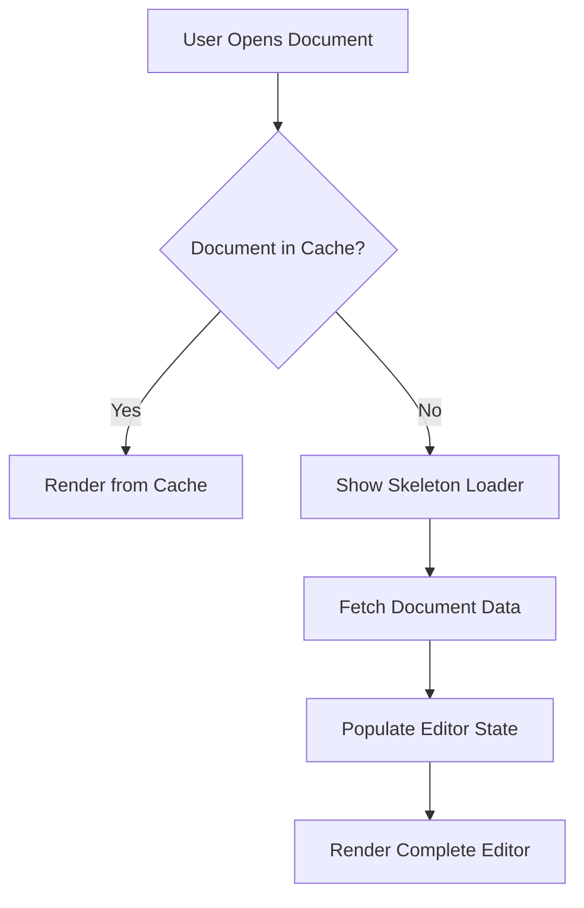
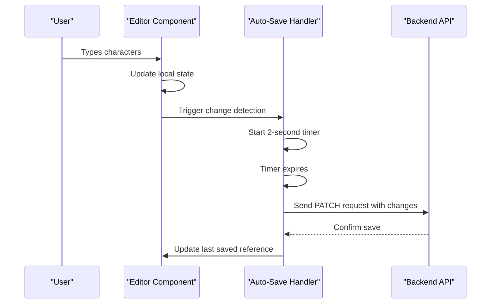
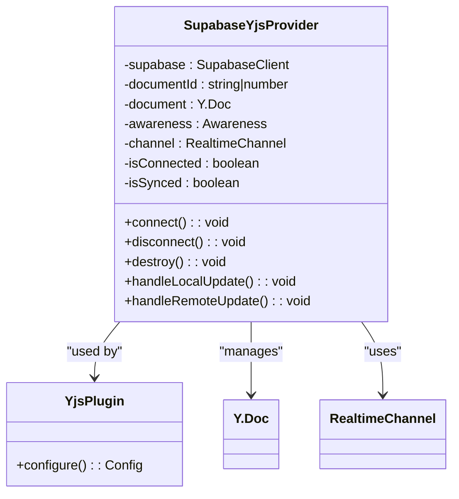

# Performance Optimization

<cite>
**Referenced Files in This Document**   
- [document-editor.tsx](file://components/documentos/document-editor.tsx)
- [document-editor-skeleton.tsx](file://components/documentos/document-editor-skeleton.tsx)
- [collaborative-plate-editor.tsx](file://components/plate/collaborative-plate-editor.tsx)
- [plate-editor.tsx](file://components/plate/plate-editor.tsx)
- [editor.tsx](file://components/ui/editor.tsx)
- [supabase-yjs-provider.ts](file://lib/yjs/supabase-yjs-provider.ts)
- [use-debounce.ts](file://app/_lib/hooks/use-debounce.ts)
</cite>

## Table of Contents
1. [Introduction](#introduction)
2. [Skeleton Loaders and Initial Rendering](#skeleton-loaders-and-initial-rendering)
3. [Virtualization and Large Document Handling](#virtualization-and-large-document-handling)
4. [State Management and Re-render Optimization](#state-management-and-re-render-optimization)
5. [Content Chunking and Serialization](#content-chunking-and-serialization)
6. [Memory Management and Performance Monitoring](#memory-management-and-performance-monitoring)
7. [Common Performance Issues and Solutions](#common-performance-issues-and-solutions)

## Introduction
The Sinesys document editor implements comprehensive performance optimization strategies to ensure smooth operation with large documents and complex content. The system addresses key performance challenges through a combination of skeleton loaders, virtualization techniques, efficient state management, and optimized serialization/deserialization processes. This document details the implementation strategies used to maintain responsive typing, minimize memory consumption, and provide a seamless user experience even with extensive documents containing rich media content.

## Skeleton Loaders and Initial Rendering
The document editor employs skeleton loaders to enhance the perceived performance during initial loading. When a document is being fetched, a skeleton interface is displayed that mimics the final layout, providing immediate visual feedback to users.

**Diagram sources**
- [document-editor.tsx](file://components/documentos/document-editor.tsx#L272-L280)
- [document-editor-skeleton.tsx](file://components/documentos/document-editor-skeleton.tsx#L7-L42)

The skeleton loader component renders a simplified version of the editor interface with placeholder elements that match the dimensions of the actual UI components. This approach prevents layout shifts and provides a smooth transition from loading to the fully rendered editor. The implementation uses React's loading state to conditionally render either the skeleton or the complete editor based on data availability.

**Section sources**
- [document-editor.tsx](file://components/documentos/document-editor.tsx#L272-L280)
- [document-editor-skeleton.tsx](file://components/documentos/document-editor-skeleton.tsx#L7-L42)

## Virtualization and Large Document Handling
For handling long documents and rich media content, the editor implements virtualization techniques that render only the visible portion of the document. This approach significantly reduces the DOM complexity and memory footprint, especially for documents with hundreds or thousands of elements.

The virtualization strategy combines several techniques:
- **Viewport-based rendering**: Only elements within the current viewport are fully rendered
- **Lazy loading of media**: Images, PDFs, and other media assets are loaded on-demand when they enter the viewport
- **Content chunking**: Large documents are processed in smaller segments to prevent blocking the main thread

The editor leverages the Plate.js framework's built-in virtualization capabilities, which efficiently manage the rendering of rich text content. The system monitors scroll position and dynamically updates the rendered content, ensuring smooth scrolling performance even with extensive documents.

**Section sources**
- [plate-editor.tsx](file://components/plate/plate-editor.tsx)
- [editor.tsx](file://components/ui/editor.tsx)

## State Management and Re-render Optimization
The editor optimizes state updates and re-renders through React memoization and selective re-rendering techniques. The implementation minimizes unnecessary re-renders by carefully managing component state and using performance optimization hooks.

Key optimization strategies include:
- **Debounced auto-save**: Changes are saved automatically with a 2-second debounce period to prevent excessive API calls during active typing
- **Memoized components**: Frequently used components are wrapped with React.memo to prevent unnecessary re-renders
- **Callback memoization**: Event handlers and functions are memoized using useCallback to maintain referential equality
- **State batching**: Related state updates are batched together to minimize re-render cycles

**Diagram sources**
- [document-editor.tsx](file://components/documentos/document-editor.tsx#L147-L201)
- [use-debounce.ts](file://app/_lib/hooks/use-debounce.ts#L1-L25)

The auto-save functionality implements a debounce mechanism that waits for 2 seconds of inactivity before sending changes to the server. This prevents excessive network requests during active editing while ensuring data is saved promptly when the user pauses. The implementation uses a timer reference to manage the debounce period and cleanup on component unmount.

**Section sources**
- [document-editor.tsx](file://components/documentos/document-editor.tsx#L147-L201)
- [use-debounce.ts](file://app/_lib/hooks/use-debounce.ts#L1-L25)

## Content Chunking and Serialization
To address performance issues with large documents, the system implements content chunking and optimized serialization/deserialization of document state. The document content is divided into manageable chunks that can be processed independently, preventing performance degradation with extensive content.

The serialization process converts the editor's state (represented as an array of descendant nodes) to JSON format for storage and transmission. The implementation includes optimizations to handle large datasets efficiently:

- **Incremental processing**: Large documents are processed in smaller batches to avoid blocking the main thread
- **Efficient data structures**: The system uses optimized data structures for storing and manipulating document content
- **Delta-based updates**: Only changed portions of the document are transmitted during auto-save operations

When loading large documents, the system prioritizes essential content and defers the loading of non-critical elements. This approach ensures that the editor becomes interactive as quickly as possible, with additional content loaded in the background.

**Section sources**
- [document-editor.tsx](file://components/documentos/document-editor.tsx#L153-L161)
- [plate-editor.tsx](file://components/plate/plate-editor.tsx#L44-L599)

## Memory Management and Performance Monitoring
The editor implements comprehensive memory management strategies to prevent excessive memory consumption with large documents. The system monitors memory usage and implements cleanup mechanisms to maintain optimal performance.

Key memory management features include:
- **Resource cleanup**: Event listeners and timers are properly cleaned up on component unmount
- **Connection management**: Real-time collaboration connections are disconnected when not in use
- **Cache invalidation**: Document caches are invalidated appropriately to prevent stale data
- **Memory-efficient data structures**: The system uses memory-efficient representations of document content

The collaboration system, built on Yjs and Supabase Realtime, implements efficient CRDT (Conflict-free Replicated Data Type) synchronization that minimizes memory overhead. The custom SupabaseYjsProvider handles connection lifecycle management, ensuring resources are properly released when editors are closed.

**Diagram sources**
- [supabase-yjs-provider.ts](file://lib/yjs/supabase-yjs-provider.ts#L78-L357)
- [collaborative-plate-editor.tsx](file://components/plate/collaborative-plate-editor.tsx#L88-L151)

**Section sources**
- [supabase-yjs-provider.ts](file://lib/yjs/supabase-yjs-provider.ts#L78-L357)
- [collaborative-plate-editor.tsx](file://components/plate/collaborative-plate-editor.tsx#L88-L151)

## Common Performance Issues and Solutions
The document editor addresses several common performance issues that arise with rich text editors handling large documents:

### Slow Typing Response
The system mitigates slow typing response through several optimizations:
- **Debounced state updates**: Prevents excessive re-renders during rapid typing
- **Efficient change detection**: Only processes actual content changes
- **Web Worker offloading**: Computationally intensive operations are offloaded when possible

### High Memory Consumption
To address high memory consumption with large documents:
- **Virtualized rendering**: Only visible content is kept in memory
- **Lazy loading**: Media and non-essential elements are loaded on-demand
- **Memory cleanup**: Unused resources are promptly released

### Large Document Loading
For improved performance with large documents:
- **Progressive loading**: Essential content loads first, followed by additional elements
- **Content chunking**: Documents are processed in smaller segments
- **Optimized serialization**: Efficient JSON handling reduces processing time

The implementation demonstrates a comprehensive approach to performance optimization, balancing immediate responsiveness with long-term stability. By combining multiple techniques—skeleton loaders, virtualization, memoization, and efficient state management—the editor provides a smooth user experience across various document sizes and complexity levels.

**Section sources**
- [document-editor.tsx](file://components/documentos/document-editor.tsx)
- [plate-editor.tsx](file://components/plate/plate-editor.tsx)
- [supabase-yjs-provider.ts](file://lib/yjs/supabase-yjs-provider.ts)