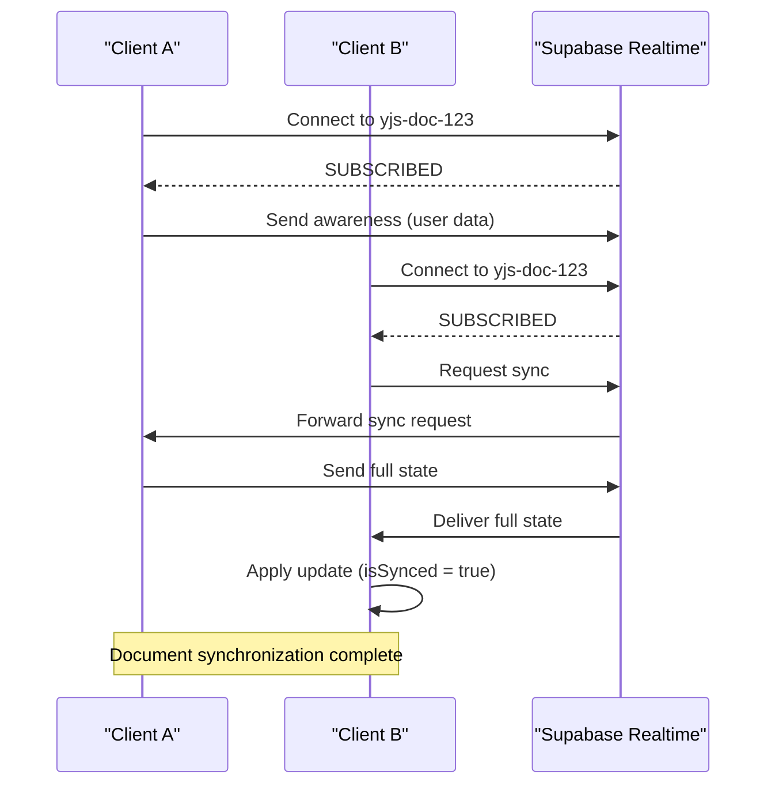
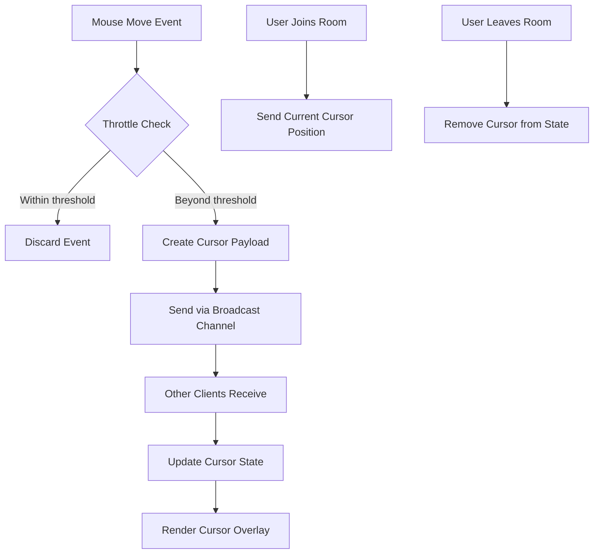
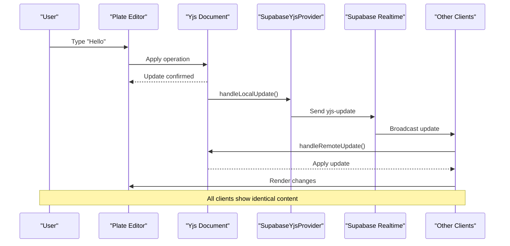
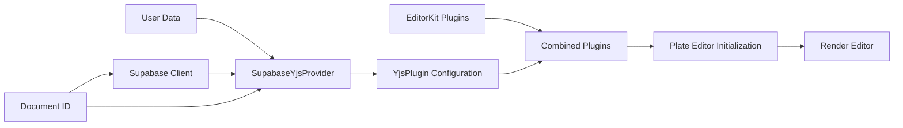
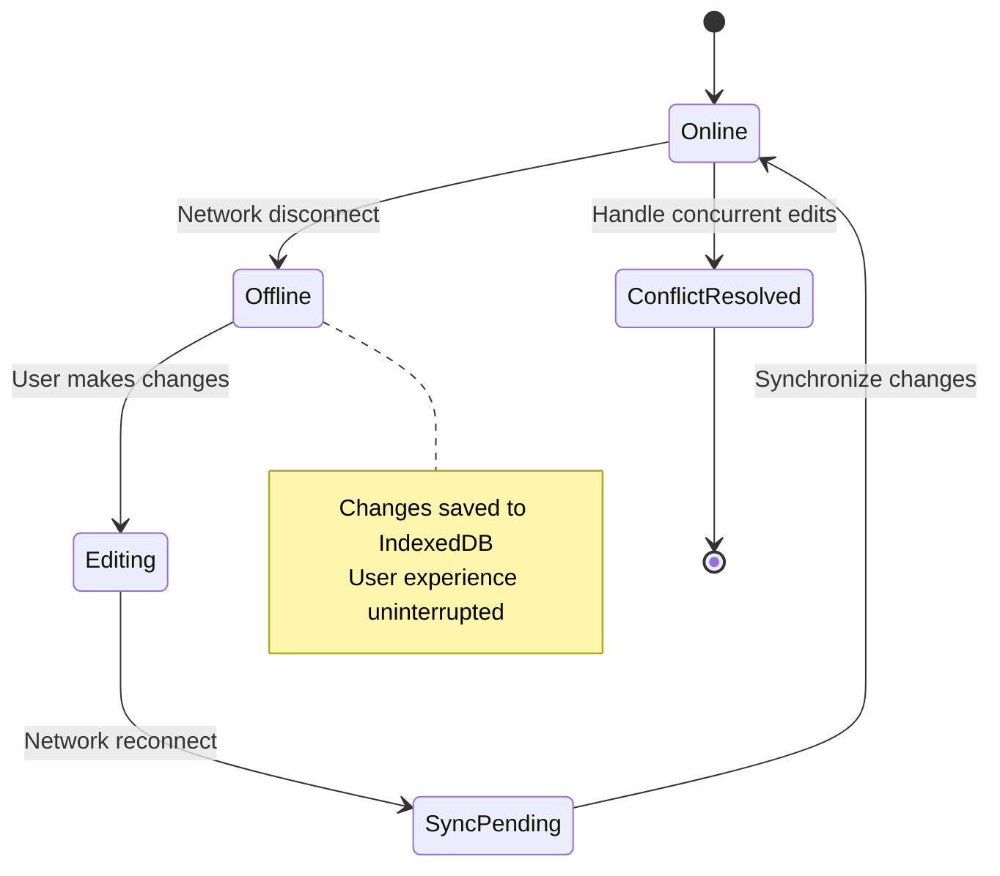

# Real-time Collaboration

<cite>
**Referenced Files in This Document**   
- [collaborative-plate-editor.tsx](file://components/plate/collaborative-plate-editor.tsx)
- [supabase-yjs-provider.ts](file://lib/yjs/supabase-yjs-provider.ts)
- [use-yjs-collaboration.ts](file://hooks/use-yjs-collaboration.ts)
- [yjs-kit.tsx](file://components/plate/yjs-kit.tsx)
- [realtime-cursors.tsx](file://components/realtime-cursors.tsx)
- [use-realtime-cursors.ts](file://hooks/use-realtime-cursors.ts)
- [use-realtime-presence-room.ts](file://hooks/use-realtime-presence-room.ts)
- [realtime-avatar-stack.tsx](file://components/realtime-avatar-stack.tsx)
- [supabase-provider.ts](file://lib/yjs/supabase-provider.ts)
</cite>

## Table of Contents
1. [Introduction](#introduction)
2. [Yjs Implementation and CRDT Architecture](#yjs-implementation-and-crdt-architecture)
3. [SupabaseYjsProvider and WebSocket Integration](#supabaseyjsprovider-and-websocket-integration)
4. [Presence System and Cursor Sharing](#presence-system-and-cursor-sharing)
5. [Message Flow and Conflict Resolution](#message-flow-and-conflict-resolution)
6. [Collaborative Editor Configuration](#collaborative-editor-configuration)
7. [Handling Edge Cases](#handling-edge-cases)
8. [Conclusion](#conclusion)

## Introduction
The Sinesys real-time collaboration system enables multiple users to simultaneously edit documents with immediate synchronization and conflict-free consistency. This is achieved through the integration of Yjs, a CRDT-based collaboration framework, with Supabase Realtime for WebSocket communication. The system provides seamless collaborative editing, presence awareness, and cursor tracking across clients. This documentation details the implementation of this real-time collaboration system, focusing on the technical architecture, data flow, and integration patterns that ensure consistent and reliable multi-user editing experiences.

## Yjs Implementation and CRDT Architecture

The real-time collaboration system in Sinesys is built on Yjs, a JavaScript implementation of Conflict-free Replicated Data Types (CRDTs) that enables automatic conflict resolution in distributed systems. Yjs ensures data consistency across all clients by using operational transformation principles, where each edit operation is transformed based on the state of other concurrent operations. This approach eliminates the need for centralized coordination and allows clients to work independently while maintaining eventual consistency.

Yjs operates by representing document content as shared types (Y.Text, Y.Array, Y.Map) that can be observed for changes. When a user makes an edit, Yjs creates an operation that describes the change (insertion, deletion, formatting) and encodes it into a binary update. This update is then broadcast to other clients, which apply it to their local document state. The CRDT algorithms ensure that regardless of the order in which updates are received, all clients converge to the same final state.

The implementation leverages Yjs's built-in support for awareness information, which tracks user presence and selection state. This allows the system to display cursors and selections from other collaborators in real-time, enhancing the collaborative experience. The document state is represented as a Y.Doc instance, which serves as the single source of truth for the collaborative content.

**Section sources**
- [supabase-yjs-provider.ts](file://lib/yjs/supabase-yjs-provider.ts#L8-357)
- [use-yjs-collaboration.ts](file://hooks/use-yjs-collaboration.ts#L10-201)

## SupabaseYjsProvider and WebSocket Integration

The SupabaseYjsProvider serves as the bridge between Yjs and Supabase Realtime, establishing WebSocket connections for operational transformation of document changes. This custom provider implements the UnifiedProvider interface expected by @platejs/yjs, enabling seamless integration with the Plate.js rich text editor framework.

The provider establishes a dedicated Realtime channel for each document using a naming convention of `yjs-doc-{documentId}`. It configures the channel with broadcast capabilities to send and receive Yjs updates, while disabling self-reception to prevent echo loops. The connection process follows a handshake protocol where clients request synchronization upon joining, and existing clients respond with the current document state if they have it.

**Diagram sources **
- [supabase-yjs-provider.ts](file://lib/yjs/supabase-yjs-provider.ts#L134-210)
- [supabase-provider.ts](file://lib/yjs/supabase-provider.ts#L81-118)

The provider handles three primary message types through the broadcast channel:
- `yjs-update`: Incremental operations representing document changes
- `yjs-sync-request`: Request for complete document state
- `yjs-sync-response`: Complete document state for synchronization

When a client connects, it broadcasts a sync request to obtain the current document state. If no response is received within 2 seconds, the client assumes it is the first participant and proceeds with an empty document. This timeout mechanism ensures that collaboration can begin immediately without indefinite waiting.

**Section sources**
- [supabase-yjs-provider.ts](file://lib/yjs/supabase-yjs-provider.ts#L134-357)
- [supabase-provider.ts](file://lib/yjs/supabase-provider.ts#L153-187)

## Presence System and Cursor Sharing

The presence system in Sinesys integrates user cursors and selections through a combination of Supabase Realtime presence and broadcast features. The system consists of two complementary components: cursor tracking for precise position indicators and presence awareness for user avatars and status.

The cursor sharing mechanism is implemented through the `useRealtimeCursors` hook and `RealtimeCursors` component. When a user moves their mouse within the editor, position updates are throttled and broadcast to other clients in the same room. Each cursor event includes the user's ID, name, color, and timestamp, allowing other clients to render floating cursor indicators with minimal latency. The system uses presence tracking to automatically clean up cursors when users disconnect.

**Diagram sources **
- [use-realtime-cursors.ts](file://hooks/use-realtime-cursors.ts#L77-148)
- [realtime-cursors.tsx](file://components/realtime-cursors.tsx#L8-27)

The presence system is managed by the `useRealtimePresenceRoom` hook and `RealtimeAvatarStack` component. This system uses Supabase's presence functionality to track which users are currently viewing a document. When users join or leave a collaboration session, the system automatically updates the avatar stack display. The presence information includes user names and profile images, providing visual context for who is collaborating on the document.

Both systems work in concert to create a comprehensive real-time collaboration experience. While the Yjs provider handles document content synchronization, these presence systems provide the social context that makes collaboration feel immediate and connected.

**Section sources**
- [use-realtime-cursors.ts](file://hooks/use-realtime-cursors.ts#L1-177)
- [realtime-cursors.tsx](file://components/realtime-cursors.tsx#L1-30)
- [use-realtime-presence-room.ts](file://hooks/use-realtime-presence-room.ts#L1-56)
- [realtime-avatar-stack.tsx](file://components/realtime-avatar-stack.tsx#L1-18)

## Message Flow and Conflict Resolution

The message flow from local edits to remote synchronization follows a well-defined pattern that ensures data consistency while minimizing latency. When a user makes an edit in the collaborative editor, the operation is first applied locally to provide immediate feedback, then encoded by Yjs and transmitted through the Supabase Realtime channel to other collaborators.

The conflict resolution process is entirely handled by Yjs's CRDT implementation, which guarantees that all clients will converge to the same state regardless of the order in which operations are received. This is achieved through unique operation identifiers and timestamps that allow the system to deterministically resolve concurrent edits. For example, when two users edit the same section of text simultaneously, Yjs uses the Lamport timestamps and client identifiers to establish a total order for the operations.

**Diagram sources **
- [supabase-yjs-provider.ts](file://lib/yjs/supabase-yjs-provider.ts#L224-237)
- [supabase-yjs-provider.ts](file://lib/yjs/supabase-yjs-provider.ts#L243-249)

The system handles three types of synchronization messages:
1. **Incremental updates**: Small operations representing individual edits, sent immediately after local application
2. **Full state synchronization**: Complete document state sent in response to sync requests, used when joining an existing session
3. **Awareness updates**: User presence and selection information broadcast periodically

The message flow includes several optimization techniques to reduce bandwidth and improve performance. Updates are batched when possible, and the system uses binary encoding (Uint8Array) for efficient transmission. The provider also implements origin tracking to prevent infinite loops, ensuring that updates received from the network are not re-broadcast back to the network.

**Section sources**
- [supabase-yjs-provider.ts](file://lib/yjs/supabase-yjs-provider.ts#L224-336)
- [collaborative-plate-editor.tsx](file://components/plate/collaborative-plate-editor.tsx#L114-128)

## Collaborative Editor Configuration

The CollaborativePlateEditor component is configured with Yjs providers through a well-structured initialization process that integrates Plate.js with the real-time collaboration system. The configuration begins with the creation of a SupabaseYjsProvider instance, which is then used to configure the YjsPlugin for Plate.js.

The editor setup follows these key steps:
1. Create a Supabase client instance for authentication and Realtime access
2. Instantiate the SupabaseYjsProvider with document ID and user data
3. Configure the YjsPlugin with the provider and cursor options
4. Combine the YjsPlugin with other editor plugins from the EditorKit
5. Initialize the Plate editor with the combined plugin configuration

**Diagram sources **
- [collaborative-plate-editor.tsx](file://components/plate/collaborative-plate-editor.tsx#L88-134)

The configuration includes several important options that customize the collaboration experience:
- **Document ID**: A unique identifier that determines the Realtime channel name
- **User data**: Contains the user's ID, name, and color for cursor display
- **Connection handlers**: Callbacks for connection and synchronization status changes
- **Editor plugins**: The comprehensive set of Plate.js features enabled for the editor

The system uses a cleanup mechanism in the useEffect hook to properly destroy the provider and disconnect from the Realtime channel when the component unmounts or the document ID changes. This prevents memory leaks and ensures that resources are properly released.

**Section sources**
- [collaborative-plate-editor.tsx](file://components/plate/collaborative-plate-editor.tsx#L72-151)
- [yjs-kit.tsx](file://components/plate/yjs-kit.tsx#L1-46)

## Handling Edge Cases

The real-time collaboration system in Sinesys includes robust handling of common edge cases such as connection latency, offline editing, and concurrent edits. These solutions ensure a reliable user experience even under challenging network conditions.

For connection latency, the system implements several mitigation strategies. The SupabaseYjsProvider includes a 2-second timeout for synchronization responses, allowing clients to proceed with editing even if they don't immediately receive the document state. This prevents users from being blocked when joining a collaboration session. Additionally, the system uses local-first principles, where all edits are applied locally before being synchronized, ensuring that the editor remains responsive regardless of network conditions.

Offline editing is supported through IndexedDB persistence, which automatically saves document state to the local browser database. When the `useYjsCollaboration` hook is configured with `enableLocalPersistence` (which is true by default), it creates an IndexeddbPersistence instance that syncs the Yjs document with local storage. This allows users to continue editing when disconnected from the network, with changes automatically synchronized when connectivity is restored.

**Diagram sources **
- [use-yjs-collaboration.ts](file://hooks/use-yjs-collaboration.ts#L98-101)

For concurrent edits on the same document section, the system relies on Yjs's CRDT algorithms to automatically resolve conflicts. The algorithms use logical clocks and operation sequencing to ensure that all clients converge to the same state. In cases where multiple users edit overlapping text, the system preserves all content by intelligently merging the operations based on their causal relationships.

The implementation also includes error handling and reconnection logic. If a synchronization error occurs, the system logs the error and invokes the onError callback if provided. The provider can be manually reconnected using the reconnect method, allowing the application to implement custom retry strategies.

**Section sources**
- [use-yjs-collaboration.ts](file://hooks/use-yjs-collaboration.ts#L66-201)
- [supabase-yjs-provider.ts](file://lib/yjs/supabase-yjs-provider.ts#L197-210)

## Conclusion
The real-time collaboration system in Sinesys provides a robust and seamless multi-user editing experience through the integration of Yjs and Supabase Realtime. By leveraging CRDTs for conflict-free replication and WebSocket connections for low-latency synchronization, the system ensures data consistency across all clients while maintaining high performance. The implementation includes comprehensive features for presence awareness, cursor sharing, and offline editing, making it suitable for professional collaborative workflows. The modular architecture, centered around the SupabaseYjsProvider and CollaborativePlateEditor components, allows for flexible configuration and easy maintenance. This documentation has detailed the key aspects of the system, from the underlying CRDT architecture to the practical considerations for handling edge cases, providing a comprehensive understanding of how real-time collaboration is achieved in Sinesys.