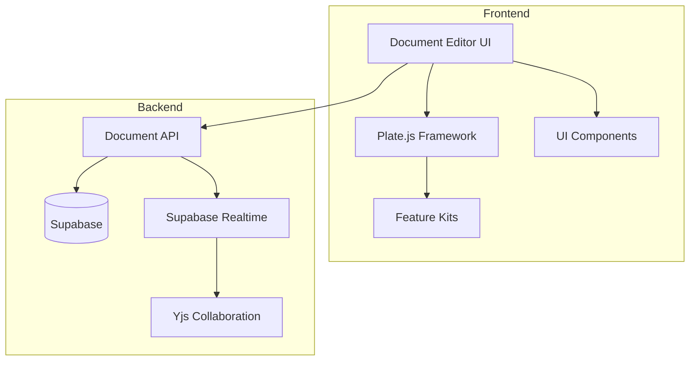
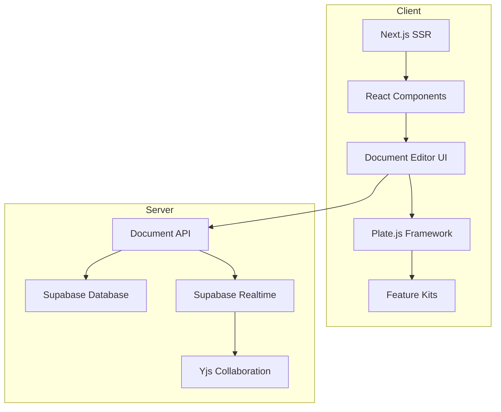
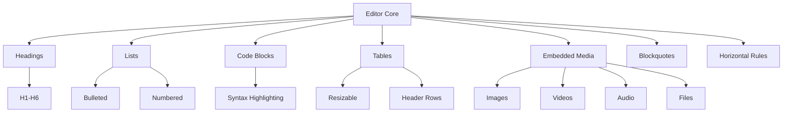
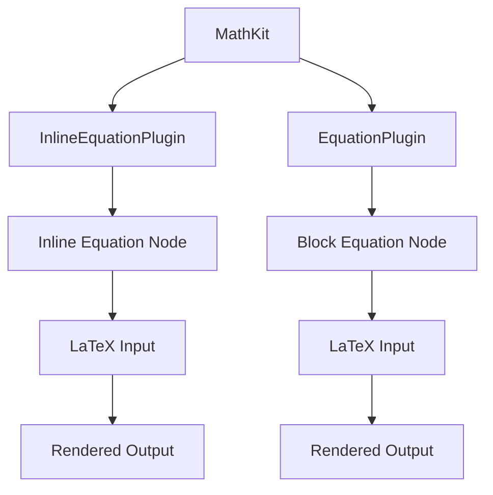
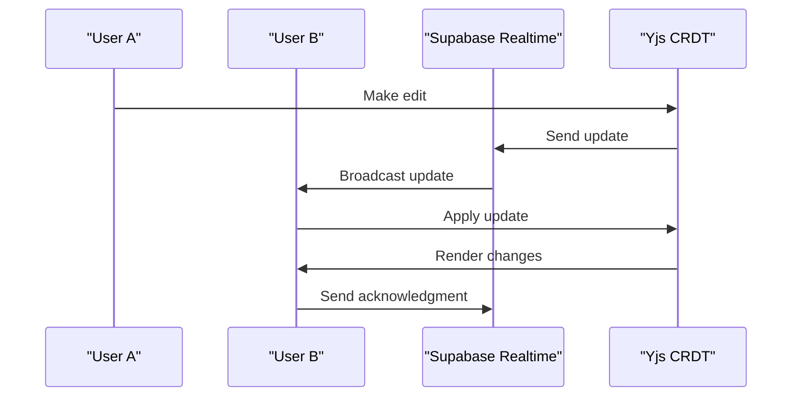
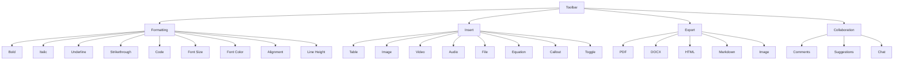

# Document Editor

<cite>
**Referenced Files in This Document**   
- [plate-editor.tsx](file://components/plate/plate-editor.tsx)
- [editor-kit.tsx](file://components/plate/editor-kit.tsx)
- [collaborative-plate-editor.tsx](file://components/plate/collaborative-plate-editor.tsx)
- [ai-kit.tsx](file://components/plate/ai-kit.tsx)
- [math-kit.tsx](file://components/plate/math-kit.tsx)
- [media-kit.tsx](file://components/plate/media-kit.tsx)
- [table-kit.tsx](file://components/plate/table-kit.tsx)
- [editor.tsx](file://components/ui/editor.tsx)
- [export-toolbar-button.tsx](file://components/ui/export-toolbar-button.tsx)
- [fixed-toolbar-buttons.tsx](file://components/ui/fixed-toolbar-buttons.tsx)
- [document-editor.tsx](file://components/documentos/document-editor.tsx)
- [use-realtime-collaboration.ts](file://hooks/use-realtime-collaboration.ts)
- [supabase-yjs-provider.ts](file://lib/yjs/supabase-yjs-provider.ts)
</cite>

## Table of Contents
1. [Introduction](#introduction)
2. [Project Structure](#project-structure)
3. [Core Components](#core-components)
4. [Architecture Overview](#architecture-overview)
5. [Detailed Component Analysis](#detailed-component-analysis)
6. [Dependency Analysis](#dependency-analysis)
7. [Performance Considerations](#performance-considerations)
8. [Troubleshooting Guide](#troubleshooting-guide)
9. [Conclusion](#conclusion)

## Introduction
The Sinesys Document Editor is a sophisticated rich-text editing system built on the Plate.js framework, providing comprehensive document creation and collaboration capabilities for legal professionals. This editor supports a wide range of document types including legal briefs, contracts, and internal memos, with specialized features tailored to the legal domain. The implementation leverages React and Next.js for server-side rendering and client-side hydration, ensuring optimal performance and SEO capabilities. The editor framework provides rich text editing capabilities with support for headings, lists, code blocks, tables, and embedded media, while also incorporating advanced features like AI-powered content generation, equation editing, and real-time document collaboration. The system is designed with extensibility in mind, allowing for the integration of additional features through a modular plugin architecture.

## Project Structure
The document editor implementation follows a component-based architecture with clear separation of concerns. The core editor functionality is organized within the components/plate directory, which contains individual kit modules for different editor features. Each kit represents a specific capability such as AI integration, mathematical equations, media handling, or table support. The UI components are organized in the components/ui directory, containing reusable elements like buttons, dialogs, and toolbar components. The document editor page is implemented as a Next.js application route at app/(dashboard)/documentos/[id]/page.tsx, which orchestrates the various components into a cohesive editing experience. The backend API endpoints in the api/documentos directory handle document persistence, versioning, and collaboration features. The editor leverages Supabase for real-time database operations and authentication, with Yjs for collaborative editing synchronization.



**Diagram sources**
- [document-editor.tsx](file://components/documentos/document-editor.tsx)
- [collaborative-plate-editor.tsx](file://components/plate/collaborative-plate-editor.tsx)
- [supabase-yjs-provider.ts](file://lib/yjs/supabase-yjs-provider.ts)

**Section sources**
- [document-editor.tsx](file://components/documentos/document-editor.tsx)
- [app/(dashboard)/documentos/[id]/page.tsx](file://app/(dashboard)/documentos/[id]/page.tsx)

## Core Components
The document editor's core functionality is built around the Plate.js framework, which provides a modular architecture for rich text editing. The main editor component (PlateEditor) serves as the entry point, initializing the editor with a comprehensive set of plugins through the EditorKit configuration. The EditorKit is composed of multiple feature kits that are combined to provide the complete editing experience. Each feature kit encapsulates related functionality, such as AI integration, mathematical equations, or media handling. The collaborative editing capability is implemented through the CollaborativePlateEditor component, which integrates Yjs for real-time synchronization using Supabase as the transport layer. The editor supports server-side rendering through Next.js, with client-side hydration ensuring interactive functionality after page load. The document editor also includes auto-save functionality with a debounce mechanism to prevent excessive API calls during active editing sessions.

**Section sources**
- [plate-editor.tsx](file://components/plate/plate-editor.tsx)
- [editor-kit.tsx](file://components/plate/editor-kit.tsx)
- [collaborative-plate-editor.tsx](file://components/plate/collaborative-plate-editor.tsx)

## Architecture Overview
The document editor architecture follows a layered approach with clear separation between the presentation layer, business logic, and data persistence. At the core is the Plate.js framework, which provides the foundation for rich text editing through a plugin-based architecture. The editor components are organized into feature kits, each responsible for a specific aspect of functionality such as AI integration, mathematical equations, or media handling. These kits are composed together in the EditorKit to create the complete editor configuration. The collaboration system is built on Yjs, a CRDT-based framework for real-time synchronization, which is integrated with Supabase Realtime for efficient data transport. The frontend is implemented using React and Next.js, leveraging server-side rendering for improved performance and SEO, with client-side hydration to enable interactive features. The backend API provides endpoints for document operations, versioning, and collaboration, with Supabase handling authentication and database operations.



**Diagram sources**
- [plate-editor.tsx](file://components/plate/plate-editor.tsx)
- [editor-kit.tsx](file://components/plate/editor-kit.tsx)
- [collaborative-plate-editor.tsx](file://components/plate/collaborative-plate-editor.tsx)
- [document-editor.tsx](file://components/documentos/document-editor.tsx)

## Detailed Component Analysis

### Plate Editor Framework
The Plate editor framework implementation provides comprehensive rich text editing capabilities with support for various content types. The core editor is initialized with a rich set of plugins through the EditorKit, which combines multiple feature kits to provide the complete editing experience. The framework supports standard rich text features including headings, lists, code blocks, tables, and embedded media. The editor implementation handles both server-side rendering and client-side hydration, ensuring optimal performance and accessibility. The editor state is managed using Slate.js, which provides a flexible data model for representing rich text content. The framework also includes support for custom nodes and marks, allowing for the extension of editing capabilities to meet specific requirements.

**Section sources**
- [plate-editor.tsx](file://components/plate/plate-editor.tsx)
- [editor.tsx](file://components/ui/editor.tsx)

#### Rich Text Features


**Diagram sources**
- [basic-blocks-kit.tsx](file://components/plate/basic-blocks-kit.tsx)
- [code-block-kit.tsx](file://components/plate/code-block-kit.tsx)
- [table-kit.tsx](file://components/plate/table-kit.tsx)
- [media-kit.tsx](file://components/plate/media-kit.tsx)

### Extension System
The editor's extension system enables advanced features through a modular plugin architecture. The system is designed to be extensible, allowing for the integration of new capabilities without modifying the core editor. The AI-powered content generation feature is implemented through the AIKit, which integrates with backend AI services to provide content suggestions, text generation, and editing assistance. The equation editing capability is provided by the MathKit, which supports both inline and block mathematical expressions using LaTeX syntax. Document collaboration is implemented through the Yjs integration, which provides real-time synchronization of editor state across multiple users. The extension system follows a composable pattern, where individual feature kits can be combined to create the desired editor configuration.

#### AI-Powered Content Generation

```mermaid
sequenceDiagram
participant User as "User"
participant Editor as "Document Editor"
participant AI as "AI Service"
User->>Editor : Press ⌘+J or Space
Editor->>AI : Send context and request
AI-->>Editor : Stream response chunks
Editor->>Editor : Apply AI suggestions
Editor-->>User : Display generated content
```


**Diagram sources**
- [ai-kit.tsx](file://components/plate/ai-kit.tsx)
- [use-chat.ts](file://components/hooks/use-chat.ts)

#### Equation Editing


**Diagram sources**
- [math-kit.tsx](file://components/plate/math-kit.tsx)
- [equation-node.tsx](file://components/ui/equation-node.tsx)

#### Document Collaboration


**Diagram sources**
- [collaborative-plate-editor.tsx](file://components/plate/collaborative-plate-editor.tsx)
- [supabase-yjs-provider.ts](file://lib/yjs/supabase-yjs-provider.ts)
- [use-realtime-collaboration.ts](file://hooks/use-realtime-collaboration.ts)

### Toolbar Components
The editor toolbar provides a comprehensive set of formatting options, insert menus, and export capabilities. The toolbar is implemented as a combination of fixed and floating components, with the fixed toolbar providing primary controls and the floating toolbar offering context-sensitive options. The toolbar includes formatting options for text styling (bold, italic, underline), alignment, lists, and indentation. The insert menu provides access to various content types including tables, media, equations, and special elements. The export functionality supports multiple formats including PDF, DOCX, HTML, and Markdown, allowing users to share documents in their preferred format.

#### Toolbar Functionality


**Diagram sources**
- [fixed-toolbar-buttons.tsx](file://components/ui/fixed-toolbar-buttons.tsx)
- [insert-toolbar-button.tsx](file://components/ui/insert-toolbar-button.tsx)
- [export-toolbar-button.tsx](file://components/ui/export-toolbar-button.tsx)

**Section sources**
- [fixed-toolbar-buttons.tsx](file://components/ui/fixed-toolbar-buttons.tsx)
- [insert-toolbar-button.tsx](file://components/ui/insert-toolbar-button.tsx)
- [export-toolbar-button.tsx](file://components/ui/export-toolbar-button.tsx)

## Dependency Analysis
The document editor has a well-defined dependency structure with clear separation between core functionality and extended features. The primary dependency is on Plate.js, which provides the foundation for rich text editing. The editor leverages several Plate.js plugins for specific capabilities, including @platejs/ai for AI integration, @platejs/math for equation editing, and @platejs/yjs for real-time collaboration. The UI components depend on Tailwind CSS for styling and Lucide for icons. The collaboration system depends on Yjs for CRDT-based synchronization and Supabase Realtime for data transport. The document persistence layer depends on Supabase for database operations and authentication. The export functionality depends on pdf-lib for PDF generation and other libraries for format conversion. The dependency structure follows a modular pattern, allowing for individual features to be included or excluded based on requirements.

```mermaid
graph TD
A[Document Editor] --> B[Plate.js]
A --> C[React]
A --> D[Next.js]
A --> E[Tailwind CSS]
A --> F[Lucide]
B --> G[@platejs/ai]
B --> H[@platejs/math]
B --> I[@platejs/yjs]
B --> J[@platejs/media]
B --> K[@platejs/table]
A --> L[Supabase]
L --> M[Supabase Auth]
L --> N[Supabase Realtime]
L --> O[Supabase Storage]
A --> P[Yjs]
A --> Q[pdf-lib]
A --> R[sonner]
```

**Diagram sources**
- [package.json](file://package.json)
- [editor-kit.tsx](file://components/plate/editor-kit.tsx)

**Section sources**
- [package.json](file://package.json)
- [editor-kit.tsx](file://components/plate/editor-kit.tsx)

## Performance Considerations
The document editor implementation includes several performance optimization techniques to handle large documents and ensure responsive editing. The auto-save functionality uses a debounce mechanism with a 2-second delay to prevent excessive API calls during active editing sessions. The collaboration system uses Yjs for efficient CRDT-based synchronization, minimizing network traffic by only transmitting changes rather than the entire document state. The editor implementation leverages React's virtual DOM and efficient re-rendering to maintain performance even with complex documents. For large documents, the system implements lazy loading of content and virtualized rendering where appropriate. The export functionality includes fallback mechanisms, such as using text-based PDF generation when visual capture fails, to ensure reliability across different scenarios. The server-side rendering approach reduces initial load time and improves SEO, while client-side hydration ensures interactive functionality after page load.

**Section sources**
- [document-editor.tsx](file://components/documentos/document-editor.tsx)
- [collaborative-plate-editor.tsx](file://components/plate/collaborative-plate-editor.tsx)

## Troubleshooting Guide
Common issues with the document editor typically relate to formatting inconsistencies across browsers and collaboration connectivity. For formatting inconsistencies, ensure that all users are using compatible browsers and that the editor's CSS is properly loaded. Clearing browser cache and reloading the page can resolve many display issues. For collaboration connectivity problems, verify that the user has a stable internet connection and that Supabase Realtime is functioning properly. The editor includes a connection indicator that shows the collaboration status, which can help diagnose connectivity issues. For large document performance issues, consider breaking the document into smaller sections or using the auto-save debounce to reduce server load. If export functionality fails, check that the required libraries are properly loaded and that the browser has sufficient memory. The system logs errors to the console, which can provide additional diagnostic information.

**Section sources**
- [document-editor.tsx](file://components/documentos/document-editor.tsx)
- [collaborative-plate-editor.tsx](file://components/plate/collaborative-plate-editor.tsx)

## Conclusion
The Sinesys Document Editor provides a comprehensive solution for legal document creation and collaboration, built on a robust technical foundation. The implementation leverages the Plate.js framework to deliver rich text editing capabilities with support for headings, lists, code blocks, tables, and embedded media. The extensible architecture enables advanced features like AI-powered content generation, equation editing, and real-time collaboration through a modular plugin system. The integration with React and Next.js ensures optimal performance with server-side rendering and client-side hydration. The toolbar components provide intuitive access to formatting options, insert menus, and export capabilities, supporting multiple output formats including PDF, DOCX, HTML, and Markdown. The system addresses common challenges such as formatting inconsistencies across browsers and performance optimization for large documents through careful implementation and optimization techniques. Overall, the document editor offers a powerful and flexible platform for creating various document types including legal briefs, contracts, and internal memos.