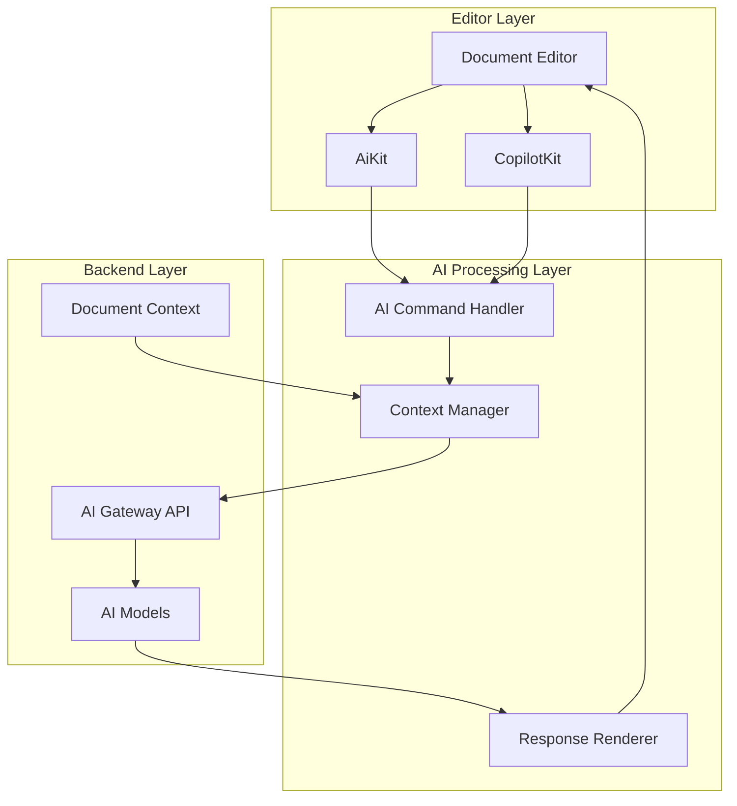
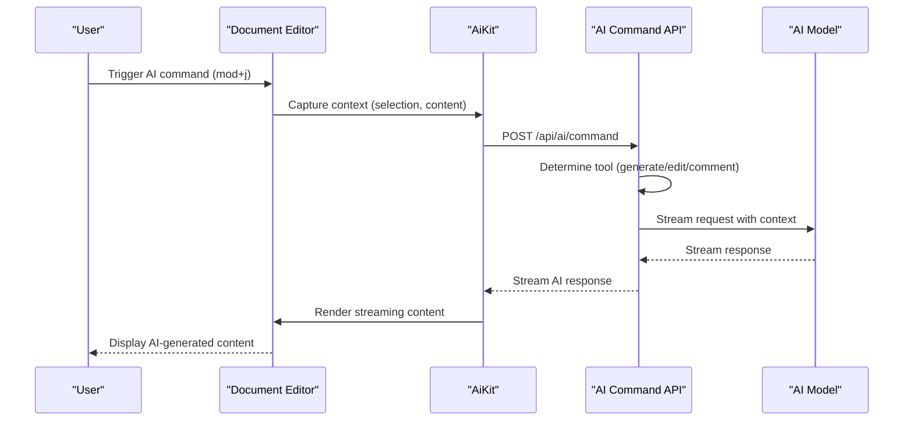
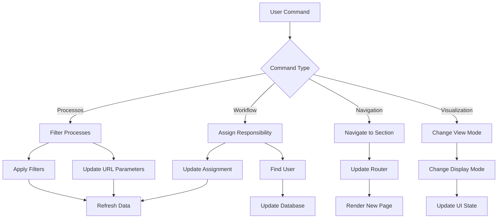
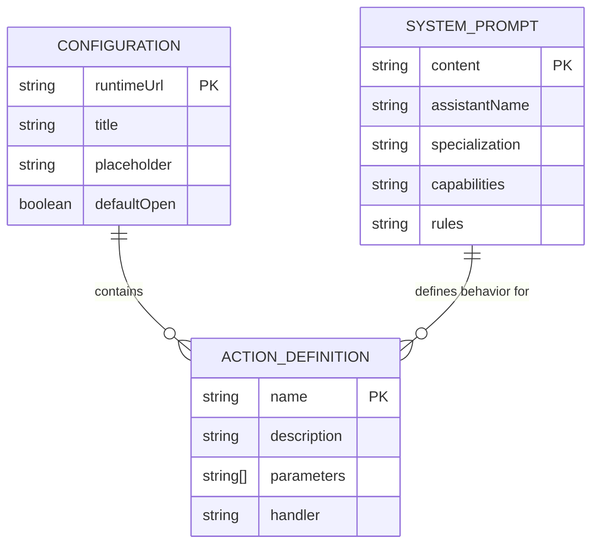
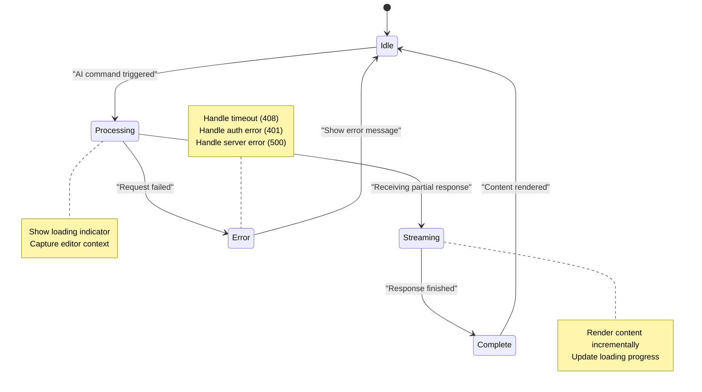

# AI Features

<cite>
**Referenced Files in This Document**   
- [ai-kit.tsx](file://components/plate/ai-kit.tsx)
- [copilot-kit.tsx](file://components/plate/copilot-kit.tsx)
- [config.ts](file://lib/copilotkit/config.ts)
- [system-prompt.ts](file://lib/copilotkit/system-prompt.ts)
- [index.ts](file://lib/copilotkit/actions/index.ts)
- [types.ts](file://lib/copilotkit/actions/types.ts)
- [processos.actions.ts](file://lib/copilotkit/actions/processos.actions.ts)
- [workflow.actions.ts](file://lib/copilotkit/actions/workflow.actions.ts)
- [route.ts](file://app/api/ai/command/route.ts)
- [route.ts](file://app/api/ai/copilot/route.ts)
- [ai-menu.tsx](file://components/ui/ai-menu.tsx)
- [ai-node.tsx](file://components/ui/ai-node.tsx)
- [ai-chat-editor.tsx](file://components/ui/ai-chat-editor.tsx)
</cite>

## Table of Contents
1. [Introduction](#introduction)
2. [AI Extension Architecture](#ai-extension-architecture)
3. [Core AI Components](#core-ai-components)
4. [AI Command Processing](#ai-command-processing)
5. [AI Actions and Capabilities](#ai-actions-and-capabilities)
6. [Context Management and Data Flow](#context-management-and-data-flow)
7. [Configuration and System Prompts](#configuration-and-system-prompts)
8. [Performance and Error Handling](#performance-and-error-handling)
9. [Privacy and Security Considerations](#privacy-and-security-considerations)
10. [Conclusion](#conclusion)

## Introduction
The Sinesys document editor incorporates advanced AI-powered features through the AiKit and CopilotKit extensions, providing intelligent writing assistance for legal professionals. These features enable content generation, text completion, and smart suggestions by integrating with backend AI services. The AI system is designed to assist with legal document drafting, process description generation, and hearing summary creation, while maintaining context awareness and domain-specific knowledge. This document details the architecture, implementation, and configuration of these AI features, explaining how AI commands are registered, how context is passed between the editor and AI services, and how responses are rendered in documents.

## AI Extension Architecture
The AI extension system in Sinesys follows a modular architecture that separates concerns between UI components, AI processing logic, and backend integration. The architecture consists of three main layers: the editor integration layer, the AI processing layer, and the backend service layer. This separation allows for flexible configuration and extension of AI capabilities while maintaining a clean separation between the document editing interface and the AI functionality.



**Diagram sources**
- [ai-kit.tsx](file://components/plate/ai-kit.tsx)
- [copilot-kit.tsx](file://components/plate/copilot-kit.tsx)
- [route.ts](file://app/api/ai/command/route.ts)

**Section sources**
- [ai-kit.tsx](file://components/plate/ai-kit.tsx)
- [copilot-kit.tsx](file://components/plate/copilot-kit.tsx)

## Core AI Components
The AI functionality in Sinesys is implemented through two primary components: AiKit and CopilotKit. AiKit provides comprehensive AI assistance capabilities including content generation, editing, and commenting, while CopilotKit focuses on predictive text completion and contextual suggestions. These components integrate with the Plate.js editor framework and leverage AI models through a gateway API.

The AiKit component handles complex AI operations such as generating legal text, editing existing content, and providing comments on document sections. It manages the interaction between the editor and AI services, handling streaming responses and rendering AI-generated content in the document. The CopilotKit component provides real-time text completion suggestions, predicting the next part of text based on the current context.

```mermaid
classDiagram
class AiKit {
+chatOptions : object
+render : object
+shortcuts : object
+useHooks : function
+api : string
+body : object
}
class CopilotKit {
+completeOptions : object
+debounceDelay : number
+renderGhostText : component
+getPrompt : function
+shortcuts : object
+api : string
+system : string
}
class AIChatPlugin {
+extend : function
+options : object
+render : object
+shortcuts : object
+useHooks : function
}
class CopilotPlugin {
+configure : function
+options : object
+shortcuts : object
+renderGhostText : component
}
AiKit --> AIChatPlugin : "extends"
CopilotKit --> CopilotPlugin : "extends"
AiKit --> "AI Services" : "communicates with"
CopilotKit --> "AI Services" : "communicates with"
```

**Diagram sources**
- [ai-kit.tsx](file://components/plate/ai-kit.tsx)
- [copilot-kit.tsx](file://components/plate/copilot-kit.tsx)

**Section sources**
- [ai-kit.tsx](file://components/plate/ai-kit.tsx)
- [copilot-kit.tsx](file://components/plate/copilot-kit.tsx)
- [ai-menu.tsx](file://components/ui/ai-menu.tsx)
- [ai-node.tsx](file://components/ui/ai-node.tsx)

## AI Command Processing
The AI command processing system in Sinesys handles requests from the editor and routes them to appropriate AI services. When a user invokes an AI command (such as generate, edit, or comment), the system collects the current document context, including the selected text, cursor position, and surrounding content. This context is then sent to the AI service endpoint, which processes the request and returns a streaming response.

The command processing flow begins with the user triggering an AI action through keyboard shortcuts or menu options. The AiKit captures the editor state and sends it to the `/api/ai/command` endpoint. The backend processes this request by determining the appropriate AI tool to use based on the context and user intent. For example, if text is selected, the system may offer generate, edit, or comment options. The AI service then generates a response, which is streamed back to the editor and rendered in real-time.



**Diagram sources**
- [ai-kit.tsx](file://components/plate/ai-kit.tsx)
- [route.ts](file://app/api/ai/command/route.ts)

**Section sources**
- [ai-kit.tsx](file://components/plate/ai-kit.tsx)
- [route.ts](file://app/api/ai/command/route.ts)

## AI Actions and Capabilities
The AI system in Sinesys provides a range of actions and capabilities tailored to legal document editing and case management. These actions are implemented as CopilotKit actions and can be invoked through natural language commands or UI interactions. The system supports legal document drafting, process description generation, hearing summary creation, and various workflow operations.

Key AI actions include:
- **Processos Actions**: For filtering and searching legal processes by tribunal, status, parties involved, or responsible attorney
- **Workflow Actions**: For assigning responsibilities, registering payments, and managing case workflows
- **Navigation Actions**: For navigating between different sections of the application
- **Visualization Actions**: For changing how data is displayed (table vs. cards, different time periods)

These actions are registered with the CopilotKit system and can be triggered by users through the AI assistant interface. For example, a user can say "filter processes by TRT3" or "show me hearings for this week" to invoke the appropriate actions.



**Diagram sources**
- [processos.actions.ts](file://lib/copilotkit/actions/processos.actions.ts)
- [workflow.actions.ts](file://lib/copilotkit/actions/workflow.actions.ts)

**Section sources**
- [processos.actions.ts](file://lib/copilotkit/actions/processos.actions.ts)
- [workflow.actions.ts](file://lib/copilotkit/actions/workflow.actions.ts)
- [index.ts](file://lib/copilotkit/actions/index.ts)

## Context Management and Data Flow
The AI system in Sinesys carefully manages context to ensure relevant and accurate responses. When processing AI requests, the system captures the current document state, including the text content, selection range, and any relevant metadata. This context is then transmitted to the AI service, which uses it to generate appropriate responses.

For text generation and editing operations, the system sends the complete document structure to the AI service, allowing it to understand the context and generate coherent content. For predictive text completion, the system sends only the immediate context around the cursor position to minimize latency and ensure relevance.

The data flow follows a consistent pattern:
1. Capture editor state and selection
2. Serialize document content to Markdown or plain text
3. Send context and command to AI service endpoint
4. Receive streaming response from AI service
5. Parse and render response in the editor
6. Update editor state with new content


**Diagram sources**
- [ai-kit.tsx](file://components/plate/ai-kit.tsx)
- [route.ts](file://app/api/ai/command/route.ts)
- [copilot-kit.tsx](file://components/plate/copilot-kit.tsx)

**Section sources**
- [ai-kit.tsx](file://components/plate/ai-kit.tsx)
- [copilot-kit.tsx](file://components/plate/copilot-kit.tsx)
- [route.ts](file://app/api/ai/command/route.ts)
- [markdown-joiner-transform.ts](file://app/_lib/markdown-joiner-transform.ts)

## Configuration and System Prompts
The AI features in Sinesys are highly configurable through system prompts and configuration options. The system prompt defines the personality and behavior of the AI assistant, while configuration options control UI elements and operational parameters.

The system prompt is defined in `system-prompt.ts` and establishes the AI assistant as an experienced legal professional named "Pedrinho" who specializes in labor law. The prompt specifies the assistant's capabilities, such as analyzing processes, summarizing procedural movements, identifying deadlines, and suggesting procedural strategies. It also includes rules for responding in Brazilian Portuguese and being objective and direct.

Configuration options are defined in `config.ts` and include settings for the AI assistant's UI, such as the title, placeholder text, initial message, and sidebar behavior. These options allow customization of the AI assistant's appearance and behavior to match the application's requirements.



**Diagram sources**
- [config.ts](file://lib/copilotkit/config.ts)
- [system-prompt.ts](file://lib/copilotkit/system-prompt.ts)
- [processos.actions.ts](file://lib/copilotkit/actions/processos.actions.ts)

**Section sources**
- [config.ts](file://lib/copilotkit/config.ts)
- [system-prompt.ts](file://lib/copilotkit/system-prompt.ts)
- [types.ts](file://lib/copilotkit/actions/types.ts)

## Performance and Error Handling
The AI system in Sinesys implements several performance optimizations and error handling mechanisms to ensure a smooth user experience. To address AI response latency, the system uses streaming responses that allow content to be rendered as it is generated, rather than waiting for the complete response. This provides immediate feedback to users and reduces perceived latency.

The system also implements debouncing for predictive text completion, with a 500ms delay to avoid excessive API calls during rapid typing. For error handling, the system includes fallback mechanisms such as mock responses during development and graceful degradation when AI services are unavailable.

Common issues and their handling include:
- **AI Response Latency**: Addressed through streaming responses and loading indicators
- **Content Accuracy Verification**: The system does not automatically accept AI-generated content; users must review and confirm changes
- **Network Errors**: The system handles timeout and connection errors gracefully, providing appropriate user feedback
- **Invalid Commands**: The system validates parameters and provides helpful error messages when commands cannot be executed



**Diagram sources**
- [ai-kit.tsx](file://components/plate/ai-kit.tsx)
- [route.ts](file://app/api/ai/command/route.ts)
- [route.ts](file://app/api/ai/copilot/route.ts)

**Section sources**
- [ai-kit.tsx](file://components/plate/ai-kit.tsx)
- [route.ts](file://app/api/ai/command/route.ts)
- [route.ts](file://app/api/ai/copilot/route.ts)

## Privacy and Security Considerations
The AI system in Sinesys addresses privacy and security concerns when sending document content to AI services. The system implements several measures to protect sensitive legal information:

1. **API Key Management**: AI gateway API keys are stored securely in environment variables and are not exposed to the client-side code.
2. **Data Minimization**: Only the necessary context is sent to AI services, avoiding transmission of entire documents when possible.
3. **User Consent**: AI features require explicit user invocation, ensuring that content is not sent to AI services without user knowledge.
4. **Secure Transmission**: All communication with AI services occurs over HTTPS with proper authentication.
5. **Error Handling**: The system handles authentication errors and other security-related issues appropriately.

The system also provides transparency about when content is being sent to AI services, with visual indicators showing when AI processing is active. Users can review AI-generated content before it is incorporated into their documents, maintaining control over their work product.

**Section sources**
- [ai-kit.tsx](file://components/plate/ai-kit.tsx)
- [route.ts](file://app/api/ai/command/route.ts)
- [route.ts](file://app/api/ai/copilot/route.ts)
- [config.ts](file://lib/copilotkit/config.ts)

## Conclusion
The AI-powered features in the Sinesys document editor provide powerful assistance for legal professionals through the AiKit and CopilotKit extensions. These features enable intelligent content generation, text completion, and smart suggestions by integrating with backend AI services. The architecture separates concerns between UI components, AI processing logic, and backend integration, allowing for flexible configuration and extension of AI capabilities.

The system supports a wide range of AI actions tailored to legal work, including document drafting, process description generation, and hearing summary creation. Context is carefully managed to ensure relevant and accurate responses, with configuration options allowing customization of the AI assistant's behavior and appearance.

Performance optimizations such as streaming responses and debouncing help mitigate AI response latency, while comprehensive error handling ensures a smooth user experience. Privacy and security considerations are addressed through secure API key management, data minimization, and user consent mechanisms.

Overall, the AI features in Sinesys enhance productivity for legal professionals by automating routine writing tasks and providing intelligent assistance, while maintaining the high standards of accuracy and confidentiality required in legal practice.