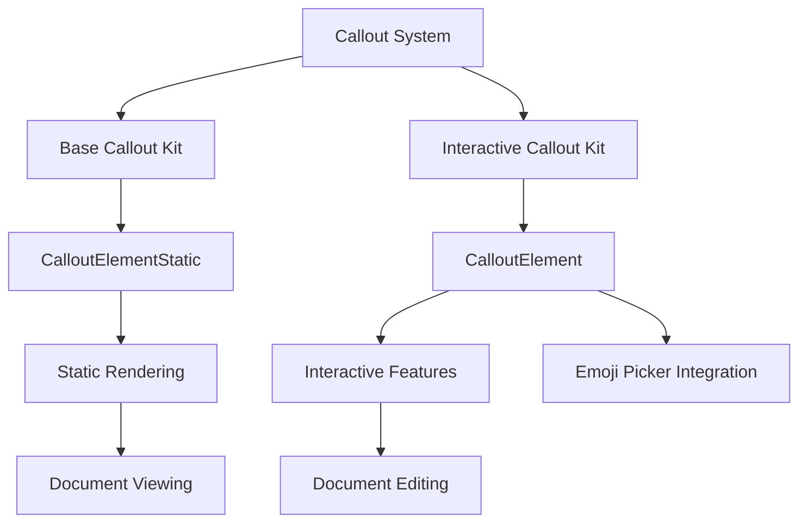
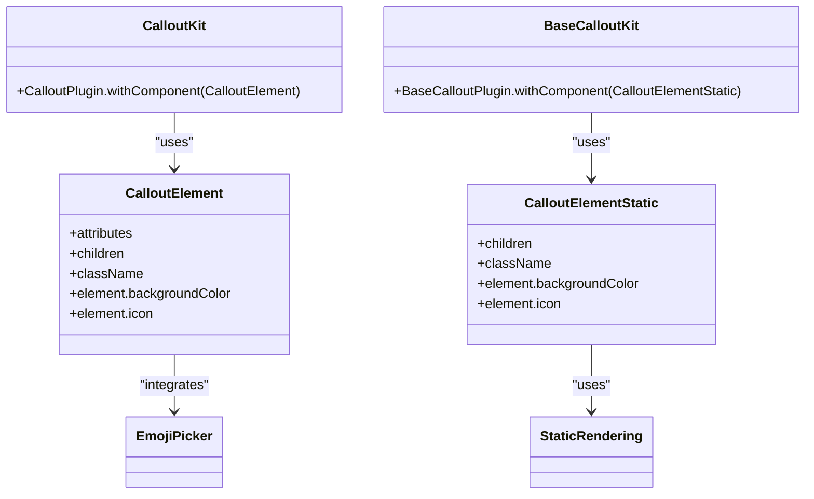
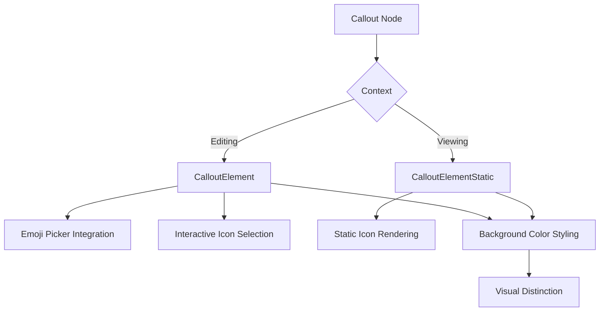

# Callout Blocks

<cite>
**Referenced Files in This Document**   
- [callout-kit.tsx](file://components/plate/callout-kit.tsx)
- [callout-base-kit.tsx](file://components/plate/callout-base-kit.tsx)
- [callout-node.tsx](file://components/ui/callout-node.tsx)
- [callout-node-static.tsx](file://components/ui/callout-node-static.tsx)
- [editor-kit.tsx](file://components/plate/editor-kit.tsx)
- [plate-types.ts](file://components/plate/plate-types.ts)
- [emoji-toolbar-button.tsx](file://components/ui/emoji-toolbar-button.tsx)
</cite>

## Table of Contents
1. [Introduction](#introduction)
2. [Architecture Overview](#architecture-overview)
3. [Core Components](#core-components)
4. [Callout Node Implementation](#callout-node-implementation)
5. [Configuration and Styling](#configuration-and-styling)
6. [Usage Examples](#usage-examples)
7. [Accessibility Considerations](#accessibility-considerations)
8. [Integration with Document Flow](#integration-with-document-flow)
9. [Troubleshooting Guide](#troubleshooting-guide)
10. [Conclusion](#conclusion)

## Introduction
The Sinesys document editor implements styled information blocks through the CalloutKit extension, providing a flexible system for creating visually distinct callout blocks such as notes, warnings, and important information. These callout blocks serve as visual indicators to highlight critical content within documents, including legal disclaimers, procedural warnings, and important case notes. The implementation leverages the Plate.js framework to create an extensible and customizable callout system that integrates seamlessly with the document editor's rich text capabilities.

**Section sources**
- [callout-kit.tsx](file://components/plate/callout-kit.tsx#L1-L7)
- [callout-base-kit.tsx](file://components/plate/callout-base-kit.tsx#L1-L7)

## Architecture Overview
The callout block functionality in Sinesys is built on a modular architecture that separates concerns between base functionality and interactive features. The system consists of two main components: the base callout implementation for static rendering and the enhanced callout kit for interactive editing. This separation allows callouts to be rendered efficiently in both editing and viewing contexts while maintaining consistent styling and behavior.

**Diagram sources **
- [callout-base-kit.tsx](file://components/plate/callout-base-kit.tsx#L1-L7)
- [callout-kit.tsx](file://components/plate/callout-kit.tsx#L1-L7)
- [callout-node-static.tsx](file://components/ui/callout-node-static.tsx#L1-L40)
- [callout-node.tsx](file://components/ui/callout-node.tsx#L1-L71)

**Section sources**
- [callout-base-kit.tsx](file://components/plate/callout-base-kit.tsx#L1-L7)
- [callout-kit.tsx](file://components/plate/callout-kit.tsx#L1-L7)

## Core Components
The callout system comprises several core components that work together to provide a comprehensive solution for styled information blocks. The CalloutKit provides the interactive editing capabilities, while the BaseCalloutKit offers static rendering functionality. These components are integrated into the document editor through the editor kit system, which combines various editing features into a cohesive whole.

**Diagram sources **
- [callout-kit.tsx](file://components/plate/callout-kit.tsx#L1-L7)
- [callout-base-kit.tsx](file://components/plate/callout-base-kit.tsx#L1-L7)
- [callout-node.tsx](file://components/ui/callout-node.tsx#L1-L71)
- [callout-node-static.tsx](file://components/ui/callout-node-static.tsx#L1-L40)

**Section sources**
- [callout-kit.tsx](file://components/plate/callout-kit.tsx#L1-L7)
- [callout-base-kit.tsx](file://components/plate/callout-base-kit.tsx#L1-L7)
- [editor-kit.tsx](file://components/plate/editor-kit.tsx#L1-L96)

## Callout Node Implementation
The callout node implementation consists of two variants: an interactive version for editing contexts and a static version for viewing contexts. The CalloutElement component provides full interactivity, including emoji picker integration that allows users to customize the callout icon. The CalloutElementStatic component is optimized for performance in read-only contexts, rendering callouts without interactive features.

Both implementations share common properties for styling and content, including background color and icon configuration. The components use Tailwind CSS classes for consistent styling and responsive behavior, with a design that emphasizes readability and visual distinction from regular document content.

**Diagram sources **
- [callout-node.tsx](file://components/ui/callout-node.tsx#L1-L71)
- [callout-node-static.tsx](file://components/ui/callout-node-static.tsx#L1-L40)

**Section sources**
- [callout-node.tsx](file://components/ui/callout-node.tsx#L1-L71)
- [callout-node-static.tsx](file://components/ui/callout-node-static.tsx#L1-L40)

## Configuration and Styling
The callout system supports extensive configuration options for customizing the appearance and behavior of callout blocks. Users can configure color schemes, select from a wide range of icons, and apply default text formatting to create callouts that meet specific documentation needs. The background color can be customized through the backgroundColor property, allowing integration with the application's overall design language.

Icon selection is implemented through emoji integration, providing access to a comprehensive set of visual indicators that can be easily changed to match the callout's purpose. The system uses standard emoji fonts to ensure consistent rendering across different platforms and devices, with fallback mechanisms to maintain usability when custom emoji are not available.

**Section sources**
- [callout-node.tsx](file://components/ui/callout-node.tsx#L30-L35)
- [callout-node-static.tsx](file://components/ui/callout-node-static.tsx#L13-L18)

## Usage Examples
The callout block functionality is designed to support various use cases within legal and professional documentation. For legal disclaimers, users can create callouts with neutral colors and formal icons to indicate important legal information. Procedural warnings benefit from high-visibility styling with attention-grabbing icons to alert users to critical process steps. Important case notes can be highlighted with distinctive colors and symbols to ensure they stand out in complex documents.

The system's flexibility allows for consistent application of callout styles across different document types, maintaining a professional appearance while providing clear visual cues about the importance and nature of the highlighted content. This consistency helps users quickly identify and understand the significance of callout blocks throughout their documentation.

**Section sources**
- [callout-node.tsx](file://components/ui/callout-node.tsx#L38-L69)
- [callout-node-static.tsx](file://components/ui/callout-node-static.tsx#L21-L38)

## Accessibility Considerations
The callout implementation includes several accessibility features to ensure usability for all users, including those using screen readers. The components use semantic HTML elements and appropriate ARIA attributes to convey the purpose and importance of callout content. The visual design maintains sufficient color contrast to support users with visual impairments, and the interactive elements are keyboard-navigable for users who cannot use a mouse.

The emoji integration is designed to provide both visual and textual information, ensuring that the meaning of callout icons is accessible even when images cannot be displayed. Alternative text and descriptive labels help screen readers convey the purpose of callout blocks to users who rely on assistive technologies.

**Section sources**
- [callout-node.tsx](file://components/ui/callout-node.tsx#L43-L44)
- [callout-node-static.tsx](file://components/ui/callout-node-static.tsx#L34-L35)

## Integration with Document Flow
The callout system is seamlessly integrated into the document editor's content flow, allowing callouts to be inserted and positioned like other block elements. The implementation ensures that callouts maintain proper spacing and alignment with surrounding content, preserving the document's overall readability and structure. The callout blocks are treated as first-class citizens in the document model, supporting standard editing operations like copy, paste, and deletion.

The integration with the Plate.js framework enables rich text editing within callout blocks, allowing users to format text, insert links, and apply other styling options while maintaining the callout's distinctive appearance. This flexibility supports complex content within callouts while ensuring they remain visually distinct from regular document text.

**Section sources**
- [editor-kit.tsx](file://components/plate/editor-kit.tsx#L41-L91)
- [plate-types.ts](file://components/plate/plate-types.ts#L1-L164)

## Troubleshooting Guide
Common issues with callout rendering typically relate to context-specific behavior differences between editing and viewing modes. In some cases, custom background colors may not display correctly due to CSS specificity conflicts or theme overrides. When emoji icons fail to render properly, the issue is often related to font loading or platform-specific emoji support.

To resolve rendering issues, verify that the callout element properties are correctly configured and that the appropriate kit (interactive or static) is being used for the current context. For accessibility concerns, ensure that sufficient color contrast is maintained and that alternative text is available for visual elements. Performance issues in documents with many callouts can often be addressed by using the static rendering variant in read-only contexts.

**Section sources**
- [callout-node.tsx](file://components/ui/callout-node.tsx#L30-L33)
- [callout-node-static.tsx](file://components/ui/callout-node-static.tsx#L13-L16)

## Conclusion
The callout block functionality in the Sinesys document editor provides a robust and flexible system for creating styled information blocks that enhance document clarity and communication. By leveraging the Plate.js framework and implementing both interactive and static rendering variants, the system delivers a comprehensive solution for highlighting important content in legal and professional documents. The extensive configuration options, accessibility features, and seamless integration with the document flow make callout blocks a valuable tool for creating effective and professional documentation.