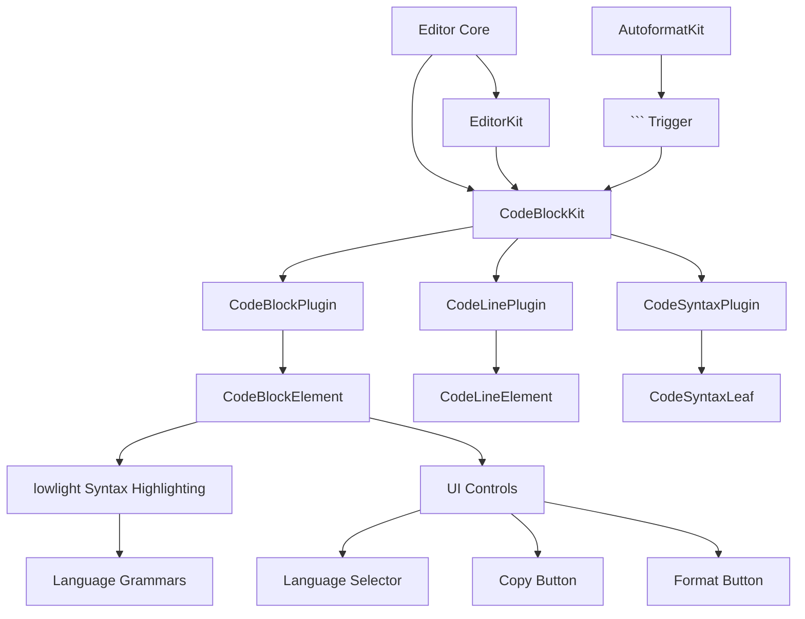
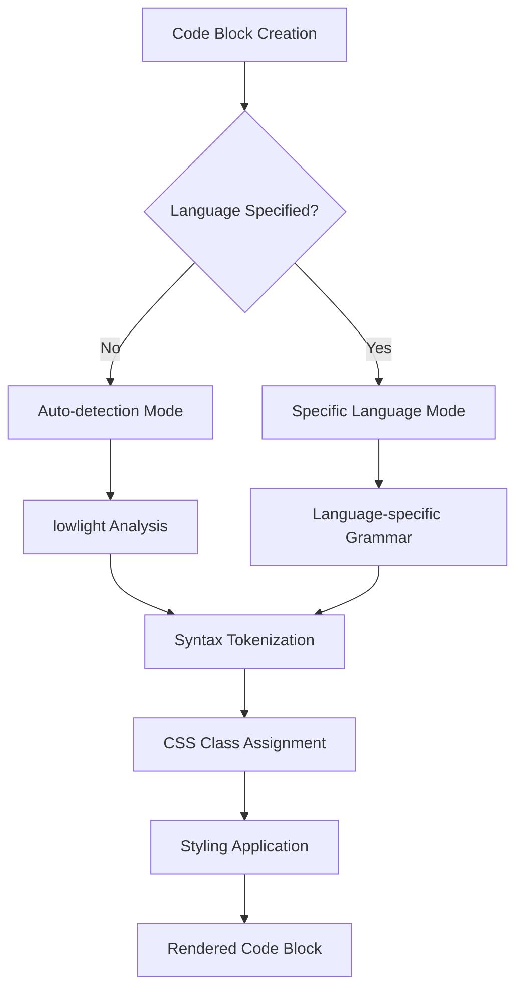
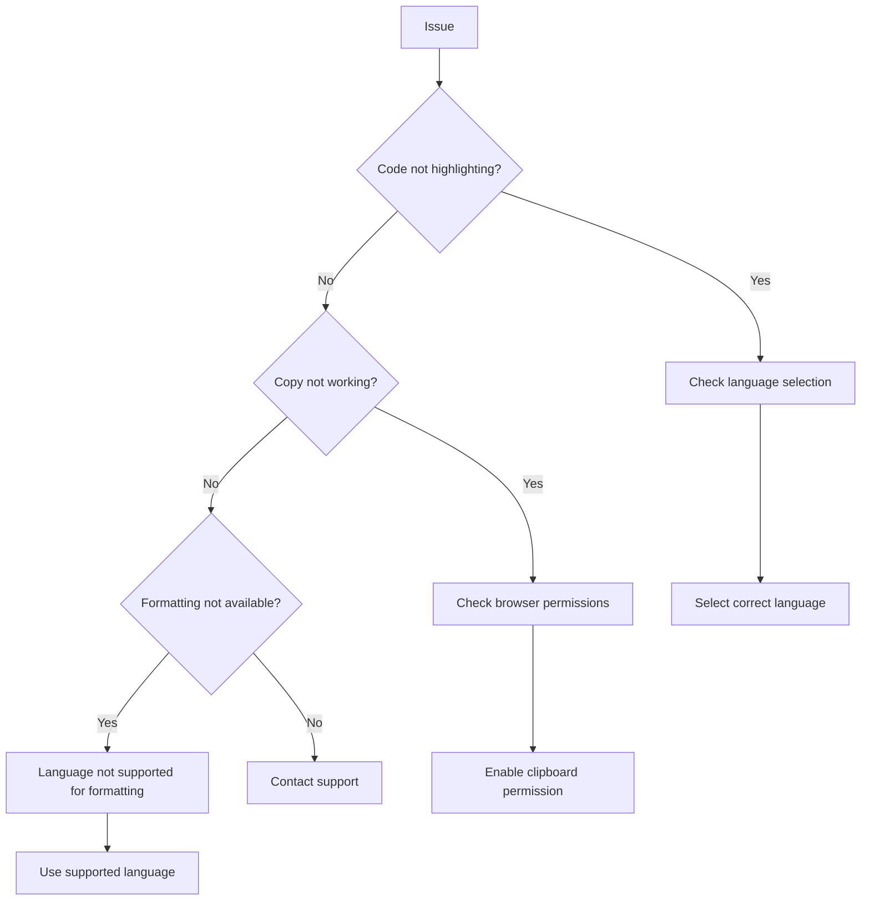

# Code Blocks

<cite>
**Referenced Files in This Document**   
- [code-block-kit.tsx](file://components/plate/code-block-kit.tsx)
- [code-block-base-kit.tsx](file://components/plate/code-block-base-kit.tsx)
- [code-block-node.tsx](file://components/ui/code-block-node.tsx)
- [code-block-node-static.tsx](file://components/ui/code-block-node-static.tsx)
- [editor-kit.tsx](file://components/plate/editor-kit.tsx)
- [autoformat-kit.tsx](file://components/plate/autoformat-kit.tsx)
- [api-swagger/page.tsx](file://app/ajuda/desenvolvimento/api-swagger/page.tsx)
</cite>

## Table of Contents
1. [Introduction](#introduction)
2. [Architecture Overview](#architecture-overview)
3. [Core Components](#core-components)
4. [Language Detection and Syntax Highlighting](#language-detection-and-syntax-highlighting)
5. [Code Block Configuration](#code-block-configuration)
6. [Usage Examples](#usage-examples)
7. [Accessibility and Performance](#accessibility-and-performance)
8. [Troubleshooting](#troubleshooting)

## Introduction
The Sinesys document editor provides robust code block formatting capabilities through the CodeBlockKit extension, enabling users to create syntax-highlighted code blocks with language-specific grammars, theme support, and line numbering. This documentation details the implementation of code blocks, their architecture, configuration options, and practical usage scenarios across different document types including API documentation, configuration examples, and technical specifications.

**Section sources**
- [code-block-kit.tsx](file://components/plate/code-block-kit.tsx)
- [code-block-base-kit.tsx](file://components/plate/code-block-base-kit.tsx)

## Architecture Overview



**Diagram sources**
- [code-block-kit.tsx](file://components/plate/code-block-kit.tsx)
- [code-block-node.tsx](file://components/ui/code-block-node.tsx)
- [autoformat-kit.tsx](file://components/plate/autoformat-kit.tsx)

**Section sources**
- [code-block-kit.tsx](file://components/plate/code-block-kit.tsx)
- [editor-kit.tsx](file://components/plate/editor-kit.tsx)

## Core Components

The code block system in Sinesys is built on a modular architecture using the Plate.js framework, with distinct components handling different aspects of code block functionality. The implementation separates concerns between interactive and static rendering contexts through parallel component hierarchies.

### Code Block Kit Architecture
The CodeBlockKit extension consists of three main plugins that work together to provide comprehensive code block functionality:

1. **CodeBlockPlugin**: Manages the top-level code block element, handling language detection, syntax highlighting configuration, and UI controls
2. **CodeLinePlugin**: Handles individual lines within code blocks, enabling line-based operations and numbering
3. **CodeSyntaxPlugin**: Applies syntax highlighting at the token level using language-specific grammars

The system provides both interactive (`code-block-kit.tsx`) and static (`code-block-base-kit.tsx`) variants to support different rendering contexts, such as collaborative editing versus document viewing.

```mermaid
classDiagram
class CodeBlockPlugin {
+configure(options) Plugin
+options : {lowlight, node, shortcuts}
}
class CodeLinePlugin {
+withComponent(component) Plugin
}
class CodeSyntaxPlugin {
+withComponent(component) Plugin
}
class CodeBlockElement {
+render() JSX.Element
+languageSelector : CodeBlockCombobox
+copyButton : CopyButton
+formatButton : Button
}
class CodeLineElement {
+render() JSX.Element
}
class CodeSyntaxLeaf {
+render() JSX.Element
+tokenClassName : string
}
CodeBlockPlugin --> CodeBlockElement : "uses"
CodeLinePlugin --> CodeLineElement : "uses"
CodeSyntaxPlugin --> CodeSyntaxLeaf : "uses"
CodeBlockElement --> CodeBlockCombobox : "contains"
CodeBlockElement --> CopyButton : "contains"
CodeBlockElement --> Button : "contains"
```

**Diagram sources**
- [code-block-kit.tsx](file://components/plate/code-block-kit.tsx)
- [code-block-node.tsx](file://components/ui/code-block-node.tsx)

**Section sources**
- [code-block-kit.tsx](file://components/plate/code-block-kit.tsx)
- [code-block-base-kit.tsx](file://components/plate/code-block-base-kit.tsx)
- [code-block-node.tsx](file://components/ui/code-block-node.tsx)
- [code-block-node-static.tsx](file://components/ui/code-block-node-static.tsx)

## Language Detection and Syntax Highlighting

### Language Support
The code block system supports 84 programming languages and markup formats, ranging from common languages like JavaScript, Python, and Java to specialized formats like Docker, GraphQL, and Mermaid. Language detection can be set to automatic or manually specified by the user.



**Diagram sources**
- [code-block-node.tsx](file://components/ui/code-block-node.tsx)
- [code-block-kit.tsx](file://components/plate/code-block-kit.tsx)

The complete list of supported languages includes:
- Programming Languages: JavaScript, TypeScript, Python, Java, C++, C#, Go, Rust, Ruby, PHP, Swift, Kotlin, etc.
- Web Technologies: HTML, CSS, SCSS, Less, JSON, XML, YAML, Markdown
- Scripting Languages: Bash, PowerShell, Perl, Lua, R
- Specialized Formats: Docker, SQL, GraphQL, Protocol Buffers, WebAssembly, LaTeX

### Syntax Highlighting Implementation
Syntax highlighting is implemented using the lowlight library, a lightweight syntax highlighter that supports tree-sitter grammars. The system creates a lowlight instance with all available grammars:

```typescript
const lowlight = createLowlight(all);
```

When code content is processed, lowlight tokenizes the text according to the selected language grammar, generating a hierarchical structure of tokens with appropriate CSS classes. These classes are then used to apply syntax-specific styling.

**Section sources**
- [code-block-kit.tsx](file://components/plate/code-block-kit.tsx)
- [code-block-node.tsx](file://components/ui/code-block-node.tsx)

## Code Block Configuration

### Configuration Options
The CodeBlockKit provides several configuration options to customize behavior:

```mermaid
classDiagram
class CodeBlockPluginOptions {
+lowlight : Lowlight
+node : {component : React.Component}
+shortcuts : {toggle : {keys : string}}
}
class CodeBlockElementProps {
+editor : PlateEditor
+element : TCodeBlockElement
+children : React.ReactNode
}
class CodeBlockCombobox {
+open : boolean
+searchValue : string
+items : Array<{label : string, value : string}>
}
CodeBlockPluginOptions --> CodeBlockElementProps : "passed as props"
CodeBlockElementProps --> CodeBlockCombobox : "contains"
```

**Diagram sources**
- [code-block-kit.tsx](file://components/plate/code-block-kit.tsx)
- [code-block-node.tsx](file://components/ui/code-block-node.tsx)

Key configuration features include:
- **Keyboard Shortcut**: `mod+alt+8` to toggle code block creation
- **Language Selection**: Dropdown combobox for changing the syntax highlighting language
- **Copy Functionality**: Button to copy code content to clipboard
- **Format Option**: Button to format code (when language is supported)

### Theme Support
The code block styling is integrated with the application's theme system through CSS variables and dark mode support. Syntax highlighting colors are defined using a comprehensive set of CSS classes that target specific token types:

- **Keywords**: Red (#d73a49 in light mode, #ee6960 in dark mode)
- **Strings**: Blue (#032f62 in light mode, #3593ff in dark mode)
- **Comments**: Gray (#6a737d in both modes)
- **Numbers**: Dark blue (#005cc5 in light mode, #6596cf in dark mode)
- **Variables**: Dark blue (#005cc5 in light mode, #6596cf in dark mode)

The styling ensures readability across different themes while maintaining accessibility standards.

**Section sources**
- [code-block-node.tsx](file://components/ui/code-block-node.tsx)
- [code-block-kit.tsx](file://components/plate/code-block-kit.tsx)

## Usage Examples

### API Documentation
Code blocks are extensively used in API documentation to display request/response examples, endpoint specifications, and integration code:

```mermaid
sequenceDiagram
participant Dev as Developer
participant Editor as Document Editor
participant API as API Documentation
Dev->>Editor : Create new document
Editor->>Editor : Type
``` to start code block
    Editor->>Editor: Select language (e.g., JavaScript)
    Editor->>Editor: Enter API example code
    Editor->>Editor: Add description text
    Editor->>API: Save document
    API->>Dev: Display formatted API documentation
```

**Diagram sources**
- [api-swagger/page.tsx](file://app/ajuda/desenvolvimento/api-swagger/page.tsx)

### Configuration Examples
The system supports configuration examples in various formats including JSON, YAML, and TOML, with appropriate syntax highlighting:

```json
{
  "api": {
    "baseUrl": "https://api.sinesys.com",
    "timeout": 5000,
    "retries": 3
  },
  "database": {
    "host": "localhost",
    "port": 5432,
    "name": "sinesys_db"
  }
}
```

### Technical Specifications in Legal Documents
Code blocks can be embedded within legal documents to include technical specifications, data formats, or integration requirements while maintaining proper formatting and readability.

**Section sources**
- [api-swagger/page.tsx](file://app/ajuda/desenvolvimento/api-swagger/page.tsx)

## Accessibility and Performance

### Accessibility Features
The code block implementation includes several accessibility features:

- **Keyboard Navigation**: Full keyboard support for all controls
- **Screen Reader Support**: Proper ARIA labels and roles
- **Color Contrast**: High contrast ratios that meet WCAG 2.1 standards
- **Focus Management**: Clear focus indicators for interactive elements

For users with color vision deficiencies, the syntax highlighting uses not only color but also text styling (bold, italic) to differentiate token types, ensuring information is conveyed through multiple channels.

### Performance Considerations
The system is optimized for performance with large code blocks:

- **Virtualization**: Long code blocks are efficiently rendered
- **Syntax Highlighting Optimization**: Incremental parsing and highlighting
- **Memory Management**: Efficient handling of large documents
- **Copy Performance**: Optimized clipboard operations for large code snippets

The implementation preserves whitespace and indentation exactly as entered, ensuring code formatting is maintained across different viewing contexts.

**Section sources**
- [code-block-node.tsx](file://components/ui/code-block-node.tsx)
- [code-block-node-static.tsx](file://components/ui/code-block-node-static.tsx)

## Troubleshooting

### Common Issues and Solutions
When working with code blocks, users may encounter several common issues:



**Diagram sources**
- [code-block-node.tsx](file://components/ui/code-block-node.tsx)

**Section sources**
- [code-block-node.tsx](file://components/ui/code-block-node.tsx)
- [code-block-kit.tsx](file://components/plate/code-block-kit.tsx)

Key troubleshooting steps include:
- Verify the correct language is selected in the code block dropdown
- Ensure browser permissions allow clipboard access for copy functionality
- Check that the language supports formatting operations
- Confirm the code block is properly created with the ``` delimiter or toolbar button
- Test in different browsers if rendering issues occur

The system provides visual feedback for all operations, including success indicators when code is copied to the clipboard.