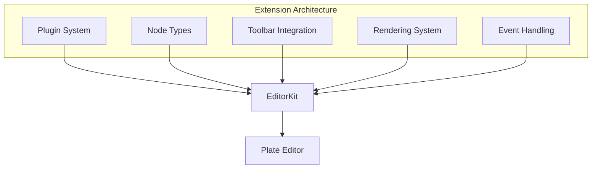
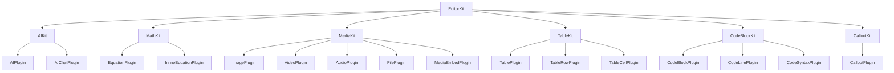
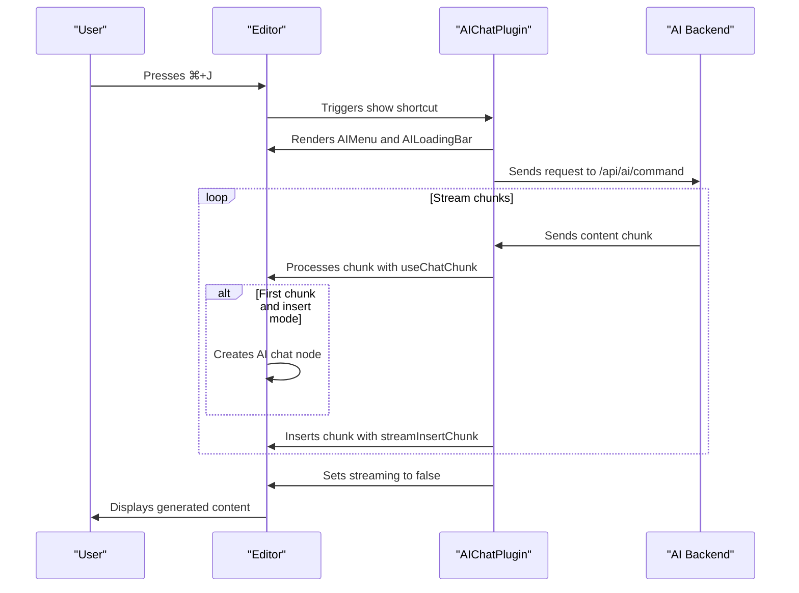
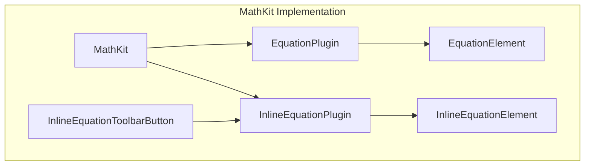
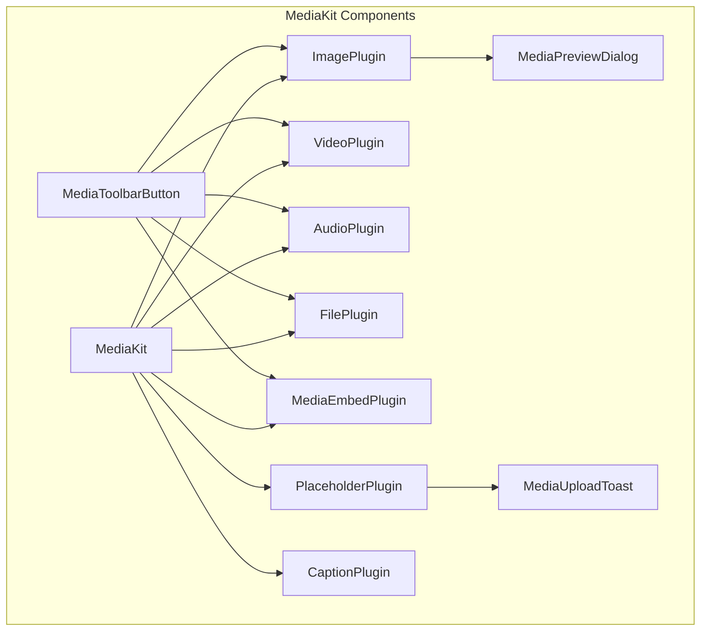
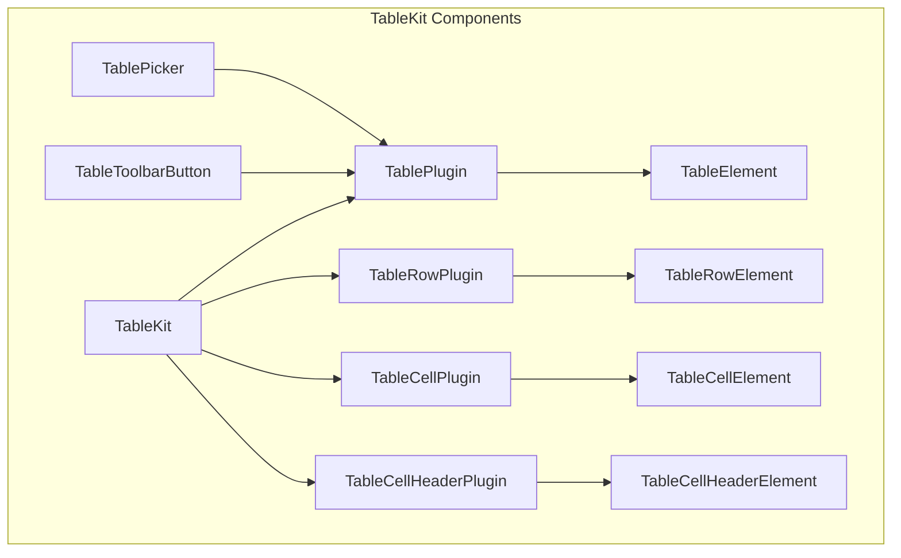
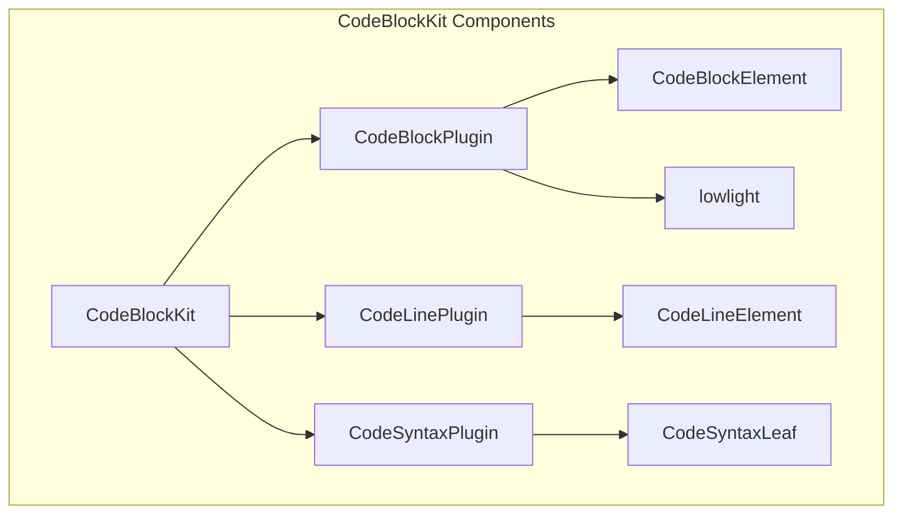
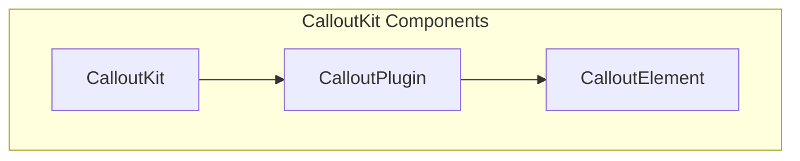
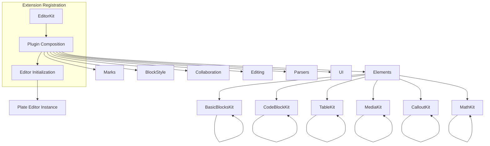
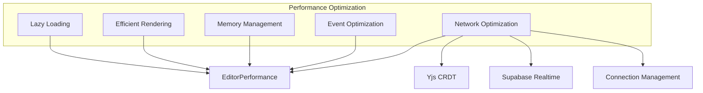

# Extensions

<cite>
**Referenced Files in This Document**   
- [ai-kit.tsx](file://components/plate/ai-kit.tsx)
- [math-kit.tsx](file://components/plate/math-kit.tsx)
- [media-kit.tsx](file://components/plate/media-kit.tsx)
- [table-kit.tsx](file://components/plate/table-kit.tsx)
- [code-block-kit.tsx](file://components/plate/code-block-kit.tsx)
- [callout-kit.tsx](file://components/plate/callout-kit.tsx)
- [editor-kit.tsx](file://components/plate/editor-kit.tsx)
- [plate-types.ts](file://components/plate/plate-types.ts)
- [plate-editor.tsx](file://components/plate/plate-editor.tsx)
- [collaborative-plate-editor.tsx](file://components/plate/collaborative-plate-editor.tsx)
- [ai-toolbar-button.tsx](file://components/ui/ai-toolbar-button.tsx)
- [equation-toolbar-button.tsx](file://components/ui/equation-toolbar-button.tsx)
- [media-toolbar-button.tsx](file://components/ui/media-toolbar-button.tsx)
- [table-toolbar-button.tsx](file://components/ui/table-toolbar-button.tsx)
- [ai-node.tsx](file://components/ui/ai-node.tsx)
- [equation-node.tsx](file://components/ui/equation-node.tsx)
- [media-audio-node.tsx](file://components/ui/media-audio-node.tsx)
- [media-embed-node.tsx](file://components/ui/media-embed-node.tsx)
- [media-file-node.tsx](file://components/ui/media-file-node.tsx)
- [media-image-node.tsx](file://components/ui/media-image-node.tsx)
- [media-placeholder-node.tsx](file://components/ui/media-placeholder-node.tsx)
- [media-preview-dialog.tsx](file://components/ui/media-preview-dialog.tsx)
- [media-upload-toast.tsx](file://components/ui/media-upload-toast.tsx)
- [table-node.tsx](file://components/ui/table-node.tsx)
- [code-block-node.tsx](file://components/ui/code-block-node.tsx)
- [callout-node.tsx](file://components/ui/callout-node.tsx)
</cite>

## Table of Contents
1. [Introduction](#introduction)
2. [Extension Architecture](#extension-architecture)
3. [Core Extension Kits](#core-extension-kits)
4. [AI-Powered Content Generation](#ai-powered-content-generation)
5. [Mathematical Equation Editing](#mathematical-equation-editing)
6. [Media Embedding](#media-embedding)
7. [Table Creation](#table-creation)
8. [Code Block Formatting](#code-block-formatting)
9. [Callout Blocks](#callout-blocks)
10. [Extension Registration and Configuration](#extension-registration-and-configuration)
11. [Performance Considerations](#performance-considerations)
12. [Troubleshooting Guide](#troubleshooting-guide)

## Introduction

The Sinesys document editor is built on the Plate editor framework, which provides a modular architecture for extending core functionality through composable extension kits. These extensions enhance the editor with advanced features including AI-powered content generation, mathematical equation editing, media embedding, table creation, code block formatting, and callout blocks. Each extension is implemented as a self-contained kit that integrates seamlessly with the editor framework, adding new node types, toolbar buttons, and formatting options.

The extension system follows a composable design pattern, allowing extensions to be combined and configured based on specific use cases. This modular approach enables the creation of rich, feature-complete editors while maintaining code organization and separation of concerns. The architecture supports both collaborative and non-collaborative editing modes, with real-time synchronization powered by Yjs and Supabase Realtime.

**Section sources**
- [editor-kit.tsx](file://components/plate/editor-kit.tsx#L41-L96)
- [plate-editor.tsx](file://components/plate/plate-editor.tsx#L17-L42)
- [collaborative-plate-editor.tsx](file://components/plate/collaborative-plate-editor.tsx#L72-L187)

## Extension Architecture

The extension system in Sinesys is built on the Plate editor framework, which provides a plugin-based architecture for extending editor functionality. Each extension kit is implemented as an array of plugins that can be composed together to create a feature-rich editor experience. The architecture follows a layered approach with distinct components for different types of functionality.

The core architectural components include:

- **Plugin System**: The foundation of the extension architecture, allowing each feature to be implemented as a configurable plugin
- **Node Types**: Custom element types that represent different content blocks in the editor (e.g., tables, equations, media)
- **Toolbar Integration**: UI components that provide access to extension features through toolbar buttons and menus
- **Rendering System**: Components responsible for rendering extension content in the editor
- **Event Handling**: Logic for handling user interactions and content manipulation

The extension kits are organized into logical groups based on their functionality, such as elements, marks, block styles, collaboration features, editing tools, and UI components. This organization is reflected in the `EditorKit` configuration, which composes all available extensions into a complete editor configuration.

**Diagram sources **
- [editor-kit.tsx](file://components/plate/editor-kit.tsx#L41-L96)
- [plate-editor.tsx](file://components/plate/plate-editor.tsx#L17-L42)

**Section sources**
- [editor-kit.tsx](file://components/plate/editor-kit.tsx#L41-L96)
- [plate-types.ts](file://components/plate/plate-types.ts#L25-L164)

## Core Extension Kits

The Sinesys editor implements several core extension kits that provide essential functionality for document creation and editing. Each kit is designed as a composable module that can be included or excluded based on the specific requirements of the editor instance.

The primary extension kits include:

- **AIKit**: Provides AI-powered content generation and editing capabilities
- **MathKit**: Enables mathematical equation editing with LaTeX rendering
- **MediaKit**: Supports embedding of images, videos, audio files, and other media types
- **TableKit**: Facilitates table creation and manipulation
- **CodeBlockKit**: Provides code block formatting with syntax highlighting
- **CalloutKit**: Implements callout blocks for highlighting important information

These kits are composed together in the `EditorKit` to create a comprehensive editor configuration. Each kit follows a consistent implementation pattern, typically consisting of plugin configurations, component mappings, and optional configuration options.

**Diagram sources **
- [editor-kit.tsx](file://components/plate/editor-kit.tsx#L6-L40)
- [ai-kit.tsx](file://components/plate/ai-kit.tsx#L95-L100)
- [math-kit.tsx](file://components/plate/math-kit.tsx#L10-L13)
- [media-kit.tsx](file://components/plate/media-kit.tsx#L23-L43)
- [table-kit.tsx](file://components/plate/table-kit.tsx#L17-L22)
- [code-block-kit.tsx](file://components/plate/code-block-kit.tsx#L18-L26)
- [callout-kit.tsx](file://components/plate/callout-kit.tsx#L7)

**Section sources**
- [editor-kit.tsx](file://components/plate/editor-kit.tsx#L6-L40)
- [ai-kit.tsx](file://components/plate/ai-kit.tsx#L1-L101)
- [math-kit.tsx](file://components/plate/math-kit.tsx#L1-L14)
- [media-kit.tsx](file://components/plate/media-kit.tsx#L1-L44)
- [table-kit.tsx](file://components/plate/table-kit.tsx#L1-L23)
- [code-block-kit.tsx](file://components/plate/code-block-kit.tsx#L1-L27)
- [callout-kit.tsx](file://components/plate/callout-kit.tsx#L1-L8)

## AI-Powered Content Generation

The AiKit extension provides AI-powered content generation and editing capabilities within the Sinesys editor. This extension integrates with backend AI services to enable features such as content generation, text improvement, grammar correction, and tone adjustment.

The implementation consists of two main components: the `aiChatPlugin` and the `AIKit` array. The `aiChatPlugin` extends the Plate AI Chat plugin with custom configuration and behavior, including API endpoint configuration, rendering components, keyboard shortcuts, and event handlers. The plugin is configured to communicate with the AI backend via the `/api/ai/command` endpoint.

Key features of the AI extension include:

- **Content Generation**: Users can generate new content by pressing `⌘+J` or `Space` in an empty line
- **Text Editing**: The AI can improve existing text by fixing grammar, adjusting tone, or rephrasing content
- **Streaming Responses**: AI-generated content is streamed in real-time, providing immediate feedback
- **Visual Indicators**: Loading bars and menus provide visual feedback during AI operations

The extension uses the `useChatChunk` hook to handle streaming responses from the AI service, processing each chunk of content as it arrives. When in insert mode, the extension creates a new AI chat node and streams the generated content into it. When in edit mode, it applies suggestions to the selected text.

**Diagram sources **
- [ai-kit.tsx](file://components/plate/ai-kit.tsx#L21-L93)
- [ai-toolbar-button.tsx](file://components/ui/ai-toolbar-button.tsx#L10-L27)
- [ai-node.tsx](file://components/ui/ai-node.tsx)

**Section sources**
- [ai-kit.tsx](file://components/plate/ai-kit.tsx#L1-L101)
- [ai-toolbar-button.tsx](file://components/ui/ai-toolbar-button.tsx#L1-L27)

## Mathematical Equation Editing

The MathKit extension enables mathematical equation editing in the Sinesys editor, supporting both inline and block equations with LaTeX rendering. This extension provides users with the ability to create complex mathematical expressions within their documents.

The implementation consists of two plugins from the `@platejs/math/react` package: `EquationPlugin` for block equations and `InlineEquationPlugin` for inline equations. These plugins are configured to use custom React components for rendering: `EquationElement` for block equations and `InlineEquationElement` for inline equations.

The extension allows users to insert equations through toolbar buttons or keyboard shortcuts. When an equation is inserted, it is rendered using appropriate mathematical notation, supporting a wide range of LaTeX commands and symbols. The equations are stored as structured data within the editor's content model, preserving their semantic meaning.

**Diagram sources **
- [math-kit.tsx](file://components/plate/math-kit.tsx#L10-L13)
- [equation-toolbar-button.tsx](file://components/ui/equation-toolbar-button.tsx#L11-L28)
- [equation-node.tsx](file://components/ui/equation-node.tsx)

**Section sources**
- [math-kit.tsx](file://components/plate/math-kit.tsx#L1-L14)
- [equation-toolbar-button.tsx](file://components/ui/equation-toolbar-button.tsx#L1-L28)

## Media Embedding

The MediaKit extension provides comprehensive support for embedding various media types in the Sinesys editor, including images, videos, audio files, and other document types. The extension also supports embedding media via URLs and provides drag-and-drop functionality.

The implementation consists of multiple plugins from the `@platejs/media/react` package, each handling a specific media type:

- **ImagePlugin**: Handles image embedding with upload support
- **VideoPlugin**: Supports video embedding
- **AudioPlugin**: Enables audio file embedding
- **FilePlugin**: Allows embedding of various file types
- **MediaEmbedPlugin**: Supports embedding media from external sources via URLs
- **PlaceholderPlugin**: Manages upload placeholders and progress indicators
- **CaptionPlugin**: Provides caption functionality for media elements

The extension includes several UI components to enhance the media embedding experience:

- **MediaPreviewDialog**: Displays a preview of uploaded media
- **MediaUploadToast**: Shows upload progress and status
- **MediaToolbarButton**: Provides a split button for media insertion with options for upload and URL insertion

The MediaKit is configured to disable empty placeholders and to prevent automatic insertion of uploaded files, giving users more control over the embedding process. The CaptionPlugin is configured to allow captions on all media types.

**Diagram sources **
- [media-kit.tsx](file://components/plate/media-kit.tsx#L23-L43)
- [media-toolbar-button.tsx](file://components/ui/media-toolbar-button.tsx#L80-L232)
- [media-preview-dialog.tsx](file://components/ui/media-preview-dialog.tsx)
- [media-upload-toast.tsx](file://components/ui/media-upload-toast.tsx)

**Section sources**
- [media-kit.tsx](file://components/plate/media-kit.tsx#L1-L44)
- [media-toolbar-button.tsx](file://components/ui/media-toolbar-button.tsx#L1-L232)

## Table Creation

The TableKit extension enables table creation and manipulation in the Sinesys editor, providing users with a comprehensive set of tools for working with tabular data. The extension supports creating tables of various sizes, merging and splitting cells, and manipulating rows and columns.

The implementation consists of four plugins from the `@platejs/table/react` package:

- **TablePlugin**: Manages table elements
- **TableRowPlugin**: Handles table rows
- **TableCellPlugin**: Manages table cells
- **TableCellHeaderPlugin**: Handles header cells

These plugins are configured to use custom React components for rendering table elements: `TableElement` for tables, `TableRowElement` for rows, `TableCellElement` for cells, and `TableCellHeaderElement` for header cells.

The extension provides a rich toolbar interface for table manipulation, including:

- **Table Picker**: A visual grid for selecting table dimensions
- **Cell Operations**: Merge and split cells
- **Row Operations**: Insert and delete rows
- **Column Operations**: Insert and delete columns
- **Table Deletion**: Remove entire tables

The TableToolbarButton component implements a dropdown menu with submenus for different table operations, providing an intuitive interface for working with tables.

**Diagram sources **
- [table-kit.tsx](file://components/plate/table-kit.tsx#L17-L22)
- [table-toolbar-button.tsx](file://components/ui/table-toolbar-button.tsx#L37-L267)
- [table-node.tsx](file://components/ui/table-node.tsx)

**Section sources**
- [table-kit.tsx](file://components/plate/table-kit.tsx#L1-L23)
- [table-toolbar-button.tsx](file://components/ui/table-toolbar-button.tsx#L1-L267)

## Code Block Formatting

The CodeBlockKit extension provides code block formatting capabilities in the Sinesys editor, supporting syntax highlighting for various programming languages. This extension enables users to insert and format code blocks within their documents.

The implementation consists of three plugins from the `@platejs/code-block/react` package:

- **CodeBlockPlugin**: Manages code block elements
- **CodeLinePlugin**: Handles individual lines within code blocks
- **CodeSyntaxPlugin**: Provides syntax highlighting

The CodeBlockPlugin is configured with several options:

- **Lowlight**: Uses the lowlight library for syntax highlighting, initialized with support for all languages
- **Component**: Uses the `CodeBlockElement` component for rendering code blocks
- **Shortcuts**: Configured with the keyboard shortcut `⌘+⌥+8` to toggle code blocks

The extension includes custom components for rendering code elements:

- **CodeBlockElement**: Renders the entire code block
- **CodeLineElement**: Renders individual lines of code
- **CodeSyntaxLeaf**: Renders syntax-highlighted text within code blocks

The syntax highlighting is powered by lowlight, which supports a wide range of programming languages. When a code block is created, users can specify the language, and the extension will apply appropriate syntax highlighting.

**Diagram sources **
- [code-block-kit.tsx](file://components/plate/code-block-kit.tsx#L18-L26)
- [code-block-node.tsx](file://components/ui/code-block-node.tsx)

**Section sources**
- [code-block-kit.tsx](file://components/plate/code-block-kit.tsx#L1-L27)
- [code-block-node.tsx](file://components/ui/code-block-node.tsx)

## Callout Blocks

The CalloutKit extension implements callout blocks in the Sinesys editor, providing a way to highlight important information, warnings, notes, or other content that should stand out from the main text. Callout blocks are commonly used for emphasizing key points, providing additional context, or drawing attention to specific information.

The implementation consists of a single plugin from the `@platejs/callout/react` package: `CalloutPlugin`. This plugin is configured to use the `CalloutElement` component for rendering callout blocks.

The CalloutPlugin provides the following functionality:

- **Callout Creation**: Users can insert callout blocks through toolbar buttons or keyboard shortcuts
- **Custom Styling**: Callout blocks are rendered with distinctive visual styling to differentiate them from regular content
- **Flexible Content**: Callout blocks can contain various types of content, including text, lists, and other nested elements

The extension is designed to be simple and focused, providing essential callout functionality without unnecessary complexity. The `CalloutElement` component handles the visual presentation of callout blocks, ensuring they are easily distinguishable from other content types.

**Diagram sources **
- [callout-kit.tsx](file://components/plate/callout-kit.tsx#L7)
- [callout-node.tsx](file://components/ui/callout-node.tsx)

**Section sources**
- [callout-kit.tsx](file://components/plate/callout-kit.tsx#L1-L8)
- [callout-node.tsx](file://components/ui/callout-node.tsx)

## Extension Registration and Configuration

The extension system in Sinesys follows a composable pattern for registering and configuring extensions. Each extension kit is implemented as an array of plugins that can be combined to create a complete editor configuration.

The primary mechanism for extension registration is the `EditorKit` array, which composes all available extension kits into a single configuration. This array uses the spread operator (`...`) to include plugins from various extension kits, organizing them into logical groups:

- **Elements**: Basic blocks, code blocks, tables, toggles, TOC, media, callouts, columns, math, dates, links, and mentions
- **Marks**: Basic text formatting and font styling
- **Block Style**: Lists, alignment, and line height
- **Collaboration**: Discussion, comments, and suggestions
- **Editing**: Slash commands, autoformatting, cursor overlay, block menu, drag-and-drop, emoji, and exit breaks
- **Parsers**: DOCX and Markdown import/export
- **UI**: Block placeholders, fixed toolbar, and floating toolbar

Each extension kit is responsible for configuring its plugins with appropriate options, rendering components, and event handlers. For example, the `MediaKit` configures the `ImagePlugin` with options to disable automatic upload insertion and specifies the `MediaPreviewDialog` component to render after the editable area.

The editor initialization process involves creating a Plate editor instance with the composed plugin configuration. The `usePlateEditor` hook is used to create the editor, passing the `EditorKit` as the plugins configuration. This approach allows for flexible editor configurations that can be customized based on specific requirements.

**Diagram sources **
- [editor-kit.tsx](file://components/plate/editor-kit.tsx#L41-L96)
- [plate-editor.tsx](file://components/plate/plate-editor.tsx#L17-L42)

**Section sources**
- [editor-kit.tsx](file://components/plate/editor-kit.tsx#L41-L96)
- [plate-editor.tsx](file://components/plate/plate-editor.tsx#L17-L42)

## Performance Considerations

The extension system in Sinesys is designed with performance in mind, addressing potential issues that can arise from multiple active extensions. The architecture incorporates several strategies to optimize performance and minimize the impact on editor responsiveness.

Key performance considerations include:

- **Lazy Loading**: Extensions are only initialized when needed, reducing the initial load time of the editor
- **Efficient Rendering**: The React-based component system ensures efficient updates and minimal re-renders
- **Memory Management**: Proper cleanup of event listeners and subscriptions prevents memory leaks
- **Optimized Event Handling**: Event handlers are debounced or throttled when appropriate to prevent excessive processing

For collaborative editing, the system uses Yjs for CRDT-based synchronization, which efficiently handles concurrent edits and minimizes network traffic. The SupabaseYjsProvider manages the connection to the realtime database, handling connection state changes and synchronization status.

When multiple extensions are active, the system may experience increased memory usage and processing overhead. To mitigate this, the architecture supports creating custom editor configurations with only the necessary extensions, allowing developers to optimize for specific use cases.

Potential performance optimizations include:

- **Code Splitting**: Splitting extension code into separate bundles for on-demand loading
- **Virtual Scrolling**: Implementing virtual scrolling for large documents to improve rendering performance
- **Extension Prioritization**: Loading essential extensions first and deferring non-essential ones
- **Resource Caching**: Caching frequently used resources to reduce network requests

**Diagram sources **
- [collaborative-plate-editor.tsx](file://components/plate/collaborative-plate-editor.tsx#L72-L187)
- [editor-kit.tsx](file://components/plate/editor-kit.tsx#L41-L96)

**Section sources**
- [collaborative-plate-editor.tsx](file://components/plate/collaborative-plate-editor.tsx#L72-L187)
- [editor-kit.tsx](file://components/plate/editor-kit.tsx#L41-L96)

## Troubleshooting Guide

This section addresses common issues that may arise when working with the extension system in Sinesys and provides solutions for resolving them.

### Extension Conflicts

Extension conflicts can occur when multiple extensions attempt to handle the same events or modify the same content. To resolve extension conflicts:

1. Review the plugin configuration order in the `EditorKit`
2. Ensure that extensions with higher priority are listed first
3. Check for overlapping keyboard shortcuts and modify them if necessary
4. Use the `useEditorSelector` hook to conditionally enable extensions based on editor state

### Performance Issues

If the editor experiences performance issues with multiple active extensions:

1. Review the editor configuration and remove unnecessary extensions
2. Implement lazy loading for non-essential extensions
3. Monitor memory usage and ensure proper cleanup of event listeners
4. Consider using a simplified editor configuration for mobile devices or low-power systems

### Missing Toolbar Buttons

If toolbar buttons for extensions are not appearing:

1. Verify that the extension kit is included in the `EditorKit` configuration
2. Check that the toolbar component is properly integrated with the editor
3. Ensure that the extension's toolbar button component is correctly implemented
4. Verify that there are no CSS issues hiding the toolbar buttons

### Media Upload Issues

For problems with media embedding:

1. Check that the `MediaKit` is properly configured in the editor
2. Verify that the upload endpoints are correctly configured
3. Ensure that the `PlaceholderPlugin` is properly handling upload states
4. Check browser console for any network errors during upload

### AI Integration Issues

For problems with AI-powered features:

1. Verify that the AI backend service is running and accessible
2. Check that the API endpoint (`/api/ai/command`) is correctly configured
3. Ensure that the AI service has proper authentication and rate limiting
4. Monitor the streaming connection for any interruptions

**Section sources**
- [editor-kit.tsx](file://components/plate/editor-kit.tsx#L41-L96)
- [ai-kit.tsx](file://components/plate/ai-kit.tsx#L1-L101)
- [media-kit.tsx](file://components/plate/media-kit.tsx#L1-L44)
- [collaborative-plate-editor.tsx](file://components/plate/collaborative-plate-editor.tsx#L72-L187)