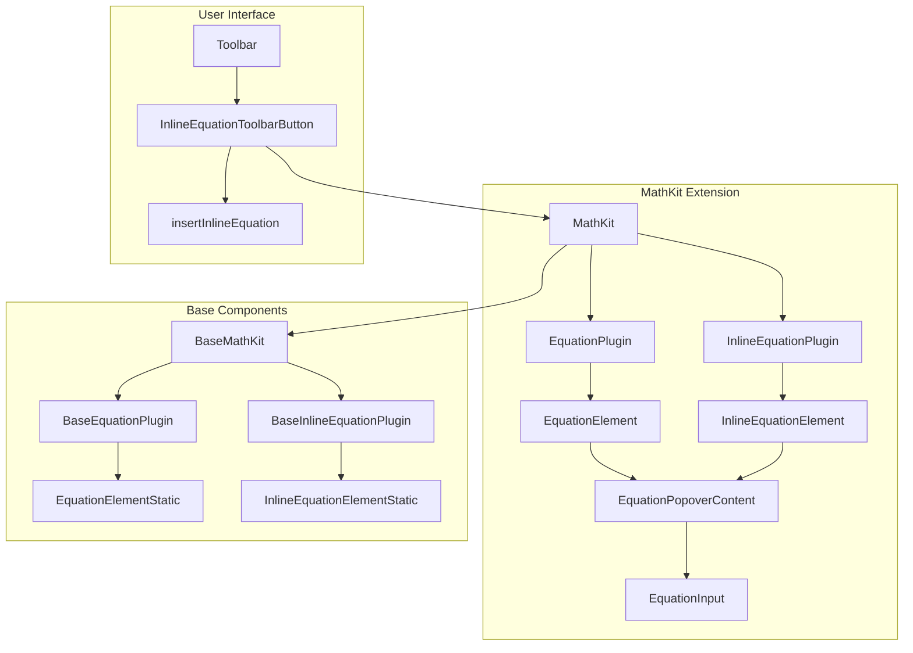
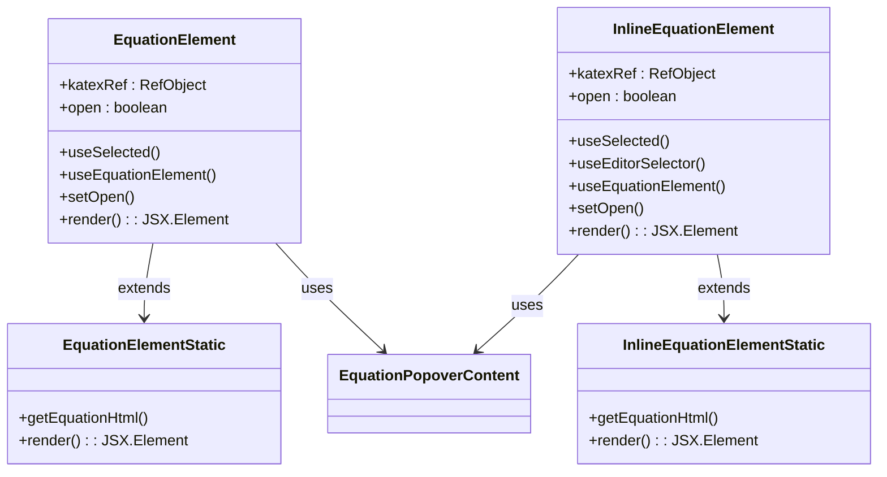
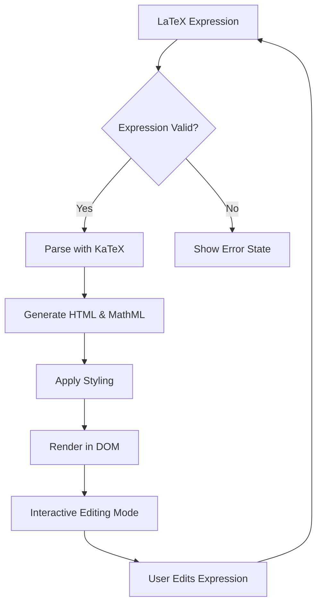

# Mathematical Equations

<cite>
**Referenced Files in This Document**   
- [equation-node.tsx](file://components/ui/equation-node.tsx)
- [equation-node-static.tsx](file://components/ui/equation-node-static.tsx)
- [equation-toolbar-button.tsx](file://components/ui/equation-toolbar-button.tsx)
- [math-kit.tsx](file://components/plate/math-kit.tsx)
- [math-base-kit.tsx](file://components/plate/math-base-kit.tsx)
</cite>

## Table of Contents
1. [Introduction](#introduction)
2. [Architecture Overview](#architecture-overview)
3. [Equation Node Implementation](#equation-node-implementation)
4. [LaTeX Syntax Support](#latex-syntax-support)
5. [Equation Rendering System](#equation-rendering-system)
6. [Configuration Options](#configuration-options)
7. [Performance and Compatibility](#performance-and-compatibility)
8. [Accessibility Considerations](#accessibility-considerations)

## Introduction
The Sinesys document editor provides robust mathematical equation editing capabilities through its MathKit extension, enabling users to create, edit, and display complex mathematical expressions in legal and financial documents. The system leverages LaTeX-based rendering to ensure professional-quality mathematical typesetting that meets the rigorous requirements of technical documentation. This document details the architecture and implementation of the equation system, focusing on how mathematical expressions are parsed, displayed, and edited within the document editor environment.

## Architecture Overview
The mathematical equation system in Sinesys is built on a modular architecture that integrates with the Plate.js rich text editor framework. The system consists of specialized components for equation handling, rendering, and user interaction, organized into a cohesive extension system.



**Diagram sources**
- [math-kit.tsx](file://components/plate/math-kit.tsx#L1-L13)
- [math-base-kit.tsx](file://components/plate/math-base-kit.tsx#L1-L11)
- [equation-toolbar-button.tsx](file://components/ui/equation-toolbar-button.tsx#L1-L27)

**Section sources**
- [math-kit.tsx](file://components/plate/math-kit.tsx#L1-L13)
- [math-base-kit.tsx](file://components/plate/math-base-kit.tsx#L1-L11)

## Equation Node Implementation
The equation system implements two primary node types: block equations and inline equations, each with corresponding static and interactive components. The implementation follows a pattern of separating concerns between rendering, user interaction, and state management.

The `EquationElement` component handles block-level equations that appear on their own line, while `InlineEquationElement` manages equations that appear within text flow. Both components utilize the KaTeX rendering engine through the `useEquationElement` hook, which processes LaTeX expressions and generates properly formatted mathematical notation.



**Diagram sources**
- [equation-node.tsx](file://components/ui/equation-node.tsx#L32-L176)
- [equation-node-static.tsx](file://components/ui/equation-node-static.tsx#L12-L101)

**Section sources**
- [equation-node.tsx](file://components/ui/equation-node.tsx#L32-L176)
- [equation-node-static.tsx](file://components/ui/equation-node-static.tsx#L12-L101)

## LaTeX Syntax Support
The equation system provides comprehensive support for LaTeX mathematical syntax, allowing users to create complex expressions using standard LaTeX notation. The implementation leverages the KaTeX library to parse and render LaTeX expressions with high fidelity.

The system supports both inline equations (delimited by single dollar signs) and display equations (delimited by double dollar signs), enabling seamless integration of mathematical notation within text content. Users can create a wide range of mathematical expressions, from simple formulas like $E=mc^2$ to complex piecewise functions and matrices.

The `EquationPopoverContent` component provides a dedicated editing interface for equations, featuring a resizable textarea with syntax highlighting and real-time preview capabilities. The component includes placeholder examples that demonstrate advanced LaTeX features such as piecewise functions:

```
f(x) = \begin{cases}
  x^2, &\quad x > 0 \\
  0, &\quad x = 0 \\
  -x^2, &\quad x < 0
\end{cases}
```

**Section sources**
- [equation-node.tsx](file://components/ui/equation-node.tsx#L182-L237)
- [equation-node-static.tsx](file://components/ui/equation-node-static.tsx#L1-L101)

## Equation Rendering System
The rendering system employs a two-tier approach with separate components for interactive and static rendering. The interactive components (`EquationElement` and `InlineEquationElement`) are used during editing, while the static components (`EquationElementStatic` and `InlineEquationElementStatic`) are used for read-only display and document export.

The core rendering functionality is provided by the `getEquationHtml` function from the `@platejs/math` package, which converts LaTeX expressions into HTML and MathML markup. This dual-format output ensures both visual fidelity and accessibility compliance. The rendering options include:

- `displayMode`: Controls whether equations are rendered in display style (centered, larger symbols) or inline style
- `output`: Specifies generation of both HTML and MathML for maximum compatibility
- `errorColor`: Defines the color used for highlighting syntax errors in expressions
- `strict`: Configures error handling behavior during parsing

The system uses React refs to directly manipulate the DOM elements where equations are rendered, ensuring optimal performance and preventing unnecessary re-renders of complex mathematical expressions.



**Diagram sources**
- [equation-node.tsx](file://components/ui/equation-node.tsx#L37-L51)
- [equation-node-static.tsx](file://components/ui/equation-node-static.tsx#L17-L30)

**Section sources**
- [equation-node.tsx](file://components/ui/equation-node.tsx#L37-L51)
- [equation-node-static.tsx](file://components/ui/equation-node-static.tsx#L17-L30)

## Configuration Options
The equation rendering system provides extensive configuration options to customize the appearance and behavior of mathematical expressions. These options are defined in the component implementations and can be adjusted to meet specific document styling requirements.

Key configuration parameters include:
- **Display Mode**: Controls whether equations are rendered in display style (block) or inline style
- **Error Handling**: Configures how syntax errors are reported and displayed, with options for warnings or strict error throwing
- **Typography**: Specifies font settings and spacing for mathematical notation
- **Color Scheme**: Defines colors for normal rendering and error states
- **Accessibility**: Configures MathML output for screen reader compatibility

The system also supports custom macros, such as the predefined `\f` macro that formats function notation. These macros can be extended to support domain-specific notation commonly used in legal and financial documents, such as actuarial formulas or economic models.

**Section sources**
- [equation-node.tsx](file://components/ui/equation-node.tsx#L40-L50)
- [equation-node-static.tsx](file://components/ui/equation-node-static.tsx#L19-L29)

## Performance and Compatibility
The equation system is designed with performance and cross-browser compatibility as primary considerations. The implementation addresses several key challenges associated with mathematical rendering in web applications.

To optimize performance, the system uses several strategies:
- **Lazy Rendering**: Equations are only re-rendered when their content changes, minimizing computational overhead
- **Virtualized Editing**: The popover-based editing interface prevents layout thrashing during equation composition
- **Efficient Updates**: React's state management ensures that only affected components are re-rendered

The system maintains compatibility across different browsers by:
- Using standardized HTML and MathML output
- Providing fallback rendering for browsers with limited MathML support
- Testing across major browser engines to ensure consistent appearance

For financial calculations, the system supports precise numerical representation and formatting, ensuring that mathematical expressions in financial documents maintain accuracy and clarity. Legal formulas benefit from the system's support for complex notation and structured presentation.

**Section sources**
- [equation-node.tsx](file://components/ui/equation-node.tsx#L34-L36)
- [equation-node-static.tsx](file://components/ui/equation-node-static.tsx#L15-L16)

## Accessibility Considerations
The equation system prioritizes accessibility, ensuring that mathematical content is usable by individuals with disabilities. The implementation follows WCAG guidelines and leverages modern web accessibility features.

Key accessibility features include:
- **MathML Output**: The system generates MathML alongside HTML, providing semantic structure that screen readers can interpret
- **Keyboard Navigation**: Full keyboard support for equation editing and navigation
- **Focus Management**: Proper focus handling within the equation popover interface
- **ARIA Labels**: Appropriate ARIA attributes to describe interactive elements

The use of MathML ensures that complex mathematical notation can be accurately conveyed to assistive technologies, allowing users with visual impairments to understand and interact with mathematical content in legal and financial documents. The system also provides visual cues and error indicators that are perceivable by users with color vision deficiencies.

**Section sources**
- [equation-node.tsx](file://components/ui/equation-node.tsx#L26-L28)
- [equation-node-static.tsx](file://components/ui/equation-node-static.tsx#L6-L8)