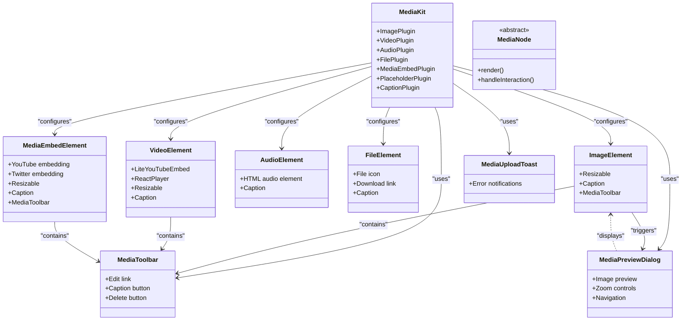
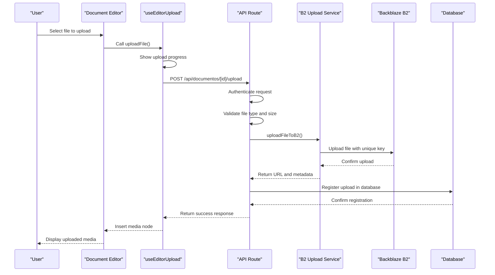
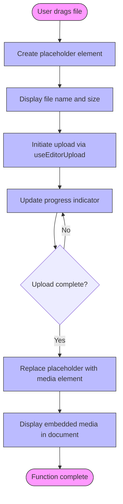
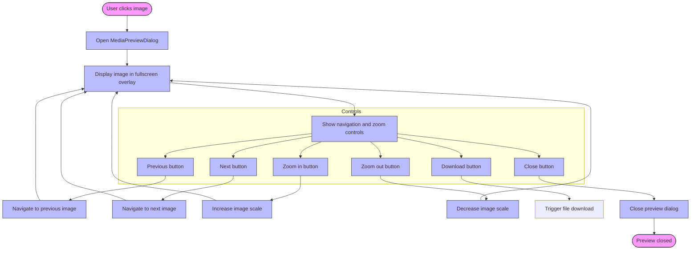
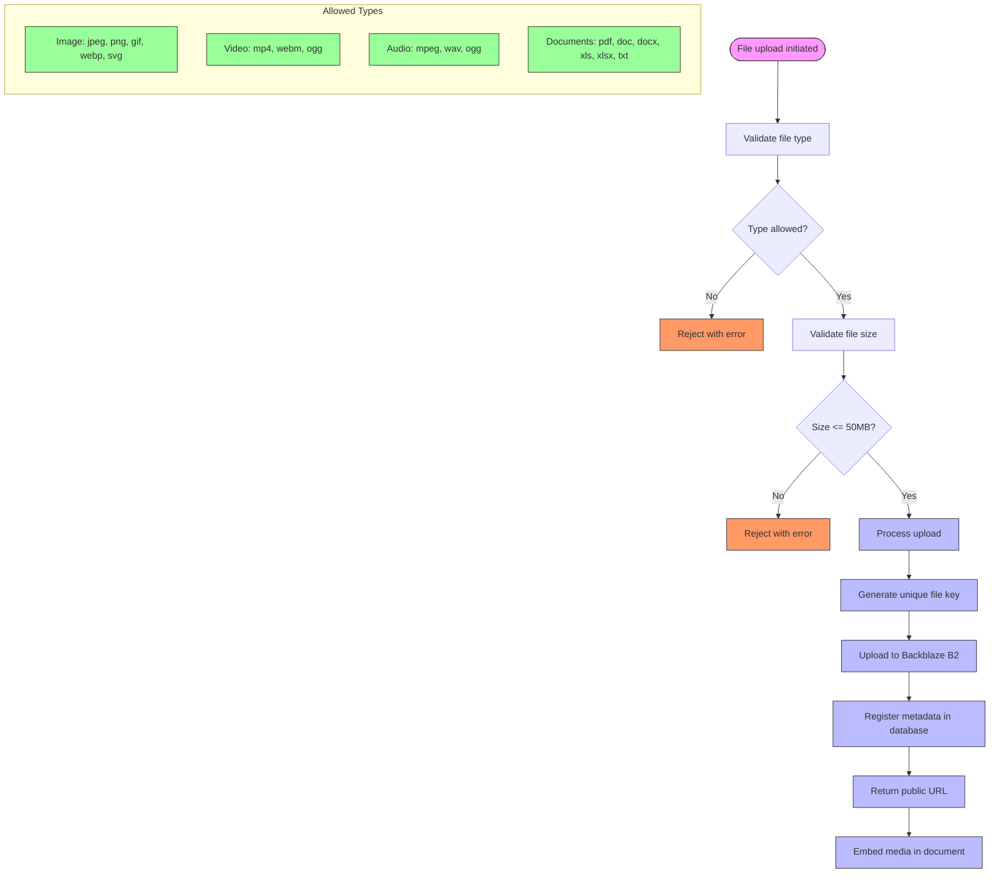
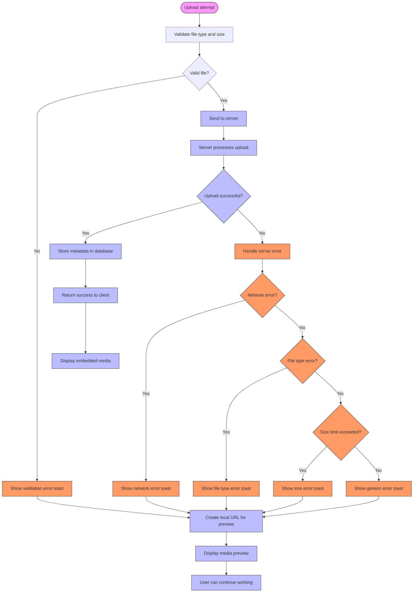

# Media Embedding

<cite>
**Referenced Files in This Document**   
- [media-kit.tsx](file://components/plate/media-kit.tsx)
- [media-base-kit.tsx](file://components/plate/media-base-kit.tsx)
- [media-image-node.tsx](file://components/ui/media-image-node.tsx)
- [media-video-node.tsx](file://components/ui/media-video-node.tsx)
- [media-audio-node.tsx](file://components/ui/media-audio-node.tsx)
- [media-file-node.tsx](file://components/ui/media-file-node.tsx)
- [media-embed-node.tsx](file://components/ui/media-embed-node.tsx)
- [media-toolbar-button.tsx](file://components/ui/media-toolbar-button.tsx)
- [media-toolbar.tsx](file://components/ui/media-toolbar.tsx)
- [media-upload-toast.tsx](file://components/ui/media-upload-toast.tsx)
- [media-preview-dialog.tsx](file://components/ui/media-preview-dialog.tsx)
- [use-editor-upload.tsx](file://hooks/use-editor-upload.tsx)
- [backblaze-b2.service.ts](file://backend/storage/backblaze-b2.service.ts)
- [b2-upload.service.ts](file://backend/documentos/services/upload/b2-upload.service.ts)
- [route.ts](file://app/api/documentos/[id]/upload/route.ts)
</cite>

## Table of Contents
1. [Introduction](#introduction)
2. [Architecture Overview](#architecture-overview)
3. [Core Components](#core-components)
4. [Media Upload Workflow](#media-upload-workflow)
5. [Drag-and-Drop Functionality](#drag-and-drop-functionality)
6. [Media Preview and Display](#media-preview-and-display)
7. [Configuration and Validation](#configuration-and-validation)
8. [Error Handling and Fallbacks](#error-handling-and-fallbacks)
9. [Performance Considerations](#performance-considerations)
10. [Troubleshooting Guide](#troubleshooting-guide)

## Introduction

The Sinesys document editor provides comprehensive media embedding capabilities through its MediaKit extension, enabling users to seamlessly integrate images, videos, audio files, and other document types directly into their documents. The system supports multiple media insertion methods including drag-and-drop, file uploads, and URL embedding for external content. Media files are securely stored in Backblaze B2 cloud storage with proper validation and error handling throughout the upload process. The implementation leverages the Plate editor framework with custom components for rendering and managing media elements within documents, providing a responsive and intuitive user experience for handling various media types.

## Architecture Overview

The media embedding system in Sinesys follows a modular architecture that separates concerns between the frontend editor interface, upload handling, and backend storage services. The system is built on the Plate editor framework, which provides the foundation for rich text editing with extensible plugins for different content types.

```mermaid
graph TB
subgraph "Frontend"
Editor[Document Editor]
MediaKit[MediaKit Extension]
UIComponents[Media UI Components]
UploadHook[useEditorUpload Hook]
end
subgraph "API Layer"
APIRoute[/api/documentos/[id]/upload]
end
subgraph "Backend Services"
B2Service[Backblaze B2 Service]
UploadService[B2 Upload Service]
Persistence[Uploads Persistence]
end
subgraph "Storage"
B2Bucket[Backblaze B2 Bucket]
end
Editor --> MediaKit
MediaKit --> UIComponents
MediaKit --> UploadHook
UploadHook --> APIRoute
APIRoute --> UploadService
UploadService --> B2Service
UploadService --> Persistence
B2Service --> B2Bucket
style Editor fill:#f9f,stroke:#333
style MediaKit fill:#bbf,stroke:#333
style UIComponents fill:#bbf,stroke:#333
style UploadHook fill:#bbf,stroke:#333
style APIRoute fill:#f96,stroke:#333
style B2Service fill:#6f9,stroke:#333
style UploadService fill:#6f9,stroke:#333
style Persistence fill:#6f9,stroke:#333
style B2Bucket fill:#9f9,stroke:#333
```

**Diagram sources**
- [media-kit.tsx](file://components/plate/media-kit.tsx)
- [use-editor-upload.tsx](file://hooks/use-editor-upload.tsx)
- [route.ts](file://app/api/documentos/[id]/upload/route.ts)
- [b2-upload.service.ts](file://backend/documentos/services/upload/b2-upload.service.ts)
- [backblaze-b2.service.ts](file://backend/storage/backblaze-b2.service.ts)

**Section sources**
- [media-kit.tsx](file://components/plate/media-kit.tsx)
- [backblaze-b2.service.ts](file://backend/storage/backblaze-b2.service.ts)

## Core Components

The media embedding functionality is implemented through a collection of specialized components that work together to provide a cohesive user experience. The MediaKit extension serves as the central configuration point, registering various media plugins for different content types. Each media type has dedicated UI components for rendering and interaction, including image, video, audio, file, and embedded content nodes. The system also includes supporting components for media toolbars, upload progress indicators, and preview dialogs.



**Diagram sources**
- [media-kit.tsx](file://components/plate/media-kit.tsx)
- [media-image-node.tsx](file://components/ui/media-image-node.tsx)
- [media-video-node.tsx](file://components/ui/media-video-node.tsx)
- [media-audio-node.tsx](file://components/ui/media-audio-node.tsx)
- [media-file-node.tsx](file://components/ui/media-file-node.tsx)
- [media-embed-node.tsx](file://components/ui/media-embed-node.tsx)
- [media-toolbar.tsx](file://components/ui/media-toolbar.tsx)
- [media-upload-toast.tsx](file://components/ui/media-upload-toast.tsx)
- [media-preview-dialog.tsx](file://components/ui/media-preview-dialog.tsx)

**Section sources**
- [media-kit.tsx](file://components/plate/media-kit.tsx)
- [media-image-node.tsx](file://components/ui/media-image-node.tsx)
- [media-video-node.tsx](file://components/ui/media-video-node.tsx)
- [media-audio-node.tsx](file://components/ui/media-audio-node.tsx)
- [media-file-node.tsx](file://components/ui/media-file-node.tsx)
- [media-embed-node.tsx](file://components/ui/media-embed-node.tsx)

## Media Upload Workflow

The media upload process in Sinesys follows a structured workflow that begins with user interaction in the document editor and concludes with secure storage in Backblaze B2. When a user selects a file to upload, the process initiates through the `useEditorUpload` hook, which handles the file transfer to the backend API endpoint. The API validates the file type and size before forwarding it to the B2 upload service, which generates a unique key and uploads the file to the configured Backblaze B2 bucket. Upon successful upload, the system records metadata in the database and returns the public URL for embedding in the document.



**Diagram sources**
- [use-editor-upload.tsx](file://hooks/use-editor-upload.tsx)
- [route.ts](file://app/api/documentos/[id]/upload/route.ts)
- [b2-upload.service.ts](file://backend/documentos/services/upload/b2-upload.service.ts)
- [backblaze-b2.service.ts](file://backend/storage/backblaze-b2.service.ts)

**Section sources**
- [use-editor-upload.tsx](file://hooks/use-editor-upload.tsx)
- [route.ts](file://app/api/documentos/[id]/upload/route.ts)
- [b2-upload.service.ts](file://backend/documentos/services/upload/b2-upload.service.ts)

## Drag-and-Drop Functionality

The Sinesys document editor implements drag-and-drop functionality through the use of the `useFilePicker` hook and Plate editor's placeholder system. When a user drags a file into the editor, the system creates a placeholder element that provides visual feedback during the upload process. The placeholder displays the file name, size, and upload progress, maintaining context for the user while the file is being transferred to the server. This approach ensures a seamless user experience by providing immediate visual confirmation of the drag operation and continuous feedback throughout the upload process.



**Diagram sources**
- [media-placeholder-node.tsx](file://components/ui/media-placeholder-node.tsx)
- [use-editor-upload.tsx](file://hooks/use-editor-upload.tsx)

**Section sources**
- [media-placeholder-node.tsx](file://components/ui/media-placeholder-node.tsx)

## Media Preview and Display

The media preview system in Sinesys provides users with an enhanced viewing experience for embedded content, particularly for images. When a user clicks on an embedded image, the MediaPreviewDialog component displays the image in a modal overlay with navigation controls, zoom functionality, and download options. The preview system supports keyboard navigation and touch gestures for image browsing, with smooth transitions between images when multiple media files are present. For video and audio content, the system leverages specialized libraries like ReactPlayer and LiteYouTubeEmbed to provide native playback controls and responsive design.



**Diagram sources**
- [media-preview-dialog.tsx](file://components/ui/media-preview-dialog.tsx)
- [media-image-node.tsx](file://components/ui/media-image-node.tsx)

**Section sources**
- [media-preview-dialog.tsx](file://components/ui/media-preview-dialog.tsx)

## Configuration and Validation

The media system in Sinesys includes comprehensive configuration options and validation rules to ensure security and performance. File type restrictions are enforced through a whitelist of allowed MIME types, including common image formats (JPEG, PNG, GIF, WebP), video formats (MP4, WebM, OGG), audio formats (MP3, WAV, OGG), and document types (PDF, DOC, XLS). The system enforces a maximum file size limit of 50MB to prevent excessive storage usage and ensure responsive performance. These validation rules are applied both on the client side for immediate user feedback and on the server side for security.



**Diagram sources**
- [b2-upload.service.ts](file://backend/documentos/services/upload/b2-upload.service.ts)
- [route.ts](file://app/api/documentos/[id]/upload/route.ts)

**Section sources**
- [b2-upload.service.ts](file://backend/documentos/services/upload/b2-upload.service.ts)

## Error Handling and Fallbacks

The media embedding system implements robust error handling with appropriate fallback mechanisms to ensure a reliable user experience. When upload errors occur, the system provides detailed error messages through toast notifications, categorizing issues by type such as invalid file size, invalid file type, or network errors. For cases where direct upload to Backblaze B2 fails, the system implements a fallback mechanism that creates a local URL for preview purposes using `URL.createObjectURL()`, allowing users to continue working with their media even when permanent storage is temporarily unavailable.



**Diagram sources**
- [media-upload-toast.tsx](file://components/ui/media-upload-toast.tsx)
- [use-editor-upload.tsx](file://hooks/use-editor-upload.tsx)
- [b2-upload.service.ts](file://backend/documentos/services/upload/b2-upload.service.ts)

**Section sources**
- [media-upload-toast.tsx](file://components/ui/media-upload-toast.tsx)
- [use-editor-upload.tsx](file://hooks/use-editor-upload.tsx)

## Performance Considerations

The media embedding system in Sinesys incorporates several performance optimizations to ensure responsive document editing even with large media files. The upload process includes progress indicators that provide visual feedback to users, preventing the perception of application freezing during transfers. For image uploads, the system generates preview thumbnails using local object URLs before the upload completes, allowing users to see their content immediately. The backend implements efficient file naming with timestamps and random hashes to prevent collisions while maintaining a clean storage structure. Additionally, the system leverages Backblaze B2's high-performance storage infrastructure for reliable and fast media delivery.

**Section sources**
- [use-editor-upload.tsx](file://hooks/use-editor-upload.tsx)
- [backblaze-b2.service.ts](file://backend/storage/backblaze-b2.service.ts)
- [b2-upload.service.ts](file://backend/documentos/services/upload/b2-upload.service.ts)

## Troubleshooting Guide

When encountering issues with media embedding in Sinesys, users and administrators should follow these troubleshooting steps:

1. **Upload failures**: Verify that the file type is supported and the size is under 50MB. Check network connectivity and ensure the user has proper permissions to edit the document.

2. **Slow upload performance**: Large files may take longer to upload depending on internet connection speed. The system provides progress indicators to show upload status. For very large files, consider compressing them before upload.

3. **Media not displaying**: Ensure the file was successfully uploaded by checking for confirmation messages. If using external URLs, verify that the link is valid and accessible.

4. **Authentication errors**: Confirm that the user is logged in and has the necessary permissions to upload media to the document.

5. **Storage issues**: The system automatically handles file naming conflicts by generating unique keys with timestamps and random hashes. If storage limits are reached, contact system administrators.

For persistent issues, check the browser console for error messages and contact technical support with details of the problem, including file type, size, and any error messages received.

**Section sources**
- [use-editor-upload.tsx](file://hooks/use-editor-upload.tsx)
- [media-upload-toast.tsx](file://components/ui/media-upload-toast.tsx)
- [route.ts](file://app/api/documentos/[id]/upload/route.ts)