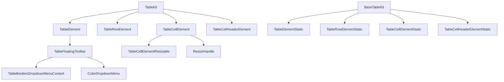
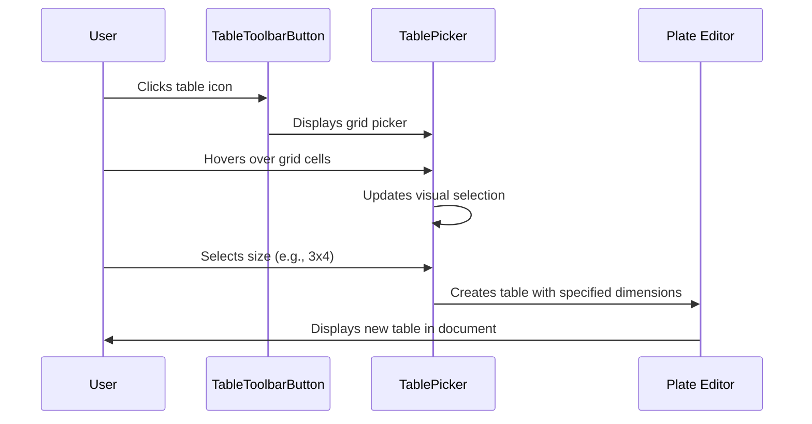
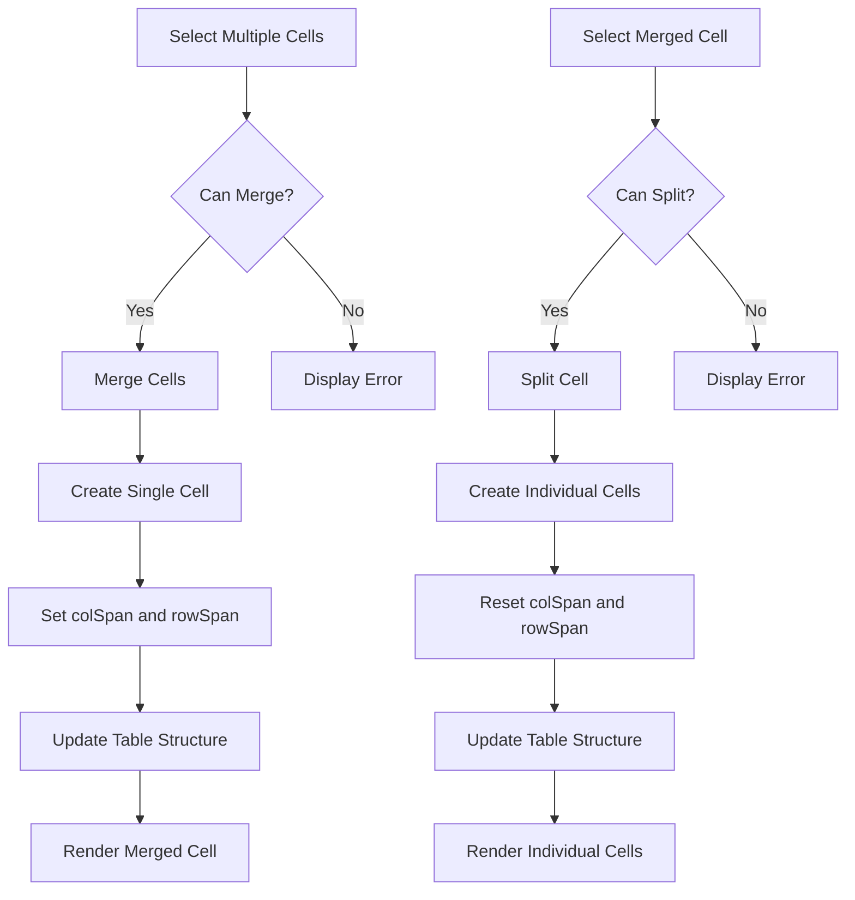
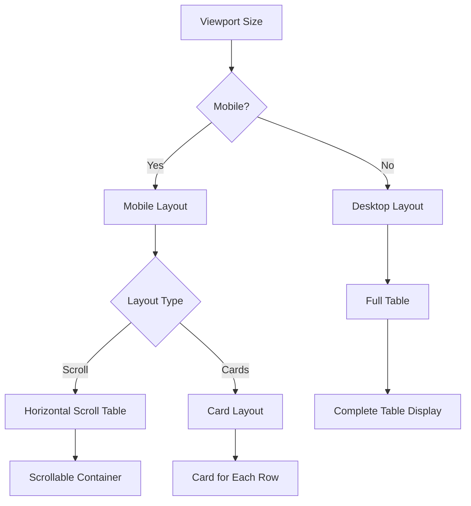
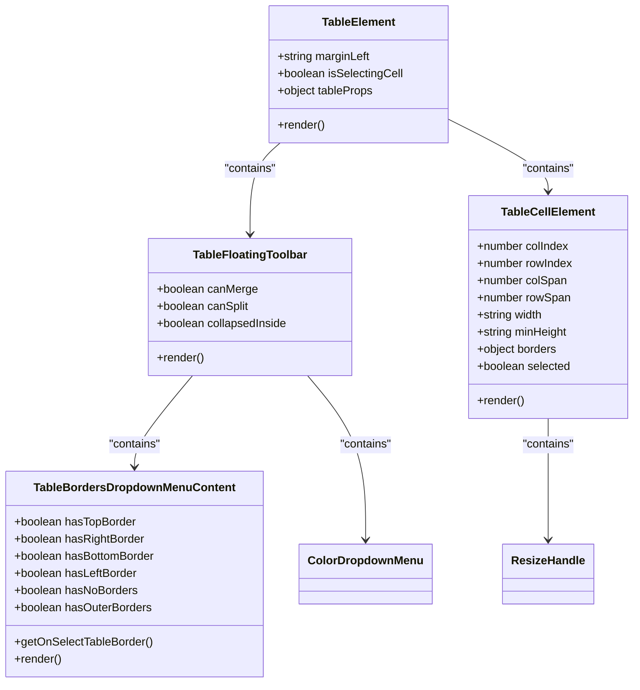
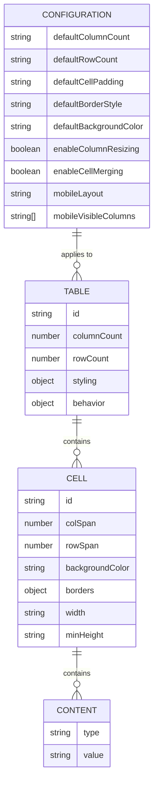
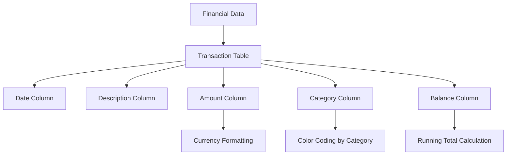

# Tables

<cite>
**Referenced Files in This Document**   
- [table-kit.tsx](file://components/plate/table-kit.tsx)
- [table-base-kit.tsx](file://components/plate/table-base-kit.tsx)
- [table-node.tsx](file://components/ui/table-node.tsx)
- [table-node-static.tsx](file://components/ui/table-node-static.tsx)
- [table-toolbar-button.tsx](file://components/ui/table-toolbar-button.tsx)
- [table-icons.tsx](file://components/ui/table-icons.tsx)
- [responsive-table.tsx](file://components/ui/responsive-table.tsx)
- [table.tsx](file://components/ui/table.tsx)
- [document-editor.tsx](file://components/documentos/document-editor.tsx)
- [parcelas-table.tsx](file://app/(dashboard)/acordos-condenacoes/components/parcelas-table.tsx)
- [comunica-cnj-results-table.tsx](file://app/(dashboard)/comunica-cnj/components/comunica-cnj-results-table.tsx)
- [transacoes-importadas-table.tsx](file://app/(dashboard)/financeiro/conciliacao-bancaria/components/transacoes-importadas-table.tsx)
</cite>

## Table of Contents
1. [Introduction](#introduction)
2. [Table Architecture](#table-architecture)
3. [Table Creation and Editing](#table-creation-and-editing)
4. [Cell Merging and Formatting](#cell-merging-and-formatting)
5. [Responsive Design](#responsive-design)
6. [Table Styling and Design System Integration](#table-styling-and-design-system-integration)
7. [Configuration Options](#configuration-options)
8. [Use Cases](#use-cases)
9. [Common Issues and Solutions](#common-issues-and-solutions)
10. [Conclusion](#conclusion)

## Introduction
The Sinesys document editor provides comprehensive table creation and editing capabilities through the TableKit extension. This documentation details the implementation of rich table functionality, including cell merging, formatting options, and responsive design. The table system is built on a robust architecture that ensures consistent styling with the application's design system while providing users with powerful tools for creating and managing complex tables.

**Section sources**
- [table-kit.tsx](file://components/plate/table-kit.tsx)
- [table-node.tsx](file://components/ui/table-node.tsx)

## Table Architecture
The table system in Sinesys is built using a modular architecture that separates concerns between table creation, rendering, and interaction. The core components are organized into two main kits: `TableKit` and `BaseTableKit`, which provide the foundation for table functionality.

The `TableKit` is responsible for the interactive table components used in the document editor, while the `BaseTableKit` handles static table rendering for read-only contexts. Both kits leverage the PlateJS framework to provide a consistent API for table manipulation.

**Diagram sources **
- [table-kit.tsx](file://components/plate/table-kit.tsx)
- [table-base-kit.tsx](file://components/plate/table-base-kit.tsx)
- [table-node.tsx](file://components/ui/table-node.tsx)

**Section sources**
- [table-kit.tsx](file://components/plate/table-kit.tsx)
- [table-base-kit.tsx](file://components/plate/table-base-kit.tsx)
- [table-node.tsx](file://components/ui/table-node.tsx)
- [table-node-static.tsx](file://components/ui/table-node-static.tsx)

## Table Creation and Editing
The TableKit extension provides a comprehensive set of tools for creating and editing tables within the document editor. Users can create tables through a visual picker interface that allows them to select the desired dimensions by hovering over a grid.

The table creation process is implemented through the `TablePicker` component, which dynamically updates the grid visualization as the user hovers over cells. When a user selects a size, the system creates a table with the specified number of rows and columns.

Table editing functionality includes inserting and deleting rows and columns, with visual controls that appear when a table is selected. The floating toolbar provides quick access to common operations, while the context menu offers additional options.

**Section sources**
- [table-toolbar-button.tsx](file://components/ui/table-toolbar-button.tsx)
- [table-node.tsx](file://components/ui/table-node.tsx)

## Cell Merging and Formatting
The table system supports advanced cell operations including merging and splitting cells, which are essential for creating complex table layouts. These operations are exposed through both the floating toolbar and context menu when cells are selected.

Cell merging is implemented through the `mergeState` hook, which determines whether cells can be merged based on the current selection. When cells are merged, the system creates a single cell with appropriate `colSpan` and `rowSpan` attributes to maintain the table structure.

Formatting options include background color, borders, and alignment. The color picker allows users to apply background colors to selected cells, while the border controls provide options for setting individual borders or applying predefined border styles.

**Section sources**
- [table-node.tsx](file://components/ui/table-node.tsx)
- [table-toolbar-button.tsx](file://components/ui/table-toolbar-button.tsx)

## Responsive Design
The table system includes robust responsive design capabilities to ensure tables are usable across different screen sizes. The `ResponsiveTable` component adapts table presentation based on the viewport size, switching between different layouts for mobile and desktop devices.

For mobile devices, the system offers two layout options: horizontal scrolling and card-based layout. The horizontal scrolling layout maintains the traditional table structure but allows users to scroll horizontally to view all columns. The card-based layout transforms each row into a card with key-value pairs, making it easier to read on small screens.

The responsive behavior is controlled by the `useViewport` hook, which detects screen size changes and triggers appropriate layout adjustments. Column priority can be configured to determine which columns are displayed first on smaller screens.

**Section sources**
- [responsive-table.tsx](file://components/ui/responsive-table.tsx)

## Table Styling and Design System Integration
Table styling is tightly integrated with the application's design system to ensure visual consistency across the platform. The styling system uses CSS variables and utility classes to apply consistent colors, spacing, and typography.

The table components leverage the application's theme system, automatically adapting to light and dark modes. Background colors, borders, and text colors are defined using semantic variables that map to the design system's color palette.

**Diagram sources **
- [table-node.tsx](file://components/ui/table-node.tsx)

**Section sources**
- [table-node.tsx](file://components/ui/table-node.tsx)
- [table-node-static.tsx](file://components/ui/table-node-static.tsx)

## Configuration Options
The table system provides several configuration options to customize behavior and appearance. These options can be set at both the application level and individual table level.

Default configuration options include:
- Default column count for new tables
- Default row count for new tables
- Default cell padding and spacing
- Default border styles
- Default background colors
- Column resizing behavior
- Cell merging behavior

**Diagram sources **
- [table-node.tsx](file://components/ui/table-node.tsx)
- [table-toolbar-button.tsx](file://components/ui/table-toolbar-button.tsx)

**Section sources**
- [table-node.tsx](file://components/ui/table-node.tsx)
- [table-toolbar-button.tsx](file://components/ui/table-toolbar-button.tsx)

## Use Cases
The table functionality in Sinesys supports a variety of use cases across different domains. The implementation is designed to be flexible enough to handle legal, financial, and process documentation needs.

### Legal Case Summaries
For legal case summaries, tables are used to organize key information such as parties involved, case status, deadlines, and court appearances. The ability to merge cells is particularly useful for creating headers that span multiple columns.

### Financial Data Presentation
In financial contexts, tables are used to present data such as budgets, expense reports, and transaction histories. The formatting options allow for currency formatting, percentage calculations, and conditional styling based on values.

### Process Timelines
Process timelines use tables to display chronological sequences of events with associated dates, responsible parties, and status indicators. The responsive design ensures these timelines remain readable on all devices.

**Section sources**
- [parcelas-table.tsx](file://app/(dashboard)/acordos-condenacoes/components/parcelas-table.tsx)
- [comunica-cnj-results-table.tsx](file://app/(dashboard)/comunica-cnj/components/comunica-cnj-results-table.tsx)
- [transacoes-importadas-table.tsx](file://app/(dashboard)/financeiro/conciliacao-bancaria/components/transacoes-importadas-table.tsx)

## Common Issues and Solutions
The table system addresses several common issues that arise in document editing applications.

### Table Rendering on Different Screen Sizes
The responsive table component automatically adapts to different screen sizes, ensuring content remains accessible. For very wide tables, horizontal scrolling with visual indicators helps users understand the available content.

### Copy-Paste Behavior with External Applications
The system handles copy-paste operations with external applications by normalizing table data. When pasting from external sources, the system converts HTML tables to the internal table format, preserving structure while adapting styling to match the application's design system.

### Accessibility Compliance
The table implementation follows WCAG guidelines for accessibility:
- Proper table headers with scope attributes
- Keyboard navigation support
- Screen reader-friendly markup
- Sufficient color contrast
- Alternative text for complex tables

Keyboard navigation is fully supported, allowing users to navigate between cells using arrow keys, enter edit mode with Enter, and perform table operations using keyboard shortcuts.

**Section sources**
- [responsive-table.tsx](file://components/ui/responsive-table.tsx)
- [table-node.tsx](file://components/ui/table-node.tsx)
- [document-editor.tsx](file://components/documentos/document-editor.tsx)

## Conclusion
The table creation and editing capabilities in the Sinesys document editor provide a comprehensive solution for managing tabular data. Through the TableKit extension, users can create rich tables with advanced features like cell merging, formatting options, and responsive design. The architecture ensures consistent styling with the application's design system while providing flexibility for various use cases including legal case summaries, financial data presentation, and process timelines. Configuration options allow customization of table behavior, and the system addresses common issues such as responsive rendering, copy-paste interoperability, and accessibility compliance.