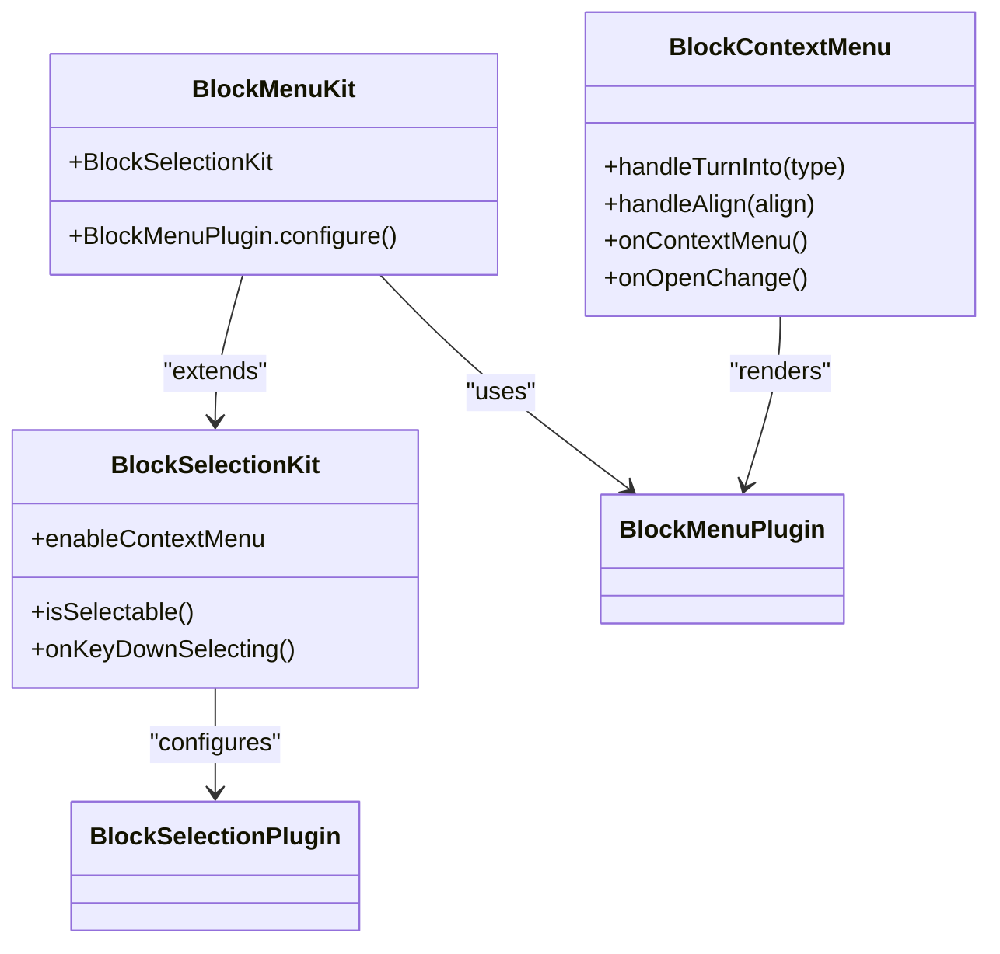
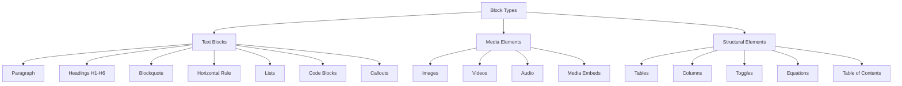
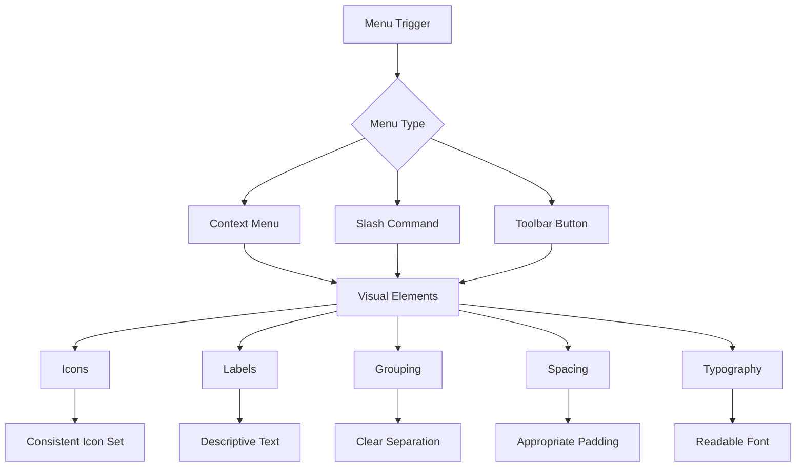
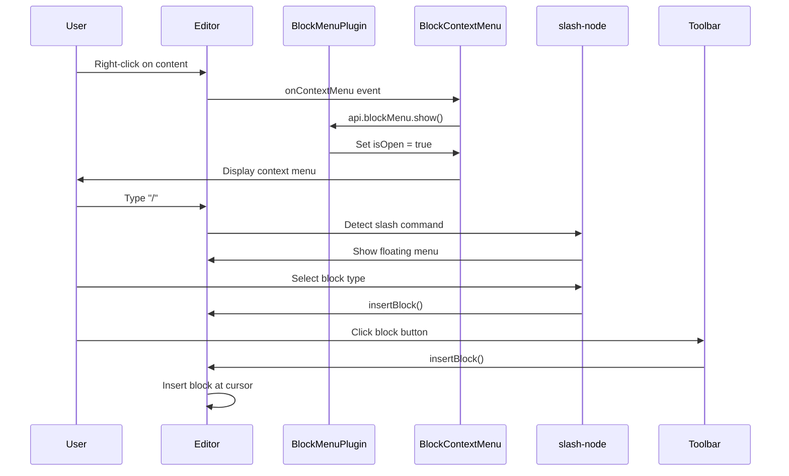
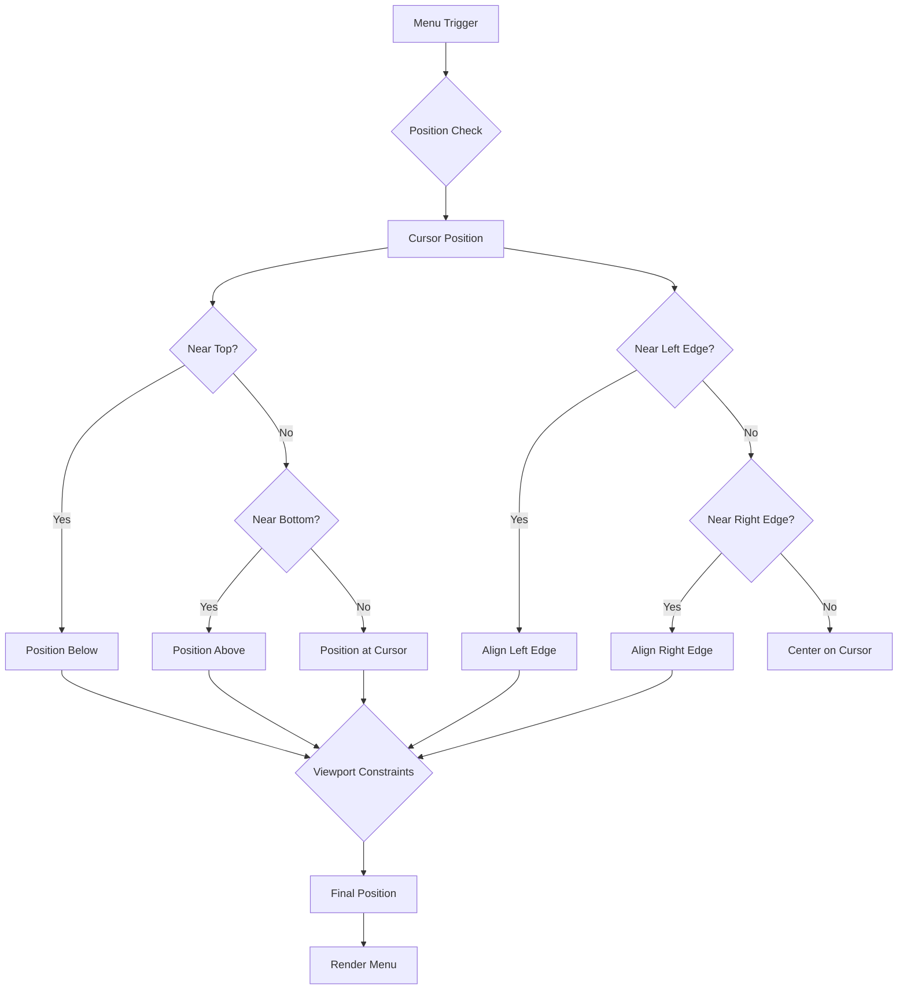
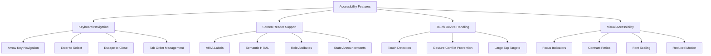

# Block Menu

<cite>
**Referenced Files in This Document**   
- [block-menu-kit.tsx](file://components/plate/block-menu-kit.tsx)
- [block-context-menu.tsx](file://components/ui/block-context-menu.tsx)
- [basic-blocks-kit.tsx](file://components/plate/basic-blocks-kit.tsx)
- [basic-nodes-kit.tsx](file://components/plate/basic-nodes-kit.tsx)
- [plate-types.ts](file://components/plate/plate-types.ts)
- [insert-toolbar-button.tsx](file://components/ui/insert-toolbar-button.tsx)
- [turn-into-toolbar-button.tsx](file://components/ui/turn-into-toolbar-button.tsx)
- [slash-node.tsx](file://components/ui/slash-node.tsx)
- [paragraph-node.tsx](file://components/ui/paragraph-node.tsx)
- [blockquote-node.tsx](file://components/ui/blockquote-node.tsx)
- [media-image-node.tsx](file://components/ui/media-image-node.tsx)
- [media-video-node.tsx](file://components/ui/media-video-node.tsx)
- [media-audio-node.tsx](file://components/ui/media-audio-node.tsx)
- [list-kit.tsx](file://components/plate/list-kit.tsx)
- [block-selection-kit.tsx](file://components/plate/block-selection-kit.tsx)
</cite>

## Table of Contents
1. [Introduction](#introduction)
2. [Block Menu Implementation](#block-menu-implementation)
3. [Available Block Types](#available-block-types)
4. [Visual Design and User Interface](#visual-design-and-user-interface)
5. [Menu Trigger Mechanisms](#menu-trigger-mechanisms)
6. [Integration with Plate Editor Framework](#integration-with-plate-editor-framework)
7. [Menu Positioning and Layout Considerations](#menu-positioning-and-layout-considerations)
8. [Accessibility Features](#accessibility-features)
9. [Conclusion](#conclusion)

## Introduction

The BlockMenuKit component in the Sinesys document editor provides a comprehensive interface for inserting and managing various content blocks within the document. This system enables users to easily add different types of content through a visual menu interface, enhancing the editing experience by providing intuitive access to formatting options and content types. The implementation leverages the Plate editor framework, a powerful rich text editor built on Slate.js, to provide a flexible and extensible content editing experience.

The block menu system supports a wide range of content types including text blocks, media elements, and structured content, allowing users to create rich, formatted documents with ease. The menu is designed to be accessible through multiple interaction patterns, including context menus and keyboard shortcuts, ensuring a seamless user experience across different input methods.

**Section sources**
- [block-menu-kit.tsx](file://components/plate/block-menu-kit.tsx)
- [block-context-menu.tsx](file://components/ui/block-context-menu.tsx)

## Block Menu Implementation

The BlockMenuKit is implemented as a configuration for the Plate editor framework, specifically using the BlockMenuPlugin from '@platejs/selection/react'. The implementation follows a modular approach, combining the BlockMenuPlugin with the BlockSelectionKit to provide a comprehensive block management system. The BlockMenuKit exports a configuration array that integrates these components, enabling both block selection and context menu functionality.

The core implementation in block-menu-kit.tsx imports the necessary components and configures the BlockMenuPlugin to render the BlockContextMenu component above the editable area. This configuration ensures that the context menu appears in the appropriate position relative to the selected content. The BlockMenuKit extends the functionality provided by BlockSelectionKit, which handles the visual selection of blocks and provides additional interaction capabilities.

The BlockContextMenu component implements a React context menu that appears when users right-click on content or use alternative activation methods. It uses the useEditorPlugin hook to access the editor API and manage the menu state. The component includes functionality for various actions such as deleting blocks, duplicating content, and transforming blocks into different types. The menu is conditionally rendered based on the isOpen state, which is controlled by the BlockMenuPlugin's openId option.



**Diagram sources**
- [block-menu-kit.tsx](file://components/plate/block-menu-kit.tsx#L9-L14)
- [block-context-menu.tsx](file://components/ui/block-context-menu.tsx#L28-L203)
- [block-selection-kit.tsx](file://components/plate/block-selection-kit.tsx#L9-L32)

**Section sources**
- [block-menu-kit.tsx](file://components/plate/block-menu-kit.tsx#L1-L14)
- [block-context-menu.tsx](file://components/ui/block-context-menu.tsx#L1-L203)
- [block-selection-kit.tsx](file://components/plate/block-selection-kit.tsx#L1-L33)

## Available Block Types

The Sinesys document editor supports a comprehensive set of block types that can be inserted and managed through the block menu system. These block types are defined and configured through the BasicBlocksKit and related components, providing a consistent interface for creating and formatting different content elements.

The primary text-based block types include:
- **Paragraph**: The default text block for regular content
- **Headings**: Six levels of headings (H1-H6) for document structure
- **Blockquote**: For quoted or cited content with distinctive styling
- **Horizontal Rule**: A divider line to separate content sections
- **Lists**: Ordered, unordered, and to-do lists for structured content
- **Code Blocks**: For displaying code snippets with syntax highlighting
- **Callouts**: Highlighted blocks for notes, warnings, or important information

Media elements include:
- **Images**: For inserting and formatting image content
- **Videos**: Support for embedded videos from various sources
- **Audio**: Audio file embedding with playback controls
- **Media Embeds**: Embedded content from external platforms

Structural elements include:
- **Tables**: For organizing data in rows and columns
- **Columns**: Multi-column layouts for content organization
- **Toggles**: Collapsible sections for hiding/showing content
- **Equations**: Mathematical expressions and formulas
- **Table of Contents**: Automatically generated document navigation

The block types are implemented as React components that extend the PlateElement base component, allowing for consistent rendering and behavior across the editor. Each block type has specific configuration options for shortcuts, formatting rules, and rendering properties.



**Diagram sources**
- [basic-blocks-kit.tsx](file://components/plate/basic-blocks-kit.tsx#L3-L88)
- [plate-types.ts](file://components/plate/plate-types.ts#L73-L163)
- [insert-toolbar-button.tsx](file://components/ui/insert-toolbar-button.tsx#L59-L128)

**Section sources**
- [basic-blocks-kit.tsx](file://components/plate/basic-blocks-kit.tsx#L1-L89)
- [plate-types.ts](file://components/plate/plate-types.ts#L73-L163)
- [insert-toolbar-button.tsx](file://components/ui/insert-toolbar-button.tsx#L59-L128)

## Visual Design and User Interface

The block menu system in Sinesys features a clean, intuitive visual design that prioritizes usability and discoverability. The context menu interface uses a hierarchical structure with clear visual separation between different action groups, making it easy for users to find the functionality they need. The menu employs consistent iconography and labeling to ensure that users can quickly understand the purpose of each option.

The BlockContextMenu component implements a multi-level menu structure with primary action groups including "Turn into" and "Align" submenus. Each menu item includes an icon and descriptive label, providing visual cues that enhance recognition and reduce cognitive load. The menu uses a dark-themed design with appropriate spacing and typography to ensure readability and visual hierarchy.

For block insertion, the system provides visual previews through the slash command interface (/) and toolbar buttons. When users type the slash command, a floating menu appears with icons and labels for each available block type, allowing users to browse options before making a selection. The toolbar implementation follows a similar pattern, grouping related block types together with consistent iconography.

The visual design of individual blocks follows a cohesive style system:
- **Paragraphs**: Clean typography with appropriate line height and spacing
- **Headings**: Distinctive sizing and weight to establish document hierarchy
- **Blockquotes**: Left border accent with italicized text for visual distinction
- **Code Blocks**: Monospace font with syntax highlighting and background fill
- **Media Elements**: Responsive containers with caption support and hover effects
- **Lists**: Proper indentation and bullet/number styling for readability

The design system ensures that blocks are visually distinct while maintaining a consistent overall aesthetic, helping users understand the document structure at a glance.



**Diagram sources**
- [block-context-menu.tsx](file://components/ui/block-context-menu.tsx#L67-L203)
- [slash-node.tsx](file://components/ui/slash-node.tsx#L115-L173)
- [insert-toolbar-button.tsx](file://components/ui/insert-toolbar-button.tsx#L59-L128)
- [turn-into-toolbar-button.tsx](file://components/ui/turn-into-toolbar-button.tsx#L42-L126)

**Section sources**
- [block-context-menu.tsx](file://components/ui/block-context-menu.tsx#L1-L203)
- [slash-node.tsx](file://components/ui/slash-node.tsx#L1-L173)
- [insert-toolbar-button.tsx](file://components/ui/insert-toolbar-button.tsx#L1-L128)

## Menu Trigger Mechanisms

The block menu system in Sinesys can be activated through multiple mechanisms, providing flexibility for different user preferences and interaction patterns. The primary trigger methods include context menu activation, keyboard shortcuts, and dedicated toolbar buttons, ensuring that users can access block insertion functionality regardless of their preferred input method.

The context menu is triggered by right-clicking on content within the editor. The BlockContextMenu component listens for the onContextMenu event and prevents the default browser context menu from appearing. Instead, it shows the custom block menu at the cursor position, providing immediate access to block manipulation options. The menu activation is controlled by the BlockMenuPlugin API, which manages the visibility state and positioning.

The slash command (/) provides an alternative method for inserting blocks. When users type the forward slash character, a floating menu appears suggesting available block types. This predictive interface allows users to browse options and select a block type by typing keywords or using arrow keys to navigate. The slash command implementation uses fuzzy matching to suggest relevant block types based on partial input, enhancing discoverability.

Keyboard shortcuts provide quick access to frequently used block types:
- **Mod+Alt+1-6**: Toggle heading levels 1-6
- **Mod+Shift+.**: Toggle blockquote
- **Mod+J**: Show AI chat interface
- **Arrow keys**: Navigate menu options
- **Enter**: Select highlighted option
- **Escape**: Close menu

Toolbar buttons offer a persistent interface for block insertion, with icons representing different block types grouped by category. Clicking a toolbar button immediately inserts the corresponding block at the current cursor position. The toolbar implementation uses the insertBlock utility function to handle the insertion logic consistently across different trigger methods.



**Diagram sources**
- [block-context-menu.tsx](file://components/ui/block-context-menu.tsx#L78-L93)
- [slash-node.tsx](file://components/ui/slash-node.tsx#L1-L173)
- [basic-blocks-kit.tsx](file://components/plate/basic-blocks-kit.tsx#L36-L82)
- [insert-toolbar-button.tsx](file://components/ui/insert-toolbar-button.tsx#L1-L128)

**Section sources**
- [block-context-menu.tsx](file://components/ui/block-context-menu.tsx#L1-L203)
- [slash-node.tsx](file://components/ui/slash-node.tsx#L1-L173)
- [basic-blocks-kit.tsx](file://components/plate/basic-blocks-kit.tsx#L1-L89)

## Integration with Plate Editor Framework

The BlockMenuKit is tightly integrated with the Plate editor framework, leveraging its plugin architecture to provide seamless block management functionality. The implementation follows Plate's compositional design pattern, where functionality is organized into reusable kits that can be combined to create a complete editor configuration.

The integration occurs at multiple levels:
- **Plugin Configuration**: The BlockMenuKit configures the BlockMenuPlugin with custom rendering and behavior
- **State Management**: The component uses Plate's usePlateState and useEditorPlugin hooks to access editor state and APIs
- **Transform Operations**: The menu actions use Plate's transform functions to modify the document structure
- **Event Handling**: The component integrates with Plate's event system for keyboard and mouse interactions

The BlockMenuKit combines with other kits such as BasicBlocksKit, ListKit, and MediaKit to provide a comprehensive editing experience. This modular approach allows for flexible configuration and easy extension of functionality. The kits are designed to be composable, with each kit focusing on a specific aspect of editor functionality.

The integration with the Plate framework enables several key features:
- **Consistent API**: Uniform access to editor functionality through Plate's plugin system
- **State Synchronization**: Automatic synchronization between the menu state and editor state
- **Transform Safety**: Safe document modifications through Plate's transform system
- **Plugin Interoperability**: Seamless interaction between different editor plugins
- **Extensibility**: Easy addition of new block types and menu options

The editor integration also handles cursor positioning and focus management, ensuring that blocks are inserted at the correct location and that the editor maintains proper focus after insertion. The system uses Plate's selection API to determine the current cursor position and applies transforms relative to that position.

```mermaid
graph TB
subgraph "Plate Editor Framework"
A[Editor Core]
B[Plugin System]
C[State Management]
D[Transform System]
E[Rendering Engine]
end
subgraph "Block Menu Components"
F[BlockMenuKit]
G[BlockContextMenu]
H[BlockSelectionKit]
end
F --> B : "Plugin Configuration"
G --> C : "State Access"
G --> D : "Transform Operations"
H --> B : "Plugin Extension"
F --> E : "Custom Rendering"
A --> F : "Editor Instance"
B --> G : "API Access"
C --> G : "usePlateState"
D --> G : "Transform Functions"
```

**Diagram sources**
- [block-menu-kit.tsx](file://components/plate/block-menu-kit.tsx#L1-L14)
- [block-context-menu.tsx](file://components/ui/block-context-menu.tsx#L29-L31)
- [block-selection-kit.tsx](file://components/plate/block-selection-kit.tsx#L10-L32)
- [basic-nodes-kit.tsx](file://components/plate/basic-nodes-kit.tsx#L3-L6)

**Section sources**
- [block-menu-kit.tsx](file://components/plate/block-menu-kit.tsx#L1-L14)
- [block-context-menu.tsx](file://components/ui/block-context-menu.tsx#L1-L203)
- [block-selection-kit.tsx](file://components/plate/block-selection-kit.tsx#L1-L33)
- [basic-nodes-kit.tsx](file://components/plate/basic-nodes-kit.tsx#L1-L6)

## Menu Positioning and Layout Considerations

The block menu system in Sinesys addresses various positioning and layout challenges to ensure optimal user experience across different scenarios. The implementation includes sophisticated logic for handling constrained spaces, viewport boundaries, and dynamic content layouts.

The context menu positioning is managed by the BlockMenuPlugin, which calculates the optimal position based on the cursor coordinates and available screen space. When users right-click on content, the menu appears at the exact cursor position, but if this would cause the menu to extend beyond the viewport boundaries, it automatically repositions to remain fully visible. The system considers both horizontal and vertical constraints, adjusting the menu position as needed.

For the slash command menu and toolbar-based insertion, the system uses a floating UI component that appears near the current cursor position. This floating menu is designed to avoid overlapping with existing content and adapts its position based on the available space in the editor. The menu can appear above or below the cursor line depending on which direction provides more space.

The implementation includes special handling for edge cases:
- **Near Top/Bottom of Viewport**: The menu flips direction to remain visible
- **Near Editor Boundaries**: The menu aligns to the nearest edge
- **Within Nested Blocks**: The menu accounts for container constraints
- **On Small Screens**: The menu adapts to limited horizontal space
- **With Scrolling Content**: The menu maintains position during scroll

The system also handles dynamic content changes, such as when blocks are inserted or removed, by recalculating menu positions as needed. This ensures that the menu remains properly positioned even when the document structure changes during editing.



**Diagram sources**
- [block-context-menu.tsx](file://components/ui/block-context-menu.tsx#L88-L91)
- [slash-node.tsx](file://components/ui/slash-node.tsx#L1-L173)
- [block-menu-kit.tsx](file://components/plate/block-menu-kit.tsx#L1-L14)

**Section sources**
- [block-context-menu.tsx](file://components/ui/block-context-menu.tsx#L1-L203)
- [slash-node.tsx](file://components/ui/slash-node.tsx#L1-L173)

## Accessibility Features

The block menu system in Sinesys incorporates comprehensive accessibility features to ensure that all users can effectively interact with the editor regardless of their input method or assistive technology requirements. The implementation follows WCAG guidelines and leverages ARIA attributes to provide a fully accessible editing experience.

Keyboard navigation is fully supported, allowing users to access all menu functionality without requiring a mouse. Users can navigate through menu options using arrow keys, select items with Enter, and close menus with Escape. The tab order is carefully managed to ensure logical navigation through the interface, and focus states are clearly visible to indicate the currently selected element.

For touch device users, the system includes specific handling to prevent conflicts with native touch gestures. The useIsTouchDevice hook detects touch-enabled devices and adjusts the interaction model accordingly, ensuring that the context menu does not interfere with standard touch interactions.

The implementation includes several accessibility-specific features:
- **ARIA Labels**: Descriptive labels for all interactive elements
- **Focus Management**: Proper focus handling during menu operations
- **Keyboard Shortcuts**: Accessible keyboard navigation and actions
- **Screen Reader Support**: Semantic HTML and ARIA attributes
- **High Contrast Mode**: Support for system accessibility settings
- **Reduced Motion**: Respects user preferences for animations

The menu items include appropriate ARIA roles and properties to convey their purpose and state to assistive technologies. For example, menu items use the menuitem role, submenus use menuitem submenu, and the overall menu container uses the menu role. This semantic structure helps screen readers accurately describe the interface to users.



**Diagram sources**
- [block-context-menu.tsx](file://components/ui/block-context-menu.tsx#L31-L32)
- [block-context-menu.tsx](file://components/ui/block-context-menu.tsx#L67-L203)
- [context-menu.tsx](file://components/ui/context-menu.tsx#L114-L205)

**Section sources**
- [block-context-menu.tsx](file://components/ui/block-context-menu.tsx#L1-L203)
- [context-menu.tsx](file://components/ui/context-menu.tsx#L1-L205)

## Conclusion

The BlockMenuKit in the Sinesys document editor provides a robust and user-friendly interface for inserting and managing content blocks. By leveraging the Plate editor framework, the implementation offers a flexible, extensible system that supports a wide range of content types and interaction patterns. The menu system enhances the editing experience by providing intuitive access to formatting options through multiple activation methods, including context menus, keyboard shortcuts, and toolbar buttons.

The design prioritizes usability and accessibility, with careful attention to visual hierarchy, keyboard navigation, and responsive behavior. The integration with the Plate framework ensures consistent behavior and reliable document manipulation, while the modular architecture allows for easy extension and customization. The system effectively addresses common challenges such as menu positioning in constrained spaces and accessibility requirements, providing a comprehensive solution for content creation.

Future enhancements could include additional block types, improved predictive suggestions for the slash command, and enhanced customization options for the menu appearance and behavior. The current implementation establishes a solid foundation for a powerful document editing experience that balances functionality with ease of use.