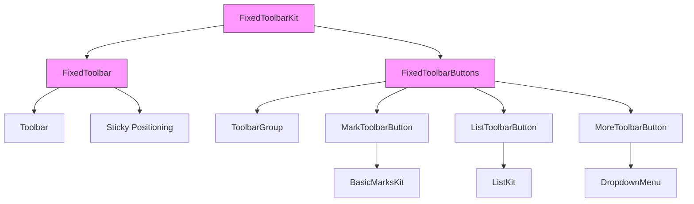
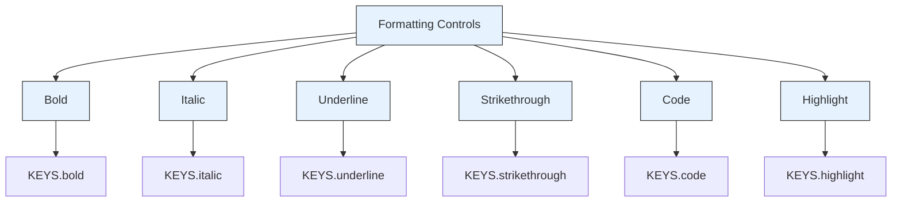
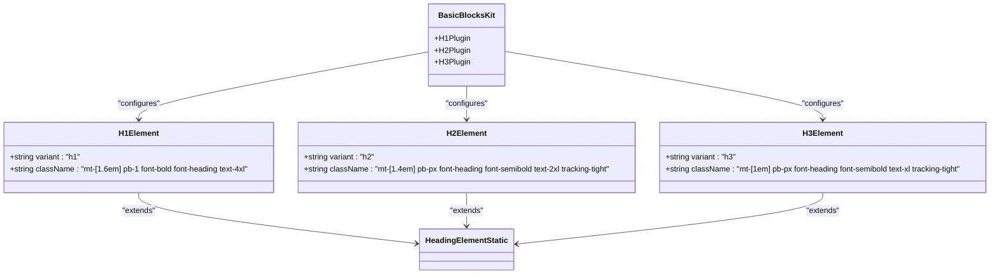
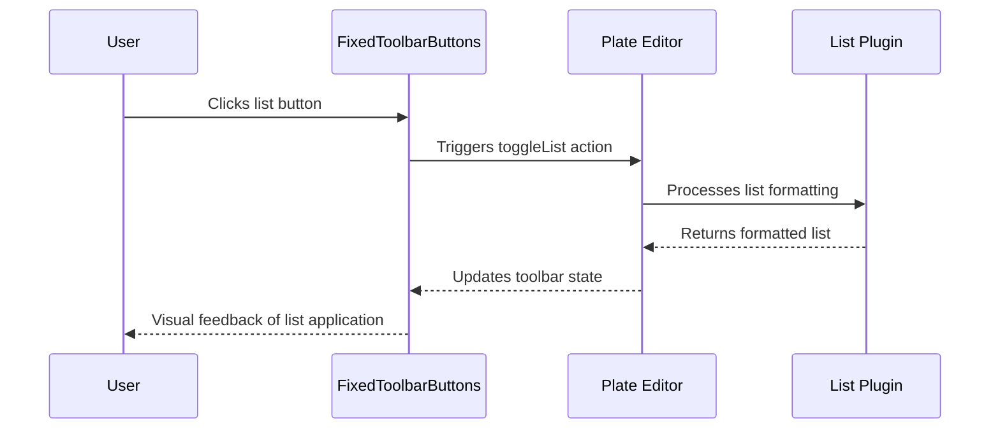
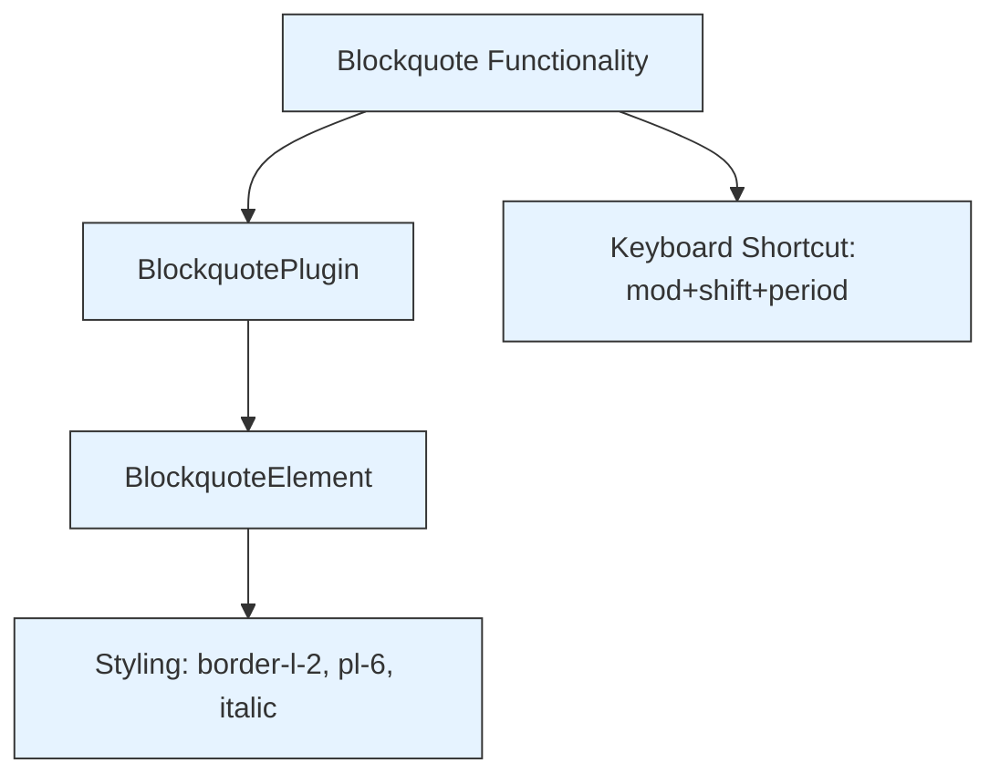
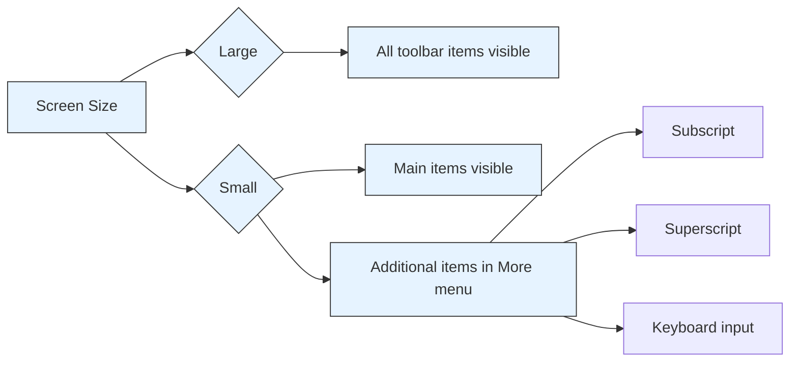
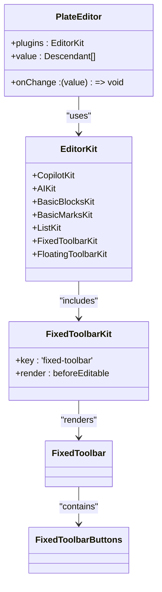

# Fixed Toolbar

<cite>
**Referenced Files in This Document**   
- [fixed-toolbar-kit.tsx](file://components/plate/fixed-toolbar-kit.tsx)
- [fixed-toolbar.tsx](file://components/ui/fixed-toolbar.tsx)
- [fixed-toolbar-buttons.tsx](file://components/ui/fixed-toolbar-buttons.tsx)
- [toolbar.tsx](file://components/ui/toolbar.tsx)
- [basic-marks-kit.tsx](file://components/plate/basic-marks-kit.tsx)
- [basic-blocks-kit.tsx](file://components/plate/basic-blocks-kit.tsx)
- [list-toolbar-button.tsx](file://components/ui/list-toolbar-button.tsx)
- [mark-toolbar-button.tsx](file://components/ui/mark-toolbar-button.tsx)
- [more-toolbar-button.tsx](file://components/ui/more-toolbar-button.tsx)
- [editor-kit.tsx](file://components/plate/editor-kit.tsx)
- [plate-editor.tsx](file://components/plate/plate-editor.tsx)
</cite>

## Table of Contents
1. [Introduction](#introduction)
2. [Architecture Overview](#architecture-overview)
3. [Core Components](#core-components)
4. [Formatting Controls](#formatting-controls)
5. [Heading Level Selectors](#heading-level-selectors)
6. [List Formatting Options](#list-formatting-options)
7. [Blockquote Functionality](#blockquote-functionality)
8. [Responsive Behavior](#responsive-behavior)
9. [Integration with Plate Editor](#integration-with-plate-editor)
10. [Common Issues and Performance Considerations](#common-issues-and-performance-considerations)

## Introduction
The FixedToolbarKit component in the Sinesys document editor provides persistent access to formatting tools at the top of the editor interface. This documentation details the implementation of the fixed toolbar, its integration with the Plate editor framework, and its responsive behavior across different screen sizes. The toolbar maintains its position during scrolling and offers comprehensive formatting options for document creation and editing.

## Architecture Overview
The fixed toolbar system is implemented as a modular component within the Plate editor framework, consisting of several interconnected components that work together to provide a seamless user experience.



**Diagram sources**
- [fixed-toolbar-kit.tsx](file://components/plate/fixed-toolbar-kit.tsx#L8-L19)
- [fixed-toolbar.tsx](file://components/ui/fixed-toolbar.tsx#L7-L17)
- [fixed-toolbar-buttons.tsx](file://components/ui/fixed-toolbar-buttons.tsx#L50-L170)

**Section sources**
- [fixed-toolbar-kit.tsx](file://components/plate/fixed-toolbar-kit.tsx#L1-L20)
- [fixed-toolbar.tsx](file://components/ui/fixed-toolbar.tsx#L1-L18)
- [fixed-toolbar-buttons.tsx](file://components/ui/fixed-toolbar-buttons.tsx#L1-L170)

## Core Components
The fixed toolbar system consists of three primary components that work together to provide the toolbar functionality. The FixedToolbarKit serves as the plugin that integrates the toolbar with the Plate editor, rendering the FixedToolbar component before the editable area. The FixedToolbar component provides the sticky positioning and styling, while the FixedToolbarButtons component contains all the individual toolbar buttons and their functionality.

The implementation follows a modular design pattern, with each component having a specific responsibility. The FixedToolbarKit uses the createPlatePlugin function to register the toolbar as a plugin in the Plate editor system, ensuring it's rendered in the correct location within the editor interface.

**Section sources**
- [fixed-toolbar-kit.tsx](file://components/plate/fixed-toolbar-kit.tsx#L1-L20)
- [fixed-toolbar.tsx](file://components/ui/fixed-toolbar.tsx#L1-L18)
- [fixed-toolbar-buttons.tsx](file://components/ui/fixed-toolbar-buttons.tsx#L1-L170)

## Formatting Controls
The fixed toolbar provides comprehensive formatting controls for text styling, including bold, italic, underline, strikethrough, code, and highlight. These controls are implemented using the MarkToolbarButton component, which is configured with specific node types from the KEYS constant.



**Diagram sources**
- [fixed-toolbar-buttons.tsx](file://components/ui/fixed-toolbar-buttons.tsx#L83-L159)
- [basic-marks-kit.tsx](file://components/plate/basic-marks-kit.tsx#L3-L13)

**Section sources**
- [fixed-toolbar-buttons.tsx](file://components/ui/fixed-toolbar-buttons.tsx#L83-L159)
- [mark-toolbar-button.tsx](file://components/ui/mark-toolbar-button.tsx#L1-L22)
- [basic-marks-kit.tsx](file://components/plate/basic-marks-kit.tsx#L1-L42)

## Heading Level Selectors
The fixed toolbar includes heading level selectors for H1, H2, and H3 headings, which are integrated with the document structure to provide consistent formatting. These selectors are part of the BasicBlocksKit and are implemented using the HeadingElement components.



**Diagram sources**
- [basic-blocks-kit.tsx](file://components/plate/basic-blocks-kit.tsx#L27-L55)
- [heading-node-static.tsx](file://components/ui/heading-node-static.tsx#L1-L68)

**Section sources**
- [basic-blocks-kit.tsx](file://components/plate/basic-blocks-kit.tsx#L27-L55)
- [heading-node-static.tsx](file://components/ui/heading-node-static.tsx#L1-L68)

## List Formatting Options
The fixed toolbar provides comprehensive list formatting options, including ordered lists, unordered lists, and todo lists. These are implemented using the ListToolbarButton components, which utilize the Plate list functionality to toggle between different list types.



**Diagram sources**
- [fixed-toolbar-buttons.tsx](file://components/ui/fixed-toolbar-buttons.tsx#L124-L126)
- [list-toolbar-button.tsx](file://components/ui/list-toolbar-button.tsx#L28-L207)

**Section sources**
- [fixed-toolbar-buttons.tsx](file://components/ui/fixed-toolbar-buttons.tsx#L124-L126)
- [list-toolbar-button.tsx](file://components/ui/list-toolbar-button.tsx#L28-L207)

## Blockquote Functionality
The blockquote functionality is integrated into the fixed toolbar system, allowing users to easily format text as blockquotes. This feature is implemented as part of the BasicBlocksKit and uses the BlockquoteElement component to render blockquote-styled content.



**Diagram sources**
- [basic-blocks-kit.tsx](file://components/plate/basic-blocks-kit.tsx#L83-L86)
- [blockquote-node-static.tsx](file://components/ui/blockquote-node-static.tsx#L1-L13)

**Section sources**
- [basic-blocks-kit.tsx](file://components/plate/basic-blocks-kit.tsx#L83-L86)
- [blockquote-node-static.tsx](file://components/ui/blockquote-node-static.tsx#L1-L13)

## Responsive Behavior
The fixed toolbar implements responsive behavior to adapt to different screen sizes, with toolbar items collapsing into overflow menus on smaller devices. The MoreToolbarButton component serves as an overflow menu that contains additional formatting options not displayed in the main toolbar.



**Diagram sources**
- [fixed-toolbar-buttons.tsx](file://components/ui/fixed-toolbar-buttons.tsx#L150-L151)
- [more-toolbar-button.tsx](file://components/ui/more-toolbar-button.tsx#L1-L83)

**Section sources**
- [fixed-toolbar-buttons.tsx](file://components/ui/fixed-toolbar-buttons.tsx#L150-L151)
- [more-toolbar-button.tsx](file://components/ui/more-toolbar-button.tsx#L1-L83)

## Integration with Plate Editor
The fixed toolbar is seamlessly integrated with the Plate editor framework through the EditorKit, which combines multiple editor plugins including the FixedToolbarKit. This integration ensures that the toolbar is properly initialized and connected to the editor's state management system.



**Diagram sources**
- [editor-kit.tsx](file://components/plate/editor-kit.tsx#L41-L91)
- [plate-editor.tsx](file://components/plate/plate-editor.tsx#L1-L42)

**Section sources**
- [editor-kit.tsx](file://components/plate/editor-kit.tsx#L41-L91)
- [plate-editor.tsx](file://components/plate/plate-editor.tsx#L1-L42)

## Common Issues and Performance Considerations
When implementing the fixed toolbar, several common issues and performance considerations should be addressed. The most significant issue is z-index conflicts with other UI elements, which is resolved by setting a high z-index value (z-50) in the FixedToolbar component. This ensures the toolbar remains visible above other interface elements.

Performance considerations include optimizing the rendering of the toolbar during frequent editor state changes. The implementation uses React's memoization and state management patterns to minimize unnecessary re-renders. The toolbar's sticky positioning is implemented using CSS rather than JavaScript to ensure smooth scrolling performance.

```mermaid
flowchart TD
A[Common Issues] --> B[Z-index Conflicts]
A --> C[Performance During State Changes]
B --> D[Solution: High z-index (z-50)]
C --> E[Solution: React Memoization]
C --> F[Solution: CSS Sticky Positioning]
style A fill:#e6f3ff,stroke:#333
style B fill:#e6f3ff,stroke:#333
style C fill:#e6f3ff,stroke:#333
style D fill:#e6f3ff,stroke:#333
style E fill:#e6f3ff,stroke:#333
style F fill:#e6f3ff,stroke:#333
```

**Diagram sources**
- [fixed-toolbar.tsx](file://components/ui/fixed-toolbar.tsx#L12-L13)
- [toolbar.tsx](file://components/ui/toolbar.tsx#L24-L28)

**Section sources**
- [fixed-toolbar.tsx](file://components/ui/fixed-toolbar.tsx#L12-L13)
- [toolbar.tsx](file://components/ui/toolbar.tsx#L24-L28)