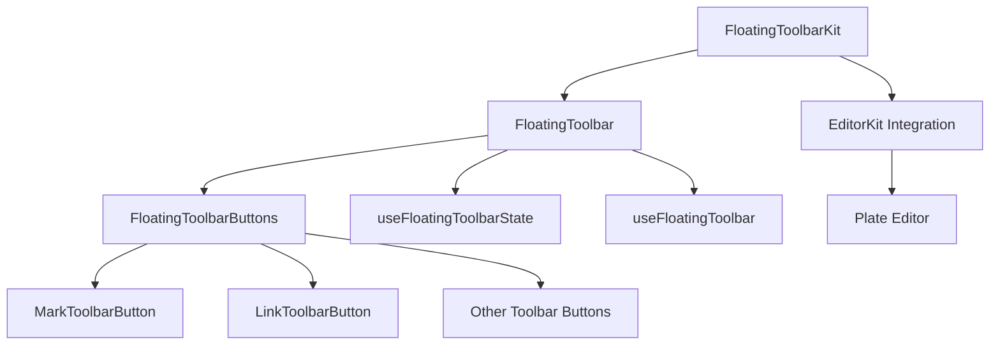
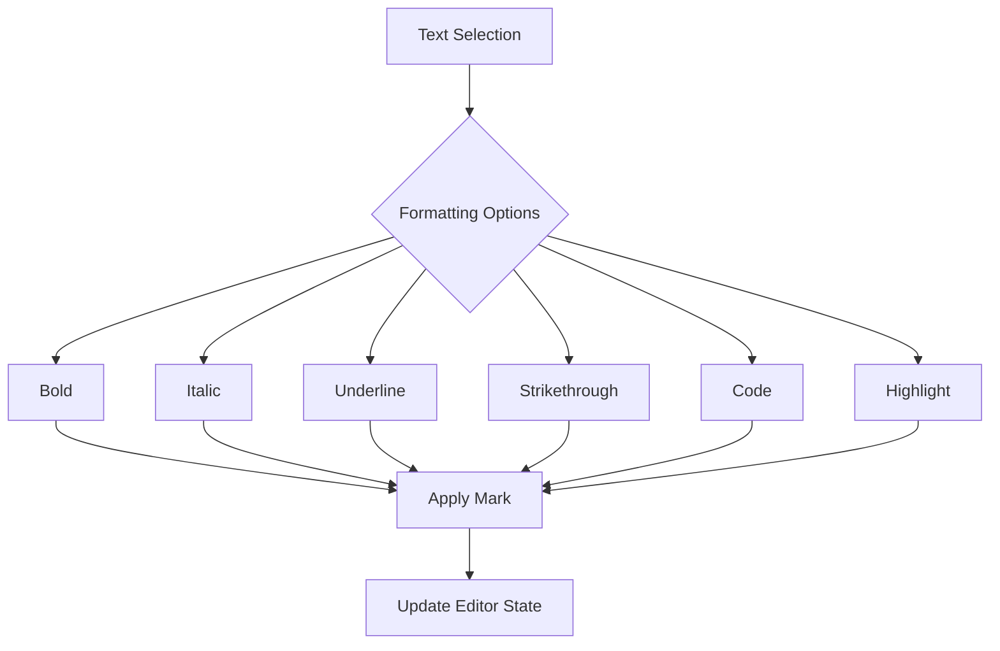
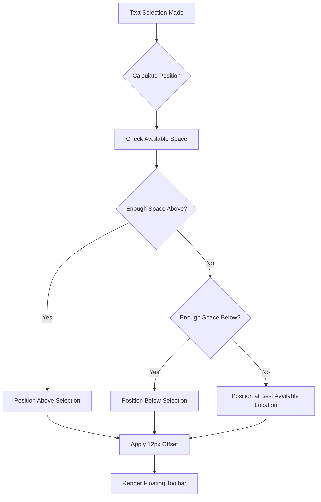
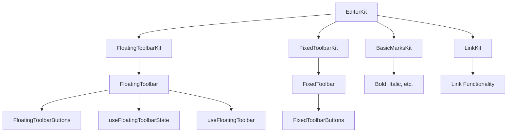
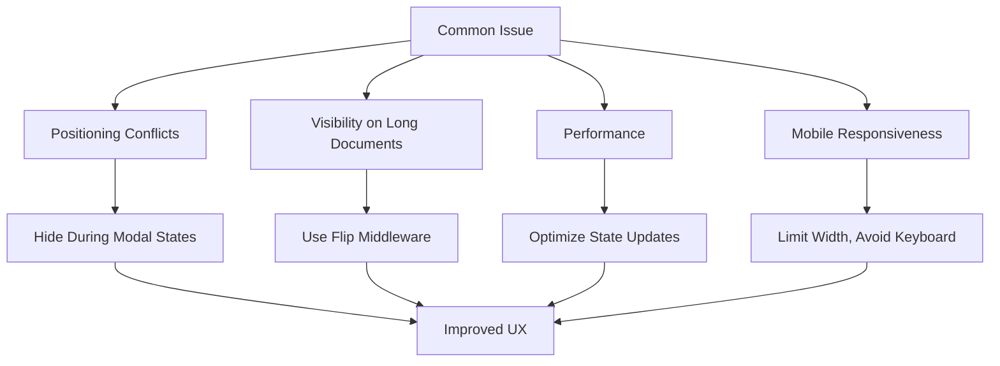

# Floating Toolbar

<cite>
**Referenced Files in This Document**   
- [floating-toolbar-kit.tsx](file://components/plate/floating-toolbar-kit.tsx)
- [floating-toolbar.tsx](file://components/ui/floating-toolbar.tsx)
- [floating-toolbar-buttons.tsx](file://components/ui/floating-toolbar-buttons.tsx)
- [fixed-toolbar-kit.tsx](file://components/plate/fixed-toolbar-kit.tsx)
- [fixed-toolbar-buttons.tsx](file://components/ui/fixed-toolbar-buttons.tsx)
- [mark-toolbar-button.tsx](file://components/ui/mark-toolbar-button.tsx)
- [link-toolbar-button.tsx](file://components/ui/link-toolbar-button.tsx)
- [editor-kit.tsx](file://components/plate/editor-kit.tsx)
- [plate-editor.tsx](file://components/plate/plate-editor.tsx)
</cite>

## Table of Contents
1. [Introduction](#introduction)
2. [Architecture Overview](#architecture-overview)
3. [Core Components](#core-components)
4. [Inline Formatting Controls](#inline-formatting-controls)
5. [Link Management](#link-management)
6. [Positioning Logic](#positioning-logic)
7. [Integration with Plate Editor](#integration-with-plate-editor)
8. [Appearance and Disappearance Behavior](#appearance-and-disappearance-behavior)
9. [Common Issues and Solutions](#common-issues-and-solutions)
10. [Conclusion](#conclusion)

## Introduction

The FloatingToolbarKit in the Sinesys document editor provides context-sensitive formatting options that appear near selected text, offering users quick access to frequently used formatting tools without requiring them to navigate to the fixed toolbar at the top of the editor. This floating toolbar enhances user productivity by reducing mouse movement and providing immediate access to essential formatting controls directly in the context of the selected content.

The floating toolbar is designed to complement the fixed toolbar by focusing on the most commonly used inline formatting options, while the fixed toolbar contains a more comprehensive set of tools for document creation and management. This dual-toolbar approach optimizes the user interface by providing both quick access to essential tools and comprehensive access to all editor features.

**Section sources**
- [floating-toolbar-kit.tsx](file://components/plate/floating-toolbar-kit.tsx)
- [floating-toolbar.tsx](file://components/ui/floating-toolbar.tsx)

## Architecture Overview

The floating toolbar system is implemented as a modular component within the Plate editor framework, following a clean separation of concerns between presentation, behavior, and integration. The architecture consists of three main components: the FloatingToolbarKit (integration layer), the FloatingToolbar (presentation and positioning layer), and the FloatingToolbarButtons (functional controls layer).

**Diagram sources**
- [floating-toolbar-kit.tsx](file://components/plate/floating-toolbar-kit.tsx)
- [floating-toolbar.tsx](file://components/ui/floating-toolbar.tsx)
- [floating-toolbar-buttons.tsx](file://components/ui/floating-toolbar-buttons.tsx)

**Section sources**
- [floating-toolbar-kit.tsx](file://components/plate/floating-toolbar-kit.tsx)
- [floating-toolbar.tsx](file://components/ui/floating-toolbar.tsx)
- [floating-toolbar-buttons.tsx](file://components/ui/floating-toolbar-buttons.tsx)

## Core Components

The floating toolbar system comprises several key components that work together to provide a seamless user experience. The FloatingToolbarKit serves as the integration point with the Plate editor framework, registering the toolbar as a plugin that renders after the editable content area. The FloatingToolbar component handles the positioning logic and visibility state, while the FloatingToolbarButtons component contains the actual formatting controls.

The implementation follows the Plate editor's plugin architecture, where the FloatingToolbarKit is an array of plugins created with createPlatePlugin. This plugin specifies a render function that places the FloatingToolbar after the editable content, ensuring it appears in the correct position relative to the editor. The FloatingToolbar itself is a React component that uses the @platejs/floating library to manage its positioning and visibility based on the editor state.

**Section sources**
- [floating-toolbar-kit.tsx](file://components/plate/floating-toolbar-kit.tsx)
- [floating-toolbar.tsx](file://components/ui/floating-toolbar.tsx)
- [floating-toolbar-buttons.tsx](file://components/ui/floating-toolbar-buttons.tsx)

## Inline Formatting Controls

The floating toolbar provides quick access to essential inline formatting controls, including bold, italic, underline, strikethrough, code, and highlight. These controls are implemented using the MarkToolbarButton component, which is a wrapper around the base ToolbarButton that integrates with the Plate editor's mark functionality.

The available formatting options in the floating toolbar include:
- **Bold**: Applies strong emphasis to selected text (⌘+B)
- **Italic**: Applies emphasis to selected text (⌘+I)
- **Underline**: Adds an underline to selected text (⌘+U)
- **Strikethrough**: Adds a strikethrough to selected text (⌘+⇧+M)
- **Code**: Formats selected text as inline code (⌘+E)
- **Highlight**: Applies background highlighting to selected text

The highlight functionality is particularly noteworthy as it appears in both the floating and fixed toolbars, providing consistent access to this frequently used feature. However, the floating toolbar focuses on the most commonly used formatting options, while more advanced formatting controls are available in the fixed toolbar.

**Diagram sources**
- [floating-toolbar-buttons.tsx](file://components/ui/floating-toolbar-buttons.tsx)
- [mark-toolbar-button.tsx](file://components/ui/mark-toolbar-button.tsx)

**Section sources**
- [floating-toolbar-buttons.tsx](file://components/ui/floating-toolbar-buttons.tsx)
- [mark-toolbar-button.tsx](file://components/ui/mark-toolbar-button.tsx)

## Link Management

The floating toolbar includes a dedicated link management control that allows users to quickly create and edit hyperlinks within their documents. The LinkToolbarButton component provides a simple interface for adding, editing, and removing links from selected text.

When text is selected and the user clicks the link button in the floating toolbar, the editor enters link mode, allowing the user to input or modify the URL. The link functionality is integrated with the Plate editor's link plugin, ensuring consistent behavior across the application. The link button displays a tooltip indicating its function and keyboard shortcut, providing immediate feedback to users.

The link management system supports both internal and external links, with validation to ensure URLs are properly formatted. When a link is applied to selected text, the editor updates the document state to include the link mark, which is then rendered as a clickable hyperlink in the document.

**Section sources**
- [floating-toolbar-buttons.tsx](file://components/ui/floating-toolbar-buttons.tsx)
- [link-toolbar-button.tsx](file://components/ui/link-toolbar-button.tsx)

## Positioning Logic

The positioning logic for the floating toolbar is handled by the @platejs/floating library, which provides robust positioning capabilities that adapt to various screen sizes and document layouts. The toolbar's position is calculated relative to the current text selection, ensuring it appears near the selected content for optimal accessibility.

The positioning system uses several key parameters to determine the optimal placement:
- **Offset**: A 12px offset from the selection to prevent overlap
- **Placement**: Default placement is 'top' of the selection
- **Fallback placements**: If the primary placement is not possible, the system tries 'top-start', 'top-end', 'bottom-start', and 'bottom-end'
- **Padding**: 12px padding to ensure the toolbar doesn't appear too close to screen edges

The floating toolbar also includes logic to handle visibility based on editor state. The toolbar is hidden when certain modal interfaces are active, such as the floating link editor or AI chat interface, to prevent overlapping elements. This ensures a clean user interface and prevents interaction conflicts.

**Diagram sources**
- [floating-toolbar.tsx](file://components/ui/floating-toolbar.tsx)

**Section sources**
- [floating-toolbar.tsx](file://components/ui/floating-toolbar.tsx)

## Integration with Plate Editor

The floating toolbar is seamlessly integrated with the Plate editor framework through the EditorKit system, which composes multiple editor plugins into a cohesive editing experience. The FloatingToolbarKit is included in the EditorKit array alongside other essential plugins, ensuring it is initialized with the editor.

The integration follows the Plate editor's plugin architecture, where each toolbar component is registered as a plugin with specific rendering instructions. The FloatingToolbarKit uses the createPlatePlugin function to define its behavior, specifying that the toolbar should be rendered after the editable content area. This ensures the toolbar appears in the correct DOM position relative to the editor.

The floating toolbar also integrates with the editor's state management system, responding to changes in editor focus, selection state, and read-only mode. When the editor loses focus or enters read-only mode, the floating toolbar automatically hides to maintain a clean interface. This integration ensures the toolbar behaves consistently with the overall editor state.

**Diagram sources**
- [editor-kit.tsx](file://components/plate/editor-kit.tsx)
- [plate-editor.tsx](file://components/plate/plate-editor.tsx)
- [floating-toolbar-kit.tsx](file://components/plate/floating-toolbar-kit.tsx)

**Section sources**
- [editor-kit.tsx](file://components/plate/editor-kit.tsx)
- [plate-editor.tsx](file://components/plate/plate-editor.tsx)
- [floating-toolbar-kit.tsx](file://components/plate/floating-toolbar-kit.tsx)

## Appearance and Disappearance Behavior

The floating toolbar exhibits intelligent appearance and disappearance behavior based on user interactions and editor state. The toolbar appears automatically when text is selected within the editor and disappears when the selection is cleared or the editor loses focus.

The visibility logic includes several key conditions:
- **Appears when**: Text is selected and the editor has focus
- **Disappears when**: Selection is cleared, editor loses focus, or certain modal interfaces are active
- **Hidden during**: Link editing mode, AI chat interface, or other floating elements

The toolbar also respects the editor's read-only state, remaining hidden when the editor is in read-only mode. This prevents users from attempting to format content they cannot modify. The appearance and disappearance are handled smoothly with CSS transitions, providing a polished user experience without distracting animations.

The system also includes logic to prevent the toolbar from appearing when other floating elements are active, such as the link editor or AI interface. This prevents overlapping UI elements and ensures a clean, uncluttered interface.

**Section sources**
- [floating-toolbar.tsx](file://components/ui/floating-toolbar.tsx)

## Common Issues and Solutions

The floating toolbar implementation addresses several common issues that arise in rich text editors with context-sensitive UI elements:

### Positioning Conflicts
One common issue is positioning conflicts with other floating elements, such as the link editor or AI interface. The solution implemented in the Sinesys editor is to hide the floating toolbar when these other interfaces are active, preventing overlapping elements and ensuring a clean user interface.

### Visibility on Long Documents
On long documents, the floating toolbar could potentially be positioned off-screen or in a location that is difficult to access. The solution uses the flip middleware from @platejs/floating, which automatically adjusts the toolbar's placement to ensure it remains visible within the viewport. The system tries multiple placement options (top-start, top-end, bottom-start, bottom-end) to find the optimal position.

### Performance Considerations
Frequent repositioning of the toolbar could impact performance, especially on lower-end devices. The implementation uses efficient state management and debouncing techniques to minimize unnecessary re-renders and position calculations.

### Mobile Responsiveness
On mobile devices, screen real estate is limited, and the floating toolbar could interfere with touch interactions. The implementation includes responsive design considerations, such as limiting the toolbar's maximum width to 80% of the viewport and ensuring it doesn't overlap with virtual keyboards.

**Diagram sources**
- [floating-toolbar.tsx](file://components/ui/floating-toolbar.tsx)

**Section sources**
- [floating-toolbar.tsx](file://components/ui/floating-toolbar.tsx)

## Conclusion

The FloatingToolbarKit in the Sinesys document editor provides an efficient and user-friendly way to access essential formatting tools directly in the context of selected text. By implementing a context-sensitive toolbar that appears near the selection, the editor reduces user effort and enhances productivity by minimizing mouse movement between the editing area and the fixed toolbar.

The implementation demonstrates a well-architected approach to rich text editor UI design, with clear separation of concerns between integration, presentation, and functionality. The use of the Plate editor framework ensures consistent behavior and seamless integration with other editor features.

The floating toolbar effectively complements the fixed toolbar by focusing on the most frequently used inline formatting options, creating a balanced interface that provides both quick access to essential tools and comprehensive access to all editor features. This dual-toolbar approach optimizes the user experience by reducing cognitive load and improving workflow efficiency.

Future enhancements could include additional context-aware features, such as suggesting formatting options based on content type or providing quick access to recently used formatting combinations, further improving the editor's usability and efficiency.

**Section sources**
- [floating-toolbar-kit.tsx](file://components/plate/floating-toolbar-kit.tsx)
- [floating-toolbar.tsx](file://components/ui/floating-toolbar.tsx)
- [floating-toolbar-buttons.tsx](file://components/ui/floating-toolbar-buttons.tsx)