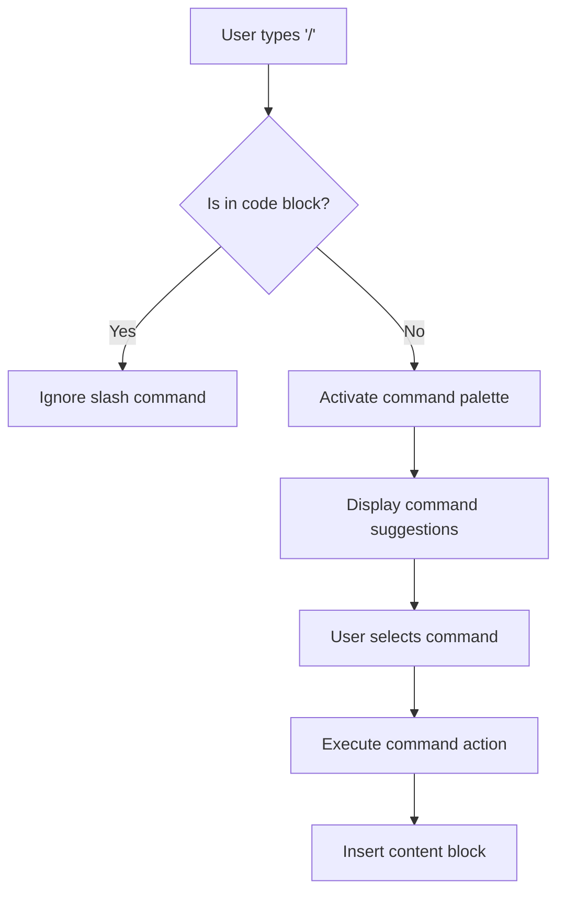
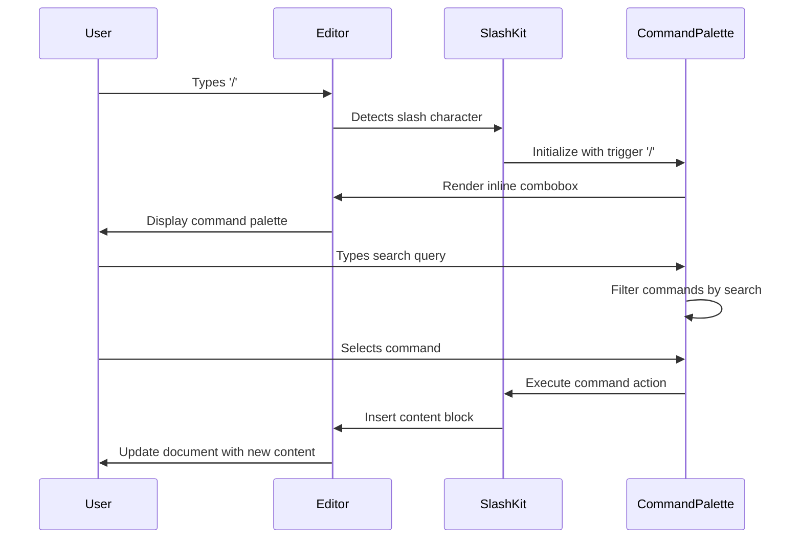
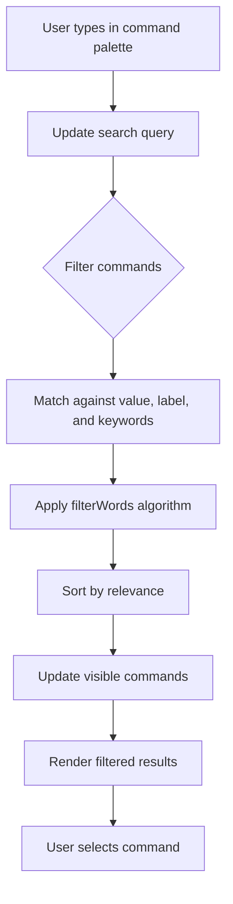
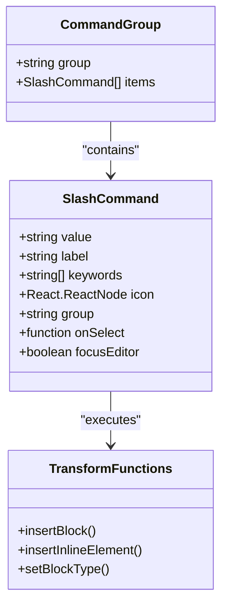

# Slash Commands

<cite>
**Referenced Files in This Document**   
- [slash-kit.tsx](file://components/plate/slash-kit.tsx)
- [slash-node.tsx](file://components/ui/slash-node.tsx)
- [transforms.ts](file://components/transforms.ts)
- [inline-combobox.tsx](file://components/ui/inline-combobox.tsx)
</cite>

## Table of Contents
1. [Introduction](#introduction)
2. [Slash Command System Overview](#slash-command-system-overview)
3. [Available Commands](#available-commands)
4. [Command Palette Implementation](#command-palette-implementation)
5. [Autocomplete Functionality](#autocomplete-functionality)
6. [Command Registration and Extension](#command-registration-and-extension)
7. [Input Handling and Conflict Resolution](#input-handling-and-conflict-resolution)
8. [Performance Considerations](#performance-considerations)

## Introduction

The Sinesys document editor implements a slash command system that allows users to quickly insert various content elements by typing '/' followed by a command. This functionality provides an efficient way to access and insert different types of content blocks, media elements, and special components without navigating through menus or toolbars. The system features an intelligent autocomplete mechanism that suggests relevant commands as users type, enhancing the overall editing experience.

**Section sources**
- [slash-kit.tsx](file://components/plate/slash-kit.tsx#L1-L18)
- [slash-node.tsx](file://components/ui/slash-node.tsx#L1-L255)

## Slash Command System Overview

The slash command system in Sinesys is built using the Plate.js framework, specifically leveraging the `@platejs/slash-command/react` package. The system is implemented as a plugin kit called `SlashKit` that integrates with the editor's input handling system. When a user types the '/' character, the system activates a command palette that displays available commands organized into categories.

The implementation prevents command activation within code blocks to avoid conflicts with code syntax that might include slash characters. This is achieved through the `triggerQuery` configuration option that checks the current editor context before enabling the slash command functionality.

**Diagram sources**
- [slash-kit.tsx](file://components/plate/slash-kit.tsx#L9-L15)
- [slash-node.tsx](file://components/ui/slash-node.tsx#L213-L255)

**Section sources**
- [slash-kit.tsx](file://components/plate/slash-kit.tsx#L1-L18)

## Available Commands

The slash command system provides a comprehensive set of commands organized into several categories for easy discovery and access. These commands allow users to insert various content blocks, media elements, and special components directly into the document.

### Basic Blocks
The basic blocks category includes fundamental content elements:
- **Text**: Regular paragraph text
- **Heading 1/2/3**: Different levels of headings
- **Bulleted list**: Unordered list with bullet points
- **Numbered list**: Ordered list with sequential numbering
- **To-do list**: Checkable list items
- **Toggle**: Collapsible/expandable content block
- **Code Block**: Block for displaying code with syntax highlighting
- **Table**: Grid-based data presentation
- **Blockquote**: Quoted text with visual distinction
- **Callout**: Highlighted block for notes and important information

### Advanced Blocks
The advanced blocks category includes more sophisticated content elements:
- **Table of contents**: Automatically generated table of contents
- **3 columns**: Layout element for three-column content
- **Equation**: Mathematical expressions and formulas
- **Excalidraw**: Embedded drawing canvas for diagrams and sketches

### Inline Elements
The inline category includes elements that can be inserted within text:
- **Date**: Current date or date picker
- **Inline Equation**: Mathematical expressions within text flow

### AI Commands
The AI category provides access to artificial intelligence features:
- **AI**: Activates the AI chat interface for content generation and editing assistance

**Section sources**
- [slash-node.tsx](file://components/ui/slash-node.tsx#L59-L211)

## Command Palette Implementation

The command palette is rendered as an inline combobox that appears when the user types the '/' character. The implementation uses the `InlineCombobox` component from the Plate.js framework, which provides a floating dropdown menu with command suggestions.

The command palette is implemented in the `SlashInputElement` component, which serves as the visual representation of the slash command input. When activated, it displays a categorized list of commands with icons and labels, making it easy for users to identify and select the desired command.

The palette supports keyboard navigation, allowing users to move between commands using arrow keys and select a command with Enter. The implementation also handles special cases such as closing the palette when the user presses Escape or clicks outside the dropdown.

**Diagram sources**
- [slash-node.tsx](file://components/ui/slash-node.tsx#L213-L255)
- [inline-combobox.tsx](file://components/ui/inline-combobox.tsx#L74-L200)

**Section sources**
- [slash-node.tsx](file://components/ui/slash-node.tsx#L213-L255)
- [inline-combobox.tsx](file://components/ui/inline-combobox.tsx#L1-L404)

## Autocomplete Functionality

The autocomplete functionality in the slash command system provides intelligent suggestions as users type, making it easier to discover and access commands. The system uses a filtering mechanism that matches user input against command values, labels, and keywords.

Each command can have associated keywords that help with discovery. For example, the "Heading 1" command has keywords like "title" and "h1", allowing users to find it by typing any of these terms. The filtering algorithm uses the `filterWords` function from the Plate.js framework to perform case-insensitive matching with support for partial word matching.

The autocomplete system is implemented in the `InlineCombobox` component, which manages the filtering and display of command suggestions. It maintains the search state and updates the visible commands as the user types, providing real-time feedback on matching commands.

**Diagram sources**
- [inline-combobox.tsx](file://components/ui/inline-combobox.tsx#L50-L61)
- [slash-node.tsx](file://components/ui/slash-node.tsx#L59-L211)

**Section sources**
- [inline-combobox.tsx](file://components/ui/inline-combobox.tsx#L31-L61)
- [slash-node.tsx](file://components/ui/slash-node.tsx#L46-L57)

## Command Registration and Extension

The slash command system is designed to be extensible, allowing new commands to be added to enhance the editor's functionality. Commands are registered through the `groups` array in the `SlashInputElement` component, which defines the available commands and their properties.

Each command is defined with the following properties:
- **icon**: Visual representation of the command
- **value**: Unique identifier for the command
- **label**: Display name for the command
- **keywords**: Search terms that help users discover the command
- **onSelect**: Function executed when the command is selected
- **group**: Category to which the command belongs

The system uses a mapping approach in the `transforms.ts` file to handle the insertion of different content blocks. The `insertBlockMap` and `insertInlineMap` objects define the specific functions that are called when a command is executed, providing a clean separation between command registration and implementation.

To add a new command, developers can extend the `groups` array with a new command definition and ensure the corresponding insertion function is available in the transforms module. This modular approach makes it easy to add new functionality without modifying the core command system.

**Diagram sources**
- [slash-node.tsx](file://components/ui/slash-node.tsx#L46-L57)
- [transforms.ts](file://components/transforms.ts#L41-L80)

**Section sources**
- [slash-node.tsx](file://components/ui/slash-node.tsx#L46-L211)
- [transforms.ts](file://components/transforms.ts#L41-L129)

## Input Handling and Conflict Resolution

The slash command system includes mechanisms to handle potential conflicts with regular text input and ensure a smooth user experience. The primary conflict resolution strategy is the context-aware activation of the command system, which prevents activation within code blocks where slash characters are commonly used in programming syntax.

When the command palette is active, the system captures keyboard events to enable navigation and selection within the palette. Special handling is implemented for backspace, which can either remove characters from the search query or cancel the entire command input if pressed on an empty query.

The system also handles edge cases such as:
- Closing the palette when the user clicks outside it
- Preserving the slash character and typed text if the user cancels the command
- Properly positioning the cursor after command execution
- Handling cases where the same block type is already active

These conflict resolution mechanisms ensure that the slash command system enhances rather than interferes with the normal text input workflow.

**Section sources**
- [slash-kit.tsx](file://components/plate/slash-kit.tsx#L11-L14)
- [inline-combobox.tsx](file://components/ui/inline-combobox.tsx#L130-L142)

## Performance Considerations

The slash command system is designed with performance in mind, particularly when processing keystrokes for command detection and filtering. The implementation uses several optimization techniques to ensure responsive behavior:

- **Debounced updates**: The command filtering is optimized to avoid unnecessary re-renders during rapid typing
- **Memoized calculations**: The filtering function uses memoization to cache results when possible
- **Efficient data structures**: Commands are organized in a way that allows for quick lookup and filtering
- **Selective rendering**: Only visible commands are rendered, with virtualization for large command sets

The system also minimizes the performance impact by only activating the command detection logic when the slash character is typed, rather than monitoring every keystroke. This targeted approach ensures that the command system remains lightweight and doesn't interfere with the overall editor performance.

Additionally, the use of React's `useCallback` and `useMemo` hooks in the implementation helps prevent unnecessary re-renders and function recreations, further optimizing the performance of the command system.

**Section sources**
- [inline-combobox.tsx](file://components/ui/inline-combobox.tsx#L147-L166)
- [transforms.ts](file://components/transforms.ts#L93-L123)