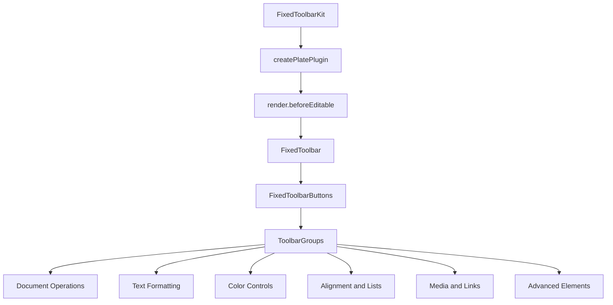
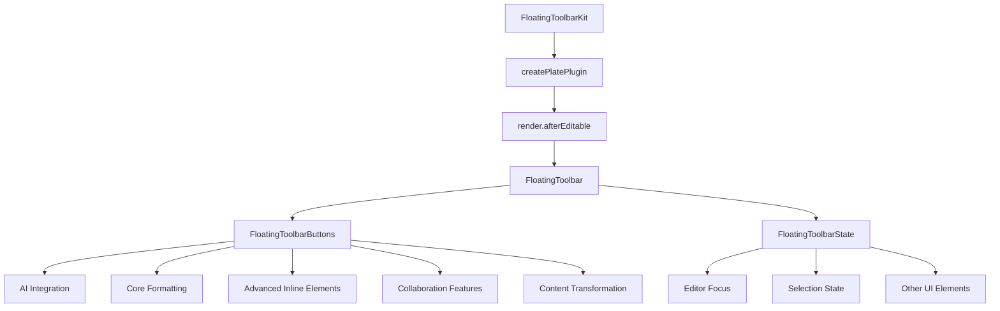
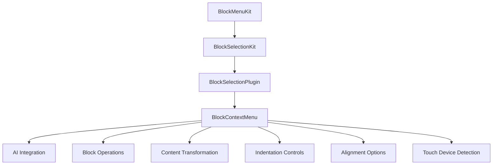
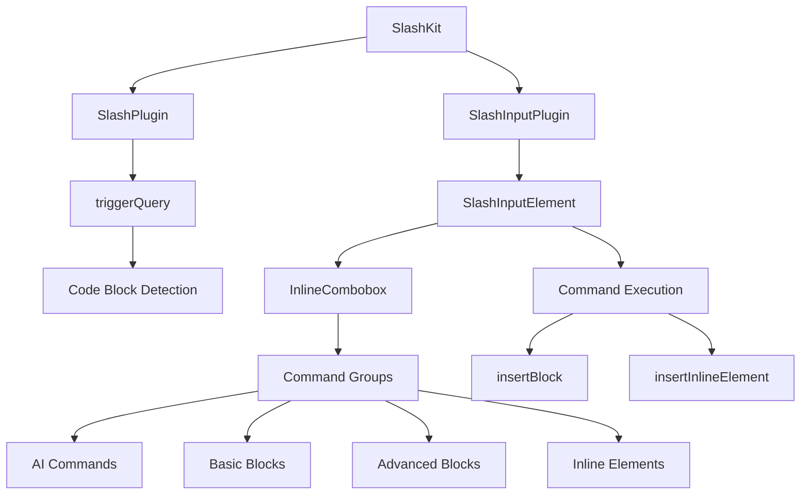
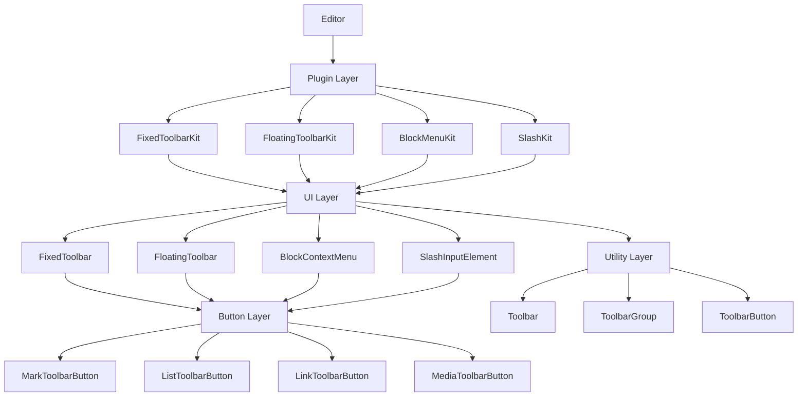

# Toolbar Components

<cite>
**Referenced Files in This Document**   
- [fixed-toolbar-kit.tsx](file://components/plate/fixed-toolbar-kit.tsx)
- [floating-toolbar-kit.tsx](file://components/plate/floating-toolbar-kit.tsx)
- [block-menu-kit.tsx](file://components/plate/block-menu-kit.tsx)
- [slash-kit.tsx](file://components/plate/slash-kit.tsx)
- [fixed-toolbar.tsx](file://components/ui/fixed-toolbar.tsx)
- [floating-toolbar.tsx](file://components/ui/floating-toolbar.tsx)
- [fixed-toolbar-buttons.tsx](file://components/ui/fixed-toolbar-buttons.tsx)
- [floating-toolbar-buttons.tsx](file://components/ui/floating-toolbar-buttons.tsx)
- [block-context-menu.tsx](file://components/ui/block-context-menu.tsx)
- [slash-node.tsx](file://components/ui/slash-node.tsx)
- [mark-toolbar-button.tsx](file://components/ui/mark-toolbar-button.tsx)
- [list-toolbar-button.tsx](file://components/ui/list-toolbar-button.tsx)
- [toolbar.tsx](file://components/ui/toolbar.tsx)
</cite>

## Table of Contents
1. [Introduction](#introduction)
2. [Fixed Toolbar System](#fixed-toolbar-system)
3. [Floating Toolbar System](#floating-toolbar-system)
4. [Block Menu Implementation](#block-menu-implementation)
5. [Slash Commands System](#slash-commands-system)
6. [Toolbar Architecture Overview](#toolbar-architecture-overview)
7. [Common Issues and Solutions](#common-issues-and-solutions)
8. [Conclusion](#conclusion)

## Introduction
The Sinesys document editor features a comprehensive toolbar system designed to provide users with intuitive formatting and content insertion capabilities. The system consists of four main components: FixedToolbarKit, FloatingToolbarKit, BlockMenuKit, and SlashKit. These components work together to provide both persistent and context-sensitive formatting options, enabling efficient document creation and editing. The fixed toolbar provides always-accessible formatting options at the top of the editor, while the floating toolbar appears contextually near selected text. The block menu enables right-click insertion and manipulation of content blocks, and slash commands provide keyboard-driven content insertion through the "/" trigger.

**Section sources**
- [fixed-toolbar-kit.tsx](file://components/plate/fixed-toolbar-kit.tsx)
- [floating-toolbar-kit.tsx](file://components/plate/floating-toolbar-kit.tsx)
- [block-menu-kit.tsx](file://components/plate/block-menu-kit.tsx)
- [slash-kit.tsx](file://components/plate/slash-kit.tsx)

## Fixed Toolbar System

The FixedToolbarKit provides a persistent toolbar at the top of the editor that remains visible as users scroll through their documents. This toolbar contains the most frequently used formatting options and document actions, ensuring they are always accessible.

The implementation uses Plate.js's plugin system to create a toolbar that renders before the editable content area. The FixedToolbar component applies sticky positioning with a backdrop blur effect to ensure visibility while scrolling. It includes comprehensive formatting options organized into logical groups:

- **Document Operations**: Import, export, undo, and redo functionality
- **Text Formatting**: Bold, italic, underline, strikethrough, and code styling
- **Color Controls**: Text color and background highlighting
- **Alignment and Lists**: Text alignment, bulleted/numbered/todo lists
- **Media and Links**: Insertion of images, videos, audio, files, and hyperlinks
- **Advanced Elements**: Tables, equations, and AI-powered features

The toolbar is conditionally rendered based on the editor's read-only state, ensuring appropriate functionality based on user permissions.

**Diagram sources**
- [fixed-toolbar-kit.tsx](file://components/plate/fixed-toolbar-kit.tsx#L8-L19)
- [fixed-toolbar.tsx](file://components/ui/fixed-toolbar.tsx#L7-L17)
- [fixed-toolbar-buttons.tsx](file://components/ui/fixed-toolbar-buttons.tsx#L50-L170)

**Section sources**
- [fixed-toolbar-kit.tsx](file://components/plate/fixed-toolbar-kit.tsx#L8-L19)
- [fixed-toolbar.tsx](file://components/ui/fixed-toolbar.tsx#L7-L17)
- [fixed-toolbar-buttons.tsx](file://components/ui/fixed-toolbar-buttons.tsx#L50-L170)

## Floating Toolbar System

The FloatingToolbarKit provides context-sensitive formatting options that appear near selected text, offering quick access to the most relevant formatting tools without requiring users to navigate to the top of the editor.

The floating toolbar uses Plate.js's floating UI system with precise positioning logic that automatically adjusts based on available screen space. It appears when text is selected and automatically hides when certain modal interfaces (like link editing or AI chat) are active to prevent UI conflicts.

The floating toolbar contains a streamlined set of formatting options optimized for quick text manipulation:

- **AI Integration**: Direct access to AI-powered writing assistance
- **Core Formatting**: Bold, italic, underline, strikethrough, and inline code
- **Advanced Inline Elements**: Inline equations and hyperlinks
- **Collaboration Features**: Comments and suggestions
- **Content Transformation**: "Turn into" functionality for changing content type

The toolbar's visibility is controlled by the FloatingToolbarState, which considers editor focus, selection state, and the status of other UI elements to determine when to show or hide the toolbar.

**Diagram sources**
- [floating-toolbar-kit.tsx](file://components/plate/floating-toolbar-kit.tsx#L8-L19)
- [floating-toolbar.tsx](file://components/ui/floating-toolbar.tsx#L24-L87)
- [floating-toolbar-buttons.tsx](file://components/ui/floating-toolbar-buttons.tsx#L26-L84)

**Section sources**
- [floating-toolbar-kit.tsx](file://components/plate/floating-toolbar-kit.tsx#L8-L19)
- [floating-toolbar.tsx](file://components/ui/floating-toolbar.tsx#L24-L87)
- [floating-toolbar-buttons.tsx](file://components/ui/floating-toolbar-buttons.tsx#L26-L84)

## Block Menu Implementation

The BlockMenuKit enables users to interact with content blocks through a right-click context menu, providing quick access to block-level operations and transformations.

The implementation builds upon the BlockSelectionKit, which provides the foundation for block selection and manipulation. The BlockContextMenu component renders a comprehensive context menu when users right-click on selectable content blocks, offering the following functionality:

- **AI Integration**: "Ask AI" option to generate content based on selected text
- **Block Operations**: Delete, duplicate, and transform blocks
- **Content Transformation**: "Turn into" functionality to convert blocks between different types (paragraph, headings, blockquotes, etc.)
- **Indentation Controls**: Indent and outdent functionality for list items and nested content
- **Alignment Options**: Left, center, and right alignment for block content

The context menu is disabled on touch devices to prevent conflicts with touch gestures, ensuring a consistent user experience across different input methods.

**Diagram sources**
- [block-menu-kit.tsx](file://components/plate/block-menu-kit.tsx#L9-L14)
- [block-context-menu.tsx](file://components/ui/block-context-menu.tsx#L28-L202)
- [block-selection-kit.tsx](file://components/plate/block-selection-kit.tsx#L9-L32)

**Section sources**
- [block-menu-kit.tsx](file://components/plate/block-menu-kit.tsx#L9-L14)
- [block-context-menu.tsx](file://components/ui/block-context-menu.tsx#L28-L202)
- [block-selection-kit.tsx](file://components/plate/block-selection-kit.tsx#L9-L32)

## Slash Commands System

The SlashKit implements a powerful slash command system that allows users to quickly insert various content elements by typing "/" followed by a command.

The implementation uses Plate.js's slash command plugin with a rich set of predefined commands organized into logical groups:

- **AI Commands**: Direct access to AI-powered writing assistance
- **Basic Blocks**: Paragraph, headings (H1, H2, H3), lists (bulleted, numbered, todo), code blocks, tables, blockquotes, and callouts
- **Advanced Blocks**: Table of contents, multi-column layouts, equations, and Excalidraw diagrams
- **Inline Elements**: Date fields and inline equations

The SlashInputElement component renders an inline combobox that appears when the "/" trigger is detected, providing a searchable interface with icons and labels for each command. The system supports keyboard navigation and selection, with commands organized into collapsible groups for easy discovery.

**Diagram sources**
- [slash-kit.tsx](file://components/plate/slash-kit.tsx#L8-L18)
- [slash-node.tsx](file://components/ui/slash-node.tsx#L213-L254)
- [transforms.ts](file://components/transforms.ts#L32-L34)

**Section sources**
- [slash-kit.tsx](file://components/plate/slash-kit.tsx#L8-L18)
- [slash-node.tsx](file://components/ui/slash-node.tsx#L213-L254)

## Toolbar Architecture Overview

The toolbar system in Sinesys follows a modular architecture built on Plate.js, a React-based rich text editor framework. The system is designed with separation of concerns, where each toolbar component has a specific responsibility while working together to provide a cohesive editing experience.

The architecture consists of several layers:

- **Plugin Layer**: The kit components (FixedToolbarKit, FloatingToolbarKit, etc.) that integrate with Plate.js
- **UI Layer**: The actual toolbar components that handle rendering and user interaction
- **Button Layer**: Individual toolbar buttons that encapsulate specific formatting actions
- **Utility Layer**: Shared components and functions that support toolbar functionality

The system uses React hooks extensively for state management and editor integration, with components like useEditorReadOnly, useEditorSelector, and usePluginOption providing access to editor state. The toolbar buttons are built on a flexible Toolbar component that supports various button types, including regular buttons, toggle buttons, split buttons, and dropdown menus.

**Diagram sources**
- [fixed-toolbar-kit.tsx](file://components/plate/fixed-toolbar-kit.tsx)
- [floating-toolbar-kit.tsx](file://components/plate/floating-toolbar-kit.tsx)
- [block-menu-kit.tsx](file://components/plate/block-menu-kit.tsx)
- [slash-kit.tsx](file://components/plate/slash-kit.tsx)
- [toolbar.tsx](file://components/ui/toolbar.tsx)

**Section sources**
- [fixed-toolbar-kit.tsx](file://components/plate/fixed-toolbar-kit.tsx)
- [floating-toolbar-kit.tsx](file://components/plate/floating-toolbar-kit.tsx)
- [block-menu-kit.tsx](file://components/plate/block-menu-kit.tsx)
- [slash-kit.tsx](file://components/plate/slash-kit.tsx)
- [toolbar.tsx](file://components/ui/toolbar.tsx)

## Common Issues and Solutions

The toolbar system addresses several common challenges in rich text editor design:

**Positioning Conflicts**: The floating toolbar uses sophisticated positioning logic with flip middleware to ensure it remains visible and doesn't overlap with other UI elements. It automatically hides when modal interfaces like link editing or AI chat are active.

**Responsive Design**: Both fixed and floating toolbars are designed to work across different screen sizes. The fixed toolbar uses overflow-x-auto to handle narrow screens, while the floating toolbar has a max-width constraint (max-w-[80vw]) to prevent overflow on small devices.

**Touch Device Compatibility**: The block context menu is disabled on touch devices to prevent conflicts with touch gestures, providing a more natural touch experience.

**Performance Optimization**: The toolbar components use React's memoization and Plate.js's optimized rendering to minimize re-renders and maintain smooth performance even with complex documents.

**Accessibility**: The toolbar system includes comprehensive keyboard navigation support, tooltip text for screen readers, and proper ARIA attributes to ensure accessibility for all users.

**Section sources**
- [floating-toolbar.tsx](file://components/ui/floating-toolbar.tsx#L42-L57)
- [block-context-menu.tsx](file://components/ui/block-context-menu.tsx#L63-L65)
- [fixed-toolbar.tsx](file://components/ui/fixed-toolbar.tsx#L12)
- [floating-toolbar.tsx](file://components/ui/floating-toolbar.tsx#L79)

## Conclusion

The Sinesys document editor toolbar system provides a comprehensive and user-friendly interface for document creation and formatting. By combining persistent fixed toolbars with context-sensitive floating toolbars, block-level context menus, and keyboard-driven slash commands, the system offers multiple pathways for users to accomplish their editing tasks efficiently.

The modular architecture built on Plate.js allows for easy customization and extension, while the thoughtful design addresses common usability challenges across different devices and screen sizes. The system strikes a balance between power and simplicity, providing advanced formatting capabilities while maintaining an intuitive interface that supports both novice and expert users.

Future enhancements could include customizable toolbar layouts, additional slash command categories, and improved collaboration features that leverage the existing toolbar infrastructure.