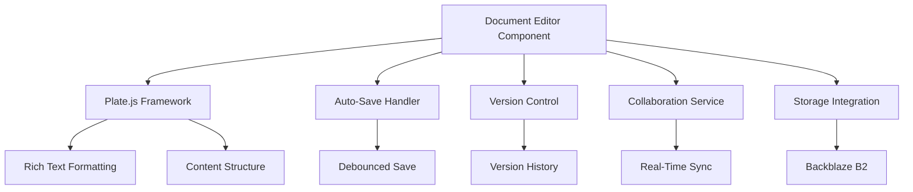
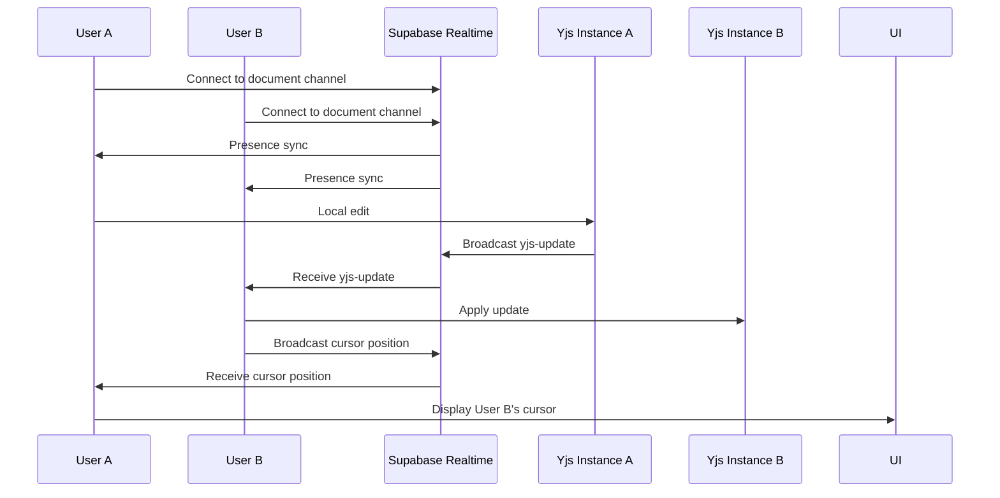
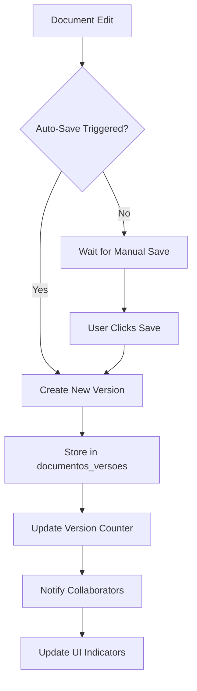
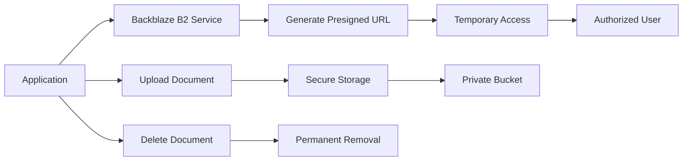
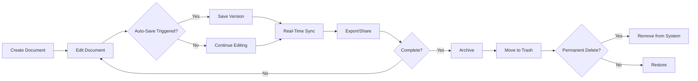

# Document Management

<cite>
**Referenced Files in This Document**   
- [document-editor.tsx](file://components/documentos/document-editor.tsx)
- [collaborative-plate-editor.tsx](file://components/plate/collaborative-plate-editor.tsx)
- [supabase-yjs-provider.ts](file://lib/yjs/supabase-yjs-provider.ts)
- [use-realtime-collaboration.ts](file://hooks/use-realtime-collaboration.ts)
- [versoes-persistence.service.ts](file://backend/documentos/services/persistence/versoes-persistence.service.ts)
- [version-history-dialog.tsx](file://components/documentos/version-history-dialog.tsx)
- [backblaze-b2.service.ts](file://backend/storage/backblaze-b2.service.ts)
- [editor/page.tsx](file://app/(dashboard)/editor/page.tsx)
</cite>

## Table of Contents
1. [Introduction](#introduction)
2. [Document Editor Architecture](#document-editor-architecture)
3. [Real-Time Collaboration with Yjs and WebSockets](#real-time-collaboration-with-yjs-and-websockets)
4. [Version Control System](#version-control-system)
5. [Storage Integration with Backblaze B2](#storage-integration-with-backblaze-b2)
6. [Document Lifecycle Management](#document-lifecycle-management)
7. [Practical Use Cases](#practical-use-cases)
8. [Common Issues and Solutions](#common-issues-and-solutions)

## Introduction

The Sinesys document management system provides a comprehensive solution for document creation, collaboration, and version control. Built on the Plate editor framework, the system offers rich text editing capabilities with real-time collaboration features powered by Yjs and Supabase Realtime. The architecture integrates operational transformation for conflict resolution, automatic version tracking, and secure document storage using Backblaze B2 with presigned URLs for access control. This documentation details the implementation of these features and provides guidance for common use cases and troubleshooting.

**Section sources**
- [document-editor.tsx](file://components/documentos/document-editor.tsx)

## Document Editor Architecture

The document editor in Sinesys is built on the Plate.js framework, a React-based rich text editor that provides extensible editing capabilities. The editor component integrates multiple features including rich text formatting, collaborative editing, version history, and document sharing. The architecture follows a component-based design with clear separation of concerns between the UI layer, collaboration logic, and persistence mechanisms.

The core editor component (`document-editor.tsx`) manages the document state, handles auto-save functionality, and coordinates interactions between the Plate editor and backend services. It provides a toolbar with controls for document operations including saving, exporting, sharing, and accessing version history. The editor supports both online and offline modes, with changes synchronized when connectivity is restored.

**Diagram sources**
- [document-editor.tsx](file://components/documentos/document-editor.tsx)

**Section sources**
- [document-editor.tsx](file://components/documentos/document-editor.tsx)
- [editor/page.tsx](file://app/(dashboard)/editor/page.tsx)

## Real-Time Collaboration with Yjs and WebSockets

The Sinesys document management system implements real-time collaboration using Yjs for conflict-free replicated data types (CRDTs) and Supabase Realtime for WebSocket-based communication. This combination enables multiple users to edit the same document simultaneously with automatic conflict resolution through operational transformation.

The collaboration system is implemented through the `SupabaseYjsProvider` class, which acts as a bridge between Yjs and Supabase Realtime. When users open a document, they connect to a dedicated Supabase channel named after the document ID. The provider handles three types of messages: content updates, awareness information, and synchronization requests. Content updates are encoded Yjs update messages that are broadcast to all connected clients. Awareness information includes user presence, cursor positions, and selection ranges, enabling real-time cursor tracking.

The system implements a synchronization protocol where new clients request the current document state from existing clients. If no response is received within 2 seconds, the client assumes it is the first connection and proceeds with its local state. This ensures that documents can be edited even when no other users are present, while maintaining consistency when multiple users collaborate.

**Diagram sources**
- [supabase-yjs-provider.ts](file://lib/yjs/supabase-yjs-provider.ts)
- [use-realtime-collaboration.ts](file://hooks/use-realtime-collaboration.ts)

**Section sources**
- [supabase-yjs-provider.ts](file://lib/yjs/supabase-yjs-provider.ts)
- [use-realtime-collaboration.ts](file://hooks/use-realtime-collaboration.ts)
- [collaborative-plate-editor.tsx](file://components/plate/collaborative-plate-editor.tsx)

## Version Control System

The document version control system in Sinesys automatically tracks changes to documents and maintains a complete history of revisions. Each time a document is saved, either manually or through auto-save, a new version is created and stored in the database. The system uses a dedicated `documentos_versoes` table that stores the content, title, and metadata for each version.

The versioning implementation is handled by the `versoes-persistence.service.ts` file, which provides methods for creating, retrieving, and restoring versions. When a new version is created, it is assigned a sequential version number, and the previous version becomes part of the historical record. Users can browse the version history through the version history dialog, which displays versions in reverse chronological order with information about the author and timestamp.

The system supports version restoration, which creates a new version containing the content of a previous version. This approach preserves the complete history while allowing users to revert to earlier states. The version control system also includes administrative functions for cleaning up old versions, with a default policy of retaining the 10 most recent versions.

**Diagram sources**
- [versoes-persistence.service.ts](file://backend/documentos/services/persistence/versoes-persistence.service.ts)
- [version-history-dialog.tsx](file://components/documentos/version-history-dialog.tsx)

**Section sources**
- [versoes-persistence.service.ts](file://backend/documentos/services/persistence/versoes-persistence.service.ts)
- [version-history-dialog.tsx](file://components/documentos/version-history-dialog.tsx)

## Storage Integration with Backblaze B2

Sinesys integrates with Backblaze B2 for secure and scalable document storage. The system uses the AWS SDK v3 with Backblaze's S3-compatible API to handle file uploads, downloads, and management. The `backblaze-b2.service.ts` file implements the core storage functionality, including upload, download, deletion, and presigned URL generation.

Document storage follows a hierarchical structure based on the document type and identifier, with paths formatted as `processos/{process_number}/timeline/{document_id}.pdf`. This organization enables efficient retrieval and management of documents associated with specific legal processes.

Security is implemented through presigned URLs, which provide time-limited access to private documents without requiring public bucket access. The `generatePresignedUrl` function creates URLs that expire after a configurable period (default: 1 hour), ensuring that document access is temporary and controlled. This approach allows secure document sharing while maintaining the privacy of the storage bucket.

**Diagram sources**
- [backblaze-b2.service.ts](file://backend/storage/backblaze-b2.service.ts)

**Section sources**
- [backblaze-b2.service.ts](file://backend/storage/backblaze-b2.service.ts)

## Document Lifecycle Management

The document lifecycle in Sinesys encompasses the complete journey from creation to archiving. Documents are created through the document management interface, either as new blank documents or from templates. During editing, documents benefit from auto-save functionality that preserves changes every 2 seconds after the last modification, preventing data loss.

The system supports offline editing, with changes stored locally and synchronized when connectivity is restored. This ensures uninterrupted productivity regardless of network conditions. Documents can be exported in multiple formats, including DOCX and PDF, through the export functionality in the editor toolbar.

When documents are no longer actively used, they can be moved to the trash or archived. The system maintains version history even for deleted documents, allowing restoration if needed. Permanent deletion removes both the document and its versions from the system, with appropriate permissions required to perform this action.

**Section sources**
- [document-editor.tsx](file://components/documentos/document-editor.tsx)

## Practical Use Cases

### Creating a New Legal Document

To create a new legal document, users navigate to the documents section and click "New Document." The system creates a blank document with a temporary title, which can be edited immediately. Users can apply rich text formatting, insert tables, and add other document elements using the toolbar. As they type, changes are automatically saved every 2 seconds, with a visual indicator showing the save status.

### Collaborating with Team Members

When multiple team members open the same document, they appear in the collaboration sidebar with their avatars and cursor colors. Each user's cursor position and text selection are visible in real-time, enabling seamless collaboration. Comments and discussions can be added through the document chat feature, which is accessible from the editor toolbar.

### Tracking Document History

Users can access the version history by clicking the "History" option in the editor menu. The version history dialog displays all previous versions in chronological order, with information about the author and timestamp. To restore a previous version, users select the desired version and confirm the restoration, which creates a new version containing the restored content.

**Section sources**
- [document-editor.tsx](file://components/documentos/document-editor.tsx)
- [version-history-dialog.tsx](file://components/documentos/version-history-dialog.tsx)

## Common Issues and Solutions

### Merge Conflicts in Collaborative Editing

While the Yjs CRDT implementation minimizes merge conflicts, complex simultaneous edits can occasionally result in unexpected content ordering. The system resolves these conflicts automatically using operational transformation rules, but users should be aware that extensive simultaneous editing of the same paragraph may require manual review. The recommended solution is to coordinate major structural changes with team members and use the document chat feature to communicate editing plans.

### Handling Large Documents

Large documents with extensive content or numerous images may experience performance degradation during collaborative editing. The system addresses this through several optimizations: content is synchronized in chunks rather than as a single payload, and awareness updates are debounced to reduce network traffic. For extremely large documents, users can temporarily disable real-time collaboration and work in single-user mode, merging changes afterward.

**Section sources**
- [supabase-yjs-provider.ts](file://lib/yjs/supabase-yjs-provider.ts)
- [document-editor.tsx](file://components/documentos/document-editor.tsx)