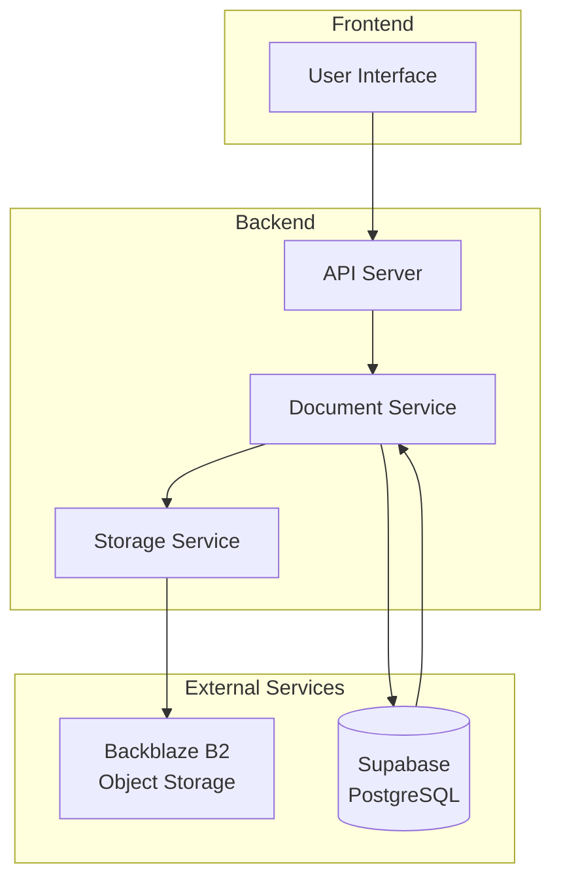
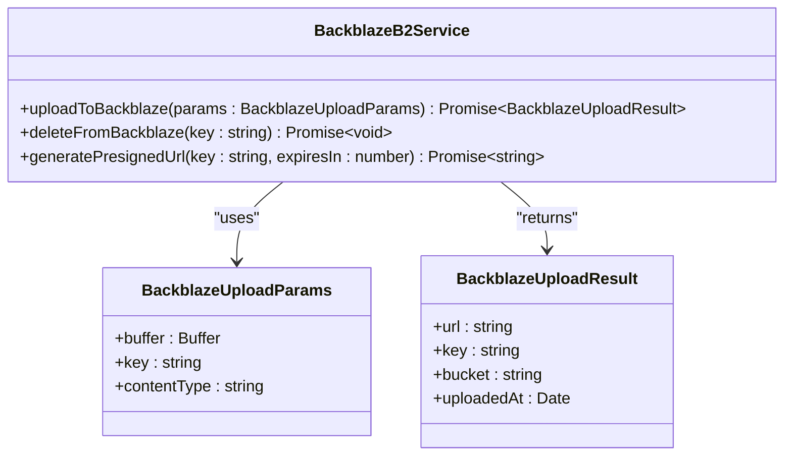
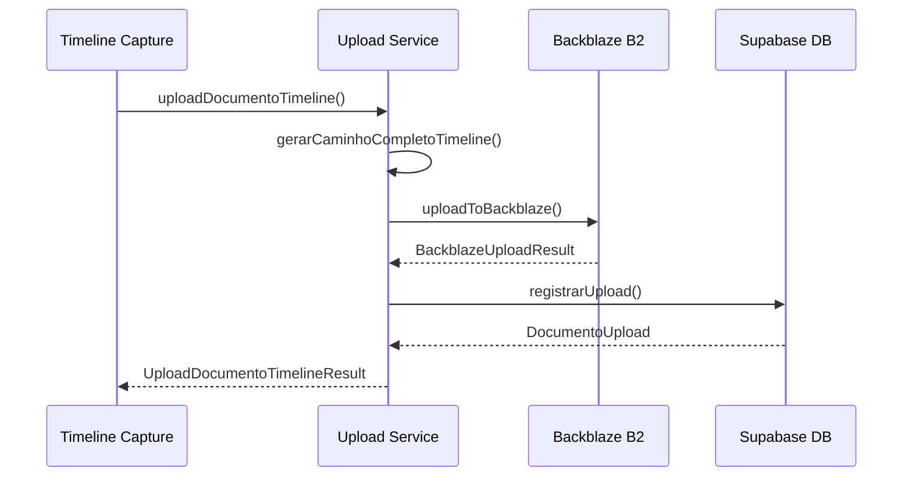
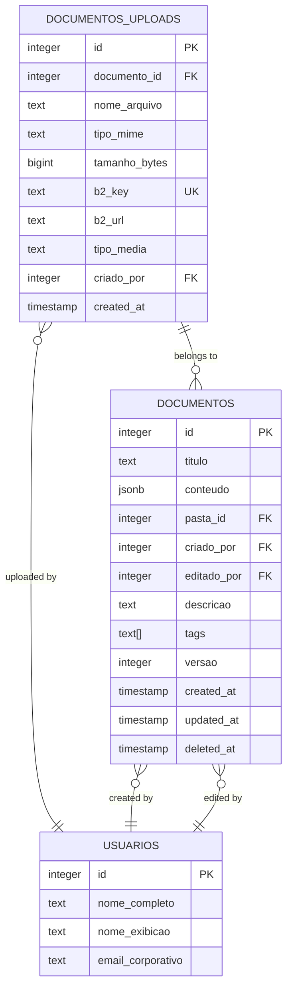
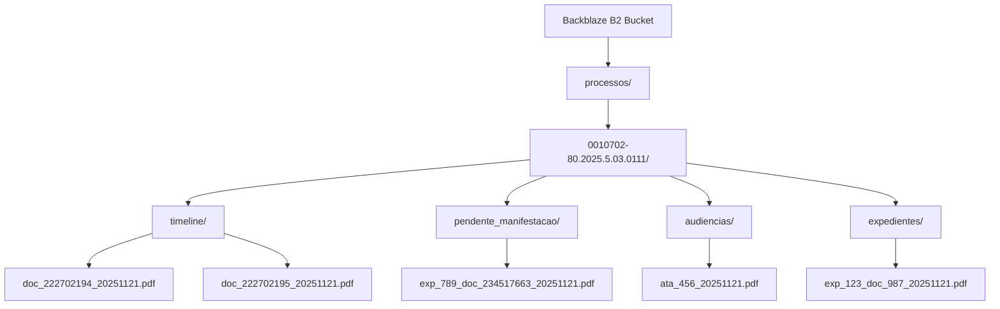
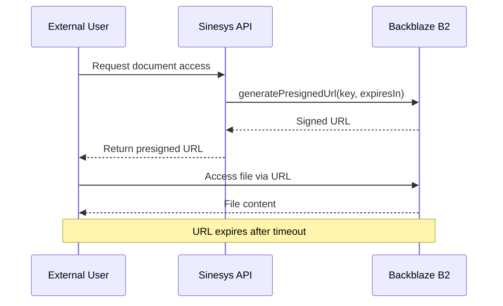

# Storage Integration

<cite>
**Referenced Files in This Document**   
- [backblaze-b2.service.ts](file://backend/storage/backblaze-b2.service.ts)
- [file-naming.utils.ts](file://backend/storage/file-naming.utils.ts)
- [b2-upload.service.ts](file://backend/documentos/services/upload/b2-upload.service.ts)
- [documentos-persistence.service.ts](file://backend/documentos/services/persistence/documentos-persistence.service.ts)
- [uploads-persistence.service.ts](file://backend/documentos/services/persistence/uploads-persistence.service.ts)
- [MIGRACAO_BACKBLAZE_B2.md](file://backend/storage/MIGRACAO_BACKBLAZE_B2.md)
- [20251121183000_migrate_to_backblaze_b2.sql](file://supabase/migrations/aplicadas/20251121183000_migrate_to_backblaze_b2.sql)
- [upload-documento-timeline.service.ts](file://backend/captura/services/backblaze/upload-documento-timeline.service.ts)
- [timeline.ts](file://backend/types/pje-trt/timeline.ts)
</cite>

## Table of Contents
1. [Introduction](#introduction)
2. [Storage Architecture Overview](#storage-architecture-overview)
3. [Backblaze B2 Implementation](#backblaze-b2-implementation)
4. [Document Upload Process](#document-upload-process)
5. [Database Schema and Metadata Management](#database-schema-and-metadata-management)
6. [File Organization and Naming Strategy](#file-organization-and-naming-strategy)
7. [Presigned URL Generation](#presigned-url-generation)
8. [Error Handling and Retry Mechanisms](#error-handling-and-retry-mechanisms)
9. [Lifecycle Management](#lifecycle-management)
10. [Common Issues and Solutions](#common-issues-and-solutions)

## Introduction

Sinesys implements a robust document persistence system using Backblaze B2 as the primary storage backend. This documentation details the comprehensive storage integration that enables secure, scalable, and reliable document management across the platform. The system was migrated from Google Drive to Backblaze B2 to achieve cost reduction, improved performance, and direct API access without intermediaries.

The storage architecture combines Backblaze B2's S3-compatible API for file storage with Supabase PostgreSQL for metadata management, creating a hybrid system that ensures data durability and efficient retrieval. Documents are organized in a structured hierarchy based on process numbers and document types, with comprehensive metadata tracking and access control.

This integration supports various document types including timeline documents, pending manifestations, hearings, and general documents, each with specific naming conventions and storage paths. The system implements secure access through presigned URLs, proper error handling, and retry mechanisms to ensure data integrity during uploads and retrievals.

**Section sources**
- [MIGRACAO_BACKBLAZE_B2.md](file://backend/storage/MIGRACAO_BACKBLAZE_B2.md)

## Storage Architecture Overview

The storage architecture in Sinesys follows a distributed model where actual document files are stored in Backblaze B2 object storage while metadata is maintained in Supabase PostgreSQL database. This separation of concerns allows for scalable storage of large files while maintaining fast, relational queries on document metadata.

**Diagram sources **
- [backblaze-b2.service.ts](file://backend/storage/backblaze-b2.service.ts)
- [documentos-persistence.service.ts](file://backend/documentos/services/persistence/documentos-persistence.service.ts)

**Section sources**
- [backblaze-b2.service.ts](file://backend/storage/backblaze-b2.service.ts)
- [documentos-persistence.service.ts](file://backend/documentos/services/persistence/documentos-persistence.service.ts)

## Backblaze B2 Implementation

The Backblaze B2 implementation utilizes AWS SDK v3 for S3-compatible API access, providing a reliable interface for file operations. The core service is implemented in `backblaze-b2.service.ts` and exposes functions for uploading, deleting, and generating presigned URLs for document access.

The implementation follows a singleton pattern for the S3 client to optimize connection reuse and performance. Configuration is managed through environment variables including B2_ENDPOINT, B2_REGION, B2_KEY_ID, B2_APPLICATION_KEY, and B2_BUCKET, ensuring secure credential management and deployment flexibility.

**Diagram sources **
- [backblaze-b2.service.ts](file://backend/storage/backblaze-b2.service.ts)

**Section sources**
- [backblaze-b2.service.ts](file://backend/storage/backblaze-b2.service.ts)

## Document Upload Process

The document upload process in Sinesys is designed to handle various document types with specific workflows for different use cases. The system supports both direct uploads and chunked uploads for large files, ensuring reliability and performance.

For timeline documents, the upload process is initiated by the `uploadDocumentoTimeline` service, which takes a PDF buffer, process number, and document ID to create a properly formatted file in the Backblaze B2 storage. The process includes generating a unique file path based on the document type and process number, uploading the file to Backblaze, and recording metadata in the database.

**Diagram sources **
- [upload-documento-timeline.service.ts](file://backend/captura/services/backblaze/upload-documento-timeline.service.ts)
- [backblaze-b2.service.ts](file://backend/storage/backblaze-b2.service.ts)
- [uploads-persistence.service.ts](file://backend/documentos/services/persistence/uploads-persistence.service.ts)

**Section sources**
- [upload-documento-timeline.service.ts](file://backend/captura/services/backblaze/upload-documento-timeline.service.ts)
- [b2-upload.service.ts](file://backend/documentos/services/upload/b2-upload.service.ts)

## Database Schema and Metadata Management

The database schema for document storage is designed to efficiently track document metadata while maintaining referential integrity with the actual files stored in Backblaze B2. The migration from Google Drive to Backblaze B2 introduced new columns to store S3-compatible metadata.

The `pendentes_manifestacao` table (and similar tables) includes columns for `arquivo_url`, `arquivo_bucket`, and `arquivo_key` to store the public URL, bucket name, and S3 key respectively. These fields replace the previous Google Drive-specific columns, providing a more standardized and flexible storage interface.

**Diagram sources **
- [20251121183000_migrate_to_backblaze_b2.sql](file://supabase/migrations/aplicadas/20251121183000_migrate_to_backblaze_b2.sql)
- [uploads-persistence.service.ts](file://backend/documentos/services/persistence/uploads-persistence.service.ts)
- [documentos-persistence.service.ts](file://backend/documentos/services/persistence/documentos-persistence.service.ts)

**Section sources**
- [20251121183000_migrate_to_backblaze_b2.sql](file://supabase/migrations/aplicadas/20251121183000_migrate_to_backblaze_b2.sql)
- [uploads-persistence.service.ts](file://backend/documentos/services/persistence/uploads-persistence.service.ts)

## File Organization and Naming Strategy

Sinesys implements a structured file organization strategy in Backblaze B2 that follows a hierarchical pattern based on process numbers and document types. This organization ensures logical grouping of related documents and facilitates efficient retrieval and management.

The file structure follows the pattern: `processos/{numeroProcesso}/{tipoOrigem}/{nomeArquivo}` where:
- `numeroProcesso` is the normalized process number (e.g., 0010702-80.2025.5.03.0111)
- `tipoOrigem` is the document source type (timeline, pendente_manifestacao, audiencias, expedientes)
- `nomeArquivo` follows type-specific naming conventions with document IDs and timestamps

**Diagram sources **
- [file-naming.utils.ts](file://backend/storage/file-naming.utils.ts)
- [MIGRACAO_BACKBLAZE_B2.md](file://backend/storage/MIGRACAO_BACKBLAZE_B2.md)

**Section sources**
- [file-naming.utils.ts](file://backend/storage/file-naming.utils.ts)

## Presigned URL Generation

The system implements secure document access through presigned URL generation, allowing temporary access to private files stored in Backblaze B2. This approach enhances security by avoiding the need to make buckets publicly accessible while still enabling controlled file sharing.

The `generatePresignedUrl` function creates time-limited URLs that expire after a configurable period (default 3600 seconds). This feature is particularly useful for sharing documents with clients or external parties without compromising the overall security of the storage system.

**Diagram sources **
- [backblaze-b2.service.ts](file://backend/storage/backblaze-b2.service.ts)

**Section sources**
- [backblaze-b2.service.ts](file://backend/storage/backblaze-b2.service.ts)

## Error Handling and Retry Mechanisms

The storage integration implements comprehensive error handling to ensure reliability during file operations. All critical functions include try-catch blocks with detailed error logging and meaningful error messages that aid in troubleshooting.

For upload operations, the system captures and logs relevant information including file size, content type, and upload duration. In case of failures, descriptive error messages are returned, indicating whether the issue is related to configuration, network connectivity, or storage service availability.

The implementation follows a fail-fast approach for configuration errors (such as missing environment variables) while gracefully handling transient service issues. This ensures that systemic problems are identified immediately during deployment, while temporary network issues don't disrupt the overall system functionality.

**Section sources**
- [backblaze-b2.service.ts](file://backend/storage/backblaze-b2.service.ts)
- [b2-upload.service.ts](file://backend/documentos/services/upload/b2-upload.service.ts)

## Lifecycle Management

Document lifecycle management in Sinesys encompasses the entire journey from creation to archiving, with proper handling of document states and transitions. The system implements soft deletion for documents, allowing for restoration when needed, while also supporting permanent deletion when required.

The lifecycle is tracked through database fields such as `deleted_at` which indicates when a document was soft-deleted, and version numbers that increment with each modification. This approach enables audit trails and version control while maintaining data integrity.

Document uploads are also tracked through the `documentos_uploads` table, which maintains a record of all file uploads associated with documents, including file size, MIME type, and storage location. This allows for comprehensive tracking of document attachments and their storage characteristics.

**Section sources**
- [documentos-persistence.service.ts](file://backend/documentos/services/persistence/documentos-persistence.service.ts)
- [uploads-persistence.service.ts](file://backend/documentos/services/persistence/uploads-persistence.service.ts)

## Common Issues and Solutions

Several common issues have been identified and addressed in the storage integration:

1. **Configuration Errors**: Missing environment variables are validated at service initialization, with clear error messages indicating which variables are required.

2. **Access Denied**: Issues with upload permissions are typically resolved by verifying that the application key has write permissions on the bucket and that the bucket exists and is accessible.

3. **URL Accessibility**: If generated URLs don't work, the solution involves checking bucket public access settings and verifying the endpoint configuration matches the bucket's region.

4. **File Not Found**: When documents don't appear in Backblaze, the troubleshooting steps include checking upload logs, verifying the key path, and confirming account permissions.

The migration documentation provides detailed troubleshooting guidance for these and other potential issues, ensuring smooth operation and quick resolution of problems.

**Section sources**
- [MIGRACAO_BACKBLAZE_B2.md](file://backend/storage/MIGRACAO_BACKBLAZE_B2.md)
- [backblaze-b2.service.ts](file://backend/storage/backblaze-b2.service.ts)