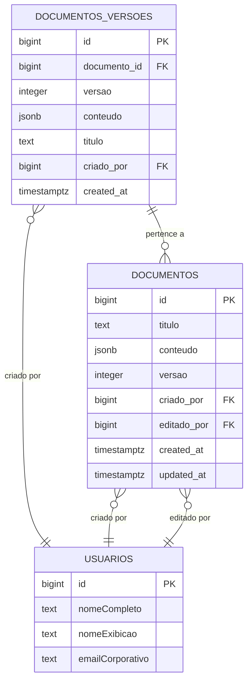
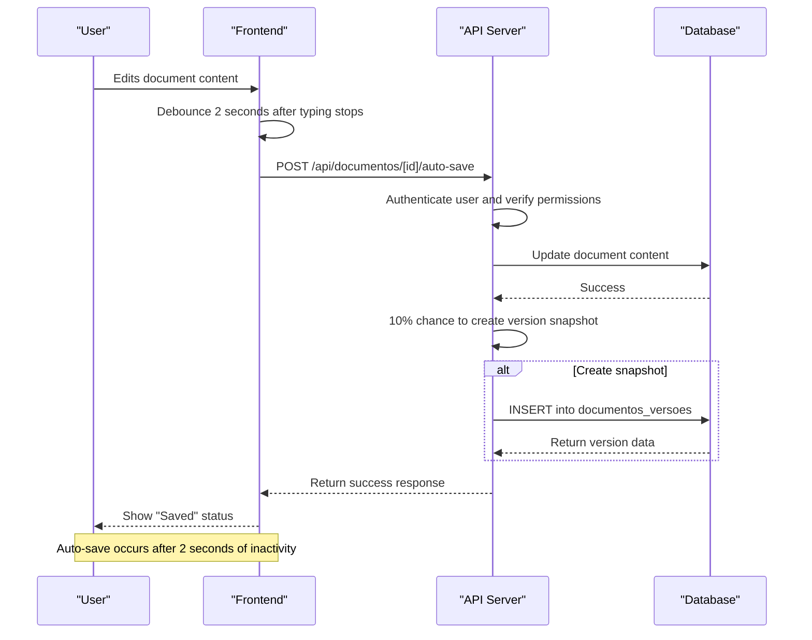
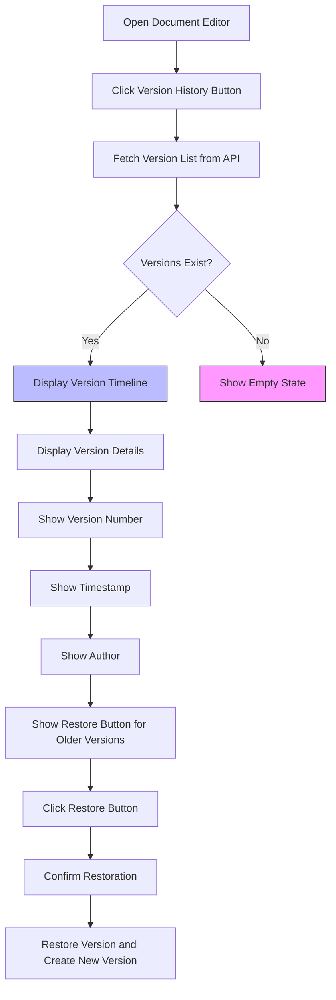
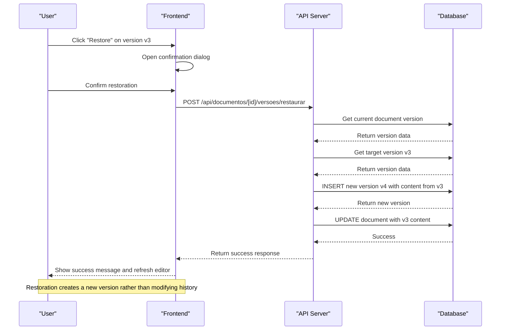
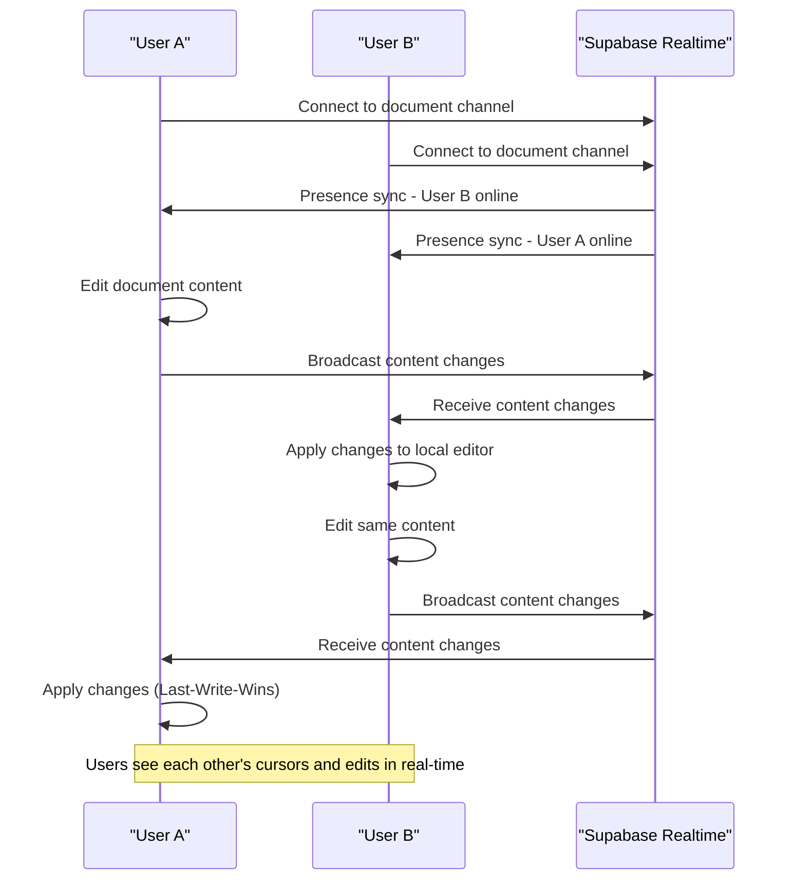

# Version Control

<cite>
**Referenced Files in This Document**   
- [versoes-persistence.service.ts](file://backend/documentos/services/persistence/versoes-persistence.service.ts)
- [documentos_versoes.sql](file://supabase/migrations/aplicadas/20251130220000_create_documentos_system.sql)
- [types.ts](file://backend/types/documentos/types.ts)
- [version-history-dialog.tsx](file://components/documentos/version-history-dialog.tsx)
- [auto-save/route.ts](file://app/api/documentos/[id]/auto-save/route.ts)
- [document-editor.tsx](file://components/documentos/document-editor.tsx)
- [design.md](file://openspec/changes/archive/2025-12-05-add-document-editor-system/design.md)
</cite>

## Table of Contents
1. [Introduction](#introduction)
2. [Database Schema for Version History](#database-schema-for-version-history)
3. [Version Creation and Auto-Save Mechanism](#version-creation-and-auto-save-mechanism)
4. [User Interface for Version History](#user-interface-for-version-history)
5. [Version Restoration and Comparison](#version-restoration-and-comparison)
6. [Conflict Resolution in Collaborative Editing](#conflict-resolution-in-collaborative-editing)
7. [Storage Optimization and Version Cleanup](#storage-optimization-and-version-cleanup)
8. [Conclusion](#conclusion)

## Introduction
The Sinesys version control system provides comprehensive document versioning capabilities that track all changes and enable reverting to previous states. This system is designed to support collaborative editing while maintaining a complete history of document modifications. The implementation includes automatic version creation, a user-friendly interface for browsing version history, and mechanisms for comparing differences between versions. The system also addresses challenges related to storage overhead and concurrent editing conflicts, ensuring reliable document management in a multi-user environment.

## Database Schema for Version History

The version control system is built around the `documentos_versoes` table, which stores the complete history of document versions. This table maintains immutable snapshots of document content at various points in time, allowing for full audit trails and easy restoration of previous states.



**Diagram sources**
- [documentos_versoes.sql](file://supabase/migrations/aplicadas/20251130220000_create_documentos_system.sql#L208-L236)
- [types.ts](file://backend/types/documentos/types.ts#L333-L341)

The `documentos_versoes` table has the following key columns:
- **id**: Primary key, auto-generated identifier for each version
- **documento_id**: Foreign key referencing the document this version belongs to
- **versao**: Sequential version number (1, 2, 3, etc.) for the document
- **conteudo**: JSONB field storing the complete document content in Plate.js format
- **titulo**: Text field storing the document title at the time of version creation
- **criado_por**: Foreign key referencing the user who created this version
- **created_at**: Timestamp of when the version was created

The table includes important constraints:
- `documentos_versoes_versao_positive`: Ensures version numbers are positive
- `documentos_versoes_unique`: Ensures each document cannot have duplicate version numbers

**Section sources**
- [documentos_versoes.sql](file://supabase/migrations/aplicadas/20251130220000_create_documentos_system.sql#L208-L236)
- [types.ts](file://backend/types/documentos/types.ts#L333-L372)

## Version Creation and Auto-Save Mechanism

The version control system implements an intelligent auto-save mechanism that balances frequent saving with efficient storage usage. The system creates versions automatically based on user activity patterns, ensuring document changes are preserved without overwhelming the database with excessive version records.



**Diagram sources**
- [auto-save/route.ts](file://app/api/documentos/[id]/auto-save/route.ts#L1-L106)
- [document-editor.tsx](file://components/documentos/document-editor.tsx#L147-L201)

The auto-save process works as follows:
1. The frontend detects when the user stops typing for 2 seconds (debounced)
2. It sends a POST request to the `/api/documentos/[id]/auto-save` endpoint
3. The API authenticates the user and verifies edit permissions
4. The document content is updated in the main `documentos` table
5. With a 10% probability, a version snapshot is created in the `documentos_versoes` table

This probabilistic approach to version creation ensures that versions are created regularly without generating excessive storage overhead. The system uses a random probability rather than a time-based interval to avoid synchronized version creation across multiple documents.

The backend service for creating versions is implemented in the `criarVersao` function:

```typescript
export async function criarVersao(
  params: CriarVersaoParams,
  usuario_id: number
): Promise<DocumentoVersao> {
  const supabase = createServiceClient();

  const { data, error } = await supabase
    .from('documentos_versoes')
    .insert({
      documento_id: params.documento_id,
      versao: params.versao,
      conteudo: params.conteudo,
      titulo: params.titulo,
      criado_por: usuario_id,
    })
    .select()
    .single();

  if (error) {
    throw new Error(`Erro ao criar versão: ${error.message}`);
  }

  return data;
}
```

**Section sources**
- [auto-save/route.ts](file://app/api/documentos/[id]/auto-save/route.ts#L71-L85)
- [versoes-persistence.service.ts](file://backend/documentos/services/persistence/versoes-persistence.service.ts#L18-L41)

## User Interface for Version History

The version history interface provides users with a clear timeline view of document changes, making it easy to browse through previous versions and understand the evolution of a document over time. The interface is implemented as a dialog component that can be accessed from the document editor.



**Diagram sources**
- [version-history-dialog.tsx](file://components/documentos/version-history-dialog.tsx#L137-L225)
- [document-editor.tsx](file://components/documentos/document-editor.tsx#L300-L327)

The version history dialog displays versions in a vertical timeline format, with the most recent version at the top. Each version entry shows:
- Version number (e.g., "v3")
- Document title
- Timestamp of creation (relative time like "2 hours ago")
- Author name
- Date of creation

For the current version, a "Atual" (Current) badge is displayed. For older versions, a "Restaurar" (Restore) button allows users to revert to that version. When a user clicks the restore button, the system creates a new version with the content from the selected version, preserving the complete history.

The UI handles empty states gracefully, showing a message that explains versions will be saved automatically as the user edits the document.

**Section sources**
- [version-history-dialog.tsx](file://components/documentos/version-history-dialog.tsx#L137-L225)

## Version Restoration and Comparison

The version control system provides robust functionality for restoring previous versions and comparing differences between versions. When a user chooses to restore a previous version, the system creates a new version rather than modifying existing ones, maintaining the immutability of the version history.



**Diagram sources**
- [versoes-persistence.service.ts](file://backend/documentos/services/persistence/versoes-persistence.service.ts#L210-L267)
- [version-history-dialog.tsx](file://components/documentos/version-history-dialog.tsx#L203-L215)

The restoration process is implemented in the `restaurarVersao` function:

```typescript
export async function restaurarVersao(
  documento_id: number,
  versao_numero: number,
  usuario_id: number
): Promise<{ nova_versao: DocumentoVersao; documento_atualizado: boolean }> {
  // Buscar versão a ser restaurada
  const versaoAntiga = await buscarVersaoPorNumero(documento_id, versao_numero);
  
  // Buscar versão atual do documento
  const { data: documentoAtual } = await supabase
    .from('documentos')
    .select('versao, titulo')
    .eq('id', documento_id)
    .single();
  
  const novaVersaoNumero = documentoAtual.versao + 1;
  
  // Criar nova versão com conteúdo da versão antiga
  const novaVersao = await criarVersao(
    {
      documento_id,
      versao: novaVersaoNumero,
      conteudo: versaoAntiga.conteudo,
      titulo: versaoAntiga.titulo,
    },
    usuario_id
  );
  
  // Atualizar documento principal
  const { error: updateError } = await supabase
    .from('documentos')
    .update({
      conteudo: versaoAntiga.conteudo,
      titulo: versaoAntiga.titulo,
      versao: novaVersaoNumero,
      editado_por: usuario_id,
      editado_em: new Date().toISOString(),
    })
    .eq('id', documento_id);
  
  return {
    nova_versao: novaVersao,
    documento_atualizado: true,
  };
}
```

The system also provides functionality to compare two versions of a document through the `compararVersoes` function, which retrieves both versions from the database and returns them for comparison in the UI.

**Section sources**
- [versoes-persistence.service.ts](file://backend/documentos/services/persistence/versoes-persistence.service.ts#L210-L267)
- [versoes-persistence.service.ts](file://backend/documentos/services/persistence/versoes-persistence.service.ts#L272-L297)

## Conflict Resolution in Collaborative Editing

The Sinesys system supports real-time collaborative editing, allowing multiple users to work on the same document simultaneously. To handle potential conflicts when multiple users edit the same document, the system implements a Last-Write-Wins (LWW) synchronization strategy with operational awareness.



**Diagram sources**
- [design.md](file://openspec/changes/archive/2025-12-05-add-document-editor-system/design.md#L492-L546)
- [collaborative-plate-editor.tsx](file://components/plate/collaborative-plate-editor.tsx#L72-L151)

The collaboration system is built on Supabase Realtime with the following components:
- **Presence tracking**: Shows which users are currently viewing or editing the document
- **Broadcast channels**: Transmit content changes, cursor positions, and selection states
- **Yjs CRDT**: Implements conflict-free replicated data type for text synchronization

The system uses the Last-Write-Wins strategy, where the most recent edit overwrites previous ones. This approach is suitable for the rich text editor (Plate.js) used in Sinesys, as it provides predictable behavior and avoids complex merge conflicts. When conflicts occur, the system displays a notification to inform users that another user has made changes.

Users can see each other's presence through the collaborators avatars component, which displays the avatars of all users currently editing the document. Each user's cursor position is also visible to others, with the user's name displayed next to their cursor.

**Section sources**
- [design.md](file://openspec/changes/archive/2025-12-05-add-document-editor-system/design.md#L492-L546)
- [collaborative-plate-editor.tsx](file://components/plate/collaborative-plate-editor.tsx#L72-L151)
- [use-realtime-collaboration.ts](file://hooks/use-realtime-collaboration.ts#L1-L128)

## Storage Optimization and Version Cleanup

To address the challenge of storage overhead for documents with frequent edits, the version control system implements automatic version cleanup policies. These policies ensure that the system maintains a manageable number of versions while preserving important historical states.

The system provides a `limparVersoesAntigas` function that removes older versions while keeping a specified number of the most recent versions:

```typescript
export async function limparVersoesAntigas(
  documento_id: number,
  manter_ultimas_n = 10
): Promise<number> {
  const supabase = createServiceClient();

  // Buscar IDs das versões a manter
  const { data: versoesRecentes } = await supabase
    .from('documentos_versoes')
    .select('id')
    .eq('documento_id', documento_id)
    .order('versao', { ascending: false })
    .limit(manter_ultimas_n);

  if (!versoesRecentes || versoesRecentes.length === 0) {
    return 0;
  }

  const idsParaManter = versoesRecentes.map((v) => v.id);

  // Deletar versões não mantidas
  const { count, error } = await supabase
    .from('documentos_versoes')
    .delete({ count: 'exact' })
    .eq('documento_id', documento_id)
    .not('id', 'in', `(${idsParaManter.join(',')})`);

  if (error) {
    throw new Error(`Erro ao limpar versões antigas: ${error.message}`);
  }

  return count ?? 0;
}
```

This function can be called periodically to clean up old versions, keeping only the N most recent versions (defaulting to 10). The cleanup process is efficient, using a single database query to delete multiple versions at once.

Additionally, the system's probabilistic auto-save approach (creating versions with 10% probability) naturally limits the number of versions created, reducing storage overhead without compromising the ability to recover from accidental changes.

The database also includes indexes on the `documentos_versoes` table to optimize query performance:
- `idx_documentos_versoes_documento_id`: Index on documento_id for efficient version listing
- `idx_documentos_versoes_created_at`: Index on created_at for time-based queries

**Section sources**
- [versoes-persistence.service.ts](file://backend/documentos/services/persistence/versoes-persistence.service.ts#L364-L395)
- [documentos_versoes.sql](file://supabase/migrations/aplicadas/20251130220000_create_documentos_system.sql#L230-L232)

## Conclusion
The Sinesys version control system provides a comprehensive solution for document versioning that balances functionality, usability, and performance. By implementing automatic version creation with intelligent sampling, a clear user interface for browsing history, and robust restoration capabilities, the system ensures that users can track changes and recover from mistakes effectively. The integration with real-time collaboration features allows multiple users to work together while maintaining document integrity through conflict resolution mechanisms. Storage optimization techniques prevent excessive database growth while preserving important historical states. This implementation demonstrates a thoughtful approach to version control that meets the needs of a modern collaborative document management system.