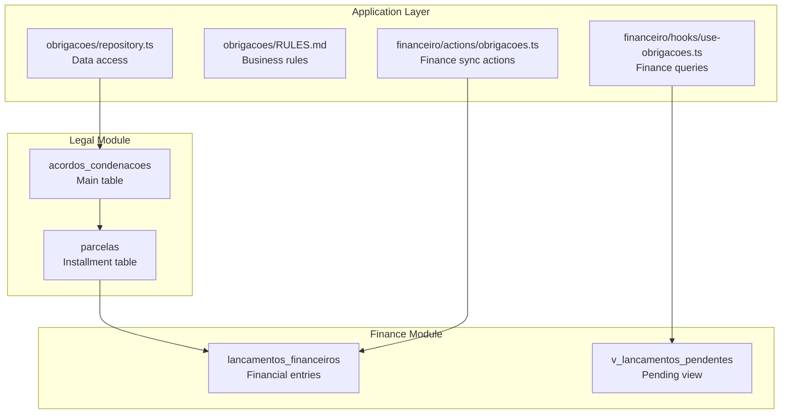
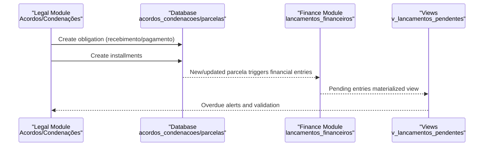
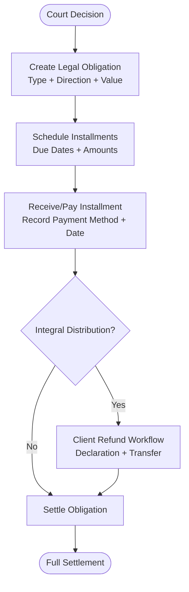
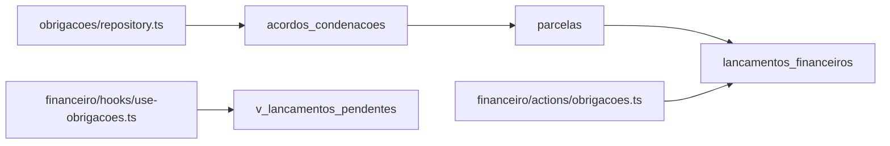

# Acordos and Condenações Management

<cite>
**Referenced Files in This Document**
- [20250118120000_create_acordos_condenacoes.sql](file://supabase/migrations/20250118120000_create_acordos_condenacoes.sql)
- [20250118120001_create_parcelas.sql](file://supabase/migrations/20250118120001_create_parcelas.sql)
- [20_acordos_condenacoes.sql](file://supabase/schemas/20_acordos_condenacoes.sql)
- [29_lancamentos_financeiros.sql](file://supabase/schemas/29_lancamentos_financeiros.sql)
- [33_financeiro_functions.sql](file://supabase/schemas/33_financeiro_functions.sql)
- [34_financeiro_views.sql](file://supabase/schemas/34_financeiro_views.sql)
- [obrigacoes/README.md](file://src/app/(authenticated)/obrigacoes/README.md)
- [obrigacoes/RULES.md](file://src/app/(authenticated)/obrigacoes/RULES.md)
- [obrigacoes/repository.ts](file://src/app/(authenticated)/obrigacoes/repository.ts)
- [financeiro/actions/obrigacoes.ts](file://src/app/(authenticated)/financeiro/actions/obrigacoes.ts)
- [financeiro/hooks/use-obrigacoes.ts](file://src/app/(authenticated)/financeiro/hooks/use-obrigacoes.ts)
- [financeiro/services/obrigacoes-validacao.ts](file://src/app/(authenticated)/financeiro/services/obrigacoes-validacao.ts)
</cite>

## Table of Contents
1. [Introduction](#introduction)
2. [Project Structure](#project-structure)
3. [Core Components](#core-components)
4. [Architecture Overview](#architecture-overview)
5. [Detailed Component Analysis](#detailed-component-analysis)
6. [Dependency Analysis](#dependency-analysis)
7. [Performance Considerations](#performance-considerations)
8. [Troubleshooting Guide](#troubleshooting-guide)
9. [Conclusion](#conclusion)

## Introduction
This document describes the Acordos and Condenações management system, which tracks legal payment obligations arising from court decisions. It covers the complete lifecycle from court decision capture to payment collection, including receivable management, invoice generation, customer billing, integration with legal processes, contract management, case timelines, financial reporting, overdue alerts, and accounting system integration.

The system manages three core categories:
- Acordos: Judicially approved agreements (receivable or payable)
- Condenações: Adverse judicial decisions requiring payment (receivable or payable)
- Custas Processuais: Court costs and expenses (always payable)

## Project Structure
The Acordos and Condenações module is implemented as a feature within the authenticated application routes, backed by Supabase database schemas and integrated with the Finance module for accounting and reporting.

**Diagram sources**
- [20250118120000_create_acordos_condenacoes.sql:4-90](file://supabase/migrations/20250118120000_create_acordos_condenacoes.sql#L4-L90)
- [20250118120001_create_parcelas.sql:4-118](file://supabase/migrations/20250118120001_create_parcelas.sql#L4-L118)
- [29_lancamentos_financeiros.sql:16-84](file://supabase/schemas/29_lancamentos_financeiros.sql#L16-L84)
- [34_financeiro_views.sql:14-70](file://supabase/schemas/34_financeiro_views.sql#L14-L70)
- [obrigacoes/repository.ts](file://src/app/(authenticated)/obrigacoes/repository.ts#L175-L219)
- [obrigacoes/RULES.md](file://src/app/(authenticated)/obrigacoes/RULES.md#L146-L175)
- [financeiro/actions/obrigacoes.ts](file://src/app/(authenticated)/financeiro/actions/obrigacoes.ts#L121-L187)
- [financeiro/hooks/use-obrigacoes.ts](file://src/app/(authenticated)/financeiro/hooks/use-obrigacoes.ts#L49-L83)

**Section sources**
- [obrigacoes/README.md](file://src/app/(authenticated)/obrigacoes/README.md#L1-L57)
- [obrigacoes/RULES.md](file://src/app/(authenticated)/obrigacoes/RULES.md#L1-L50)

## Core Components
- **Acordos e Condenações (acordos_condenacoes)**: Central entity storing legal obligations linked to unified case records. Supports receivables (recebimento) and payables (pagamento), with configurable distribution modes and honorarium calculations.
- **Parcelas**: Individual installment records with editable principal amounts, calculated contractual fees, status tracking, payment method details, and optional client refund workflow.
- **Integração Financeira**: Automatic synchronization of legal obligations to financial entries, enabling invoice generation, receivable/payable tracking, and accounting reconciliation.
- **Alertas e Acompanhamento**: Overdue alerts, pending client refund tracking, and validation of legal-financial consistency.

Key capabilities:
- Legal decision → Receivable/ Payable creation
- Installment scheduling → Payment tracking
- Client refund workflow (integral distribution)
- Accounting integration (contas a receber/pagar)
- Financial reporting (DRE, fluxo de caixa)

**Section sources**
- [20250118120000_create_acordos_condenacoes.sql:4-90](file://supabase/migrations/20250118120000_create_acordos_condenacoes.sql#L4-L90)
- [20250118120001_create_parcelas.sql:4-118](file://supabase/migrations/20250118120001_create_parcelas.sql#L4-L118)
- [obrigacoes/RULES.md](file://src/app/(authenticated)/obrigacoes/RULES.md#L146-L175)

## Architecture Overview
The system follows a legal-juridical module with automatic financial synchronization. Legal obligations are created from court decisions and automatically mirrored as financial entries. The Finance module handles invoicing, receivable/payable tracking, and reporting.

**Diagram sources**
- [20250118120000_create_acordos_condenacoes.sql:58-62](file://supabase/migrations/20250118120000_create_acordos_condenacoes.sql#L58-L62)
- [20250118120001_create_parcelas.sql:86-90](file://supabase/migrations/20250118120001_create_parcelas.sql#L86-L90)
- [29_lancamentos_financeiros.sql:16-84](file://supabase/schemas/29_lancamentos_financeiros.sql#L16-L84)
- [34_financeiro_views.sql:14-70](file://supabase/schemas/34_financeiro_views.sql#L14-L70)

## Detailed Component Analysis

### Legal Entity: Acordos e Condenações
- Purpose: Store legal obligations linked to unified case records.
- Key attributes:
  - Process linkage (processo_id)
  - Type (acordo, condenacao, custas_processuais)
  - Direction (recebimento or pagamento)
  - Total value, first installment due date, number of installments
  - Distribution mode (integral or dividido) and office percentage
  - Sucumbency fees allocation
  - Status derived from installment statuses

Constraints and policies ensure legal and financial integrity:
- Custas processuais must be payable with single installment
- Integral distribution requires office share; divided distribution requires client share
- Row-level security policies for authenticated access

**Section sources**
- [20250118120000_create_acordos_condenacoes.sql:4-90](file://supabase/migrations/20250118120000_create_acordos_condenacoes.sql#L4-L90)
- [20_acordos_condenacoes.sql:6-41](file://supabase/schemas/20_acordos_condenacoes.sql#L6-L41)

### Installment Management: Parcelas
- Purpose: Track individual payment/installment portions with editable principal amounts and calculated fees.
- Key attributes:
  - Principal amount, sucumbency fees, calculated contractual fees
  - Due date, status (pendente, recebida, paga, atrasado)
  - Payment method and auxiliary data
  - Optional client refund workflow (integral distribution)
  - Audit trail and manual edit flag

Indexes and constraints support efficient queries and data integrity.

**Section sources**
- [20250118120001_create_parcelas.sql:4-118](file://supabase/migrations/20250118120001_create_parcelas.sql#L4-L118)
- [20_acordos_condenacoes.sql:63-128](file://supabase/schemas/20_acordos_condenacoes.sql#L63-L128)

### Financial Integration: Synchronization to Lancamentos
- Purpose: Automatically mirror legal obligations into financial entries for invoicing and accounting.
- Mechanism:
  - Creation of installments generates financial entries
  - Marking installments as received updates financial entries
  - Validation detects inconsistencies (missing entries, mismatched values)
- Financial entry fields:
  - Type, description, amount, dates
  - Status, origin, payment method
  - Bank account, chart of accounts, cost center
  - References to client, contract, agreement, and specific installment
  - Additional metadata and attachments

**Section sources**
- [obrigacoes/RULES.md](file://src/app/(authenticated)/obrigacoes/RULES.md#L146-L175)
- [29_lancamentos_financeiros.sql:16-84](file://supabase/schemas/29_lancamentos_financeiros.sql#L16-L84)

### Overdue Alerts and Validation
- Purpose: Monitor overdue obligations, missing financial entries, and pending client refunds.
- Features:
  - Pending installments grouped by due date
  - Inconsistency detection (legal vs financial)
  - Pending client refund tracking
  - Summary metrics for management dashboards

**Section sources**
- [34_financeiro_views.sql:14-70](file://supabase/schemas/34_financeiro_views.sql#L14-L70)
- [financeiro/actions/obrigacoes.ts](file://src/app/(authenticated)/financeiro/actions/obrigacoes.ts#L121-L187)
- [financeiro/services/obrigacoes-validacao.ts](file://src/app/(authenticated)/financeiro/services/obrigacoes-validacao.ts#L198-L245)

### Receivable Lifecycle: From Decision to Settlement

**Diagram sources**
- [obrigacoes/RULES.md](file://src/app/(authenticated)/obrigacoes/RULES.md#L95-L132)
- [20250118120001_create_parcelas.sql:28-54](file://supabase/migrations/20250118120001_create_parcelas.sql#L28-L54)

### Practical Examples

#### Example 1: Creating a Receivable from a Condemnation
- Scenario: A favorable judgment creates a receivable for the law firm.
- Steps:
  - Create obligation with type "condenacao", direction "recebimento"
  - Define total value, first due date, and number of installments
  - System schedules installments; financial entries are generated
  - Track installments until full settlement

**Section sources**
- [obrigacoes/RULES.md](file://src/app/(authenticated)/obrigacoes/RULES.md#L52-L70)
- [20250118120000_create_acordos_condenacoes.sql:14-36](file://supabase/migrations/20250118120000_create_acordos_condenacoes.sql#L14-L36)

#### Example 2: Tracking Partial Payments
- Scenario: A receivable is partially paid across multiple installments.
- Steps:
  - Mark installments as "recebida" with effective date
  - Financial entries update to confirmed status
  - Agreement status transitions to "pago_parcial" until full settlement

**Section sources**
- [obrigacoes/RULES.md](file://src/app/(authenticated)/obrigacoes/RULES.md#L133-L147)

#### Example 3: Client Refund Workflow (Integral Distribution)
- Scenario: Office receives full amount but must refund client portion.
- Steps:
  - Installment marked "recebida"
  - Status moves to "pendente_declaracao" awaiting client declaration
  - After declaration upload, move to "pendente_transferencia"
  - Upon transfer receipt, mark as "repassado"

**Section sources**
- [obrigacoes/RULES.md](file://src/app/(authenticated)/obrigacoes/RULES.md#L115-L132)
- [20250118120001_create_parcelas.sql:28-54](file://supabase/migrations/20250118120001_create_parcelas.sql#L28-L54)

### Integration with Contract Management and Case Timelines
- Legal obligations are linked to unified case records, ensuring alignment with contract management and timeline tracking.
- The repository layer exposes joins to case metadata for context-aware views and reporting.

**Section sources**
- [obrigacoes/repository.ts](file://src/app/(authenticated)/obrigacoes/repository.ts#L201-L219)

### Financial Reporting and Accounting Integration
- Financial entries are categorized by chart of accounts, cost centers, and origins (e.g., acordo_judicial).
- Materialized views support DRE and cash flow reporting.
- Automatic triggers update bank balances and generate contra-entries for transfers.

**Section sources**
- [29_lancamentos_financeiros.sql:16-84](file://supabase/schemas/29_lancamentos_financeiros.sql#L16-L84)
- [33_financeiro_functions.sql:59-114](file://supabase/schemas/33_financeiro_functions.sql#L59-L114)
- [34_financeiro_views.sql:409-471](file://supabase/schemas/34_financeiro_views.sql#L409-L471)

## Dependency Analysis

**Diagram sources**
- [20250118120000_create_acordos_condenacoes.sql:6-7](file://supabase/migrations/20250118120000_create_acordos_condenacoes.sql#L6-L7)
- [20250118120001_create_parcelas.sql:6-7](file://supabase/migrations/20250118120001_create_parcelas.sql#L6-L7)
- [29_lancamentos_financeiros.sql:52-53](file://supabase/schemas/29_lancamentos_financeiros.sql#L52-L53)
- [34_financeiro_views.sql:14-70](file://supabase/schemas/34_financeiro_views.sql#L14-L70)

**Section sources**
- [obrigacoes/repository.ts](file://src/app/(authenticated)/obrigacoes/repository.ts#L175-L219)
- [financeiro/actions/obrigacoes.ts](file://src/app/(authenticated)/financeiro/actions/obrigacoes.ts#L121-L187)

## Performance Considerations
- Indexes on frequently filtered columns (status, due date, type, direction) improve query performance.
- Materialized views reduce aggregation overhead for reporting.
- Triggers handle financial updates efficiently but should be monitored for heavy write loads.

## Troubleshooting Guide
Common issues and resolutions:
- **Missing Financial Entries**: Use validation actions to detect and alert on legal-financial mismatches.
- **Overdue Installments**: Review pending entries view and overdue alerts to prioritize collections.
- **Client Refund Delays**: Monitor pending refund statuses and require required documentation uploads.
- **Data Integrity**: Ensure installments meet constraints (payment method, effective date) before marking as received.

**Section sources**
- [financeiro/actions/obrigacoes.ts](file://src/app/(authenticated)/financeiro/actions/obrigacoes.ts#L121-L187)
- [financeiro/services/obrigacoes-validacao.ts](file://src/app/(authenticated)/financeiro/services/obrigacoes-validacao.ts#L198-L245)

## Conclusion
The Acordos and Condenações management system provides a robust framework for tracking legal payment obligations from court decisions to full settlement. Its integration with the Finance module ensures accurate invoicing, receivable/payable tracking, and comprehensive reporting. The system supports both automated workflows and manual controls, with strong validation and alerting mechanisms to maintain data integrity and operational efficiency.