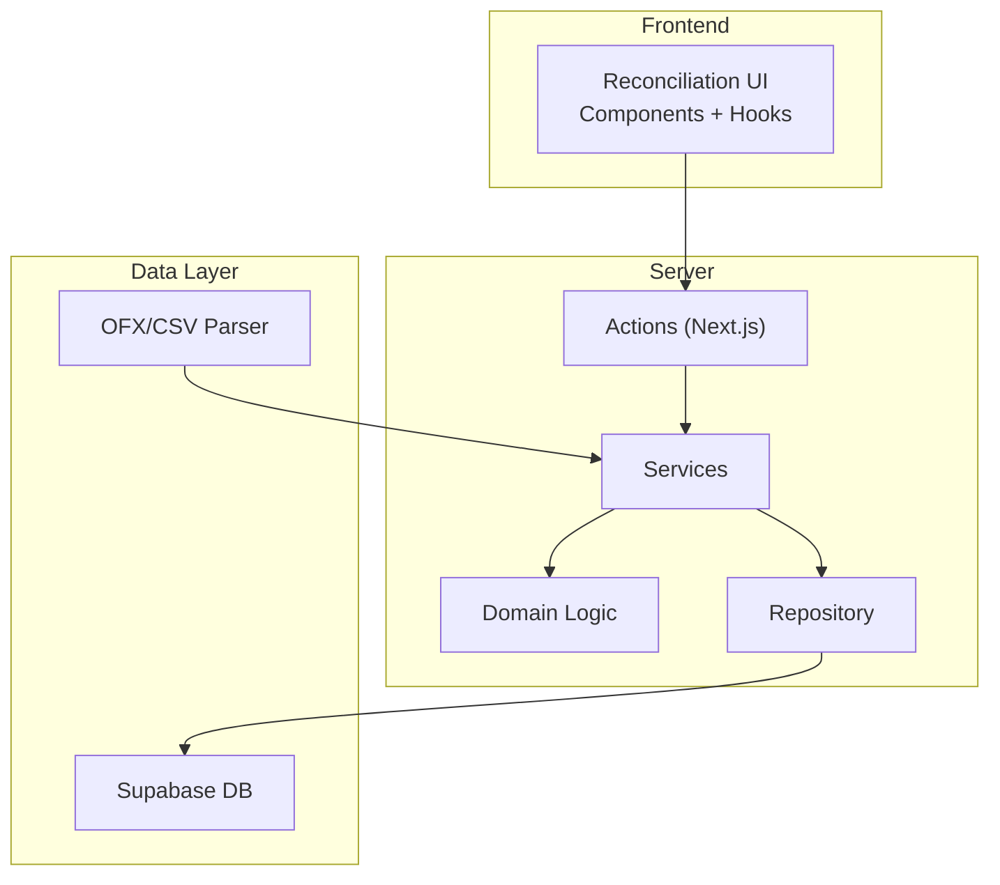
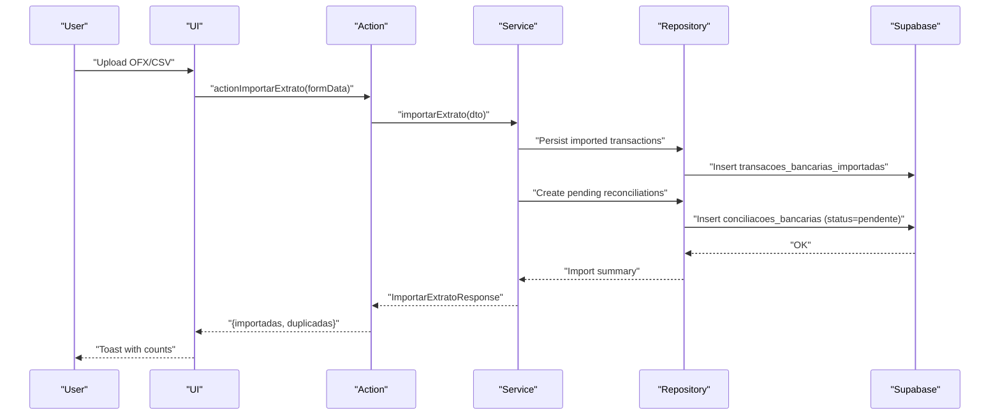
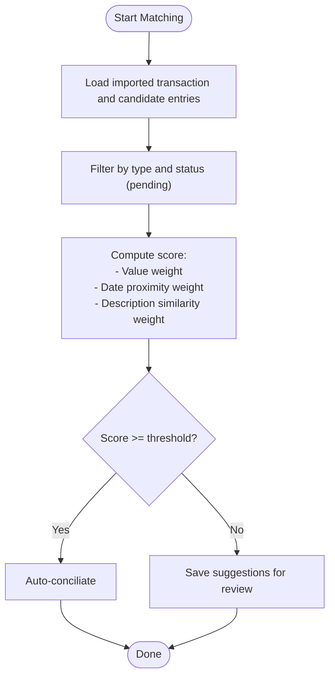
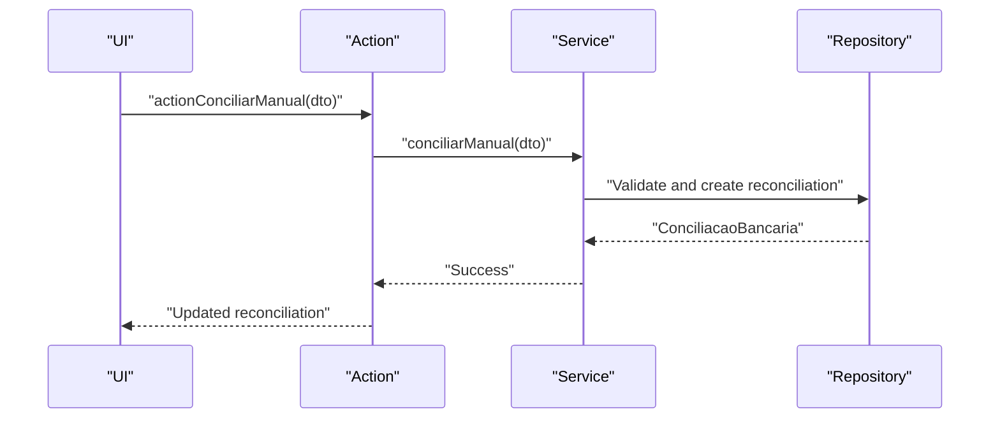
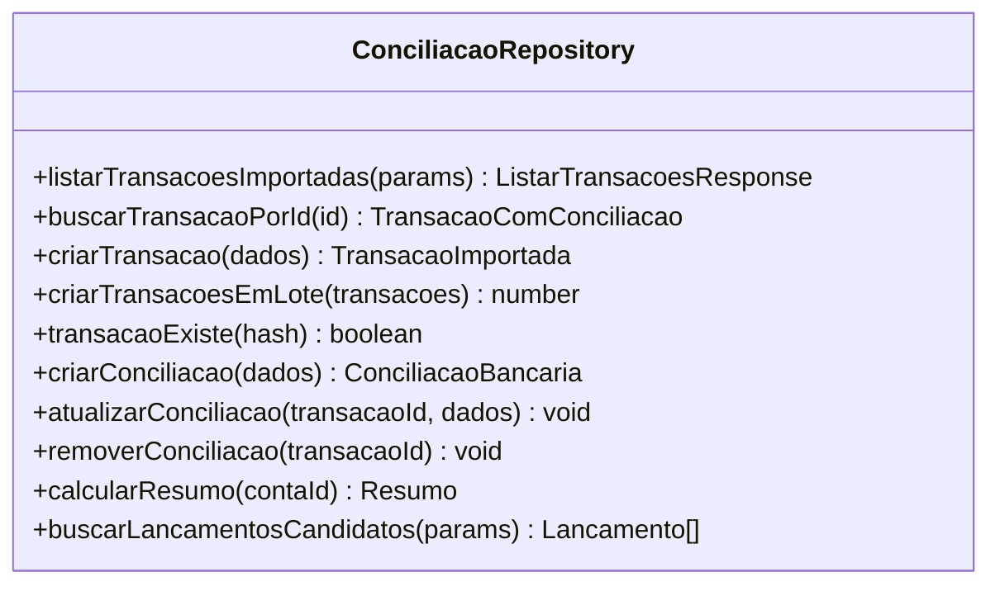
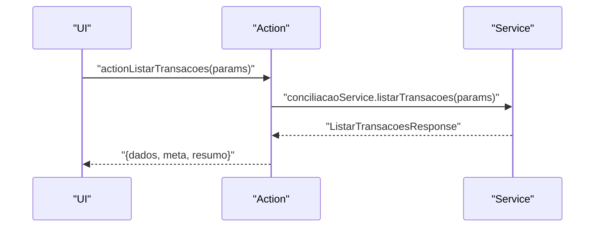
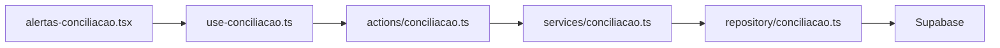
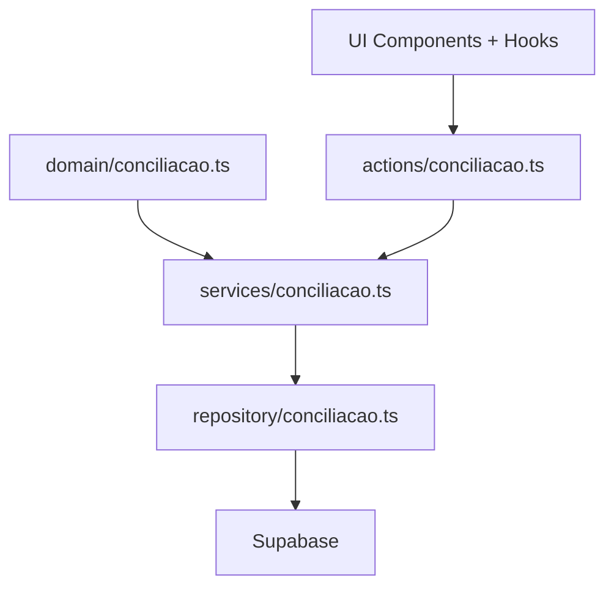
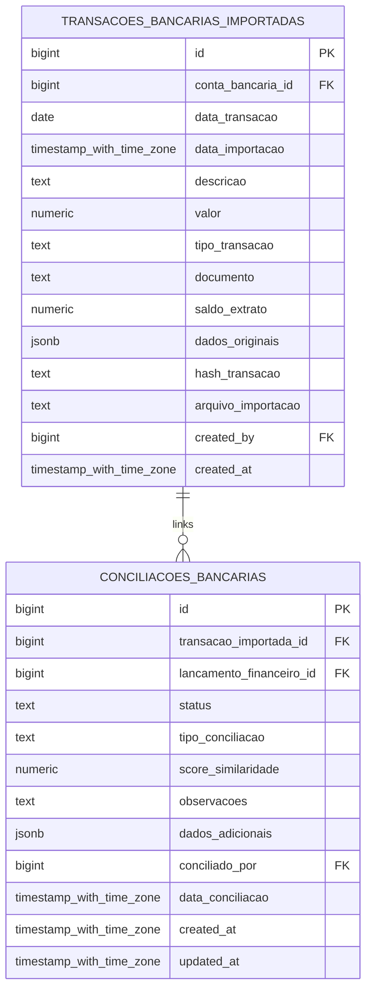

# Bank Reconciliation System

<cite>
**Referenced Files in This Document**
- [20251206000000_create_conciliacao_bancaria_tables.sql](file://supabase/migrations/20251206000000_create_conciliacao_bancaria_tables.sql)
- [31_conciliacao_bancaria.sql](file://supabase/schemas/31_conciliacao_bancaria.sql)
- [conciliacao-bancaria.md](file://src/app/(authenticated)/financeiro/docs/conciliacao-bancaria.md)
- [conciliacao.ts](file://src/app/(authenticated)/financeiro/domain/conciliacao.ts)
- [conciliacao.ts](file://src/app/(authenticated)/financeiro/services/conciliacao.ts)
- [conciliacao.ts](file://src/app/(authenticated)/financeiro/repository/conciliacao.ts)
- [conciliacao.ts](file://src/app/(authenticated)/financeiro/actions/conciliacao.ts)
- [alertas-conciliacao.tsx](file://src/app/(authenticated)/financeiro/components/conciliacao/alertas-conciliacao.tsx)
- [use-conciliacao.ts](file://src/app/(authenticated)/financeiro/hooks/use-conciliacao.ts)
- [types/conciliacao.ts](file://src/app/(authenticated)/financeiro/types/conciliacao.ts)
</cite>

## Table of Contents
1. [Introduction](#introduction)
2. [Project Structure](#project-structure)
3. [Core Components](#core-components)
4. [Architecture Overview](#architecture-overview)
5. [Detailed Component Analysis](#detailed-component-analysis)
6. [Dependency Analysis](#dependency-analysis)
7. [Performance Considerations](#performance-considerations)
8. [Troubleshooting Guide](#troubleshooting-guide)
9. [Conclusion](#conclusion)
10. [Appendices](#appendices)

## Introduction
This document describes the Bank Reconciliation System implemented in the project. It covers transaction import from bank statements (OFX/CSV), automated matching against system financial entries, manual reconciliation workflows, exception handling, and reporting. It also outlines integration points with the Supabase backend, the financial ledger, and the frontend UI components.

## Project Structure
The reconciliation feature is organized around a clear separation of concerns:
- Domain: Pure business logic for matching, validation, and scoring
- Services: Orchestration of use cases and coordination between repositories
- Repository: Data access layer interacting with Supabase
- Actions: Next.js Server Actions bridging UI and server-side logic
- UI: React components and hooks for displaying reconciliation status and triggering actions
- Database: Supabase schema and migrations defining tables for imported transactions and reconciliations

**Diagram sources**
- [conciliacao.ts](file://src/app/(authenticated)/financeiro/actions/conciliacao.ts#L15-L39)
- [conciliacao.ts](file://src/app/(authenticated)/financeiro/services/conciliacao.ts#L42-L54)
- [conciliacao.ts](file://src/app/(authenticated)/financeiro/repository/conciliacao.ts#L127-L194)
- [20251206000000_create_conciliacao_bancaria_tables.sql:15-45](file://supabase/migrations/20251206000000_create_conciliacao_bancaria_tables.sql#L15-L45)

**Section sources**
- [conciliacao-bancaria.md](file://src/app/(authenticated)/financeiro/docs/conciliacao-bancaria.md#L6-L8)
- [conciliacao.ts](file://src/app/(authenticated)/financeiro/actions/conciliacao.ts#L1-L125)
- [conciliacao.ts](file://src/app/(authenticated)/financeiro/services/conciliacao.ts#L1-L220)
- [conciliacao.ts](file://src/app/(authenticated)/financeiro/repository/conciliacao.ts#L1-L519)

## Core Components
- Domain model and matching logic define the scoring algorithm, candidate filtering, and validation rules for reconciliation.
- Services encapsulate use cases such as importing statements, generating suggestions, performing manual and automatic reconciliation, and summarizing reconciliation status.
- Repository abstracts database operations for imported transactions, reconciliations, and candidate financial entries.
- Actions expose server functions for UI interactions, including import, reconciliation, and listing.
- UI components present reconciliation summaries, filters, and allow manual reconciliation and suggestion review.

Key responsibilities:
- Transaction import and deduplication via hash
- Automated matching with configurable thresholds
- Manual reconciliation with optional new entry creation
- Reporting and alerts for pending/divergent/ignored items

**Section sources**
- [conciliacao.ts](file://src/app/(authenticated)/financeiro/domain/conciliacao.ts#L187-L230)
- [conciliacao.ts](file://src/app/(authenticated)/financeiro/services/conciliacao.ts#L35-L80)
- [conciliacao.ts](file://src/app/(authenticated)/financeiro/repository/conciliacao.ts#L127-L194)
- [alertas-conciliacao.tsx](file://src/app/(authenticated)/financeiro/components/conciliacao/alertas-conciliacao.tsx#L1-L126)

## Architecture Overview
The system follows a layered architecture:
- UI triggers actions
- Actions call services
- Services apply domain rules and delegate persistence to repository
- Repository persists to Supabase tables for imported transactions and reconciliations
- Matching engine computes similarity scores and proposes matches

**Diagram sources**
- [conciliacao-bancaria.md](file://src/app/(authenticated)/financeiro/docs/conciliacao-bancaria.md#L11-L32)
- [conciliacao.ts](file://src/app/(authenticated)/financeiro/actions/conciliacao.ts#L15-L39)
- [conciliacao.ts](file://src/app/(authenticated)/financeiro/services/conciliacao.ts#L42-L54)
- [20251206000000_create_conciliacao_bancaria_tables.sql:15-45](file://supabase/migrations/20251206000000_create_conciliacao_bancaria_tables.sql#L15-L45)

## Detailed Component Analysis

### Domain Model and Matching Engine
The domain module defines core entities and the reconciliation scoring algorithm:
- Entities: Imported transaction, reconciliation record, suggested matches, and financial entry summaries
- Scoring: Weighted similarity combining value equality/appraisal, date proximity, and textual description similarity
- Candidate filtering: Matches expected transaction type (credit/debit vs income/expense) and status (pending)
- Validation: Prevents reconciliation of already reconciled or ignored items; supports desreconciliation validation

**Diagram sources**
- [conciliacao.ts](file://src/app/(authenticated)/financeiro/domain/conciliacao.ts#L187-L230)
- [conciliacao.ts](file://src/app/(authenticated)/financeiro/domain/conciliacao.ts#L326-L347)
- [conciliacao-bancaria.md](file://src/app/(authenticated)/financeiro/docs/conciliacao-bancaria.md#L34-L59)

**Section sources**
- [conciliacao.ts](file://src/app/(authenticated)/financeiro/domain/conciliacao.ts#L15-L140)
- [conciliacao.ts](file://src/app/(authenticated)/financeiro/domain/conciliacao.ts#L187-L371)

### Services: Use Cases Orchestration
The service layer coordinates:
- Listing imported transactions with pagination, filtering, and summary
- Importing statements (placeholder; parser integration pending)
- Generating suggestions for a given transaction
- Performing manual reconciliation (including ignore/new entry scenarios)
- Executing automatic reconciliation across a date range
- Desreconciliation of previously reconciled items

**Diagram sources**
- [conciliacao.ts](file://src/app/(authenticated)/financeiro/actions/conciliacao.ts#L41-L50)
- [conciliacao.ts](file://src/app/(authenticated)/financeiro/services/conciliacao.ts#L85-L115)
- [conciliacao.ts](file://src/app/(authenticated)/financeiro/repository/conciliacao.ts#L285-L310)

**Section sources**
- [conciliacao.ts](file://src/app/(authenticated)/financeiro/services/conciliacao.ts#L35-L216)

### Repository: Data Access Layer
The repository handles:
- Listing imported transactions with embedded reconciliation and financial entry details
- Creating single or batch imported transactions
- Checking for duplicates via hash
- Creating, updating, and removing reconciliations
- Calculating reconciliation summaries
- Querying candidate financial entries for matching

**Diagram sources**
- [conciliacao.ts](file://src/app/(authenticated)/financeiro/repository/conciliacao.ts#L97-L429)

**Section sources**
- [conciliacao.ts](file://src/app/(authenticated)/financeiro/repository/conciliacao.ts#L127-L429)

### Actions: Server Functions
Actions wrap service calls and handle:
- Importing statements via multipart/form-data
- Manual reconciliation
- Fetching suggestions and candidates
- Listing transactions with pagination and summary
- Desreconciliation

**Diagram sources**
- [conciliacao.ts](file://src/app/(authenticated)/financeiro/actions/conciliacao.ts#L83-L98)
- [conciliacao.ts](file://src/app/(authenticated)/financeiro/services/conciliacao.ts#L35-L37)

**Section sources**
- [conciliacao.ts](file://src/app/(authenticated)/financeiro/actions/conciliacao.ts#L15-L125)

### UI Components and Hooks
- Alert cards display reconciliation summaries (pending, reconciled, divergent, ignored) with click-to-filter support
- SWR-powered hooks manage data fetching, caching, and revalidation for lists, details, and suggestions
- Components render reconciliation status and allow initiating manual reconciliation

**Diagram sources**
- [use-conciliacao.ts](file://src/app/(authenticated)/financeiro/hooks/use-conciliacao.ts#L14-L32)
- [alertas-conciliacao.tsx](file://src/app/(authenticated)/financeiro/components/conciliacao/alertas-conciliacao.tsx#L60-L125)

**Section sources**
- [alertas-conciliacao.tsx](file://src/app/(authenticated)/financeiro/components/conciliacao/alertas-conciliacao.tsx#L1-L126)
- [use-conciliacao.ts](file://src/app/(authenticated)/financeiro/hooks/use-conciliacao.ts#L1-L89)

## Dependency Analysis
- Domain depends on financial entry types and defines pure business rules
- Services depend on domain and repository
- Repository depends on Supabase client and exposes typed records
- Actions depend on services and repository
- UI depends on actions and hooks

**Diagram sources**
- [conciliacao.ts](file://src/app/(authenticated)/financeiro/domain/conciliacao.ts#L1-L371)
- [conciliacao.ts](file://src/app/(authenticated)/financeiro/services/conciliacao.ts#L1-L220)
- [conciliacao.ts](file://src/app/(authenticated)/financeiro/repository/conciliacao.ts#L1-L519)
- [conciliacao.ts](file://src/app/(authenticated)/financeiro/actions/conciliacao.ts#L1-L125)

**Section sources**
- [types/conciliacao.ts](file://src/app/(authenticated)/financeiro/types/conciliacao.ts#L1-L32)

## Performance Considerations
- Indexes on imported transactions: account, date, hash, and JSONB fields to accelerate queries and deduplication
- Unique constraint on active reconciliations per imported transaction to prevent duplicate links
- Pagination and filtering reduce payload sizes during listing
- Candidate filtering narrows down financial entries by type and value/date windows to limit expensive similarity computations

Recommendations:
- Monitor query plans for large datasets
- Consider background jobs for bulk automatic reconciliation
- Cache frequently accessed reconciliation summaries

**Section sources**
- [20251206000000_create_conciliacao_bancaria_tables.sql:67-81](file://supabase/migrations/20251206000000_create_conciliacao_bancaria_tables.sql#L67-L81)
- [31_conciliacao_bancaria.sql:114-126](file://supabase/schemas/31_conciliacao_bancaria.sql#L114-L126)

## Troubleshooting Guide
Common issues and resolutions:
- Import fails or duplicates not detected
  - Verify file encoding and extension
  - Ensure description, amount, and date are consistent; deduplication relies on a composite hash
- No suggestions appear
  - Confirm date window and financial entry status (must be pending)
  - Check that transaction type aligns with expected income/expense
- Manual reconciliation errors
  - Cannot reconcile already reconciled or ignored items
  - Use desreconciliation to unlink before re-linking

**Section sources**
- [conciliacao-bancaria.md](file://src/app/(authenticated)/financeiro/docs/conciliacao-bancaria.md#L72-L76)
- [conciliacao.ts](file://src/app/(authenticated)/financeiro/domain/conciliacao.ts#L259-L288)

## Conclusion
The Bank Reconciliation System provides a robust foundation for importing bank statements, detecting duplicates, suggesting matches, and enabling manual reconciliation. The modular architecture separates concerns clearly, and the domain-driven design ensures maintainable matching logic. Future enhancements can focus on integrating actual statement parsers, implementing automatic reconciliation scheduling, and extending reporting and alerting capabilities.

## Appendices

### Database Schema Overview
Tables involved in reconciliation:
- Imported transactions: stores raw statement data and deduplication hash
- Reconciliations: links imported transactions to financial entries with status and type

**Diagram sources**
- [20251206000000_create_conciliacao_bancaria_tables.sql:15-147](file://supabase/migrations/20251206000000_create_conciliacao_bancaria_tables.sql#L15-L147)
- [31_conciliacao_bancaria.sql:15-147](file://supabase/schemas/31_conciliacao_bancaria.sql#L15-L147)

### Reconciliation Workflow Examples
- Example scenario: Import CSV with multiple transactions; system inserts imported rows and creates pending reconciliations; suggestions computed; user selects best match; system updates reconciliation with status and links financial entry.
- Dispute resolution: If no suitable match exists, user can mark as ignored or create a new financial entry and link manually.

**Section sources**
- [conciliacao-bancaria.md](file://src/app/(authenticated)/financeiro/docs/conciliacao-bancaria.md#L10-L59)