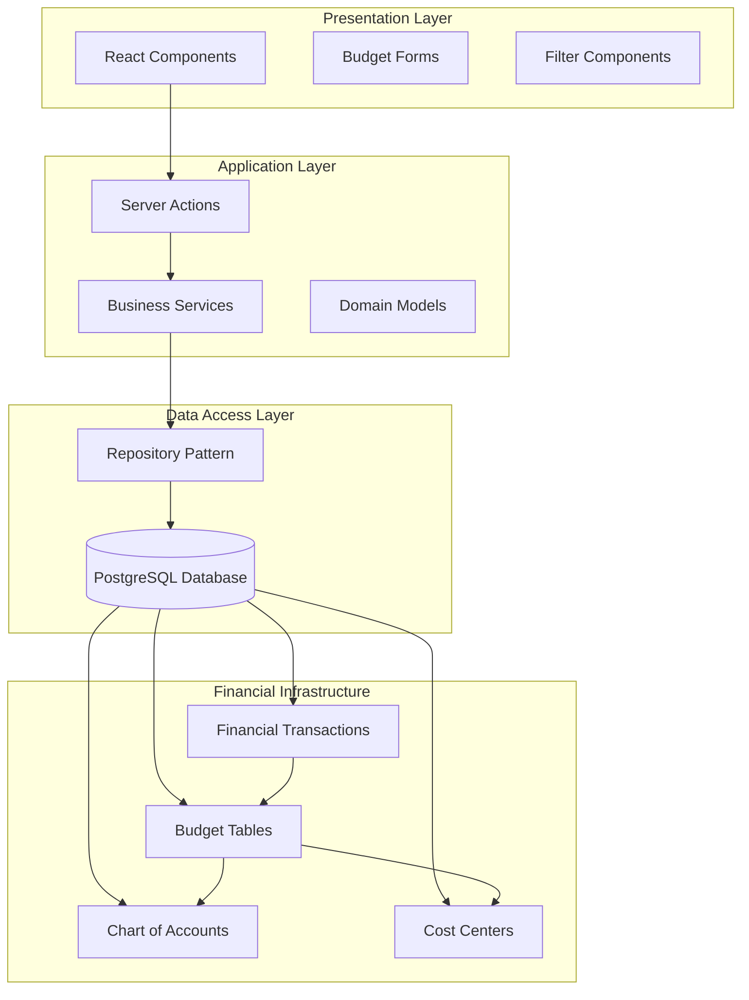
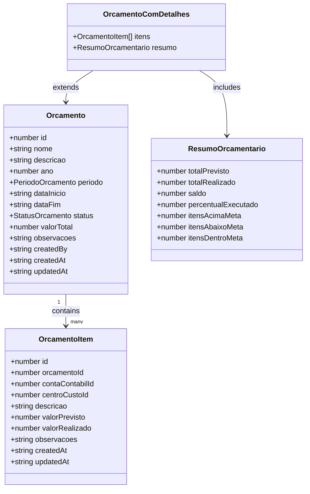
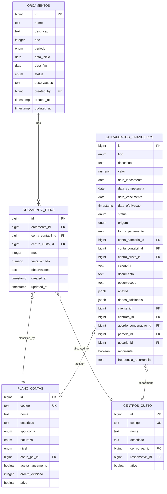
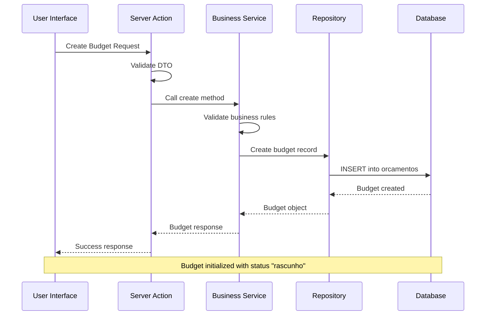
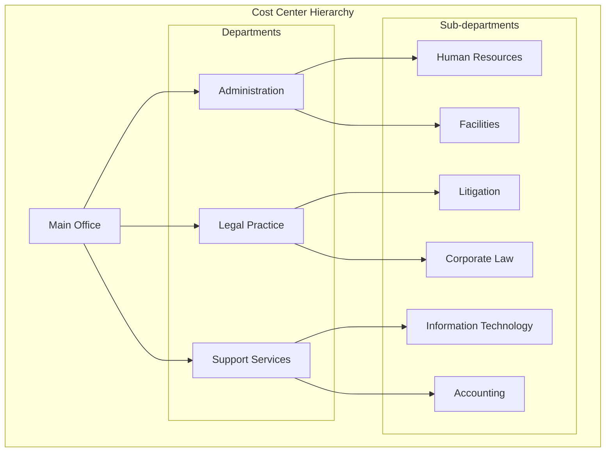
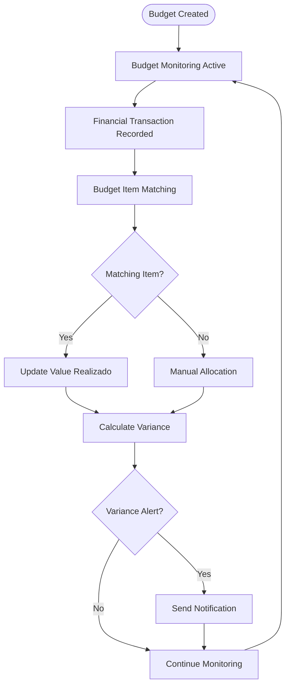
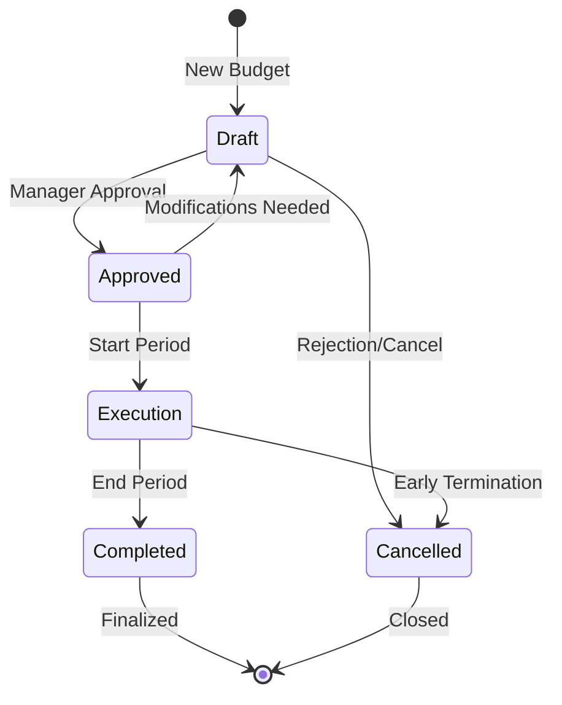
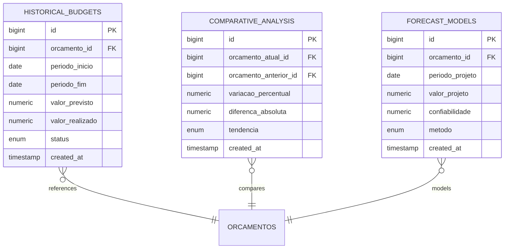
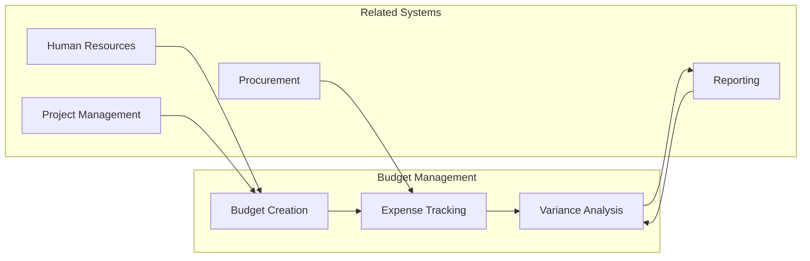

# Budget Management System

<cite>
**Referenced Files in This Document**
- [32_orcamento.sql](file://supabase/schemas/32_orcamento.sql)
- [29_lancamentos_financeiros.sql](file://supabase/schemas/29_lancamentos_financeiros.sql)
- [26_plano_contas.sql](file://supabase/schemas/26_plano_contas.sql)
- [27_centros_custo.sql](file://supabase/schemas/27_centros_custo.sql)
- [orcamentos.ts](file://src/app/(authenticated)/financeiro/domain/orcamentos.ts)
- [orcamentos.ts](file://src/app/(authenticated)/financeiro/repository/orcamentos.ts)
- [orcamentos.ts](file://src/app/(authenticated)/financeiro/services/orcamentos.ts)
- [orcamentos.ts](file://src/app/(authenticated)/financeiro/actions/orcamentos.ts)
- [orcamento-form-dialog.tsx](file://src/app/(authenticated)/financeiro/components/orcamentos/orcamento-form-dialog.tsx)
- [orcamentos-toolbar-filters.tsx](file://src/app/(authenticated)/financeiro/components/orcamentos/orcamentos-toolbar-filters.tsx)
</cite>

## Table of Contents
1. [Introduction](#introduction)
2. [System Architecture](#system-architecture)
3. [Core Components](#core-components)
4. [Budget Creation Workflow](#budget-creation-workflow)
5. [Allocation and Departmental Management](#allocation-and-departmental-management)
6. [Tracking and Expense Integration](#tracking-and-expense-integration)
7. [Approval and Modification Workflows](#approval-and-modification-workflows)
8. [Variance Analysis and Reporting](#variance-analysis-and-reporting)
9. [Historical Comparisons](#historical-comparisons)
10. [Performance Examples](#performance-examples)
11. [Integration with Financial Planning](#integration-with-financial-planning)
12. [Troubleshooting Guide](#troubleshooting-guide)
13. [Conclusion](#conclusion)

## Introduction

The Budget Management System is a comprehensive financial planning solution designed for law offices and legal practices. This system provides end-to-end budget lifecycle management, integrating seamlessly with the broader financial ecosystem including expense tracking, revenue forecasting, and variance analysis.

The system operates on a hierarchical financial structure that supports detailed budget planning by account classification and departmental allocation. It enables organizations to create annual, quarterly, or monthly budgets while maintaining granular control over cost centers and profit centers.

## System Architecture

The Budget Management System follows a layered architecture pattern with clear separation of concerns:



**Diagram sources**
- [orcamentos.ts](file://src/app/(authenticated)/financeiro/actions/orcamentos.ts#L1-L398)
- [orcamentos.ts](file://src/app/(authenticated)/financeiro/services/orcamentos.ts#L1-L248)
- [32_orcamento.sql:1-216](file://supabase/schemas/32_orcamento.sql#L1-L216)

The architecture ensures scalability, maintainability, and clear data flow between components. The system leverages Next.js Server Actions for secure server-side operations while maintaining responsive client interactions.

## Core Components

### Budget Entity Structure

The system defines comprehensive budget entities with detailed financial tracking capabilities:



**Diagram sources**
- [orcamentos.ts](file://src/app/(authenticated)/financeiro/domain/orcamentos.ts#L17-L74)

### Financial Data Model

The system integrates with a comprehensive chart of accounts and cost center hierarchy:



**Diagram sources**
- [32_orcamento.sql:15-114](file://supabase/schemas/32_orcamento.sql#L15-L114)
- [29_lancamentos_financeiros.sql:16-84](file://supabase/schemas/29_lancamentos_financeiros.sql#L16-L84)
- [26_plano_contas.sql:15-48](file://supabase/schemas/26_plano_contas.sql#L15-L48)
- [27_centros_custo.sql:15-40](file://supabase/schemas/27_centros_custo.sql#L15-L40)

**Section sources**
- [orcamentos.ts](file://src/app/(authenticated)/financeiro/domain/orcamentos.ts#L1-L837)
- [32_orcamento.sql:1-216](file://supabase/schemas/32_orcamento.sql#L1-L216)

## Budget Creation Workflow

The budget creation process follows a structured workflow ensuring proper validation and initialization:



**Diagram sources**
- [orcamentos.ts](file://src/app/(authenticated)/financeiro/actions/orcamentos.ts#L98-L125)
- [orcamentos.ts](file://src/app/(authenticated)/financeiro/services/orcamentos.ts#L56-L64)
- [orcamentos.ts](file://src/app/(authenticated)/financeiro/repository/orcamentos.ts#L239-L255)

The workflow ensures data integrity through comprehensive validation at multiple layers, preventing invalid budget configurations from being persisted to the database.

**Section sources**
- [orcamentos.ts](file://src/app/(authenticated)/financeiro/actions/orcamentos.ts#L98-L125)
- [orcamentos.ts](file://src/app/(authenticated)/financeiro/services/orcamentos.ts#L56-L64)

## Allocation and Departmental Management

The system provides sophisticated allocation mechanisms supporting both account-level and department-level budgeting:

### Account-Level Allocation

Budget items are allocated to specific chart of accounts, enabling detailed financial categorization:

| Account Type | Description | Example Categories |
|--------------|-------------|-------------------|
| Assets | Current and Non-current assets | Cash, Accounts Receivable, Equipment |
| Liabilities | Current and Non-current liabilities | Accounts Payable, Loans |
| Income | Revenue categories | Legal Fees, Interest Income |
| Expenses | Operating expenses | Salaries, Office Rent, Supplies |
| Equity | Owner's equity | Capital, Retained Earnings |

### Departmental Allocation

Departmental budgeting supports hierarchical cost center structures:



**Diagram sources**
- [27_centros_custo.sql:15-40](file://supabase/schemas/27_centros_custo.sql#L15-L40)

### Monthly vs Annual Budgeting

The system supports flexible budget periods with granular monthly breakdowns:

| Budget Period | Granularity | Use Cases |
|---------------|-------------|-----------|
| Annual | Entire year budget | Strategic planning, yearly forecasts |
| Quarterly | Three-month blocks | Performance reviews, mid-year adjustments |
| Monthly | Individual month allocation | Cash flow management, operational control |
| Semi-annual | Six-month periods | Mid-term planning, budget cycles |

**Section sources**
- [27_centros_custo.sql:1-176](file://supabase/schemas/27_centros_custo.sql#L1-L176)
- [26_plano_contas.sql:1-191](file://supabase/schemas/26_plano_contas.sql#L1-L191)

## Tracking and Expense Integration

The budget tracking system integrates seamlessly with the financial transaction engine:

### Real-time Tracking Mechanism



**Diagram sources**
- [29_lancamentos_financeiros.sql:16-84](file://supabase/schemas/29_lancamentos_financeiros.sql#L16-L84)

### Transaction Classification

Financial transactions automatically classify into appropriate budget categories:

| Transaction Type | Budget Impact | Classification Method |
|------------------|---------------|----------------------|
| Revenue | Positive impact | Automatic by account type |
| Expenses | Negative impact | Manual or automatic by category |
| Transfers | Neutral impact | Split between source/destination |
| Adjustments | Direct impact | Manual override |
| Refunds | Reverse impact | Automatic reversal |

### Integration Benefits

The integration provides real-time visibility into budget utilization, enabling proactive financial management and early identification of potential overruns.

**Section sources**
- [29_lancamentos_financeiros.sql:1-219](file://supabase/schemas/29_lancamentos_financeiros.sql#L1-L219)

## Approval and Modification Workflows

The system enforces strict budget lifecycle controls through defined approval workflows:

### Status Transition Matrix



### Approval Hierarchy

| Status | Allowed Actions | Required Permissions |
|--------|----------------|---------------------|
| Draft | Edit, Delete, Submit | Budget Creator |
| Submitted | Review, Approve, Reject | Budget Manager |
| Approved | Execute, Modify | Senior Management |
| In Execution | Monitor, Report | Department Heads |
| Completed | Archive | System |
| Cancelled | Archive | System |

### Modification Controls

Modification capabilities vary by budget status:

- **Draft**: Full editing capabilities including amounts, allocations, and timing
- **Submitted**: Limited to corrections and clarifications
- **Approved**: No modifications permitted
- **In Execution**: Emergency adjustments only with approval
- **Completed**: Archive only

**Section sources**
- [orcamentos.ts](file://src/app/(authenticated)/financeiro/domain/orcamentos.ts#L428-L525)

## Variance Analysis and Reporting

The system provides comprehensive variance analysis capabilities for detailed financial oversight:

### Variance Calculation Engine

```mermaid
flowchart TD
Data[Monthly Data Collection] --> Calculate[Calculate Variance]
Calculate --> Percent[Calculate Percentages]
Percent --> Classify[Classify Variance]
Classify --> Alert[Generate Alerts]
Alert --> Report[Create Reports]
Report --> Dashboard[Display on Dashboard]
Calculate --> Variance[Value Variance = Real - Budget]
Percent --> PercentVariance[Percent Variance = (Real/Budget-1)*100]
Classify --> Status{Variance Status}
Status --> |<= ±10%| Within[Within Budget]
Status --> |> 10% & < 20%| Warning[Warning Zone]
Status --> |>= 20%| Critical[Critical Alert]
Status --> |<= -20%| Under[Under Budget]
```

**Diagram sources**
- [orcamentos.ts](file://src/app/(authenticated)/financeiro/domain/orcamentos.ts#L539-L557)

### Alert Severity Levels

| Severity | Threshold | Color Code | Action Required |
|----------|-----------|------------|-----------------|
| Informational | ±10% | Blue | Monitor |
| Warning | 10% - 20% | Yellow | Review |
| Critical | > 20% | Red | Immediate Action |
| Under Budget | < -20% | Green | Reallocate |

### Reporting Capabilities

The system generates comprehensive reports including:

- **Budget vs Actual Comparison**: Monthly and cumulative variance analysis
- **Departmental Performance**: Cost center profitability and utilization
- **Revenue Projections**: Forecast accuracy and trend analysis
- **Executive Dashboards**: Key performance indicators and strategic metrics

**Section sources**
- [orcamentos.ts](file://src/app/(authenticated)/financeiro/domain/orcamentos.ts#L569-L738)

## Historical Comparisons

The system maintains comprehensive historical data for trend analysis and forecasting:

### Historical Data Structure



**Diagram sources**
- [orcamentos.ts](file://src/app/(authenticated)/financeiro/domain/orcamentos.ts#L194-L202)

### Comparative Analysis Features

- **Year-over-Year Comparison**: Historical budget vs current period
- **Quarterly Trends**: Seasonal pattern analysis
- **Departmental Benchmarks**: Cross-department performance comparison
- **Forecast Accuracy**: Historical prediction accuracy tracking

**Section sources**
- [orcamentos.ts](file://src/app/(authenticated)/financeiro/domain/orcamentos.ts#L194-L202)

## Performance Examples

### Example 1: Creating a Departmental Budget

**Scenario**: Creating a quarterly budget for the Legal Practice department

**Steps**:
1. Navigate to Budget Creation Interface
2. Select "Trimestral" period with current quarter dates
3. Assign to "Legal Practice" cost center
4. Allocate to specific chart of accounts (Honorários, Despesas Processuais)
5. Set monthly allocations based on historical trends
6. Submit for manager review

**Expected Outcome**: Budget created with status "rascunho" containing 12 allocated items across 3 months

### Example 2: Tracking Monthly Expenses

**Scenario**: Monitoring budget utilization for Q1 2024

**Process**:
1. Monthly financial transactions imported
2. System automatically matches to appropriate budget items
3. Variance calculated against monthly targets
4. Alerts generated for items exceeding 15% variance
5. Department head receives notification for corrective action

**Results**: Real-time dashboard showing 85% budget utilization with 2 warning alerts

### Example 3: Year-End Variance Analysis

**Scenario**: End-of-year budget review

**Analysis**:
- Total budget: $1,200,000
- Total actual: $1,150,000
- Net variance: -$50,000 (5% under budget)
- Departmental performance: Legal Practice 3% under, Administration 8% over
- Recommendations: Reallocate excess funds to Legal Practice for growth

**Section sources**
- [orcamento-form-dialog.tsx](file://src/app/(authenticated)/financeiro/components/orcamentos/orcamento-form-dialog.tsx#L130-L197)
- [orcamentos-toolbar-filters.tsx](file://src/app/(authenticated)/financeiro/components/orcamentos/orcamentos-toolbar-filters.tsx#L113-L146)

## Integration with Financial Planning

The Budget Management System serves as a cornerstone for comprehensive financial planning:

### Strategic Decision-Making Support

| Planning Aspect | System Capability | Benefit |
|----------------|------------------|---------|
| Long-term Strategy | Multi-year budget scenarios | Scenario planning and risk assessment |
| Resource Allocation | Departmental budgeting | Optimal resource distribution |
| Performance Metrics | Real-time KPI tracking | Data-driven decision making |
| Risk Management | Variance alerts and thresholds | Early problem identification |
| Compliance | Audit trails and RLS policies | Regulatory compliance |

### Cross-Functional Integration



### Business Intelligence Integration

The system provides comprehensive data for business intelligence applications:

- **Executive Dashboards**: Real-time financial performance indicators
- **Departmental Analytics**: Profitability and efficiency metrics
- **Trend Analysis**: Historical performance and forecasting models
- **Benchmarking**: Industry comparison and best practice identification

## Troubleshooting Guide

### Common Issues and Solutions

**Issue**: Budget creation fails with validation errors
- **Cause**: Invalid date range or missing required fields
- **Solution**: Verify date logic (end > start) and complete all mandatory fields

**Issue**: Approval workflow not progressing
- **Cause**: Insufficient permissions or incorrect status transitions
- **Solution**: Check user role assignments and ensure proper status progression

**Issue**: Variance alerts not triggering
- **Cause**: Incorrect threshold configuration or data synchronization delays
- **Solution**: Review alert threshold settings and verify transaction processing

**Issue**: Departmental budget not displaying
- **Cause**: Cost center hierarchy issues or inactive departments
- **Solution**: Verify cost center structure and ensure proper activation

### Performance Optimization

- **Index Usage**: Ensure proper indexing on frequently queried fields (status, period, year)
- **Query Optimization**: Use pagination for large dataset queries
- **Caching Strategy**: Implement appropriate caching for static lookup data
- **Database Maintenance**: Regular vacuum and analyze operations for optimal performance

**Section sources**
- [orcamentos.ts](file://src/app/(authenticated)/financeiro/actions/orcamentos.ts#L68-L70)
- [orcamentos.ts](file://src/app/(authenticated)/financeiro/services/orcamentos.ts#L76-L79)

## Conclusion

The Budget Management System provides a robust foundation for comprehensive financial governance in legal practices. Its integrated approach to budget creation, allocation, tracking, and analysis enables organizations to achieve better financial control while supporting strategic decision-making.

Key strengths include:

- **Comprehensive Integration**: Seamless connection between budget planning and financial execution
- **Flexible Architecture**: Support for various budget periods and allocation strategies
- **Real-time Visibility**: Live tracking and alerting for proactive financial management
- **Scalable Design**: Modular architecture supporting growth and changing requirements
- **Regulatory Compliance**: Built-in security and audit capabilities

The system's ability to integrate with broader financial planning processes positions organizations for sustained financial success while maintaining operational flexibility and strategic agility.