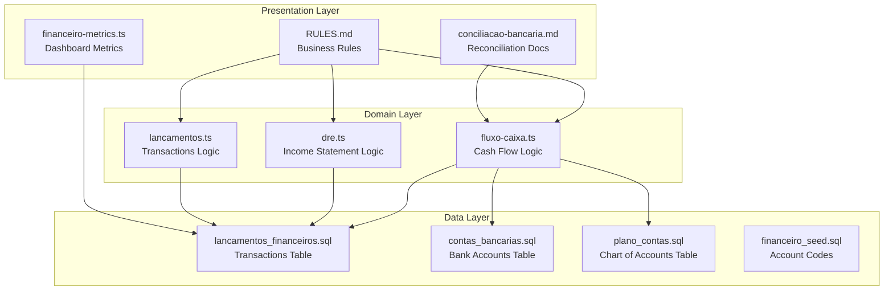
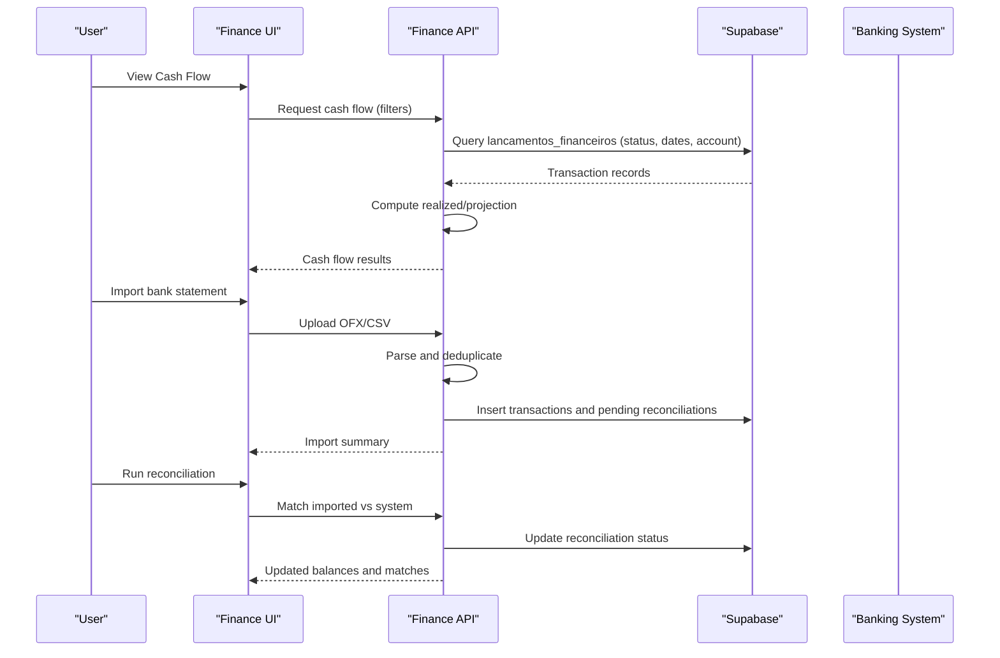
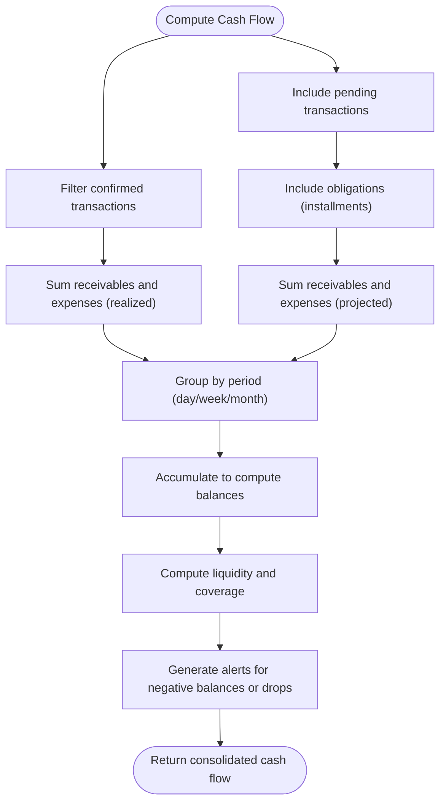
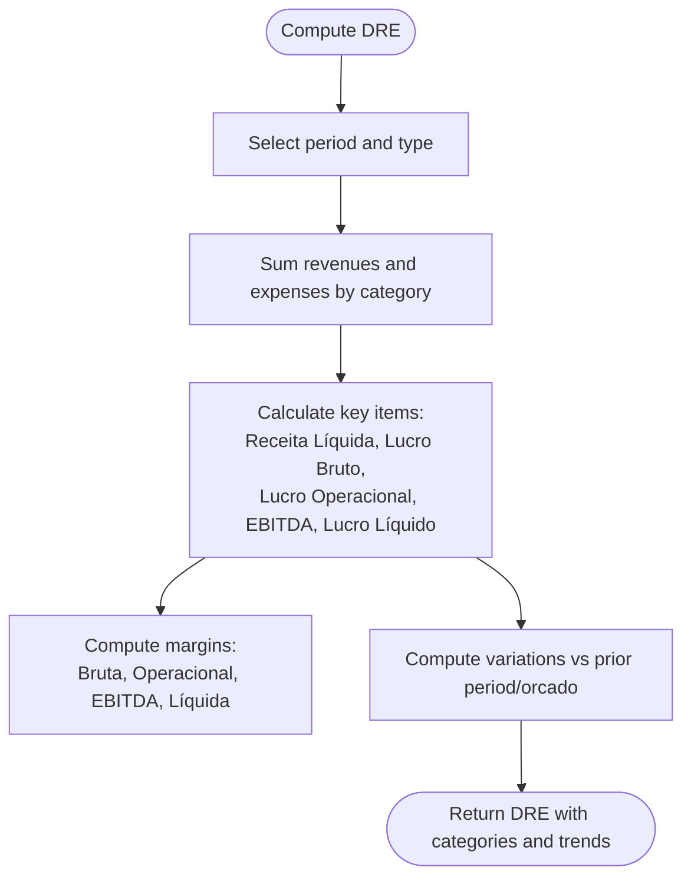
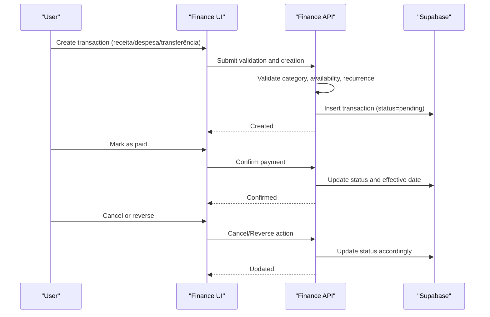
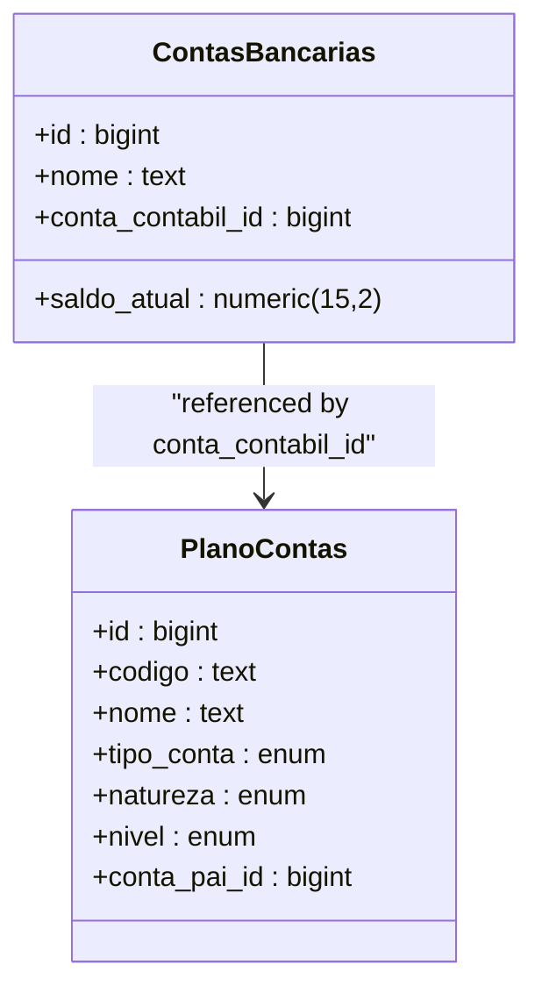
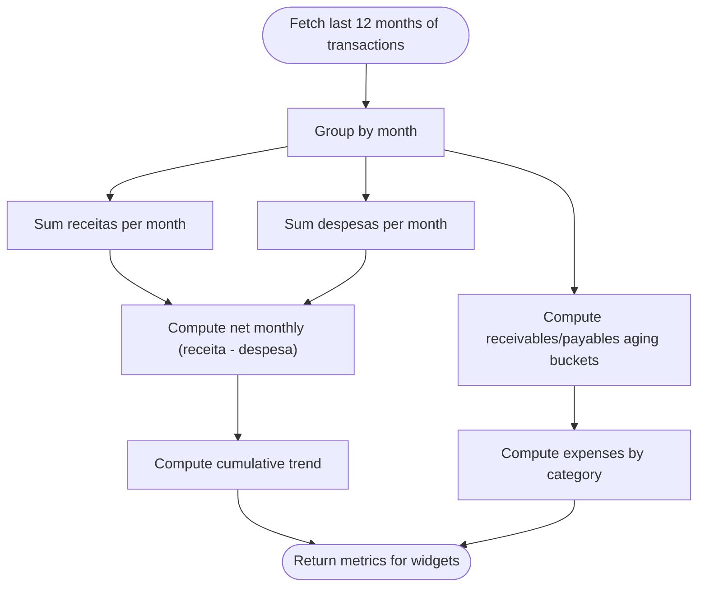
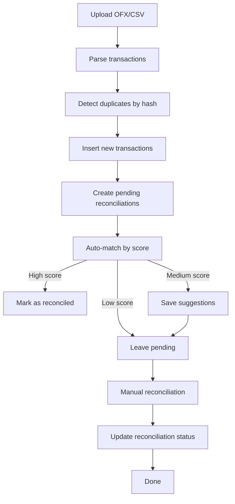

# Cash Flow Management

<cite>
**Referenced Files in This Document**
- [RULES.md](file://src/app/(authenticated)/financeiro/RULES.md)
- [fluxo-caixa.ts](file://src/app/(authenticated)/financeiro/domain/fluxo-caixa.ts)
- [lancamentos.ts](file://src/app/(authenticated)/financeiro/domain/lancamentos.ts)
- [dre.ts](file://src/app/(authenticated)/financeiro/domain/dre.ts)
- [financeiro-metrics.ts](file://src/app/(authenticated)/dashboard/repositories/financeiro-metrics.ts)
- [lancamentos_financeiros.sql](file://supabase/schemas/29_lancamentos_financeiros.sql)
- [contas_bancarias.sql](file://supabase/schemas/28_contas_bancarias.sql)
- [plano_contas.sql](file://supabase/schemas/26_plano_contas.sql)
- [financeiro_seed.sql](file://supabase/schemas/36_financeiro_seed.sql)
- [conciliacao-bancaria.md](file://src/app/(authenticated)/financeiro/docs/conciliacao-bancaria.md)
- [add-jsdoc-all.ts](file://scripts/mcp/add-jsdoc-all.ts)
</cite>

## Table of Contents
1. [Introduction](#introduction)
2. [Project Structure](#project-structure)
3. [Core Components](#core-components)
4. [Architecture Overview](#architecture-overview)
5. [Detailed Component Analysis](#detailed-component-analysis)
6. [Dependency Analysis](#dependency-analysis)
7. [Performance Considerations](#performance-considerations)
8. [Troubleshooting Guide](#troubleshooting-guide)
9. [Conclusion](#conclusion)
10. [Appendices](#appendices)

## Introduction
This document describes the Cash Flow Management system within the legal practice management platform. It covers cash inflows, outflows, and liquidity tracking; cash flow statement preparation; operating activities analysis; cash position monitoring; integration with receivables and payables; investment activities; cash flow forecasting models; liquidity ratios; cash conversion cycle analysis; examples of cash flow reporting, trend analysis, and scenario modeling; and the relationship between cash flow and operational performance, debt servicing capacity, and growth planning. It also explains integration with banking systems and cash management workflows.

## Project Structure
The Cash Flow Management system is implemented across three layers:
- Domain layer: Pure business logic for cash flow calculations, projections, and indicators
- Data layer: Supabase schemas for transactions, bank accounts, and chart of accounts
- Presentation layer: Dashboard metrics, receivables/payables views, and reconciliation workflows



**Diagram sources**
- [fluxo-caixa.ts](file://src/app/(authenticated)/financeiro/domain/fluxo-caixa.ts#L1-L329)
- [dre.ts](file://src/app/(authenticated)/financeiro/domain/dre.ts#L1-L659)
- [lancamentos.ts](file://src/app/(authenticated)/financeiro/domain/lancamentos.ts#L1-L38)
- [lancamentos_financeiros.sql:1-219](file://supabase/schemas/29_lancamentos_financeiros.sql#L1-L219)
- [contas_bancarias.sql:1-136](file://supabase/schemas/28_contas_bancarias.sql#L1-L136)
- [plano_contas.sql:1-191](file://supabase/schemas/26_plano_contas.sql#L1-L191)
- [financeiro_seed.sql:25-223](file://supabase/schemas/36_financeiro_seed.sql#L25-L223)
- [financeiro-metrics.ts](file://src/app/(authenticated)/dashboard/repositories/financeiro-metrics.ts#L1-L241)
- [RULES.md](file://src/app/(authenticated)/financeiro/RULES.md#L1-L188)
- [conciliacao-bancaria.md](file://src/app/(authenticated)/financeiro/docs/conciliacao-bancaria.md#L1-L59)

**Section sources**
- [RULES.md](file://src/app/(authenticated)/financeiro/RULES.md#L1-L188)
- [fluxo-caixa.ts](file://src/app/(authenticated)/financeiro/domain/fluxo-caixa.ts#L1-L329)
- [lancamentos_financeiros.sql:1-219](file://supabase/schemas/29_lancamentos_financeiros.sql#L1-L219)
- [contas_bancarias.sql:1-136](file://supabase/schemas/28_contas_bancarias.sql#L1-L136)
- [plano_contas.sql:1-191](file://supabase/schemas/26_plano_contas.sql#L1-L191)
- [financeiro_seed.sql:25-223](file://supabase/schemas/36_financeiro_seed.sql#L25-L223)
- [financeiro-metrics.ts](file://src/app/(authenticated)/dashboard/repositories/financeiro-metrics.ts#L1-L241)
- [conciliacao-bancaria.md](file://src/app/(authenticated)/financeiro/docs/conciliacao-bancaria.md#L1-L59)

## Core Components
- Cash Flow Domain: Provides realized and projected cash flow calculations, grouping by period, and health indicators
- Income Statement (DRE) Domain: Computes income statement items and comparative analytics
- Transactions Domain: Validates and manages receivables/payables lifecycle
- Bank Accounts: Tracks balances and supports reconciliation
- Chart of Accounts: Supports classification and reporting
- Dashboard Metrics: Aggregates trends, aging, and comparisons

Key capabilities:
- Realized cash flow: Sum of confirmed receivables and expenses within a period
- Projected cash flow: Includes pending transactions and obligations (e.g., agreement installments)
- Health indicators: Immediate liquidity, expense coverage months, and trend direction
- Aging analysis: Receivables/payables buckets for risk assessment
- Trend analysis: Monthly revenue, expense, and cumulative balance over 12 months

**Section sources**
- [fluxo-caixa.ts](file://src/app/(authenticated)/financeiro/domain/fluxo-caixa.ts#L84-L137)
- [dre.ts](file://src/app/(authenticated)/financeiro/domain/dre.ts#L219-L295)
- [lancamentos.ts](file://src/app/(authenticated)/financeiro/domain/lancamentos.ts#L185-L222)
- [financeiro-metrics.ts](file://src/app/(authenticated)/dashboard/repositories/financeiro-metrics.ts#L120-L157)

## Architecture Overview
The system integrates transactional data with reconciliation and reporting:



**Diagram sources**
- [conciliacao-bancaria.md](file://src/app/(authenticated)/financeiro/docs/conciliacao-bancaria.md#L10-L59)
- [lancamentos_financeiros.sql:16-84](file://supabase/schemas/29_lancamentos_financeiros.sql#L16-L84)

## Detailed Component Analysis

### Cash Flow Domain
The cash flow domain computes realized and projected cash flows, groups movements by period, and calculates health indicators.



**Diagram sources**
- [fluxo-caixa.ts](file://src/app/(authenticated)/financeiro/domain/fluxo-caixa.ts#L84-L232)
- [fluxo-caixa.ts](file://src/app/(authenticated)/financeiro/domain/fluxo-caixa.ts#L255-L315)

Key functions and behaviors:
- Realized cash flow: Filters by confirmed status and sums receivables and expenses
- Projected cash flow: Adds pending transactions and obligations (installments)
- Period grouping: Aggregates by day/week/month and computes cumulative balances
- Health indicators: Immediate liquidity, expense coverage ratio, and trend
- Alerts: Flags negative projected balances or significant declines

**Section sources**
- [fluxo-caixa.ts](file://src/app/(authenticated)/financeiro/domain/fluxo-caixa.ts#L84-L137)
- [fluxo-caixa.ts](file://src/app/(authenticated)/financeiro/domain/fluxo-caixa.ts#L166-L232)
- [fluxo-caixa.ts](file://src/app/(authenticated)/financeiro/domain/fluxo-caixa.ts#L255-L315)

### Income Statement (DRE) Domain
The DRE domain computes income statement items, margins, and comparative analytics.



**Diagram sources**
- [dre.ts](file://src/app/(authenticated)/financeiro/domain/dre.ts#L219-L295)
- [dre.ts](file://src/app/(authenticated)/financeiro/domain/dre.ts#L297-L345)
- [dre.ts](file://src/app/(authenticated)/financeiro/domain/dre.ts#L444-L483)

**Section sources**
- [dre.ts](file://src/app/(authenticated)/financeiro/domain/dre.ts#L219-L295)
- [dre.ts](file://src/app/(authenticated)/financeiro/domain/dre.ts#L297-L345)
- [dre.ts](file://src/app/(authenticated)/financeiro/domain/dre.ts#L444-L483)

### Transactions and Receivables/Payables Lifecycle
The transactions domain validates creation, payment, cancellation, and transfer operations, and supports receivable/payable management.



**Diagram sources**
- [lancamentos.ts](file://src/app/(authenticated)/financeiro/domain/lancamentos.ts#L185-L222)
- [lancamentos_financeiros.sql:16-84](file://supabase/schemas/29_lancamentos_financeiros.sql#L16-L84)

**Section sources**
- [lancamentos.ts](file://src/app/(authenticated)/financeiro/domain/lancamentos.ts#L185-L222)
- [lancamentos_financeiros.sql:16-84](file://supabase/schemas/29_lancamentos_financeiros.sql#L16-L84)

### Bank Accounts and Chart of Accounts
Bank accounts track balances and support reconciliation. The chart of accounts classifies transactions for reporting.



**Diagram sources**
- [contas_bancarias.sql:16-74](file://supabase/schemas/28_contas_bancarias.sql#L16-L74)
- [plano_contas.sql:15-67](file://supabase/schemas/26_plano_contas.sql#L15-L67)

**Section sources**
- [contas_bancarias.sql:16-74](file://supabase/schemas/28_contas_bancarias.sql#L16-L74)
- [plano_contas.sql:15-67](file://supabase/schemas/26_plano_contas.sql#L15-L67)
- [financeiro_seed.sql:25-83](file://supabase/schemas/36_financeiro_seed.sql#L25-L83)

### Dashboard Metrics and Reporting
Dashboard metrics aggregate monthly trends, aging buckets, and DRE comparisons.



**Diagram sources**
- [financeiro-metrics.ts](file://src/app/(authenticated)/dashboard/repositories/financeiro-metrics.ts#L120-L157)
- [financeiro-metrics.ts](file://src/app/(authenticated)/dashboard/repositories/financeiro-metrics.ts#L214-L240)

**Section sources**
- [financeiro-metrics.ts](file://src/app/(authenticated)/dashboard/repositories/financeiro-metrics.ts#L86-L212)

### Reconciliation Workflow
The reconciliation module imports bank statements, detects duplicates, suggests matches, and allows manual reconciliation.



**Diagram sources**
- [conciliacao-bancaria.md](file://src/app/(authenticated)/financeiro/docs/conciliacao-bancaria.md#L34-L59)

**Section sources**
- [conciliacao-bancaria.md](file://src/app/(authenticated)/financeiro/docs/conciliacao-bancaria.md#L1-L59)

## Dependency Analysis
The system exhibits clear separation of concerns:
- Domain logic depends on transaction and account schemas
- UI dashboards depend on domain computations and database queries
- Reconciliation depends on transaction parsing and matching logic

```mermaid
graph LR
LANC_TBL["lancamentos_financeiros.sql"] <- --> FC["fluxo-caixa.ts"]
LANC_TBL <- --> DRE["dre.ts"]
LANC_TBL <- --> METRICS["financeiro-metrics.ts"]
CONTA_TBL["contas_bancarias.sql"] --> FC
PC_TBL["plano_contas.sql"] --> FC
PC_TBL --> DRE
RULES["RULES.md"] --> FC
RULES --> DRE
RULES --> LANC
```

**Diagram sources**
- [lancamentos_financeiros.sql:16-84](file://supabase/schemas/29_lancamentos_financeiros.sql#L16-L84)
- [contas_bancarias.sql:16-74](file://supabase/schemas/28_contas_bancarias.sql#L16-L74)
- [plano_contas.sql:15-67](file://supabase/schemas/26_plano_contas.sql#L15-L67)
- [fluxo-caixa.ts](file://src/app/(authenticated)/financeiro/domain/fluxo-caixa.ts#L1-L329)
- [dre.ts](file://src/app/(authenticated)/financeiro/domain/dre.ts#L1-L659)
- [financeiro-metrics.ts](file://src/app/(authenticated)/dashboard/repositories/financeiro-metrics.ts#L1-L241)
- [RULES.md](file://src/app/(authenticated)/financeiro/RULES.md#L1-L188)

**Section sources**
- [fluxo-caixa.ts](file://src/app/(authenticated)/financeiro/domain/fluxo-caixa.ts#L1-L329)
- [dre.ts](file://src/app/(authenticated)/financeiro/domain/dre.ts#L1-L659)
- [financeiro-metrics.ts](file://src/app/(authenticated)/dashboard/repositories/financeiro-metrics.ts#L1-L241)
- [lancamentos_financeiros.sql:16-84](file://supabase/schemas/29_lancamentos_financeiros.sql#L16-L84)
- [contas_bancarias.sql:16-74](file://supabase/schemas/28_contas_bancarias.sql#L16-L74)
- [plano_contas.sql:15-67](file://supabase/schemas/26_plano_contas.sql#L15-L67)

## Performance Considerations
- Indexes on date and status fields accelerate cash flow and aging queries
- Partitioning by competência supports efficient DRE generation
- Deduplication and hashing reduce reconciliation overhead
- Dashboard queries limit scope to recent periods to maintain responsiveness

[No sources needed since this section provides general guidance]

## Troubleshooting Guide
Common issues and resolutions:
- Negative projected cash flow: Review upcoming obligations and adjust payment timing
- Declining liquidity trend: Investigate rising expenses or delayed receivables
- Reconciliation mismatches: Verify transaction hashes and match scores; manually reconcile discrepancies
- Aging buckets growing: Implement collection actions for overdue receivables

**Section sources**
- [fluxo-caixa.ts](file://src/app/(authenticated)/financeiro/domain/fluxo-caixa.ts#L288-L315)
- [financeiro-metrics.ts](file://src/app/(authenticated)/dashboard/repositories/financeiro-metrics.ts#L214-L240)

## Conclusion
The Cash Flow Management system provides robust capabilities for tracking cash inflows/outflows, projecting future positions, and monitoring liquidity. It integrates seamlessly with receivables/payables, bank reconciliation, and financial reporting. The modular design ensures maintainability and scalability while supporting operational performance, debt servicing capacity, and growth planning through actionable insights and scenario modeling.

[No sources needed since this section summarizes without analyzing specific files]

## Appendices

### Cash Flow Forecasting Models
- Projected cash flow includes pending transactions and obligations (installments)
- Period grouping supports daily, weekly, and monthly views
- Health indicators: immediate liquidity, expense coverage ratio, and trend direction
- Scenario modeling: adjust probability assumptions for obligations and forecast sensitivity

**Section sources**
- [fluxo-caixa.ts](file://src/app/(authenticated)/financeiro/domain/fluxo-caixa.ts#L105-L161)
- [fluxo-caixa.ts](file://src/app/(authenticated)/financeiro/domain/fluxo-caixa.ts#L166-L232)
- [fluxo-caixa.ts](file://src/app/(authenticated)/financeiro/domain/fluxo-caixa.ts#L255-L283)

### Liquidity Ratios and Cash Conversion Cycle
- Liquidity ratios: immediate liquidity and expense coverage months
- Cash conversion cycle: accounts receivable days, inventory days (if applicable), and accounts payable days (if applicable)
- Monitoring: aging buckets and trend analysis inform working capital management

**Section sources**
- [fluxo-caixa.ts](file://src/app/(authenticated)/financeiro/domain/fluxo-caixa.ts#L255-L283)
- [financeiro-metrics.ts](file://src/app/(authenticated)/dashboard/repositories/financeiro-metrics.ts#L168-L174)

### Integration with Banking Systems and Workflows
- Import bank statements (OFX/CSV), parse, deduplicate, and suggest matches
- Automated reconciliation with thresholds; manual review for edge cases
- Real-time balance updates via triggers on confirmed transactions

**Section sources**
- [conciliacao-bancaria.md](file://src/app/(authenticated)/financeiro/docs/conciliacao-bancaria.md#L10-L59)
- [lancamentos_financeiros.sql:179-182](file://supabase/schemas/29_lancamentos_financeiros.sql#L179-L182)

### Example Reporting and Trend Analysis
- Monthly revenue, expense, and net profit trends over 12 months
- Cumulative balance trend for liquidity monitoring
- Aging analysis for receivables/payables risk assessment
- Category-wise expense breakdown for cost control

**Section sources**
- [financeiro-metrics.ts](file://src/app/(authenticated)/dashboard/repositories/financeiro-metrics.ts#L120-L157)
- [financeiro-metrics.ts](file://src/app/(authenticated)/dashboard/repositories/financeiro-metrics.ts#L168-L212)

### Relationship to Operational Performance, Debt Servicing, and Growth Planning
- Cash flow drives operational decisions and debt servicing capacity
- DRE analysis informs profitability trends and cost management
- Scenario modeling supports growth planning and capital allocation

**Section sources**
- [dre.ts](file://src/app/(authenticated)/financeiro/domain/dre.ts#L297-L345)
- [fluxo-caixa.ts](file://src/app/(authenticated)/financeiro/domain/fluxo-caixa.ts#L255-L283)

### API Tools for Cash Flow Operations
- Tools for listing cash flow, projections, current balances, and movement summaries
- Support for reconciliations and financial summaries

**Section sources**
- [add-jsdoc-all.ts:55-72](file://scripts/mcp/add-jsdoc-all.ts#L55-L72)