# Chart of Accounts Management

<cite>
**Referenced Files in This Document**
- [26_plano_contas.sql](file://supabase/schemas/26_plano_contas.sql)
- [27_centros_custo.sql](file://supabase/schemas/27_centros_custo.sql)
- [28_contas_bancarias.sql](file://supabase/schemas/28_contas_bancarias.sql)
- [29_lancamentos_financeiros.sql](file://supabase/schemas/29_lancamentos_financeiros.sql)
- [32_orcamento.sql](file://supabase/schemas/32_orcamento.sql)
- [01_enums.sql](file://supabase/schemas/01_enums.sql)
- [33_financeiro_functions.sql](file://supabase/schemas/33_financeiro_functions.sql)
- [34_financeiro_views.sql](file://supabase/schemas/34_financeiro_views.sql)
- [20260214000000_populate_plano_contas_nivel.sql](file://supabase/migrations/20260214000000_populate_plano_contas_nivel.sql)
</cite>

## Table of Contents
1. [Introduction](#introduction)
2. [Project Structure](#project-structure)
3. [Core Components](#core-components)
4. [Architecture Overview](#architecture-overview)
5. [Detailed Component Analysis](#detailed-component-analysis)
6. [Dependency Analysis](#dependency-analysis)
7. [Performance Considerations](#performance-considerations)
8. [Troubleshooting Guide](#troubleshooting-guide)
9. [Conclusion](#conclusion)
10. [Appendices](#appendices)

## Introduction
This document describes the Chart of Accounts Management system within the Finance module. It explains the account structure, classification hierarchies, and how the system supports financial reporting, budgeting, and compliance. It covers account creation workflows, account types (assets, liabilities, equity, income, expenses), hierarchies, integration with accounting standards, tax reporting, financial statements, maintenance procedures, merging, archival, and relationships with other financial modules.

## Project Structure
The Chart of Accounts Management is implemented through a set of relational schemas and supporting functions/views:
- Account master data: hierarchical chart of accounts with synthetic and analytic levels
- Cost centers: optional hierarchical cost allocation units
- Bank accounts: cash and bank accounts linked to chart of accounts
- Financial transactions: revenue, expense, transfers, applications, redemptions
- Budgeting: annual/multi-period budgets with per-account and per-cost-center allocations
- Supporting types and constraints: enums, triggers, validations, and materialized views

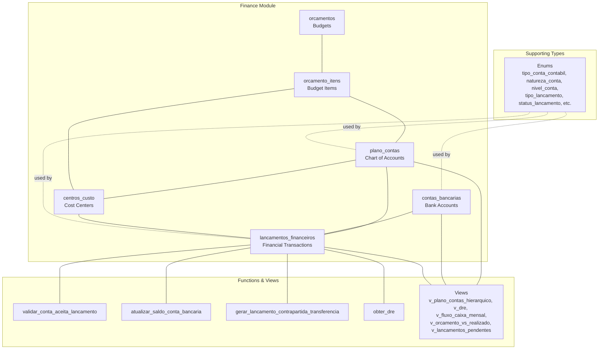

**Diagram sources**
- [26_plano_contas.sql:15-48](file://supabase/schemas/26_plano_contas.sql#L15-L48)
- [27_centros_custo.sql:15-40](file://supabase/schemas/27_centros_custo.sql#L15-L40)
- [28_contas_bancarias.sql:16-50](file://supabase/schemas/28_contas_bancarias.sql#L16-L50)
- [29_lancamentos_financeiros.sql:16-84](file://supabase/schemas/29_lancamentos_financeiros.sql#L16-L84)
- [32_orcamento.sql:15-42](file://supabase/schemas/32_orcamento.sql#L15-L42)
- [33_financeiro_functions.sql:15-51](file://supabase/schemas/33_financeiro_functions.sql#L15-L51)
- [34_financeiro_views.sql:14-61](file://supabase/schemas/34_financeiro_views.sql#L14-L61)

**Section sources**
- [26_plano_contas.sql:1-191](file://supabase/schemas/26_plano_contas.sql#L1-L191)
- [27_centros_custo.sql:1-176](file://supabase/schemas/27_centros_custo.sql#L1-L176)
- [28_contas_bancarias.sql:1-136](file://supabase/schemas/28_contas_bancarias.sql#L1-L136)
- [29_lancamentos_financeiros.sql:1-219](file://supabase/schemas/29_lancamentos_financeiros.sql#L1-L219)
- [32_orcamento.sql:1-216](file://supabase/schemas/32_orcamento.sql#L1-L216)
- [01_enums.sql:304-326](file://supabase/schemas/01_enums.sql#L304-L326)
- [33_financeiro_functions.sql:1-479](file://supabase/schemas/33_financeiro_functions.sql#L1-L479)
- [34_financeiro_views.sql:1-472](file://supabase/schemas/34_financeiro_views.sql#L1-L472)

## Core Components
- Chart of Accounts (plano_contas): hierarchical structure with synthetic and analytic accounts; classification by type (asset, liability, income, expense, equity); nature (debit or credit); and acceptance of postings.
- Cost Centers (centros_custo): optional hierarchical units for departmental or project tracking.
- Bank Accounts (contas_bancarias): cash and bank records linked to chart of accounts; balances updated automatically.
- Financial Transactions (lancamentos_financeiros): all movements including receipts, payments, transfers, applications, and redemptions; integrates with clients, contracts, agreements, and payroll.
- Budgets (orcamentos and orcamento_itens): annual/multi-period budgets with per-account and per-cost-center allocations; monthly or aggregated views.
- Supporting Types: enums define account types, nature, levels, transaction types, statuses, origins, payment methods, and budget periods.
- Functions and Triggers: enforce posting rules, update balances, generate contra entries for transfers, compute period balances, and DRE aggregation.
- Views: materialized and regular views support reporting, reconciliation, and dashboards.

**Section sources**
- [26_plano_contas.sql:15-86](file://supabase/schemas/26_plano_contas.sql#L15-L86)
- [27_centros_custo.sql:15-71](file://supabase/schemas/27_centros_custo.sql#L15-L71)
- [28_contas_bancarias.sql:16-90](file://supabase/schemas/28_contas_bancarias.sql#L16-L90)
- [29_lancamentos_financeiros.sql:16-173](file://supabase/schemas/29_lancamentos_financeiros.sql#L16-L173)
- [32_orcamento.sql:15-153](file://supabase/schemas/32_orcamento.sql#L15-L153)
- [01_enums.sql:304-414](file://supabase/schemas/01_enums.sql#L304-L414)
- [33_financeiro_functions.sql:15-156](file://supabase/schemas/33_financeiro_functions.sql#L15-L156)
- [34_financeiro_views.sql:14-175](file://supabase/schemas/34_financeiro_views.sql#L14-L175)

## Architecture Overview
The system enforces a strict account model:
- Only analytic accounts accept postings; synthetic accounts aggregate totals.
- Transaction validation ensures only analytic accounts receive direct postings.
- Bank account balances update automatically upon transaction confirmation/cancellation.
- Transfer pairs generate a contra entry in the destination account.
- Reporting views aggregate financial data for DRE, cash flow, budget vs. actual, and pending items.

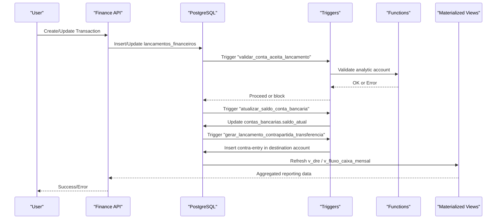

**Diagram sources**
- [29_lancamentos_financeiros.sql:16-84](file://supabase/schemas/29_lancamentos_financeiros.sql#L16-L84)
- [33_financeiro_functions.sql:15-51](file://supabase/schemas/33_financeiro_functions.sql#L15-L51)
- [33_financeiro_functions.sql:59-114](file://supabase/schemas/33_financeiro_functions.sql#L59-L114)
- [33_financeiro_functions.sql:359-442](file://supabase/schemas/33_financeiro_functions.sql#L359-L442)
- [34_financeiro_views.sql:409-471](file://supabase/schemas/34_financeiro_views.sql#L409-L471)

## Detailed Component Analysis

### Chart of Accounts (plano_contas)
- Structure: hierarchical with parent-child relationships; unique codes; display ordering; active flag; audit fields.
- Classification:
  - tipo_conta: asset, liability, income, expense, equity
  - natureza: debit or credit
  - nivel: synthetic or analytic
- Constraints:
  - Unique account code
  - Analytic accounts must accept postings; synthetic accounts must not
  - No self-reference in hierarchy
  - Recursive hierarchy validation via trigger
- Indexes: code, type, parent, active, and partial index for posting-enabled accounts
- RLS policies: service role full access; authenticated users read-only insert/update

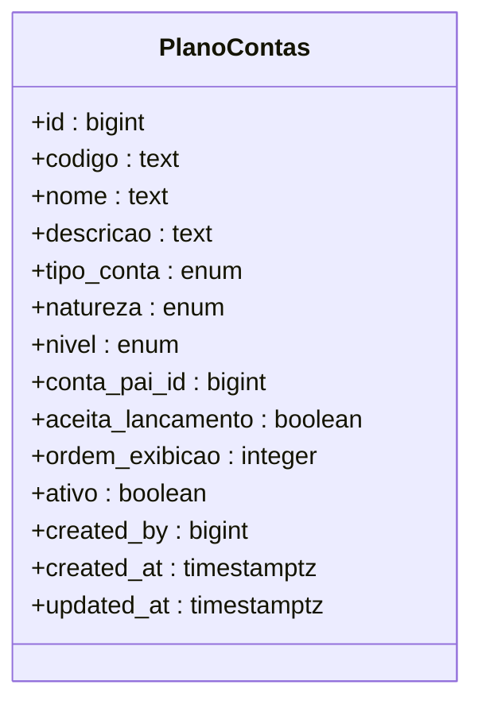

**Diagram sources**
- [26_plano_contas.sql:15-48](file://supabase/schemas/26_plano_contas.sql#L15-L48)

**Section sources**
- [26_plano_contas.sql:15-86](file://supabase/schemas/26_plano_contas.sql#L15-L86)
- [20260214000000_populate_plano_contas_nivel.sql:9-33](file://supabase/migrations/20260214000000_populate_plano_contas_nivel.sql#L9-L33)

### Cost Centers (centros_custo)
- Purpose: track expenses and revenues by department/project/unit.
- Structure: hierarchical with parent-child; responsible user; active flag; audit fields.
- Validation: recursive hierarchy checks to prevent cycles.
- Indexes: code, responsible, active, parent.
- RLS: service role full access; authenticated users read-only insert/update.

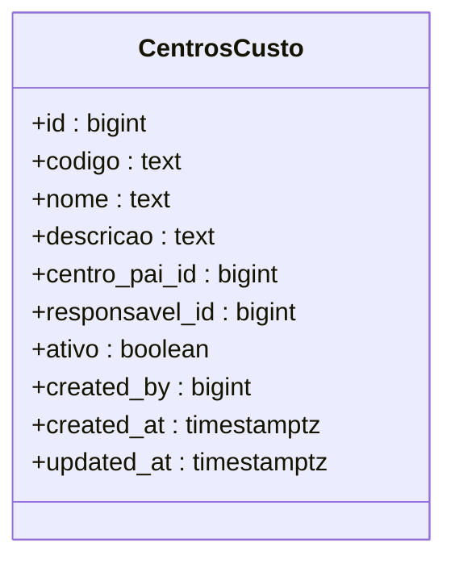

**Diagram sources**
- [27_centros_custo.sql:15-40](file://supabase/schemas/27_centros_custo.sql#L15-L40)

**Section sources**
- [27_centros_custo.sql:15-71](file://supabase/schemas/27_centros_custo.sql#L15-L71)

### Bank Accounts (contas_bancarias)
- Purpose: record cash and bank accounts; link to chart of accounts; maintain balances.
- Fields: name, type, bank info, initial/current balance, reference date, linked chart of accounts, status, active flag, audit fields.
- Linkages: references to plano_contas; indexed by type, status, active, and linked account.
- RLS: service role full access; authenticated users read-only insert/update.

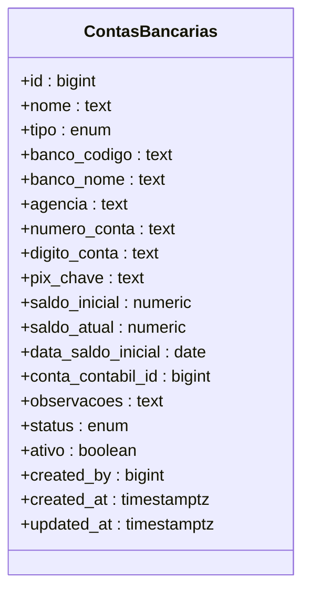

**Diagram sources**
- [28_contas_bancarias.sql:16-50](file://supabase/schemas/28_contas_bancarias.sql#L16-L50)

**Section sources**
- [28_contas_bancarias.sql:16-90](file://supabase/schemas/28_contas_bancarias.sql#L16-L90)

### Financial Transactions (lancamentos_financeiros)
- Purpose: capture all financial movements with full provenience linkage.
- Fields: type, description, amount, dates (entry, competence, due, realization), status, origin, payment method, bank account, chart of accounts (analytic), cost center, category/document/notes, attachments, additional data, client/contract/agreement/parcel/user links, transfer destination and contra-entry, recurrence, and audit fields.
- Constraints: positive value; transfer requires destination; confirmed status requires realization timestamp; recurrence frequency limited.
- Indexes: by type, status, origin, dates, bank account, account, cost center, client/contract/agreement/parcel, and JSON fields.
- RLS: service role full access; authenticated users read-only insert/update.

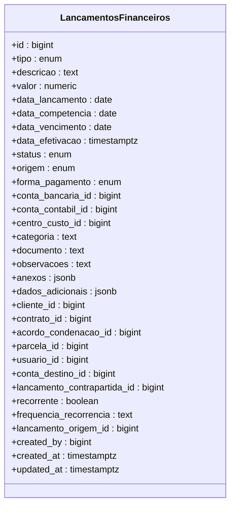

**Diagram sources**
- [29_lancamentos_financeiros.sql:16-84](file://supabase/schemas/29_lancamentos_financeiros.sql#L16-L84)

**Section sources**
- [29_lancamentos_financeiros.sql:16-173](file://supabase/schemas/29_lancamentos_financeiros.sql#L16-L173)

### Budgets (orcamentos and orcamento_itens)
- Purpose: annual/multi-period budgeting with per-account and per-cost-center allocations; monthly or aggregated views.
- orcamentos: header with name/description, year/period, start/end dates, status, audit fields.
- orcamento_itens: detailed allocations by account, optional cost center, optional month, amount, and audit fields.
- Constraints: valid year and period; monthly item range; non-negative amounts; unique combination per budget/account/center/month.
- Indexes: by year, period, status; by account, center, month.
- RLS: service role full access; authenticated users read-only insert/update.

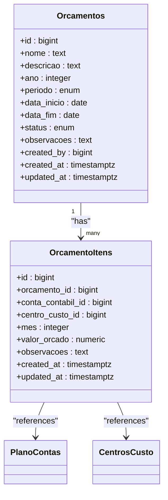

**Diagram sources**
- [32_orcamento.sql:15-114](file://supabase/schemas/32_orcamento.sql#L15-L114)

**Section sources**
- [32_orcamento.sql:15-153](file://supabase/schemas/32_orcamento.sql#L15-L153)

### Account Creation Workflow
- Create synthetic accounts to group children; ensure children exist before marking parents as synthetic.
- Create analytic accounts for posting; verify aceita_lancamento is true.
- Assign hierarchical parent; trigger prevents cycles.
- Link bank accounts to appropriate analytic cash/asset accounts.
- Use validation trigger to ensure only analytic accounts receive postings.

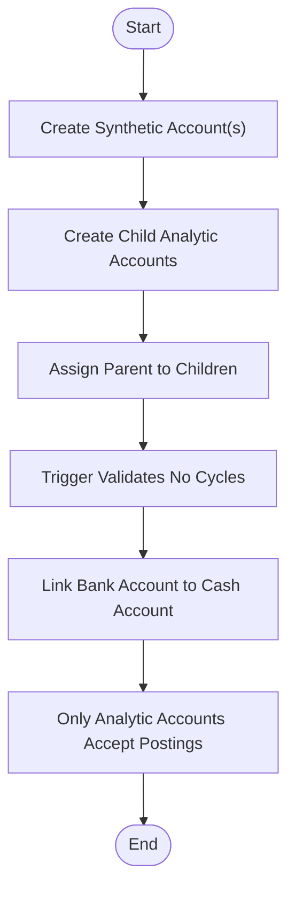

**Diagram sources**
- [26_plano_contas.sql:103-154](file://supabase/schemas/26_plano_contas.sql#L103-L154)
- [33_financeiro_functions.sql:15-51](file://supabase/schemas/33_financeiro_functions.sql#L15-L51)
- [28_contas_bancarias.sql:37-68](file://supabase/schemas/28_contas_bancarias.sql#L37-L68)

**Section sources**
- [26_plano_contas.sql:103-154](file://supabase/schemas/26_plano_contas.sql#L103-L154)
- [33_financeiro_functions.sql:15-51](file://supabase/schemas/33_financeiro_functions.sql#L15-L51)
- [28_contas_bancarias.sql:37-68](file://supabase/schemas/28_contas_bancarias.sql#L37-L68)

### Account Types and Hierarchies
- Types: asset, liability, income, expense, equity.
- Nature: debit or credit increases.
- Levels: synthetic (groups) and analytic (posts directly).
- Hierarchies: recursive parent-child; validation prevents cycles; migration populates level and posting flags.

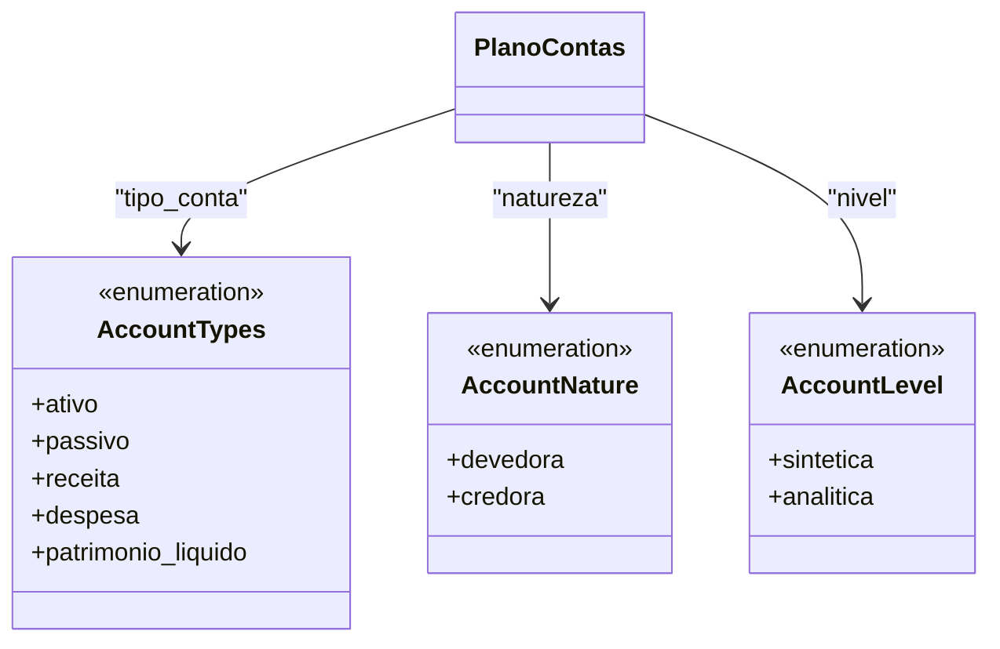

**Diagram sources**
- [01_enums.sql:304-326](file://supabase/schemas/01_enums.sql#L304-L326)
- [26_plano_contas.sql:24-26](file://supabase/schemas/26_plano_contas.sql#L24-L26)

**Section sources**
- [01_enums.sql:304-326](file://supabase/schemas/01_enums.sql#L304-L326)
- [26_plano_contas.sql:24-26](file://supabase/schemas/26_plano_contas.sql#L24-L26)
- [20260214000000_populate_plano_contas_nivel.sql:9-33](file://supabase/migrations/20260214000000_populate_plano_contas_nivel.sql#L9-L33)

### Integration with Accounting Standards, Tax Reporting, and Financial Statements
- DRE aggregation: function and materialized view aggregate income and expense by account and category for the reporting period.
- Cash flow: views exclude internal transfers from net cash movement; show receipts, disbursements, and net cash position.
- Budget vs. actual: comparison view aggregates realized values against budgeted amounts by account and cost center.
- Compliance: RLS policies ensure controlled access; audit timestamps and creators support trailability.

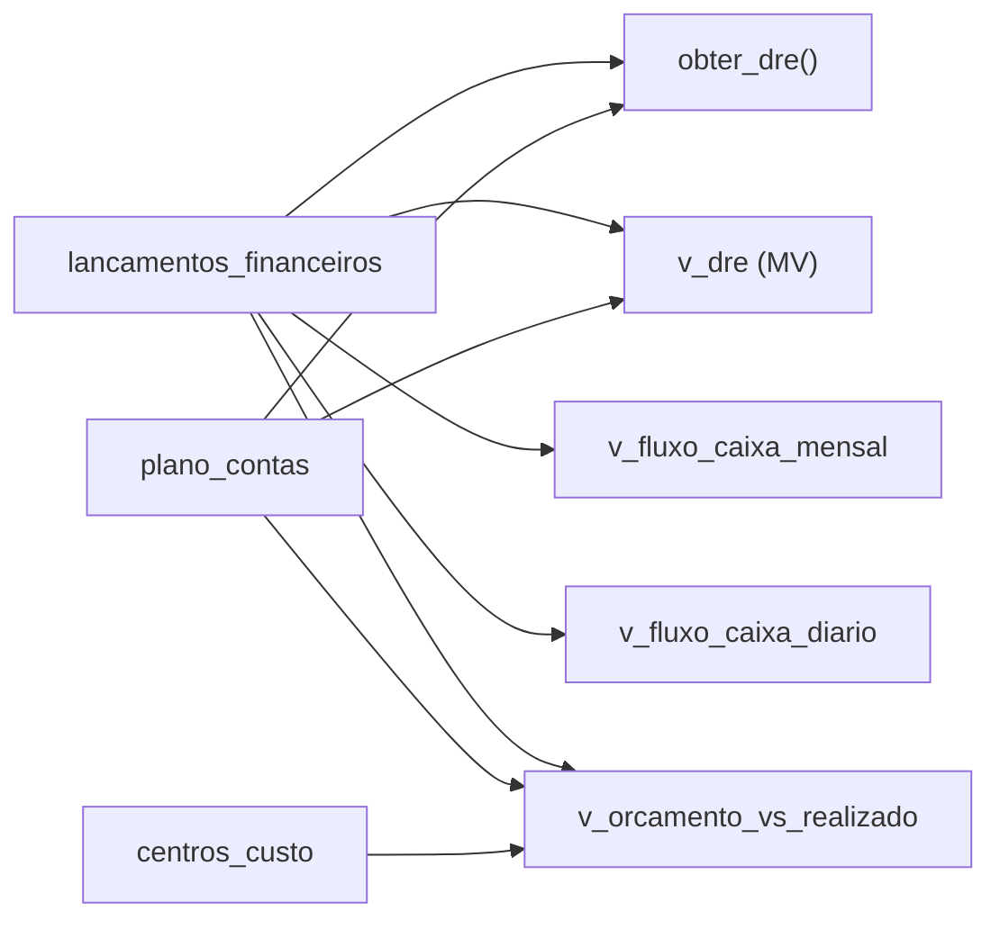

**Diagram sources**
- [33_financeiro_functions.sql:236-269](file://supabase/schemas/33_financeiro_functions.sql#L236-L269)
- [34_financeiro_views.sql:409-471](file://supabase/schemas/34_financeiro_views.sql#L409-L471)
- [34_financeiro_views.sql:79-143](file://supabase/schemas/34_financeiro_views.sql#L79-L143)
- [34_financeiro_views.sql:182-240](file://supabase/schemas/34_financeiro_views.sql#L182-L240)

**Section sources**
- [33_financeiro_functions.sql:236-269](file://supabase/schemas/33_financeiro_functions.sql#L236-L269)
- [34_financeiro_views.sql:79-143](file://supabase/schemas/34_financeiro_views.sql#L79-L143)
- [34_financeiro_views.sql:182-240](file://supabase/schemas/34_financeiro_views.sql#L182-L240)

### Maintenance Procedures, Merging, and Archival
- Maintenance:
  - Update account attributes (code, name, description, parent, order, active).
  - Ensure analytic accounts remain posting-enabled; synthetic accounts disabled.
  - Validate hierarchy to avoid cycles.
- Merging:
  - Not explicitly defined in schema; recommended approach would be to reassign child accounts under a new parent and mark old parent inactive.
- Archival:
  - Use the active flag to disable accounts/centers/bank accounts; keep historical transactions intact for auditability.

**Section sources**
- [26_plano_contas.sql:42-47](file://supabase/schemas/26_plano_contas.sql#L42-L47)
- [27_centros_custo.sql:38-39](file://supabase/schemas/27_centros_custo.sql#L38-L39)
- [28_contas_bancarias.sql:43-44](file://supabase/schemas/28_contas_bancarias.sql#L43-L44)

### Examples and Classifications
- Example setup:
  - Asset: 1.1.01 – Cash and Bank (analytic)
  - Liability: 2.1.01 – Accrued Expenses (analytic)
  - Income: 4.1.01 – Legal Fees (analytic)
  - Expense: 5.1.01 – Office Supplies (analytic)
  - Equity: 6.1.01 – Retained Earnings (synthetic)
- Classification rules:
  - Debit-increasing accounts: asset, expense, equity decrease
  - Credit-increasing accounts: liability, equity increase, income
- Reporting configurations:
  - Competency date for DRE
  - Monthly aggregation for cash flow
  - Budget period alignment with competence dates

**Section sources**
- [01_enums.sql:304-326](file://supabase/schemas/01_enums.sql#L304-L326)
- [33_financeiro_functions.sql:236-269](file://supabase/schemas/33_financeiro_functions.sql#L236-L269)
- [34_financeiro_views.sql:79-108](file://supabase/schemas/34_financeiro_views.sql#L79-L108)

### Relationship to Other Financial Modules and Data Consistency
- Payroll: salary items link to chart of accounts and cost centers; total updates via trigger.
- Reconciliation: imported transactions compared to posted entries; pending reconciliations surfaced via view.
- Dashboards: materialized views support real-time dashboards and KPIs.

**Section sources**
- [33_financeiro_functions.sql:306-351](file://supabase/schemas/33_financeiro_functions.sql#L306-L351)
- [34_financeiro_views.sql:278-303](file://supabase/schemas/34_financeiro_views.sql#L278-L303)

## Dependency Analysis
The following diagram shows key dependencies among core components and supporting functions.

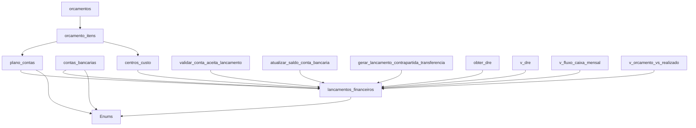

**Diagram sources**
- [29_lancamentos_financeiros.sql:16-84](file://supabase/schemas/29_lancamentos_financeiros.sql#L16-L84)
- [33_financeiro_functions.sql:15-51](file://supabase/schemas/33_financeiro_functions.sql#L15-L51)
- [33_financeiro_functions.sql:59-114](file://supabase/schemas/33_financeiro_functions.sql#L59-L114)
- [33_financeiro_functions.sql:359-442](file://supabase/schemas/33_financeiro_functions.sql#L359-L442)
- [34_financeiro_views.sql:409-471](file://supabase/schemas/34_financeiro_views.sql#L409-L471)

**Section sources**
- [29_lancamentos_financeiros.sql:16-84](file://supabase/schemas/29_lancamentos_financeiros.sql#L16-L84)
- [33_financeiro_functions.sql:15-156](file://supabase/schemas/33_financeiro_functions.sql#L15-L156)
- [34_financeiro_views.sql:409-471](file://supabase/schemas/34_financeiro_views.sql#L409-L471)

## Performance Considerations
- Use indexes on frequently filtered columns (type, status, competence date, bank account, account, cost center).
- Materialized views (e.g., v_dre) require periodic refresh; use concurrent refresh to minimize downtime.
- JSONB indexing (anexos, dados_adicionais) enables flexible filtering at the cost of storage and write overhead.
- Recursive queries for hierarchy are efficient with proper indexing; avoid deep recursion in application logic.

## Troubleshooting Guide
Common issues and resolutions:
- Posting to synthetic account fails: ensure only analytic accounts accept postings; validation trigger raises an error otherwise.
- Circular hierarchy detected: verify parent assignment does not create ancestor-descendant loops; recursive validation prevents insertion/update.
- Bank balance mismatch: confirm transaction status transitions; triggers update balances on confirm/cancel/void; verify contra entries for transfers.
- Duplicate imported transactions: hash-based detection prevents duplicates; reconcile existing entries first.
- DRE or cash flow anomalies: ensure competence dates align with reporting periods; exclude contra entries for transfers in cash flow calculations.

**Section sources**
- [33_financeiro_functions.sql:15-51](file://supabase/schemas/33_financeiro_functions.sql#L15-L51)
- [26_plano_contas.sql:103-154](file://supabase/schemas/26_plano_contas.sql#L103-L154)
- [33_financeiro_functions.sql:59-114](file://supabase/schemas/33_financeiro_functions.sql#L59-L114)
- [33_financeiro_functions.sql:449-478](file://supabase/schemas/33_financeiro_functions.sql#L449-L478)
- [34_financeiro_views.sql:79-143](file://supabase/schemas/34_financeiro_views.sql#L79-L143)

## Conclusion
The Chart of Accounts Management system provides a robust, standards-aligned foundation for financial operations. Its hierarchical structure, strict posting rules, automated balance updates, and comprehensive reporting views enable accurate financial reporting, budgeting, and compliance. Proper maintenance, validation, and periodic view refresh ensure data integrity and performance across modules.

## Appendices
- Enumerations for account types, nature, levels, transaction types, statuses, origins, payment methods, and budget periods are defined centrally and enforced across tables.
- Migration script populates account levels and posting flags based on hierarchy, ensuring consistency during onboarding.

**Section sources**
- [01_enums.sql:304-414](file://supabase/schemas/01_enums.sql#L304-L414)
- [20260214000000_populate_plano_contas_nivel.sql:9-33](file://supabase/migrations/20260214000000_populate_plano_contas_nivel.sql#L9-L33)