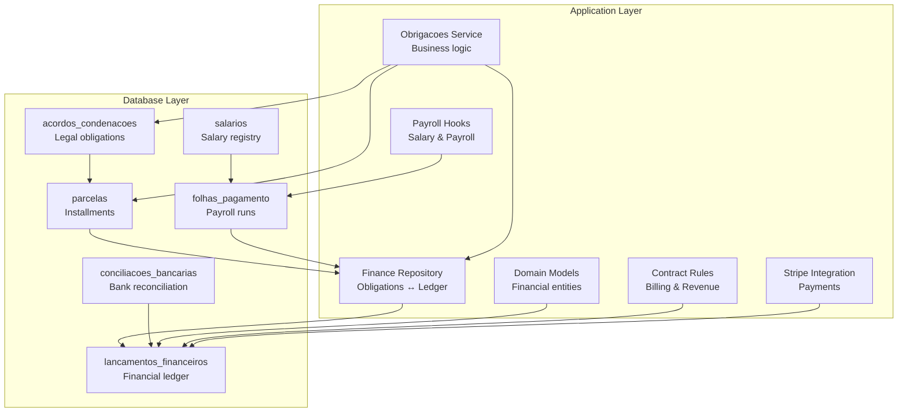
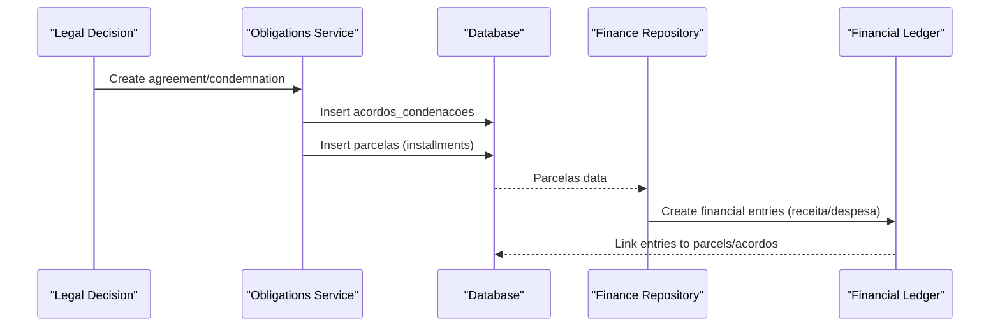
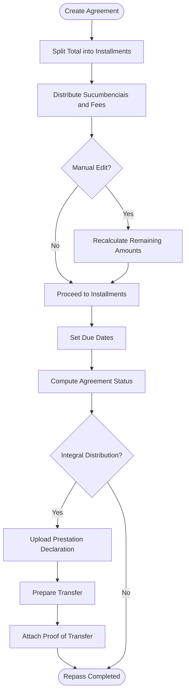
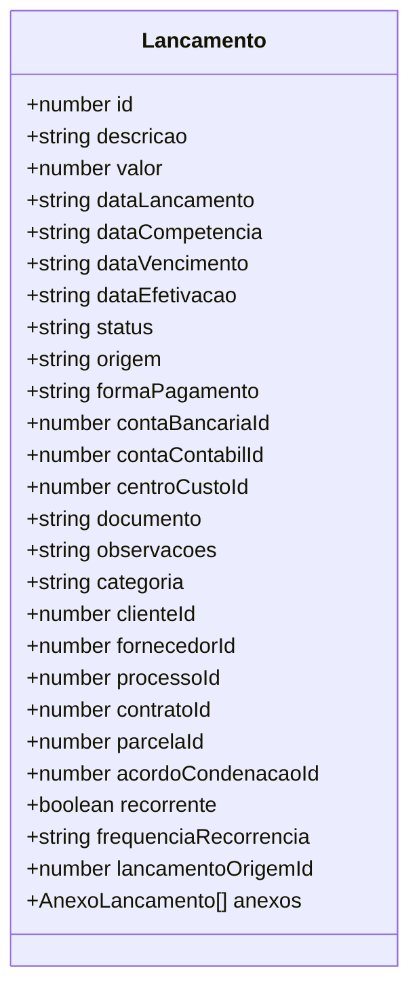
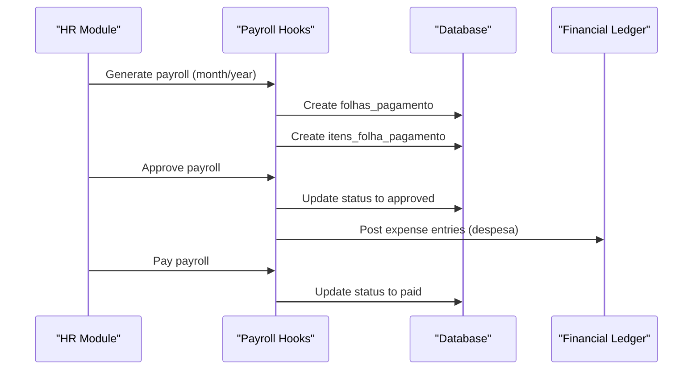
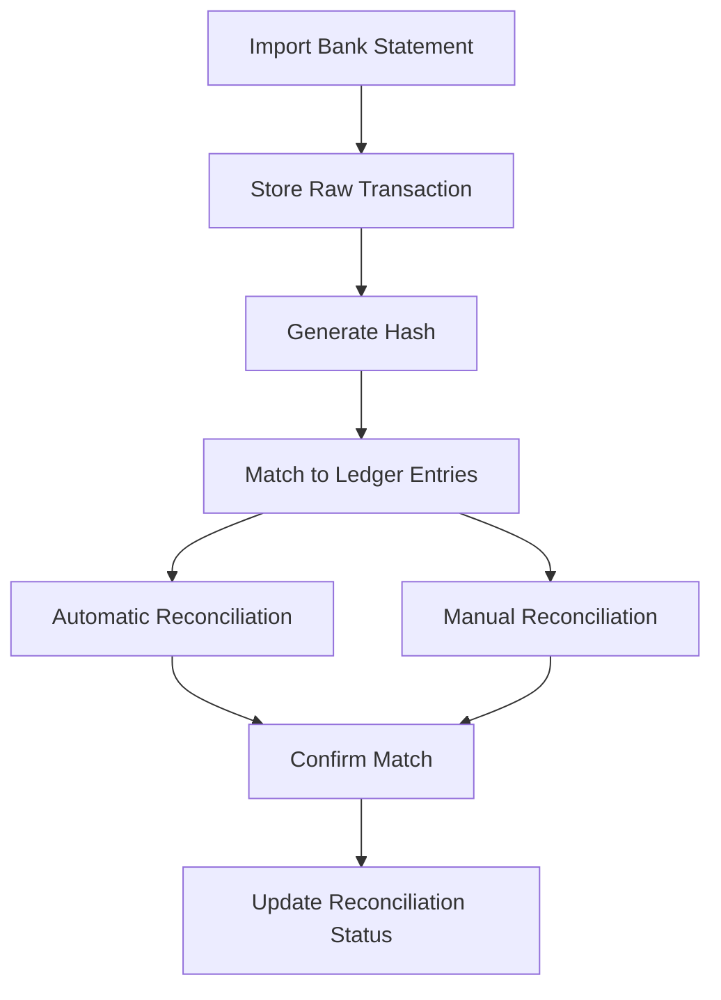
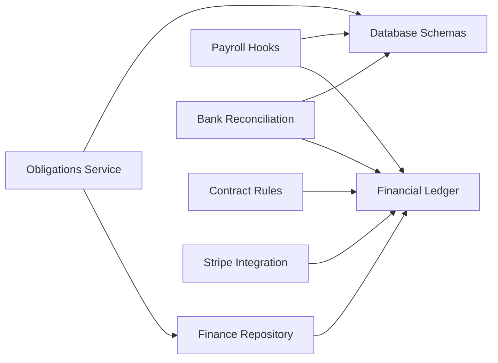

# Financial Tracking System

<cite>
**Referenced Files in This Document**
- [20_acordos_condenacoes.sql](file://supabase/schemas/20_acordos_condenacoes.sql)
- [29_lancamentos_financeiros.sql](file://supabase/schemas/29_lancamentos_financeiros.sql)
- [30_salarios.sql](file://supabase/schemas/30_salarios.sql)
- [31_conciliacao_bancaria.sql](file://supabase/schemas/31_conciliacao_bancaria.sql)
- [service.ts](file://src/app/(authenticated)/obrigacoes/service.ts)
- [obrigacoes.ts](file://src/app/(authenticated)/financeiro/repository/obrigacoes.ts)
- [lancamentos.ts](file://src/app/(authenticated)/financeiro/domain/lancamentos.ts)
- [use-folhas-pagamento.ts](file://src/app/(authenticated)/rh/hooks/use-folhas-pagamento.ts)
- [RULES.md](file://src/app/(authenticated)/contratos/RULES.md)
- [SKILL.md](file://.agents/skills/stripe-payments/SKILL.md)
</cite>

## Table of Contents
1. [Introduction](#introduction)
2. [Project Structure](#project-structure)
3. [Core Components](#core-components)
4. [Architecture Overview](#architecture-overview)
5. [Detailed Component Analysis](#detailed-component-analysis)
6. [Dependency Analysis](#dependency-analysis)
7. [Performance Considerations](#performance-considerations)
8. [Troubleshooting Guide](#troubleshooting-guide)
9. [Conclusion](#conclusion)

## Introduction
This document describes the Financial Tracking System that manages legal financial obligations, installment tracking, client repasses, and payment integration. It covers the complete workflow from legal decisions to payment collection, including revenue recognition, integration with contract management and legal processes, payroll and expense tracking, and financial reporting. Practical examples illustrate case creation, payment processing, and reconciliation workflows, along with compliance and tax considerations.

## Project Structure
The system is implemented as a layered architecture:
- Database schemas define core entities for legal obligations, installments, repasses, and financial transactions.
- Backend services orchestrate business logic for creating and managing obligations, calculating installments, and handling repasses.
- Finance repository integrates obligations with financial ledger entries.
- Domain models define financial entities and validation rules.
- Payroll hooks manage salary and payroll lifecycle.
- Contract rules define billing and revenue recognition from contracts.
- Stripe skill provides payment integration patterns.

**Diagram sources**
- [20_acordos_condenacoes.sql:6-128](file://supabase/schemas/20_acordos_condenacoes.sql#L6-L128)
- [29_lancamentos_financeiros.sql:16-219](file://supabase/schemas/29_lancamentos_financeiros.sql#L16-L219)
- [30_salarios.sql:15-288](file://supabase/schemas/30_salarios.sql#L15-L288)
- [31_conciliacao_bancaria.sql:15-221](file://supabase/schemas/31_conciliacao_bancaria.sql#L15-L221)
- [service.ts](file://src/app/(authenticated)/obrigacoes/service.ts#L19-L57)
- [obrigacoes.ts](file://src/app/(authenticated)/financeiro/repository/obrigacoes.ts#L127-L192)
- [lancamentos.ts](file://src/app/(authenticated)/financeiro/domain/lancamentos.ts#L86-L151)
- [use-folhas-pagamento.ts](file://src/app/(authenticated)/rh/hooks/use-folhas-pagamento.ts#L278-L343)
- [RULES.md](file://src/app/(authenticated)/contratos/RULES.md#L84-L95)
- [SKILL.md:205-278](file://.agents/skills/stripe-payments/SKILL.md#L205-L278)

**Section sources**
- [20_acordos_condenacoes.sql:6-128](file://supabase/schemas/20_acordos_condenacoes.sql#L6-L128)
- [29_lancamentos_financeiros.sql:16-219](file://supabase/schemas/29_lancamentos_financeiros.sql#L16-L219)
- [30_salarios.sql:15-288](file://supabase/schemas/30_salarios.sql#L15-L288)
- [31_conciliacao_bancaria.sql:15-221](file://supabase/schemas/31_conciliacao_bancaria.sql#L15-L221)
- [service.ts](file://src/app/(authenticated)/obrigacoes/service.ts#L19-L57)
- [obrigacoes.ts](file://src/app/(authenticated)/financeiro/repository/obrigacoes.ts#L127-L192)
- [lancamentos.ts](file://src/app/(authenticated)/financeiro/domain/lancamentos.ts#L86-L151)
- [use-folhas-pagamento.ts](file://src/app/(authenticated)/rh/hooks/use-folhas-pagamento.ts#L278-L343)
- [RULES.md](file://src/app/(authenticated)/contratos/RULES.md#L84-L95)
- [SKILL.md:205-278](file://.agents/skills/stripe-payments/SKILL.md#L205-L278)

## Core Components
- Legal Obligations and Installments: Central entities track agreements/condemnations and their installments, including payment methods, due dates, and repass statuses.
- Financial Ledger: Captures all financial movements with classification, origins, and links to obligations and payroll.
- Payroll System: Manages salary records, monthly payroll runs, approvals, and postings to the ledger.
- Bank Reconciliation: Imports bank transactions and reconciles them against ledger entries.
- Contract Integration: Defines billing and revenue recognition rules for contracts.
- Payment Integration: Provides patterns for external payment processing (e.g., Stripe).

**Section sources**
- [20_acordos_condenacoes.sql:6-128](file://supabase/schemas/20_acordos_condenacoes.sql#L6-L128)
- [29_lancamentos_financeiros.sql:16-219](file://supabase/schemas/29_lancamentos_financeiros.sql#L16-L219)
- [30_salarios.sql:95-288](file://supabase/schemas/30_salarios.sql#L95-L288)
- [31_conciliacao_bancaria.sql:88-221](file://supabase/schemas/31_conciliacao_bancaria.sql#L88-L221)
- [lancamentos.ts](file://src/app/(authenticated)/financeiro/domain/lancamentos.ts#L86-L151)
- [use-folhas-pagamento.ts](file://src/app/(authenticated)/rh/hooks/use-folhas-pagamento.ts#L278-L343)
- [RULES.md](file://src/app/(authenticated)/contratos/RULES.md#L84-L95)
- [SKILL.md:205-278](file://.agents/skills/stripe-payments/SKILL.md#L205-L278)

## Architecture Overview
The system follows a domain-driven design with clear separation between obligations, finance, payroll, and integration layers. Data flows from legal decisions into obligations, installments, and financial ledger entries, while payroll and bank reconciliation maintain balance and auditability.

**Diagram sources**
- [service.ts](file://src/app/(authenticated)/obrigacoes/service.ts#L19-L57)
- [20_acordos_condenacoes.sql:6-128](file://supabase/schemas/20_acordos_condenacoes.sql#L6-L128)
- [29_lancamentos_financeiros.sql:16-219](file://supabase/schemas/29_lancamentos_financeiros.sql#L16-L219)
- [obrigacoes.ts](file://src/app/(authenticated)/financeiro/repository/obrigacoes.ts#L127-L192)

## Detailed Component Analysis

### Legal Obligations and Installment Management
- Entities: acordos_condenacoes (agreements/condemnations/custas) and parcelas (installments).
- Business rules:
  - Automatic distribution of principal value and sucumbenciais fees across installments.
  - Manual editing flag and recalculation logic to redistribute remaining amounts.
  - Status propagation from individual installments to the main obligation.
- Repass workflow:
  - Integral distribution triggers client repass stages: declaration upload → transfer preparation → repass completion with proof.
- Validation ensures mandatory attachments before repass registration.

**Diagram sources**
- [service.ts](file://src/app/(authenticated)/obrigacoes/service.ts#L156-L200)
- [service.ts](file://src/app/(authenticated)/obrigacoes/service.ts#L140-L152)
- [20_acordos_condenacoes.sql:6-128](file://supabase/schemas/20_acordos_condenacoes.sql#L6-L128)

**Section sources**
- [service.ts](file://src/app/(authenticated)/obrigacoes/service.ts#L19-L57)
- [service.ts](file://src/app/(authenticated)/obrigacoes/service.ts#L79-L122)
- [service.ts](file://src/app/(authenticated)/obrigacoes/service.ts#L140-L152)
- [20_acordos_condenacoes.sql:6-128](file://supabase/schemas/20_acordos_condenacoes.sql#L6-L128)

### Financial Ledger Integration
- Entity: lancamentos_financeiros captures all financial movements with:
  - Type (receita/despesa), status (pendente/confirmado/cancelado/estornado), origin (manual/acordo_judicial/contrato/folha_pagamento/importacao_bancaria/recorrente).
  - Classification: conta_contabil, centro_custo, conta_bancaria.
  - Links to obligations, contracts, payroll, and parcels.
- Validation rules ensure data integrity and proper status transitions.
- Automatic generation of entries from obligations and payroll.

**Diagram sources**
- [lancamentos.ts](file://src/app/(authenticated)/financeiro/domain/lancamentos.ts#L86-L151)
- [29_lancamentos_financeiros.sql:16-219](file://supabase/schemas/29_lancamentos_financeiros.sql#L16-L219)

**Section sources**
- [lancamentos.ts](file://src/app/(authenticated)/financeiro/domain/lancamentos.ts#L267-L339)
- [29_lancamentos_financeiros.sql:16-219](file://supabase/schemas/29_lancamentos_financeiros.sql#L16-L219)

### Payroll and Expense Tracking
- Salary registry (salarios) maintains historical salary records with validity periods.
- Payroll runs (folhas_pagamento) consolidate employee payments per period.
- Itemized payroll (itens_folha_pagamento) links salaries to ledger entries upon approval.
- Hooks orchestrate generation, approval, payment, and cancellation of payroll runs.

**Diagram sources**
- [30_salarios.sql:15-288](file://supabase/schemas/30_salarios.sql#L15-L288)
- [use-folhas-pagamento.ts](file://src/app/(authenticated)/rh/hooks/use-folhas-pagamento.ts#L278-L343)

**Section sources**
- [30_salarios.sql:15-288](file://supabase/schemas/30_salarios.sql#L15-L288)
- [use-folhas-pagamento.ts](file://src/app/(authenticated)/rh/hooks/use-folhas-pagamento.ts#L278-L343)

### Bank Reconciliation
- Imported transactions (transacoes_bancarias_importadas) capture raw bank data and prevent duplicates via hashing.
- Reconciliation (conciliacoes_bancarias) matches imported transactions to ledger entries, supporting automatic and manual modes.
- Maintains audit trail and divergence tracking.

**Diagram sources**
- [31_conciliacao_bancaria.sql:15-221](file://supabase/schemas/31_conciliacao_bancaria.sql#L15-L221)

**Section sources**
- [31_conciliacao_bancaria.sql:15-221](file://supabase/schemas/31_conciliacao_bancaria.sql#L15-L221)

### Contract Integration and Revenue Recognition
- Contracts drive financial entries based on billing type and outcomes.
- Integration rules define how contract terms translate into receivables and revenue timing.

**Section sources**
- [RULES.md](file://src/app/(authenticated)/contratos/RULES.md#L84-L95)

### Payment Integration Patterns
- Stripe webhook handling demonstrates secure payment event processing, subscription lifecycle updates, and invoice payment events.
- Provides testing and production checklist guidance for PCI compliance and reliability.

**Section sources**
- [SKILL.md:205-278](file://.agents/skills/stripe-payments/SKILL.md#L205-L278)
- [SKILL.md:724-764](file://.agents/skills/stripe-payments/SKILL.md#L724-L764)

## Dependency Analysis
The system exhibits low coupling and high cohesion:
- Obligations service depends on database schemas and finance repository.
- Finance repository bridges obligations and ledger, ensuring referential integrity.
- Payroll hooks depend on salary registry and ledger for posting expenses.
- Bank reconciliation depends on imported transactions and ledger entries.
- Contract rules influence ledger entries for billing and revenue recognition.

**Diagram sources**
- [service.ts](file://src/app/(authenticated)/obrigacoes/service.ts#L19-L57)
- [obrigacoes.ts](file://src/app/(authenticated)/financeiro/repository/obrigacoes.ts#L127-L192)
- [use-folhas-pagamento.ts](file://src/app/(authenticated)/rh/hooks/use-folhas-pagamento.ts#L278-L343)
- [31_conciliacao_bancaria.sql:88-221](file://supabase/schemas/31_conciliacao_bancaria.sql#L88-L221)
- [29_lancamentos_financeiros.sql:16-219](file://supabase/schemas/29_lancamentos_financeiros.sql#L16-L219)
- [SKILL.md:205-278](file://.agents/skills/stripe-payments/SKILL.md#L205-L278)

**Section sources**
- [service.ts](file://src/app/(authenticated)/obrigacoes/service.ts#L19-L57)
- [obrigacoes.ts](file://src/app/(authenticated)/financeiro/repository/obrigacoes.ts#L127-L192)
- [use-folhas-pagamento.ts](file://src/app/(authenticated)/rh/hooks/use-folhas-pagamento.ts#L278-L343)
- [31_conciliacao_bancaria.sql:88-221](file://supabase/schemas/31_conciliacao_bancaria.sql#L88-L221)
- [29_lancamentos_financeiros.sql:16-219](file://supabase/schemas/29_lancamentos_financeiros.sql#L16-L219)
- [SKILL.md:205-278](file://.agents/skills/stripe-payments/SKILL.md#L205-L278)

## Performance Considerations
- Indexes on frequently filtered columns (status, date, account) improve query performance for obligations, ledger, and payroll.
- Partitioning or materialized views can accelerate reporting on large datasets.
- Batch operations for recurring entries reduce transaction overhead.
- Asynchronous reconciliation jobs prevent blocking during large imports.

## Troubleshooting Guide
Common issues and resolutions:
- Inconsistent obligations vs. ledger entries: Use repository detection to identify parcels without corresponding entries and reconcile manually.
- Repass validation failures: Ensure required documents are attached before registering repass.
- Payroll posting errors: Verify approval status and absence of posted ledger entries before attempting payment.
- Bank reconciliation mismatches: Review similarity scores and manual match logs; adjust descriptions or amounts to improve matching.

**Section sources**
- [obrigacoes.ts](file://src/app/(authenticated)/financeiro/repository/obrigacoes.ts#L230-L254)
- [service.ts](file://src/app/(authenticated)/obrigacoes/service.ts#L140-L152)
- [use-folhas-pagamento.ts](file://src/app/(authenticated)/rh/hooks/use-folhas-pagamento.ts#L364-L383)
- [31_conciliacao_bancaria.sql:88-221](file://supabase/schemas/31_conciliacao_bancaria.sql#L88-L221)

## Conclusion
The Financial Tracking System provides a robust foundation for managing legal financial obligations, installments, repasses, and integrated financial operations. Its modular design supports seamless integration with contracts, payroll, and banking, enabling accurate revenue recognition, compliance, and reporting. The included patterns for payment integration and reconciliation further strengthen operational efficiency and auditability.