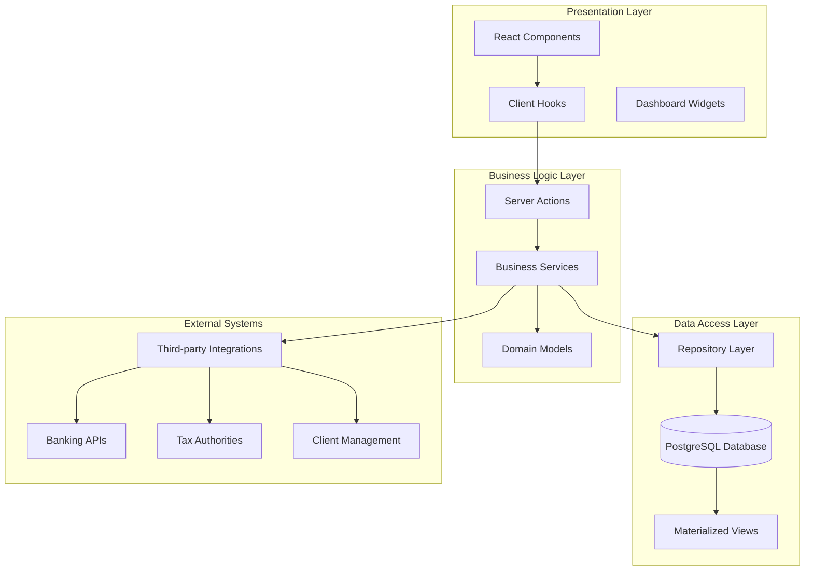
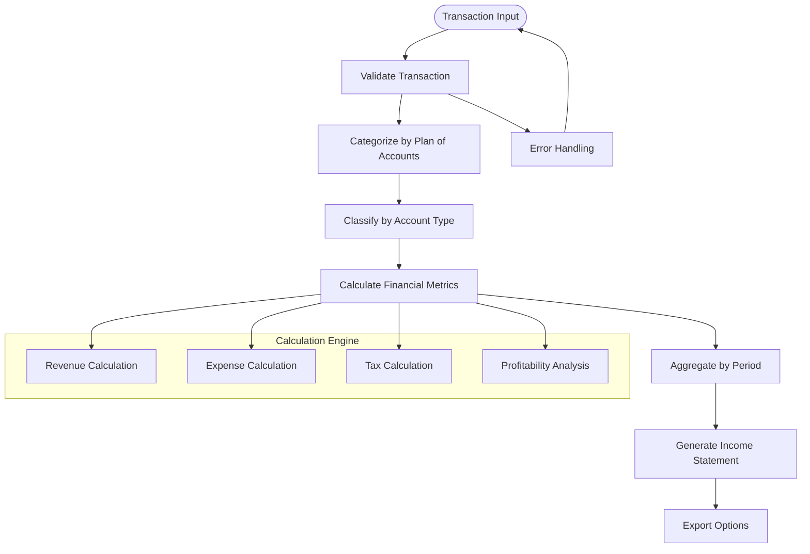
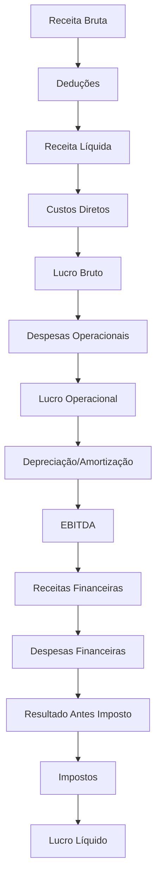
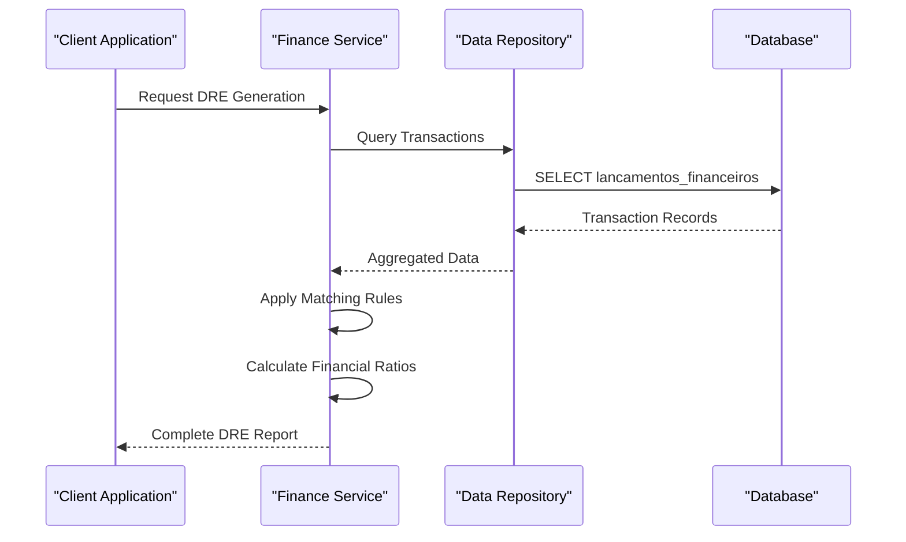
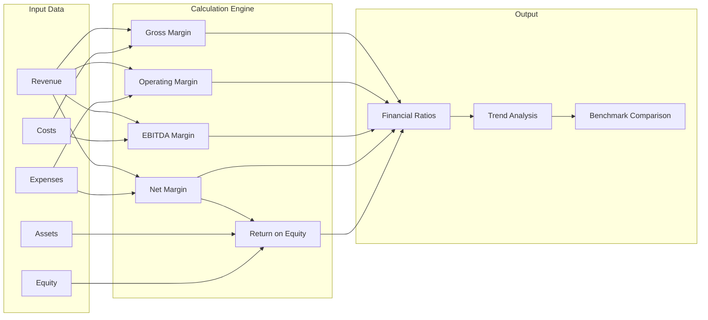
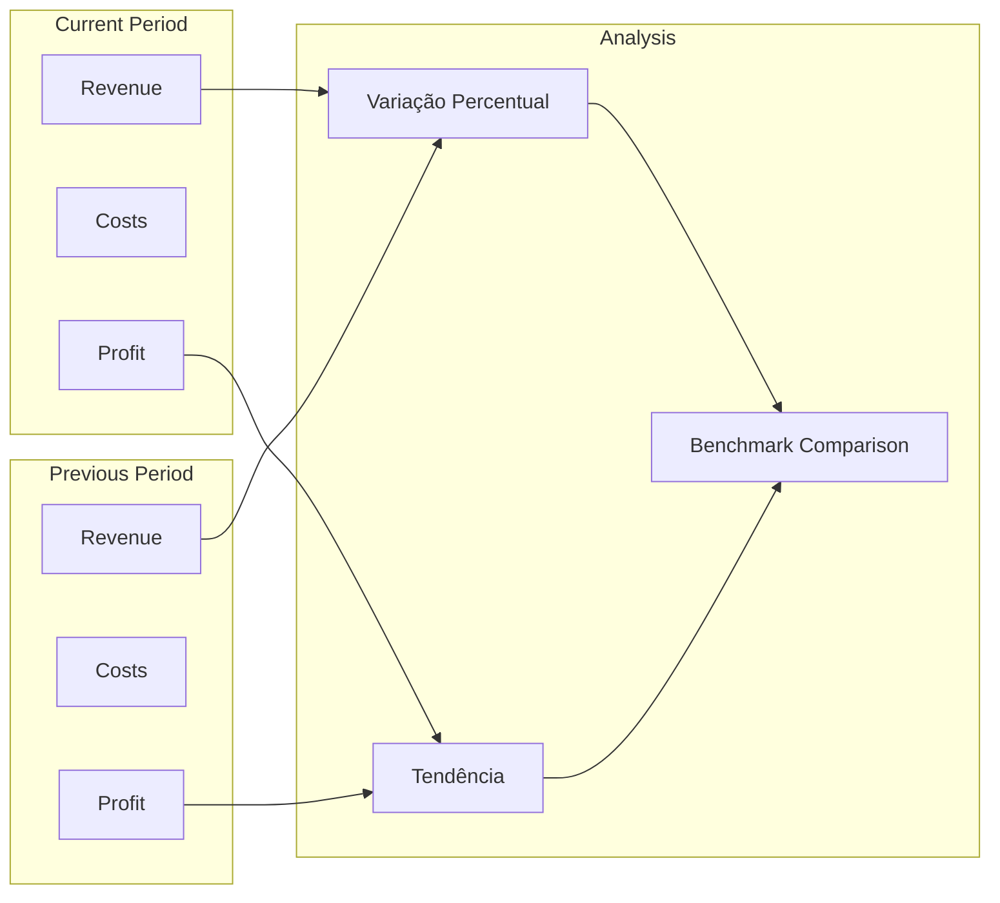
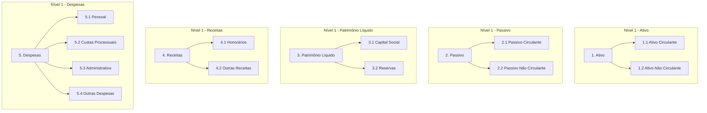
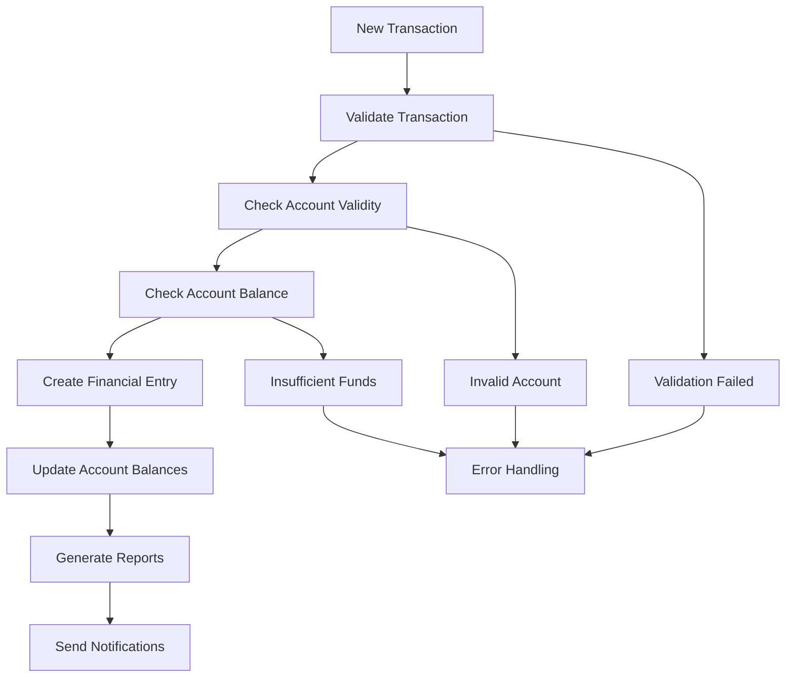
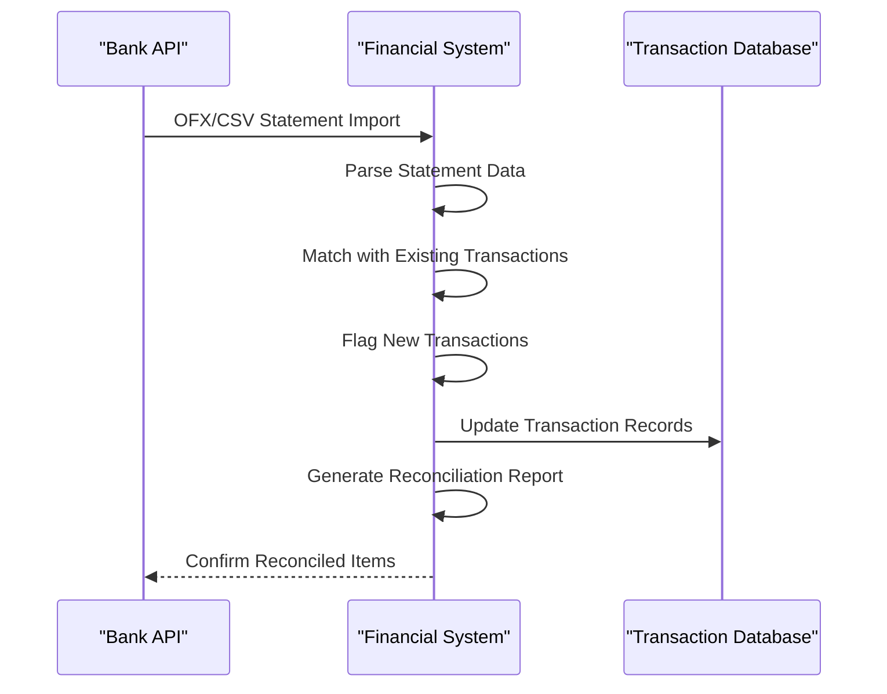

# Income Statement and Reporting

<cite>
**Referenced Files in This Document**
- [RULES.md](file://src/app/(authenticated)/financeiro/RULES.md)
- [dre.ts](file://src/app/(authenticated)/financeiro/domain/dre.ts)
- [dre.ts](file://src/app/(authenticated)/financeiro/services/dre.ts)
- [page-client.tsx](file://src/app/(authenticated)/financeiro/dre/page-client.tsx)
- [dre.tsx](file://src/app/(authenticated)/ajuda/content/financeiro/dre.tsx)
- [26_plano_contas.sql](file://supabase/schemas/26_plano_contas.sql)
- [29_lancamentos_financeiros.sql](file://supabase/schemas/29_lancamentos_financeiros.sql)
- [36_financeiro_seed.sql](file://supabase/schemas/36_financeiro_seed.sql)
- [kpi-strip.tsx](file://src/app/(authenticated)/financeiro/components/dashboard/widgets/kpi-strip.tsx)
- [types.ts](file://src/app/(authenticated)/financeiro/actions/types.ts)
- [financeiro-tools.ts](file://src/lib/mcp/registries/financeiro-tools.ts)
- [obrigacoes-tools.ts](file://src/lib/mcp/registries/obrigacoes-tools.ts)
</cite>

## Table of Contents
1. [Introduction](#introduction)
2. [System Architecture](#system-architecture)
3. [Core Components](#core-components)
4. [Income Statement Preparation](#income-statement-preparation)
5. [Financial Ratio Analysis](#financial-ratio-analysis)
6. [Performance Metrics](#performance-metrics)
7. [Chart of Accounts Integration](#chart-of-accounts-integration)
8. [Revenue Recognition and Expense Matching](#revenue-recognition-and-expense-matching)
9. [Financial Reporting and Compliance](#financial-reporting-and-compliance)
10. [External Systems Integration](#external-systems-integration)
11. [Troubleshooting Guide](#troubleshooting-guide)
12. [Conclusion](#conclusion)

## Introduction

The Income Statement and Financial Reporting system in ZattarOS provides comprehensive financial management capabilities for law firms, focusing on profit and loss statement preparation, financial ratio analysis, and performance metrics tracking. This system integrates seamlessly with the broader legal practice management platform, offering automated financial reporting, real-time analytics, and compliance support.

The system follows Brazilian accounting standards and provides both accrual and cash basis reporting capabilities. It encompasses core financial modules including income statement generation, expense categorization, profitability analysis, and comprehensive financial reporting with drill-down capabilities.

## System Architecture

The financial reporting system is built on a layered architecture that separates concerns between data access, business logic, presentation, and external integrations:

**Diagram sources**
- [page-client.tsx](file://src/app/(authenticated)/financeiro/dre/page-client.tsx#L1-800)
- [dre.ts](file://src/app/(authenticated)/financeiro/services/dre.ts#L1-166)
- [29_lancamentos_financeiros.sql:1-219](file://supabase/schemas/29_lancamentos_financeiros.sql#L1-219)

**Section sources**
- [page-client.tsx](file://src/app/(authenticated)/financeiro/dre/page-client.tsx#L1-800)
- [dre.ts](file://src/app/(authenticated)/financeiro/services/dre.ts#L1-166)

## Core Components

### Income Statement Engine

The system's core income statement engine processes financial transactions through a sophisticated calculation framework:

**Diagram sources**
- [dre.ts](file://src/app/(authenticated)/financeiro/domain/dre.ts#L219-295)
- [29_lancamentos_financeiros.sql:16-84](file://supabase/schemas/29_lancamentos_financeiros.sql#L16-84)

### Financial Data Model

The financial data model supports comprehensive income statement preparation with the following key entities:

| Entity | Purpose | Key Attributes |
|--------|---------|----------------|
| **Lancamentos Financeiros** | Core transaction records | tipo, valor, data_competencia, status, conta_contabil_id |
| **Plano de Contas** | Chart of accounts hierarchy | codigo, nome, tipo_conta, nivel, aceita_lancamento |
| **Centros de Custo** | Cost center tracking | nome, codigo, departamento |
| **Contas Bancárias** | Bank account management | numero, banco, saldo |

**Section sources**
- [29_lancamentos_financeiros.sql:16-121](file://supabase/schemas/29_lancamentos_financeiros.sql#L16-121)
- [26_plano_contas.sql:15-48](file://supabase/schemas/26_plano_contas.sql#L15-48)

## Income Statement Preparation

### DRE Structure and Calculation

The Demonstração do Resultado do Exercício (DRE) follows a standardized calculation framework:

**Diagram sources**
- [RULES.md](file://src/app/(authenticated)/financeiro/RULES.md#L106-119)
- [dre.ts](file://src/app/(authenticated)/financeiro/domain/dre.ts#L36-56)

### Revenue Recognition

Revenue recognition follows strict criteria aligned with Brazilian accounting standards:

| Revenue Type | Recognition Criteria | Timing |
|-------------|---------------------|---------|
| **Honorários Advocatícios** | Conclusão de serviço jurídico | Competência do serviço |
| **Honorários de Sucumbência** | Conclusão de processo judicial | Data de sentença |
| **Honorários de Êxito** | Alcançar resultado contratado | Conclusão do objetivo |
| **Receitas Financeiras** | Aplicação de recursos | Competência financeira |

**Section sources**
- [RULES.md](file://src/app/(authenticated)/financeiro/RULES.md#L72-84)
- [36_financeiro_seed.sql:245-263](file://supabase/schemas/36_financeiro_seed.sql#L245-263)

### Expense Matching

Expense matching ensures proper accrual accounting:

**Diagram sources**
- [dre.ts](file://src/app/(authenticated)/financeiro/services/dre.ts#L127-166)
- [repository/dre.ts](file://src/app/(authenticated)/financeiro/repository/dre.ts#L13-166)

**Section sources**
- [dre.ts](file://src/app/(authenticated)/financeiro/services/dre.ts#L127-166)
- [repository/dre.ts](file://src/app/(authenticated)/financeiro/repository/dre.ts#L13-166)

## Financial Ratio Analysis

### Key Performance Indicators

The system calculates comprehensive financial ratios for performance analysis:

| Ratio Category | Formula | Benchmark | Interpretation |
|---------------|---------|-----------|----------------|
| **Margem Bruta** | Lucro Bruto / Receita Líquida | >15% industry average | Operational efficiency |
| **Margem Operacional** | Lucro Operacional / Receita Líquida | >10% industry average | Management effectiveness |
| **Margem EBITDA** | EBITDA / Receita Líquida | >8% industry average | Cash flow generation |
| **Margem Líquida** | Lucro Líquido / Receita Líquida | >5% industry average | Overall profitability |
| **ROE** | Lucro Líquido / Patrimônio Líquido | >10% industry average | Return on equity |

### Ratio Calculation Engine

**Diagram sources**
- [dre.ts](file://src/app/(authenticated)/financeiro/domain/dre.ts#L222-244)
- [dre.ts](file://src/app/(authenticated)/financeiro/domain/dre.ts#L247-295)

**Section sources**
- [dre.ts](file://src/app/(authenticated)/financeiro/domain/dre.ts#L222-295)

## Performance Metrics

### Dashboard KPIs

The system provides comprehensive performance metrics through integrated dashboard widgets:

| KPI Type | Metric | Threshold | Alert Level |
|----------|--------|-----------|-------------|
| **Receita Mensal** | Monthly revenue growth | +5% monthly | Green/Yellow/Red |
| **Margem Líquida** | Net profit margin | >5% | Performance indicator |
| **Despesas Operacionais** | Operational expense ratio | <60% revenue | Control measure |
| **Inadimplência** | Bad debt ratio | <2% receivables | Risk indicator |
| **Liquidez Corrente** | Current ratio | >1.5 | Financial health |

### Comparative Analysis

**Diagram sources**
- [dre.ts](file://src/app/(authenticated)/financeiro/domain/dre.ts#L304-345)
- [kpi-strip.tsx](file://src/app/(authenticated)/financeiro/components/dashboard/widgets/kpi-strip.tsx#L29-33)

**Section sources**
- [kpi-strip.tsx](file://src/app/(authenticated)/financeiro/components/dashboard/widgets/kpi-strip.tsx#L1-152)

## Chart of Accounts Integration

### Hierarchical Structure

The chart of accounts follows Brazilian accounting standards with a comprehensive hierarchical structure:

**Diagram sources**
- [26_plano_contas.sql:15-48](file://supabase/schemas/26_plano_contas.sql#L15-48)
- [36_financeiro_seed.sql:65-83](file://supabase/schemas/36_financeiro_seed.sql#L65-83)

### Account Classification Rules

| Account Type | Natureza | Debit Increase | Credit Increase | Example Accounts |
|-------------|----------|----------------|-----------------|------------------|
| **Ativo** | Devedora | Yes | No | Caixa, Contas a Receber, Estoques |
| **Passivo** | Credora | No | Yes | Contas a Pagar, Empréstimos |
| **Patrimônio Líquido** | Credora | No | Yes | Capital Social, Reservas |
| **Receitas** | Credora | No | Yes | Honorários, Receitas Financeiras |
| **Despesas** | Devedora | Yes | No | Salários, Aluguel, Material |

**Section sources**
- [26_plano_contas.sql:23-60](file://supabase/schemas/26_plano_contas.sql#L23-60)
- [36_financeiro_seed.sql:265-283](file://supabase/schemas/36_financeiro_seed.sql#L265-283)

## Revenue Recognition and Expense Matching

### Recognition Principles

Revenue recognition follows the matching principle with specific guidelines:

**Revenue Recognition Criteria:**
1. **Persuasive evidence of arrangement exists**
2. **Delivery has occurred or services have been rendered**
3. **The seller's price is fixed or determinable**
4. **Collectibility is reasonably assured**

**Expense Matching Principles:**
1. **Accrual basis accounting**
2. **Matching principle compliance**
3. **Conservative recognition approach**
4. **Supporting documentation requirement**

### Transaction Processing Workflow

**Diagram sources**
- [RULES.md](file://src/app/(authenticated)/financeiro/RULES.md#L45-67)
- [29_lancamentos_financeiros.sql:71-83](file://supabase/schemas/29_lancamentos_financeiros.sql#L71-83)

**Section sources**
- [RULES.md](file://src/app/(authenticated)/financeiro/RULES.md#L45-67)

## Financial Reporting and Compliance

### Regulatory Compliance

The system ensures compliance with Brazilian financial regulations:

**Tax Obligations Integration:**
- **IRPJ/CSLL**: Corporate income tax and social contribution
- **PIS/COFINS**: Federal contributions
- **ISS**: Municipal service tax
- **IOF**: Financial transaction tax

**Compliance Features:**
1. **Automated Tax Calculation**
2. **Regulatory Reporting Templates**
3. **Audit Trail Maintenance**
4. **Financial Statement Validation**

### Financial Statement Generation

The system generates comprehensive financial statements:

| Statement Type | Frequency | Content |
|----------------|-----------|---------|
| **DRE** | Monthly/Quarterly/Annual | Profit and loss statement |
| **Balanço Patrimonial** | Monthly/Quarterly/Annual | Balance sheet |
| **Demonstração de Fluxo de Caixa** | Monthly/Quarterly/Annual | Cash flow statement |
| **Demonstração de Valor Adicionado** | Annual | Value added statement |

**Section sources**
- [RULES.md](file://src/app/(authenticated)/financeiro/RULES.md#L121-124)
- [dre.tsx](file://src/app/(authenticated)/ajuda/content/financeiro/dre.tsx#L144-183)

## External Systems Integration

### Banking Integration

The system integrates with banking systems for automated reconciliation:

**Diagram sources**
- [RULES.md](file://src/app/(authenticated)/financeiro/RULES.md#L174-178)
- [financeiro-tools.ts:374-409](file://src/lib/mcp/registries/financeiro-tools.ts#L374-409)

### Tax Authority Integration

**Integration Points:**
1. **Automatic Tax Calculation**
2. **Periodic Tax Filing Preparation**
3. **Digital Tax Submission Support**
4. **Tax Compliance Monitoring**

### Client Management Integration

The system integrates with client management for revenue tracking:

**Client Billing Integration:**
- **Invoice Generation**
- **Payment Tracking**
- **Client Portfolio Analysis**
- **Revenue Recognition by Client**

**Section sources**
- [obrigacoes-tools.ts:131-159](file://src/lib/mcp/registries/obrigacoes-tools.ts#L131-159)

## Troubleshooting Guide

### Common Issues and Solutions

**Issue: DRE Calculation Errors**
- **Symptoms**: Incorrect profit margins or missing line items
- **Causes**: Invalid account classifications, missing transaction data
- **Solutions**: Verify chart of accounts setup, check transaction completeness

**Issue: Revenue Recognition Problems**
- **Symptoms**: Revenue appearing in wrong period
- **Causes**: Incorrect data_competencia values, mismatched recognition criteria
- **Solutions**: Review revenue recognition policies, validate transaction dates

**Issue: Expense Matching Failures**
- **Symptoms**: Expenses not appearing in correct period
- **Causes**: Wrong cost center assignments, incorrect expense categories
- **Solutions**: Verify cost center hierarchies, review expense classification rules

### Performance Optimization

**Database Optimization Strategies:**
1. **Index Management**: Proper indexing on frequently queried columns
2. **Query Optimization**: Efficient aggregation queries for financial reports
3. **Caching Strategy**: Strategic caching for frequently accessed financial data
4. **Partitioning**: Table partitioning for large transaction datasets

**Monitoring and Alerts:**
- **Performance Metrics**: Query execution times, memory usage
- **Error Tracking**: Transaction processing failures, reconciliation issues
- **Usage Analytics**: Report generation frequency, user access patterns

**Section sources**
- [types.ts](file://src/app/(authenticated)/financeiro/actions/types.ts#L122-146)

## Conclusion

The Income Statement and Financial Reporting system in ZattarOS provides a comprehensive solution for legal practice financial management. The system's robust architecture, adherence to Brazilian accounting standards, and integration capabilities make it suitable for modern legal practice requirements.

Key strengths include:
- **Automated Financial Reporting**: Streamlined DRE generation with drill-down capabilities
- **Comprehensive Ratio Analysis**: Multi-dimensional performance metrics
- **Regulatory Compliance**: Built-in tax obligations and reporting requirements
- **Integration Capabilities**: Seamless banking and client management integration
- **Performance Monitoring**: Real-time dashboard with KPI tracking

The system's modular design allows for future enhancements while maintaining stability and reliability. Its focus on automation reduces manual effort while ensuring accuracy and compliance with financial regulations.