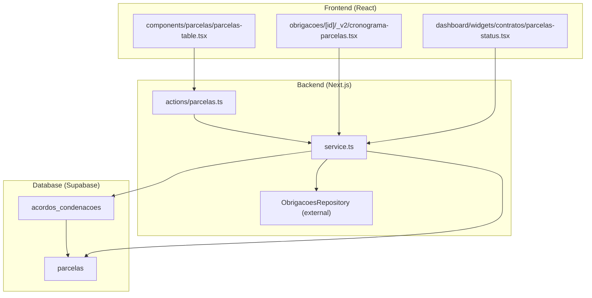
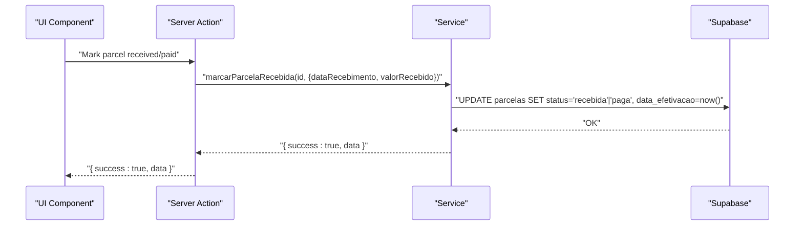
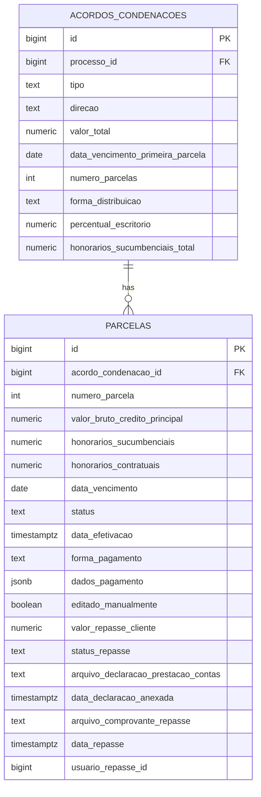
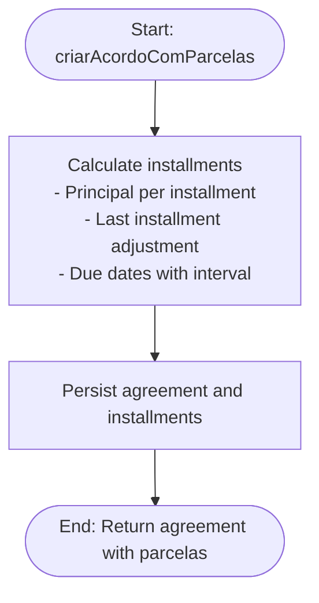
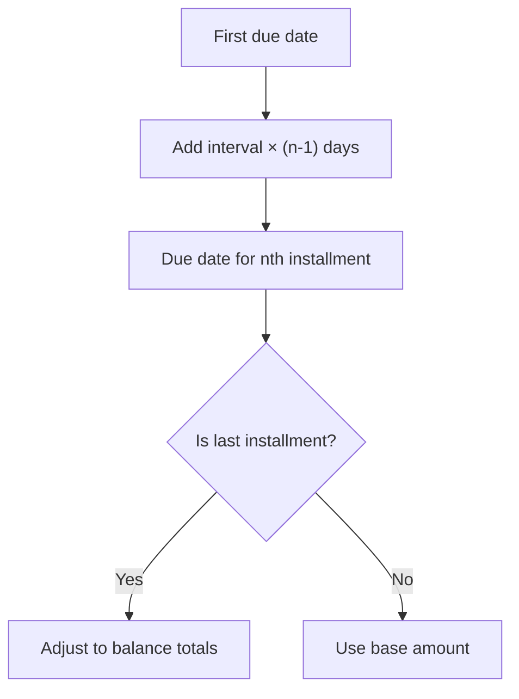
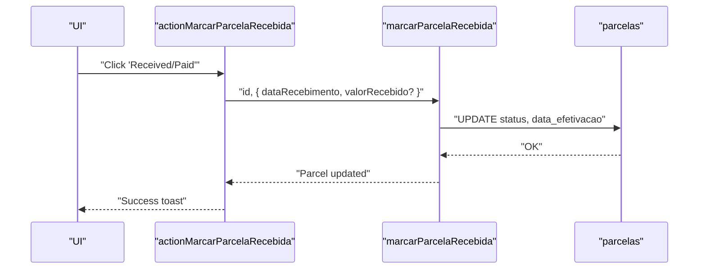
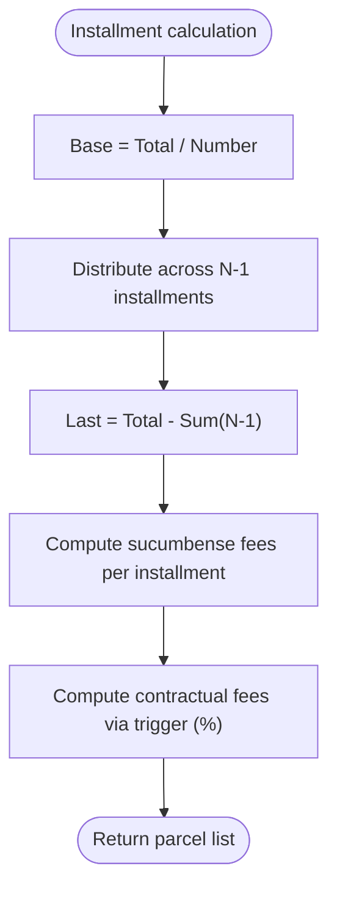
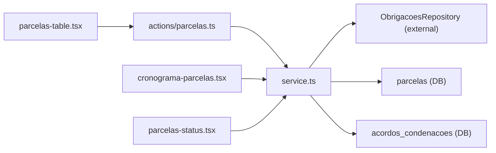

# Parcelas and Installment Management

<cite>
**Referenced Files in This Document**
- [create_parcelas.sql](file://supabase/migrations/20250118120001_create_parcelas.sql)
- [add_parcelas_prestacao_contas_cols.sql](file://supabase/migrations/20260422120100_add_parcelas_prestacao_contas_cols.sql)
- [create_acordos_condenacoes.sql](file://supabase/migrations/20250118120000_create_acordos_condenacoes.sql)
- [parcelas.ts](file://src/app/(authenticated)/obrigacoes/actions/parcelas.ts)
- [service.ts](file://src/app/(authenticated)/obrigacoes/service.ts)
- [parcelas-table.tsx](file://src/app/(authenticated)/obrigacoes/components/parcelas/parcelas-table.tsx)
- [cronograma-parcelas.tsx](file://src/app/(authenticated)/obrigacoes/[id]/_v2/cronograma-parcelas.tsx)
- [parcelas-status.tsx](file://src/app/(authenticated)/dashboard/widgets/contratos/parcelas-status.tsx)
- [types.ts](file://src/app/(authenticated)/obrigacoes/types.ts)
</cite>

## Table of Contents
1. [Introduction](#introduction)
2. [Project Structure](#project-structure)
3. [Core Components](#core-components)
4. [Architecture Overview](#architecture-overview)
5. [Detailed Component Analysis](#detailed-component-analysis)
6. [Dependency Analysis](#dependency-analysis)
7. [Performance Considerations](#performance-considerations)
8. [Troubleshooting Guide](#troubleshooting-guide)
9. [Conclusion](#conclusion)

## Introduction
This document describes the Parcelas and Installment Management system within the Zattar OS platform. It covers the end-to-end lifecycle of installment creation, payment scheduling, status tracking, and automatic payment processing triggers. It also documents the recurrence pattern system for regular payments, payment calculation algorithms, and the integration pathways for repays and reporting.

The system centers around two core database entities:
- AcordosCondenacoes: Agreements/condemnations that define the total amount, direction, and schedule parameters.
- Parcelas: Individual installments derived from an agreement, with editable amounts, calculated fees, due dates, and payment status.

## Project Structure
The implementation spans database migrations, backend services, and frontend components:

- Database layer: Supabase migrations define the parcel and agreement schemas, constraints, and indices.
- Backend layer: Next.js actions and service orchestrators coordinate creation, updates, and recalculations.
- Frontend layer: React components render payment timelines, status widgets, and interactive tables for managing parcel states.

**Diagram sources**
- [create_parcelas.sql:4-55](file://supabase/migrations/20250118120001_create_parcelas.sql#L4-L55)
- [create_acordos_condenacoes.sql](file://supabase/migrations/20250118120000_create_acordos_condenacoes.sql)
- [parcelas.ts](file://src/app/(authenticated)/obrigacoes/actions/parcelas.ts#L8-L42)
- [service.ts](file://src/app/(authenticated)/obrigacoes/service.ts#L19-L41)
- [parcelas-table.tsx](file://src/app/(authenticated)/obrigacoes/components/parcelas/parcelas-table.tsx#L57-L98)
- [cronograma-parcelas.tsx](file://src/app/(authenticated)/obrigacoes/[id]/_v2/cronograma-parcelas.tsx#L61-L177)
- [parcelas-status.tsx](file://src/app/(authenticated)/dashboard/widgets/contratos/parcelas-status.tsx#L26-L132)

**Section sources**
- [create_parcelas.sql:1-118](file://supabase/migrations/20250118120001_create_parcelas.sql#L1-L118)
- [create_acordos_condenacoes.sql](file://supabase/migrations/20250118120000_create_acordos_condenacoes.sql)
- [parcelas.ts](file://src/app/(authenticated)/obrigacoes/actions/parcelas.ts#L1-L44)
- [service.ts](file://src/app/(authenticated)/obrigacoes/service.ts#L1-L391)
- [parcelas-table.tsx](file://src/app/(authenticated)/obrigacoes/components/parcelas/parcelas-table.tsx#L1-L241)
- [cronograma-parcelas.tsx](file://src/app/(authenticated)/obrigacoes/[id]/_v2/cronograma-parcelas.tsx#L1-L178)
- [parcelas-status.tsx](file://src/app/(authenticated)/dashboard/widgets/contratos/parcelas-status.tsx#L1-L133)

## Core Components
- Parcelas table: Displays individual installments with financial details, due dates, status badges, and actions to mark as received/paid.
- Timeline widget: Visualizes the payment schedule horizontally with status dots and progress.
- Dashboard widget: Provides stacked bar visualization of parcel statuses and totals.
- Actions and service: Server actions delegate to service functions that orchestrate repository calls and calculations.

Key responsibilities:
- Creation: Build installments from agreement parameters and recurrence rules.
- Updates: Allow manual edits and status transitions.
- Reporting: Aggregate counts and values by status for dashboards.

**Section sources**
- [parcelas-table.tsx](file://src/app/(authenticated)/obrigacoes/components/parcelas/parcelas-table.tsx#L57-L241)
- [cronograma-parcelas.tsx](file://src/app/(authenticated)/obrigacoes/[id]/_v2/cronograma-parcelas.tsx#L61-L178)
- [parcelas-status.tsx](file://src/app/(authenticated)/dashboard/widgets/contratos/parcelas-status.tsx#L26-L133)
- [parcelas.ts](file://src/app/(authenticated)/obrigacoes/actions/parcelas.ts#L8-L42)
- [service.ts](file://src/app/(authenticated)/obrigacoes/service.ts#L65-L122)

## Architecture Overview
The system follows a layered architecture:
- Database: Strongly typed tables with constraints and indices for performance and integrity.
- Service layer: Business logic for installment calculation, status transitions, and validations.
- Action layer: Server actions for UI-triggered operations with caching invalidation.
- UI layer: Components for listing, timeline, and dashboard widgets.

**Diagram sources**
- [parcelas.ts](file://src/app/(authenticated)/obrigacoes/actions/parcelas.ts#L8-L19)
- [service.ts](file://src/app/(authenticated)/obrigacoes/service.ts#L69-L77)
- [create_parcelas.sql:16-26](file://supabase/migrations/20250118120001_create_parcelas.sql#L16-L26)

## Detailed Component Analysis

### Database Schema: Parcelas and AcordosCondenacoes
- Parcelas:
  - Primary keys, foreign key to agreements, and unique numbering per agreement.
  - Editable fields: principal amount, sucumbense fees, payment method, and manual edit flag.
  - Calculated fields: contractual fees (via triggers).
  - Status lifecycle: pending, received, paid, overdue.
  - Payment method options: direct transfer, judicial deposit, appellate deposit.
  - Repayment controls: client repayment value, status, file attachments, timestamps, and user who processed the repayment.
  - Indices for performance on status, due date, and repayment status.
  - Row-level security policies for authenticated access.

- AcordosCondenacoes:
  - Stores agreement metadata: process linkage, direction, total amount, first due date, number of installments, distribution method, office fee percentage, and total sucumbense fees.

**Diagram sources**
- [create_parcelas.sql:4-55](file://supabase/migrations/20250118120001_create_parcelas.sql#L4-L55)
- [create_acordos_condenacoes.sql](file://supabase/migrations/20250118120000_create_acordos_condenacoes.sql)

**Section sources**
- [create_parcelas.sql:4-118](file://supabase/migrations/20250118120001_create_parcelas.sql#L4-L118)
- [create_acordos_condenacoes.sql](file://supabase/migrations/20250118120000_create_acordos_condenacoes.sql)

### Installment Creation Workflow
- Inputs: Agreement parameters including total amount, first due date, number of installments, distribution method, office fee percentage, and total sucumbense fees.
- Calculation:
  - Base amount per installment equals total divided by number of installments.
  - Last installment receives rounding adjustment to ensure sum equals total.
  - Sucumbense fees are distributed similarly across installments.
  - Due dates are computed using a fixed interval between installments.
- Persistence: Created in a single transaction via the service layer.

**Diagram sources**
- [service.ts](file://src/app/(authenticated)/obrigacoes/service.ts#L19-L41)
- [service.ts](file://src/app/(authenticated)/obrigacoes/service.ts#L156-L200)

**Section sources**
- [service.ts](file://src/app/(authenticated)/obrigacoes/service.ts#L19-L41)
- [service.ts](file://src/app/(authenticated)/obrigacoes/service.ts#L156-L200)

### Payment Scheduling and Recurrence Patterns
- Fixed interval model: Installments are spaced by a constant number of days (default 30) from the first due date.
- Recurrence system: Implemented via iterative date addition per installment number.
- Custom schedules: Supported by allowing configurable intervals during creation and recalculation.

**Diagram sources**
- [service.ts](file://src/app/(authenticated)/obrigacoes/service.ts#L182-L197)

**Section sources**
- [service.ts](file://src/app/(authenticated)/obrigacoes/service.ts#L182-L197)

### Automatic Payment Processing Triggers
- Status transitions:
  - Marking a parcel as received sets the effective date and status accordingly.
  - Marking a parcel as paid updates status and effective timestamp.
- Integrity constraints:
  - Effective date presence is enforced for received/paid states.
  - Manual edit flag indicates overrides for redistribution logic.
  - Repayment status requires supporting file attachments and timestamps when marked as repaid.

**Diagram sources**
- [parcelas.ts](file://src/app/(authenticated)/obrigacoes/actions/parcelas.ts#L8-L19)
- [service.ts](file://src/app/(authenticated)/obrigacoes/service.ts#L69-L77)
- [create_parcelas.sql:43-46](file://supabase/migrations/20250118120001_create_parcelas.sql#L43-L46)

**Section sources**
- [parcelas.ts](file://src/app/(authenticated)/obrigacoes/actions/parcelas.ts#L8-L19)
- [service.ts](file://src/app/(authenticated)/obrigacoes/service.ts#L69-L77)
- [create_parcelas.sql:43-46](file://supabase/migrations/20250118120001_create_parcelas.sql#L43-L46)

### Payment Calculation Algorithms, Interest Accrual, and Penalty Application
- Principal and sucumbense allocation:
  - Even split per installment with last installment receiving rounding adjustments.
- Contractual fees:
  - Calculated automatically via triggers using office fee percentage against principal.
- Interest and penalties:
  - Not present in current schema or service logic; future enhancements would require adding rate fields and accrual computations.

**Diagram sources**
- [service.ts](file://src/app/(authenticated)/obrigacoes/service.ts#L164-L180)
- [create_parcelas.sql:13-14](file://supabase/migrations/20250118120001_create_parcelas.sql#L13-L14)

**Section sources**
- [service.ts](file://src/app/(authenticated)/obrigacoes/service.ts#L164-L180)
- [create_parcelas.sql:13-14](file://supabase/migrations/20250118120001_create_parcelas.sql#L13-L14)

### Examples: Installment Plan Creation, Payment Tracking, and Modification Workflows
- Installment plan creation:
  - Call the creation service with agreement parameters; it computes installments and persists them.
- Payment tracking:
  - Use the timeline component to visualize due dates and status progression.
  - Use the parcel table to see balances, fees, and status badges.
- Modification workflow:
  - Update parcel values via the table’s edit action.
  - Recalculate distribution only if no parcel has been paid yet; otherwise, prevent recalculation.

**Section sources**
- [service.ts](file://src/app/(authenticated)/obrigacoes/service.ts#L19-L41)
- [cronograma-parcelas.tsx](file://src/app/(authenticated)/obrigacoes/[id]/_v2/cronograma-parcelas.tsx#L61-L178)
- [parcelas-table.tsx](file://src/app/(authenticated)/obrigacoes/components/parcelas/parcelas-table.tsx#L57-L98)
- [service.ts](file://src/app/(authenticated)/obrigacoes/service.ts#L79-L122)

### Integration with Banking Systems, Automatic Debit Processing, and Payment Failure Handling
- Current integration points:
  - Payment method field supports three options: direct transfer, judicial deposit, and appellate deposit.
  - Repayment workflow integrates with Prestaçao de Contas (financial reporting) via dedicated columns and status transitions.
- Automatic debit processing:
  - Not implemented in the current schema; would require additional fields for bank account details, mandate IDs, and scheduling hooks.
- Payment failure handling:
  - Not implemented in the current schema; would require failure logs, retry mechanisms, and escalation policies.

**Section sources**
- [create_parcelas.sql:21-23](file://supabase/migrations/20250118120001_create_parcelas.sql#L21-L23)
- [add_parcelas_prestacao_contas_cols.sql](file://supabase/migrations/20260422120100_add_parcelas_prestacao_contas_cols.sql)

### Reporting Capabilities for Installment Performance and Delinquency Tracking
- Status breakdown:
  - Dashboard widget aggregates parcel counts and values by status, showing totals and pending amounts.
- Timeline visualization:
  - Horizontal timeline highlights overdue parcels and progress.
- Filters and queries:
  - Service functions support filtering by client CPF/CNPJ and process number for targeted reporting.

**Section sources**
- [parcelas-status.tsx](file://src/app/(authenticated)/dashboard/widgets/contratos/parcelas-status.tsx#L26-L133)
- [cronograma-parcelas.tsx](file://src/app/(authenticated)/obrigacoes/[id]/_v2/cronograma-parcelas.tsx#L61-L178)
- [service.ts](file://src/app/(authenticated)/obrigacoes/service.ts#L236-L287)
- [service.ts](file://src/app/(authenticated)/obrigacoes/service.ts#L292-L341)
- [service.ts](file://src/app/(authenticated)/obrigacoes/service.ts#L350-L390)

## Dependency Analysis
- Database dependencies:
  - Parcelas depend on AcordosCondenacoes via foreign key.
  - Indices optimize status, due date, and repayment queries.
- Service dependencies:
  - Service orchestrates repository calls and calculation helpers.
  - Actions depend on service functions and invalidate Next.js cache after mutations.
- UI dependencies:
  - Components depend on typed domain models and service functions for data fetching and updates.

**Diagram sources**
- [service.ts](file://src/app/(authenticated)/obrigacoes/service.ts#L1-L15)
- [parcelas.ts](file://src/app/(authenticated)/obrigacoes/actions/parcelas.ts#L1-L7)
- [parcelas-table.tsx](file://src/app/(authenticated)/obrigacoes/components/parcelas/parcelas-table.tsx#L20-L22)
- [cronograma-parcelas.tsx](file://src/app/(authenticated)/obrigacoes/[id]/_v2/cronograma-parcelas.tsx#L13-L14)
- [parcelas-status.tsx](file://src/app/(authenticated)/dashboard/widgets/contratos/parcelas-status.tsx#L26-L27)

**Section sources**
- [service.ts](file://src/app/(authenticated)/obrigacoes/service.ts#L1-L15)
- [parcelas.ts](file://src/app/(authenticated)/obrigacoes/actions/parcelas.ts#L1-L7)
- [parcelas-table.tsx](file://src/app/(authenticated)/obrigacoes/components/parcelas/parcelas-table.tsx#L20-L22)
- [cronograma-parcelas.tsx](file://src/app/(authenticated)/obrigacoes/[id]/_v2/cronograma-parcelas.tsx#L13-L14)
- [parcelas-status.tsx](file://src/app/(authenticated)/dashboard/widgets/contratos/parcelas-status.tsx#L26-L27)

## Performance Considerations
- Indexes:
  - Status, due date, repayment status, and composite indexes improve query performance for filtering and sorting.
- Triggers:
  - Updated-at triggers keep metadata synchronized efficiently.
- UI rendering:
  - Memoization and minimal re-renders in table and timeline components reduce overhead.
- Recommendations:
  - Add indexes on agreement foreign keys for fast parcel retrieval.
  - Consider partitioning for very large datasets by due date ranges.

[No sources needed since this section provides general guidance]

## Troubleshooting Guide
Common scenarios and resolutions:
- Recalculation blocked:
  - If any parcel is already received/paid, recalculation is prevented to maintain integrity.
- Missing supporting documents:
  - Repayment cannot be finalized without the required declaration attachment.
- Status inconsistencies:
  - Effective date must be present for received/paid states; triggers enforce this.

**Section sources**
- [service.ts](file://src/app/(authenticated)/obrigacoes/service.ts#L83-L89)
- [service.ts](file://src/app/(authenticated)/obrigacoes/service.ts#L144-L151)
- [create_parcelas.sql:43-46](file://supabase/migrations/20250118120001_create_parcelas.sql#L43-L46)

## Conclusion
The Parcelas and Installment Management system provides a robust foundation for managing payment schedules, status tracking, and reporting. Its modular design enables straightforward extension for automatic debit processing, interest accrual, and penalty application. The current implementation focuses on strong data integrity, clear status lifecycles, and intuitive UI components for oversight and operational tasks.