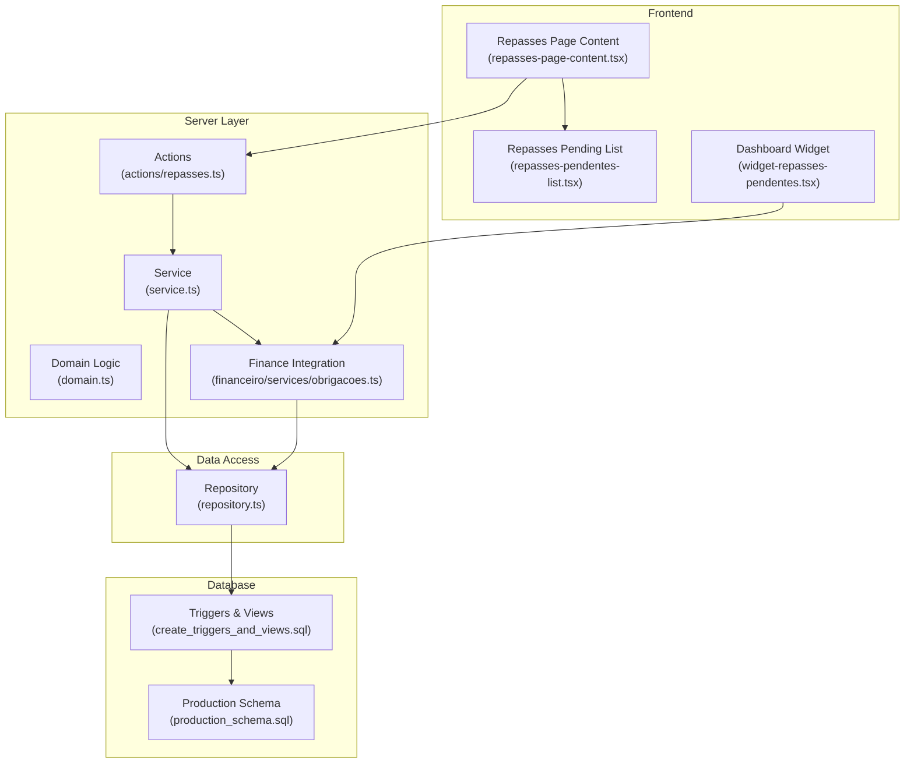
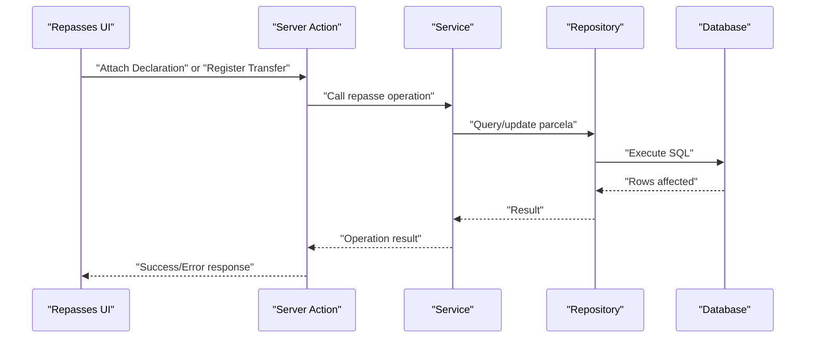
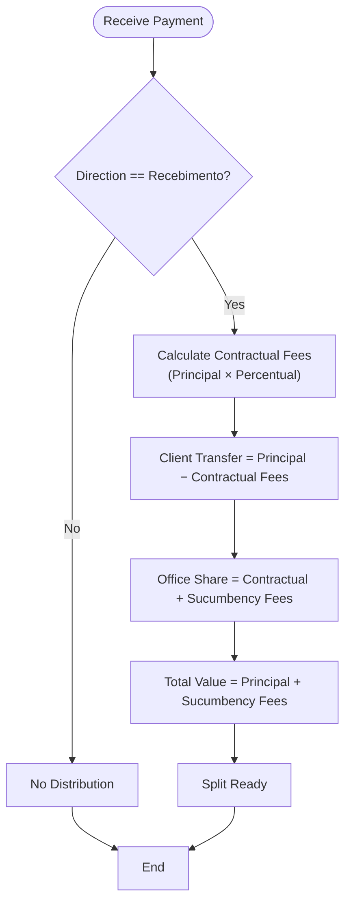
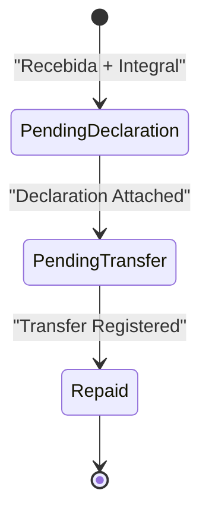
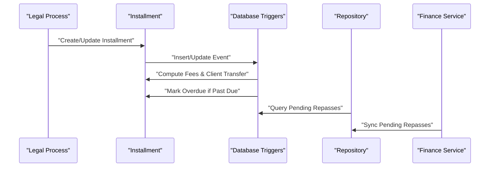
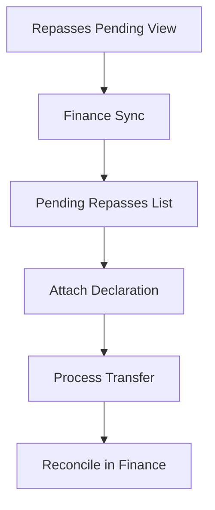
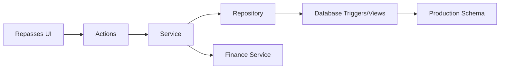
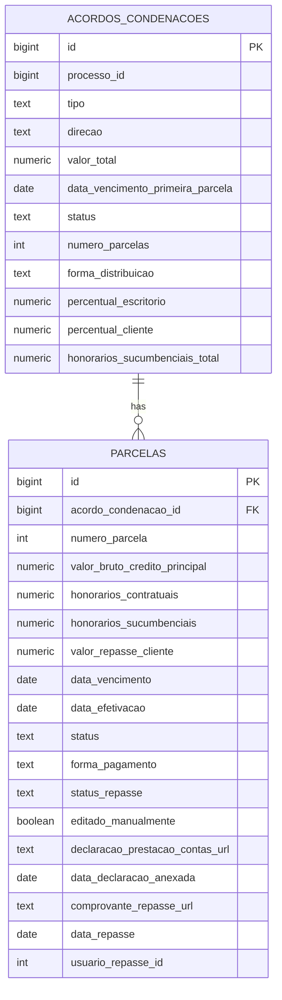

# Repasses Management

<cite>
**Referenced Files in This Document**
- [repasses-page-content.tsx](file://src/app/(authenticated)/repasses/components/repasses-page-content.tsx)
- [repasses-pendentes-list.tsx](file://src/app/(authenticated)/obrigacoes/components/repasses/repasses-pendentes-list.tsx)
- [actions/repasses.ts](file://src/app/(authenticated)/obrigacoes/actions/repasses.ts)
- [service.ts](file://src/app/(authenticated)/obrigacoes/service.ts)
- [domain.ts](file://src/app/(authenticated)/obrigacoes/domain.ts)
- [types.ts](file://src/app/(authenticated)/obrigacoes/types.ts)
- [repository.ts](file://src/app/(authenticated)/obrigacoes/repository.ts)
- [create_triggers_and_views.sql](file://supabase/migrations/20250118120002_create_triggers_and_views.sql)
- [production_schema.sql](file://supabase/migrations/00000000000001_production_schema.sql)
- [obrigacoes.ts](file://src/app/(authenticated)/financeiro/services/obrigacoes.ts)
- [repasse-flow.spec.ts](file://src/app/(authenticated)/obrigacoes/__tests__/e2e/repasse-flow.spec.ts)
- [repasses-flow.integration.test.ts](file://src/app/(authenticated)/obrigacoes/__tests__/integration/repasses-flow.integration.test.ts)
- [repasses-actions.test.ts](file://src/app/(authenticated)/obrigacoes/__tests__/actions/repasses-actions.test.ts)
- [obrigacoes.domain.test.ts](file://src/app/(authenticated)/obrigacoes/__tests__/unit/obrigacoes.domain.test.ts)
- [widget-repasses-pendentes.tsx](file://src/app/(authenticated)/dashboard/widgets/contratos/repasses-pendentes.tsx)
</cite>

## Table of Contents
1. [Introduction](#introduction)
2. [Project Structure](#project-structure)
3. [Core Components](#core-components)
4. [Architecture Overview](#architecture-overview)
5. [Detailed Component Analysis](#detailed-component-analysis)
6. [Dependency Analysis](#dependency-analysis)
7. [Performance Considerations](#performance-considerations)
8. [Troubleshooting Guide](#troubleshooting-guide)
9. [Conclusion](#conclusion)
10. [Appendices](#appendices)

## Introduction
This document describes the Repasses Management system responsible for distributing payments to attorneys, opposing parties, and third parties within legal processes. It explains the commission calculation algorithms, fee structures, distribution rules, integration with legal processes, reporting and reconciliation workflows, compliance requirements, tax implications, regulatory reporting, and integration with payroll and accounting systems.

## Project Structure
The Repasses Management system spans frontend components, server actions, domain logic, repository access, and database triggers/views. The key areas include:
- Frontend pages and lists for repasses
- Server actions orchestrating repasse operations
- Business logic for calculations and validations
- Repository layer for data access
- Database triggers and views for automatic status updates and reporting
- Finance integration services for accounting alignment

**Diagram sources**
- [repasses-page-content.tsx](file://src/app/(authenticated)/repasses/components/repasses-page-content.tsx#L16-L68)
- [repasses-pendentes-list.tsx](file://src/app/(authenticated)/obrigacoes/components/repasses/repasses-pendentes-list.tsx#L30-L139)
- [actions/repasses.ts](file://src/app/(authenticated)/obrigacoes/actions/repasses.ts#L8-L41)
- [service.ts](file://src/app/(authenticated)/obrigacoes/service.ts#L126-L152)
- [domain.ts](file://src/app/(authenticated)/obrigacoes/domain.ts#L350-L458)
- [repository.ts](file://src/app/(authenticated)/obrigacoes/repository.ts#L595-L627)
- [create_triggers_and_views.sql:7-52](file://supabase/migrations/20250118120002_create_triggers_and_views.sql#L7-L52)
- [production_schema.sql:920-1012](file://supabase/migrations/00000000000001_production_schema.sql#L920-L1012)
- [obrigacoes.ts](file://src/app/(authenticated)/financeiro/services/obrigacoes.ts#L141-L198)

**Section sources**
- [repasses-page-content.tsx](file://src/app/(authenticated)/repasses/components/repasses-page-content.tsx#L1-L69)
- [repasses-pendentes-list.tsx](file://src/app/(authenticated)/obrigacoes/components/repasses/repasses-pendentes-list.tsx#L1-L140)
- [actions/repasses.ts](file://src/app/(authenticated)/obrigacoes/actions/repasses.ts#L1-L42)
- [service.ts](file://src/app/(authenticated)/obrigacoes/service.ts#L120-L319)
- [domain.ts](file://src/app/(authenticated)/obrigacoes/domain.ts#L1-L559)
- [repository.ts](file://src/app/(authenticated)/obrigacoes/repository.ts#L595-L627)
- [create_triggers_and_views.sql:1-226](file://supabase/migrations/20250118120002_create_triggers_and_views.sql#L1-L226)
- [production_schema.sql:920-1012](file://supabase/migrations/00000000000001_production_schema.sql#L920-L1012)
- [obrigacoes.ts](file://src/app/(authenticated)/financeiro/services/obrigacoes.ts#L141-L222)

## Core Components
- Repasses Page Content: Orchestrates dialogs for attaching declarations and processing transfers, refreshing lists after successful operations.
- Repasses Pending List: Displays pending repasses grouped by status ("Aguardando Declaração" and "Pronto p/ Transferir"), with actions to generate links and attach documents.
- Server Actions: Provide server-side entry points for listing repasses, attaching declarations, and registering transfers with revalidation of cached routes.
- Service Layer: Implements business logic for repasse operations, including validation, status transitions, and integration with repositories and finance services.
- Domain Logic: Defines types, enums, calculation functions (split payment, repasse totals), validation rules, and status determination helpers.
- Repository: Handles database queries for repasses, including filtering by status, date range, and value thresholds, and updating repasse-related fields.
- Database Triggers/Views: Automatically compute contractual fees, client transfer amounts, overdue statuses, and maintain a consolidated view of pending repasses.
- Finance Integration: Provides methods to list pending repasses for finance synchronization, register declaration submissions, and finalize repasse registrations.

**Section sources**
- [repasses-page-content.tsx](file://src/app/(authenticated)/repasses/components/repasses-page-content.tsx#L16-L68)
- [repasses-pendentes-list.tsx](file://src/app/(authenticated)/obrigacoes/components/repasses/repasses-pendentes-list.tsx#L30-L139)
- [actions/repasses.ts](file://src/app/(authenticated)/obrigacoes/actions/repasses.ts#L8-L41)
- [service.ts](file://src/app/(authenticated)/obrigacoes/service.ts#L126-L152)
- [domain.ts](file://src/app/(authenticated)/obrigacoes/domain.ts#L350-L458)
- [repository.ts](file://src/app/(authenticated)/obrigacoes/repository.ts#L595-L627)
- [create_triggers_and_views.sql:175-204](file://supabase/migrations/20250118120002_create_triggers_and_views.sql#L175-L204)
- [obrigacoes.ts](file://src/app/(authenticated)/financeiro/services/obrigacoes.ts#L141-L198)

## Architecture Overview
The system follows a layered architecture:
- Presentation: Next.js client components render repasse lists and dialogs.
- Server Actions: Encapsulate data mutations and orchestrate service calls.
- Service: Enforce business rules, perform calculations, and coordinate with repositories and finance services.
- Repository: Abstract database access and expose typed operations.
- Database: Triggers and views enforce data integrity and provide reporting views.

**Diagram sources**
- [actions/repasses.ts](file://src/app/(authenticated)/obrigacoes/actions/repasses.ts#L8-L41)
- [service.ts](file://src/app/(authenticated)/obrigacoes/service.ts#L130-L152)
- [repository.ts](file://src/app/(authenticated)/obrigacoes/repository.ts#L612-L627)

## Detailed Component Analysis

### Commission Calculation and Fee Structures
The system calculates splits for received payments using contractual and sucumbency fees:
- Contractual fees: Percentage applied to the principal amount of each installment.
- Sucumbency fees: Fixed portion charged upon success outcomes.
- Client transfer amount: Principal minus contractual fees.
- Office share: Contractual plus sucumbency fees.
- Total value: Principal plus sucumbency fees.

**Diagram sources**
- [domain.ts](file://src/app/(authenticated)/obrigacoes/domain.ts#L376-L396)

**Section sources**
- [domain.ts](file://src/app/(authenticated)/obrigacoes/domain.ts#L350-L396)

### Distribution Rules and Status Transitions
Distribution rules are enforced by database triggers and domain logic:
- Integral distribution triggers client transfer calculations and initial repasse status.
- Status transitions:
  - Recebida → Pendente Declaração (integral distribution)
  - Declaração Anexada → Pendente Transferência
  - Transferência Registrada → Repassado

**Diagram sources**
- [create_triggers_and_views.sql:143-170](file://supabase/migrations/20250118120002_create_triggers_and_views.sql#L143-L170)
- [domain.ts](file://src/app/(authenticated)/obrigacoes/domain.ts#L434-L458)

**Section sources**
- [create_triggers_and_views.sql:29-42](file://supabase/migrations/20250118120002_create_triggers_and_views.sql#L29-L42)
- [domain.ts](file://src/app/(authenticated)/obrigacoes/domain.ts#L431-L458)

### Legal Process Integration
Payments flow from legal process obligations to clients:
- Installment creation computes contractual fees and client transfer amounts.
- Overdue status is automatically updated for past-due installments.
- Agreement status aggregates from individual installment statuses.

**Diagram sources**
- [create_triggers_and_views.sql:7-52](file://supabase/migrations/20250118120002_create_triggers_and_views.sql#L7-L52)
- [production_schema.sql:964-1012](file://supabase/migrations/00000000000001_production_schema.sql#L964-L1012)
- [repository.ts](file://src/app/(authenticated)/obrigacoes/repository.ts#L595-L610)
- [obrigacoes.ts](file://src/app/(authenticated)/financeiro/services/obrigacoes.ts#L144-L146)

**Section sources**
- [service.ts](file://src/app/(authenticated)/obrigacoes/service.ts#L156-L200)
- [create_triggers_and_views.sql:57-75](file://supabase/migrations/20250118120002_create_triggers_and_views.sql#L57-L75)
- [production_schema.sql:920-952](file://supabase/migrations/00000000000001_production_schema.sql#L920-L952)

### Reporting and Reconciliation Workflows
- Pending repasses view consolidates records requiring declaration or transfer.
- Finance integration exposes pending repasses for accounting synchronization.
- Manual reconciliation supports attaching supporting documents and confirming transfers.

**Diagram sources**
- [create_triggers_and_views.sql:175-204](file://supabase/migrations/20250118120002_create_triggers_and_views.sql#L175-L204)
- [obrigacoes.ts](file://src/app/(authenticated)/financeiro/services/obrigacoes.ts#L144-L173)

**Section sources**
- [repository.ts](file://src/app/(authenticated)/obrigacoes/repository.ts#L595-L610)
- [obrigacoes.ts](file://src/app/(authenticated)/financeiro/services/obrigacoes.ts#L141-L198)

### Practical Examples

#### Example 1: Creating and Distributing a Repasse
- Scenario: A client receives an installment under integral distribution.
- Steps:
  - Mark installment as received (triggers status to "Pendente Declaração").
  - Attach declaration of account (status moves to "Pendente Transferência").
  - Register transfer with supporting document (status becomes "Repassado").

**Section sources**
- [repasse-flow.spec.ts](file://src/app/(authenticated)/obrigacoes/__tests__/e2e/repasse-flow.spec.ts#L36-L104)
- [repasses-flow.integration.test.ts](file://src/app/(authenticated)/obrigacoes/__tests__/integration/repasses-flow.integration.test.ts#L1-L42)

#### Example 2: Validation and Error Handling
- Attempting to register a repasse without an attached declaration fails with a clear error.
- Recalculation of distributions is blocked if any installment is already paid.

**Section sources**
- [service.ts](file://src/app/(authenticated)/obrigacoes/service.ts#L140-L152)
- [repasses-actions.test.ts](file://src/app/(authenticated)/obrigacoes/__tests__/actions/repasses-actions.test.ts#L98-L161)

#### Example 3: Calculation Validation
- Unit tests validate split calculations for different percentages and inclusion of sucumbency fees.

**Section sources**
- [obrigacoes.domain.test.ts](file://src/app/(authenticated)/obrigacoes/__tests__/unit/obrigacoes.domain.test.ts#L14-L73)

### Compliance, Tax, and Regulatory Reporting
- Declaration requirement: A declaration of account must be attached before transferring funds to clients.
- Status enforcement: Automatic transitions ensure compliance with procedural steps.
- Financial alignment: Finance service integrates repasses for accounting and reconciliation.

**Section sources**
- [domain.ts](file://src/app/(authenticated)/obrigacoes/domain.ts#L448-L458)
- [obrigacoes.ts](file://src/app/(authenticated)/financeiro/services/obrigacoes.ts#L158-L173)

### Payroll and Accounting Integration
- Finance integration service:
  - Lists pending repasses for synchronization.
  - Registers declarations and finalizes repasse entries.
  - Calculates totals for client repasses.
- Dashboard widget displays pending repasses with client/share breakdown.

**Section sources**
- [obrigacoes.ts](file://src/app/(authenticated)/financeiro/services/obrigacoes.ts#L141-L222)
- [widget-repasses-pendentes.tsx](file://src/app/(authenticated)/dashboard/widgets/contratos/repasses-pendentes.tsx#L88-L136)

## Dependency Analysis

**Diagram sources**
- [repasses-pendentes-list.tsx](file://src/app/(authenticated)/obrigacoes/components/repasses/repasses-pendentes-list.tsx#L30-L139)
- [actions/repasses.ts](file://src/app/(authenticated)/obrigacoes/actions/repasses.ts#L8-L41)
- [service.ts](file://src/app/(authenticated)/obrigacoes/service.ts#L126-L152)
- [repository.ts](file://src/app/(authenticated)/obrigacoes/repository.ts#L595-L627)
- [create_triggers_and_views.sql:175-204](file://supabase/migrations/20250118120002_create_triggers_and_views.sql#L175-L204)
- [production_schema.sql:920-1012](file://supabase/migrations/00000000000001_production_schema.sql#L920-L1012)
- [obrigacoes.ts](file://src/app/(authenticated)/financeiro/services/obrigacoes.ts#L141-L198)

**Section sources**
- [domain.ts](file://src/app/(authenticated)/obrigacoes/domain.ts#L350-L458)
- [types.ts](file://src/app/(authenticated)/obrigacoes/types.ts#L44-L54)

## Performance Considerations
- Triggers minimize application-level duplication by computing fees and client transfers at persistence time.
- Views consolidate pending repasses for efficient reporting and dashboard rendering.
- Filtering parameters (date ranges, value thresholds) reduce payload sizes for large datasets.

[No sources needed since this section provides general guidance]

## Troubleshooting Guide
Common issues and resolutions:
- Missing declaration prevents repasse registration: Attach a declaration of account before processing transfers.
- Recalculation blocked due to paid installments: Ensure no installments are in "pago" status before recalculating distributions.
- Validation errors on split calculations: Verify percentage values and principal/sucumbency amounts meet business rules.

**Section sources**
- [service.ts](file://src/app/(authenticated)/obrigacoes/service.ts#L140-L152)
- [repasses-actions.test.ts](file://src/app/(authenticated)/obrigacoes/__tests__/actions/repasses-actions.test.ts#L145-L160)
- [obrigacoes.domain.test.ts](file://src/app/(authenticated)/obrigacoes/__tests__/unit/obrigacoes.domain.test.ts#L14-L73)

## Conclusion
The Repasses Management system enforces strict distribution rules, automates fee calculations, and integrates seamlessly with legal processes and finance systems. Its trigger-driven architecture ensures data integrity, while comprehensive validation and status transitions support compliance and accurate financial reporting.

[No sources needed since this section summarizes without analyzing specific files]

## Appendices

### Data Model Overview

**Diagram sources**
- [domain.ts](file://src/app/(authenticated)/obrigacoes/domain.ts#L42-L95)
- [production_schema.sql:920-1012](file://supabase/migrations/00000000000001_production_schema.sql#L920-L1012)