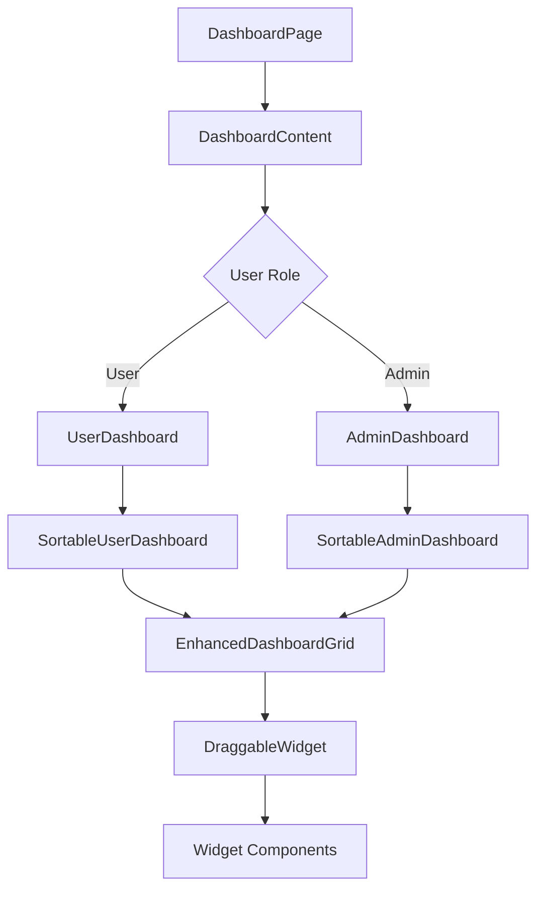
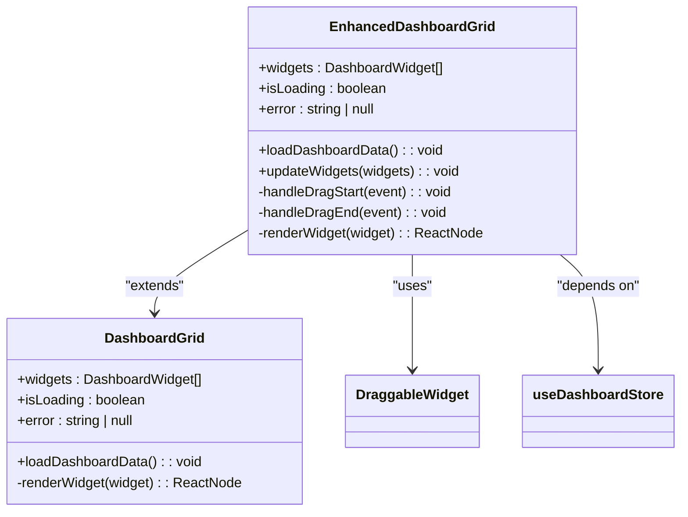
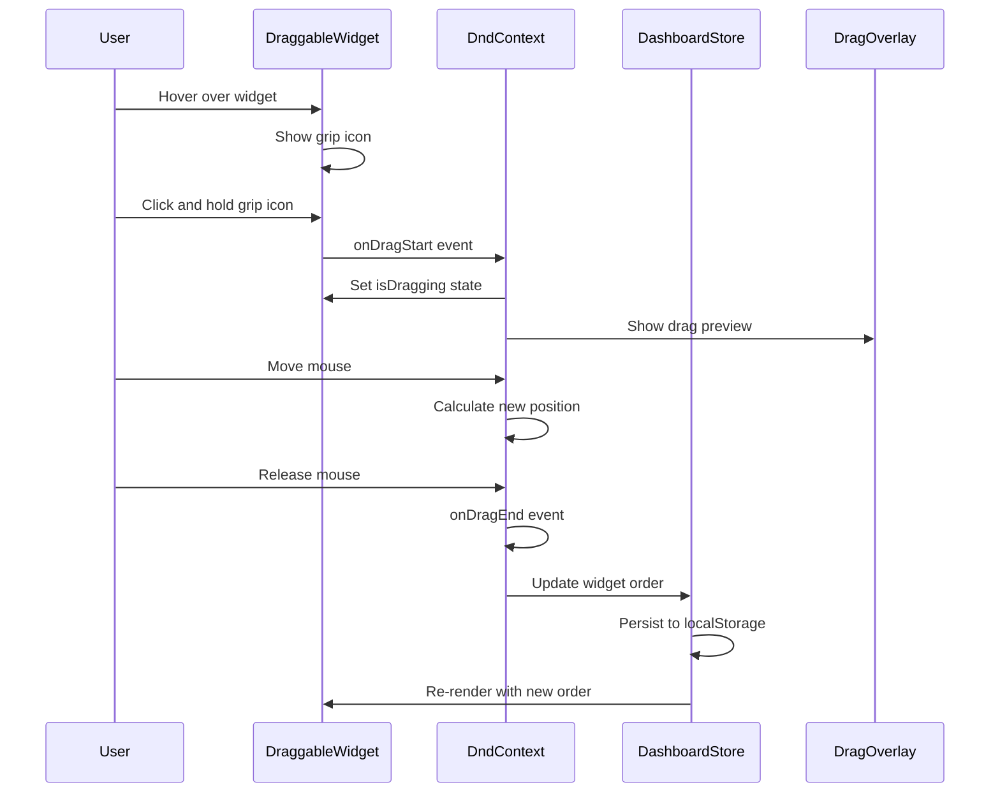
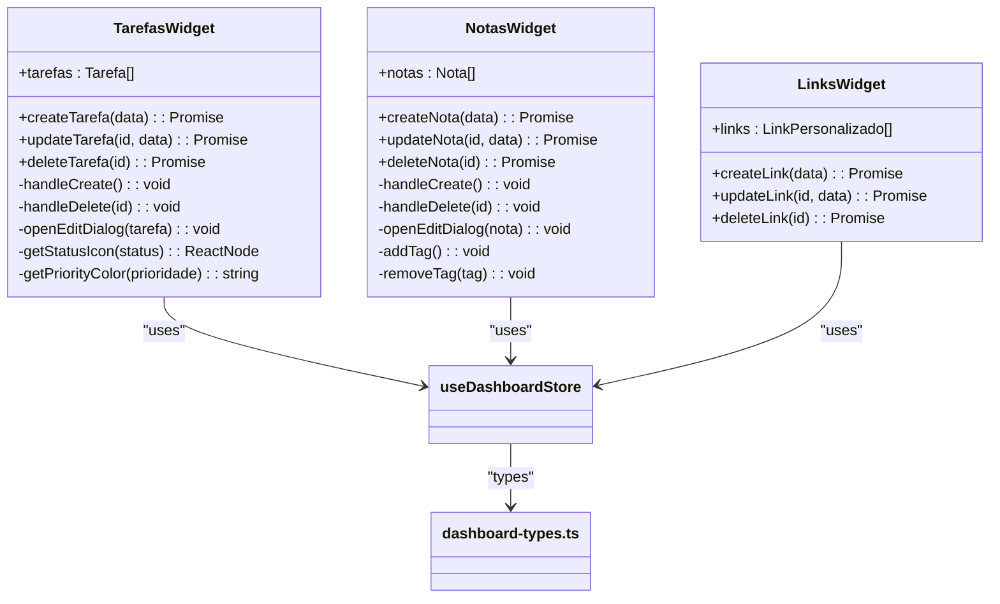
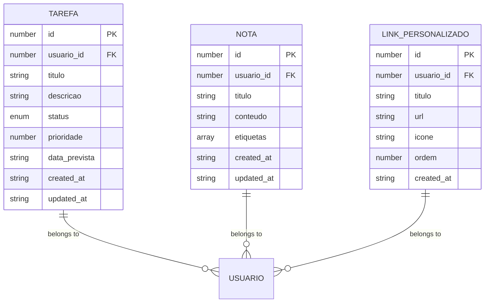
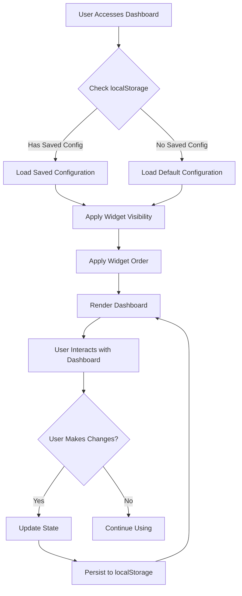

# Dashboard Components

<cite>
**Referenced Files in This Document**   
- [dashboard-content.tsx](file://app/(dashboard)/dashboard/components/dashboard-content.tsx)
- [enhanced-dashboard-grid.tsx](file://app/(dashboard)/dashboard/components/enhanced-dashboard-grid.tsx)
- [sortable-dashboard.tsx](file://app/(dashboard)/dashboard/components/sortable-dashboard.tsx)
- [drag-drop-dashboard.tsx](file://app/(dashboard)/dashboard/components/drag-drop-dashboard.tsx)
- [dashboard-grid.tsx](file://app/(dashboard)/dashboard/components/dashboard-grid.tsx)
- [draggable-widget.tsx](file://app/(dashboard)/dashboard/components/draggable-widget.tsx)
- [tarefas-widget.tsx](file://app/(dashboard)/dashboard/components/tarefas-widget.tsx)
- [notas-widget.tsx](file://app/(dashboard)/dashboard/components/notas-widget.tsx)
- [links-widget.tsx](file://app/(dashboard)/dashboard/components/links-widget.tsx)
- [dashboard-store.ts](file://app/_lib/stores/dashboard-store.ts)
- [dashboard-types.ts](file://app/_lib/dashboard-types.ts)
- [page.tsx](file://app/(dashboard)/dashboard/page.tsx)
</cite>

## Table of Contents
1. [Introduction](#introduction)
2. [Core Architecture](#core-architecture)
3. [Dashboard Grid Components](#dashboard-grid-components)
4. [Drag-and-Drop Functionality](#drag-and-drop-functionality)
5. [Widget Components](#widget-components)
6. [State Management](#state-management)
7. [Personalization Features](#personalization-features)
8. [Integration with UI Library](#integration-with-ui-library)
9. [Common Issues and Solutions](#common-issues-and-solutions)
10. [Conclusion](#conclusion)

## Introduction

The Sinesys dashboard components provide a comprehensive, personalized user experience with drag-and-drop functionality, widget customization, and responsive layout capabilities. This documentation details the implementation of key components including EnhancedDashboardGrid, DraggableWidget, and SortableDashboard, explaining their architecture, relationships, and integration with the overall system. The dashboard supports both user and admin views with different widget configurations and data visualizations.

**Section sources**
- [page.tsx](file://app/(dashboard)/dashboard/page.tsx)

## Core Architecture

The dashboard architecture is built around a modular component system with clear separation of concerns. The main entry point is the DashboardContent component, which orchestrates the rendering of different dashboard views based on user role (user or admin). The architecture follows a layered approach with presentation components, state management, and data fetching layers.

The system uses React's component composition pattern extensively, with higher-order components managing state and lower-level components handling presentation. The dashboard supports both static and dynamic widget layouts, with the ability to persist user preferences through localStorage.

**Diagram sources**
- [dashboard-content.tsx](file://app/(dashboard)/dashboard/components/dashboard-content.tsx)
- [page.tsx](file://app/(dashboard)/dashboard/page.tsx)

**Section sources**
- [dashboard-content.tsx](file://app/(dashboard)/dashboard/components/dashboard-content.tsx)

## Dashboard Grid Components

### EnhancedDashboardGrid

The EnhancedDashboardGrid component provides a sophisticated grid layout system with drag-and-drop reordering capabilities. It uses the @dnd-kit library to implement smooth drag interactions with visual feedback. The component manages widget ordering through the dashboard store and persists changes to localStorage.

Key features include:
- Vertical sorting strategy for widget reordering
- Drag overlay with visual feedback during drag operations
- Skeleton loading states for better UX
- Error handling with retry functionality

The grid uses a responsive design with different column spans based on widget size configuration, supporting small (1 column), medium (2 columns), large (3 columns), and full-width layouts.

### DashboardGrid

The basic DashboardGrid component provides a simpler grid layout without drag-and-drop capabilities. It serves as a fallback or lightweight alternative to the enhanced version. The component renders widgets in a responsive grid pattern with predefined column configurations.

**Diagram sources**
- [enhanced-dashboard-grid.tsx](file://app/(dashboard)/dashboard/components/enhanced-dashboard-grid.tsx)
- [dashboard-grid.tsx](file://app/(dashboard)/dashboard/components/dashboard-grid.tsx)

**Section sources**
- [enhanced-dashboard-grid.tsx](file://app/(dashboard)/dashboard/components/enhanced-dashboard-grid.tsx)
- [dashboard-grid.tsx](file://app/(dashboard)/dashboard/components/dashboard-grid.tsx)

## Drag-and-Drop Functionality

### DraggableWidget

The DraggableWidget component encapsulates the drag-and-drop behavior for individual dashboard widgets. It uses the @dnd-kit/core useDraggable hook to provide drag functionality with proper visual feedback. The component renders a grip icon in the top-right corner that appears on hover, allowing users to initiate drag operations.

Key implementation details:
- Uses PointerSensor with distance constraint (8px) to prevent accidental drags
- Provides visual feedback through opacity changes and cursor styling
- Manages drag state (isDragging) for styling purposes
- Integrates with the parent DndContext for cross-component drag operations

### DragDropDashboard

The DragDropDashboard component implements a complete drag-and-drop interface using the @dnd-kit library. It sets up the DndContext with appropriate sensors and handles drag events to reorder widgets. The component uses SortableContext with verticalListSortingStrategy to manage widget ordering.

The implementation includes:
- DragOverlay for visual feedback during drag operations
- Proper event handling for drag start, drag end, and drag cancel
- Integration with the dashboard store for state persistence
- Responsive design considerations

**Diagram sources**
- [draggable-widget.tsx](file://app/(dashboard)/dashboard/components/draggable-widget.tsx)
- [drag-drop-dashboard.tsx](file://app/(dashboard)/dashboard/components/drag-drop-dashboard.tsx)

**Section sources**
- [draggable-widget.tsx](file://app/(dashboard)/dashboard/components/draggable-widget.tsx)
- [drag-drop-dashboard.tsx](file://app/(dashboard)/dashboard/components/drag-drop-dashboard.tsx)

## Widget Components

### TarefasWidget

The TarefasWidget (Tasks Widget) provides a complete task management interface with CRUD operations. It displays a list of tasks with status indicators, priority badges, and due dates. Users can create, edit, and delete tasks through a modal dialog interface.

Key features:
- Status visualization with color-coded icons (pending, in progress, completed)
- Priority system with 1-5 scale and color coding
- Due date tracking with calendar integration
- Inline editing and deletion with confirmation
- Display limits (5 tasks) with potential pagination

### NotasWidget

The NotasWidget (Notes Widget) implements a note-taking system with tagging capabilities. It allows users to create, edit, and organize notes with custom tags for categorization. The widget supports rich text content and provides a clean, card-based interface.

Key features:
- Tag management with add/remove functionality
- Content preview with line clamping
- Click-to-edit behavior for quick modifications
- Visual distinction between title and content
- Responsive design for different screen sizes

### LinksWidget

The LinksWidget manages custom links with titles, URLs, and optional icons. It provides a simple interface for organizing frequently used resources and tools within the dashboard.

**Diagram sources**
- [tarefas-widget.tsx](file://app/(dashboard)/dashboard/components/tarefas-widget.tsx)
- [notas-widget.tsx](file://app/(dashboard)/dashboard/components/notas-widget.tsx)
- [links-widget.tsx](file://app/(dashboard)/dashboard/components/links-widget.tsx)

**Section sources**
- [tarefas-widget.tsx](file://app/(dashboard)/dashboard/components/tarefas-widget.tsx)
- [notas-widget.tsx](file://app/(dashboard)/dashboard/components/notas-widget.tsx)
- [links-widget.tsx](file://app/(dashboard)/dashboard/components/links-widget.tsx)

## State Management

### Dashboard Store

The dashboard state is managed through a centralized Zustand store (dashboard-store.ts) that handles all dashboard-related data and operations. The store provides a clean API for components to interact with dashboard data without direct API calls.

Key store functionality:
- Data loading and caching
- Widget configuration management
- CRUD operations for dashboard entities (tasks, notes, links)
- Loading and error state management
- Automatic data refresh capabilities

The store follows the singleton pattern and is accessed through the useDashboardStore hook, providing a consistent interface across components.

### Data Types

The dashboard uses TypeScript interfaces to define data structures, ensuring type safety throughout the application. Key types include:

- **Tarefa**: Task entity with title, description, status, priority, and due date
- **Nota**: Note entity with title, content, and tags
- **LinkPersonalizado**: Custom link with title, URL, and optional icon
- **DashboardWidget**: Widget configuration with type, title, visibility, and size

**Diagram sources**
- [dashboard-store.ts](file://app/_lib/stores/dashboard-store.ts)
- [dashboard-types.ts](file://app/_lib/dashboard-types.ts)

**Section sources**
- [dashboard-store.ts](file://app/_lib/stores/dashboard-store.ts)
- [dashboard-types.ts](file://app/_lib/dashboard-types.ts)

## Personalization Features

### SortableDashboard

The SortableDashboard component provides comprehensive personalization capabilities, allowing users to customize their dashboard experience. It supports both user and admin views with different default configurations.

Key personalization features:
- Widget reordering through drag-and-drop
- Widget visibility toggling through dropdown menu
- Widget size adjustment (small, medium, large, full)
- Layout persistence using localStorage
- Reset to default configuration

The component uses different default widget configurations for users and admins, stored as USER_DEFAULT_WIDGETS and ADMIN_DEFAULT_WIDGETS constants. Widget visibility and order are persisted separately for each user type using distinct localStorage keys.

### Configuration Options

The dashboard supports various configuration parameters:

- **Widget Size**: Four size options with responsive behavior
- **Visibility**: Individual widget toggle control
- **Order**: Drag-based reordering with persistence
- **Default Layout**: Role-specific default configurations
- **Storage**: Client-side persistence using localStorage

**Diagram sources**
- [sortable-dashboard.tsx](file://app/(dashboard)/dashboard/components/sortable-dashboard.tsx)

**Section sources**
- [sortable-dashboard.tsx](file://app/(dashboard)/dashboard/components/sortable-dashboard.tsx)

## Integration with UI Library

The dashboard components integrate seamlessly with the project's UI library components, leveraging standardized design patterns and reusable elements. Key integration points include:

- **Card Components**: Used for widget containers with consistent styling
- **Button Components**: Standardized action buttons with various variants
- **Dialog Components**: Modal dialogs for creating and editing entities
- **Form Components**: Input fields, textareas, and date pickers for data entry
- **Badge Components**: Status and priority indicators
- **Dropdown Menu**: Configuration interface for personalization

The integration follows the project's design system principles, ensuring visual consistency across the application. Components use the UI library's styling conventions and accessibility features, providing a cohesive user experience.

## Common Issues and Solutions

### Widget State Persistence

**Issue**: Dashboard configuration changes not persisting across sessions.

**Solution**: The system uses localStorage to persist widget configurations with separate keys for user and admin dashboards. The implementation includes error handling for localStorage access and fallback to default configurations when storage is unavailable.

### Responsive Layout Challenges

**Issue**: Widget layout breaking on smaller screens.

**Solution**: The grid system uses responsive CSS classes with different column spans for various screen sizes:
- Mobile: 4 columns (full width by default)
- Tablet: 2 columns for medium widgets
- Desktop: 1-3 columns based on widget size configuration

### Drag-and-Drop Performance

**Issue**: Lag during drag operations with many widgets.

**Solution**: The implementation uses optimized rendering with:
- Virtualized lists for large datasets
- Memoized components to prevent unnecessary re-renders
- Efficient state updates that only modify changed data
- Debounced save operations to reduce localStorage writes

### Data Loading and Error States

**Issue**: Poor user experience during data loading or errors.

**Solution**: Comprehensive loading and error states:
- Skeleton screens during data loading
- Clear error messages with retry functionality
- Graceful degradation when data is unavailable
- Optimistic updates for better perceived performance

**Section sources**
- [enhanced-dashboard-grid.tsx](file://app/(dashboard)/dashboard/components/enhanced-dashboard-grid.tsx)
- [sortable-dashboard.tsx](file://app/(dashboard)/dashboard/components/sortable-dashboard.tsx)
- [dashboard-content.tsx](file://app/(dashboard)/dashboard/components/dashboard-content.tsx)

## Conclusion

The Sinesys dashboard components provide a robust, personalized user experience with comprehensive drag-and-drop functionality, widget customization, and responsive design. The architecture follows modern React patterns with proper state management, component composition, and type safety. The system supports both user and admin views with role-specific configurations and integrates seamlessly with the UI library components.

Key strengths include:
- Flexible grid layout with multiple size options
- Comprehensive personalization features with persistence
- Smooth drag-and-drop interactions with visual feedback
- Robust error handling and loading states
- Clean separation of concerns between components

The implementation balances complexity with usability, providing advanced features while maintaining accessibility for users of all technical levels. Future enhancements could include server-side synchronization of dashboard configurations and additional widget types for expanded functionality.