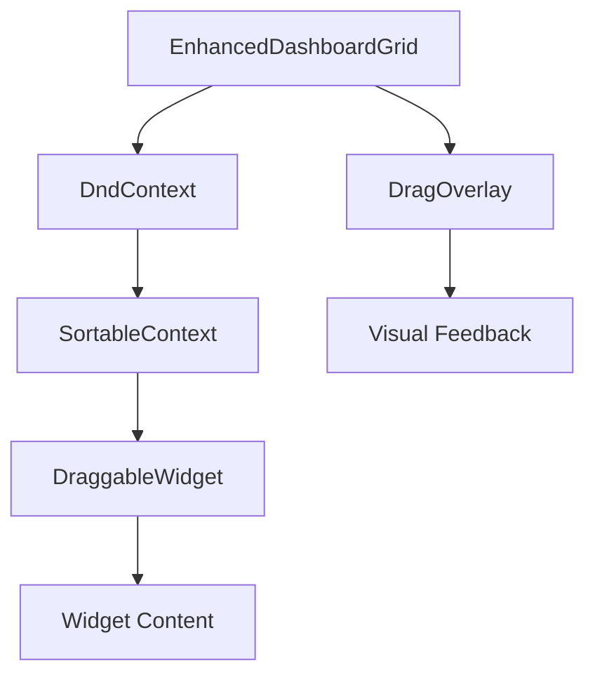
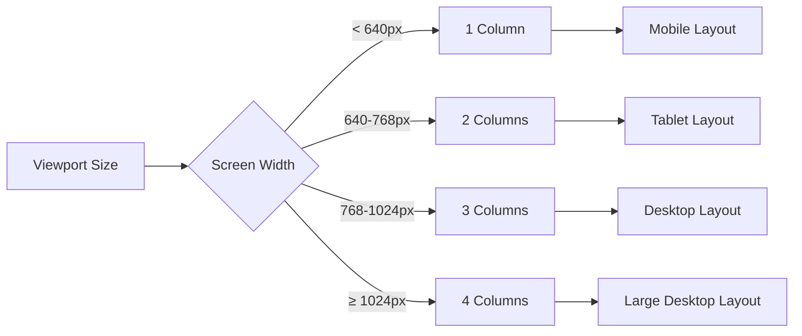
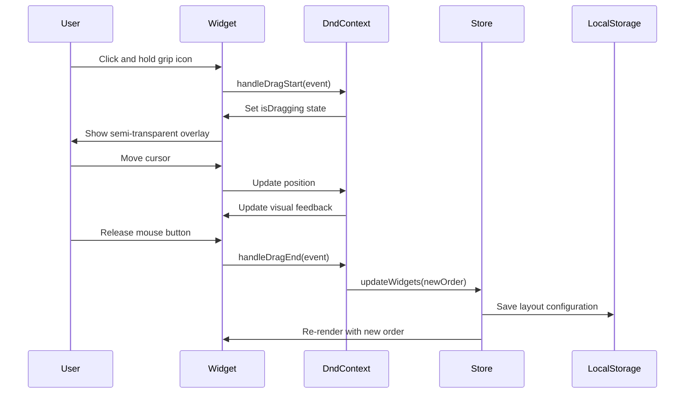
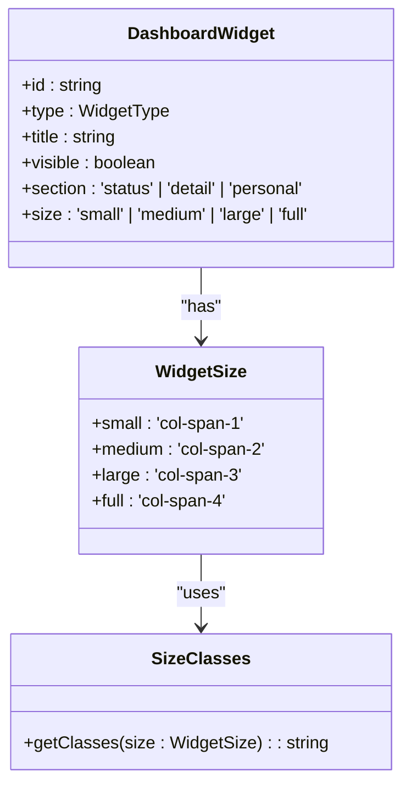
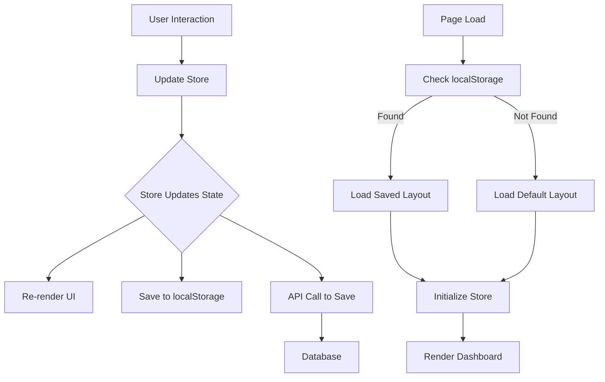

# Dashboard Grid System

<cite>
**Referenced Files in This Document**   
- [enhanced-dashboard-grid.tsx](file://app/(dashboard)/dashboard/components/enhanced-dashboard-grid.tsx)
- [sortable-dashboard.tsx](file://app/(dashboard)/dashboard/components/sortable-dashboard.tsx)
- [dashboard-store.ts](file://app/_lib/stores/dashboard-store.ts)
- [dashboard-types.ts](file://app/_lib/dashboard-types.ts)
- [dashboard-api.ts](file://app/api/dashboard-api.ts)
- [draggable-widget.tsx](file://app/(dashboard)/dashboard/components/draggable-widget.tsx)
- [responsive-grid.tsx](file://components/ui/responsive-grid.tsx)
</cite>

## Table of Contents
1. [Introduction](#introduction)
2. [Core Components](#core-components)
3. [EnhancedDashboardGrid Implementation](#enhanceddashboardgrid-implementation)
4. [Responsive Layout System](#responsive-layout-system)
5. [Drag-and-Drop Functionality](#drag-and-drop-functionality)
6. [Widget Positioning and Sizing](#widget-positioning-and-sizing)
7. [Dashboard Store Integration](#dashboard-store-integration)
8. [Grid Configuration Options](#grid-configuration-options)
9. [Common Issues and Solutions](#common-issues-and-solutions)
10. [Code Examples](#code-examples)

## Introduction
The Sinesys dashboard grid system provides a flexible and interactive interface for users to customize their dashboard layout. The system combines React DnD for drag-and-drop functionality with CSS grid for responsive layout management, allowing users to personalize their dashboard experience by reordering, resizing, and showing/hiding widgets. This documentation details the implementation of the EnhancedDashboardGrid component, its responsive capabilities, and integration with the dashboard store for persistent layout changes.

## Core Components
The dashboard grid system consists of several key components that work together to provide a seamless user experience. The system is built around a modular architecture that separates concerns between layout management, drag-and-drop functionality, and state persistence.

**Section sources**
- [enhanced-dashboard-grid.tsx](file://app/(dashboard)/dashboard/components/enhanced-dashboard-grid.tsx)
- [sortable-dashboard.tsx](file://app/(dashboard)/dashboard/components/sortable-dashboard.tsx)
- [dashboard-store.ts](file://app/_lib/stores/dashboard-store.ts)

## EnhancedDashboardGrid Implementation
The EnhancedDashboardGrid component serves as the foundation for the dashboard's interactive layout system. It implements a vertical sorting strategy using React DnD's sortable functionality, allowing users to reorder widgets through drag-and-drop interactions. The component manages the drag state, handles drag events, and renders widgets in their configured positions.

The grid uses a combination of DndContext and SortableContext to wrap the draggable items, providing the necessary context for drag-and-drop operations. During a drag operation, the component displays a visual overlay that follows the cursor, providing immediate feedback to the user about the current drag state.



**Diagram sources**
- [enhanced-dashboard-grid.tsx](file://app/(dashboard)/dashboard/components/enhanced-dashboard-grid.tsx)
- [draggable-widget.tsx](file://app/(dashboard)/dashboard/components/draggable-widget.tsx)

## Responsive Layout System
The dashboard grid system implements a responsive design that adapts to different screen sizes and device types. The system uses a 4-column grid layout on desktop screens, which collapses to fewer columns on smaller devices to ensure optimal viewing experience.

The responsive behavior is implemented using CSS grid with Tailwind CSS breakpoints. The grid automatically adjusts the number of columns based on the viewport width:
- Mobile (<640px): 1 column
- Tablet (640px-768px): 2 columns
- Desktop (768px-1024px): 3 columns
- Large Desktop (≥1024px): 4 columns

This responsive design ensures that widgets are properly displayed without horizontal overflow, maintaining usability across all device types. The system has been tested to confirm no horizontal overflow on mobile devices (375px width) and proper 2-column layout on tablets (768px width).



**Diagram sources**
- [responsive-grid.tsx](file://components/ui/responsive-grid.tsx)
- [sortable-dashboard.tsx](file://app/(dashboard)/dashboard/components/sortable-dashboard.tsx)

## Drag-and-Drop Functionality
The dashboard grid system implements drag-and-drop functionality using the @dnd-kit library, which provides a robust and accessible solution for drag-and-drop interactions. The implementation includes both pointer (mouse/touch) and keyboard sensors, ensuring accessibility for all users.

The drag-and-drop system works as follows:
1. Users can initiate a drag by clicking and holding the grip icon on any widget
2. The system provides visual feedback through a semi-transparent overlay of the dragged item
3. As the user moves the item, the system shows potential drop positions
4. When the user releases the item, the system updates the widget order and persists the changes

The implementation includes activation constraints to prevent accidental drags, requiring the user to move the item at least 8 pixels before the drag operation begins. This prevents unintended drag operations during normal clicking interactions.



**Diagram sources**
- [enhanced-dashboard-grid.tsx](file://app/(dashboard)/dashboard/components/enhanced-dashboard-grid.tsx)
- [sortable-dashboard.tsx](file://app/(dashboard)/dashboard/components/sortable-dashboard.tsx)
- [dashboard-store.ts](file://app/_lib/stores/dashboard-store.ts)

## Widget Positioning and Sizing
The dashboard grid system supports flexible widget positioning and sizing options, allowing users to customize both the order and dimensions of their widgets. Each widget can be configured with different size options that determine its width in the grid:

- Small: 1 column width
- Medium: 2 column width
- Large: 3 column width
- Full: 4 column width (full width)

Users can change the size of any widget through a dropdown menu accessible via the widget's settings icon. The size change is immediately reflected in the layout, and the new configuration is persisted to ensure consistency across sessions.

The system uses CSS grid's col-span utility classes to implement the sizing options, with specific classes applied based on the widget's size configuration:
- Small: `col-span-1`
- Medium: `col-span-2` 
- Large: `col-span-3`
- Full: `col-span-4`



**Diagram sources**
- [sortable-dashboard.tsx](file://app/(dashboard)/dashboard/components/sortable-dashboard.tsx)
- [dashboard-types.ts](file://app/_lib/dashboard-types.ts)

## Dashboard Store Integration
The dashboard grid system integrates with a centralized store to manage state and persist layout changes across sessions. The store, implemented using Zustand, maintains the state of all widgets, including their order, visibility, and size configuration.

When a user makes changes to the dashboard layout, the system follows this persistence workflow:
1. The UI component detects the layout change (reorder, resize, or visibility toggle)
2. The component calls the appropriate update function in the dashboard store
3. The store updates the local state and triggers a re-render
4. The store saves the updated configuration to localStorage
5. For authenticated users, the configuration is also saved to the database via API calls

The store also handles loading the initial dashboard state, first checking localStorage for user-specific preferences and falling back to default configurations if none are found. This ensures that users see their personalized layout when returning to the dashboard.



**Diagram sources**
- [dashboard-store.ts](file://app/_lib/stores/dashboard-store.ts)
- [dashboard-api.ts](file://app/api/dashboard-api.ts)
- [sortable-dashboard.tsx](file://app/(dashboard)/dashboard/components/sortable-dashboard.tsx)

## Grid Configuration Options
The dashboard grid system offers several configuration options that allow users to personalize their dashboard experience. These options are accessible through a settings menu that appears when users click the configuration icon on the dashboard.

The available configuration options include:
- **Widget Visibility**: Users can show or hide specific widgets based on their preferences
- **Widget Sizing**: Users can change the width of widgets to small (1 column), medium (2 columns), large (3 columns), or full width (4 columns)
- **Widget Ordering**: Users can reorder widgets through drag-and-drop interactions
- **Reset to Default**: Users can restore the original widget configuration if desired

The system persists these configuration options using localStorage with different keys for user and admin dashboards:
- User dashboards: `dashboard-user-widgets-order`
- Admin dashboards: `dashboard-admin-widgets-order`

This separation ensures that user and admin configurations are managed independently, preventing conflicts between different user roles.

**Section sources**
- [sortable-dashboard.tsx](file://app/(dashboard)/dashboard/components/sortable-dashboard.tsx)
- [dashboard-store.ts](file://app/_lib/stores/dashboard-store.ts)

## Common Issues and Solutions
The dashboard grid system addresses several common issues related to layout management and user experience:

### Widget Overflow
To prevent horizontal overflow on smaller screens, the system implements a responsive grid that reduces the number of columns as screen width decreases. This ensures that widgets are properly contained within the viewport without requiring horizontal scrolling.

### Responsive Breakpoints
The system uses well-defined breakpoints that align with common device sizes:
- Mobile: 375px width
- Tablet: 768px width
- Desktop: 1440px width

These breakpoints have been tested to ensure proper layout rendering across all target devices.

### Performance Optimization
For dashboards with a large number of widgets, the system implements several performance optimizations:
- Virtualization of widget rendering
- Debounced state updates to prevent excessive re-renders
- Efficient drag-and-drop handling to maintain smooth interactions

The system has been tested to ensure loading times remain under 5 seconds, even with multiple widgets and data requests.

**Section sources**
- [e2e/dashboard.spec.ts](file://e2e/dashboard.spec.ts)
- [sortable-dashboard.tsx](file://app/(dashboard)/dashboard/components/sortable-dashboard.tsx)

## Code Examples
The following code examples demonstrate the initialization and configuration of the dashboard grid system:

### Grid Initialization
The EnhancedDashboardGrid component is initialized with the necessary DnD context and sensors:

```jsx
<DndContext
  sensors={sensors}
  onDragStart={handleDragStart}
  onDragEnd={handleDragEnd}
>
  <div className="space-y-4">
    <SortableContext items={widgets.map(w => w.id)} strategy={verticalListSortingStrategy}>
      {widgets.map((widget) => (
        <DraggableWidget key={widget.id} id={widget.id}>
          {renderWidget(widget)}
        </DraggableWidget>
      ))}
    </SortableContext>
  </div>
</DndContext>
```

### Widget Sizing Configuration
Widget sizing is implemented using responsive Tailwind CSS classes:

```jsx
const sizeClasses = {
  small: 'col-span-4 md:col-span-2 lg:col-span-1',
  medium: 'col-span-4 md:col-span-2 lg:col-span-2',
  large: 'col-span-4 md:col-span-4 lg:col-span-3',
  full: 'col-span-4',
};
```

### State Management
The dashboard store manages widget state and persistence:

```typescript
updateWidgets: (widgets) => {
  set({ widgets });
  // Save to layout
  const { layoutPainel } = get();
  if (layoutPainel) {
    get().updateLayout({ ...layoutPainel.configuracao_layout, widgets });
  }
}
```

**Section sources**
- [enhanced-dashboard-grid.tsx](file://app/(dashboard)/dashboard/components/enhanced-dashboard-grid.tsx)
- [sortable-dashboard.tsx](file://app/(dashboard)/dashboard/components/sortable-dashboard.tsx)
- [dashboard-store.ts](file://app/_lib/stores/dashboard-store.ts)