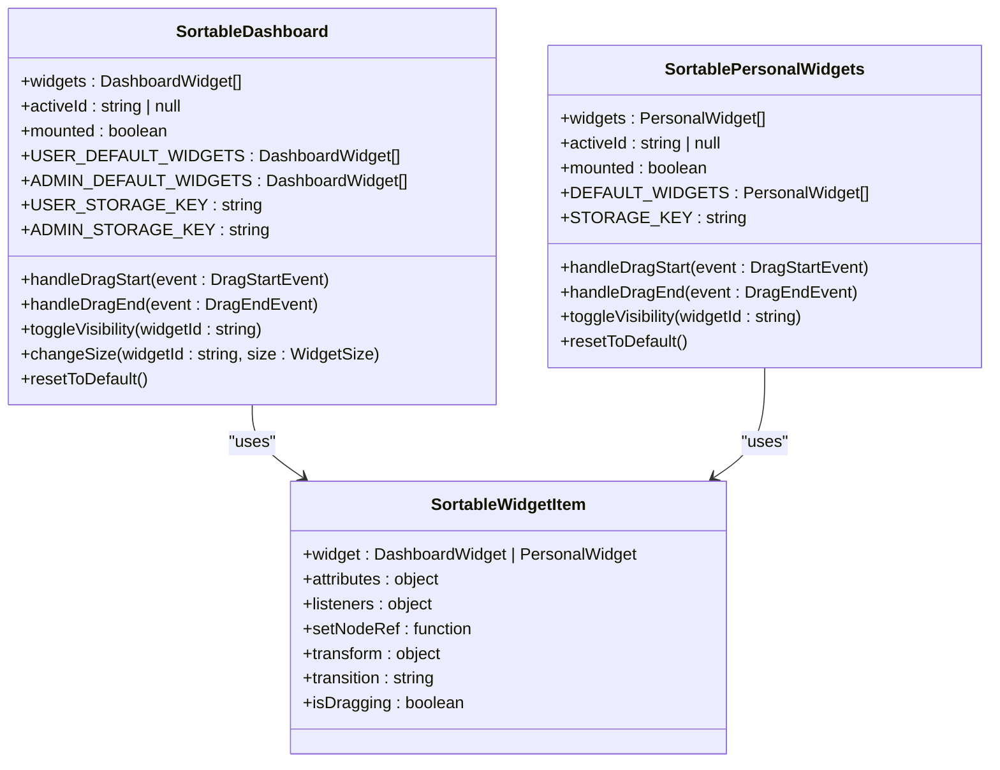
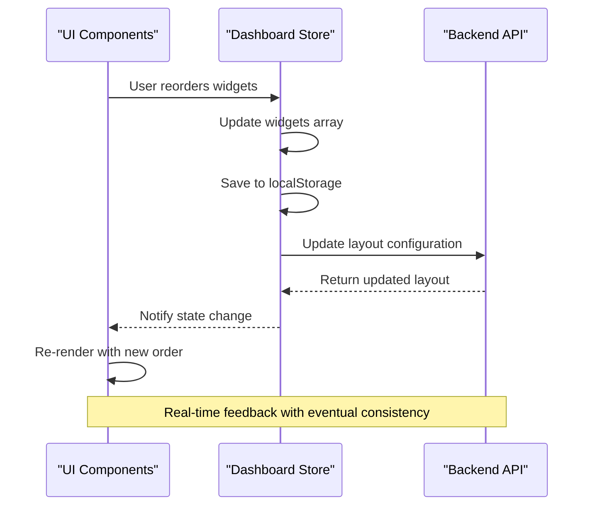
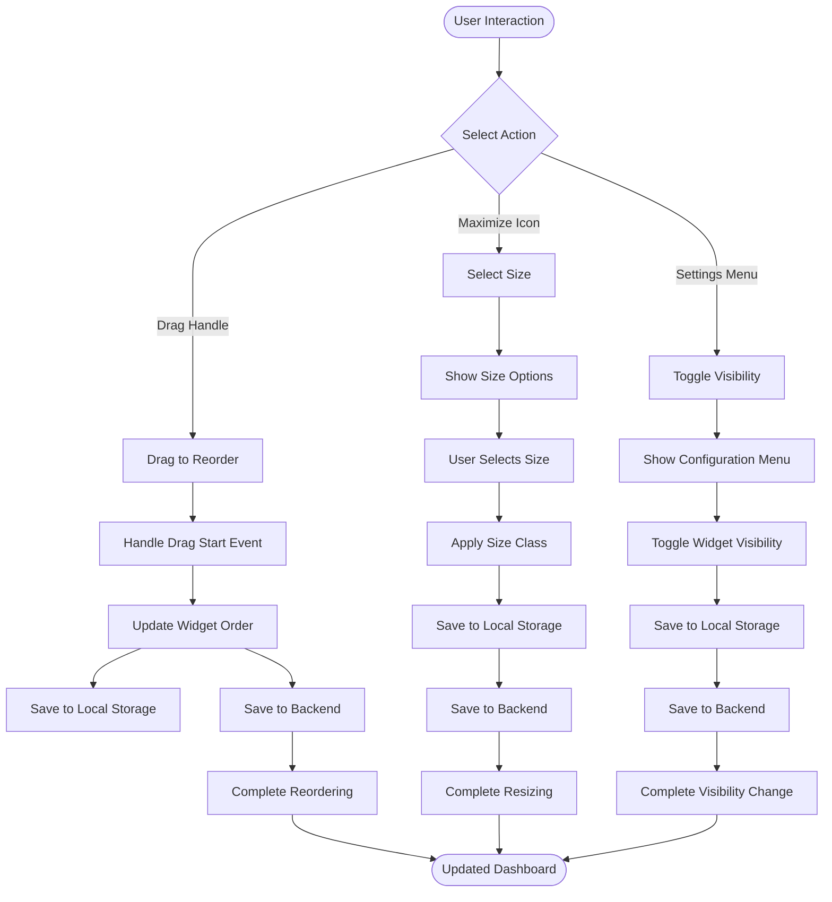
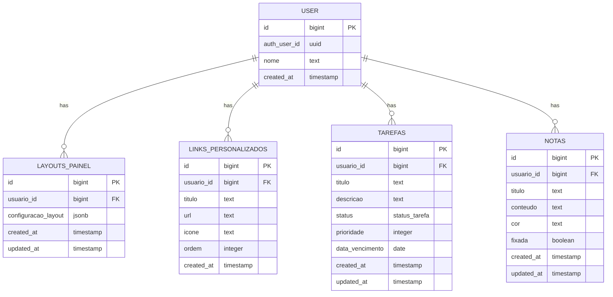

# Dashboard Personalization

<cite>
**Referenced Files in This Document**   
- [sortable-dashboard.tsx](file://app/(dashboard)/dashboard/components/sortable-dashboard.tsx)
- [sortable-personal-widgets.tsx](file://app/(dashboard)/dashboard/components/sortable-personal-widgets.tsx)
- [dashboard-store.ts](file://app/_lib/stores/dashboard-store.ts)
- [dashboard-api.ts](file://app/api/dashboard-api.ts)
- [dashboard-types.ts](file://app/_lib/dashboard-types.ts)
- [23_dashboard.sql](file://supabase/schemas/23_dashboard.sql)
</cite>

## Table of Contents
1. [Introduction](#introduction)
2. [Core Components](#core-components)
3. [State Management](#state-management)
4. [User Interaction Patterns](#user-interaction-patterns)
5. [Data Persistence](#data-persistence)
6. [Default Layouts and Migration](#default-layouts-and-migration)
7. [Synchronization Across Devices](#synchronization-across-devices)
8. [Troubleshooting Guide](#troubleshooting-guide)

## Introduction
The Sinesys dashboard personalization system enables users to customize their dashboard layout through drag-and-drop interactions. Users can reorder, resize, and toggle visibility of widgets according to their preferences. The system implements a hybrid persistence strategy combining local storage for immediate feedback and backend storage for cross-device synchronization. This document details the implementation of the SortableDashboard and SortablePersonalWidgets components, their state management approach, and integration with the backend API.

## Core Components

The dashboard personalization functionality is implemented through two primary components: SortableDashboard and SortablePersonalWidgets. These components leverage the dnd-kit library to provide drag-and-drop capabilities for reordering widgets.

The SortableDashboard component manages the main dashboard layout with different configurations for regular users and administrators. It supports three widget sections: status, detail, and personal, with four available widget sizes (small, medium, large, full width). Users can drag widgets to reorder them, click on size controls to adjust widget dimensions, and use the configuration menu to show/hide specific widgets.

The SortablePersonalWidgets component focuses on personal productivity widgets such as tasks, notes, and custom links. This component provides a simpler interface optimized for frequently accessed personal tools. Both components implement similar drag-and-drop patterns but are tailored to their specific use cases.

**Diagram sources**
- [sortable-dashboard.tsx](file://app/(dashboard)/dashboard/components/sortable-dashboard.tsx)
- [sortable-personal-widgets.tsx](file://app/(dashboard)/dashboard/components/sortable-personal-widgets.tsx)

**Section sources**
- [sortable-dashboard.tsx](file://app/(dashboard)/dashboard/components/sortable-dashboard.tsx)
- [sortable-personal-widgets.tsx](file://app/(dashboard)/dashboard/components/sortable-personal-widgets.tsx)

## State Management

The dashboard personalization system employs a comprehensive state management approach using Zustand for global state management. The dashboard store maintains the application state including widget configurations, user data, and loading/error states.

The state management system follows a unidirectional data flow pattern where user interactions trigger actions that update the store state, which in turn re-renders the UI components. The store initializes with default widget configurations and loads user-specific preferences from both local storage and the backend API.

**Diagram sources**
- [dashboard-store.ts](file://app/_lib/stores/dashboard-store.ts)
- [sortable-dashboard.tsx](file://app/(dashboard)/dashboard/components/sortable-dashboard.tsx)

**Section sources**
- [dashboard-store.ts](file://app/_lib/stores/dashboard-store.ts)

## User Interaction Patterns

The dashboard personalization system implements intuitive user interaction patterns for managing widgets. Users can perform three primary actions: reordering, resizing, and toggling visibility.

Reordering is accomplished through drag-and-drop interactions using the dnd-kit library. When a user clicks and holds on the drag handle (grip icon) of a widget, a drag overlay appears showing the widget title. The user can then drag the widget to a new position, with visual indicators showing the insertion point. Upon releasing, the widget order is updated in both local storage and the backend.

Resizing is handled through a dropdown menu accessible via the maximize icon on each widget. Users can select from four size options: small (1 column), medium (2 columns), large (3 columns), and full width. The size selection immediately updates the widget dimensions using responsive grid classes.

Visibility toggling is managed through a configuration menu accessible from the dashboard settings button. This menu displays all available widgets with checkboxes indicating their current visibility state. Users can show or hide widgets without affecting their position in the layout.

**Diagram sources**
- [sortable-dashboard.tsx](file://app/(dashboard)/dashboard/components/sortable-dashboard.tsx)
- [sortable-personal-widgets.tsx](file://app/(dashboard)/dashboard/components/sortable-personal-widgets.tsx)

**Section sources**
- [sortable-dashboard.tsx](file://app/(dashboard)/dashboard/components/sortable-dashboard.tsx)
- [sortable-personal-widgets.tsx](file://app/(dashboard)/dashboard/components/sortable-personal-widgets.tsx)

## Data Persistence

The dashboard personalization system implements a hybrid persistence strategy combining client-side storage with backend persistence. This approach ensures immediate feedback for users while maintaining data consistency across devices.

Local storage is used as the primary client-side storage mechanism, with separate keys for user and admin dashboards (dashboard-user-widgets-order and dashboard-admin-widgets-order). This provides instant persistence of widget configurations without requiring network requests, enabling a responsive user experience.

For cross-device synchronization, widget configurations are persisted to the backend database in the layouts_painel table. This table stores user-specific layout configurations as JSONB data, including widget positions, sizes, and visibility states. The dashboard store automatically synchronizes changes between local storage and the backend API.

**Diagram sources**
- [23_dashboard.sql](file://supabase/schemas/23_dashboard.sql)
- [dashboard-store.ts](file://app/_lib/stores/dashboard-store.ts)

**Section sources**
- [23_dashboard.sql](file://supabase/schemas/23_dashboard.sql)
- [dashboard-api.ts](file://app/api/dashboard-api.ts)
- [dashboard-store.ts](file://app/_lib/stores/dashboard-store.ts)

## Default Layouts and Migration

The system implements robust default layout management to handle new users and application updates. Each user type (regular user and administrator) has predefined default widget configurations stored as constants in the SortableDashboard component.

When a user first accesses the dashboard or when new widgets are introduced in application updates, the system performs a merge operation between the saved configuration and the current defaults. This ensures that users retain their customizations while automatically gaining access to new features.

The migration process follows these steps:
1. Load saved configuration from local storage
2. Parse the saved widget configuration
3. Merge with current default widgets, preserving user customizations
4. Reorder according to the saved sequence
5. Apply the merged configuration

This approach prevents data loss during application updates and ensures a consistent user experience. The system also provides a "Restore Default" option that resets the layout to the current default configuration and clears the local storage entry.

**Section sources**
- [sortable-dashboard.tsx](file://app/(dashboard)/dashboard/components/sortable-dashboard.tsx)
- [sortable-personal-widgets.tsx](file://app/(dashboard)/dashboard/components/sortable-personal-widgets.tsx)

## Synchronization Across Devices

The dashboard personalization system addresses cross-device synchronization through a combination of backend persistence and client-side conflict resolution. When users access the dashboard from different devices, the system prioritizes the most recent configuration while attempting to preserve user intent.

The synchronization process works as follows:
- On initial load, the component checks local storage for a saved configuration
- If found, it uses this configuration as the initial state
- Simultaneously, it fetches the latest configuration from the backend API
- When the API response arrives, it merges the backend configuration with the current state
- The merged configuration is then saved back to both local storage and the backend

This approach creates an eventually consistent system where configurations will synchronize across devices over time. The merge algorithm prioritizes the backend configuration for structural changes (like new widgets) while preserving local ordering preferences when possible.

**Section sources**
- [dashboard-store.ts](file://app/_lib/stores/dashboard-store.ts)
- [sortable-dashboard.tsx](file://app/(dashboard)/dashboard/components/sortable-dashboard.tsx)

## Troubleshooting Guide

The dashboard personalization system may encounter several common issues that can be addressed through the following troubleshooting steps:

**Issue: Widget configurations not persisting**
- Check browser local storage permissions
- Verify network connectivity for API calls
- Ensure the user is properly authenticated
- Clear local storage entries for dashboard configurations
- Check console for JavaScript errors

**Issue: Inconsistent layouts across devices**
- Force synchronization by refreshing the dashboard
- Check if the backend API is returning the expected layout data
- Verify that the user ID mapping between authentication and database is correct
- Ensure all devices are running compatible application versions

**Issue: Drag-and-drop functionality not working**
- Verify that the dnd-kit library is properly loaded
- Check for CSS conflicts that might interfere with drag handles
- Ensure touch events are properly handled on mobile devices
- Verify that the sensors are correctly configured in the DndContext

**Issue: Default layout not applying after update**
- Clear local storage entries for dashboard configurations
- Verify that the default widget constants include new widgets
- Check that the merge logic properly handles new widget types
- Ensure the application version is properly deployed

**Issue: Performance degradation with many widgets**
- Implement virtualization for large numbers of widgets
- Optimize the re-rendering process using React.memo
- Debounce rapid configuration changes
- Consider pagination or grouping for excessive widgets

**Section sources**
- [sortable-dashboard.tsx](file://app/(dashboard)/dashboard/components/sortable-dashboard.tsx)
- [dashboard-store.ts](file://app/_lib/stores/dashboard-store.ts)
- [dashboard-api.ts](file://app/api/dashboard-api.ts)