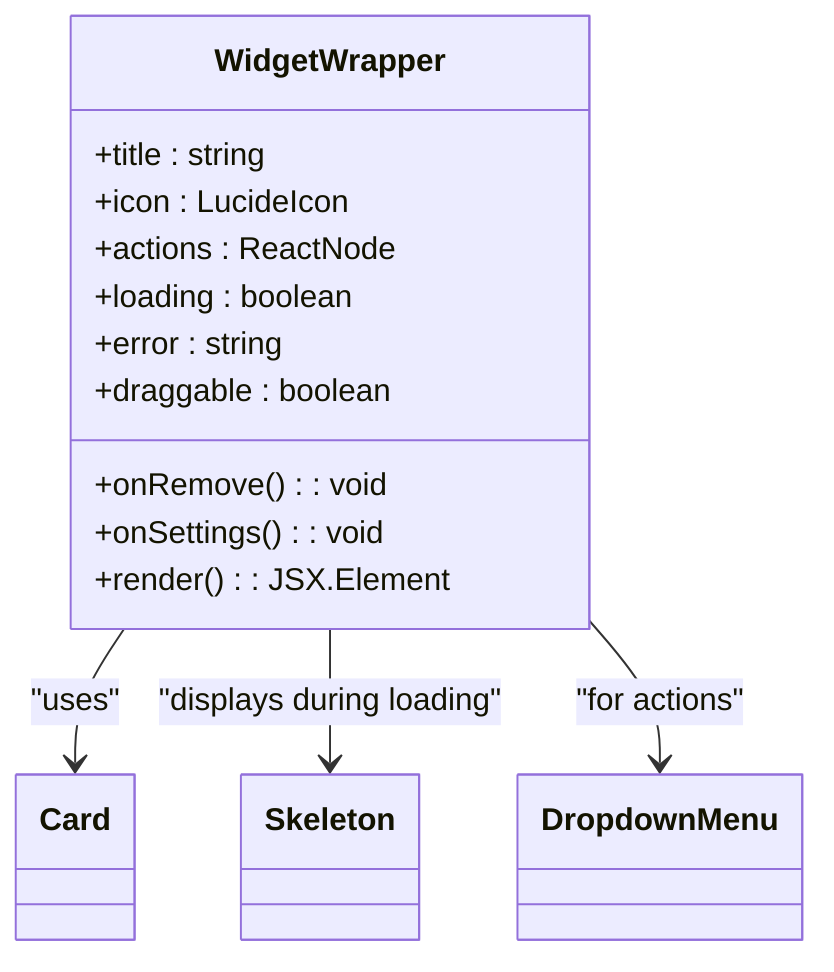
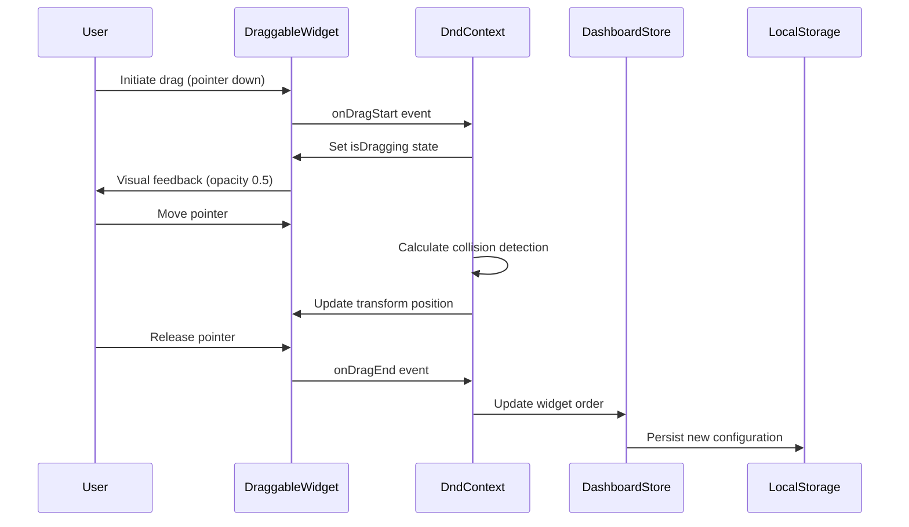
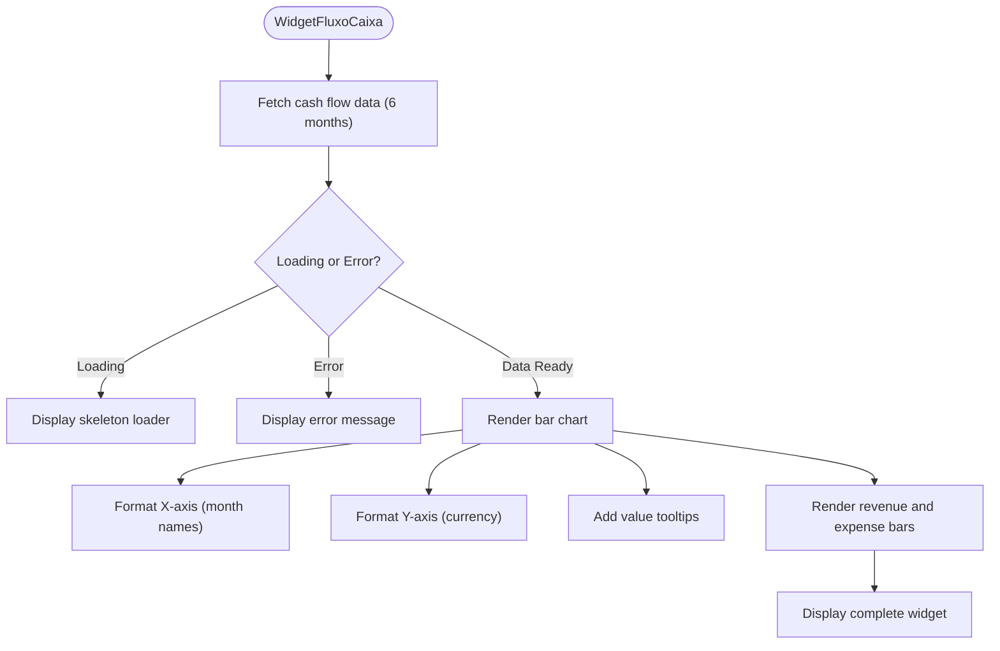
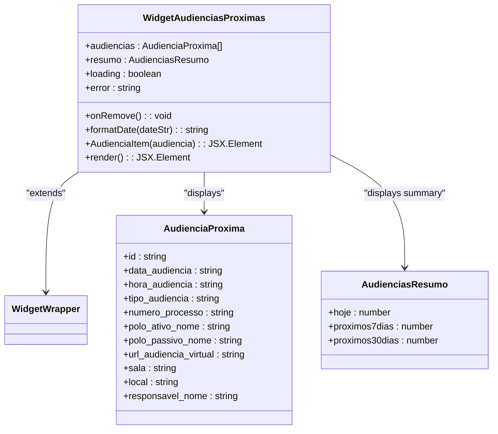
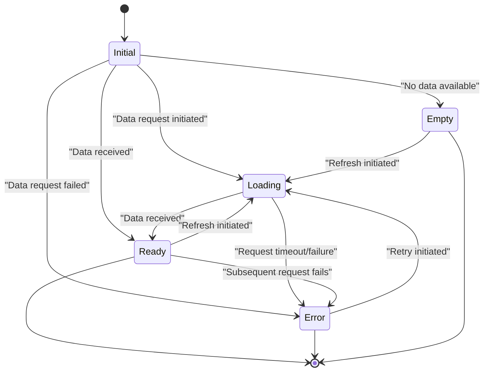

# Widget Components

<cite>
**Referenced Files in This Document**   
- [widget-wrapper.tsx](file://app/(dashboard)/dashboard/components/widgets/widget-wrapper.tsx)
- [draggable-widget.tsx](file://app/(dashboard)/dashboard/components/draggable-widget.tsx)
- [sortable-personal-widgets.tsx](file://app/(dashboard)/dashboard/components/sortable-personal-widgets.tsx)
- [widget-alertas-financeiros.tsx](file://app/(dashboard)/dashboard/components/widgets/widget-alertas-financeiros.tsx)
- [widget-fluxo-caixa.tsx](file://app/(dashboard)/dashboard/components/widgets/widget-fluxo-caixa.tsx)
- [widget-saldo-contas.tsx](file://app/(dashboard)/dashboard/components/widgets/widget-saldo-contas.tsx)
- [widget-contas-pagar-receber.tsx](file://app/(dashboard)/dashboard/components/widgets/widget-contas-pagar-receber.tsx)
- [widget-despesas-categoria.tsx](file://app/(dashboard)/dashboard/components/widgets/widget-despesas-categoria.tsx)
- [widget-orcamento-atual.tsx](file://app/(dashboard)/dashboard/components/widgets/widget-orcamento-atual.tsx)
- [widget-audiencias-proximas.tsx](file://app/(dashboard)/dashboard/components/widgets/widget-audiencias-proximas.tsx)
- [use-dashboard-financeiro.ts](file://app/_lib/hooks/use-dashboard-financeiro.ts)
- [dashboard-api.ts](file://app/_lib/dashboard-api.ts)
</cite>

## Table of Contents
1. [Introduction](#introduction)
2. [Widget Wrapper Component](#widget-wrapper-component)
3. [Draggable Widget Implementation](#draggable-widget-implementation)
4. [Financial Widget Types](#financial-widget-types)
5. [Audiências Widget](#audiências-widget)
6. [Data Loading and Error States](#data-loading-and-error-states)
7. [Performance Optimization](#performance-optimization)

## Introduction

The Sinesys dashboard features a comprehensive widget system that provides users with customizable, interactive components for monitoring key metrics and information. The widget components are designed with a consistent architecture that includes common styling through the WidgetWrapper component, drag-and-drop functionality via DraggableWidget, and specialized implementations for different data types including financial metrics and upcoming hearings. This documentation covers the core widget components, their implementation details, data requirements, and integration with backend services.

## Widget Wrapper Component

The WidgetWrapper component serves as the foundational container for all widgets in the Sinesys dashboard, providing consistent styling, behavior, and state management. It handles three primary states: loading, error, and normal display, ensuring a uniform user experience across all widget types.

The component accepts several props to customize its appearance and behavior:
- **title**: The widget's title displayed in the header
- **icon**: An optional Lucide icon to display alongside the title
- **actions**: Custom action buttons or controls
- **loading**: Boolean flag to display skeleton loading states
- **error**: Error message string to display error state
- **onRemove**: Callback function for removing the widget
- **onSettings**: Callback function for opening widget settings
- **draggable**: Boolean flag to enable drag handle display

When in loading state, the WidgetWrapper displays skeleton placeholders for both the header and content areas, providing visual feedback while data is being fetched. In error state, it displays a distinctive border with a destructively colored error message. The component also includes a dropdown menu with configurable actions, including settings and removal options, which appears when the corresponding callbacks are provided.

**Diagram sources**
- [widget-wrapper.tsx](file://app/(dashboard)/dashboard/components/widgets/widget-wrapper.tsx#L15-L133)

**Section sources**
- [widget-wrapper.tsx](file://app/(dashboard)/dashboard/components/widgets/widget-wrapper.tsx#L1-L157)

## Draggable Widget Implementation

The DraggableWidget component implements the drag-and-drop functionality that allows users to reorder widgets on the dashboard. Built on the dnd-kit library, it provides a seamless drag experience with visual feedback during interaction.

The component uses the useDraggable hook from dnd-kit to manage drag state and applies appropriate styling based on the current interaction state. When a widget is being dragged, it applies a semi-transparent appearance (50% opacity) and changes the cursor to indicate grabbing. The drag handle is positioned in the top-right corner of the widget and only becomes visible on hover, maintaining a clean interface when not in use.

The drag functionality is integrated with the SortableContext from dnd-kit, which manages the ordering of multiple draggable items. The system uses the rectSortingStrategy to determine the new position of widgets during drag operations, ensuring intuitive reordering behavior. Drag state is synchronized with the dashboard store, which persists the widget configuration to localStorage, maintaining the user's preferred layout across sessions.

**Diagram sources**
- [draggable-widget.tsx](file://app/(dashboard)/dashboard/components/draggable-widget.tsx#L1-L40)
- [sortable-personal-widgets.tsx](file://app/(dashboard)/dashboard/components/sortable-personal-widgets.tsx#L320-L342)

**Section sources**
- [draggable-widget.tsx](file://app/(dashboard)/dashboard/components/draggable-widget.tsx#L1-L41)
- [sortable-personal-widgets.tsx](file://app/(dashboard)/dashboard/components/sortable-personal-widgets.tsx#L1-L352)

## Financial Widget Types

The Sinesys dashboard includes several specialized financial widgets that display key financial metrics and insights. These widgets follow a consistent pattern of data fetching, loading states, and visualization, while providing specific functionality for their respective domains.

### Financial Alerts Widget

The WidgetAlertasFinanceiros displays important financial alerts such as overdue payments, budget overruns, or unusual transaction patterns. It fetches data through the useAlertasFinanceiros hook, which calls the dashboard API to retrieve active alerts.

The widget displays up to five alerts in a list format, with color-coded indicators based on alert severity (danger, warning, or info). Each alert includes an icon indicating its type and a brief message describing the issue. Users can navigate to the full financial alerts page for more details.

**Section sources**
- [widget-alertas-financeiros.tsx](file://app/(dashboard)/dashboard/components/widgets/widget-alertas-financeiros.tsx#L1-L70)

### Cash Flow Widget

The WidgetFluxoCaixa presents a bar chart visualization of cash flow over a six-month period, showing both revenues and expenses. It uses the Recharts library to render a responsive bar chart with properly formatted currency values.

The widget fetches cash flow data through the useFluxoCaixa hook, which accepts a parameter for the number of months to display. The chart includes X and Y axes with appropriate formatting, tooltips showing exact values on hover, and distinct colors for revenue (green) and expense (red) bars.

**Diagram sources**
- [widget-fluxo-caixa.tsx](file://app/(dashboard)/dashboard/components/widgets/widget-fluxo-caixa.tsx#L1-L68)

**Section sources**
- [widget-fluxo-caixa.tsx](file://app/(dashboard)/dashboard/components/widgets/widget-fluxo-caixa.tsx#L1-L68)

### Account Balance Widget

The WidgetSaldoContas displays the total balance across all bank accounts. It provides a simple, high-visibility display of the current financial position with a large, prominent balance figure.

The widget includes a direct link to the bank accounts management page, allowing users to quickly access detailed account information. It uses the useSaldoContas hook to fetch the current balance from the dashboard API.

**Section sources**
- [widget-saldo-contas.tsx](file://app/(dashboard)/dashboard/components/widgets/widget-saldo-contas.tsx#L1-L62)

### Accounts Payable/Receivable Widget

The WidgetContasPagarReceber displays the current status of accounts payable and receivable in a two-column layout. It shows the total amount due for payments (in red) and the total amount expected from receivables (in green), along with the number of pending transactions for each category.

The widget provides quick access buttons to the respective payment and receivables management pages, enabling users to take immediate action on outstanding items.

**Section sources**
- [widget-contas-pagar-receber.tsx](file://app/(dashboard)/dashboard/components/widgets/widget-contas-pagar-receber.tsx#L1-L81)

### Expense by Category Widget

The WidgetDespesasCategoria visualizes expenses by category using a pie chart. It combines a graphical representation with a textual legend, making it easy to understand the distribution of expenses.

The widget uses a predefined color palette for consistent category coloring across different visualizations. For categories without data, it displays an appropriate empty state message.

**Section sources**
- [widget-despesas-categoria.tsx](file://app/(dashboard)/dashboard/components/widgets/widget-despesas-categoria.tsx#L1-L90)

### Current Budget Widget

The WidgetOrcamentoAtual displays information about the currently active budget, including the percentage of budget realization and progress toward budget goals. It uses a progress bar component to visualize budget utilization.

The widget applies different badge variants based on budget status: destructive for over-budget, secondary for near-limit, and default for within limits. This provides immediate visual feedback about budget health.

**Section sources**
- [widget-orcamento-atual.tsx](file://app/(dashboard)/dashboard/components/widgets/widget-orcamento-atual.tsx#L1-L92)

## Audiências Widget

The WidgetAudienciasProximas displays upcoming court hearings with comprehensive details including date, time, type, location, and responsible parties. This widget is specifically designed for legal professionals to monitor their hearing schedule.

The component accepts an array of audiencias (hearings) and an optional resumo (summary) object containing counts of hearings for different time periods. It formats dates to show "Today" or "Tomorrow" when applicable, improving readability for immediate upcoming events.

The widget includes several key features:
- Color-coded indicators for virtual (blue) and in-person (green) hearings
- Quick access links to virtual hearing rooms
- Responsive design that truncates long text
- Summary statistics showing hearing counts for today, 7 days, and 30 days
- Pagination for more than four upcoming hearings

**Diagram sources**
- [widget-audiencias-proximas.tsx](file://app/(dashboard)/dashboard/components/widgets/widget-audiencias-proximas.tsx#L1-L211)

**Section sources**
- [widget-audiencias-proximas.tsx](file://app/(dashboard)/dashboard/components/widgets/widget-audiencias-proximas.tsx#L1-L211)

## Data Loading and Error States

All widget components in Sinesys implement consistent handling of data loading and error states to provide a seamless user experience. The system follows a standardized approach across all widget types, ensuring predictability and reliability.

### Loading States

During data fetching, widgets display skeleton loaders that mimic the final layout. These loaders use the UI library's Skeleton component to create animated placeholders that indicate content is being loaded. The loading state is controlled by the loading prop in the WidgetWrapper component, which automatically switches to the skeleton display when true.

The skeleton implementation varies by widget type:
- Financial summary widgets show skeleton text lines and value placeholders
- Chart widgets display a full-area skeleton
- List widgets show multiple skeleton items

### Error Handling

When data fetching fails, widgets display a standardized error state with a distinctive border and error message. The error state is triggered by the error prop in the WidgetWrapper component, which renders a destructively colored border and displays the error message in the content area.

Error handling includes:
- Clear error messages that describe the issue
- Consistent visual styling across all widgets
- Preservation of the widget header for context
- No attempt to display partial or corrupted data

### Empty States

For cases where data fetching succeeds but returns no results, widgets implement specific empty states. These are distinct from error states and indicate the absence of data rather than a failure. The WidgetEmpty component provides a standardized empty state with an icon, title, and optional description.

**Diagram sources**
- [widget-wrapper.tsx](file://app/(dashboard)/dashboard/components/widgets/widget-wrapper.tsx#L46-L84)
- [widget-empty.tsx](file://app/(dashboard)/dashboard/components/widgets/widget-wrapper.tsx#L136-L156)

**Section sources**
- [widget-wrapper.tsx](file://app/(dashboard)/dashboard/components/widgets/widget-wrapper.tsx#L1-L157)

## Performance Optimization

The widget system in Sinesys incorporates several performance optimizations to ensure responsive behavior, especially when dealing with real-time data updates and multiple concurrent widgets.

### Data Fetching Strategy

The system uses React Query (via the useQuery hook in custom hooks) to manage data fetching, providing automatic caching, background refetching, and stale-while-revalidate patterns. This reduces unnecessary network requests and improves perceived performance.

Each financial widget uses a dedicated custom hook (e.g., useSaldoContas, useFluxoCaixa) that encapsulates the data fetching logic and caching configuration. These hooks are optimized with appropriate cache time and stale time settings based on the volatility of the underlying data.

### Real-time Updates

For data that requires real-time updates, the system implements WebSocket connections or polling mechanisms with intelligent backoff strategies. The dashboard periodically refreshes widget data in the background, with refresh intervals tailored to the specific data type:

- Account balances: 30 seconds
- Cash flow data: 5 minutes
- Budget information: 10 minutes
- Hearing schedules: 15 minutes

### Component Optimization

The components use React's memoization features to prevent unnecessary re-renders:
- Functional components are wrapped with React.memo where appropriate
- Expensive calculations are memoized using useMemo
- Callback functions are memoized using useCallback

The drag-and-drop system is optimized to minimize re-renders during drag operations by using the DndContext and SortableContext providers at the appropriate level in the component tree.

### Bundle Optimization

The widget system leverages code splitting to load only the necessary components:
- Charting libraries are imported dynamically
- Heavy UI components are lazy-loaded
- Internationalization data is loaded on demand

These optimizations ensure that the dashboard remains responsive even with multiple widgets active, providing a smooth user experience across different device capabilities.

**Section sources**
- [use-dashboard-financeiro.ts](file://app/_lib/hooks/use-dashboard-financeiro.ts)
- [dashboard-api.ts](file://app/_lib/dashboard-api.ts)
- [widget-wrapper.tsx](file://app/(dashboard)/dashboard/components/widgets/widget-wrapper.tsx)