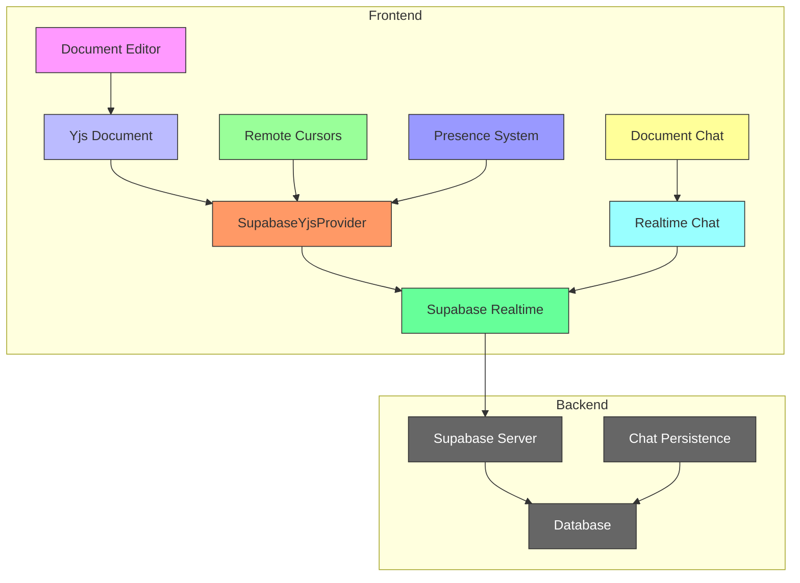
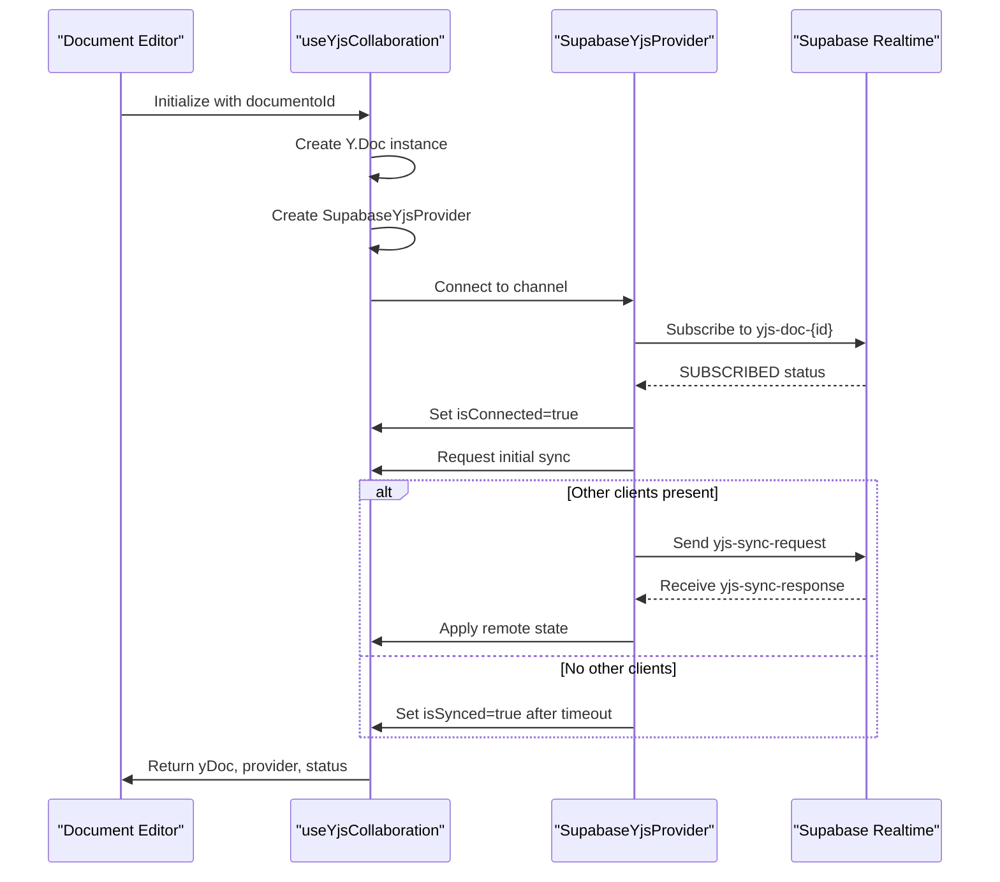
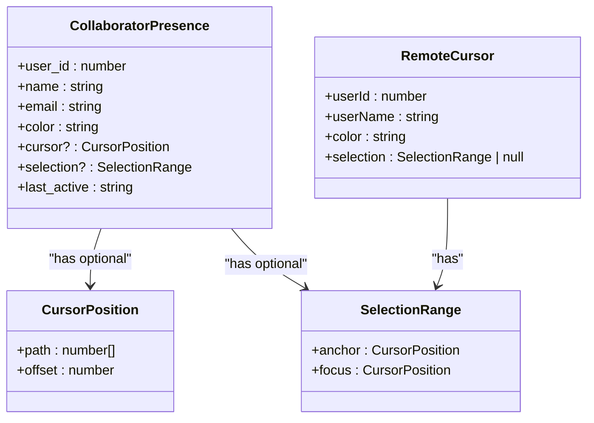
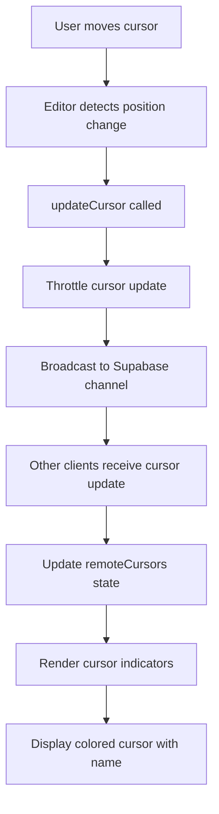
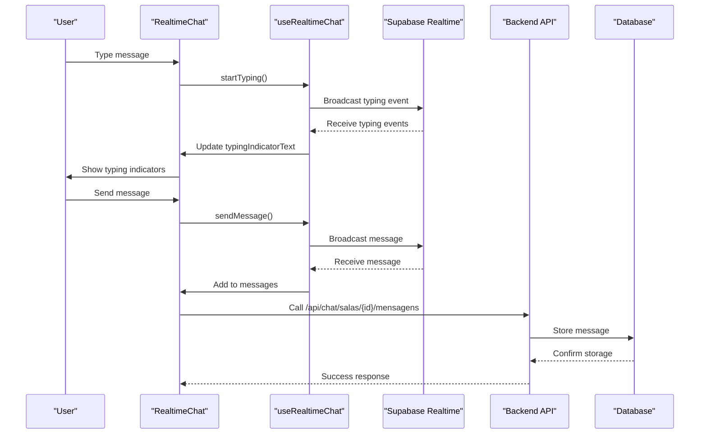

# Collaboration Features

<cite>
**Referenced Files in This Document**   
- [use-realtime-collaboration.ts](file://hooks/use-realtime-collaboration.ts)
- [use-yjs-collaboration.ts](file://hooks/use-yjs-collaboration.ts)
- [remote-cursors-overlay.tsx](file://components/documentos/remote-cursors-overlay.tsx)
- [realtime-cursors.tsx](file://components/realtime-cursors.tsx)
- [document-chat.tsx](file://components/documentos/document-chat.tsx)
- [realtime-chat.tsx](file://components/realtime-chat.tsx)
- [use-realtime-cursors.ts](file://hooks/use-realtime-cursors.ts)
- [use-realtime-chat.tsx](file://hooks/use-realtime-chat.tsx)
- [supabase-provider.ts](file://lib/yjs/supabase-provider.ts)
- [supabase-yjs-provider.ts](file://lib/yjs/supabase-yjs-provider.ts)
- [yjs-kit.tsx](file://components/plate/yjs-kit.tsx)
- [cursor-overlay-kit.tsx](file://components/plate/cursor-overlay-kit.tsx)
</cite>

## Table of Contents
1. [Introduction](#introduction)
2. [Architecture Overview](#architecture-overview)
3. [Core Components](#core-components)
4. [Real-Time Collaboration System](#real-time-collaboration-system)
5. [Presence and Cursor Synchronization](#presence-and-cursor-synchronization)
6. [Integrated Chat System](#integrated-chat-system)
7. [Configuration and Settings](#configuration-and-settings)
8. [Common Issues and Troubleshooting](#common-issues-and-troubleshooting)
9. [Performance and Scalability](#performance-and-scalability)
10. [Conclusion](#conclusion)

## Introduction

Sinesys provides a comprehensive real-time collaboration system that enables multiple users to work together on documents simultaneously. The collaboration features include presence indicators, remote cursors, and an integrated chat system, all built on a robust architecture using Yjs for operational transform and Supabase Realtime for WebSocket connections. This documentation details the implementation of these features, explaining how real-time updates are synchronized, how frontend components interact with the backend presence system, and how the various collaboration elements work together to provide a seamless user experience.

The system is designed to be accessible to beginners while providing sufficient technical depth for experienced developers. It addresses key aspects of real-time collaboration including network latency, disconnected users, and privacy considerations. The implementation leverages modern web technologies and best practices to ensure efficient synchronization and a responsive user interface.

## Architecture Overview

The collaboration system in Sinesys follows a client-server architecture with real-time synchronization capabilities. At its core, the system uses Yjs as the CRDT (Conflict-Free Replicated Data Type) framework for managing document state across multiple clients, while Supabase Realtime provides the WebSocket infrastructure for bidirectional communication.

**Diagram sources**
- [use-yjs-collaboration.ts](file://hooks/use-yjs-collaboration.ts)
- [supabase-yjs-provider.ts](file://lib/yjs/supabase-yjs-provider.ts)
- [document-chat.tsx](file://components/documentos/document-chat.tsx)

The architecture consists of several key components that work together to provide real-time collaboration:

1. **Yjs Document**: The central data structure that maintains the document state using CRDT principles, ensuring consistency across all clients regardless of network conditions or update order.

2. **SupabaseYjsProvider**: A custom provider implementation that bridges Yjs with Supabase Realtime, handling the transmission of document updates and awareness information over WebSockets.

3. **Realtime Presence System**: Tracks user presence and cursor positions, allowing collaborators to see who is currently working on a document and where they are focused.

4. **Document Chat**: An integrated chat system that enables communication between collaborators directly within the document context.

5. **Supabase Realtime**: The underlying WebSocket infrastructure that provides reliable, low-latency communication between clients and the server.

This architecture enables efficient synchronization of document changes while minimizing network overhead through incremental updates and operational transform algorithms.

## Core Components

The collaboration system in Sinesys is built on several core components that handle different aspects of real-time collaboration. These components are designed to work together seamlessly, providing a cohesive user experience while maintaining separation of concerns in the implementation.

The primary components include:

- **Yjs-based Document Synchronization**: Handles the CRDT-based synchronization of document content using operational transform algorithms.
- **Presence and Cursor Tracking**: Manages user presence information and remote cursor positions.
- **Real-time Chat System**: Provides integrated messaging capabilities for document collaborators.
- **Supabase Integration**: Connects the frontend components with the Supabase Realtime backend for WebSocket communication.

These components are implemented as reusable hooks and components that can be easily integrated into different parts of the application. The design follows React best practices with proper state management, effect handling, and cleanup procedures to ensure reliability and performance.

**Section sources**
- [use-yjs-collaboration.ts](file://hooks/use-yjs-collaboration.ts)
- [use-realtime-collaboration.ts](file://hooks/use-realtime-collaboration.ts)
- [document-chat.tsx](file://components/documentos/document-chat.tsx)

## Real-Time Collaboration System

The real-time collaboration system in Sinesys is built on Yjs, a powerful CRDT framework that enables conflict-free replicated data types for collaborative applications. This system ensures that all users see a consistent document state regardless of network conditions or the order of operations.

### Yjs Integration

The integration with Yjs is implemented through the `useYjsCollaboration` hook, which initializes a Yjs document and connects it to the Supabase Realtime backend via a custom provider. The hook handles the entire lifecycle of the collaboration session, including initialization, connection management, and cleanup.

**Diagram sources**
- [use-yjs-collaboration.ts](file://hooks/use-yjs-collaboration.ts)
- [supabase-yjs-provider.ts](file://lib/yjs/supabase-yjs-provider.ts)

The Yjs document is synchronized across clients using a combination of incremental updates and full state synchronization. When a client connects, it requests the current document state from existing clients. If no other clients are present, it proceeds with an empty document. Subsequent changes are transmitted as incremental updates, which are applied to the local document using Yjs's operational transform algorithms.

### Operational Transform Efficiency

The system implements several optimizations to ensure efficient synchronization:

1. **Incremental Updates**: Only changed portions of the document are transmitted, minimizing network bandwidth usage.

2. **Binary Encoding**: Document updates are encoded as Uint8Array binary data, which is more compact than JSON representations.

3. **Throttling and Batching**: Rapid successive changes are batched together to reduce the number of network messages.

4. **Local-First Editing**: Users can continue editing even when disconnected, with changes synchronized when connectivity is restored.

5. **IndexedDB Persistence**: Document state is persisted locally using IndexedDB, allowing for faster startup and offline access.

The operational transform efficiency is further enhanced by Yjs's built-in algorithms, which handle conflict resolution automatically. This ensures that concurrent edits by multiple users are merged correctly without data loss or corruption.

## Presence and Cursor Synchronization

The presence and cursor synchronization system in Sinesys enables users to see who else is working on a document and where they are focused. This feature enhances collaboration by providing real-time awareness of other users' activities.

### Presence Tracking

Presence tracking is implemented using Supabase's presence functionality, which allows clients to broadcast their status to other members of a channel. The `useRealtimeCollaboration` hook manages the presence system, tracking user information such as name, email, and color.

**Diagram sources**
- [use-realtime-collaboration.ts](file://hooks/use-realtime-collaboration.ts)

The presence system works as follows:

1. When a user opens a document, they join a Supabase Realtime channel specific to that document.
2. The user's presence information is tracked on the channel, including their user ID, name, email, and a randomly assigned color.
3. When other users join or leave the channel, all connected clients receive notifications and update their display accordingly.
4. The system maintains a list of current collaborators, which is used to render presence indicators.

### Remote Cursor Implementation

Remote cursor synchronization allows users to see where their collaborators are currently working within the document. The implementation consists of several components that work together:

1. **Cursor Position Tracking**: As users move their cursor within the document, their position is tracked and broadcast to other clients.

2. **Throttled Updates**: Cursor position updates are throttled to prevent excessive network traffic while maintaining responsiveness.

3. **Visual Indicators**: Remote cursors are displayed as colored indicators with the collaborator's name, positioned at their current location in the document.

The `remote-cursors-overlay.tsx` component renders the visual indicators for remote cursors. It receives cursor data from the `useRealtimeCollaboration` hook and displays each cursor as a floating element positioned over the document content.

**Diagram sources**
- [use-realtime-collaboration.ts](file://hooks/use-realtime-collaboration.ts)
- [remote-cursors-overlay.tsx](file://components/documentos/remote-cursors-overlay.tsx)

The cursor synchronization system is designed to balance responsiveness with network efficiency. Updates are throttled to approximately 20ms intervals, which provides smooth cursor movement while minimizing the number of network messages. The visual indicators include a subtle animation to make active cursors more noticeable.

## Integrated Chat System

The integrated chat system in Sinesys provides a communication channel for document collaborators, allowing them to discuss content, ask questions, and coordinate their work without leaving the document context.

### Chat Architecture

The chat system is built on Supabase Realtime and follows a client-server architecture with persistent storage. Each document has its own dedicated chat room, ensuring that conversations are contextually relevant to the document being edited.

**Diagram sources**
- [document-chat.tsx](file://components/documentos/document-chat.tsx)
- [realtime-chat.tsx](file://components/realtime-chat.tsx)
- [use-realtime-chat.tsx](file://hooks/use-realtime-chat.tsx)

The chat architecture consists of several key components:

1. **RealtimeChat Component**: The main chat interface that renders messages, input controls, and typing indicators.

2. **useRealtimeChat Hook**: Manages the WebSocket connection, message broadcasting, and state synchronization.

3. **Backend API Endpoints**: Handle message persistence and retrieval from the database.

4. **Database Storage**: Persists chat messages for durability and history.

### Message Delivery and Persistence

The chat system implements a hybrid approach to message delivery and persistence:

1. **Real-time Broadcasting**: Messages are first broadcast to all connected clients via Supabase Realtime, ensuring immediate visibility.

2. **Database Persistence**: Simultaneously, messages are sent to a backend API endpoint for storage in the database.

3. **Initial Message Loading**: When a user joins a chat room, recent messages are fetched from the database to provide context.

4. **Message Synchronization**: The system merges real-time messages with persisted messages, removing duplicates and sorting chronologically.

This approach ensures that messages are visible immediately to all participants while also being durably stored for future access. The system handles network interruptions gracefully, with messages sent during disconnection being queued and delivered when connectivity is restored.

### File and Audio Support

The chat system supports file attachments and audio messages, enhancing the communication capabilities:

1. **File Uploads**: Users can attach files to their messages, with support for various file types.

2. **Audio Recording**: Integrated audio recording allows users to send voice messages directly from the chat interface.

3. **File Previews**: Attached files are displayed with appropriate previews based on their type.

4. **Progress Indicators**: File uploads show progress indicators to provide feedback during transmission.

The file attachment system uses a temporary state to manage files before they are sent, allowing users to review and remove attachments before sending. Audio messages are recorded using the Web Audio API and processed into downloadable formats.

## Configuration and Settings

The collaboration system in Sinesys includes several configuration options that allow users to customize their experience and control their privacy settings.

### Notification Settings

Users can configure how they receive notifications about collaboration activities:

1. **Real-time Alerts**: Options to enable or disable desktop notifications for new messages and user presence changes.

2. **Sound Effects**: Toggle for sound effects when receiving messages or when users join/leave.

3. **Message Previews**: Control whether message content is shown in notifications or only sender information.

4. **Frequency Settings**: Options to consolidate notifications or receive them immediately.

These settings are typically stored in the user's profile and synchronized across devices, ensuring a consistent experience regardless of which device they use to access Sinesys.

### Presence Visibility

Privacy is an important consideration in real-time collaboration. The system provides options for controlling presence visibility:

1. **Online Status**: Users can set their status as online, away, or do not disturb.

2. **Cursor Visibility**: Option to hide cursor position from other collaborators while still receiving their updates.

3. **Activity Indicators**: Control whether typing indicators are shown to others.

4. **Session Management**: View and manage active sessions across different devices.

These settings allow users to maintain their preferred level of visibility while collaborating, balancing the benefits of real-time awareness with personal privacy needs.

### Chat Moderation

For team environments, the system includes chat moderation features:

1. **Message Editing**: Ability to edit sent messages within a configurable time window.

2. **Message Deletion**: Option to delete messages, with appropriate audit logging.

3. **Mention Notifications**: Control who can mention you in chat messages.

4. **Content Filtering**: Optional profanity filtering for chat messages.

5. **Moderation Logs**: Record of moderation actions for accountability.

These features help maintain a productive and respectful collaboration environment, particularly in larger teams or organizational settings.

## Common Issues and Troubleshooting

While the collaboration system is designed for reliability, certain issues may arise due to network conditions, client configurations, or edge cases in the implementation.

### Network Latency and Cursor Synchronization

Network latency can affect the responsiveness of cursor synchronization and document updates. The system implements several strategies to mitigate these issues:

1. **Optimistic Updates**: Local changes are rendered immediately, with remote updates applied as they arrive.

2. **Interpolation**: Cursor movements are interpolated between received positions to create smooth motion.

3. **Adaptive Throttling**: Update frequency is adjusted based on network conditions.

4. **Connection Health Monitoring**: The system monitors connection quality and adjusts behavior accordingly.

When experiencing cursor synchronization issues, users can try the following solutions:

- Check network connectivity and switch to a more stable connection if possible.
- Refresh the browser tab to re-establish the WebSocket connection.
- Verify that browser extensions are not interfering with WebSocket connections.
- Clear browser cache and reload the application.

### Handling Disconnected Users

The system gracefully handles users who become disconnected due to network issues or closing their browser:

1. **Presence Expiration**: User presence automatically expires after a period of inactivity.

2. **State Preservation**: Document changes made while disconnected are synchronized when reconnected.

3. **Reconnection Logic**: Automatic reconnection attempts are made when connectivity is restored.

4. **Conflict Resolution**: Changes made by disconnected users are merged using Yjs's operational transform algorithms.

Developers can monitor disconnection events through the `onDisconnect` callback in the collaboration hooks, allowing for custom handling of disconnection scenarios.

### Privacy Considerations

The presence system handles sensitive information about user activity, requiring careful privacy considerations:

1. **Data Minimization**: Only necessary information is shared (name, color, cursor position).

2. **Access Control**: Presence information is only shared with users who have access to the document.

3. **Expiration**: Presence data is automatically removed when users leave or become inactive.

4. **User Control**: Users can control their visibility through privacy settings.

5. **Audit Logging**: Access to presence information is logged for security monitoring.

These privacy measures ensure that collaboration features enhance productivity without compromising user privacy or security.

## Performance and Scalability

The collaboration system is designed to perform efficiently and scale to support large numbers of concurrent users.

### Operational Transform Efficiency

The Yjs-based operational transform system provides several performance advantages:

1. **Efficient Data Structures**: Yjs uses optimized data structures that minimize memory usage and computational overhead.

2. **Incremental Synchronization**: Only changed portions of the document are transmitted, reducing bandwidth requirements.

3. **Binary Encoding**: Document updates are encoded in binary format, which is more compact than text-based formats.

4. **Automatic Conflict Resolution**: The CRDT algorithms handle conflicts without requiring server coordination.

5. **Local-First Architecture**: Users can continue working offline, with changes synchronized when connectivity is restored.

These features ensure that the system remains responsive even with complex documents and multiple concurrent editors.

### Scaling Real-Time Collaboration

The architecture supports scaling to large numbers of concurrent users through several mechanisms:

1. **Channel Segmentation**: Each document has its own dedicated channel, preventing cross-document interference.

2. **Message Throttling**: Update frequency is throttled to prevent overwhelming the network or clients.

3. **State Compression**: Document state is compressed before transmission to minimize bandwidth usage.

4. **Load Balancing**: Supabase Realtime handles load balancing across multiple servers.

5. **Connection Pooling**: Efficient management of WebSocket connections to conserve server resources.

For very large collaboration sessions, additional optimizations can be implemented:

- **Region-Based Updates**: Only send updates for document regions that are currently visible to each user.
- **Priority-Based Synchronization**: Prioritize synchronization of active editing areas over less active regions.
- **Adaptive Quality**: Adjust update frequency based on network conditions and device capabilities.
- **Caching Strategies**: Implement client-side caching to reduce redundant data transmission.

These scalability features ensure that the collaboration system can support both small team collaborations and large-scale multi-user editing sessions.

## Conclusion

The collaboration features in Sinesys provide a comprehensive real-time editing experience that combines document synchronization, presence awareness, and integrated communication. Built on the robust foundation of Yjs and Supabase Realtime, the system delivers reliable, efficient, and scalable collaboration capabilities.

Key strengths of the implementation include:

- **Seamless Synchronization**: Yjs's operational transform algorithms ensure consistent document state across all clients.
- **Real-time Awareness**: Presence indicators and remote cursors enhance collaboration by showing user activity.
- **Integrated Communication**: The document chat system enables contextual discussions without leaving the editing environment.
- **Privacy Controls**: Users have control over their visibility and notification preferences.
- **Offline Support**: Local persistence allows continued editing when disconnected, with automatic synchronization when reconnected.

The architecture balances technical sophistication with user experience, providing powerful collaboration features that are accessible to users of all skill levels. For developers, the well-structured codebase and clear separation of concerns make it easy to understand, maintain, and extend the collaboration system.

As real-time collaboration becomes increasingly important in modern work environments, the Sinesys implementation demonstrates how to build a responsive, reliable, and user-friendly collaborative editing experience using modern web technologies.