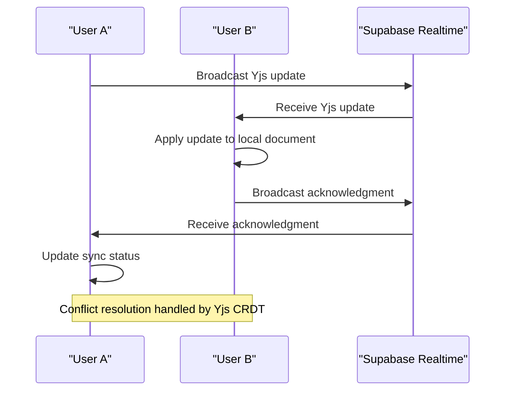
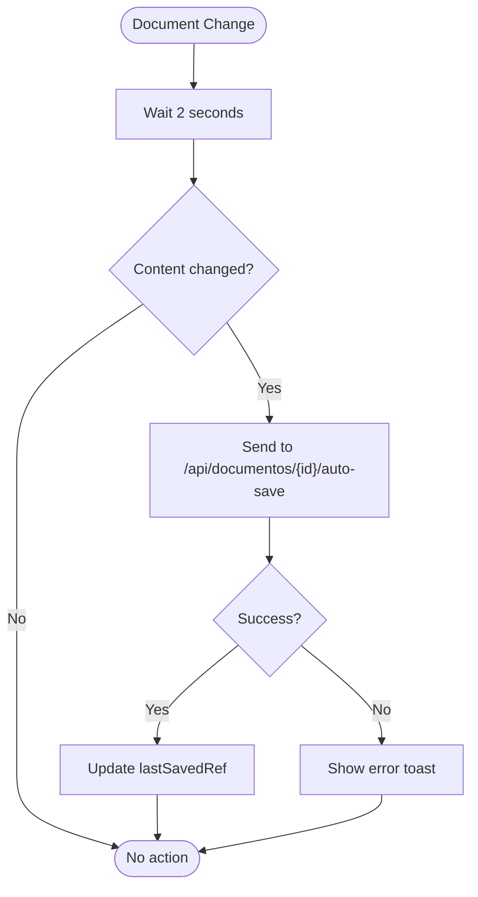

# Document Editor

<cite>
**Referenced Files in This Document**   
- [collaborative-plate-editor.tsx](file://components/plate/collaborative-plate-editor.tsx)
- [supabase-yjs-provider.ts](file://lib/yjs/supabase-yjs-provider.ts)
- [supabase-provider.ts](file://lib/yjs/supabase-provider.ts)
- [use-yjs-collaboration.ts](file://hooks/use-yjs-collaboration.ts)
- [editor-kit.tsx](file://components/plate/editor-kit.tsx)
- [plate-types.ts](file://components/plate/plate-types.ts)
- [document-editor.tsx](file://components/documentos/document-editor.tsx)
- [documentos-editor/spec.md](file://openspec/specs/documentos-editor/spec.md)
</cite>

## Table of Contents
1. [Introduction](#introduction)
2. [Architecture Overview](#architecture-overview)
3. [Core Components](#core-components)
4. [Collaborative Editing System](#collaborative-editing-system)
5. [Backend Integration](#backend-integration)
6. [Editor Configuration](#editor-configuration)
7. [Performance and Compatibility](#performance-and-compatibility)
8. [Troubleshooting Guide](#troubleshooting-guide)

## Introduction

The Document Editor component in Sinesys provides a rich text editing experience with real-time collaboration capabilities. Built on the Plate.js framework and integrated with Yjs for conflict-free real-time synchronization, this editor enables multiple users to collaborate on documents simultaneously. The system leverages Supabase Realtime for WebSocket-based communication and implements CRDT (Conflict-Free Replicated Data Type) algorithms to ensure data consistency across clients.

The editor supports a wide range of content types including text formatting, tables, media embedding, code blocks, and mathematical equations. It features auto-save functionality, version history, document sharing, and integrated chat for team collaboration. The implementation follows a modular architecture with clearly defined components for different aspects of the editing experience.

This documentation provides a comprehensive overview of the document editor's implementation, focusing on its collaborative editing system, integration with backend services, and configuration options for developers.

## Architecture Overview

The document editor architecture follows a layered approach with clear separation of concerns between the UI components, collaboration logic, and backend integration. The system is built around the Plate.js framework, which provides the foundation for rich text editing, extended with custom components for collaboration and real-time features.

```mermaid
graph TB
subgraph "Frontend"
UI[Document Editor UI]
Plate[Plate.js Framework]
Yjs[Yjs CRDT]
SupabaseClient[Supabase Realtime Client]
end
subgraph "Backend"
Supabase[Supabase Realtime]
Database[(PostgreSQL)]
Storage[(Object Storage)]
end
UI --> Plate
Plate --> Yjs
Yjs --> SupabaseClient
SupabaseClient --> Supabase
Supabase < --> Database
Supabase < --> Storage
UI --> SupabaseClient
```

**Diagram sources**
- [collaborative-plate-editor.tsx](file://components/plate/collaborative-plate-editor.tsx)
- [supabase-yjs-provider.ts](file://lib/yjs/supabase-yjs-provider.ts)
- [document-editor.tsx](file://components/documentos/document-editor.tsx)

**Section sources**
- [collaborative-plate-editor.tsx](file://components/plate/collaborative-plate-editor.tsx)
- [supabase-yjs-provider.ts](file://lib/yjs/supabase-yjs-provider.ts)

## Core Components

The document editor is composed of several core components that work together to provide a seamless editing experience. The primary component is the `CollaborativePlateEditor`, which integrates the Plate.js framework with Yjs for real-time collaboration. This component handles the connection to Supabase Realtime, manages the Yjs document synchronization, and renders the editor interface.

The editor uses a plugin-based architecture where different functionality is encapsulated in separate kits. These include `BasicBlocksKit` for fundamental text elements, `ListKit` for ordered and unordered lists, `TableKit` for table support, and `MediaKit` for handling images, videos, and other media types. Each kit configures specific Plate.js plugins with custom components and settings.

The `EditorKit` serves as the central configuration point, aggregating all the individual kits into a comprehensive editor configuration. This modular approach allows for easy customization and extension of the editor's capabilities. The `plate-types.ts` file defines the TypeScript interfaces for all supported document elements, ensuring type safety throughout the application.

**Section sources**
- [editor-kit.tsx](file://components/plate/editor-kit.tsx)
- [plate-types.ts](file://components/plate/plate-types.ts)
- [basic-blocks-kit.tsx](file://components/plate/basic-blocks-kit.tsx)
- [list-kit.tsx](file://components/plate/list-kit.tsx)
- [table-kit.tsx](file://components/plate/table-kit.tsx)
- [media-kit.tsx](file://components/plate/media-kit.tsx)

## Collaborative Editing System

The collaborative editing system in Sinesys is built on Yjs, a CRDT-based framework for real-time collaboration. The system implements operational transformation through Yjs's built-in conflict resolution algorithms, ensuring that concurrent edits from multiple users are merged consistently without conflicts.

The `SupabaseYjsProvider` class implements the UnifiedProvider interface expected by @platejs/yjs, bridging the Yjs CRDT system with Supabase Realtime. This provider handles the bidirectional synchronization of document updates between clients through Supabase's broadcast channels. When a user makes an edit, the change is encoded as a Yjs update and broadcast to all connected clients, which apply the update to their local document instances.



**Diagram sources**
- [supabase-yjs-provider.ts](file://lib/yjs/supabase-yjs-provider.ts)
- [collaborative-plate-editor.tsx](file://components/plate/collaborative-plate-editor.tsx)

The collaboration system includes several key features:
- **Real-time cursor tracking**: Users can see the cursors of other collaborators, including their position and selection
- **Presence awareness**: The system tracks which users are currently viewing or editing the document
- **Connection status**: Visual indicators show whether the user is connected to the collaboration network
- **Conflict resolution**: Yjs automatically resolves conflicts using its CRDT algorithms, ensuring data consistency

The `useYjsCollaboration` hook provides a React interface to the Yjs collaboration system, managing the lifecycle of the Yjs document and Supabase provider. It handles connection establishment, error recovery, and state synchronization, exposing a simple API for components to interact with the collaborative editing system.

**Section sources**
- [supabase-yjs-provider.ts](file://lib/yjs/supabase-yjs-provider.ts)
- [supabase-provider.ts](file://lib/yjs/supabase-provider.ts)
- [use-yjs-collaboration.ts](file://hooks/use-yjs-collaboration.ts)

## Backend Integration

The document editor integrates with the backend storage system through a combination of Supabase Realtime for collaboration and REST APIs for document persistence. The auto-save functionality periodically synchronizes document changes to the backend database, ensuring that work is not lost even if a user disconnects unexpectedly.

The `DocumentEditor` component implements a debounce-based auto-save mechanism that triggers after 2 seconds of inactivity. This prevents excessive API calls during active editing while ensuring changes are saved promptly. The auto-save process compares the current document state with the last saved state to avoid unnecessary network requests.



**Diagram sources**
- [document-editor.tsx](file://components/documentos/document-editor.tsx)

Document synchronization occurs through the following process:
1. Client detects content changes
2. After 2-second debounce period, auto-save triggers
3. Client compares current content with last saved state
4. If different, sends PATCH request to auto-save endpoint
5. Backend validates and persists changes to PostgreSQL database
6. Client updates local state to reflect saved status

The backend also supports manual saving through the "Save" button, which immediately persists changes without debouncing. This gives users explicit control over when their changes are committed to the database.

For document export, the system provides functionality to export content as PDF or DOCX files. The PDF export can use either a visual capture of the rendered editor or a text-based conversion, depending on browser capabilities. The DOCX export converts the document structure to Office Open XML format for compatibility with Microsoft Word.

**Section sources**
- [document-editor.tsx](file://components/documentos/document-editor.tsx)

## Editor Configuration

The document editor supports extensive configuration through its plugin-based architecture. The `EditorKit` aggregates various functionality kits, each responsible for a specific aspect of the editing experience. Developers can customize the editor by modifying which kits are included or by creating new kits for additional functionality.

The supported content types include:
- **Text formatting**: Bold, italic, underline, strikethrough, code
- **Headings**: H1 through H6 with keyboard shortcuts (mod+alt+1-6)
- **Lists**: Ordered and unordered lists with nested indentation
- **Block elements**: Blockquotes, horizontal rules, code blocks
- **Tables**: Grid-based tables with resizable columns
- **Media**: Images, videos, audio files, and embedded content
- **Special elements**: Callouts, toggles, date pickers, mathematical equations

Toolbar features are configured through the various kit components:
- **Fixed toolbar**: Always visible formatting options
- **Floating toolbar**: Context-sensitive actions that appear near selection
- **Block menu**: Insert new block types via slash commands
- **Comment toolbar**: Add comments and suggestions
- **Link toolbar**: Insert and edit hyperlinks

Plugin configuration options allow fine-tuning of editor behavior:
- **Autoformatting**: Automatic conversion of markdown-like syntax to formatted elements
- **Exit breaks**: Rules for when pressing Enter should exit a block element
- **Shortcuts**: Custom keyboard shortcuts for common actions
- **Drag and drop**: Support for rearranging content
- **Mentions**: User mentions with autocomplete

The editor's appearance and behavior can be further customized through CSS variables and theme configuration, allowing it to match the application's overall design language.

**Section sources**
- [editor-kit.tsx](file://components/plate/editor-kit.tsx)
- [plate-types.ts](file://components/plate/plate-types.ts)
- [autoformat-kit.tsx](file://components/plate/autoformat-kit.tsx)
- [exit-break-kit.tsx](file://components/plate/exit-break-kit.tsx)
- [slash-kit.tsx](file://components/plate/slash-kit.tsx)

## Performance and Compatibility

The document editor is designed to perform well with large documents and maintain compatibility across modern browsers. Several optimization strategies are employed to ensure a smooth user experience:

- **Virtualization**: Large documents are rendered efficiently by only processing visible content
- **Debounced updates**: Frequent events like typing are batched to reduce processing overhead
- **Efficient diffing**: Yjs uses optimized algorithms to compute the minimal set of changes needed for synchronization
- **IndexedDB persistence**: Local storage of document state enables offline editing and faster load times

The editor supports all modern browsers including Chrome, Firefox, Safari, and Edge. Mobile compatibility is maintained through responsive design and touch event handling. The system gracefully degrades functionality when certain features are not available in the user's browser.

For large documents, the editor implements several performance optimizations:
- **Lazy loading**: Content is loaded incrementally as the user scrolls
- **Throttled collaboration**: Real-time updates are rate-limited to prevent network congestion
- **Efficient rendering**: The React component tree is optimized to minimize re-renders
- **Memory management**: Unused resources are cleaned up promptly to prevent memory leaks

The system monitors performance metrics and provides fallback mechanisms for scenarios where real-time collaboration might be compromised, such as poor network conditions or high system load.

**Section sources**
- [document-editor.tsx](file://components/documentos/document-editor.tsx)
- [collaborative-plate-editor.tsx](file://components/plate/collaborative-plate-editor.tsx)

## Troubleshooting Guide

Common issues with the document editor and their solutions:

**Connection loss during collaboration**
- **Symptoms**: "Connecting..." status persists, changes not syncing to other users
- **Causes**: Network connectivity issues, Supabase Realtime service interruption
- **Solutions**: 
  - Check internet connection
  - Refresh the page to re-establish connection
  - Verify Supabase service status
  - The system automatically attempts to reconnect when connection is restored

**Performance issues with large documents**
- **Symptoms**: Slow typing response, laggy scrolling, high CPU usage
- **Causes**: Large document size, complex formatting, multiple collaborators
- **Solutions**:
  - Break large documents into smaller sections
  - Reduce use of complex elements like tables and embedded content
  - Close the document on devices not actively editing
  - The system automatically optimizes rendering for large documents

**Browser compatibility issues**
- **Symptoms**: Formatting not applied correctly, features not working
- **Causes**: Unsupported browser features, CSS rendering differences
- **Solutions**:
  - Use a supported modern browser
  - Clear browser cache and reload
  - Disable browser extensions that might interfere
  - Report issues to development team for resolution

**Auto-save failures**
- **Symptoms**: Changes not persisting, error messages during editing
- **Causes**: Network issues, API rate limiting, authentication problems
- **Solutions**:
  - Check network connection
  - Manually save using the Save button
  - Verify login session is active
  - The system maintains local changes and attempts to sync when possible

The editor includes comprehensive error handling and user feedback mechanisms. Error states are clearly communicated through toast notifications, and the system attempts to recover from most issues automatically. For persistent problems, users can access version history to recover previous document states.

**Section sources**
- [document-editor.tsx](file://components/documentos/document-editor.tsx)
- [collaborative-plate-editor.tsx](file://components/plate/collaborative-plate-editor.tsx)
- [use-yjs-collaboration.ts](file://hooks/use-yjs-collaboration.ts)