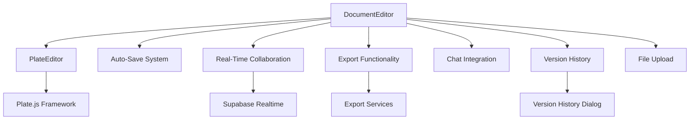
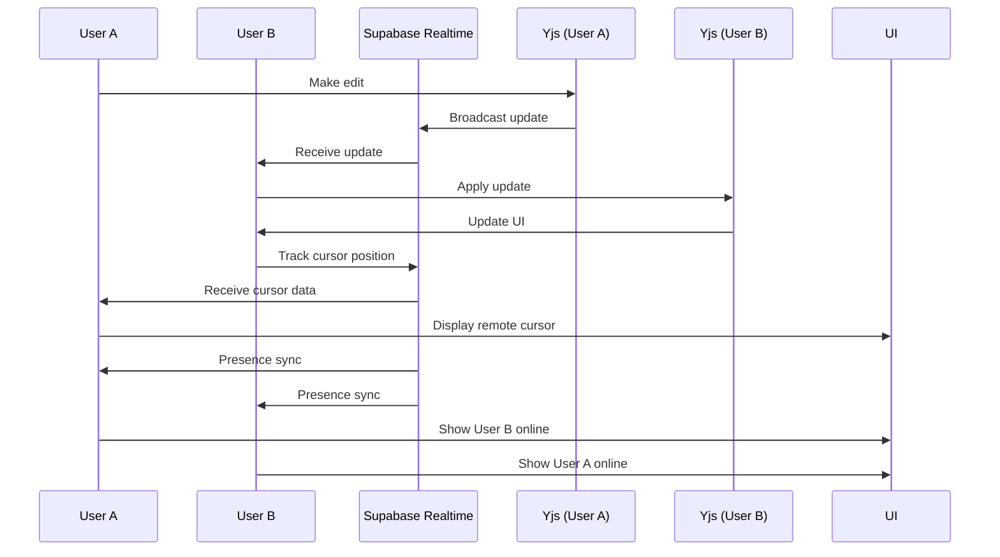
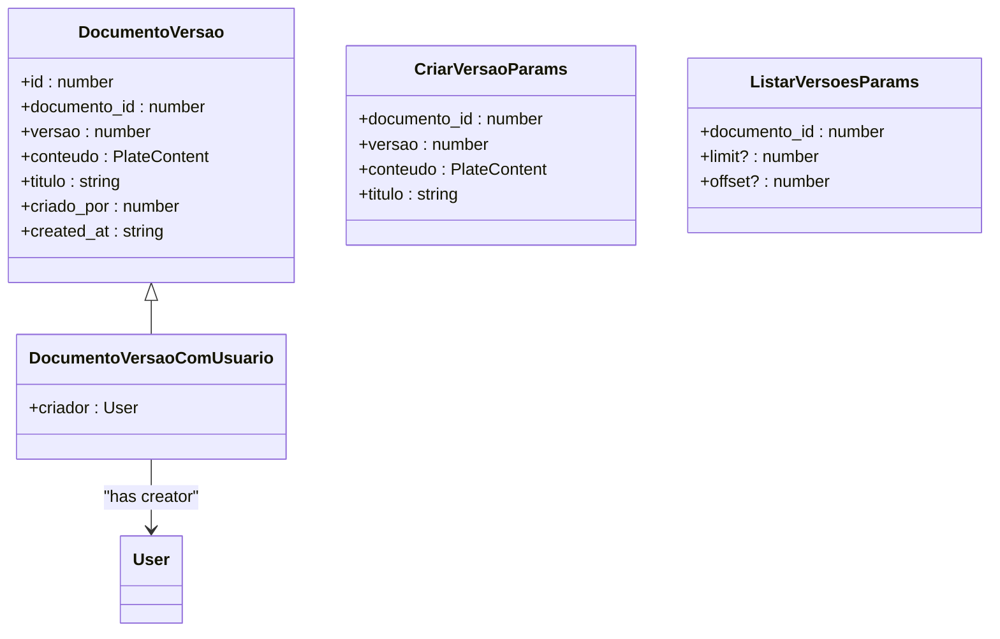
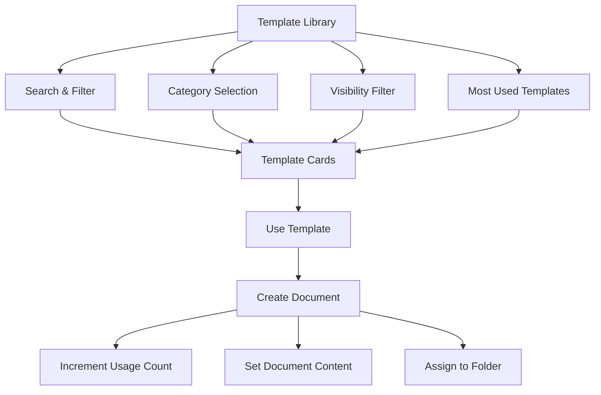
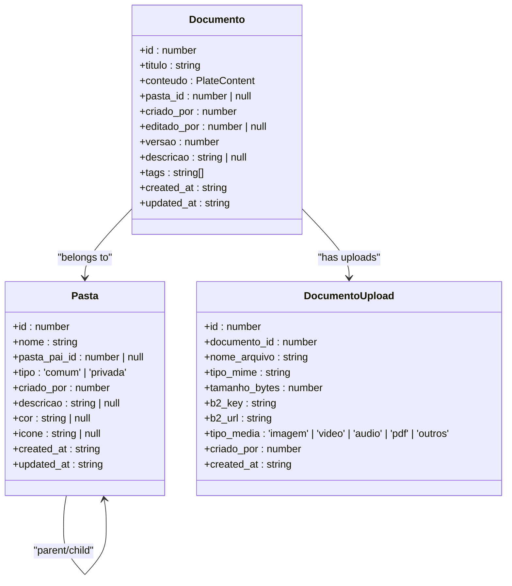
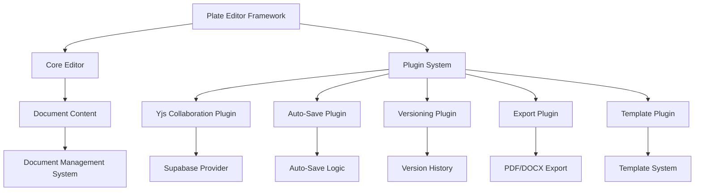
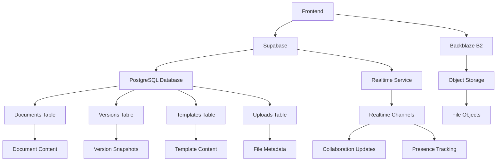

# Document Management Components

<cite>
**Referenced Files in This Document**   
- [document-editor.tsx](file://components/documentos/document-editor.tsx)
- [version-history-dialog.tsx](file://components/documentos/version-history-dialog.tsx)
- [template-card.tsx](file://components/documentos/template-card.tsx)
- [supabase-provider.ts](file://lib/yjs/supabase-provider.ts)
- [supabase-yjs-provider.ts](file://lib/yjs/supabase-yjs-provider.ts)
- [use-realtime-collaboration.ts](file://hooks/use-realtime-collaboration.ts)
- [types.ts](file://backend/types/documentos/types.ts)
- [template-library-dialog.tsx](file://components/documentos/template-library-dialog.tsx)
- [create-document-dialog.tsx](file://components/documentos/create-document-dialog.tsx)
</cite>

## Table of Contents
1. [Introduction](#introduction)
2. [Document Editor Architecture](#document-editor-architecture)
3. [Real-Time Collaboration System](#real-time-collaboration-system)
4. [Version History Management](#version-history-management)
5. [Template System](#template-system)
6. [File Management Components](#file-management-components)
7. [Integration with Plate Editor Framework](#integration-with-plate-editor-framework)
8. [Storage and Backend Services](#storage-and-backend-services)
9. [Common Issues and Solutions](#common-issues-and-solutions)
10. [Conclusion](#conclusion)

## Introduction

The document management system in Sinesys provides a comprehensive solution for creating, editing, and collaborating on legal documents. Built on the Plate editor framework, the system offers real-time collaboration, version history tracking, template management, and robust file organization capabilities. This documentation details the implementation of key components including the DocumentEditor, VersionHistoryDialog, and TemplateCard, explaining their architecture, relationships, and integration with backend services.

The system leverages Yjs for real-time collaboration, Supabase for data persistence and real-time communication, and a custom provider implementation to synchronize document state across clients. Documents are stored with rich metadata including content, versioning information, sharing permissions, and user collaboration data.

**Section sources**
- [document-editor.tsx](file://components/documentos/document-editor.tsx#L1-L479)

## Document Editor Architecture

The DocumentEditor component serves as the central interface for document creation and editing in Sinesys. It integrates the Plate.js editor with auto-save functionality, real-time collaboration features, and document management tools.

The editor implements a comprehensive toolbar with document controls including save, export, sharing, and version history access. It manages document state through React hooks, maintaining the document content, title, and metadata in component state. The editor employs a debounce mechanism for auto-saving, with changes automatically persisted after 2 seconds of inactivity.

Key features of the DocumentEditor include:
- Real-time collaboration with presence indicators
- Auto-save functionality with manual save option
- Document export to PDF and DOCX formats
- Integrated chat sidebar for document discussion
- File upload capabilities for supporting materials
- Version history access and restoration

The component uses a provider pattern with DocumentEditorProvider to manage document-specific context and upload functionality. It integrates with the PlateEditor component from the Plate framework, passing the initial document content and handling content changes through the onChange callback.

**Diagram sources **
- [document-editor.tsx](file://components/documentos/document-editor.tsx#L1-L479)

**Section sources**
- [document-editor.tsx](file://components/documentos/document-editor.tsx#L1-L479)

## Real-Time Collaboration System

The real-time collaboration system in Sinesys enables multiple users to edit documents simultaneously with low-latency updates. The system is built on Yjs, a CRDT-based framework for real-time data synchronization, with a custom Supabase provider implementation for transport.

The collaboration system consists of two main components: the SupabaseYjsProvider and the useRealtimeCollaboration hook. The SupabaseYjsProvider implements the UnifiedProvider interface expected by Plate.js, handling document synchronization through Supabase Realtime channels. It manages connection state, document updates, and awareness information for cursor tracking.

The useRealtimeCollaboration hook provides a higher-level interface for presence tracking and content broadcasting. It uses Supabase presence functionality to track which users are currently viewing or editing a document. The hook maintains a list of collaborators and their cursor positions, updating in real-time as users move through the document.

Key aspects of the collaboration system:
- Incremental update broadcasting to minimize network traffic
- Full state synchronization on connection for consistency
- Presence tracking with user identification and color coding
- Cursor and selection sharing for collaborative editing
- Conflict-free replicated data type (CRDT) model for data consistency

The system handles connection lifecycle events including connection, disconnection, and reconnection. When a user connects, the system requests a full state sync from existing clients to ensure consistency. If no response is received within 2 seconds, the system assumes it is the first client and proceeds with the local state.

**Diagram sources **
- [supabase-yjs-provider.ts](file://lib/yjs/supabase-yjs-provider.ts#L1-L358)
- [use-realtime-collaboration.ts](file://hooks/use-realtime-collaboration.ts#L1-L244)

**Section sources**
- [supabase-provider.ts](file://lib/yjs/supabase-provider.ts#L1-L251)
- [supabase-yjs-provider.ts](file://lib/yjs/supabase-yjs-provider.ts#L1-L358)
- [use-realtime-collaboration.ts](file://hooks/use-realtime-collaboration.ts#L1-L244)

## Version History Management

The version history system in Sinesys provides comprehensive document version tracking and restoration capabilities. The VersionHistoryDialog component displays a chronological timeline of document versions, allowing users to view and restore previous states.

Each document version is stored as a complete snapshot of the document content and metadata, including the title, content structure, and creation timestamp. Versions are automatically created during the auto-save process, with a new version generated when content changes are detected after the debounce period.

The version history interface displays key information for each version:
- Version number with visual timeline indicator
- Relative and absolute timestamps
- Creator information including name
- Current version marker
- Restore functionality for historical versions

When a user requests to restore a version, the system creates a new version with the current content before applying the restored state. This ensures that the restoration process is reversible and maintains a complete history of changes.

The backend service handles version creation, listing, and restoration through dedicated API endpoints. The system uses a sequential version numbering scheme, with each new version incrementing the version counter. The frontend component fetches version data when opened and displays it in a scrollable timeline format.

**Diagram sources **
- [version-history-dialog.tsx](file://components/documentos/version-history-dialog.tsx#L1-L253)
- [types.ts](file://backend/types/documentos/types.ts#L333-L372)

**Section sources**
- [version-history-dialog.tsx](file://components/documentos/version-history-dialog.tsx#L1-L253)

## Template System

The template system in Sinesys enables users to create, manage, and reuse document templates for consistent document creation. The system includes components for template display, library browsing, and template application.

The TemplateCard component displays individual templates with key information including title, category, description, visibility status, usage statistics, and creator information. Templates can be public or private, with public templates available to all users and private templates restricted to the creator and explicitly shared users.

The TemplateLibraryDialog provides a comprehensive interface for browsing and searching templates. Users can filter templates by category, visibility, and search terms. The dialog includes a "Most Used" tab that highlights frequently used templates, helping users quickly access commonly used document patterns.

Key features of the template system:
- Template creation from existing documents
- Categorization and tagging for organization
- Usage counting to identify popular templates
- Thumbnail preview support
- Public/private visibility controls
- Search and filtering capabilities

When a user applies a template, the system creates a new document with the template's content and metadata. The creation process includes incrementing the template's usage count and associating the new document with the specified folder. The system handles template application through a dedicated API endpoint that validates permissions and processes the template instantiation.

**Diagram sources **
- [template-card.tsx](file://components/documentos/template-card.tsx#L1-L133)
- [template-library-dialog.tsx](file://components/documentos/template-library-dialog.tsx#L1-L325)

**Section sources**
- [template-card.tsx](file://components/documentos/template-card.tsx#L1-L133)
- [template-library-dialog.tsx](file://components/documentos/template-library-dialog.tsx#L1-L325)

## File Management Components

The file management system in Sinesys provides comprehensive document organization and navigation capabilities. The system includes components for document creation, folder management, and document listing.

The CreateDocumentDialog component provides a simple interface for creating new documents. Users can specify a title, description, and parent folder. The dialog validates input and handles document creation through the API, redirecting to the editor upon successful creation.

The document management interface includes components for:
- Document listing with search and filtering
- Folder tree navigation
- Document cards with metadata display
- Bulk operations and context menus
- Upload functionality for supporting files

The system supports hierarchical folder organization with both common and private folder types. Private folders are restricted to specific users or teams, while common folders are accessible according to sharing permissions. The folder system includes metadata such as color coding, icons, and description fields for enhanced organization.

File uploads are handled through a dedicated upload dialog that integrates with Backblaze B2 storage. Uploaded files are associated with documents and can be referenced within the document content. The system tracks upload metadata including file name, MIME type, size, and storage key.

**Diagram sources **
- [create-document-dialog.tsx](file://components/documentos/create-document-dialog.tsx#L1-L147)
- [types.ts](file://backend/types/documentos/types.ts#L18-L105)

**Section sources**
- [create-document-dialog.tsx](file://components/documentos/create-document-dialog.tsx#L1-L147)

## Integration with Plate Editor Framework

The document management system in Sinesys is built on the Plate editor framework, a React-based rich text editor with extensible plugin architecture. The integration leverages Plate's core functionality while extending it with custom features for legal document management.

The system uses Plate's plugin system to configure the editor with domain-specific features including:
- Legal document formatting and styling
- Citation and reference management
- Table of contents generation
- Comment and annotation tools
- Version comparison and change tracking

The integration includes custom plugins for:
- Yjs collaboration with Supabase transport
- Auto-save and versioning
- Document metadata management
- Template application and management
- Export functionality for PDF and DOCX formats

The editor configuration is managed through the PlateEditor component, which accepts initial content and change handlers. The system extends Plate's default behavior with custom serialization for legal document structures and enhanced collaboration features.

The integration also includes custom UI components that complement the Plate editor, such as the fixed and floating toolbars, block context menus, and document status indicators. These components provide a seamless user experience while maintaining the flexibility and extensibility of the underlying Plate framework.

**Diagram sources **
- [document-editor.tsx](file://components/documentos/document-editor.tsx#L1-L479)

## Storage and Backend Services

The document management system in Sinesys integrates with multiple backend services for data persistence, real-time communication, and file storage. The system uses Supabase as the primary backend service, leveraging its PostgreSQL database, authentication, and real-time capabilities.

Document content is stored in the database using JSONB fields to preserve the hierarchical structure of Plate.js content. Metadata such as title, version, and timestamps are stored in dedicated columns for efficient querying and indexing. The system uses row-level security to enforce access controls based on user permissions and document sharing settings.

For real-time collaboration, the system uses Supabase Realtime channels with broadcast and presence functionality. The custom SupabaseYjsProvider uses broadcast channels to transmit Yjs updates between clients and presence tracking to monitor user activity and cursor positions.

File storage is handled through Backblaze B2, with files uploaded directly from the client through presigned URLs. The system generates unique keys for each file and stores metadata in the database to maintain associations with documents. The storage service includes utilities for file naming, URL generation, and access control.

The backend services are organized into dedicated modules for:
- Document persistence and querying
- Version history management
- Template creation and usage
- File upload and storage
- Collaboration and presence tracking
- Sharing and permission management

API endpoints follow a consistent pattern with standardized response formats for success and error conditions. The system uses middleware for authentication, authorization, and input validation to ensure data integrity and security.

**Diagram sources **
- [types.ts](file://backend/types/documentos/types.ts#L1-L557)

## Common Issues and Solutions

The document management system in Sinesys addresses several common challenges in collaborative document editing through thoughtful design and implementation.

### Concurrent Edit Conflicts

The system uses Yjs, a Conflict-free Replicated Data Type (CRDT) framework, to automatically resolve concurrent edits without conflicts. Yjs ensures that all clients eventually converge to the same state regardless of the order of operations. The custom Supabase provider handles network interruptions by queuing updates and synchronizing when connectivity is restored.

### Large Document Performance

For large documents, the system implements several optimizations:
- Virtualized rendering for long documents
- Debounced auto-save to prevent excessive updates
- Efficient diff algorithms for change detection
- Lazy loading of document content
- Optimized database queries with proper indexing

### Connection Reliability

The collaboration system handles intermittent connectivity through:
- Local change queuing during offline periods
- Automatic reconnection and state synchronization
- Conflict resolution on reconnection
- Graceful degradation when real-time features are unavailable

### Data Consistency

The system maintains data consistency through:
- Atomic database transactions for related operations
- Versioned document snapshots for audit trails
- Validation middleware for API requests
- Comprehensive error handling and recovery

### User Experience Challenges

Common user experience issues are addressed through:
- Clear visual indicators for collaboration status
- Intuitive version history navigation
- Responsive design for various screen sizes
- Accessible UI components and keyboard navigation
- Comprehensive error messages and recovery options

## Conclusion

The document management components in Sinesys provide a robust, scalable solution for legal document creation and collaboration. By leveraging modern technologies like Yjs for real-time collaboration and Plate.js for rich text editing, the system delivers a seamless user experience while maintaining data integrity and performance.

The architecture balances client-side interactivity with server-side reliability, using Supabase as a unified backend service for data persistence, real-time communication, and authentication. The modular design allows for easy extension and customization, while the comprehensive API enables integration with other systems.

Key strengths of the implementation include:
- Real-time collaboration with low-latency updates
- Comprehensive version history and restoration
- Flexible template system for document reuse
- Robust file management and organization
- Seamless integration with the Plate editor framework

The system effectively addresses common challenges in collaborative document editing while providing a user-friendly interface that caters to both technical and non-technical users. With its extensible architecture and comprehensive feature set, the document management system serves as a solid foundation for legal document workflows in Sinesys.