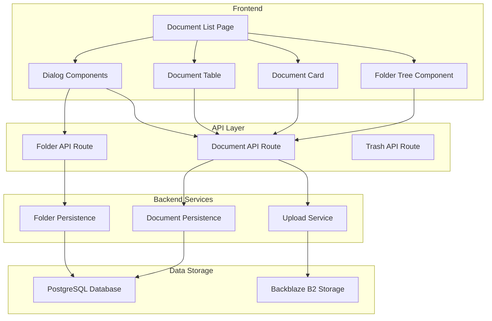
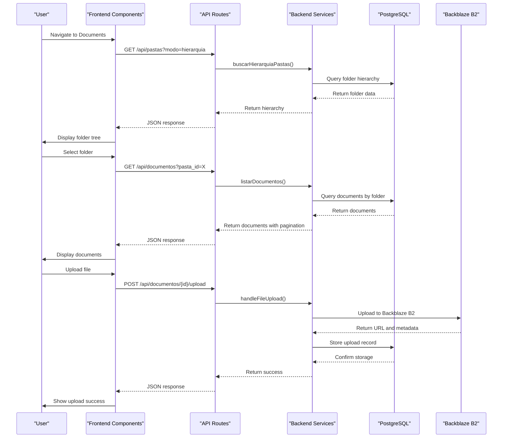
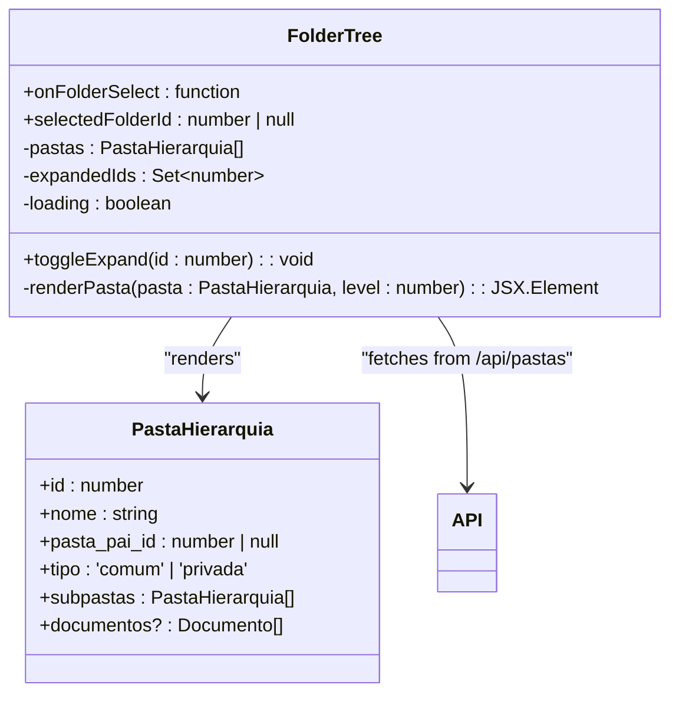
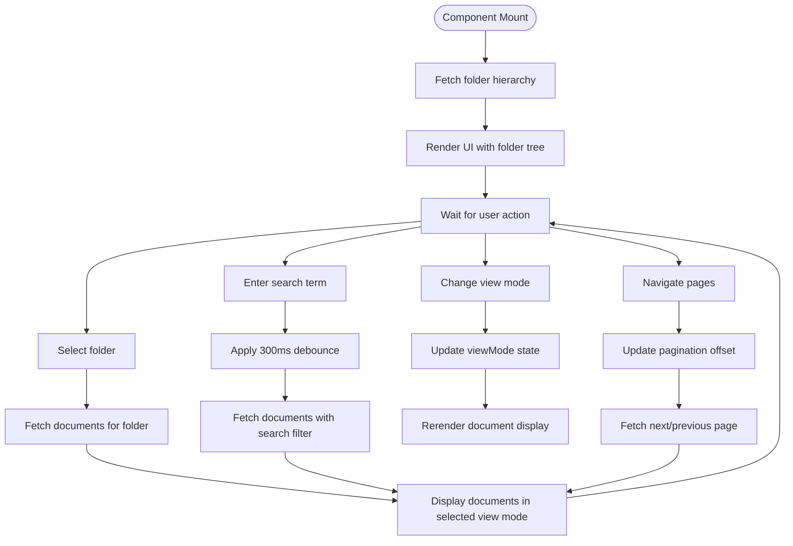
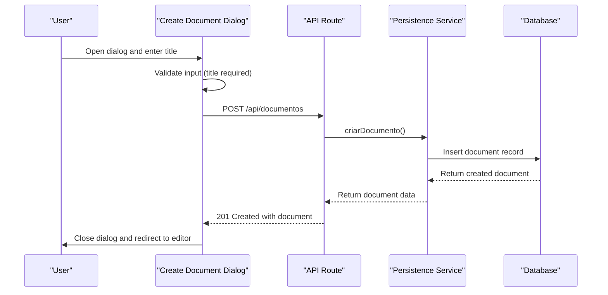
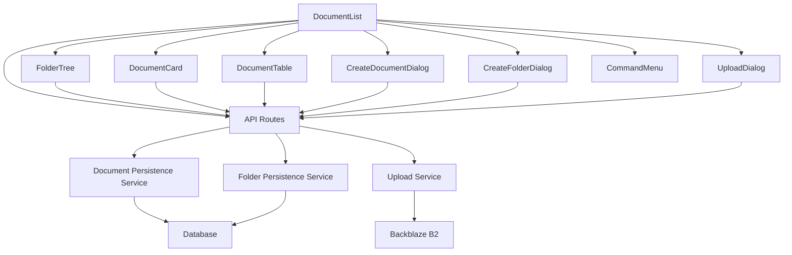

# File Management System

<cite>
**Referenced Files in This Document**   
- [page.tsx](file://app/(dashboard)/documentos/page.tsx)
- [folder-tree.tsx](file://components/documentos/folder-tree.tsx)
- [document-list.tsx](file://components/documentos/document-list.tsx)
- [document-card.tsx](file://components/documentos/document-card.tsx)
- [document-table.tsx](file://components/documentos/document-table.tsx)
- [create-document-dialog.tsx](file://components/documentos/create-document-dialog.tsx)
- [create-folder-dialog.tsx](file://components/documentos/create-folder-dialog.tsx)
- [upload-dialog.tsx](file://components/documentos/upload-dialog.tsx)
- [command-menu.tsx](file://components/documentos/command-menu.tsx)
- [types.ts](file://backend/types/documentos/types.ts)
- [documentos-persistence.service.ts](file://backend/documentos/services/persistence/documentos-persistence.service.ts)
- [pastas-persistence.service.ts](file://backend/documentos/services/persistence/pastas-persistence.service.ts)
- [b2-upload.service.ts](file://backend/documentos/services/upload/b2-upload.service.ts)
- [route.ts](file://app/api/documentos/route.ts)
- [route.ts](file://app/api/pastas/route.ts)
- [route.ts](file://app/api/lixeira/route.ts)
</cite>

## Table of Contents
1. [Introduction](#introduction)
2. [Project Structure](#project-structure)
3. [Core Components](#core-components)
4. [Architecture Overview](#architecture-overview)
5. [Detailed Component Analysis](#detailed-component-analysis)
6. [Dependency Analysis](#dependency-analysis)
7. [Performance Considerations](#performance-considerations)
8. [Troubleshooting Guide](#troubleshooting-guide)
9. [Conclusion](#conclusion)

## Introduction
The Sinesys file management system provides a comprehensive solution for organizing, storing, and collaborating on legal documents within a hierarchical folder structure. This system enables users to create, organize, and share documents through an intuitive interface that combines a folder tree navigation with flexible document listing views. The architecture integrates frontend components with backend services to deliver a seamless experience for document creation, organization, and collaboration. The system supports various document operations including drag-and-drop reorganization, upload functionality, and trash/restore capabilities, all while maintaining data integrity and user permissions.

## Project Structure
The file management system in Sinesys follows a well-organized structure that separates frontend components from backend services. The frontend implementation resides in the `components/documentos/` directory, containing reusable UI components for document management, while the backend services are located in `backend/documentos/services/`. The system uses Next.js API routes in `app/api/` to handle HTTP requests, connecting the frontend interface with backend persistence logic. This separation of concerns allows for maintainable code and clear boundaries between presentation, business logic, and data access layers.

**Diagram sources**
- [page.tsx](file://app/(dashboard)/documentos/page.tsx)
- [folder-tree.tsx](file://components/documentos/folder-tree.tsx)
- [document-list.tsx](file://components/documentos/document-list.tsx)
- [route.ts](file://app/api/documentos/route.ts)
- [route.ts](file://app/api/pastas/route.ts)
- [documentos-persistence.service.ts](file://backend/documentos/services/persistence/documentos-persistence.service.ts)
- [pastas-persistence.service.ts](file://backend/documentos/services/persistence/pastas-persistence.service.ts)
- [b2-upload.service.ts](file://backend/documentos/services/upload/b2-upload.service.ts)

**Section sources**
- [page.tsx](file://app/(dashboard)/documentos/page.tsx)
- [folder-tree.tsx](file://components/documentos/folder-tree.tsx)
- [document-list.tsx](file://components/documentos/document-list.tsx)

## Core Components
The file management system consists of several core components that work together to provide a complete document organization experience. The `DocumentList` component serves as the main interface, integrating the `FolderTree` for navigation with document display components like `DocumentCard` and `DocumentTable`. Dialog components such as `CreateDocumentDialog`, `CreateFolderDialog`, and `UploadDialog` provide interactive interfaces for creating and uploading content. These components are designed to work seamlessly together, sharing state and responding to user actions to create a cohesive user experience for managing documents within the hierarchical folder structure.

**Section sources**
- [document-list.tsx](file://components/documentos/document-list.tsx)
- [folder-tree.tsx](file://components/documentos/folder-tree.tsx)
- [document-card.tsx](file://components/documentos/document-card.tsx)
- [document-table.tsx](file://components/documentos/document-table.tsx)
- [create-document-dialog.tsx](file://components/documentos/create-document-dialog.tsx)
- [create-folder-dialog.tsx](file://components/documentos/create-folder-dialog.tsx)
- [upload-dialog.tsx](file://components/documentos/upload-dialog.tsx)

## Architecture Overview
The file management system follows a client-server architecture with a React-based frontend communicating with backend services through RESTful API endpoints. The frontend components handle user interface rendering and interaction, while the backend services manage data persistence and business logic. The system uses a PostgreSQL database for storing document and folder metadata, while actual file content is stored in Backblaze B2 cloud storage. This separation allows for efficient handling of both structured data and binary files. The architecture supports real-time collaboration through WebSocket connections and implements proper authentication and authorization to ensure data security.

**Diagram sources**
- [folder-tree.tsx](file://components/documentos/folder-tree.tsx)
- [document-list.tsx](file://components/documentos/document-list.tsx)
- [route.ts](file://app/api/documentos/route.ts)
- [route.ts](file://app/api/pastas/route.ts)
- [b2-upload.service.ts](file://backend/documentos/services/upload/b2-upload.service.ts)
- [documentos-persistence.service.ts](file://backend/documentos/services/persistence/documentos-persistence.service.ts)
- [pastas-persistence.service.ts](file://backend/documentos/services/persistence/pastas-persistence.service.ts)

## Detailed Component Analysis

### Folder Tree Component
The `FolderTree` component provides a hierarchical navigation interface for the file management system, allowing users to browse through folders and subfolders. It fetches the folder hierarchy from the backend API and renders it as an expandable tree structure with visual indicators for folder state (expanded/collapsed). The component maintains local state for expanded folders and selected folder, enabling efficient rendering without requiring server requests for expansion/collapse operations.

**Diagram sources**
- [folder-tree.tsx](file://components/documentos/folder-tree.tsx)
- [types.ts](file://backend/types/documentos/types.ts)

### Document List Component
The `DocumentList` component serves as the central interface for viewing and managing documents within the selected folder context. It integrates multiple UI elements including the folder tree, document display (in grid or list view), search functionality, filtering options, and pagination controls. The component manages complex state including current view mode, search queries, selected filters, and pagination information, coordinating these elements to provide a seamless document browsing experience.

**Diagram sources**
- [document-list.tsx](file://components/documentos/document-list.tsx)

### Document Creation and Upload Functionality
The system provides dedicated dialog components for creating new documents and uploading files. The `CreateDocumentDialog` and `CreateFolderDialog` components handle the creation of new documents and folders respectively, validating user input before submitting to the backend API. The `UploadDialog` component manages file uploads, including client-side validation of file size (maximum 50MB) and type, progress indication during upload, and error handling for failed operations.

**Diagram sources**
- [create-document-dialog.tsx](file://components/documentos/create-document-dialog.tsx)
- [create-folder-dialog.tsx](file://components/documentos/create-folder-dialog.tsx)
- [upload-dialog.tsx](file://components/documentos/upload-dialog.tsx)
- [route.ts](file://app/api/documentos/route.ts)
- [documentos-persistence.service.ts](file://backend/documentos/services/persistence/documentos-persistence.service.ts)

## Dependency Analysis
The file management system components have well-defined dependencies that follow a unidirectional data flow pattern. The main `DocumentList` component depends on the `FolderTree` for navigation state and various dialog components for interactive operations. All components depend on the backend API routes for data retrieval and mutation operations. The backend services have dependencies on the database layer for data persistence and on external storage services for file handling. The system uses proper dependency injection and separation of concerns to maintain loose coupling between components.

**Diagram sources**
- [document-list.tsx](file://components/documentos/document-list.tsx)
- [folder-tree.tsx](file://components/documentos/folder-tree.tsx)
- [route.ts](file://app/api/documentos/route.ts)
- [route.ts](file://app/api/pastas/route.ts)
- [documentos-persistence.service.ts](file://backend/documentos/services/persistence/documentos-persistence.service.ts)
- [pastas-persistence.service.ts](file://backend/documentos/services/persistence/pastas-persistence.service.ts)
- [b2-upload.service.ts](file://backend/documentos/services/upload/b2-upload.service.ts)

## Performance Considerations
The file management system implements several performance optimizations to handle large datasets efficiently. The document listing uses pagination with a default limit of 20 items per page to prevent overwhelming the client with data. The folder tree loads the complete hierarchy in a single request to minimize round trips, while document lists are fetched on-demand based on the selected folder. Client-side debouncing (300ms) is applied to search inputs to reduce the frequency of API requests during typing. The system also uses React's Suspense and lazy loading features to improve initial page load performance and implements efficient state management to minimize unnecessary re-renders.

## Troubleshooting Guide
Common issues in the file management system typically relate to authentication, permissions, or network connectivity. If the folder tree fails to load, check the browser's developer console for API request errors and verify authentication status. For upload failures, ensure the file size does not exceed 50MB and that the file type is supported. If documents do not appear after creation, try refreshing the view or checking the pagination controls to ensure the new document is not on a different page. Synchronization issues between multiple users can be resolved by refreshing the page to fetch the latest data from the server. For persistent issues, verify the backend services are running and the database connection is active.

**Section sources**
- [document-list.tsx](file://components/documentos/document-list.tsx)
- [folder-tree.tsx](file://components/documentos/folder-tree.tsx)
- [upload-dialog.tsx](file://components/documentos/upload-dialog.tsx)
- [route.ts](file://app/api/documentos/route.ts)

## Conclusion
The Sinesys file management system provides a robust and user-friendly solution for organizing legal documents within a hierarchical structure. By combining an intuitive frontend interface with a scalable backend architecture, the system enables efficient document organization, creation, and collaboration. The clear separation of concerns between components, well-defined API contracts, and thoughtful performance optimizations make the system maintainable and extensible. The implementation of features like the folder tree navigation, multiple view modes, and integrated upload functionality demonstrates a comprehensive approach to document management that balances usability with technical sophistication.