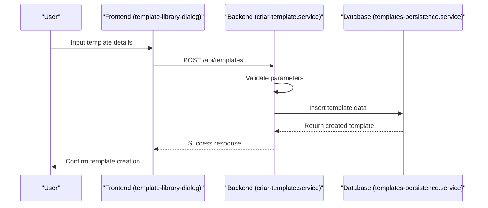
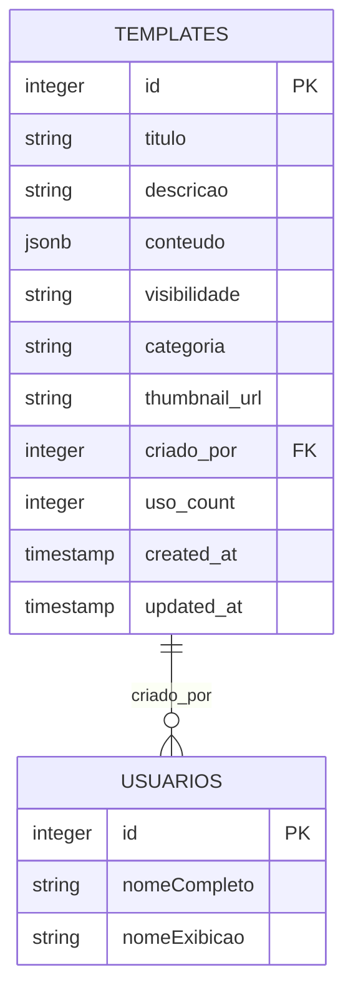
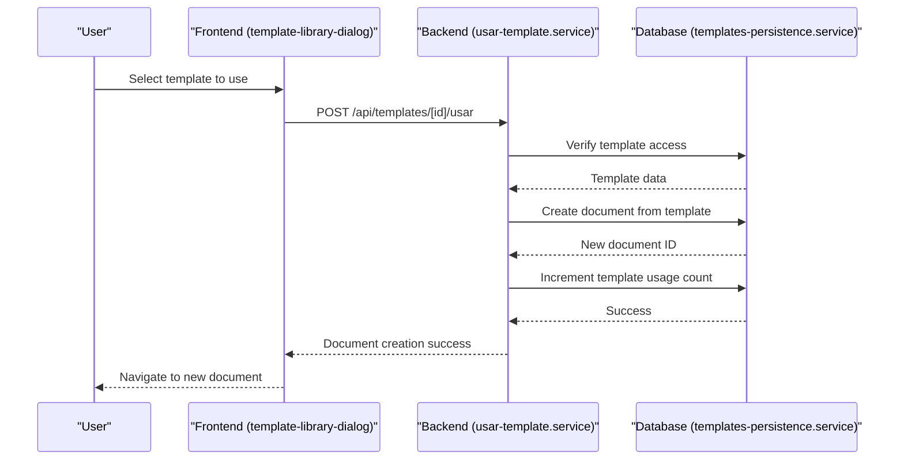
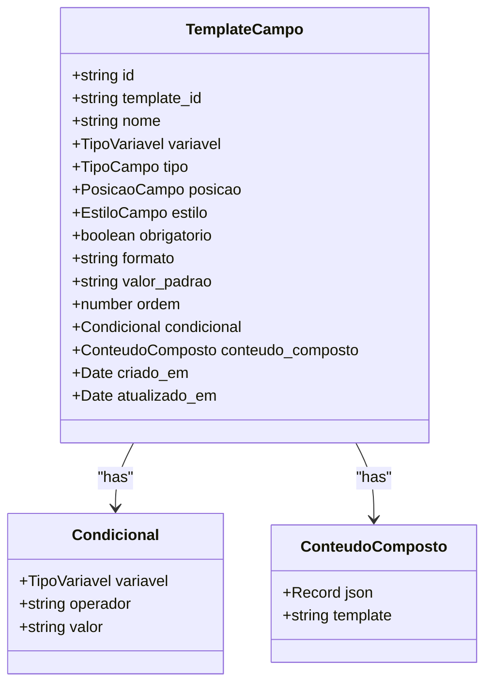
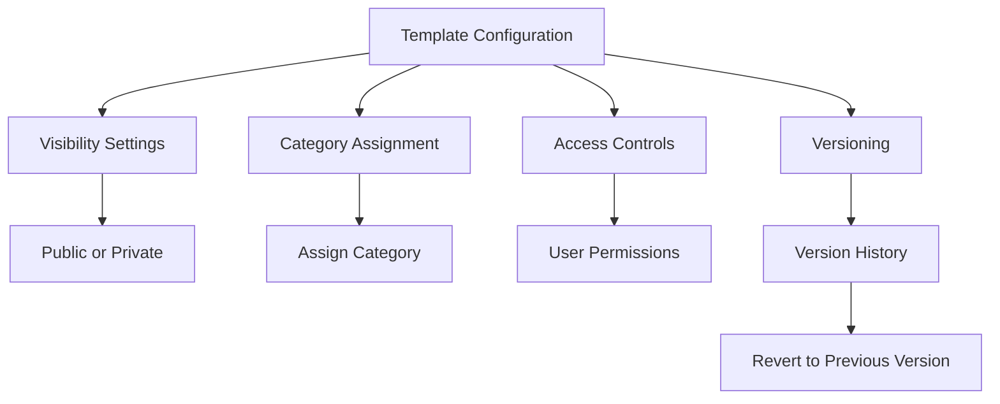
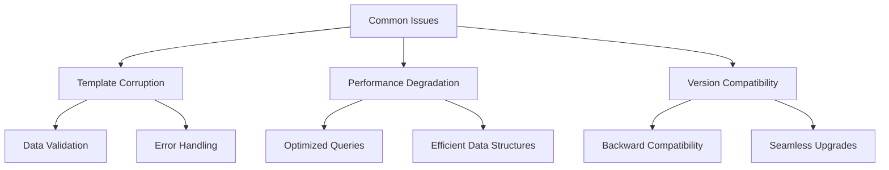
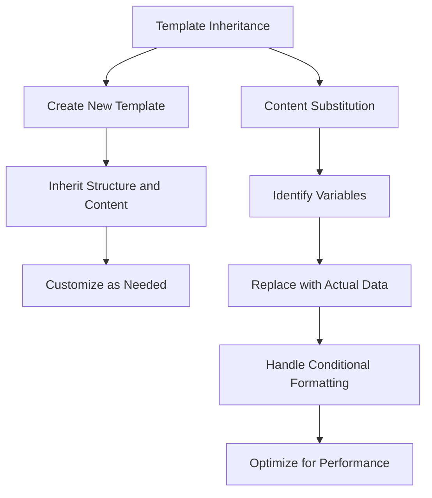

# Templates System

<cite>
**Referenced Files in This Document**   
- [template-card.tsx](file://components/documentos/template-card.tsx)
- [template-library-dialog.tsx](file://components/documentos/template-library-dialog.tsx)
- [route.ts](file://app/api/templates/route.ts)
- [route.ts](file://app/api/templates/[id]/route.ts)
- [route.ts](file://app/api/templates/[id]/usar/route.ts)
- [criar-template.service.ts](file://backend/documentos/services/templates/criar-template.service.ts)
- [usar-template.service.ts](file://backend/documentos/services/templates/usar-template.service.ts)
- [templates-persistence.service.ts](file://backend/documentos/services/persistence/templates-persistence.service.ts)
- [template.types.ts](file://backend/types/template.types.ts)
- [format-template.ts](file://lib/assinatura-digital/utils/format-template.ts)
</cite>

## Table of Contents
1. [Introduction](#introduction)
2. [Template Creation](#template-creation)
3. [Template Storage](#template-storage)
4. [Template Application](#template-application)
5. [Template-Card Component and Backend Integration](#template-card-component-and-backend-integration)
6. [Template Variables and Conditional Formatting](#template-variables-and-conditional-formatting)
7. [Template Configuration Options](#template-configuration-options)
8. [Common Issues and Performance](#common-issues-and-performance)
9. [Template Inheritance and Content Substitution](#template-inheritance-and-content-substitution)
10. [Conclusion](#conclusion)

## Introduction
The Templates System in Sinesys is a comprehensive solution for creating, storing, and applying document templates. This system enables users to generate new documents efficiently by leveraging pre-defined templates, which can include dynamic content and conditional formatting. The architecture integrates frontend components with backend services to ensure seamless template management and usage. This document provides a detailed exploration of the implementation, focusing on template creation, storage, application, and the relationship between the template-card component and the backend template persistence service.

## Template Creation
The process of creating templates in Sinesys involves both frontend and backend components. Users can create templates through a user-friendly interface, where they define the template's title, description, content, visibility, category, and other metadata. The creation process is validated both on the client and server sides to ensure data integrity.

On the frontend, the `template-library-dialog.tsx` component facilitates the creation of new templates by providing a dialog interface where users can input template details. The backend handles the creation logic through the `criar-template.service.ts` file, which includes validation functions to ensure that the template parameters meet specific criteria, such as title length and content presence.



**Diagram sources**
- [template-library-dialog.tsx](file://components/documentos/template-library-dialog.tsx)
- [criar-template.service.ts](file://backend/documentos/services/templates/criar-template.service.ts)
- [templates-persistence.service.ts](file://backend/documentos/services/persistence/templates-persistence.service.ts)

**Section sources**
- [template-library-dialog.tsx](file://components/documentos/template-library-dialog.tsx)
- [criar-template.service.ts](file://backend/documentos/services/templates/criar-template.service.ts)

## Template Storage
Templates in Sinesys are stored in a PostgreSQL database using Supabase as the backend service. The storage mechanism is managed by the `templates-persistence.service.ts` file, which handles all database operations related to templates, including insertion, retrieval, updating, and deletion.

Each template is stored with metadata such as title, description, content, visibility, category, and usage count. The database schema ensures that templates are efficiently indexed for quick retrieval based on various filters like category, visibility, and usage frequency. The `listarTemplates` function in the persistence service allows for querying templates with multiple filters, enabling users to search and sort templates effectively.



**Diagram sources**
- [templates-persistence.service.ts](file://backend/documentos/services/persistence/templates-persistence.service.ts)

**Section sources**
- [templates-persistence.service.ts](file://backend/documentos/services/persistence/templates-persistence.service.ts)

## Template Application
Applying a template in Sinesys involves instantiating a new document from an existing template. This process is initiated through the `template-library-dialog.tsx` component, where users select a template to use. The selected template's content is then used to create a new document, with the option to customize the title and destination folder.

The backend handles the application logic through the `usar-template.service.ts` file, which validates the user's access to the template, creates a new document with the template's content, and increments the template's usage count. The `criarDocumentoDeTemplate` function in the persistence service performs the actual document creation by inserting a new record into the `documentos` table with the template's content.



**Diagram sources**
- [template-library-dialog.tsx](file://components/documentos/template-library-dialog.tsx)
- [usar-template.service.ts](file://backend/documentos/services/templates/usar-template.service.ts)
- [templates-persistence.service.ts](file://backend/documentos/services/persistence/templates-persistence.service.ts)

**Section sources**
- [template-library-dialog.tsx](file://components/documentos/template-library-dialog.tsx)
- [usar-template.service.ts](file://backend/documentos/services/templates/usar-template.service.ts)

## Template-Card Component and Backend Integration
The `template-card.tsx` component is a key frontend element that displays individual templates in a user-friendly card format. Each card shows the template's title, description, category, visibility, creator, and usage statistics. The component also provides actions for using, editing, and deleting templates, depending on the user's permissions.

The integration between the `template-card` component and the backend is facilitated through API routes defined in `route.ts` files. These routes handle operations such as listing templates, retrieving specific templates, updating templates, and deleting templates. The backend services ensure that all operations are authenticated and authorized, maintaining data security and integrity.

```mermaid
flowchart TD
A[template-card.tsx] --> B[Display Template Data]
B --> C[Show Title, Description, Category]
B --> D[Show Visibility and Creator]
B --> E[Show Usage Count]
B --> F[Action Buttons]
F --> G[Use Template]
F --> H[Edit Template]
F --> I[Delete Template]
G --> J[POST /api/templates/[id]/usar]
H --> K[PUT /api/templates/[id]]
I --> L[DELETE /api/templates/[id]]
J --> M[Backend Service]
K --> M
L --> M
M --> N[Database Operations]
```

**Diagram sources**
- [template-card.tsx](file://components/documentos/template-card.tsx)
- [route.ts](file://app/api/templates/[id]/route.ts)
- [route.ts](file://app/api/templates/[id]/usar/route.ts)

**Section sources**
- [template-card.tsx](file://components/documentos/template-card.tsx)
- [route.ts](file://app/api/templates/[id]/route.ts)

## Template Variables and Conditional Formatting
Sinesys supports dynamic content in templates through the use of template variables and conditional formatting. Template variables allow users to insert dynamic data into templates, such as client names, dates, and other contextual information. Conditional formatting enables the inclusion of content based on specific conditions, enhancing the flexibility and utility of templates.

The `template.types.ts` file defines the structure of template fields, including support for various data types like text, CPF, CNPJ, date, and signature. Each field can have a variable associated with it, which is replaced with actual data when the template is applied. Conditional formatting is implemented through the `condicional` property in the `TemplateCampo` interface, allowing fields to be displayed or hidden based on the value of a variable.



**Diagram sources**
- [template.types.ts](file://backend/types/template.types.ts)

**Section sources**
- [template.types.ts](file://backend/types/template.types.ts)

## Template Configuration Options
The Templates System in Sinesys offers several configuration options to customize template behavior and appearance. These options include setting the template's visibility (public or private), assigning categories, and defining access controls. Additionally, templates can be versioned to track changes and maintain a history of modifications.

Visibility settings determine who can access a template. Public templates are available to all users, while private templates are restricted to the creator and users with explicit permissions. Categories help organize templates into logical groups, making it easier for users to find relevant templates. Access controls are managed through the backend services, ensuring that only authorized users can edit or delete templates.

Versioning is implemented by maintaining a history of template modifications in the database. Each update to a template creates a new version, allowing users to revert to previous versions if needed. This feature is particularly useful for maintaining consistency and recovering from errors.



**Diagram sources**
- [templates-persistence.service.ts](file://backend/documentos/services/persistence/templates-persistence.service.ts)

**Section sources**
- [templates-persistence.service.ts](file://backend/documentos/services/persistence/templates-persistence.service.ts)

## Common Issues and Performance
While the Templates System in Sinesys is robust, users may encounter common issues such as template corruption, performance degradation when rendering complex templates, and compatibility problems between template versions. These issues are addressed through various mechanisms to ensure a smooth user experience.

Template corruption can occur due to incomplete saves or data transmission errors. The system mitigates this risk by validating template data before storage and providing error handling mechanisms to recover from corrupted templates. Performance issues are minimized by optimizing database queries and using efficient data structures for template storage and retrieval.

Compatibility between template versions is maintained by ensuring backward compatibility in the template schema. When new features are added, the system ensures that older templates can still be used without modification. This approach prevents disruptions and allows users to upgrade seamlessly.



**Diagram sources**
- [templates-persistence.service.ts](file://backend/documentos/services/persistence/templates-persistence.service.ts)

**Section sources**
- [templates-persistence.service.ts](file://backend/documentos/services/persistence/templates-persistence.service.ts)

## Template Inheritance and Content Substitution
The Templates System in Sinesys supports template inheritance and efficient content substitution algorithms. Template inheritance allows users to create new templates based on existing ones, inheriting their structure and content while allowing for customization. This feature promotes reusability and reduces the effort required to create new templates.

Content substitution is implemented through a robust algorithm that replaces template variables with actual data when a template is applied. The algorithm ensures that all variables are correctly substituted, even in complex templates with nested structures and conditional formatting. This process is optimized for performance, ensuring that document creation is fast and reliable.



**Diagram sources**
- [criar-template.service.ts](file://backend/documentos/services/templates/criar-template.service.ts)
- [usar-template.service.ts](file://backend/documentos/services/templates/usar-template.service.ts)

**Section sources**
- [criar-template.service.ts](file://backend/documentos/services/templates/criar-template.service.ts)
- [usar-template.service.ts](file://backend/documentos/services/templates/usar-template.service.ts)

## Conclusion
The Templates System in Sinesys is a powerful and flexible solution for managing document templates. It provides comprehensive functionality for creating, storing, and applying templates, with support for dynamic content, conditional formatting, and advanced configuration options. The integration between frontend components and backend services ensures a seamless user experience, while robust error handling and performance optimizations maintain system reliability. By leveraging template inheritance and efficient content substitution algorithms, Sinesys enables users to create and manage documents efficiently, enhancing productivity and consistency across the platform.