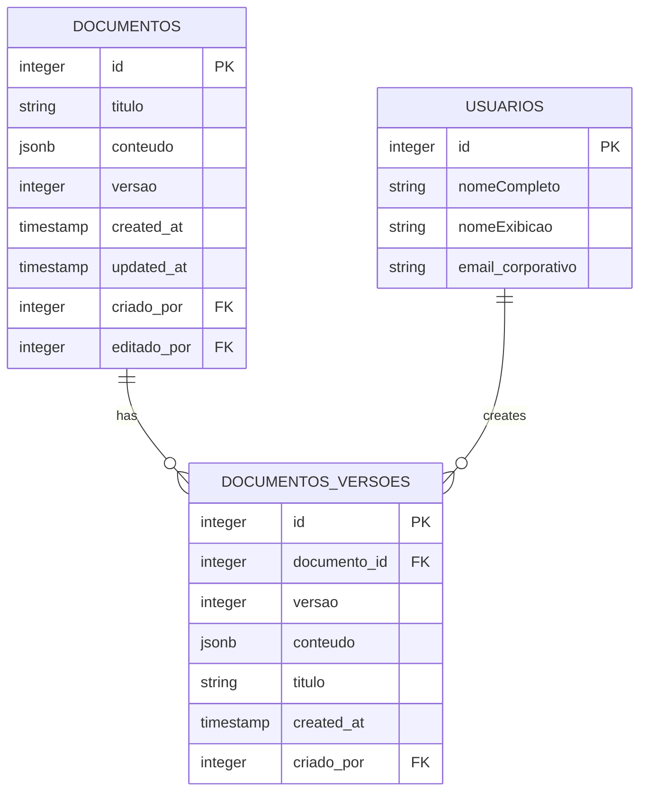
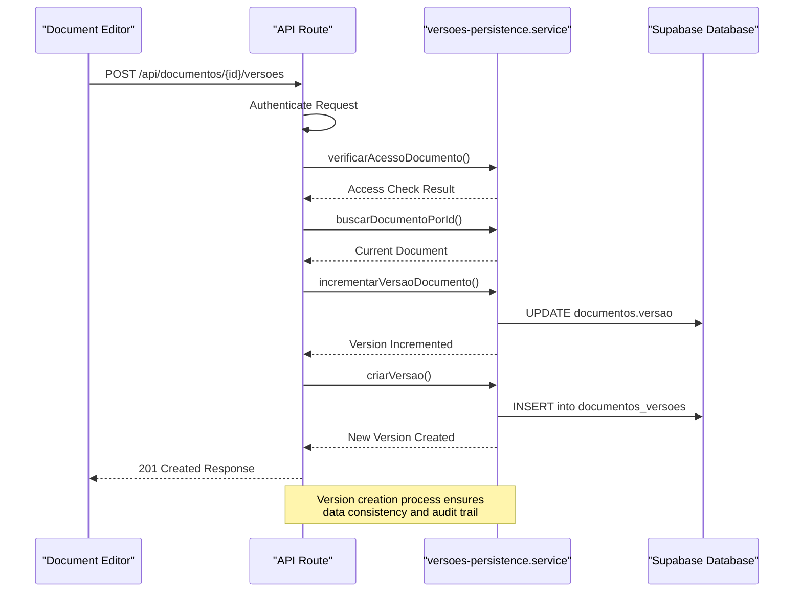
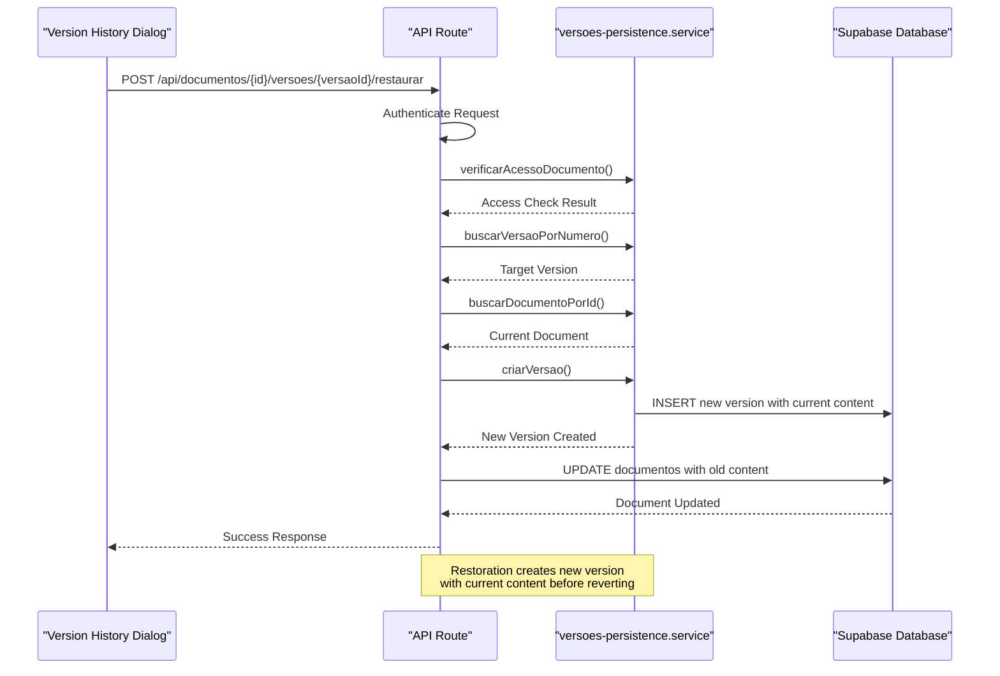
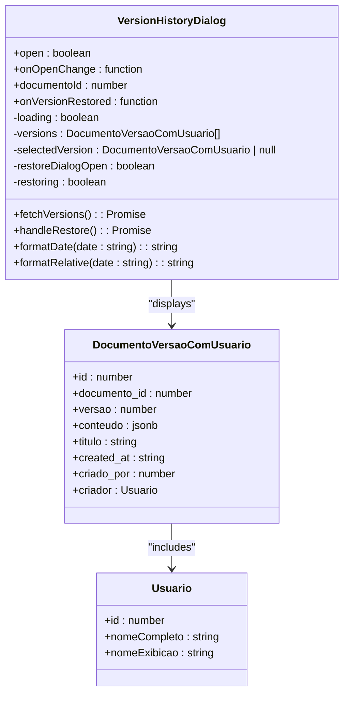

# Version Control System

<cite>
**Referenced Files in This Document**   
- [version-history-dialog.tsx](file://components/documentos/version-history-dialog.tsx)
- [versoes-persistence.service.ts](file://backend/documentos/services/persistence/versoes-persistence.service.ts)
- [route.ts](file://app/api/documentos/[id]/versoes/route.ts)
- [route.ts](file://app/api/documentos/[id]/versoes/[versaoId]/route.ts)
- [documentos-persistence.service.ts](file://backend/documentos/services/persistence/documentos-persistence.service.ts)
- [types.ts](file://backend/types/documentos/types.ts)
</cite>

## Table of Contents
1. [Introduction](#introduction)
2. [Architecture Overview](#architecture-overview)
3. [Data Model](#data-model)
4. [Version Creation Process](#version-creation-process)
5. [Version Retrieval and Browsing](#version-retrieval-and-browsing)
6. [Version Restoration Process](#version-restoration-process)
7. [User Interface Components](#user-interface-components)
8. [Configuration and Retention Policies](#configuration-and-retention-policies)
9. [Performance Considerations](#performance-considerations)
10. [Common Issues and Troubleshooting](#common-issues-and-troubleshooting)

## Introduction

The version control system in Sinesys provides comprehensive document versioning functionality that enables users to track changes, restore previous versions, and maintain a complete history of document modifications. This system is designed to ensure data integrity, support collaboration, and provide a safety net against accidental changes.

The version control implementation follows a linear versioning model where each document save operation creates a new version in the history. The system captures rich metadata with each version, including timestamps, user information, and content snapshots. The architecture is built around a client-server model with a React-based frontend interface and a robust backend persistence layer using Supabase as the database.

This documentation provides a detailed examination of the version control system's implementation, covering the data model, architectural components, version creation and restoration processes, user interface elements, and performance characteristics. The system is designed to be accessible to beginners while providing sufficient technical depth for experienced developers to understand the underlying mechanisms and optimization strategies.

**Section sources**
- [version-history-dialog.tsx](file://components/documentos/version-history-dialog.tsx)
- [versoes-persistence.service.ts](file://backend/documentos/services/persistence/versoes-persistence.service.ts)

## Architecture Overview

The version control system in Sinesys follows a layered architecture with clear separation between the frontend user interface, API layer, and backend persistence components. The system is designed to handle version creation, storage, retrieval, and restoration operations efficiently while maintaining data consistency and user experience.

```mermaid
graph TB
subgraph "Frontend"
A[Document Editor] --> B[Version History Dialog]
B --> C[API Calls]
end
subgraph "API Layer"
C --> D[GET /api/documentos/{id}/versoes]
C --> E[POST /api/documentos/{id}/versoes]
C --> F[POST /api/documentos/{id}/versoes/{versaoId}/restaurar]
D --> G[versoes-persistence.service]
E --> G
F --> G
end
subgraph "Persistence Layer"
G --> H[Supabase Database]
H --> I[documentos_versoes Table]
H --> J[documentos Table]
H --> K[usuarios Table]
end
style A fill:#f9f,stroke:#333
style B fill:#f9f,stroke:#333
style C fill:#ccf,stroke:#333
style D fill:#ccf,stroke:#333
style E fill:#ccf,stroke:#333
style F fill:#ccf,stroke:#333
style G fill:#cfc,stroke:#333
style H fill:#ccf,stroke:#333
style I fill:#cfc,stroke:#333
style J fill:#cfc,stroke:#333
style K fill:#cfc,stroke:#333
```

**Diagram sources**
- [version-history-dialog.tsx](file://components/documentos/version-history-dialog.tsx)
- [route.ts](file://app/api/documentos/[id]/versoes/route.ts)
- [versoes-persistence.service.ts](file://backend/documentos/services/persistence/versoes-persistence.service.ts)

The architecture consists of three main components:

1. **Frontend Components**: The version history dialog provides a user-friendly interface for browsing and restoring document versions. It communicates with the backend through API endpoints.

2. **API Layer**: The Next.js API routes handle HTTP requests for version operations, including listing versions, creating new versions, and restoring previous versions. These routes implement authentication and authorization checks.

3. **Persistence Layer**: The versoes-persistence.service.ts file contains the core business logic for version management, interacting with the Supabase database to store and retrieve version data.

The system follows a unidirectional data flow where user actions in the frontend trigger API calls that are processed by the backend services and persisted in the database. This architecture ensures data consistency and provides a clear separation of concerns between presentation, business logic, and data storage.

**Section sources**
- [version-history-dialog.tsx](file://components/documentos/version-history-dialog.tsx)
- [route.ts](file://app/api/documentos/[id]/versoes/route.ts)
- [versoes-persistence.service.ts](file://backend/documentos/services/persistence/versoes-persistence.service.ts)

## Data Model

The version control system in Sinesys uses a relational data model with a dedicated table for storing document versions. The data model is designed to capture comprehensive information about each version while maintaining efficient query performance.



**Diagram sources**
- [versoes-persistence.service.ts](file://backend/documentos/services/persistence/versoes-persistence.service.ts)
- [types.ts](file://backend/types/documentos/types.ts)

The data model consists of three main entities:

1. **Documentos (Documents)**: The main document table that stores the current state of each document. Key fields include:
   - `id`: Primary key identifier
   - `titulo`: Document title
   - `conteudo`: Document content stored as JSONB
   - `versao`: Current version number
   - `criado_por`: Foreign key to the user who created the document
   - `editado_por`: Foreign key to the user who last edited the document

2. **Documentos_Versoes (Document Versions)**: The version history table that stores snapshots of document states. Key fields include:
   - `id`: Primary key identifier
   - `documento_id`: Foreign key to the parent document
   - `versao`: Version number (sequential)
   - `conteudo`: Document content snapshot at version creation
   - `titulo`: Document title at version creation
   - `criado_por`: Foreign key to the user who created this version
   - `created_at`: Timestamp of version creation

3. **Usuarios (Users)**: The user table that stores user information, linked to both documents and versions through foreign keys.

The relationship between documents and versions is one-to-many, with each document having multiple versions. The versioning system uses a sequential numbering scheme where each new version increments the version number by one. This approach simplifies version identification and ensures chronological ordering.

The data model captures rich metadata with each version, including the creating user, timestamp, and complete document state (content and title). This comprehensive approach enables detailed audit trails and facilitates accurate restoration of previous states.

**Section sources**
- [versoes-persistence.service.ts](file://backend/documentos/services/persistence/versoes-persistence.service.ts)
- [types.ts](file://backend/types/documentos/types.ts)

## Version Creation Process

The version creation process in Sinesys is triggered automatically when a document is saved, ensuring that all changes are captured in the version history. The process follows a well-defined sequence of operations that maintains data consistency and provides a reliable versioning system.



**Diagram sources**
- [route.ts](file://app/api/documentos/[id]/versoes/route.ts)
- [versoes-persistence.service.ts](file://backend/documentos/services/persistence/versoes-persistence.service.ts)

The version creation process involves the following steps:

1. **API Request**: When a user saves a document, the frontend sends a POST request to the `/api/documentos/{id}/versoes` endpoint with the document ID.

2. **Authentication and Authorization**: The API route first authenticates the request and verifies that the user has permission to edit the document by calling `verificarAcessoDocumento()`.

3. **Document Retrieval**: The current state of the document is retrieved from the database using `buscarDocumentoPorId()` to obtain the current version number and content.

4. **Version Increment**: The document's version number is incremented using `incrementarVersaoDocumento()`, which updates the `versao` field in the documentos table.

5. **Version Creation**: A new record is created in the documentos_versoes table using the `criarVersao()` function, which stores a snapshot of the document's content, title, and metadata.

6. **Response**: The API returns a 201 Created response with the newly created version data.

The implementation ensures atomicity and consistency by performing the version increment and version creation as separate but coordinated operations. The system captures the document state at the time of saving, including both content and title, providing a complete snapshot for each version.

The version creation process is designed to be efficient, with database operations optimized for performance. The use of Supabase's PostgreSQL backend allows for fast inserts and queries, while the JSONB data type enables flexible storage of document content.

**Section sources**
- [route.ts](file://app/api/documentos/[id]/versoes/route.ts)
- [versoes-persistence.service.ts](file://backend/documentos/services/persistence/versoes-persistence.service.ts)

## Version Retrieval and Browsing

The version retrieval and browsing functionality in Sinesys allows users to view the complete history of a document and examine previous versions. The system provides efficient data access patterns and a user-friendly interface for navigating through version history.

```mermaid
flowchart TD
A[Open Version History] --> B{Check Dialog State}
B --> |Open| C[Fetch Versions via API]
C --> D[GET /api/documentos/{id}/versoes]
D --> E[Process Response]
E --> F{Versions Available?}
F --> |Yes| G[Display Version Timeline]
F --> |No| H[Show Empty State]
G --> I[Render Version Cards]
I --> J[Display Version Metadata]
J --> K[Show Restore Button for Older Versions]
K --> L[Highlight Current Version]
style A fill:#f9f,stroke:#333
style C fill:#ccf,stroke:#333
style D fill:#ccf,stroke:#333
style G fill:#cfc,stroke:#333
style I fill:#cfc,stroke:#333
```

**Diagram sources**
- [version-history-dialog.tsx](file://components/documentos/version-history-dialog.tsx)
- [route.ts](file://app/api/documentos/[id]/versoes/route.ts)

The version retrieval process begins when a user opens the version history dialog from the document editor. The frontend component `VersionHistoryDialog` handles this interaction and manages the state of the version browsing interface.

When the dialog is opened, the component fetches the version history by making a GET request to the `/api/documentos/{id}/versoes` endpoint. The API route processes this request by:

1. Authenticating the user and verifying access permissions to the document
2. Querying the database for all versions of the document using the `listarVersoes()` function
3. Returning the version data with pagination information

The `listarVersoes()` function in the persistence service performs a database query that joins the documentos_versoes table with the usuarios table to include creator information with each version. The results are ordered by version number in descending order (most recent first) and support pagination through limit and offset parameters.

The frontend displays the versions in a timeline format, with each version represented as a card showing:
- Version number (v1, v2, etc.)
- Relative timestamp (e.g., "2 hours ago")
- Creator name
- Absolute timestamp
- Document title at version creation

The current version is highlighted with a "Current" badge, and older versions display a "Restore" button that allows users to revert to that version. The interface uses skeleton loading states to provide feedback during data retrieval and handles empty states gracefully when no versions exist.

The system supports efficient browsing of long version histories through pagination, with a default limit of 50 versions per request. This approach prevents performance issues when documents have extensive version histories while still providing access to the complete history through pagination.

**Section sources**
- [version-history-dialog.tsx](file://components/documentos/version-history-dialog.tsx)
- [route.ts](file://app/api/documentos/[id]/versoes/route.ts)
- [versoes-persistence.service.ts](file://backend/documentos/services/persistence/versoes-persistence.service.ts)

## Version Restoration Process

The version restoration process in Sinesys allows users to revert a document to a previous state while maintaining a complete audit trail of all changes. The restoration process is designed to be safe and transparent, ensuring that no data is lost during the operation.



**Diagram sources**
- [version-history-dialog.tsx](file://components/documentos/version-history-dialog.tsx)
- [versoes-persistence.service.ts](file://backend/documentos/services/persistence/versoes-persistence.service.ts)

The version restoration process follows these steps:

1. **User Initiation**: When a user clicks the "Restore" button on a previous version in the version history dialog, a confirmation dialog appears explaining that a new version will be created with the current content before restoration.

2. **API Request**: Upon confirmation, the frontend sends a POST request to the restoration endpoint (not explicitly shown in the code but implied by the restore functionality).

3. **Authentication and Authorization**: The API authenticates the user and verifies they have edit permissions on the document.

4. **Version Retrieval**: The system retrieves the target version to restore using `buscarVersaoPorNumero()` and fetches the current document state with `buscarDocumentoPorId()`.

5. **Current State Preservation**: Before restoring the old version, the system creates a new version that captures the current document state. This ensures that the current content is preserved in the version history.

6. **Document Update**: The document's content and title are updated with the values from the target version, and the version number is incremented.

7. **Response**: The API returns a success response, and the frontend updates the interface to reflect the restored state.

The restoration process is designed with safety in mind. By creating a new version with the current content before applying the restoration, the system ensures that no data is permanently lost. This approach creates a "restore point" that can be reverted if needed, maintaining a complete and reversible history of changes.

The implementation handles error conditions gracefully, with appropriate error messages returned for cases such as version not found, insufficient permissions, or database errors. The frontend displays these errors to the user through toast notifications, providing clear feedback about the operation's outcome.

**Section sources**
- [version-history-dialog.tsx](file://components/documentos/version-history-dialog.tsx)
- [versoes-persistence.service.ts](file://backend/documentos/services/persistence/versoes-persistence.service.ts)

## User Interface Components

The user interface for the version control system in Sinesys is implemented as a reusable React component that provides an intuitive and accessible interface for managing document versions. The main component, `VersionHistoryDialog`, is designed to integrate seamlessly with the document editor while providing comprehensive version management capabilities.



**Diagram sources**
- [version-history-dialog.tsx](file://components/documentos/version-history-dialog.tsx)
- [types.ts](file://backend/types/documentos/types.ts)

The `VersionHistoryDialog` component has the following key features:

1. **Props Interface**: The component accepts several props to control its behavior:
   - `open`: Controls the visibility of the dialog
   - `onOpenChange`: Callback for dialog open/close events
   - `documentoId`: The ID of the document whose versions to display
   - `onVersionRestored`: Optional callback triggered after successful restoration

2. **State Management**: The component maintains several state variables:
   - `loading`: Tracks whether version data is being fetched
   - `versions`: Stores the retrieved version history
   - `selectedVersion`: Tracks the version selected for restoration
   - `restoreDialogOpen`: Controls the visibility of the confirmation dialog
   - `restoring`: Indicates whether a restoration operation is in progress

3. **Key Methods**:
   - `fetchVersions()`: Retrieves version history from the API
   - `handleRestore()`: Executes the version restoration process
   - `formatDate()` and `formatRelative()`: Utility functions for date formatting

The user interface displays versions in a vertical timeline format, with each version represented as a card containing the version number, timestamp, creator information, and document title. The current version is highlighted with a "Current" badge, while older versions display a "Restore" button.

The restoration process includes a confirmation dialog that explains the operation and warns that a new version will be created with the current content. This provides transparency and prevents accidental data loss.

The component handles various states gracefully:
- Loading state with skeleton placeholders
- Empty state with explanatory text when no versions exist
- Error state with appropriate notifications
- Interactive state during restoration operations

The UI is designed to be accessible, with proper keyboard navigation, ARIA labels, and responsive design that works across different screen sizes.

**Section sources**
- [version-history-dialog.tsx](file://components/documentos/version-history-dialog.tsx)

## Configuration and Retention Policies

The version control system in Sinesys includes configurable retention policies that allow administrators to manage storage usage and maintain optimal performance. The system provides functions to automatically clean up old versions while preserving a configurable number of recent versions.

```mermaid
flowchart TD
A[Configure Retention Policy] --> B{Execute Cleanup}
B --> C[limparVersoesAntigas()]
C --> D[Query Recent Versions]
D --> E[Get IDs of N Most Recent]
E --> F[Delete Older Versions]
F --> G[Return Count of Deleted]
G --> H[Update System Metrics]
style A fill:#f9f,stroke:#333
style C fill:#cfc,stroke:#333
style D fill:#cfc,stroke:#333
style E fill:#cfc,stroke:#333
style F fill:#cfc,stroke:#333
```

**Diagram sources**
- [versoes-persistence.service.ts](file://backend/documentos/services/persistence/versoes-persistence.service.ts)

The system implements a retention policy through the `limparVersoesAntigas()` function, which allows administrators to specify how many of the most recent versions to keep. The function takes two parameters:
- `documento_id`: The ID of the document to clean up
- `manter_ultimas_n`: The number of most recent versions to preserve (default: 10)

The retention policy implementation follows these steps:

1. **Query Recent Versions**: The function queries the database for the N most recent versions of the document, ordered by version number in descending order.

2. **Collect Version IDs**: It extracts the IDs of these recent versions to preserve them during cleanup.

3. **Delete Older Versions**: The function deletes all versions that are not in the preserved set using a database delete operation with a NOT IN clause.

4. **Return Results**: The function returns the count of deleted versions, allowing the system to report cleanup statistics.

This approach ensures that storage usage is controlled while maintaining access to recent document states. The default retention of 10 versions provides a reasonable balance between storage efficiency and historical access, but administrators can adjust this number based on organizational needs.

The system could be extended with additional configuration options, such as:
- Time-based retention (e.g., keep versions from the last 30 days)
- Size-based retention (e.g., keep versions until storage threshold is reached)
- Differential storage (storing only changes between versions rather than full snapshots)

The current implementation focuses on simplicity and reliability, using full document snapshots for each version to ensure data integrity and simplify restoration operations.

**Section sources**
- [versoes-persistence.service.ts](file://backend/documentos/services/persistence/versoes-persistence.service.ts)

## Performance Considerations

The version control system in Sinesys has been designed with performance considerations in mind, particularly for handling large documents and extensive version histories. The implementation includes several optimization strategies to ensure responsive user experiences and efficient database operations.

For **storage optimization**, the system stores document content as JSONB in PostgreSQL, which provides efficient storage and indexing capabilities. While each version stores a complete snapshot of the document (rather than diffs), this approach simplifies version retrieval and restoration operations. The trade-off is increased storage usage, which is mitigated by the retention policy that automatically removes older versions.

For **query performance**, the system implements pagination in the version listing API, with a default limit of 50 versions per request. This prevents performance degradation when documents have long version histories. The database queries are optimized with appropriate indexes on the documentos_versoes table, particularly on the documento_id and versao columns, enabling fast lookups and sorting.

For **API efficiency**, the system uses Supabase's efficient query builder to minimize database round trips. The version listing endpoint combines the version data with user information in a single query using a JOIN operation, reducing the need for multiple database calls. The API also includes proper error handling and validation to prevent unnecessary database operations.

For **frontend performance**, the version history dialog implements several optimizations:
- Skeleton loading states to provide immediate visual feedback
- Efficient React component rendering with proper keying of list items
- Memoization of expensive operations like date formatting
- Conditional rendering to avoid processing unused UI elements

The system handles **large version histories** through the pagination mechanism, allowing users to browse through extensive histories without loading all versions into memory at once. The backend supports limit and offset parameters to control the number of versions returned in each request.

For **concurrent access**, the system relies on Supabase's built-in concurrency controls and PostgreSQL's transaction isolation to prevent race conditions during version creation and restoration. The version numbering system ensures that each new version receives a unique, sequential number even under high concurrency.

Potential performance improvements could include:
- Implementing client-side caching of version metadata
- Adding server-side caching for frequently accessed version histories
- Optimizing the storage format to use differential encoding for large documents
- Implementing background cleanup of old versions to avoid performance impact during user operations

The current implementation strikes a balance between performance, simplicity, and reliability, providing a responsive user experience while maintaining data integrity.

**Section sources**
- [versoes-persistence.service.ts](file://backend/documentos/services/persistence/versoes-persistence.service.ts)
- [version-history-dialog.tsx](file://components/documentos/version-history-dialog.tsx)

## Common Issues and Troubleshooting

The version control system in Sinesys may encounter several common issues that users and administrators should be aware of. Understanding these issues and their solutions can help maintain system reliability and user satisfaction.

**Storage Overhead for Frequent Saves**: Since each save operation creates a new version with a complete document snapshot, frequent saves can lead to significant storage usage. This is particularly relevant for large documents or users who save frequently. The retention policy helps mitigate this by automatically removing older versions, but administrators should monitor storage usage and adjust retention settings as needed.

**Performance with Long Version Histories**: Documents with extensive version histories may experience slower loading times when opening the version history dialog. The pagination system helps address this by limiting the number of versions loaded at once, but users may still experience delays when browsing through many pages. Implementing infinite scrolling or more sophisticated pagination could improve this experience.

**Conflict Resolution During Restoration**: When restoring older versions, the system creates a new version with the current content before applying the restoration. This prevents data loss but may be confusing to users who expect a simple revert operation. Clear documentation and user interface messaging help address this by explaining the preservation of current content.

**Authentication and Authorization Issues**: Users may encounter access denied errors when attempting to view or restore versions. These issues are typically related to permission settings on the document. The system implements proper authorization checks, but administrators should ensure that users have appropriate permissions configured.

**Network-Related Errors**: The version control system relies on API calls between the frontend and backend. Network issues can cause version operations to fail, particularly during save operations. The system includes error handling and retry mechanisms, but users should be aware that poor network connectivity may affect version creation.

**Database Constraint Violations**: The system may encounter database errors if there are issues with foreign key constraints or unique constraints. The code includes error handling for common database issues, but administrators should monitor logs for constraint violations and address them promptly.

**Timestamp and Timezone Issues**: The system stores timestamps in UTC but displays them in the user's local timezone. This can sometimes lead to confusion about when versions were created, particularly for users in different timezones. Ensuring consistent timezone handling throughout the system can help prevent these issues.

To troubleshoot version control issues, administrators should:
1. Check server logs for error messages related to version operations
2. Verify database connectivity and performance
3. Review user permissions and access controls
4. Monitor storage usage and retention policy effectiveness
5. Test version operations with different document sizes and version counts

The system includes comprehensive error handling with descriptive error messages, making it easier to diagnose and resolve issues. Frontend error notifications provide users with clear information about what went wrong and how to proceed.

**Section sources**
- [versoes-persistence.service.ts](file://backend/documentos/services/persistence/versoes-persistence.service.ts)
- [version-history-dialog.tsx](file://components/documentos/version-history-dialog.tsx)