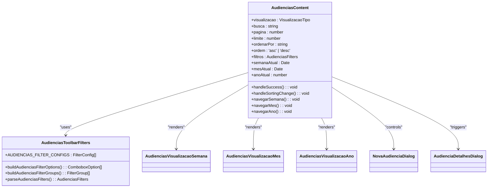
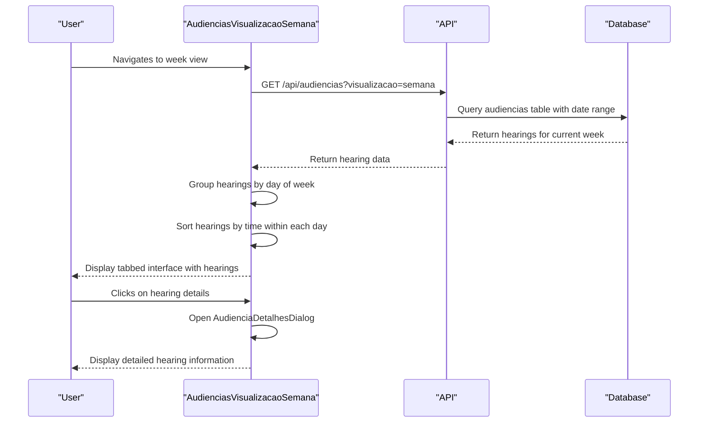
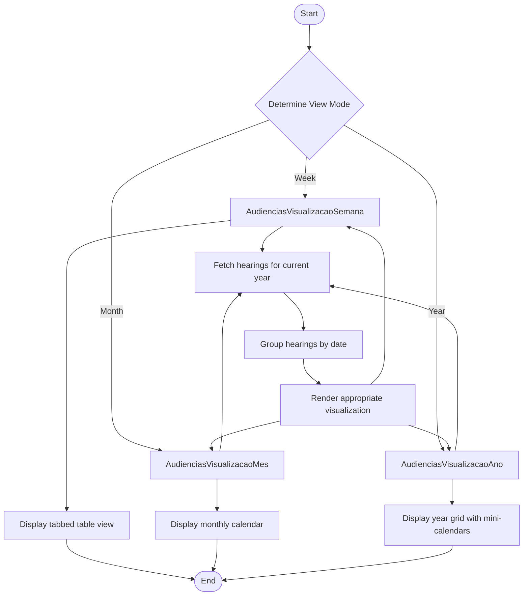
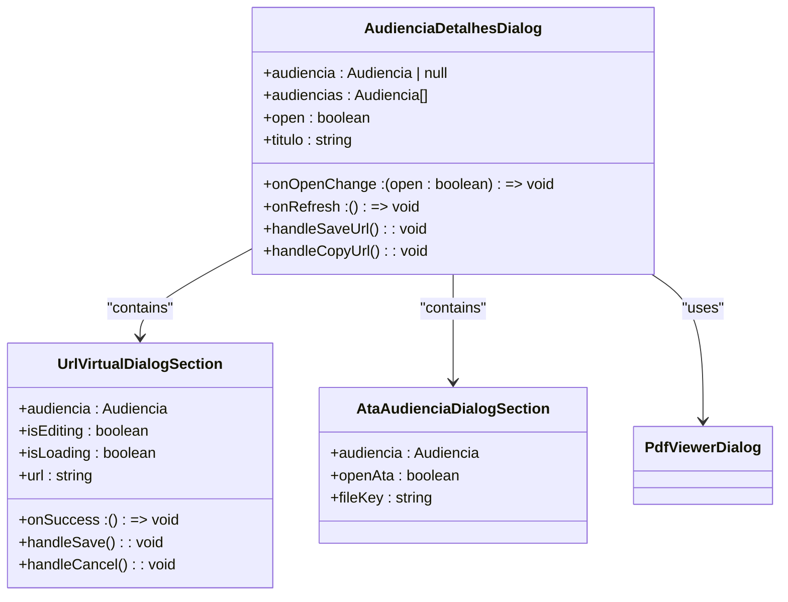
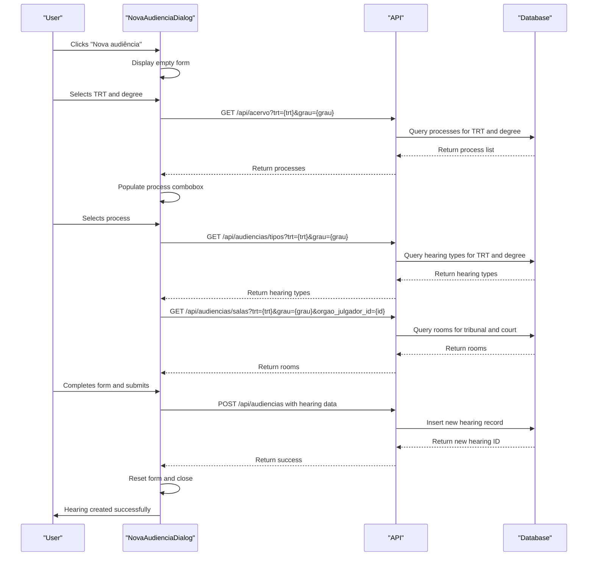
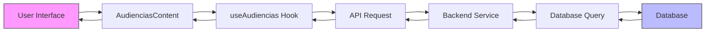
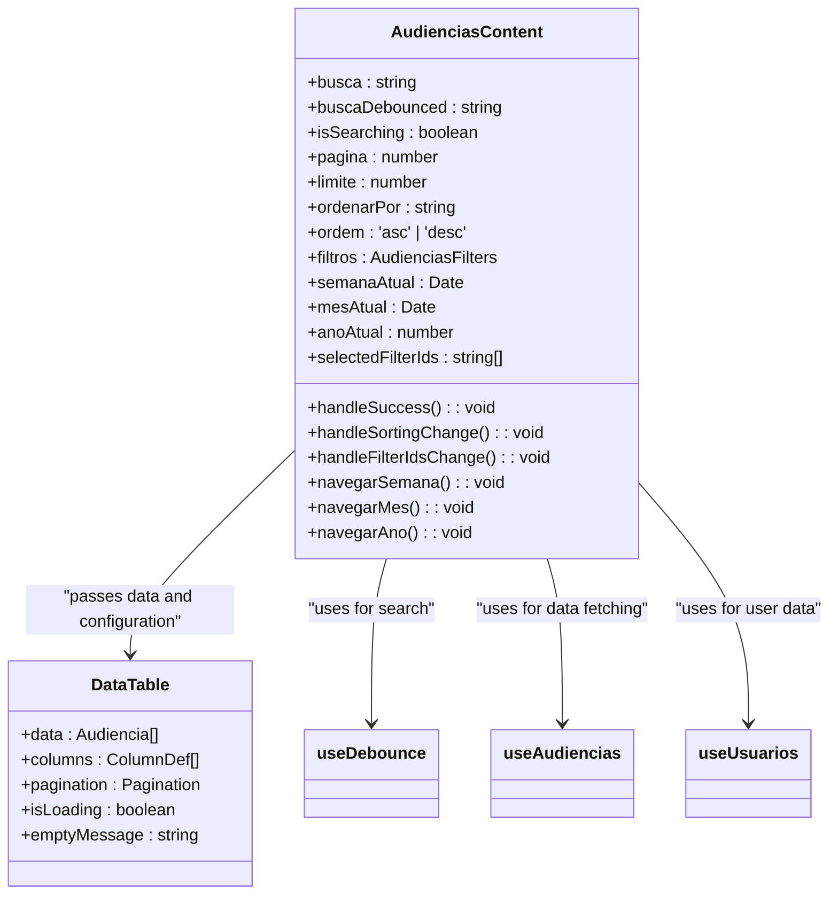

# Hearing Management Components

<cite>
**Referenced Files in This Document**   
- [audiencias-content.tsx](file://app/(dashboard)/audiencias/components/audiencias-content.tsx)
- [audiencias-toolbar-filters.tsx](file://app/(dashboard)/audiencias/components/audiencias-toolbar-filters.tsx)
- [audiencia-detalhes-dialog.tsx](file://app/(dashboard)/audiencias/components/audiencia-detalhes-dialog.tsx)
- [nova-audiencia-dialog.tsx](file://app/(dashboard)/audiencias/components/nova-audiencia-dialog.tsx)
- [audiencias-visualizacao-ano.tsx](file://app/(dashboard)/audiencias/components/audiencias-visualizacao-ano.tsx)
- [audiencias-visualizacao-mes.tsx](file://app/(dashboard)/audiencias/components/audiencias-visualizacao-mes.tsx)
- [audiencias-visualizacao-semana.tsx](file://app/(dashboard)/audiencias/components/audiencias-visualizacao-semana.tsx)
- [page.tsx](file://app/(dashboard)/audiencias/page.tsx)
- [ano/page.tsx](file://app/(dashboard)/audiencias/ano/page.tsx)
- [mes/page.tsx](file://app/(dashboard)/audiencias/mes/page.tsx)
- [semana/page.tsx](file://app/(dashboard)/audiencias/semana/page.tsx)
- [listar-audiencias.service.ts](file://backend/audiencias/services/listar-audiencias.service.ts)
- [criar-audiencia.service.ts](file://backend/audiencias/services/criar-audiencia.service.ts)
- [atualizar-url-virtual.service.ts](file://backend/audiencias/services/atualizar-url-virtual.service.ts)
- [atribuir-responsavel.service.ts](file://backend/audiencias/services/atribuir-responsavel.service.ts)
</cite>

## Table of Contents
1. [Introduction](#introduction)
2. [Core Components](#core-components)
3. [Calendar Visualization Components](#calendar-visualization-components)
4. [Dialog Components](#dialog-components)
5. [Data Flow and Integration](#data-flow-and-integration)
6. [User Interaction and State Management](#user-interaction-and-state-management)
7. [Error Handling and Validation](#error-handling-and-validation)
8. [Backend Services](#backend-services)
9. [Common Issues and Considerations](#common-issues-and-considerations)

## Introduction
The hearing management system in Sinesys provides a comprehensive interface for managing judicial hearings across multiple calendar views. The system integrates with the PJE-TRT capture system to display scheduled hearings while allowing users to create, edit, and manage hearing details including virtual hearing URLs. The interface offers three distinct calendar views (year, month, and week) that provide different levels of granularity for viewing hearings. This documentation details the implementation of these components, their integration points, and how they handle user interactions and data flow from the backend services.

**Section sources**
- [page.tsx](file://app/(dashboard)/audiencias/page.tsx)

## Core Components

The hearing management system is built around several core components that work together to provide a seamless user experience. The main container component, AudienciasContent, orchestrates the different visualization modes and provides shared functionality across all views. This component handles data fetching, filtering, sorting, and pagination while coordinating with the various visualization components based on the current view mode (week, month, or year).

The AudienciasToolbarFilters component provides a sophisticated filtering system that allows users to filter hearings by tribunal (TRT), degree, status, responsible party, modality, and other characteristics. The filtering system is implemented with a two-tier approach: a combobox for quick filtering and grouped filter buttons for more structured filtering. This design allows users to quickly narrow down the list of hearings based on their specific needs.



**Diagram sources**
- [audiencias-content.tsx](file://app/(dashboard)/audiencias/components/audiencias-content.tsx)
- [audiencias-toolbar-filters.tsx](file://app/(dashboard)/audiencias/components/audiencias-toolbar-filters.tsx)

**Section sources**
- [audiencias-content.tsx](file://app/(dashboard)/audiencias/components/audiencias-content.tsx)
- [audiencias-toolbar-filters.tsx](file://app/(dashboard)/audiencias/components/audiencias-toolbar-filters.tsx)

## Calendar Visualization Components

The hearing management system provides three distinct calendar views to accommodate different user needs and preferences. Each view is implemented as a separate component that renders hearings in a format appropriate for its time scale.

The week view (AudienciasVisualizacaoSemana) displays hearings in a tabbed interface with one tab for each weekday (Monday through Friday). Each tab contains a data table that lists hearings for that day, sorted by time. The table includes columns for time, process information, hearing details, observations, and responsible party. The week view is the default view when users navigate to the hearings section.



**Diagram sources**
- [audiencias-visualizacao-semana.tsx](file://app/(dashboard)/audiencias/components/audiencias-visualizacao-semana.tsx)

The month view (AudienciasVisualizacaoMes) displays a calendar grid for the current month, with each day cell indicating whether hearings are scheduled. Days with hearings are highlighted, and clicking on a day opens a dialog showing all hearings for that day. This view provides a broader perspective of the hearing schedule across the month.

The year view (AudienciasVisualizacaoAno) displays a grid of 12 mini-calendars, one for each month of the year. Similar to the month view, days with hearings are highlighted, and clicking on a day opens a dialog with the hearings for that day. This view provides the broadest perspective, allowing users to quickly identify months with high hearing volumes.



**Diagram sources**
- [audiencias-visualizacao-semana.tsx](file://app/(dashboard)/audiencias/components/audiencias-visualizacao-semana.tsx)
- [audiencias-visualizacao-mes.tsx](file://app/(dashboard)/audiencias/components/audiencias-visualizacao-mes.tsx)
- [audiencias-visualizacao-ano.tsx](file://app/(dashboard)/audiencias/components/audiencias-visualizacao-ano.tsx)

**Section sources**
- [audiencias-visualizacao-semana.tsx](file://app/(dashboard)/audiencias/components/audiencias-visualizacao-semana.tsx)
- [audiencias-visualizacao-mes.tsx](file://app/(dashboard)/audiencias/components/audiencias-visualizacao-mes.tsx)
- [audiencias-visualizacao-ano.tsx](file://app/(dashboard)/audiencias/components/audiencias-visualizacao-ano.tsx)

## Dialog Components

The hearing management system includes several dialog components that allow users to view and edit hearing details. The AudienciaDetalhesDialog component displays detailed information about one or more hearings, providing a comprehensive view of hearing attributes including process information, hearing type, modality, location, and status. This dialog is used in both the month and year views when users click on a day with scheduled hearings.

The dialog supports editing of virtual hearing URLs, allowing users to add, modify, or remove the URL for virtual hearings. When a virtual hearing URL is present, the dialog displays the appropriate platform logo (Zoom, Google Meet, or Webex) and provides a button to copy the URL to the clipboard. For completed hearings (status "F"), the dialog also provides access to the hearing transcript (ata) through the PdfViewerDialog component.



**Diagram sources**
- [audiencia-detalhes-dialog.tsx](file://app/(dashboard)/audiencias/components/audiencia-detalhes-dialog.tsx)

The NovaAudienciaDialog component allows users to create new hearings manually. This is particularly useful for hearings that were not captured automatically from the PJE-TRT system. The dialog guides users through a multi-step process of selecting the tribunal (TRT), degree, process, and other hearing details. The form dynamically loads related data based on user selections, such as loading available processes when a TRT and degree are selected, or loading available hearing types and rooms based on the selected process.



**Diagram sources**
- [nova-audiencia-dialog.tsx](file://app/(dashboard)/audiencias/components/nova-audiencia-dialog.tsx)

**Section sources**
- [audiencia-detalhes-dialog.tsx](file://app/(dashboard)/audiencias/components/audiencia-detalhes-dialog.tsx)
- [nova-audiencia-dialog.tsx](file://app/(dashboard)/audiencias/components/nova-audiencia-dialog.tsx)

## Data Flow and Integration

The hearing management components integrate with the PJE-TRT capture system through a well-defined API layer that handles data retrieval and manipulation. The primary data flow begins with the AudienciasContent component, which uses the useAudiencias hook to fetch hearing data from the API based on the current view, filters, and pagination settings.

When a user navigates to the hearings section, the system defaults to the week view as specified in the root page.tsx file. The AudienciasContent component then initializes the current week, month, and year state, which is used to determine the date range for data retrieval. For the week view, the date range is set to the current week (Monday to Friday); for the month view, it's set to the current month; and for the year view, it's set to the current year.

The data retrieval process involves several steps:
1. The frontend constructs a request with parameters including pagination, sorting, filtering, and date range
2. The API routes receive the request and validate the parameters
3. The backend services query the database using the provided parameters
4. The results are returned to the frontend in a paginated format
5. The frontend components process and display the data according to the current view



**Diagram sources**
- [audiencias-content.tsx](file://app/(dashboard)/audiencias/components/audiencias-content.tsx)
- [listar-audiencias.service.ts](file://backend/audiencias/services/listar-audiencias.service.ts)

The integration with the PJE-TRT capture system is primarily one-way for data display: the system captures hearing data from PJE-TRT and displays it in the interface. However, users can also create new hearings manually through the NovaAudienciaDialog, which inserts records directly into the database. These manually created hearings are distinguished from captured hearings by having an id_pje value of 0.

**Section sources**
- [audiencias-content.tsx](file://app/(dashboard)/audiencias/components/audiencias-content.tsx)
- [listar-audiencias.service.ts](file://backend/audiencias/services/listar-audiencias.service.ts)

## User Interaction and State Management

The hearing management components implement a sophisticated state management system that handles user interactions across different views and components. The AudienciasContent component serves as the central state manager, maintaining state for the current view, search terms, pagination, sorting, filters, and date navigation.

User interactions are handled through a combination of React state hooks and callback functions. For example, when a user navigates to the previous or next week, month, or year, the corresponding navigation function updates the state, which triggers a re-fetch of data for the new date range. Similarly, when a user applies filters or changes sorting, the state is updated, causing the data to be re-fetched with the new parameters.

The system uses debounced search to improve performance, waiting 500ms after the user stops typing before initiating a search request. This prevents excessive API calls during rapid typing. The debounced search state is managed using the useDebounce hook, which is applied to the search input field.



**Diagram sources**
- [audiencias-content.tsx](file://app/(dashboard)/audiencias/components/audiencias-content.tsx)

The system also implements optimistic updates for certain actions, such as marking a hearing as completed or assigning a responsible party. When a user performs one of these actions, the UI immediately reflects the change, and a request is sent to the backend to update the database. If the request fails, the UI is updated to reflect the error, and the change is reverted.

**Section sources**
- [audiencias-content.tsx](file://app/(dashboard)/audiencias/components/audiencias-content.tsx)

## Error Handling and Validation

The hearing management components implement comprehensive error handling and validation at both the frontend and backend levels. On the frontend, form validation is performed in the NovaAudienciaDialog to ensure that required fields are filled before submitting a new hearing. The validation includes checking for required fields such as TRT, degree, process, start and end dates/times, and ensuring that the end time is after the start time.

When API requests fail, the components display user-friendly error messages. For example, if a request to create a new hearing fails, the NovaAudienciaDialog displays the error message in a red banner at the top of the dialog. Similarly, if a request to update a hearing's virtual URL fails, the UrlVirtualDialogSection displays an error message and reverts to the previous state.

On the backend, the services implement thorough validation to ensure data integrity. The criarAudiencia service validates that the referenced process exists, that the hearing type (if provided) exists, and that the room (if provided) exists. The atualizarUrlVirtualAudiencia service validates that the provided URL is valid by attempting to parse it as a URL object. The atribuirResponsavelAudiencia service validates that the hearing exists, that the responsible party (if provided) exists and is active, and that the user performing the action exists and is active.

```mermaid
sequenceDiagram
participant User as "User"
participant Frontend as "Frontend"
participant Backend as "Backend"
participant Database as "Database"
User->>Frontend : Submit new hearing form
Frontend->>Frontend : Validate required fields
alt Validation fails
Frontend-->>User : Display validation errors
stop
end
Frontend->>Backend : POST /api/audiencias
Backend->>Backend : Validate process exists
alt Process not found
Backend-->>Frontend : Return error
Frontend-->>User : Display "Processo não encontrado"
stop
end
Backend->>Backend : Validate hearing type (if provided)
alt Hearing type not found
Backend-->>Frontend : Return error
Frontend-->>User : Display "Tipo de audiência não encontrado"
stop
end
Backend->>Backend : Validate room (if provided)
alt Room not found
Backend-->>Frontend : Return error
Frontend-->>User : Display "Sala de audiência não encontrada"
stop
end
Backend->>Database : Insert hearing record
alt Insert fails
Database-->>Backend : Return error
Backend-->>Frontend : Return error
Frontend-->>User : Display generic error
stop
end
Database-->>Backend : Return success
Backend-->>Frontend : Return success
Frontend->>Frontend : Refresh data
Frontend-->>User : Display success message
```

**Diagram sources**
- [criar-audiencia.service.ts](file://backend/audiencias/services/criar-audiencia.service.ts)
- [atualizar-url-virtual.service.ts](file://backend/audiencias/services/atualizar-url-virtual.service.ts)
- [atribuir-responsavel.service.ts](file://backend/audiencias/services/atribuir-responsavel.service.ts)

**Section sources**
- [nova-audiencia-dialog.tsx](file://app/(dashboard)/audiencias/components/nova-audiencia-dialog.tsx)
- [criar-audiencia.service.ts](file://backend/audiencias/services/criar-audiencia.service.ts)
- [atualizar-url-virtual.service.ts](file://backend/audiencias/services/atualizar-url-virtual.service.ts)
- [atribuir-responsavel.service.ts](file://backend/audiencias/services/atribuir-responsavel.service.ts)

## Backend Services

The hearing management system relies on several backend services to handle data operations. The listarAudiencias service is responsible for retrieving hearings from the database with support for filtering, pagination, and sorting. This service acts as a wrapper around the database query, applying the provided parameters to construct the appropriate SQL query.

The criarAudiencia service handles the creation of new hearings, either from the PJE-TRT capture system or manually through the NovaAudienciaDialog. When creating a manual hearing, the service first validates the referenced process, then optionally validates the hearing type and room, and finally inserts the hearing record into the database. Manual hearings are distinguished from captured hearings by having an id_pje value of 0.

The atualizarUrlVirtualAudiencia service handles updates to the virtual hearing URL. This service validates the URL format and updates the hearing record in the database. After a successful update, it invalidates the cache to ensure that all clients see the updated URL.

The atribuirResponsavelAudiencia service handles the assignment of a responsible party to a hearing. This service performs validation to ensure that the hearing, responsible party, and executing user all exist and are active. It uses a stored procedure (RPC) to update the hearing record, which also handles audit logging.

```mermaid
classDiagram
class ListarAudienciasService {
+obterAudiencias(params) : Promise~ListarAudienciasResult~
+params : ListarAudienciasParams
}
class CriarAudienciaService {
+criarAudiencia(params) : Promise~number~
+params : CriarAudienciaParams
}
class AtualizarUrlVirtualService {
+atualizarUrlVirtualAudiencia(params) : Promise~{ id : number; url_audiencia_virtual : string | null }~
+params : AtualizarUrlVirtualParams
}
class AtribuirResponsavelService {
+atribuirResponsavelAudiencia(params) : Promise~AtribuirResponsavelAudienciaResult~
+params : AtribuirResponsavelAudienciaParams
}
ListarAudienciasService --> Database : "queries"
CriarAudienciaService --> Database : "inserts"
AtualizarUrlVirtualService --> Database : "updates"
AtribuirResponsavelService --> Database : "updates via RPC"
```

**Diagram sources**
- [listar-audiencias.service.ts](file://backend/audiencias/services/listar-audiencias.service.ts)
- [criar-audiencia.service.ts](file://backend/audiencias/services/criar-audiencia.service.ts)
- [atualizar-url-virtual.service.ts](file://backend/audiencias/services/atualizar-url-virtual.service.ts)
- [atribuir-responsavel.service.ts](file://backend/audiencias/services/atribuir-responsavel.service.ts)

**Section sources**
- [listar-audiencias.service.ts](file://backend/audiencias/services/listar-audiencias.service.ts)
- [criar-audiencia.service.ts](file://backend/audiencias/services/criar-audiencia.service.ts)
- [atualizar-url-virtual.service.ts](file://backend/audiencias/services/atualizar-url-virtual.service.ts)
- [atribuir-responsavel.service.ts](file://backend/audiencias/services/atribuir-responsavel.service.ts)

## Common Issues and Considerations

The hearing management system addresses several common issues related to calendar synchronization and timezone handling. Since the PJE-TRT system operates in Brasília time (BRT/BRST), all hearing times are stored in UTC to avoid timezone conversion issues. The frontend components convert these UTC times to the user's local timezone for display, ensuring that hearings appear at the correct local time regardless of the user's location.

One common issue is the handling of virtual hearing URLs from different platforms (Zoom, Google Meet, Webex). The system detects the platform from the URL and displays the appropriate logo, providing visual confirmation of the platform being used. This helps users quickly identify which platform to use for virtual hearings.

Another consideration is the handling of hybrid hearings, which have both a virtual URL and a physical address. The system displays both pieces of information in the hearing details, allowing users to access both the virtual meeting and the physical location as needed.

The system also addresses performance considerations for large numbers of hearings. In the week and month views, hearings are grouped by day, which reduces the cognitive load on users. In the year view, the system displays only a visual indication of days with hearings, avoiding the need to display potentially thousands of hearings at once.

For users managing hearings across multiple tribunals and degrees, the filtering system provides a way to quickly narrow down the list to relevant hearings. The system supports filtering by TRT, degree, status, responsible party, modality, and other characteristics, allowing users to focus on the hearings that require their attention.

**Section sources**
- [audiencias-content.tsx](file://app/(dashboard)/audiencias/components/audiencias-content.tsx)
- [audiencias-visualizacao-semana.tsx](file://app/(dashboard)/audiencias/components/audiencias-visualizacao-semana.tsx)
- [audiencias-visualizacao-mes.tsx](file://app/(dashboard)/audiencias/components/audiencias-visualizacao-mes.tsx)
- [audiencias-visualizacao-ano.tsx](file://app/(dashboard)/audiencias/components/audiencias-visualizacao-ano.tsx)