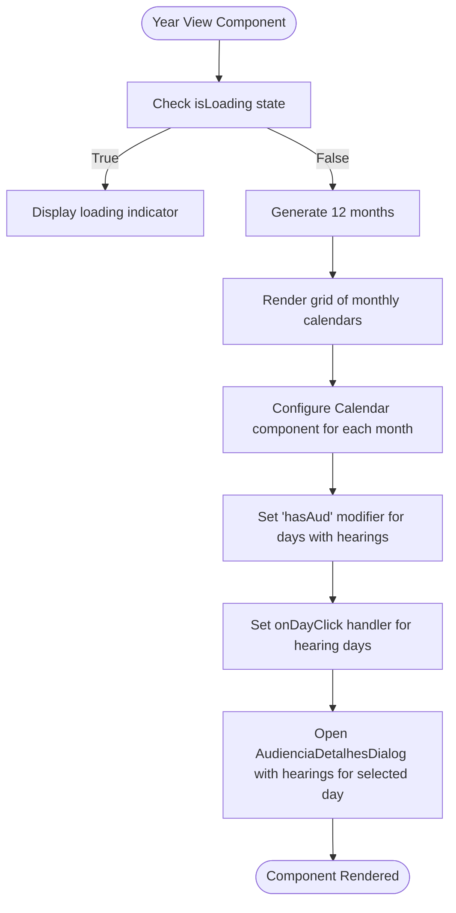
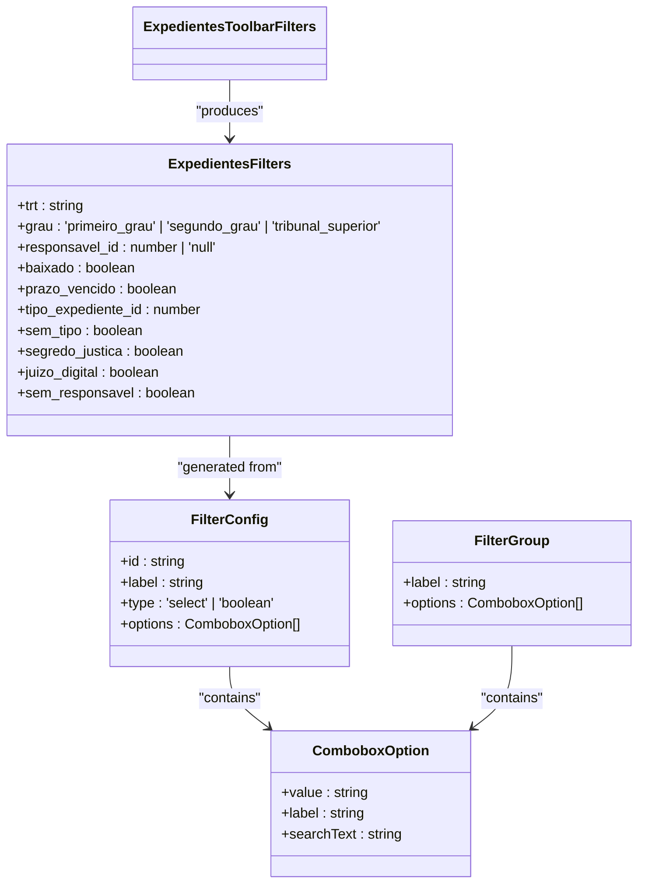

# Process Management Components

<cite>
**Referenced Files in This Document**   
- [timeline-container.tsx](file://app/(dashboard)/processos/components/timeline-container.tsx)
- [audiencias-visualizacao-ano.tsx](file://app/(dashboard)/audiencias/components/audiencias-visualizacao-ano.tsx)
- [expedientes-toolbar-filters.tsx](file://app/(dashboard)/expedientes/components/expedientes-toolbar-filters.tsx)
- [expedientes-visualizacao-ano.tsx](file://app/(dashboard)/expedientes/components/expedientes-visualizacao-ano.tsx)
- [audiencias-visualizacao-mes.tsx](file://app/(dashboard)/audiencias/components/audiencias-visualizacao-mes.tsx)
- [audiencias-visualizacao-semana.tsx](file://app/(dashboard)/audiencias/components/audiencias-visualizacao-semana.tsx)
- [types.ts](file://backend/types/audiencias/types.ts)
- [types.ts](file://backend/types/expedientes/types.ts)
</cite>

## Table of Contents
1. [Introduction](#introduction)
2. [Process Timeline Component](#process-timeline-component)
3. [Hearing Calendar Components](#hearing-calendar-components)
4. [Expediente Management Components](#expediente-management-components)
5. [Domain Models and Data Structures](#domain-models-and-data-structures)
6. [Integration with PJE Data Capture](#integration-with-pje-data-capture)
7. [Common Issues and Solutions](#common-issues-and-solutions)

## Introduction
The Sinesys process management system provides comprehensive tools for tracking and managing legal processes, hearings, and expedientes. This documentation details the key components that enable visualization and management of process timelines, hearing calendars, and expediente workflows. The system integrates with the PJE (Processo Judicial Eletrônico) data capture system to provide real-time updates and synchronization of legal process information. The components are designed to support multiple calendar views (year, month, week) and provide filtering, sorting, and interaction capabilities for efficient case management.

## Process Timeline Component

The TimelineContainer component serves as the primary visualization for process timelines, rendering a chronological list of process events in descending order (most recent first). It accepts an array of enriched timeline items and handles loading states, empty states, and error conditions. The component displays metadata about the timeline including the total number of items, document count, and movement count. Each timeline item is rendered using the TimelineItem component, which processes the enriched data and presents it in a user-friendly format. The timeline includes a visual indicator at the end to signify the beginning of the process.

**Section sources**
- [timeline-container.tsx](file://app/(dashboard)/processos/components/timeline-container.tsx#L1-L88)

## Hearing Calendar Components

### Year View Implementation
The AudienciasVisualizacaoAno component implements the year view for hearing calendars, displaying 12 monthly calendars in a grid layout. Each month is rendered as a separate calendar component, with days containing hearings highlighted with a primary color background. When a user clicks on a day with hearings, a dialog displays all hearings scheduled for that day. The component uses React's useCallback hook to optimize performance by memoizing the functions that check for and retrieve hearings for a specific date.

**Diagram sources**
- [audiencias-visualizacao-ano.tsx](file://app/(dashboard)/audiencias/components/audiencias-visualizacao-ano.tsx#L1-L71)

### Month View Implementation
The AudienciasVisualizacaoMes component provides a detailed monthly view of hearings, displaying a single calendar for the current month. It groups hearings by date using a Map data structure for efficient lookup and retrieval. The component highlights days with hearings and opens a dialog with the day's hearings when clicked. This view provides more space for each day compared to the year view, allowing for better readability and interaction.

**Section sources**
- [audiencias-visualizacao-mes.tsx](file://app/(dashboard)/audiencias/components/audiencias-visualizacao-mes.tsx#L1-L70)

### Week View Implementation
The AudienciasVisualizacaoSemana component implements a tabbed weekly view with separate tabs for each weekday (Monday through Friday). Each tab displays a data table of hearings for that day, sorted chronologically. The component includes advanced features such as:
- Responsive tabs with badge indicators showing the number of hearings per day
- Detailed hearing information including process details, virtual hearing links, and responsible parties
- Action buttons for marking hearings as completed, creating expedientes, and creating obligations
- Integration with editing dialogs for updating hearing details and observations

The week view uses React Table for data presentation and includes specialized cell renderers for different data types (hora, detalhes, observacoes, responsavel).

**Section sources**
- [audiencias-visualizacao-semana.tsx](file://app/(dashboard)/audiencias/components/audiencias-visualizacao-semana.tsx#L1-L808)

## Expediente Management Components

### Toolbar Filters
The ExpedientesToolbarFilters component provides a comprehensive filtering system for expedientes with multiple filter categories including Tribunal, Grau, Status, Responsible, Type, and Characteristics. The component defines filter configurations and builds filter options dynamically based on available data (usuarios and tiposExpedientes). It supports both select-type filters with predefined options and boolean filters for binary conditions.

The filter system uses a two-level approach:
1. EXPEDIENTES_FILTER_CONFIGS: Defines the base filter configurations
2. buildExpedientesFilterOptions: Generates combobox options from configurations
3. buildExpedientesFilterGroups: Organizes filters into logical groups for the UI
4. parseExpedientesFilters: Converts selected filter strings back into a structured filter object

**Diagram sources**
- [expedientes-toolbar-filters.tsx](file://app/(dashboard)/expedientes/components/expedientes-toolbar-filters.tsx#L1-L324)

### Year View for Expedientes
The ExpedientesVisualizacaoAno component implements a year view for expedientes, similar to the hearing calendar but with additional features for handling expedientes with no deadline or overdue deadlines. These special cases are "pinned" to appear at the top of the list when viewing a specific day. The component tracks expedientes by their legal deadline date and displays them in monthly calendars. It also highlights the current day and supports clicking on days with expedientes to view details in a dialog.

**Section sources**
- [expedientes-visualizacao-ano.tsx](file://app/(dashboard)/expedientes/components/expedientes-visualizacao-ano.tsx#L1-L198)

## Domain Models and Data Structures

### Audiencia Model
The Audiencia type represents a court hearing with properties including:
- Basic information: id, processo_id, numero_processo, classe_judicial
- Scheduling: data_inicio, data_fim, status, modalidade
- Party information: polo_ativo_nome, polo_passivo_nome
- Technical details: url_audiencia_virtual, url_ata_audiencia
- Organizational: trt, grau, orgao_julgador_descricao
- Metadata: created_at, updated_at

The model also includes infrastructure-specific data in the AudienciaInfra interface, which contains virtual hearing URLs, physical addresses, and PJE integration details.

### Expediente Model
The PendenteManifestacao interface represents an expediente (pending matter) with comprehensive properties:
- Identification: id, id_pje, processo_id, numero_processo
- Jurisdictional: trt, grau, descricao_orgao_julgador
- Case details: classe_judicial, segredo_justica, juizo_digital
- Party information: nome_parte_autora, nome_parte_re
- Timeline: data_autuacao, data_arquivamento, data_ciencia_parte
- Deadlines: data_prazo_legal_parte, prazo_vencido
- Management: responsavel_id, tipo_expediente_id, baixado_em
- Document references: arquivo_url, arquivo_key, arquivo_bucket
- Metadata: created_at, updated_at

The model supports various filtering and sorting options through the ListarPendentesParams interface, which includes parameters for pagination, text search, specific filters, date ranges, and ordering.

**Section sources**
- [types.ts](file://backend/types/audiencias/types.ts#L1-L175)
- [types.ts](file://backend/types/expedientes/types.ts#L1-L179)

## Integration with PJE Data Capture

The process management components integrate with the PJE data capture system through several mechanisms:

1. **Data Synchronization**: The system captures hearing and expediente data from PJE through scheduled synchronization processes that update the local database with the latest information from the electronic judicial system.

2. **Real-time Updates**: Components use React's useEffect and useMemo hooks to respond to data changes and re-render when new information is available from the PJE integration.

3. **Document Access**: The system stores references to PJE documents (such as hearing transcripts) in the database and provides access through pre-signed URLs, allowing users to view documents without leaving the Sinesys application.

4. **Status Synchronization**: When users mark hearings as completed in Sinesys, the system updates the status in both the local database and the PJE system through API calls, ensuring consistency across platforms.

5. **Bidirectional Data Flow**: The integration supports both reading data from PJE (for display in calendars and timelines) and writing data to PJE (for status updates and document submissions).

## Common Issues and Solutions

### Handling Large Datasets
When dealing with large numbers of hearings or expedientes, the system implements several optimization strategies:
- **Virtualization**: Not explicitly implemented in the current code but recommended for future enhancement
- **Pagination**: The ListarPendentesParams interface includes pagina and limite parameters for server-side pagination
- **Memoization**: Extensive use of React.useMemo and React.useCallback to prevent unnecessary re-renders
- **Efficient Data Structures**: Use of Map objects for O(1) lookups when grouping items by date

### Real-time Updates
To ensure users see the most current information:
- **Polling**: Implement periodic refresh of data (not shown in current code but recommended)
- **WebSockets**: Future enhancement for real-time push notifications of changes
- **Optimistic Updates**: When users modify data (e.g., mark hearing as completed), the UI updates immediately while the backend request processes

### Performance Optimization
Key performance considerations in the current implementation:
- **Client-side Sorting**: The TimelineContainer sorts items client-side using useMemo to avoid re-sorting on every render
- **Conditional Rendering**: Components render loading states, empty states, and error states appropriately
- **Event Delegation**: Calendar components use single event handlers for day clicks rather than individual handlers for each day

### Error Handling
The system includes error handling in several areas:
- **Network Requests**: API calls include error handling with try-catch blocks and error logging
- **Data Validation**: Functions include checks for null/undefined values before processing
- **User Feedback**: Loading states and error messages provide feedback during asynchronous operations

**Section sources**
- [timeline-container.tsx](file://app/(dashboard)/processos/components/timeline-container.tsx#L1-L88)
- [audiencias-visualizacao-semana.tsx](file://app/(dashboard)/audiencias/components/audiencias-visualizacao-semana.tsx#L1-L808)