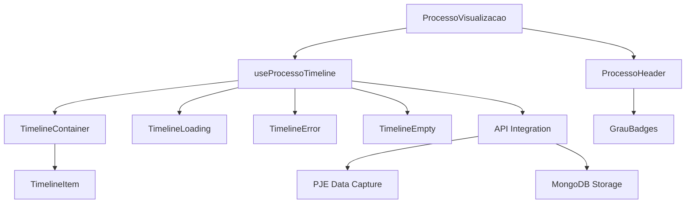
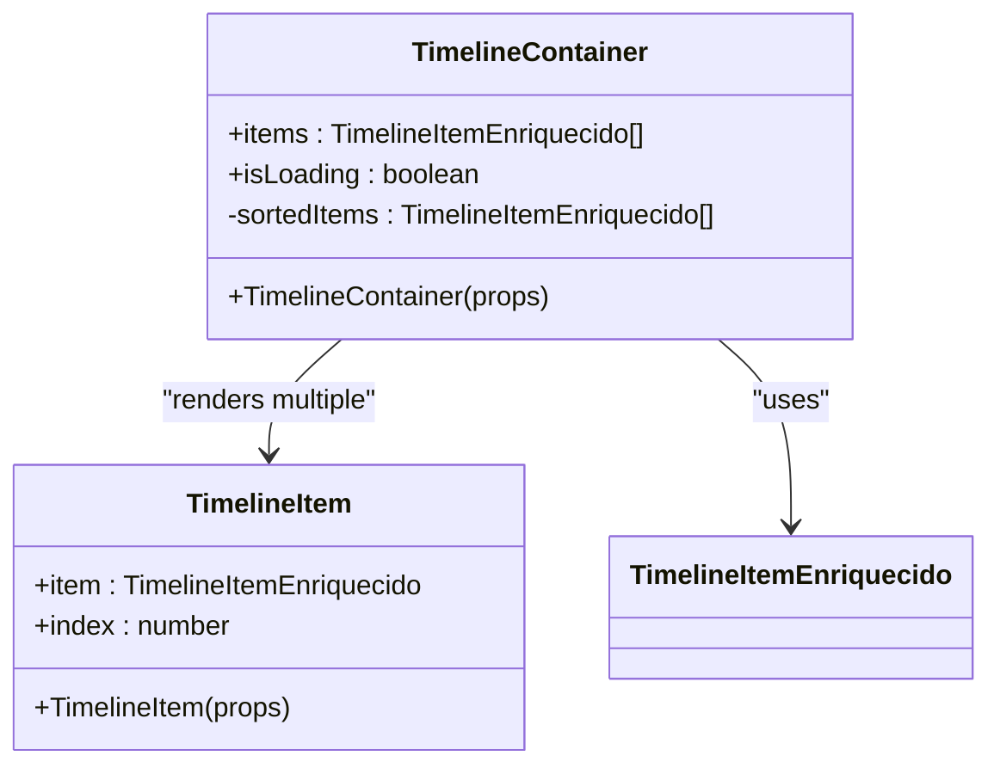
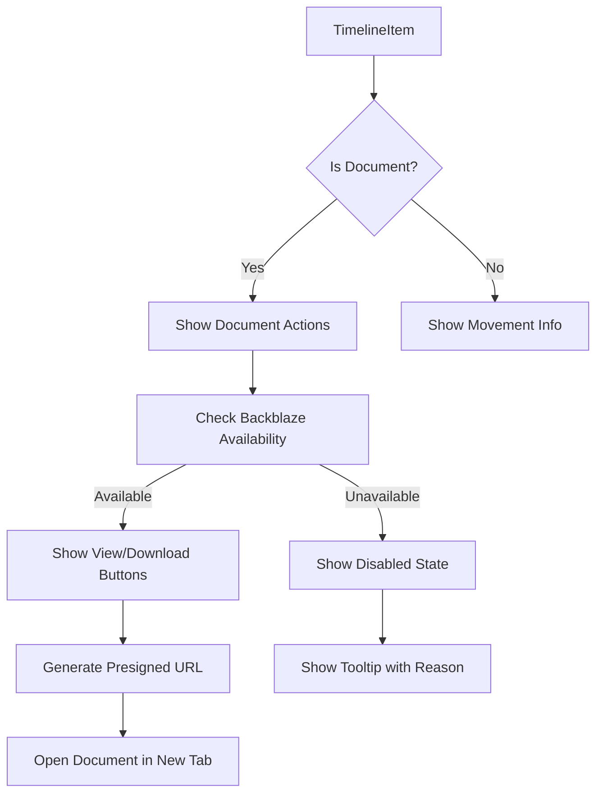
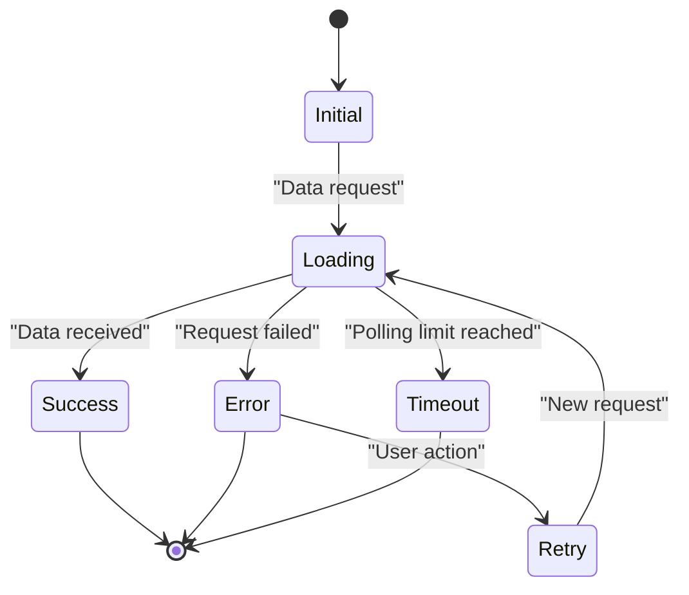
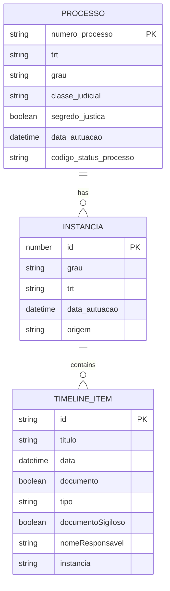
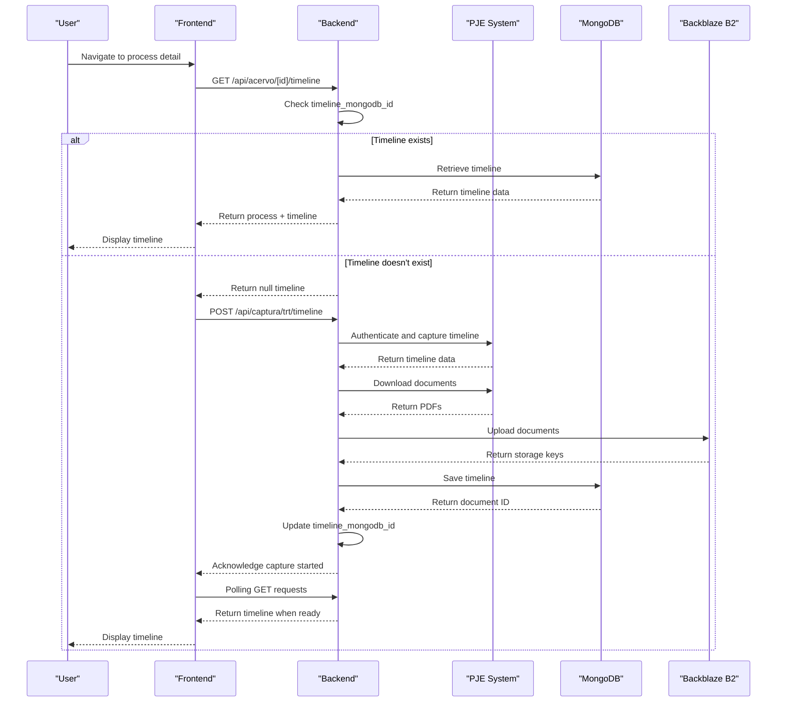

# Process Tracking Components

<cite>
**Referenced Files in This Document**   
- [timeline-container.tsx](file://app/(dashboard)/processos/components/timeline-container.tsx)
- [timeline-item.tsx](file://app/(dashboard)/processos/components/timeline-item.tsx)
- [timeline-loading.tsx](file://app/(dashboard)/processos/components/timeline-loading.tsx)
- [timeline-error.tsx](file://app/(dashboard)/processos/components/timeline-error.tsx)
- [processo-header.tsx](file://app/(dashboard)/processos/components/processo-header.tsx)
- [grau-badges.tsx](file://app/(dashboard)/processos/components/grau-badges.tsx)
- [use-processo-timeline.ts](file://app/_lib/hooks/use-processo-timeline.ts)
- [processo-visualizacao.tsx](file://app/(dashboard)/processos/[id]/processo-visualizacao.tsx)
- [timeline-capture.service.ts](file://backend/captura/services/timeline/timeline-capture.service.ts)
- [route.ts](file://app/api/acervo/[id]/timeline/route.ts)
- [route.ts](file://app/api/captura/trt/timeline/route.ts)
- [add_timeline_mongodb_id_to_acervo.sql](file://supabase/migrations/aplicadas/20251120000001_add_timeline_mongodb_id_to_acervo.sql)
</cite>

## Table of Contents
1. [Introduction](#introduction)
2. [Core Components Overview](#core-components-overview)
3. [TimelineContainer Implementation](#timelinecontainer-implementation)
4. [TimelineItem Component](#timelineitem-component)
5. [Loading and Error States](#loading-and-error-states)
6. [Process Metadata Components](#process-metadata-components)
7. [Data Flow and Integration](#data-flow-and-integration)
8. [Performance Considerations](#performance-considerations)
9. [Accessibility and User Experience](#accessibility-and-user-experience)
10. [Conclusion](#conclusion)

## Introduction

The process tracking system in Sinesys provides a comprehensive visualization of legal process timelines, integrating data captured from the PJE (Processo Judicial Eletrônico) system. This documentation details the implementation of the central components responsible for rendering and managing process timelines, including the TimelineContainer as the primary visualization component, TimelineItem for individual timeline events, and supporting components for handling asynchronous states and process metadata.

The system is designed to provide a unified view of legal processes across multiple instances (first degree, second degree, and superior courts), aggregating timeline data from various sources and presenting it in a chronological, user-friendly format. The implementation leverages a sophisticated data flow that combines frontend components with backend services to ensure efficient data retrieval, caching, and real-time updates.

**Section sources**
- [timeline-container.tsx](file://app/(dashboard)/processos/components/timeline-container.tsx)
- [use-processo-timeline.ts](file://app/_lib/hooks/use-processo-timeline.ts)

## Core Components Overview

The process tracking system consists of several key components that work together to provide a complete timeline visualization:

- **TimelineContainer**: The central component that renders the complete timeline of process events, ordered chronologically.
- **TimelineItem**: Renders individual timeline events, distinguishing between documents and procedural movements.
- **TimelineLoading**: Displays skeleton screens and contextual messages during data loading or capture operations.
- **TimelineError**: Handles and displays error states with appropriate recovery options.
- **TimelineEmpty**: Shows an empty state when a process has been captured but contains no timeline items.
- **ProcessoHeader**: Displays comprehensive metadata about the legal process.
- **GrauBadges**: Indicates the instance levels (graus) of processes in the unified view.

These components are orchestrated by the `useProcessoTimeline` hook, which manages the complex state transitions between loading, capturing, error, and ready states, ensuring a seamless user experience throughout the timeline retrieval process.

**Diagram sources**
- [timeline-container.tsx](file://app/(dashboard)/processos/components/timeline-container.tsx)
- [timeline-item.tsx](file://app/(dashboard)/processos/components/timeline-item.tsx)
- [timeline-loading.tsx](file://app/(dashboard)/processos/components/timeline-loading.tsx)
- [timeline-error.tsx](file://app/(dashboard)/processos/components/timeline-error.tsx)
- [processo-header.tsx](file://app/(dashboard)/processos/components/processo-header.tsx)
- [grau-badges.tsx](file://app/(dashboard)/processos/components/grau-badges.tsx)
- [use-processo-timeline.ts](file://app/_lib/hooks/use-processo-timeline.ts)

**Section sources**
- [timeline-container.tsx](file://app/(dashboard)/processos/components/timeline-container.tsx)
- [timeline-item.tsx](file://app/(dashboard)/processos/components/timeline-item.tsx)
- [timeline-loading.tsx](file://app/(dashboard)/processos/components/timeline-loading.tsx)
- [timeline-error.tsx](file://app/(dashboard)/processos/components/timeline-error.tsx)
- [processo-header.tsx](file://app/(dashboard)/processos/components/processo-header.tsx)
- [grau-badges.tsx](file://app/(dashboard)/processos/components/grau-badges.tsx)

## TimelineContainer Implementation

The TimelineContainer serves as the central component for visualizing legal process timelines. It receives an array of enriched timeline items and renders them in chronological order, with the most recent events appearing first. The component handles sorting, grouping, and presentation of timeline data, providing a comprehensive view of the process history.

Key features of the TimelineContainer include:
- Automatic sorting of timeline items by date in descending order
- Display of summary statistics including total items, documents, and movements
- Visual representation of the timeline with connecting lines between events
- Proper handling of empty states through parent component coordination

The container implements performance optimizations through React's `useMemo` hook to prevent unnecessary re-sorting of items on every render. It also provides a clear visual hierarchy with distinct sections for the timeline header and the list of items, enhancing readability and user comprehension.

**Diagram sources**
- [timeline-container.tsx](file://app/(dashboard)/processos/components/timeline-container.tsx)
- [timeline-item.tsx](file://app/(dashboard)/processos/components/timeline-item.tsx)

**Section sources**
- [timeline-container.tsx](file://app/(dashboard)/processos/components/timeline-container.tsx)

## TimelineItem Component

The TimelineItem component renders individual events in the process timeline, differentiating between documents and procedural movements. Each item displays comprehensive information including the event title, date, responsible party, and additional metadata specific to the item type.

For document-type items, the component provides interactive actions such as viewing and downloading, with appropriate handling of document availability and access restrictions. The UI distinguishes between signed and unsigned documents, as well as public and confidential (sigiloso) documents, using visual indicators and badges.

Key implementation details include:
- Conditional rendering based on whether the item is a document or movement
- Dynamic styling with different colors and icons for documents (blue) versus movements (gray)
- Integration with the Backblaze B2 storage system for document access
- Generation of presigned URLs for secure document viewing
- Error handling for failed document access attempts

The component uses framer-motion for entrance animations, providing a smooth user experience as timeline items appear. It also implements proper accessibility features, including appropriate ARIA labels and keyboard navigation support.

**Diagram sources**
- [timeline-item.tsx](file://app/(dashboard)/processos/components/timeline-item.tsx)

**Section sources**
- [timeline-item.tsx](file://app/(dashboard)/processos/components/timeline-item.tsx)

## Loading and Error States

The process tracking system implements comprehensive handling of asynchronous states through specialized components for loading and error conditions. These components ensure users receive appropriate feedback during data retrieval and potential failure scenarios.

### TimelineLoading Component

The TimelineLoading component displays skeleton screens and contextual messages during various stages of the timeline capture process. It provides granular feedback based on the elapsed time:
- 0-10 seconds: "Iniciando captura da timeline..."
- 10-60 seconds: "Capturando movimentos e documentos do PJE... (isso pode levar alguns minutos)"
- 60-120 seconds: "Baixando documentos e enviando para Google Drive..."
- 120+ seconds: "Processando documentos... Quase pronto!"

The component renders a skeleton version of the ProcessoHeader and timeline items, maintaining the expected layout while data is being loaded. This approach provides users with a clear expectation of the final interface and reduces perceived loading times.

### TimelineError Component

The TimelineError component handles various error scenarios with appropriate messaging and recovery options. It implements error type detection to provide specific guidance:
- Process not found: Indicates the process ID may be incorrect
- Authentication errors: Suggests credential verification
- Timeout errors: Advises users to retry after a delay
- Generic errors: Provides a retry option

The component includes collapsible technical details for debugging purposes while maintaining a user-friendly primary message. It offers appropriate action buttons, including retry functionality and navigation back to the processes list.

**Diagram sources**
- [timeline-loading.tsx](file://app/(dashboard)/processos/components/timeline-loading.tsx)
- [timeline-error.tsx](file://app/(dashboard)/processos/components/timeline-error.tsx)

**Section sources**
- [timeline-loading.tsx](file://app/(dashboard)/processos/components/timeline-loading.tsx)
- [timeline-error.tsx](file://app/(dashboard)/processos/components/timeline-error.tsx)

## Process Metadata Components

The process tracking system includes specialized components for displaying comprehensive metadata about legal processes, enhancing user understanding of the context surrounding the timeline events.

### ProcessoHeader Component

The ProcessoHeader component presents a detailed overview of process metadata in a structured card format. It displays:
- Process number and tribunal information
- Instance level (grau) and origin (acervo geral or arquivado)
- Case classification and confidentiality status
- Filing date and current status
- Adjudicating body and next hearing date
- Plaintiff and defendant information
- Responsible user assignment
- Archiving date (if applicable)

The component supports the unified view mode by displaying information about multiple instances when applicable, including the number of instances and duplicate events removed during aggregation. It uses badges and icons to convey status information efficiently, improving information density without sacrificing readability.

### GrauBadges Component

The GrauBadges component specifically handles the visualization of process instance levels in the unified view. It displays badges for each active instance (first degree, second degree, superior court) with:
- Distinct visual styling based on instance level
- Tooltip information including TRT code, origin, and filing date
- Proper sorting to maintain chronological consistency
- Responsive design for various screen sizes

The component is available in two variants: the full version with tooltips for detailed views, and a simplified version without tooltips for compact spaces like table cells.

**Diagram sources**
- [processo-header.tsx](file://app/(dashboard)/processos/components/processo-header.tsx)
- [grau-badges.tsx](file://app/(dashboard)/processos/components/grau-badges.tsx)

**Section sources**
- [processo-header.tsx](file://app/(dashboard)/processos/components/processo-header.tsx)
- [grau-badges.tsx](file://app/(dashboard)/processos/components/grau-badges.tsx)

## Data Flow and Integration

The process tracking system implements a sophisticated data flow that integrates frontend components with backend services to provide a seamless user experience. The architecture follows a client-server pattern with caching and asynchronous processing capabilities.

### Data Retrieval Process

The data flow begins when a user navigates to a process detail page, triggering the following sequence:

1. The `useProcessoTimeline` hook initiates data retrieval by calling the `/api/acervo/[id]/timeline` endpoint
2. The backend checks if a timeline already exists by verifying the `timeline_mongodb_id` field in the PostgreSQL database
3. If the timeline exists, it is retrieved from MongoDB and returned to the client
4. If no timeline exists, the system returns null, signaling the need for capture

### Automatic Capture Workflow

When a timeline needs to be captured, the system initiates an automatic capture workflow:

1. The frontend triggers a POST request to `/api/captura/trt/timeline` with process details
2. The backend authenticates with the PJE system using stored credentials
3. The timeline is captured from the PJE, including all movements and documents
4. Documents are downloaded and uploaded to Backblaze B2 storage
5. The complete timeline is saved to MongoDB
6. The `timeline_mongodb_id` is updated in the PostgreSQL database

### Polling Mechanism

During the capture process, the frontend implements a polling mechanism to monitor progress:

- Initial polling interval: 5 seconds
- Maximum polling attempts: 120 (10 minutes total)
- Contextual loading messages based on elapsed time
- Background polling that doesn't block user navigation

The unified view functionality aggregates timelines from multiple instances (first degree, second degree, superior court), removing duplicate events and preserving the origin metadata for each item.

**Diagram sources**
- [use-processo-timeline.ts](file://app/_lib/hooks/use-processo-timeline.ts)
- [route.ts](file://app/api/acervo/[id]/timeline/route.ts)
- [route.ts](file://app/api/captura/trt/timeline/route.ts)
- [timeline-capture.service.ts](file://backend/captura/services/timeline/timeline-capture.service.ts)

**Section sources**
- [use-processo-timeline.ts](file://app/_lib/hooks/use-processo-timeline.ts)
- [route.ts](file://app/api/acervo/[id]/timeline/route.ts)
- [route.ts](file://app/api/captura/trt/timeline/route.ts)
- [timeline-capture.service.ts](file://backend/captura/services/timeline/timeline-capture.service.ts)

## Performance Considerations

The process tracking system implements several performance optimizations to handle large timelines efficiently and provide a responsive user experience.

### Frontend Optimizations

- **Memoization**: The TimelineContainer uses `useMemo` to cache sorted items, preventing unnecessary re-sorting on every render
- **Virtualization**: While not explicitly implemented in the current code, the design supports future virtualization for very large timelines
- **Skeleton Screens**: The TimelineLoading component provides immediate visual feedback, reducing perceived loading times
- **Progressive Enhancement**: The interface remains functional during capture operations, allowing users to navigate away and return later

### Backend and Data Storage

- **Dual Storage System**: The architecture uses PostgreSQL for metadata and MongoDB for timeline data, optimizing each database for its specific use case
- **Indexing**: The `timeline_mongodb_id` field is indexed in PostgreSQL to ensure fast lookups
- **Asynchronous Processing**: Timeline capture occurs in the background, preventing blocking of the main application
- **Caching**: Once captured, timelines are stored permanently and retrieved directly without reprocessing

### Scalability Features

- **Polling with Limits**: The 10-minute polling limit prevents infinite waiting while accommodating lengthy capture operations
- **Unified View Efficiency**: The aggregation of multiple instances into a single timeline reduces the number of required API calls
- **Conditional Capture**: The system only initiates capture when necessary, avoiding redundant operations

The implementation balances performance with user experience, ensuring that even complex timelines with hundreds of items load efficiently while maintaining interactive responsiveness.

**Section sources**
- [timeline-container.tsx](file://app/(dashboard)/processos/components/timeline-container.tsx)
- [use-processo-timeline.ts](file://app/_lib/hooks/use-processo-timeline.ts)
- [add_timeline_mongodb_id_to_acervo.sql](file://supabase/migrations/aplicadas/20251120000001_add_timeline_mongodb_id_to_acervo.sql)

## Accessibility and User Experience

The process tracking components are designed with accessibility and user experience as primary considerations, ensuring the interface is usable by all users regardless of ability or context.

### Accessibility Features

- **Semantic HTML**: Components use appropriate HTML elements and ARIA attributes
- **Keyboard Navigation**: All interactive elements are accessible via keyboard
- **Screen Reader Support**: Comprehensive labeling and descriptive text for assistive technologies
- **Color Contrast**: Sufficient contrast ratios for text and interactive elements
- **Focus Management**: Clear visual indicators for focused elements

### User Experience Design

- **Clear Status Indicators**: Distinct visual states for loading, error, and success conditions
- **Contextual Messaging**: Error messages provide specific guidance for resolution
- **Progressive Disclosure**: Technical details are available but collapsed by default
- **Consistent Navigation**: Standard breadcrumb patterns and back buttons
- **Responsive Design**: Components adapt to various screen sizes and orientations

The interface follows established design patterns while incorporating domain-specific requirements for legal process tracking. The use of icons, badges, and color coding enhances information comprehension without relying solely on visual cues.

**Section sources**
- [timeline-container.tsx](file://app/(dashboard)/processos/components/timeline-container.tsx)
- [timeline-item.tsx](file://app/(dashboard)/processos/components/timeline-item.tsx)
- [timeline-loading.tsx](file://app/(dashboard)/processos/components/timeline-loading.tsx)
- [timeline-error.tsx](file://app/(dashboard)/processos/components/timeline-error.tsx)

## Conclusion

The process tracking components in Sinesys provide a robust and user-friendly interface for visualizing legal process timelines. The system's architecture effectively integrates frontend presentation with backend data capture and storage, creating a seamless experience for users tracking complex legal proceedings.

Key strengths of the implementation include:
- Comprehensive handling of asynchronous states with clear user feedback
- Efficient data flow with caching and conditional capture
- Support for unified views across multiple process instances
- Accessibility-focused design that accommodates diverse user needs
- Performance optimizations for handling large timelines

The modular component structure allows for easy maintenance and future enhancements, while the well-defined data flow ensures reliability and scalability. As legal processes continue to generate increasing amounts of digital data, this system provides a solid foundation for effective process tracking and analysis.

**Section sources**
- [timeline-container.tsx](file://app/(dashboard)/processos/components/timeline-container.tsx)
- [use-processo-timeline.ts](file://app/_lib/hooks/use-processo-timeline.ts)