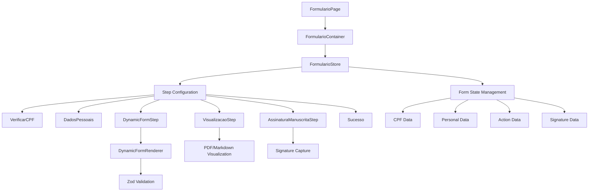
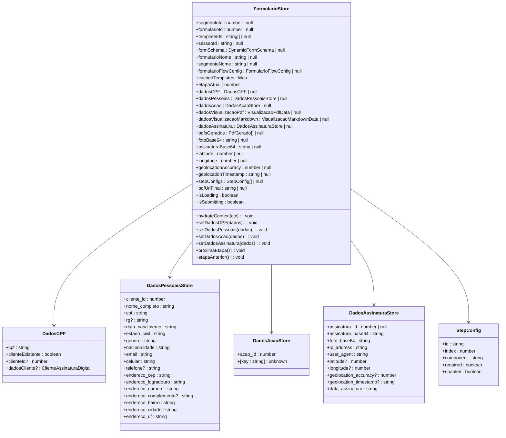
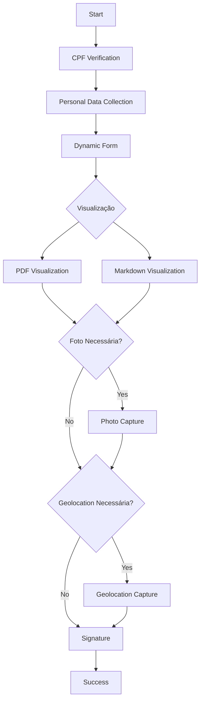
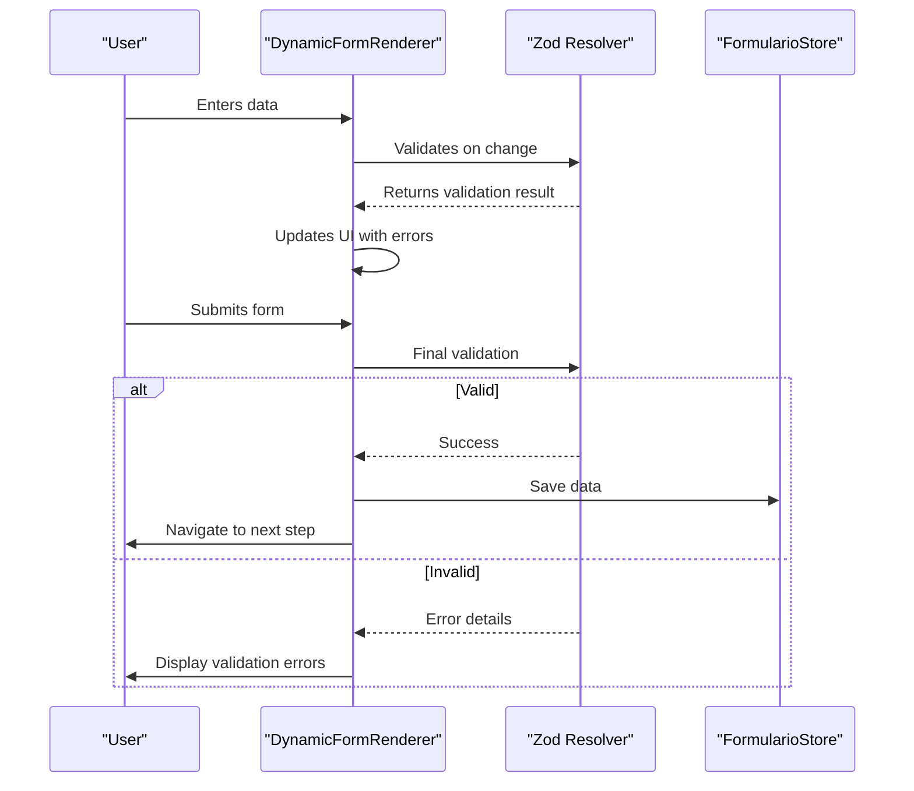
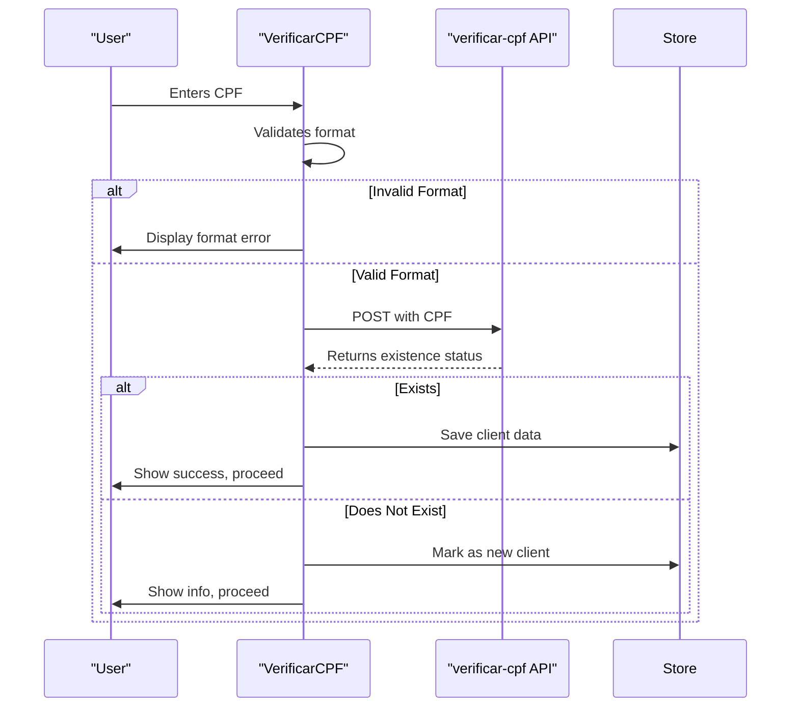
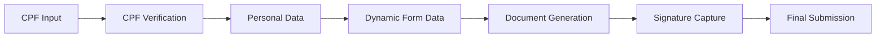
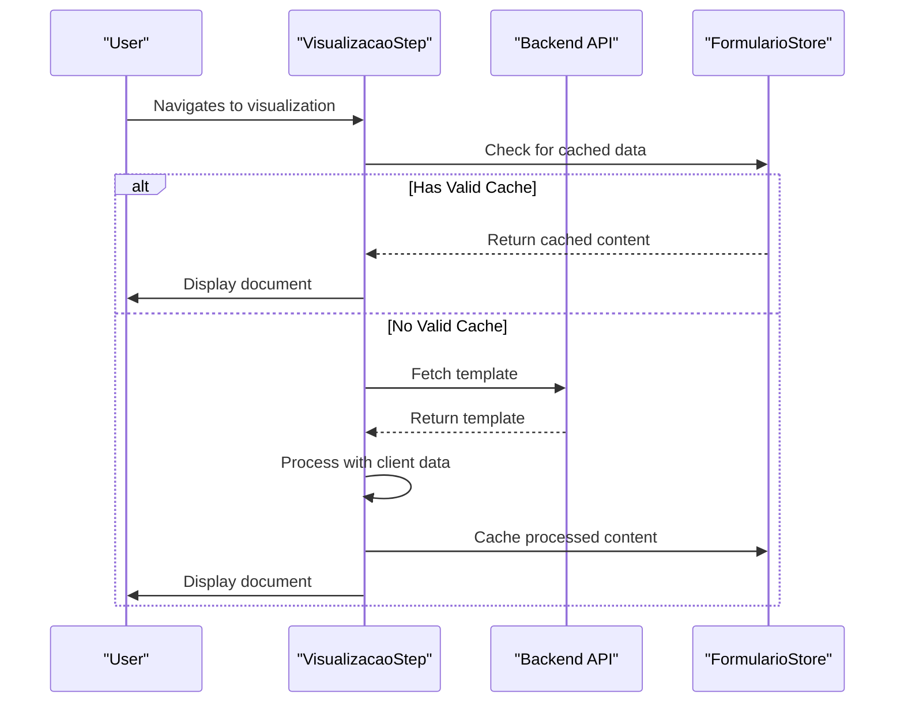

# Form Building

<cite>
**Referenced Files in This Document**   
- [formulario-container.tsx](file://components/assinatura-digital/form/formulario-container.tsx)
- [dynamic-form-renderer.tsx](file://components/assinatura-digital/form/dynamic-form-renderer.tsx)
- [form-step-layout.tsx](file://components/assinatura-digital/form/form-step-layout.tsx)
- [formulario-page.tsx](file://components/assinatura-digital/form/formulario-page.tsx)
- [dados-pessoais.tsx](file://components/assinatura-digital/form/dados-pessoais.tsx)
- [verificar-cpf.tsx](file://components/assinatura-digital/form/verificar-cpf.tsx)
- [assinatura-manuscrita-step.tsx](file://components/assinatura-digital/form/assinatura-manuscrita-step.tsx)
- [visualizacao-markdown-step.tsx](file://components/assinatura-digital/form/visualizacao-markdown-step.tsx)
- [visualizacao-pdf-step.tsx](file://components/assinatura-digital/form/visualizacao-pdf-step.tsx)
- [formulario-store.ts](file://app/_lib/stores/assinatura-digital/formulario-store.ts)
- [formulario.types.ts](file://types/assinatura-digital/formulario.types.ts)
</cite>

## Table of Contents
1. [Introduction](#introduction)
2. [Architecture Overview](#architecture-overview)
3. [Form State Management](#form-state-management)
4. [Step-Based Navigation System](#step-based-navigation-system)
5. [Form Validation and Error Handling](#form-validation-and-error-handling)
6. [Form Data Structure and Processing](#form-data-structure-and-processing)
7. [Integration with Backend Services](#integration-with-backend-services)
8. [Common Issues and Troubleshooting](#common-issues-and-troubleshooting)
9. [Form Lifecycle and Template Integration](#form-lifecycle-and-template-integration)
10. [Conclusion](#conclusion)

## Introduction
The Sinesys form building system provides a comprehensive solution for creating dynamic, multi-step forms with advanced features including CPF verification, personal data collection, and digital signature capture. The architecture is designed to support complex workflows while maintaining a consistent user experience across different form types and use cases. This document details the implementation of the dynamic form renderer, its state management system, validation mechanisms, and integration with backend services for data persistence.

## Architecture Overview

The form building components in Sinesys follow a modular architecture centered around a state management system that coordinates the multi-step form workflow. The core components work together to provide a seamless experience from form initialization to submission.

**Diagram sources**
- [formulario-container.tsx](file://components/assinatura-digital/form/formulario-container.tsx)
- [formulario-store.ts](file://app/_lib/stores/assinatura-digital/formulario-store.ts)
- [dynamic-form-renderer.tsx](file://components/assinatura-digital/form/dynamic-form-renderer.tsx)

## Form State Management

The form state is managed through a centralized Zustand store that maintains all data across the multi-step workflow. This approach ensures consistency and enables seamless navigation between steps without data loss.

### State Structure
The `FormularioStore` maintains several key data structures that represent different stages of the form completion process:

- **DadosCPF**: Stores CPF verification results and client existence status
- **DadosPessoaisStore**: Contains personal information including name, contact details, and address
- **DadosAcaoStore**: Holds action-specific data collected through dynamic forms
- **DadosAssinaturaStore**: Manages signature and security metadata
- **StepConfig**: Defines the navigation flow and enabled steps

The store implements a hydration pattern where the `hydrateContext` method resets the state and initializes it with new context data in a single atomic operation, preventing intermediate inconsistent states.

**Diagram sources**
- [formulario-store.ts](file://app/_lib/stores/assinatura-digital/formulario-store.ts)
- [formulario.types.ts](file://types/assinatura-digital/formulario.types.ts)

**Section sources**
- [formulario-store.ts](file://app/_lib/stores/assinatura-digital/formulario-store.ts#L9-L213)

## Step-Based Navigation System

The form navigation system implements a dynamic step configuration that adapts to the specific requirements of each form. The `FormularioContainer` component manages the step flow by building a configuration based on the form's requirements.

### Step Configuration
The step configuration is dynamically generated based on the form's flow configuration, which determines which steps are required:

**Diagram sources**
- [formulario-container.tsx](file://components/assinatura-digital/form/formulario-container.tsx#L39-L87)

The `buildStepConfigs` function in `FormularioContainer` constructs the step configuration array based on the form's requirements for photo capture and geolocation. This allows the system to dynamically include or exclude steps based on the specific form configuration.

Navigation between steps is handled through the `proximaEtapa` and `etapaAnterior` actions in the store, which increment or decrement the `etapaAtual` index. The current step is rendered by matching this index with the corresponding `StepConfig` in the `stepConfigs` array.

### Step Layout Component
The `FormStepLayout` component provides a consistent UI for all form steps, including:
- Step title and description
- Progress indicator showing current step out of total steps
- Navigation buttons for previous and next steps
- Loading states during form submission

The component accepts props to customize behavior, including form ID for submission handling, loading states, and button labels.

**Section sources**
- [formulario-container.tsx](file://components/assinatura-digital/form/formulario-container.tsx#L20-L331)
- [form-step-layout.tsx](file://components/assinatura-digital/form/form-step-layout.tsx#L1-L135)

## Form Validation and Error Handling

The form validation system combines client-side validation with server-side verification to ensure data integrity throughout the form workflow.

### Zod-Based Validation
Dynamic forms use Zod schemas for validation, with the `DynamicFormRenderer` component generating validation rules from the form schema:

**Diagram sources**
- [dynamic-form-renderer.tsx](file://components/assinatura-digital/form/dynamic-form-renderer.tsx#L48-L437)

The validation process includes:
- Real-time validation on field changes (`mode: 'onChange'`)
- Schema generation from dynamic form configuration
- Conditional field rendering based on other field values
- Custom validation functions for business rules

### CPF Verification
The CPF verification step implements a two-phase validation process:
1. Client-side format validation using the `validateCPF` function
2. Server-side existence check via the `verificar-cpf` API endpoint

**Diagram sources**
- [verificar-cpf.tsx](file://components/assinatura-digital/form/verificar-cpf.tsx#L1-L172)

### Personal Data Validation
The personal data collection step implements comprehensive validation for all fields, including:
- CPF format and digit validation
- Date of birth validation (not in future, reasonable age range)
- Email format validation
- Brazilian phone number validation
- CEP (postal code) format validation
- Text length limits for address fields

The validation occurs both on individual field changes and before form submission, with detailed error messages displayed for each invalid field.

**Section sources**
- [dados-pessoais.tsx](file://components/assinatura-digital/form/dados-pessoais.tsx#L1-L760)
- [dynamic-form-renderer.tsx](file://components/assinatura-digital/form/dynamic-form-renderer.tsx#L48-L437)

## Form Data Structure and Processing

The form system processes data through a structured workflow that transforms user input into persisted records.

### Data Flow
The data flows through the system in a sequential manner:

**Diagram sources**
- [formulario-container.tsx](file://components/assinatura-digital/form/formulario-container.tsx)
- [formulario-store.ts](file://app/_lib/stores/assinatura-digital/formulario-store.ts)

### Data Transformation
When personal data is submitted, the system transforms the form data into a standardized format for storage:

1. CPF is normalized to digits only
2. Phone numbers are normalized to Brazilian format
3. Address data is structured with proper formatting
4. Text fields are validated against length limits

The `mapClienteFormToCliente` function handles this transformation, preparing the data for API submission.

### Document Visualization
The system supports two document visualization methods:

**PDF Visualization:**
- Generates a PDF preview via the `/api/gerar-pdf-preview` endpoint
- Caches the PDF URL with a 5-minute TTL
- Auto-regenerates when underlying data changes

**Markdown Visualization:**
- Processes template Markdown with variable interpolation
- Renders responsive content using ReactMarkdown
- Caches processed content with 5-minute TTL
- Supports multiple templates with selection UI

**Diagram sources**
- [visualizacao-markdown-step.tsx](file://components/assinatura-digital/form/visualizacao-markdown-step.tsx#L1-L361)
- [visualizacao-pdf-step.tsx](file://components/assinatura-digital/form/visualizacao-pdf-step.tsx#L1-L423)

**Section sources**
- [visualizacao-markdown-step.tsx](file://components/assinatura-digital/form/visualizacao-markdown-step.tsx#L1-L361)
- [visualizacao-pdf-step.tsx](file://components/assinatura-digital/form/visualizacao-pdf-step.tsx#L1-L423)

## Integration with Backend Services

The form system integrates with backend services through a well-defined API contract for data persistence and document generation.

### API Endpoints
Key API endpoints used by the form system:

| Endpoint | Method | Purpose |
|---------|--------|-------|
| `/api/verificar-cpf` | POST | Check if client exists by CPF |
| `/api/salvar-cliente` | POST | Save or update client personal data |
| `/api/gerar-pdf-preview` | POST | Generate document preview |
| `/api/finalizar-assinatura` | POST | Complete signature process and generate final documents |

### Data Persistence
The form data is persisted through a multi-step process:

1. **CPF Verification**: Check client existence
2. **Personal Data**: Save client information
3. **Action Data**: Save form-specific data
4. **Signature**: Finalize and generate documents

Each step makes API calls to persist data, with appropriate error handling and retry mechanisms.

### Security Metadata
The system captures security metadata during the signature process:
- Client IP address
- User agent string
- Geolocation data (if enabled)
- Session ID for grouping related signatures

This metadata is included in the final submission to provide audit trail information.

**Section sources**
- [dados-pessoais.tsx](file://components/assinatura-digital/form/dados-pessoais.tsx#L1-L760)
- [assinatura-manuscrita-step.tsx](file://components/assinatura-digital/form/assinatura-manuscrita-step.tsx#L1-L634)

## Common Issues and Troubleshooting

The form system includes mechanisms to handle common issues that may arise during form completion.

### Form State Management Issues
- **Incomplete Submissions**: The system uses the `sessaoId` to group related actions, allowing recovery from incomplete submissions
- **Data Consistency**: Validation checks ensure that critical data (CPF, email, phone) is consistent across steps
- **Cache Invalidation**: The system automatically invalidates cached document previews when underlying data changes

### Validation Error Display
The system provides clear feedback for validation errors:
- Inline error messages for individual fields
- Toast notifications for form-level issues
- Detailed error descriptions with actionable guidance
- Retry mechanisms for transient errors

### Handling Incomplete Submissions
The form state is preserved in the store, allowing users to:
- Navigate back and forth between steps
- Resume form completion if interrupted
- Maintain data consistency across navigation

The `hydrateContext` method ensures that starting a new form properly resets all state, preventing data leakage between sessions.

**Section sources**
- [formulario-store.ts](file://app/_lib/stores/assinatura-digital/formulario-store.ts#L254-L285)
- [assinatura-manuscrita-step.tsx](file://components/assinatura-digital/form/assinatura-manuscrita-step.tsx#L78-L614)

## Form Lifecycle and Template Integration

The complete form lifecycle spans from initialization to final submission, with integration points for template-based document generation.

### Form Initialization
The form lifecycle begins with the `FormularioPage` component, which:
1. Receives form context (segment, form, templates)
2. Initializes the store with `hydrateContext`
3. Renders the `FormularioContainer`

### Dynamic Form Rendering
The `DynamicFormRenderer` component handles the rendering of dynamic forms based on a schema that defines:
- Form sections and fields
- Field types and validation rules
- Conditional logic for field visibility
- Default values and options

### Template System Integration
The system supports multiple templates per form, allowing users to select different document variants. The template integration includes:
- Template metadata caching to reduce API calls
- Automatic template selection for single-template forms
- UI for template selection when multiple templates are available
- Cache management for template content

### Final Submission Process
The signature step orchestrates the final submission:
1. Validates all required data is present
2. Captures signature and optional photo
3. Collects security metadata (IP, geolocation)
4. Generates documents for all associated templates
5. Handles partial failures gracefully
6. Displays success state with generated documents

The process uses retry mechanisms with exponential backoff to handle transient API failures, ensuring reliable document generation.

**Section sources**
- [formulario-page.tsx](file://components/assinatura-digital/form/formulario-page.tsx#L1-L69)
- [assinatura-manuscrita-step.tsx](file://components/assinatura-digital/form/assinatura-manuscrita-step.tsx#L78-L614)

## Conclusion
The Sinesys form building system provides a robust, flexible solution for creating multi-step forms with advanced features. The architecture centers around a centralized state management system that coordinates the form workflow, with modular components handling specific steps in the process. Key strengths include dynamic step configuration, comprehensive validation, seamless state management, and robust integration with backend services for data persistence and document generation. The system handles common issues through thoughtful error handling and provides a consistent user experience across different form types and use cases.